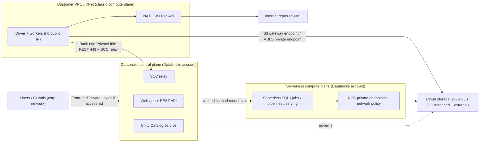
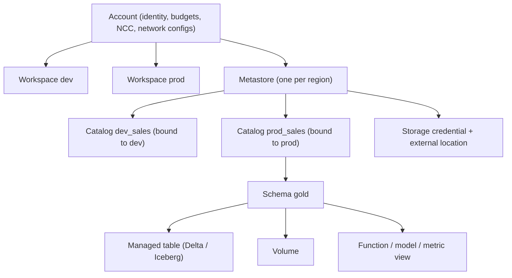

# M3 Databricks platform
> Last verified: 2026-10 · Audience: senior/staff DevOps, SRE, AI eng, NetEng, DevSecOps, architects

## TL;DR
- **Two planes.** The **control plane** (web app, REST APIs, job scheduler, Unity Catalog services) always runs in Databricks' cloud account. The **compute plane** is either **classic**, running in *your* VPC/VNet with your VMs on your cloud bill, or **serverless**, running in Databricks' account with compute included in the DBU price.
- **Hierarchy:** **account → workspaces + Unity Catalog metastores** (at most one metastore per region, shared by many workspaces) → `catalog.schema.object`. Identity (SCIM/Entra), networking objects (NCC, network configs), budgets and metastores sit at **account** level.
- **Unity Catalog (UC)** is the governance spine. It covers tables, views, volumes, functions, models, connections and AI services. Managed and external storage is reached through **storage credentials + external locations**. On top sit privileges, **row filters/column masks/ABAC** (tag-driven policies), lineage, **system tables**, **OpenSharing** (the protocol formerly called Delta Sharing), **Lakehouse Federation**, and **managed Iceberg** with an Iceberg REST catalog.
- **Network story to tell:** **secure cluster connectivity** (no public IPs, outbound-only relay) + **customer-managed VPC / VNet injection** + **PrivateLink front-end and back-end** + **IP access lists** for classic. For serverless, use an **NCC** (private endpoints, stable egress) plus **serverless egress control** (network policies). **CMK** is applied separately to managed services and to workspace storage.
- **Naming as of 2026:** Workflows → **Lakeflow Jobs**. DLT → Lakeflow Declarative Pipelines → **Lakeflow pipelines**, which build on the open-source **Apache Spark Declarative Pipelines**. Databricks Asset Bundles → **Declarative Automation Bundles**. Mosaic AI Gateway → **Unity Gateway**. Cluster policies → **compute policies**. Budget policies → **serverless usage policies**. Shared/single-user access modes → **standard/dedicated**.
- **Cost = DBUs × SKU rate (+ cloud VMs, disks, NAT and egress for classic).** Rates by SKU, highest to lowest: all-purpose > jobs. Serverless DBUs bundle the infrastructure. Attribute costs with **tags + `system.billing.usage` joined to `system.billing.list_prices`**.
- **Azure Databricks is a Microsoft first-party service.** It uses Entra ID, an ARM resource with a managed resource group, the Azure invoice/MACC, and Fabric mirroring of UC. Databricks on AWS is a Marketplace/direct-contract SaaS that uses IAM cross-account roles. The **Standard tier on Azure reached end of life on 2026‑10‑01** (auto-upgraded to Premium).

## M3.1 Architecture: control plane, compute plane, accounts, workspaces, metastores
- **How it works:**
  - **Control plane** (Databricks-managed): web UI, REST API, notebooks metadata, job scheduler, cluster manager, UC metastore service, query history, secrets.
  - **Compute plane:**
    - **Classic.** Spark driver/worker VMs run in **your** AWS account (EC2 in your VPC) or Azure subscription (VMs in the **managed resource group**, inside your VNet when you use VNet injection).
    - **Serverless.** Serverless notebooks, jobs, pipelines, SQL warehouses and model serving run in **Databricks' account**, with multiple layers of isolation between customers.
  - **Workspace storage:**
    - **Classic workspace on AWS.** Needs a customer S3 **workspace storage bucket** holding system data, workspace catalog storage and legacy DBFS root.
    - **Serverless workspace.** Uses Databricks-managed **default storage**. Your own buckets are optional.
    - **Azure.** The workspace storage account lives in the managed RG, which has a deny assignment, so you can't modify it.
  - **Account** = the top-level object. It holds identity (users, groups, service principals; SCIM; Entra on Azure), workspaces, metastores, network/credential configs, budgets, and the account console/APIs.
  - **Metastore** = the top UC container. Allowed: **one per region**, linked to many workspaces in that region. UC is auto-enabled for workspaces created after **2023‑11‑08**.
  - **Tiers:**
    - **AWS:** Premium and Enterprise. The Enterprise tier is needed for CMK, PrivateLink and the compliance security profile. Whether the AWS Standard tier is fully gone is **(unverified)**.
    - **Azure:** Standard tier is end of life. Since **2026‑04‑01**, all new workspaces must be Premium. Remaining Standard workspaces were auto-upgraded on **2026‑10‑01**. Premium adds UC, DBSQL, Lakeflow pipelines, serverless, Lakebase and Mosaic AI.
- **Trade-offs / when to use:**
  - **Classic.** You control VPC/VNet, egress inspection (NVA/firewall), instance types, GPUs, init scripts and custom containers. You also pay the cloud bill and wait about 4–5 min for startup.
  - **Serverless.** Startup in seconds. No VM, NAT or capacity management. Cloud costs are folded into DBUs. You need NCC and network policies for private and egress control. Fewer knobs: no init scripts, limited libraries and runtimes.
  - **Workspace topology:**
    - Split workspaces per **environment** (dev/stg/prd) and per **business unit or blast radius**, and share **one metastore per region**.
    - Isolate data with **catalog-workspace binding**, not with separate metastores.
- **Interview angles:**
  - *"Where does my data live?"* → Data stays in your cloud object storage (S3/ADLS). This holds for both classic and serverless; serverless reads it through UC-vended, scoped credentials. The control plane stores metadata, notebooks, query text and results caches. Encrypt those with CMK (managed services).
  - *"Multi-region DR?"* → Metastores are regional. Use one workspace + metastore per region, replicate data (Delta deep clone / storage replication / OpenSharing), and keep jobs and infra in **bundles/Terraform** so you can redeploy. The control plane is Databricks' responsibility, but **regional**.
  - **Pitfall:** saying "one metastore per workspace". That is a legacy Hive metastore mental model.

## M3.2 Compute types, Photon, policies, pools, spot
- **How it works:**

| Compute | Plane | Use | Notes |
|---|---|---|---|
| **All-purpose (classic)** | Classic | Interactive notebooks, dev | Highest DBU rate; access modes **standard** (multi-user, Lakeguard isolation; formerly "shared") and **dedicated** (single user/group; formerly "single user") |
| **Jobs compute** | Classic | Automated jobs; ephemeral, created per run | Much cheaper DBU rate than all-purpose; terminates after run |
| **Serverless notebooks / jobs / pipelines** | Serverless | Default for new workloads | Seconds to start; auto-scaling; serverless notebooks have a default **2.5 h** execution timeout (overspend protection) |
| **SQL warehouses** | Serverless / Pro / Classic | BI, SQL ETL | See M3.7 |
| **Model Serving / Vector Search** | Serverless | AI | See M3.8 |
| **Instance pools** | Classic | Cut cluster start/scale time | Idle warm instances incur **cloud VM cost only, no DBUs** |

  - **Photon** = Databricks' vectorized C++ query engine. It speeds up SQL and DataFrame workloads. It is on by default for SQL warehouses and serverless. On classic, it applies a higher DBU multiplier, so check that the speedup is bigger than the multiplier.
  - **Lakeguard** = the isolation layer that lets **standard** (shared) access mode run multiple users' code safely while UC fine-grained controls stay enforced.
  - **Compute policies** (formerly cluster policies) are JSON rules on cluster attributes.
    - Rule types: `fixed`, `forbidden`, `allowlist`, `blocklist`, `regex`, `range`, `unlimited`.
    - Built-in families: **Personal Compute, Shared Compute, Power User, Job Compute**.
    - Policies can cap **max compute per user** and **max DBUs/hour**, enforce **custom tags** for chargeback, and install up to **500 libraries per policy**.
    - The `CAN_USE` permission is granted per policy.
    - Changes are enforced on next restart, or immediately via a compliance scan. Databricks does **not** terminate clusters to bring them under a new limit.
  - **Spot:**
    - **AWS:** `aws_attributes.availability = SPOT_WITH_FALLBACK` and `first_on_demand = 1`, so the driver stays on-demand.
    - **Azure:** `azure_attributes.availability = SPOT_WITH_FALLBACK_AZURE` and `spot_bid_max_price = -1`, so you pay up to the on-demand price.
    - Executor loss is handled by Spark task retry. Driver loss kills the job.
- **Trade-offs / when to use:**
  - Production pipelines → **jobs compute or serverless jobs**, never all-purpose clusters. Running prod on all-purpose is the classic cost anti-pattern.
  - Streaming 24×7 on classic jobs compute is often cheaper than serverless. Bursty or short jobs favour serverless, which has no idle cost and no startup tax.
  - GPUs, custom containers, init scripts and specific instance families → classic.
- **Interview angles:**
  - *"Reduce cluster start latency"* → pools (classic) or serverless. Pre-warm pools only during business hours, because idle pool VMs still cost money.
  - *"Stop users creating 64-node GPU clusters"* → compute policy (allowlist of node types, `range` on workers and autotermination, `dbus_per_hour` cap) + no unrestricted cluster creation entitlement.
  - **Pitfall:** standard access mode doesn't support some workloads, such as RDD APIs, some ML runtimes and arbitrary JVM. In that case use dedicated mode. On dedicated mode, UC fine-grained controls on filtered or masked tables are enforced by offloading to serverless.

## M3.3 Unity Catalog: namespace, storage, credentials, privileges
- **How it works:**
  - Securable hierarchy:
    - **metastore → catalog → schema → {table, view, materialized view, streaming table, volume, function, registered model, metric view}**
    - Also at metastore level: **storage credentials, external locations, connections, shares/recipients/providers, clean rooms, services (AI/MCP)**.
  - **Managed vs external:**
    - **Managed tables/volumes:** UC owns both governance **and** the storage lifecycle.
      - Data lives at the managed location (schema → catalog → metastore fallback).
      - **Predictive optimization** (OPTIMIZE/VACUUM/ANALYZE, automatic liquid clustering) is on by default for accounts created on or after **2024‑11‑11**.
      - `DROP` keeps files for a **7-day** recovery window, configurable from **0 h to 30 days** at catalog/schema level, so you can `UNDROP`.
      - Formats: **Delta (default) or Iceberg** (`USING iceberg`).
    - **External tables/volumes:** UC governs access only. Files live at a path you manage, and `DROP` doesn't delete data. Typical use: existing data lakes and shared paths.
  - **Volumes** hold non-tabular files (images, PDFs, wheels, checkpoints) at `/Volumes/<cat>/<schema>/<vol>/…`. They replace DBFS mounts, which are legacy and ungoverned.
  - **Storage credential:**
    - **AWS:** an IAM role trusted by Databricks' UC role, with an external ID and a self-assume trust.
    - **Azure:** a managed identity via the **Access Connector for Azure Databricks** (preferred), or an Entra service principal.
    - **External location** = storage credential + path prefix. It is the unit you `GRANT READ FILES / WRITE FILES / CREATE EXTERNAL TABLE` on.
  - **Privileges:**
    - Common ones: `USE CATALOG`, `USE SCHEMA`, `SELECT`, `MODIFY`, `CREATE TABLE/SCHEMA/VOLUME`, `READ/WRITE VOLUME`, `EXECUTE`, `BROWSE` (metadata discovery without data access), `MANAGE`, `ALL PRIVILEGES`.
    - Grants **inherit downward**: `SELECT` on a catalog applies to every current and future table.
    - Owners (prefer groups) can grant.
    - A user needs `USE CATALOG` + `USE SCHEMA` + `SELECT` to read a table.
  - **Workspace binding** (catalog isolation mode `ISOLATED`) limits which workspaces can see a catalog, e.g. `prod` is visible only from prod workspaces. Credentials and external locations can be bound the same way.
  - **Credential vending:** UC hands out short-lived, down-scoped cloud credentials. External engines (Spark, Trino, DuckDB, Snowflake) read managed tables through the **Unity REST API / Iceberg REST Catalog**.
- **Trade-offs / when to use:**
  - **Managed tables are the default.** They are cheaper and self-optimizing, and they unlock predictive optimization, managed Iceberg and governed external access. Use external tables only when other systems must write the same paths directly.
  - Map **catalog = environment × domain** (`prod_sales`) or **catalog = domain** with workspace binding. Avoid one catalog per team per table.
- **Interview angles:**
  - *"Migrate from Hive metastore/Glue"* → use `SYNC`/UCX, or **Hive metastore federation**, which mounts HMS/Glue as a foreign catalog without moving data. Then convert to managed tables.
  - *"How does UC stop someone reading S3 directly?"* → Give users no bucket IAM. Only UC storage credentials can reach the bucket, and compute gets vended, path-scoped temporary credentials. Add bucket policies limited to the Databricks roles or VPC endpoints.
  - **Pitfall:** granting `ALL PRIVILEGES` at catalog level to app service principals. **Pitfall:** pointing overlapping external locations at managed storage paths, which UC blocks.

## M3.4 Unity Catalog: fine-grained access, lineage, system tables, sharing, federation, Iceberg
- **How it works:**
  - **Row filters / column masks:** a SQL UDF attached with `ALTER TABLE … SET ROW FILTER fn ON (col)` / `ALTER COLUMN … SET MASK fn`. The UDF can check `is_account_group_member()`.
  - **ABAC:**
    - Policies reference **governed tags**, e.g. `pii=ssn`.
    - Attach them at catalog/schema/table level and they **inherit dynamically** to any object carrying the tag.
    - **Row filter and column mask policies are GA.** **GRANT policies are GA.** **DENY policies and metastore-level policies are in Beta.**
    - Use ABAC for scale. Use manual per-table filters for one-offs.
  - **Data classification** auto-tags sensitive columns, which feeds ABAC.
  - **Lineage:** captured automatically at table and column level across notebooks, jobs, pipelines and DBSQL. Exposed in Catalog Explorer and `system.access.table_lineage` / `column_lineage`.
  - **System tables** (`system.*`):
    - Schemas: `billing.usage`, `billing.list_prices`, `access.audit`, `access.*_lineage`, `compute.clusters/warehouses/node_timeline`, `lakeflow.jobs/job_run_timeline/pipelines`, `query.history`.
    - Retention: **365 days** free for most tables. Exceptions: `node_timeline` 90 d, MLflow 180 d, Lakebase observability 7 d.
    - Data is stored in the metastore's region. Billing, pricing and workspaces are **global**. Most other tables are regional.
    - Access: account and metastore admins by default; others need `USE CATALOG/USE SCHEMA/SELECT`.
  - **OpenSharing** (protocol formerly called Delta Sharing; Databricks docs now use this name):
    - **Databricks-to-Databricks:** UC to UC, cross-cloud and cross-region, no tokens. It can share tables, views, streaming tables, **managed Iceberg** tables, **volumes, notebooks, models and metric views**.
    - **Open sharing:** bearer token or **OIDC federation** to any client (Spark, pandas, Power BI). It shares tables, views, streaming tables and managed Iceberg tables.
    - OpenSharing underpins **Marketplace** and **Clean Rooms**.
  - **Lakehouse Federation:**
    - **Query federation:** a UC **connection** + **foreign catalog** over MySQL, PostgreSQL, SQL Server, Snowflake, Redshift, BigQuery, Synapse, Oracle, Teradata and others. Pushes predicates down. UC governs access.
    - **Catalog federation:** reads Hive metastore, AWS Glue or Snowflake Horizon tables **directly from storage**, which is faster than pushing queries down.
  - **Iceberg:**
    - **Managed Iceberg tables** (`CREATE TABLE … USING iceberg`) are first-class in UC and readable or writable by external engines via the **Iceberg REST Catalog**.
    - **UniForm** (Delta with Iceberg metadata) lets Iceberg readers read Delta tables.
    - Whether managed Iceberg is GA in every region is **(unverified)**.
- **Trade-offs / when to use:**
  - Federation is good for **exploration and migration** but adds source load and latency. Ingest hot data with Lakeflow Connect.
  - OpenSharing keeps one copy of the data, but cross-region or cross-cloud reads incur **egress**. For high-volume consumers, replicate or use cached shares.
- **Interview angles:**
  - *"Mask SSNs for everyone except the HR group across 500 tables"* → classification/governed tag `pii` → one **ABAC column-mask policy** at catalog level. This beats 500 per-table masks.
  - *"Who changed this table and who reads it downstream?"* → `system.access.audit` + lineage tables.
  - *"Share data with a partner running Snowflake"* → open sharing (OIDC federation preferred over long-lived bearer tokens) or Iceberg REST with credential vending.

## M3.5 Networking and security (AWS vs Azure)
- **How it works (classic plane):**
  - **Secure cluster connectivity (SCC / "No Public IP").**
    - Cluster nodes have **no public IPs and no open inbound ports**.
    - Nodes open **outbound** TLS to the control plane's **SCC relay**, and control traffic flows back over that tunnel.
    - Egress goes via NAT GW (AWS) or NAT Gateway/firewall (Azure).
  - **AWS customer-managed VPC:**
    - Needs **≥2 subnets in different AZs**, each with a **netmask from /17 to /26**.
    - Each node uses **2 IPs**, so max nodes ≈ free IPs ÷ 2.
    - Subnets can be shared across workspaces, with **one workspace subnet per AZ**.
    - Outbound route via NAT GW + IGW.
    - SG egress: all traffic within the SG, plus TCP **443, 3306, 53, 6666, 2443, 5432, 8443–8451** to the internet or endpoints.
    - Recommended endpoints: **S3 gateway endpoint**, plus **STS and Kinesis interface endpoints**.
  - **Azure VNet injection:**
    - VNet must be **/16 to /24**, in the same region and subscription as the workspace.
    - Needs **two dedicated subnets**, host ("public") and container ("private"). Each should be **≥ /26** (/28 allowed but not recommended). Subnets **cannot be shared across workspaces**. **CIDRs are immutable** after deploy; network config updates are in Public Preview.
    - Subnets are **delegated to `Microsoft.Databricks/workspaces`**, with auto-managed NSG rules. Outbound to `AzureDatabricks` service tag on **443, 3306, 8443–8451**, plus Storage 443, EventHub 9093 and Sql 3306.
    - Each node uses **2 IPs** (host + container), on top of Azure's **5 reserved IPs** per subnet.
    - **After 2026‑03‑31, new VNets have no default outbound access.** Attach a **NAT Gateway** (stable egress IP) or a UDR to a firewall.
  - **PrivateLink:**
    - **AWS** (Enterprise tier; customer-managed VPC + SCC):
      - **Back-end** = two VPC interface endpoints, **workspace (REST API)** and **SCC relay**, in the workspace VPC.
      - **Front-end** = a workspace endpoint in a **transit VPC** reached from on-prem via DX/VPN.
      - A **private access settings** object controls `public_access_enabled` and private access level `ACCOUNT` / `ENDPOINT`.
      - The workspace VPC must have DNS hostnames and resolution enabled.
    - **Azure** (Premium; VNet injection + SCC):
      - **Front-end** private endpoint, sub-resource `databricks_ui_api`.
      - **Browser authentication** private endpoint, sub-resource `browser_authentication`. This is per region and private DNS zone, usually hosted in a dedicated "web-auth" workspace.
      - **Back-end** `databricks_ui_api` endpoint in the workspace VNet.
      - Workspace settings: `publicNetworkAccess = Disabled` and `requiredNsgRules = NoAzureDatabricksRules`.
  - **Front-end controls:** **IP access lists** at workspace and **account console** level, and **context-based ingress control** (rules combining identity, network and request type). Pair these with SSO and SCIM.
- **How it works (serverless plane):**
  - **Network Connectivity Configuration (NCC):** an **account-level, regional** object attached to one or more workspaces in that region.
    - Holds **private endpoint rules** to your resources: S3, RDS, DynamoDB, and resources behind NLB/PrivateLink on AWS; ADLS, SQL DB and private-link services in your VNet on Azure.
    - Provides stable egress identities for storage firewalls. Azure uses **stable service tags / subnet IDs**.
    - The legacy preview "stable IPs" are **decommissioned**.
    - Private endpoints are billed **per hour + per GB**.
  - **Serverless egress control (network policies):** restricts outbound traffic from serverless to allowed FQDNs and storage, which stops data exfiltration. Attach a policy per workspace.
- **Encryption and compliance:**
  - **CMK:**
    - **Managed services** CMK encrypts control plane data: notebooks, secrets, SQL query text and history, dashboards, Git PATs.
    - **Workspace storage** CMK encrypts the root S3 bucket/DBFS + **EBS** volumes (AWS), or the managed disks and storage account (Azure).
    - Key stores: AWS KMS; Azure Key Vault or **Managed HSM**. AWS requires the Enterprise tier.
    - Serverless workspaces configure only the managed-services key.
  - **Compliance security profile** (Enhanced Security & Compliance add-on):
    - CIS L1 hardened image with **FIPS 140-validated** modules.
    - Enhanced security monitoring and **automatic cluster update**, which restarts clusters in maintenance windows.
    - **Nitro-only** instances on AWS. TLS 1.2+ egress.
    - Required for regulated data such as **HIPAA, PCI-DSS, FedRAMP Moderate/High, IRAP, C5, UK Cyber Essentials Plus**.
- **Trade-offs / when to use:**
  - The full private posture needs Enterprise tier (AWS) or Premium (Azure) + customer VPC/VNet + SCC + back-end and front-end PL + public access disabled + IP access lists for break-glass + NCC/network policies for serverless. More private means DNS complexity: private DNS zones and conditional forwarders from on-prem.
  - Use NAT GW egress if you need a stable IP for SaaS allowlists. Route via Azure Firewall or AWS Network Firewall if you need inspection. The firewall must still allow the control-plane FQDNs and IPs and the artifact/repo endpoints.
- **Interview angles:**
  - *"Clusters fail to start after locking down egress"* → typical causes:
    - missing SCC relay or 8443–8451 rules;
    - missing STS or Kinesis endpoint (AWS);
    - NAT removed after the 2026 Azure default-outbound change;
    - DNS for the PL endpoint not resolving privately;
    - subnet IP exhaustion (remember 2 IPs per node).
  - *"Prevent exfiltration from notebooks"* → classic: egress firewall plus a storage firewall limited to VNet/VPCe sources. Serverless: network policy plus storage firewall allowing only the NCC endpoints. In both cases, disable downloads/exports through admin settings.
  - **Pitfall:** confusing **front-end** PL (users → workspace) with **back-end** PL (compute → control plane). You can enable either one without the other.
  - Deep dives: [G7 Private Link](../G-cloud-network-architecture/G7-service-endpoints-private-link.md), [L2 Encryption/KMS](../L-data-privacy-ai-security/L2-encryption-key-management.md).

## M3.6 Lakeflow: Jobs, Pipelines (formerly DLT), Connect, Auto Loader
- **How it works:**
  - **Lakeflow Jobs** (formerly Workflows):
    - A DAG of tasks: notebook, Python script/wheel, JAR, SQL, dbt, pipeline, run-job, **for-each**, **if/else**.
    - **Triggers:** cron, **file arrival**, **table update**, continuous.
    - Run on **job clusters, serverless, or a SQL warehouse**. Supports retries, timeouts, **repair run** (re-run only failed tasks), task values and parameters.
    - Observability via `system.lakeflow.*`.
  - **Lakeflow pipelines** (DLT → "Lakeflow Declarative Pipelines" in 2025; docs now say "Lakeflow pipelines", built on the open-source **Apache Spark Declarative Pipelines (SDP)**):
    - Define **streaming tables** (exactly-once over append-only sources), **materialized views** (incrementally refreshed when possible) and views in SQL or Python. The engine infers the DAG, manages checkpoints, retries and scaling.
    - **Flows:** append, update, **AUTO CDC** (formerly `APPLY CHANGES`; handles out-of-order CDC, **SCD Type 1 and Type 2**), and MV flows.
    - **Sinks:** Delta, Kafka, Event Hubs, custom Python.
    - **Expectations** (data-quality constraints): `warn` / `drop` / `fail`.
    - **Modes:** **triggered** (refresh then stop) vs **continuous**. **Development** (reuses cluster, no retries) vs production.
    - Serverless is the default and recommended. MVs and STs can also be created directly in DBSQL.
  - **Lakeflow Connect** (managed ingestion):
    - **SaaS connectors** (Salesforce, Workday, ServiceNow, HubSpot, Jira, GA4, etc.).
    - **Database CDC connectors** (SQL Server, PostgreSQL, MySQL). These use an **ingestion gateway** (continuous, on classic compute near the DB) + staging volume + a **serverless ingestion pipeline** that writes streaming tables.
    - **Query-based connectors** without CDC, file sources (SharePoint, Google Drive), streaming sources, and community connectors.
    - Credentials live in UC **connections**. Retries use exponential backoff.
  - **Auto Loader** (`cloudFiles` source):
    - Incremental file ingestion from S3, ADLS, GCS or UC volumes. Formats: JSON, CSV, XML, Parquet, Avro, ORC, text, binary.
    - Tracks discovered files in **RocksDB in the checkpoint**, giving **exactly-once** processing. Scales to **millions of files per hour**.
    - **Schema inference and evolution**, with a `_rescued_data` column for drifted fields.
    - **Directory listing** (default) vs **file notification** (SQS/SNS or Event Grid/Queue; managed **file events** recommended). Notification mode is cheaper at scale.
- **Trade-offs / when to use:**
  - Pipelines vs hand-written Structured Streaming: pipelines give lineage, data quality and autoscaling for free but are more opinionated. Use hand-written jobs for exotic stateful logic or custom sinks.
  - Lakeflow Connect vs Fivetran/ADF/DMS: native connectors are governed by UC and run serverless, but the connector catalog is smaller. Use ADF/DMS/Fivetran/Debezium+Kafka for long-tail sources.
- **Interview angles:**
  - *"Design medallion ingestion"* → Auto Loader or Connect → bronze **streaming tables** → silver via AUTO CDC/expectations → gold **MVs** → orchestrate with a Lakeflow Job, triggered by file arrival or table update.
  - **Pitfall:** directory listing over huge, flat S3 prefixes, which is slow and costs LIST API calls. Switch to file events.
  - Cross-link: [M5 Stream processing](M5-stream-processing.md), [M6 Orchestration/ETL](M6-orchestration-etl.md), [M1 Table formats](M1-lakehouse-table-formats.md).

## M3.7 Databricks SQL
- **How it works:**

| Warehouse | Photon | Predictive IO | Intelligent Workload Mgmt | Startup | Where |
|---|---|---|---|---|---|
| **Serverless** | Yes | Yes | Yes | ~2–6 s | Databricks account |
| **Pro** | Yes | Yes | No | ~4 min | Your account |
| **Classic** | Yes | No | No | minutes | Your account |
| **Lakehouse Real-Time** (Beta) | Yes | Yes | Yes | serverless | SELECT-only, sub-second, high concurrency |

  - Sizing: T-shirt sizes (2X-Small to 4X-Large) set the per-cluster size. **min/max clusters** scale out for concurrency. Auto-stop applies.
  - **Default type quirk:** the UI defaults to serverless where it is available, but the **API defaults to classic** unless you set the type.
  - Also in DBSQL: AI/BI **dashboards**, **Genie** (NL → SQL spaces), alerts, query history (`system.query.history`), **metric views** (a governed semantic layer), MVs/STs, and the SQL editor. Access via JDBC/ODBC/SQL connector and the Statement Execution API.
- **Trade-offs / when to use:**
  - Serverless for BI and bursty concurrency. Pro only where serverless is unavailable or classic networking is mandated.
  - Scale **up** (bigger size) for heavy single queries and spill. Scale **out** (more clusters) for concurrency and queueing.
- **Interview angles:**
  - Compare with [M7 Data warehouses](M7-data-warehouses.md) (Snowflake/Redshift/Synapse/Fabric). The key contrast is that DBSQL queries open Delta/Iceberg tables in your storage, governed by UC.

## M3.8 Mosaic AI: Model Serving, Vector Search, Unity Gateway (brief)
- **How it works:**
  - **Model Serving:** serverless REST endpoints.
    - Custom MLflow models on CPU/GPU, with **scale-to-zero** for CPU and small GPU.
    - **Foundation Model APIs:** **pay-per-token** or **provisioned throughput**.
    - **External models:** OpenAI, Anthropic (Claude), Gemini, Bedrock, Azure OpenAI, etc.
    - Agents are logged as MLflow/UC models.
  - **Vector Search:** **Delta Sync index**, auto-synced from a Delta source table with managed or self-managed embeddings, vs **Direct Vector Access** index (you write vectors via API). Endpoints are **standard** (low latency) or **storage-optimized** (larger scale, cheaper).
  - **Unity Gateway** (formerly Mosaic AI Gateway):
    - Governs **models, external providers, MCP servers/tools, UC functions and HTTP connections** as UC securables.
    - Provides rate limits, budgets, traffic splitting, failover/fallbacks and guardrail "service policies".
    - Usage and cost go to system tables. Payload logging goes to Delta (inference tables).
- **Interview angles:**
  - Choose Databricks AI over Bedrock/Azure AI Foundry when the data, features and governance already live in UC, since you get lineage from table to model to endpoint.
  - Details in [K2 Vector DBs](../K-ai-infra-llm/K2-embeddings-vector-databases.md), [K4 Serving](../K-ai-infra-llm/K4-llm-serving-inference.md), [K6 Managed platforms](../K-ai-infra-llm/K6-managed-model-platforms.md), [K7 AI gateways](../K-ai-infra-llm/K7-ai-gateways-caching-cost.md).

## M3.9 Lakebase (managed Postgres)
- **How it works:**
  - Fully managed **Postgres** inside the Databricks platform. Uses separated compute and storage, which enables **branching**, **instant restore** (branch from any point in time), **read replicas**, HA failover and cross-region DR.
  - **Autoscaling:**
    - **1 CU ≈ 2 GB RAM.** Autoscaling covers computes up to **64 CU (128 GB)**.
    - The spread between max and min must be **≤ 16 CU**.
    - **Scale-to-zero** works only if max ≤ **32 CU**, and not with HA.
  - **Synced tables** push UC Delta tables into Postgres for low-latency serving (reverse ETL). Postgres changes can flow back to Delta (Public Preview).
  - Uses: online feature store, agent state and memory, app backends with **Databricks Apps**.
  - The exact Postgres major version and the GA status of each sub-feature are **(unverified)**.
- **Trade-offs:**
  - Lakebase vs RDS/Aurora/Azure Database for PostgreSQL: Lakebase wins on integration (UC governance, synced tables, branching for dev and CI). Hyperscaler Postgres wins on maturity, extension breadth and networking control.
  - Lakebase is OLTP. Don't run analytics on it, and don't use Delta for OLTP.
- **Interview angles:**
  - *"Serve features at <10 ms"* → a synced table from a gold Delta table into Lakebase, or the online feature store built on it.
  - Background in [B10 DB engines](../B-database-engineering/B10-database-engines.md).

## M3.10 IaC: Declarative Automation Bundles and Terraform
- **How it works:**
  - **Declarative Automation Bundles** (formerly **Databricks Asset Bundles, DABs**):
    - A `databricks.yml` + resource YAML for jobs, pipelines, dashboards, models, apps, etc., plus source code.
    - CLI workflow: `databricks bundle init | validate | deploy | run | destroy`.
    - **Targets** map to workspaces.
      - `mode: development` prefixes resources with `[dev <user>]`, **pauses schedules**, and disables the deployment lock.
      - `mode: production` validates the git branch, requires explicit `run_as` (service principal) and permissions, and forbids cluster overrides.
    - Bundles historically deployed through Terraform under the hood. Databricks has introduced a direct-API deployment engine; its status is **(unverified)**.
  - **Terraform `databricks/databricks` provider** has two scopes:
    - **Account-level provider**: `databricks_mws_*` for workspaces, networks, private access settings, VPC endpoints, CMK; plus metastores, NCCs and network policies.
    - **Workspace-level provider**: catalogs, schemas, grants, policies, jobs, SQL warehouses.
    - On Azure, the workspace itself is an `azurerm_databricks_workspace` (VNet injection params, `public_network_access_enabled`, `network_security_group_rules_required`).
- **Trade-offs:**
  - **Platform team** → Terraform for workspaces, network, UC metastore/catalogs/grants, policies and NCC.
  - **Data teams** → bundles for jobs, pipelines and code, deployed by CI with a service principal using **OAuth M2M / workload identity federation** (no PATs).
- **Interview angles:**
  - **Pitfall:** managing the same job in both Terraform and bundles, which causes drift.
  - **Pitfall:** grants managed with `databricks_grants`, which is **authoritative** on that securable and removes any other grants, vs `databricks_grant` (single principal, additive).

## M3.11 Cost model
- **How it works:**
  - **DBU** = a normalized unit of processing per hour. Price = DBUs × $/DBU for the **SKU** (all-purpose, jobs, jobs-serverless, pipelines core/pro/advanced, SQL classic/pro/serverless, model serving, vector search, Lakebase, etc.) × tier × cloud/region.
  - **Classic:** DBU charge **plus** the cloud bill in your account: EC2/VM, EBS/managed disks, NAT, egress, and the S3/ADLS used for storage.
  - **Serverless:** a higher $/DBU that **includes** the infrastructure. Networking costs extra: private endpoints, cross-region egress.
  - Serverless jobs and pipelines offer a cheaper **standard** mode vs **performance-optimized** mode **(unverified current naming)**.
  - **Billing:**
    - **AWS:** pay-as-you-go via AWS Marketplace (can count toward an AWS commit) or a Databricks commit contract.
    - **Azure:** billed on the **Azure invoice** as a first-party service, eligible for **MACC**. Discounts via **Databricks Commit Units (DBCU)** pre-purchase / reservations.
  - **Tools:**
    - `system.billing.usage` (global, 365 d), joined to `system.billing.list_prices`.
    - Account **budgets** with alerts; **serverless usage policies** (formerly budget policies) tag serverless usage.
    - **Compute policy-enforced tags** and imported cost dashboards. A Cost page in "Governance Hub" is in Beta.
- **Trade-offs / interview angles:**
  - **Biggest levers:**
    - Move prod off all-purpose clusters.
    - Autotermination of 10–30 min.
    - Spot for workers.
    - Right-size and use Photon only where it pays.
    - Serverless for bursty work.
    - Managed tables + predictive optimization, which avoids hand-run OPTIMIZE.
    - Liquid clustering.
    - Stop idle SQL warehouses with a short auto-stop.
  - *"Chargeback per team"* → enforce `custom_tags.cost_center` via compute policy, usage policies for serverless, then group `system.billing.usage` by `custom_tags`.
  - **Hidden costs:** NAT GW data processing (AWS), cross-AZ shuffle traffic, cross-region OpenSharing egress, idle pools.

## Diagrams




## Cloud mapping: AWS vs Azure
| Capability | Databricks on AWS | Azure Databricks | Role it plays | Key differences | Alternatives |
|---|---|---|---|---|---|
| Commercial model | Databricks SaaS via direct contract or AWS Marketplace | **Microsoft first-party** ARM resource (`Microsoft.Databricks/workspaces`) | Procurement, support, billing | Azure: Azure invoice, MACC, DBCU pre-purchase, Microsoft first-line support; AWS: Marketplace/commit | Snowflake, EMR, Fabric |
| Identity | Databricks account identities, SCIM from Okta/Entra/IAM Identity Center | **Entra ID** native (automatic identity management), managed identities | AuthN/AuthZ | Azure: Entra groups sync automatically; AWS: SCIM provisioning required | — |
| Classic network | **Customer-managed VPC** (≥2 subnets /17–/26 across AZs; shareable) | **VNet injection** (host + container subnets, ≥ /26, delegated, not shareable) | Run compute in your network | Azure subnets are per-workspace and immutable; AWS subnets can be shared across workspaces | — |
| No public IP | Secure cluster connectivity | Secure cluster connectivity ("No Public IP") | Outbound-only relay | Azure needs NAT GW/firewall for egress since 2026‑03‑31 default-outbound retirement | — |
| Private access | **AWS PrivateLink**: front-end (transit VPC), back-end (workspace + SCC relay endpoints); private access settings | **Azure Private Link**: `databricks_ui_api` front/back-end + `browser_authentication` endpoint | Private user and control-plane paths | AWS requires Enterprise tier; Azure requires Premium + VNet injection; Azure needs separate browser-auth endpoint/DNS | — |
| UC storage credential | IAM role (trust to Databricks UC role + external ID) | **Access Connector** (managed identity) or Entra SP | Credential to reach storage | Azure MI has no secrets to rotate | — |
| Storage | **S3** (+ S3 gateway endpoint) | **ADLS Gen2** (+ private endpoint / service endpoint policy) | Lake storage | ADLS hierarchical namespace; Azure storage firewall via serverless service tags | GCS |
| Serverless private | NCC private endpoint rules → S3/RDS/DynamoDB/NLB services | NCC private endpoint rules → ADLS/SQL DB/private-link services | Serverless → customer data | Both per hour + per GB | — |
| CMK | AWS KMS (Enterprise) | Key Vault / Managed HSM | Encryption at rest | Same two scopes (managed services, workspace storage) | — |
| Downstream BI | QuickSight, Tableau, Power BI | Power BI **Direct Lake via Fabric mirrored UC catalog** | Consumption | Fabric mirrors **metadata only** (shortcuts, no copy); STs/MVs not mirrored; changes can take seconds to minutes to appear | — |
| Native equivalent stack | **EMR** (Spark) + **Glue** (catalog/ETL) + **Lake Formation** (fine-grained access) + **SageMaker** (ML; SageMaker Unified Studio) + Redshift | **Microsoft Fabric** (Spark, Warehouse, OneLake) + **Purview** (governance) + **Azure ML / AI Foundry** + Synapse (legacy) | Build-your-own lakehouse | Native stacks are more pieces with weaker cross-engine governance; Databricks UC spans clouds | **Snowflake** (+Horizon, Iceberg tables, Snowpark, Cortex) |

- **Why choose Azure Databricks on Azure:**
  - Entra integration, MACC drawdown and first-party support.
  - **Fabric mirroring** lets Power BI and Fabric users read UC tables with no copy.
  - Unity Catalog can **also** surface OneLake data via federation.
- **Why choose Databricks on AWS vs EMR + Glue + Lake Formation:**
  - EMR is cheaper per vCPU if you operate it yourself.
  - Databricks adds Photon, serverless, UC (one governance plane for tables, files, models and AI), Lakeflow and DBSQL.
  - Lake Formation governs Glue/S3 only and does not cover ML assets.
- **Snowflake alternative:**
  - Fully managed SQL-first warehouse. Governance comes from Horizon; Iceberg tables + Polaris/Open Catalog give openness; Snowpark/Cortex add Python and AI.
  - Simpler ops and a strong concurrency/BI story.
  - Databricks is stronger for Spark-scale ETL, streaming, ML/AI and open formats on your own storage.
  - The two interoperate: UC federation to Snowflake, OpenSharing, and Iceberg REST.
- **GCP:** Databricks also runs on GCP (GKE-based classic compute plane historically). BigQuery + Dataplex is the native alternative.

## Hands-on (optional)
```hcl
# Workspace-level provider: catalog + grants + compute policy (AWS spot example)
resource "databricks_catalog" "prod_sales" {
  name           = "prod_sales"
  storage_root   = "s3://acme-uc-prod/sales"   # requires an external location covering this path
  isolation_mode = "ISOLATED"                  # bind to specific workspaces
  comment        = "Sales domain, prod"
}

resource "databricks_grants" "prod_sales" {     # authoritative: replaces all grants on the catalog
  catalog = databricks_catalog.prod_sales.name
  grant {
    principal  = "sales-analysts"
    privileges = ["USE_CATALOG", "USE_SCHEMA", "SELECT"]
  }
  grant {
    principal  = "sales-engineers"
    privileges = ["USE_CATALOG", "USE_SCHEMA", "SELECT", "MODIFY", "CREATE_TABLE"]
  }
}

resource "databricks_cluster_policy" "jobs_spot" {
  name = "jobs-spot-tagged"
  definition = jsonencode({
    "cluster_type"                   = { type = "fixed", value = "job" }
    "data_security_mode"             = { type = "fixed", value = "USER_ISOLATION" }   # standard access mode
    "aws_attributes.availability"    = { type = "fixed", value = "SPOT_WITH_FALLBACK" }
    "aws_attributes.first_on_demand" = { type = "fixed", value = 1 }                  # driver on-demand
    "node_type_id"                   = { type = "allowlist", values = ["m6gd.xlarge", "m6gd.2xlarge"] }
    "autoscale.max_workers"          = { type = "range", maxValue = 20, defaultValue = 4 }
    "dbus_per_hour"                  = { type = "range", maxValue = 50 }
    "custom_tags.cost_center"        = { type = "fixed", value = "sales-1234" }
  })
}

resource "databricks_permissions" "jobs_spot_use" {
  cluster_policy_id = databricks_cluster_policy.jobs_spot.id
  access_control {
    group_name       = "sales-engineers"
    permission_level = "CAN_USE"
  }
}
```

```bash
# Declarative Automation Bundles (formerly Databricks Asset Bundles) via the Databricks CLI
databricks bundle init default-python          # scaffold databricks.yml + resources/
databricks bundle validate -t dev
databricks bundle deploy -t dev                # dev mode: "[dev <user>]" prefix, schedules paused
databricks bundle run -t dev my_etl_job
# CI (service principal, OAuth M2M via env vars, no PAT)
export DATABRICKS_HOST="https://<workspace-host>" DATABRICKS_CLIENT_ID="$SP_ID" DATABRICKS_CLIENT_SECRET="$SP_SECRET"
databricks bundle deploy -t prod               # prod mode: run_as + permissions required, branch check
```

## Cross-links
- [M1 Lakehouse table formats (Delta/Iceberg, UniForm, liquid clustering)](M1-lakehouse-table-formats.md)
- [M2 Spark at scale (Photon, AQE, shuffle, skew)](M2-spark-at-scale.md)
- [M4 Kafka at scale](M4-kafka-at-scale.md) · [M5 Stream processing](M5-stream-processing.md) · [M6 Orchestration & ETL](M6-orchestration-etl.md) · [M7 Data warehouses (Snowflake, Redshift, Fabric)](M7-data-warehouses.md)
- [G7 Service endpoints & Private Link](../G-cloud-network-architecture/G7-service-endpoints-private-link.md) · [G1 Virtual network fundamentals](../G-cloud-network-architecture/G1-virtual-network-fundamentals.md)
- [L2 Encryption & key management](../L-data-privacy-ai-security/L2-encryption-key-management.md) · [L5 Model & data governance](../L-data-privacy-ai-security/L5-model-data-governance.md) · [L1 Data classification/PII](../L-data-privacy-ai-security/L1-data-classification-pii.md)
- [K2 Vector DBs](../K-ai-infra-llm/K2-embeddings-vector-databases.md) · [K4 LLM serving](../K-ai-infra-llm/K4-llm-serving-inference.md) · [K6 Managed model platforms](../K-ai-infra-llm/K6-managed-model-platforms.md) · [K7 AI gateways & cost](../K-ai-infra-llm/K7-ai-gateways-caching-cost.md)

## Sources
- https://docs.databricks.com/aws/en/getting-started/high-level-architecture
- https://docs.databricks.com/aws/en/compute/
- https://docs.databricks.com/aws/en/admin/clusters/policies
- https://docs.databricks.com/aws/en/compute/sql-warehouse/warehouse-types
- https://docs.databricks.com/aws/en/data-governance/unity-catalog/
- https://docs.databricks.com/aws/en/tables/managed
- https://docs.databricks.com/aws/en/data-governance/unity-catalog/abac/
- https://docs.databricks.com/aws/en/admin/system-tables/
- https://docs.databricks.com/aws/en/delta-sharing/
- https://docs.databricks.com/aws/en/security/network/
- https://docs.databricks.com/aws/en/security/network/classic/customer-managed-vpc
- https://docs.databricks.com/aws/en/security/network/classic/privatelink
- https://docs.databricks.com/aws/en/security/network/serverless-network-security/
- https://docs.databricks.com/aws/en/security/keys/customer-managed-keys
- https://docs.databricks.com/aws/en/security/privacy/security-profile
- https://docs.databricks.com/aws/en/ldp/ and https://docs.databricks.com/aws/en/ldp/concepts
- https://docs.databricks.com/aws/en/ingestion/cloud-object-storage/auto-loader/
- https://docs.databricks.com/aws/en/ingestion/lakeflow-connect/
- https://docs.databricks.com/aws/en/ai-gateway/
- https://docs.databricks.com/aws/en/oltp/ and https://docs.databricks.com/aws/en/oltp/projects/autoscaling
- https://docs.databricks.com/aws/en/dev-tools/bundles/ and https://docs.databricks.com/aws/en/dev-tools/bundles/deployment-modes
- https://docs.databricks.com/aws/en/admin/usage/
- https://learn.microsoft.com/en-us/azure/databricks/security/network/
- https://learn.microsoft.com/en-us/azure/databricks/security/network/classic/vnet-inject
- https://learn.microsoft.com/en-us/azure/databricks/admin/account-settings/standard-tier
- https://learn.microsoft.com/en-us/fabric/mirroring/azure-databricks
