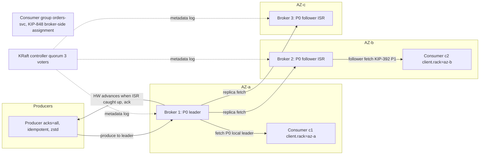
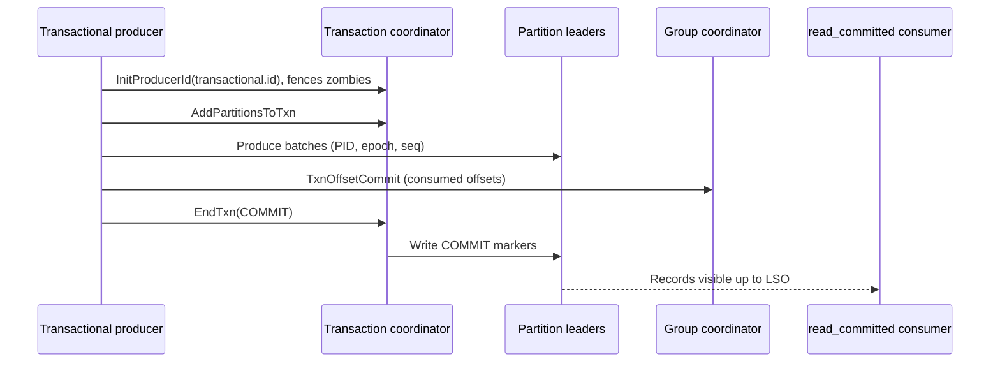

# M4 Kafka at scale
> Last verified: 2026-10 · Audience: senior/staff DevOps, SRE, AI eng, NetEng, DevSecOps, architects

Basics (log model, partitions, ISR, KRaft intro) are in [C6.24 Kafka architecture](../C-large-scale-architecture/C6-technology-stack.md#c624-kafka-architecture). This file covers **operating Kafka at scale**: durability math, tuning, sizing, cost, multi-region, governance, security, monitoring, and managed-service choices.

## TL;DR
- **KRaft only since 4.0** (Mar 2025). ZooKeeper is gone. Migration path: ZK → **3.9 bridge release** (migrate metadata) → 4.x. Releases since then: 4.1 (Sep 2025), 4.2 (Feb 2026), 4.3 (May 2026).
- **Durability = RF=3 + `min.insync.replicas=2` + `acks=all` + `unclean.leader.election.enable=false`**. This survives 1 broker or AZ loss with no data loss and no write outage. Losing 2 makes producers fail with `NotEnoughReplicas`: Kafka stays consistent and gives up availability.
- **Producer defaults (4.x):** `acks=all`, `enable.idempotence=true`, `linger.ms=5` (was 0 before 4.0), `batch.size=16384`, `compression.type=none`. At scale, raise linger/batch and use **zstd or lz4**.
- **Consumers:** the KIP-848 group protocol (`group.protocol=consumer`) is GA in 4.0 and removes stop-the-world rebalances. **Share groups (KIP-932, "Queues for Kafka")** are production-ready in **4.2**. They give per-record acks and scale past the partition count.
- **Partition count and key design** set ordering, parallelism and hot spots. Size partitions from throughput, over-provision moderately, and **don't add partitions to keyed topics** casually.
- **Cost at scale is mostly cross-AZ traffic and storage.** Fix it with rack awareness plus **follower fetching (KIP-392)**, **tiered storage (KIP-405)**, and diskless designs (**KIP-1150 accepted**, implementation still in progress; WarpStream, Confluent Freight).
- **Multi-region:** MirrorMaker 2 (open source, offsets translated), MSK Replicator, and Confluent **Cluster Linking** (offsets preserved). All of them are **async**, so plan for non-zero RPO.
- **Managed choice:** MSK Provisioned (Standard / **Express**) or Serverless; Kinesis (shards); Event Hubs with its Kafka endpoint (TU/PU/CU, feature gaps); Confluent Cloud (including Azure Native); GCP Pub/Sub or Managed Kafka.

## M4.1 KRaft and cluster topology
- **How it works:**
  - **Controller quorum:** 3 or 5 controllers (tolerate 1 or 2 failures) run Raft over the `__cluster_metadata` log. Brokers are observers that replicate the metadata log, so metadata propagation is a log fetch rather than per-partition RPCs. This lets clusters reach **millions of partitions** and makes controller failover take seconds.
  - **Combined mode** (`process.roles=broker,controller`) is for dev and small clusters. In production use **dedicated controllers**, spread across 3 AZs.
  - **4.0 removals:** ZooKeeper mode, the old message formats v0/v1, and Java 8. Brokers and tools need **Java 17**; clients need Java 11+.
  - **Upgrade path:** ZK clusters must migrate on 3.x (ideally 3.9) first, then roll to 4.x.
  - **KIP-853** (3.9) adds **dynamic controller quorum** membership, so you can add or remove voters with `kafka-metadata-quorum.sh add-controller`. Older static-quorum clusters can't simply switch over (unverified for the in-place conversion details).
- **Trade-offs / when to use:** Run 5 controllers only when you need to tolerate 2 simultaneous failures, for example during maintenance plus a failure. Controllers need little capacity, but disk and GC stalls on them hurt the whole cluster.
- **Interview angles:**
  - "Why KRaft?" → One system to run, faster failover, a much higher partition ceiling, a metadata log that is event-sourced, and no split-brain between ZK and the controller.
  - Pitfall: running controllers co-located on busy brokers at scale.
  - Health check: `ActiveControllerCount` summed across the cluster must equal **1**.

## M4.2 Replication, ISR and durability math
- **How it works:**
  - Each partition has 1 leader and RF−1 followers. The **ISR** is the set of followers caught up within `replica.lag.time.max.ms` (default 30 s).
  - The **high watermark (HW)** is the highest offset replicated to all ISR members. Consumers only see data up to the HW.
  - `acks=all` means the leader waits for the **current ISR**, not all replicas. That is why `min.insync.replicas` is the real floor.
  - Rack awareness: set `broker.rack` = AZ ID so the replicas of a partition are placed in different AZs.
  - Kafka **does not fsync per write** by default. Durability comes from replication across failure domains. Redpanda fsyncs by default, which is a common comparison point.
- **Durability math (RF=3, min.ISR=2, acks=all):**

| Brokers or AZs lost (for a partition's replicas) | Writes | Acked data |
|---|---|---|
| 0 | OK | safe |
| 1 | OK (ISR=2 ≥ min.ISR) | safe: at least 1 surviving replica has every acked record |
| 2 | **Rejected** (`NotEnoughReplicasException`); reads of committed data still work if the leader survives | safe if the survivor was in the ISR |
| 3 | Offline | lost unless disks recover |

  - Rule of thumb: you can lose **RF − min.ISR** replicas and keep writing, and lose **min.ISR − 1** replicas with no acked-data loss.
  - Anti-pattern 1: RF=3 with min.ISR=1 and acks=all. The ISR can shrink to the leader alone, and losing that leader then loses acked data.
  - Anti-pattern 2: RF=2 with min.ISR=2. Any single failure stops writes.
  - `unclean.leader.election.enable=false` (default) means an out-of-sync replica is never elected. Setting it to true trades data loss for availability.
- **Trade-offs / when to use:** acks=1 gives the lowest latency but can lose data on leader failover. acks=all adds roughly one replication round-trip (cross-AZ, about 1–2 ms in-region). RF=3 across 3 AZs is the default answer. Use RF=2 only for re-derivable data.
- **Interview angles:**
  - "How do you guarantee no data loss?" → The 4-setting combo above, plus producer idempotence, plus consumers committing offsets after processing.
  - Follow-up "what about the disk?" → Replicas sit in separate AZs. Kafka also has KIP-966 eligible leader replicas (ELR, preview in 4.0, unverified GA status), which reduces data-loss risk on unclean shutdown.

## M4.3 Producer tuning: batching, compression, idempotence, transactions
- **How it works (4.3 defaults):**
  - Batching and buffering: `linger.ms=5`, `batch.size=16 KiB`, `buffer.memory=32 MiB`.
  - Delivery: `acks=all`, `enable.idempotence=true`, `max.in.flight.requests.per.connection=5`, `retries=MAX_INT`, `delivery.timeout.ms=120000`.
  - Partitioning: the default partitioner hashes keyed records (murmur2) and uses the **sticky** strategy for unkeyed records. It fills a batch for one partition and then switches.
- **Throughput tuning:**
  - `linger.ms` 10–100 and `batch.size` 64 KiB–1 MiB produce bigger batches and therefore better compression and fewer requests.
  - Use **`compression.type=zstd`**, which gives the best ratio, or **lz4** for low CPU. Compression is per batch, so bigger batches compress better.
  - Leave the broker or topic `compression.type=producer` so the broker doesn't recompress.
- **Idempotence:**
  - Each producer gets a PID and a per-partition sequence number, so broker-side dedup removes duplicates caused by retries.
  - It is valid within one producer session. Up to 5 in-flight requests still preserve order.
- **Transactions / EOS:**
  - Set `transactional.id` (stable per producer instance or shard).
  - The flow is `initTransactions` → `beginTransaction` → produce plus `sendOffsetsToTransaction` → `commitTransaction`.
  - Consumers must use `isolation.level=read_committed`, which means they read only up to the **LSO** (last stable offset).
  - Kafka Streams: `processing.guarantee=exactly_once_v2` (KIP-447) uses one producer per thread.
  - KIP-890 hardens transactions on the server side; it ships in 4.0+.
- **Trade-offs / when to use:**
  - EOS only covers **Kafka→Kafka** (read-process-write). External sinks need idempotent writes (upsert by key or an outbox) or 2PC-like connectors.
  - Transactions add latency of about one commit interval, and an open transaction holds back the LSO.
- **Interview angles:**
  - "Exactly-once end to end?" → Idempotent producer plus transactions inside Kafka, and an idempotent or transactional sink outside. Otherwise you get at-least-once with dedup.
  - Pitfall: a hung or zombie transactional producer stalls `read_committed` consumers until `transaction.timeout.ms` expires.

## M4.4 Consumer groups, KIP-848, share groups, lag
- **Classic groups:**
  - Client-side assignors such as cooperative-sticky. Rebalances are triggered by `session.timeout.ms` or `max.poll.interval.ms` (default 5 min).
  - With eager assignors, every rebalance stops the whole group. Use `group.instance.id` (static membership) to avoid rebalances on rolling restarts.
- **KIP-848 (GA 4.0):**
  - Enabled with `group.protocol=consumer`. The **group coordinator on the broker computes assignments**, using server-side assignors `uniform` and `range`.
  - Reconciliation is incremental per member, with no global sync barrier. Heartbeats carry assignment deltas.
  - The Streams rebalance protocol (KIP-1071) went **GA with limited features in 4.2**.
- **Share groups (KIP-932):**
  - Status: early access in 4.0, preview in 4.1, **production-ready in 4.2**. Enabled via the `share.version` feature.
  - Several consumers fetch from the **same partition**. Each record is **acquired with a time-bound lock** (default 30 s) and then acknowledged as ACCEPT, RELEASE, REJECT, or RENEW (added in 4.2).
  - Delivery count limit defaults to 5 (unverified). 4.2 also added share-group lag metrics.
  - There is no per-partition ordering. Use it for work-queue patterns that previously needed SQS or Service Bus.
  - **Not yet supported on MSK Express brokers.**
- **Lag:**
  - Offset lag = log-end offset − committed offset, per partition. **Time lag** (how old the oldest unprocessed record is) is the better SLI.
  - Tools: `kafka-consumer-groups.sh --describe`, the client metric `records-lag-max`, Burrow, and on MSK `MaxOffsetLag`, `SumOffsetLag` and `EstimatedMaxTimeLag`.
- **Trade-offs / when to use:** Consumer groups give ordering per partition, and parallelism is capped at the partition count. Share groups give elastic parallelism and per-message retry/DLQ-like behaviour but no ordering. Kafka Streams also gained DLQ support in its exception handlers in 4.2.
- **Interview angles:**
  - "Consumers keep rebalancing" → The processing loop exceeds `max.poll.interval.ms` (cut `max.poll.records` or move work off the poll thread), GC pauses cause session timeouts, or deploys restart members without static membership. Fix with KIP-848 or cooperative-sticky.
  - "Need 200 workers but have 24 partitions" → Use a share group, or a parallel consumer library that keeps per-key ordering.

## M4.5 Partition sizing and key design
- **How it works:**
  - Partitions ≈ max(target MB/s ÷ per-partition producer MB/s, target MB/s ÷ per-partition consumer MB/s), plus headroom of about 1.5–2×.
  - For reference, MSK Express allows at most **15 MB/s per partition**, and MSK Serverless allows 5 MB/s in and 10 MB/s out per partition.
  - Per-broker partition replicas are bounded: MSK Express ranges from **1,000 recommended (m7g.large) to 20,000 (m7g.16xlarge)**. Too many partitions means more open files, longer leader elections and recovery, and more memory.
- **Key design:**
  - The key determines both the partition and the ordering. Pick the entity whose events must be ordered, such as `orderId` or `accountId`.
  - **Hot partitions** come from skewed keys (a celebrity user or a tenant). Mitigations:
    - Key salting (`key#n`), which loses strict ordering.
    - A separate topic for big tenants.
    - A custom partitioner.
    - Share groups for unordered work.
  - Adding partitions changes `hash(key) % N`, so existing keys move to new partitions and order breaks. Over-provision from the start, or create a new topic and migrate.
  - Partitions can never be reduced.
- **Trade-offs / when to use:** More partitions give more parallelism but more overhead and longer end-to-end latency at acks=all, because there are more replication fetches. Fewer, larger partitions are simpler but cap consumer scale.
- **Interview angles:**
  - "How many partitions for 1 GB/s?" → Take a measured per-partition rate of roughly 10 MB/s, giving about 100 partitions, then about 150–200 with headroom. Check the per-broker replica limits (×RF) and consumer instances.
  - Pitfall: null keys combined with ordering requirements.

## M4.6 Retention, compaction, tiered storage
- **Retention:**
  - Set per topic with `retention.ms` (broker default 168 h) and/or `retention.bytes`.
  - Deletion works on whole **segments** (`segment.bytes` 1 GiB). A segment can't be deleted until it is closed.
- **Compaction:**
  - `cleanup.policy=compact` keeps the last value per key. `delete,compact` keeps the last value per key, but only for the retention period.
  - **Tombstones** (null value) delete a key after `delete.retention.ms`.
  - Uses: changelogs, CDC tables, KTable state, and `__consumer_offsets`.
- **Tiered storage (KIP-405, GA in 3.9):**
  - Enabled with `remote.log.storage.system.enable=true` on the broker and `remote.storage.enable=true` per topic.
  - `local.retention.ms` or `local.retention.bytes` sets the hot tier on local disk; the rest goes to object storage.
  - **Compacted topics are not supported.**
  - Benefits: brokers become far less stateful, so rebalances and broker replacement move only the local tail. Long retention gets cheap.
- **MSK tiered storage:**
  - Standard brokers only, Kafka 3.6+ (or 2.8.2.tiered). Not on t3.small. Delete policy only.
  - Minimum remote retention is **3 days**. It can be disabled per topic but not re-enabled.
  - Read latency is higher for the first bytes. Express brokers already have elastic, pay-as-you-go storage.
- **Interview angles:**
  - "Kafka as the system of record / infinite retention?" → Feasible with tiered storage and compaction, but reprocessing is bounded by the read throughput of the remote tier. Usually you land the data in a lakehouse table too; see [M1 Lakehouse](M1-lakehouse-table-formats.md).

## M4.7 Rack awareness, follower fetching and cross-AZ cost
- **How it works:**
  - With 3 AZs, a client talks to a leader in another AZ about **2/3 of the time** on produce and on consume. Replication with RF=3 sends each byte to 2 other AZs.
  - **KIP-392** (Kafka 2.4):
    - Broker: `broker.rack=<az-id>` and `replica.selector.class=org.apache.kafka.common.replica.RackAwareReplicaSelector`.
    - Consumer: `client.rack=<az-id>`.
    - Consumers then fetch from the **in-AZ follower**.
  - Caveat: follower fetching adds a bit of latency, because the HW has to propagate to the follower first. It can return `OFFSET_NOT_AVAILABLE`.
  - Use **AZ IDs** (e.g. `use1-az1`) rather than names (`us-east-1a`), because AZ names map to different physical AZs in different accounts.
  - For producers there is no follower write: produce always goes to the leader. KIP-1123 (rack-aware partitioning for producers) exists (unverified status). Diskless designs (KIP-1150, WarpStream) remove inter-AZ replication altogether.
- **Trade-offs / when to use:** Consumer egress is often 2–5× ingress because of fan-out, so follower fetching saves the most there. On MSK, broker-to-broker replication traffic is not billed as data transfer, but client traffic across AZs is billed (verify with current MSK pricing).
- **Interview angles:**
  - "Kafka bill is dominated by data transfer" → Follower fetching, zstd compression with bigger batches, fewer fan-out consumers (one shared consumer that republishes), tiered storage, and Express or diskless options.

## M4.8 Multi-region: MirrorMaker 2, MSK Replicator, Cluster Linking
- **MirrorMaker 2 (KIP-382):**
  - Built on Kafka Connect: MirrorSourceConnector, MirrorCheckpointConnector, and MirrorHeartbeatConnector.
  - The default `DefaultReplicationPolicy` renames topics (`us-east.orders`). `IdentityReplicationPolicy` keeps names, but then active-active can loop.
  - **Offsets are not preserved.** Checkpoints translate consumer-group offsets, and `sync.group.offsets.enabled` writes them to the target.
- **MSK Replicator:**
  - Managed cross-region or same-region replication between MSK clusters. Syncs consumer offsets.
  - Quotas: max **1 GB/s ingress per Replicator**, 750 topics per Replicator, 15 per account.
- **Confluent Cluster Linking:**
  - Broker-to-broker, with no Connect. **Mirror topics are byte-for-byte with identical offsets**, so consumers fail over without translation.
  - Confluent Cloud and Platform only. Also used for migrations.
- **Patterns:**
  - Active-passive DR (RPO = replication lag).
  - Active-active with region-prefixed topics plus aggregate consumers.
  - Stretch cluster across 3 regions (sync, so latency-sensitive; viable only with low inter-region RTT).
- **Interview angles:**
  - "RPO zero across regions?" → Only a stretched cluster with acks=all across regions, at the cost of latency. Async replication always has RPO > 0.
  - Always cover consumer offset failover and producer idempotence after failover (duplicates).

## M4.9 Schema Registry and compatibility
- **How it works:**
  - The producer serializer registers or looks up the schema by subject (default `TopicNameStrategy`: `<topic>-value`). Each message is framed as a magic byte plus a **4-byte schema ID** before the payload.
  - Formats: Avro, Protobuf, JSON Schema.
- **Compatibility modes (Confluent default: BACKWARD):**

| Mode | New schema can… | Upgrade first |
|---|---|---|
| BACKWARD (default) | read old data (delete fields, add optional fields) | consumers |
| FORWARD | be read by old schema (add fields, delete optional fields) | producers |
| FULL | both (add or remove optional fields only) | any order |
| *_TRANSITIVE | checked against **all** versions, not just the latest | as above |
| NONE | no checks | coordinate manually |

  - Kafka Streams supports only BACKWARD. Use BACKWARD_TRANSITIVE for topics that are replayed from the beginning.
- **Alternatives:** AWS Glue Schema Registry (works with MSK and Kinesis); Azure Event Hubs Schema Registry (Standard 25 MB, Premium 100 MB, Dedicated 1 GB per namespace); Apicurio.
- **Interview angles:** Enforce compatibility in CI (by testing against the registry) and block auto-registration in production (`auto.register.schemas=false`). Schema evolution is the #1 cause of breaking consumer outages.

## M4.10 Kafka Connect and Debezium CDC
- **Kafka Connect:**
  - Distributed workers store their config, offsets and status in Kafka topics. Connectors split into tasks, and parallelism is capped by `tasks.max` and by source or partition count.
  - Use SMTs for light transforms. Set error tolerance to `all` with a **DLQ topic** for sinks.
- **Debezium:**
  - Reads the DB log: Postgres logical replication slot (pgoutput), MySQL binlog (row format, GTID), SQL Server CDC tables, and Oracle LogMiner.
  - Emits change events with before and after images, keyed by primary key, to compacted topics. Takes an initial snapshot and then streams.
  - Incremental snapshots use signalling.
- **Ops pitfalls:**
  - A Postgres slot that isn't consumed **retains WAL until the disk fills**. Monitor the slot lag, and set `max_slot_wal_keep_size`.
  - DDL and schema changes.
  - Large transactions.
  - The outbox pattern (Debezium outbox event router) is used for reliable domain events.
- **Managed options:**
  - **MSK Connect**: max 10 workers per connector and 60 workers per account by default; custom plugins.
  - Confluent fully managed connectors.
  - Event Hubs Kafka Connect support (unverified GA).
  - Alternatives: AWS DMS → Kinesis or MSK, Azure Data Factory/Fabric CDC.
- **Interview angles:** "Dual writes DB + Kafka?" → Don't. Use CDC or an outbox for atomicity. See [B8 Database replication](../B-database-engineering/B8-database-replication.md) and [M5 Stream processing](M5-stream-processing.md).

## M4.11 Security: TLS, SASL, IAM, ACLs
- **Encryption:** TLS for client↔broker and inter-broker. Use mTLS (`ssl.client.auth=required`) for certificate-based identity. Encryption at rest is a disk or KMS concern.
- **AuthN:**
  - **SASL/SCRAM-SHA-512**: credentials are stored in the KRaft metadata.
  - **SASL/OAUTHBEARER**: OIDC via KIP-768. Event Hubs uses Entra ID through this.
  - **SASL/GSSAPI** (Kerberos).
  - PLAIN only over TLS. Event Hubs SAS uses `$ConnectionString` as the username.
- **AuthZ:**
  - `StandardAuthorizer` (KRaft) ACLs on Topic, Group, Cluster, TransactionalId and DelegationToken. Use prefixed ACLs, and set `allow.everyone.if.no.acl.found=false`.
- **MSK:**
  - Listener ports: plaintext 9092, TLS 9094, SASL/SCRAM 9096 (secrets in **Secrets Manager** with the `AmazonMSK_` prefix and a customer-managed KMS key), **IAM 9098** (the `aws-msk-iam-auth` library, `AWS_MSK_IAM` or OAUTHBEARER).
  - IAM policies map to Kafka actions (`kafka-cluster:WriteData`, `ReadData`, `AlterGroup`, …).
  - **Serverless requires IAM, and Kafka ACLs are unsupported.** IAM listeners have a quota of 3,000 connections per broker and 100 new connections/s.
- **Event Hubs:** TLS is mandatory on port 9093. Use Entra ID RBAC (Azure Event Hubs Data Sender/Receiver) instead of Kafka ACLs. Private Link is available on Standard and above.
- **Interview angles:** Prefer short-lived tokens (IAM, OIDC) over SCRAM passwords. Rotating a SAS key does **not** drop existing Kafka connections. Put Kafka on a private network (PrivateLink or Private Endpoint). See [L7 Zero trust](../L-data-privacy-ai-security/L7-zero-trust-workload-identity.md).

## M4.12 Monitoring and SLOs
- **Golden broker signals:**
  - `UnderReplicatedPartitions` should be 0.
  - `UnderMinIsrPartitionCount` > 0 means **writes with acks=all are failing**.
  - `OfflinePartitionsCount` should be 0.
  - `ActiveControllerCount` summed should be 1.
  - `RequestHandlerAvgIdlePercent` and `NetworkProcessorAvgIdlePercent` (below about 30% means saturated).
  - Produce and fetch `TotalTimeMs` p99, broken into request, queue, local, remote and response components.
  - ISR shrink/expand rate.
  - Disk usage and bytes in/out per broker versus the instance's network baseline.
- **Client signals:**
  - Consumer lag (offset and **time**), rebalance rate, `record-error-rate`, `request-latency-avg`, `buffer-available-bytes` (producer blocking).
- **SLO examples:** "p99 produce ack < 50 ms", "99.9% of events consumed within 60 s (time lag)".
- **Tooling:** JMX → Prometheus (MSK Open Monitoring JMX/node exporters), CloudWatch (MSK monitoring levels DEFAULT / PER_BROKER / PER_TOPIC_PER_BROKER / PER_TOPIC_PER_PARTITION), Cruise Control for rebalancing, and Azure Monitor for Event Hubs (ThrottledRequests is the key metric).
- **Interview angles:** "URPs spiking" → A slow or failing broker disk or network, GC, a broker restart, or traffic above the instance network baseline. Check whether URPs are concentrated on one broker (hardware) or spread across all (load). See [J2 Monitoring](../J-sre/J2-monitoring-and-alerting.md).

## M4.13 Alternatives: Redpanda, diskless (WarpStream, KIP-1150), Pulsar

| | Apache Kafka | Redpanda | WarpStream / diskless | Pulsar |
|---|---|---|---|---|
| Architecture | JVM brokers, local disks, ISR replication, KRaft | C++ thread-per-core, Raft per partition, no JVM or ZK | Stateless agents write directly to S3/GCS/Blob, metadata in a control plane | Stateless brokers + **BookKeeper** bookies + metadata store |
| Durability | Replication (no per-write fsync) | Raft + fsync by default | Object store (11 nines) | BookKeeper quorum writes (fsync) |
| Latency | ms | low ms, lower tail | **hundreds of ms** p99 (object-store PUTs) | ms |
| Cross-AZ cost | high (replication + clients) | similar to Kafka | near zero (no inter-AZ replication) | similar |
| Fit | default ecosystem | Kafka API with simpler ops and low tail latency | logs, telemetry, cost-dominated workloads | multi-tenancy, built-in geo-replication, queue + stream semantics |

- **KIP-1150 Diskless Topics:**
  - **Accepted**, but only as a motivational KIP. Implementation is in KIP-1163 (core) and KIP-1164 (batch coordinator).
  - Not in a released Apache Kafka as of 4.3 (unverified).
  - Design: write through to object storage, use local disk as a cache, and keep the same external semantics including transactions.
- **WarpStream** was acquired by Confluent (2024, unverified date). Confluent Cloud's **Freight clusters** apply the same idea in a managed service (unverified details). Similar systems: AutoMQ and Bufstream.
- **Interview angle:** Choose diskless when you have about 100s of ms latency tolerance and a high GB/s volume, since cost dominates. Keep classic Kafka for sub-10 ms or transactional OLTP-adjacent streams.

## M4.14 Managed streaming decision: Kafka vs Kinesis vs Event Hubs vs Pub/Sub

| Dimension | MSK (Standard / Express / Serverless) | Kinesis Data Streams | Event Hubs (Kafka endpoint) | GCP Pub/Sub |
|---|---|---|---|---|
| Scale unit | Brokers (instance size); Serverless pays per throughput | **Shard**: 1 MB/s or 1,000 rec/s in, 2 MB/s out (shared). On-demand starts at 4 MB/s write and scales to 10 GB/s in large regions | **TU** (Basic/Std): 1 MB/s or 1,000 ev/s in, 2 MB/s or 4,096 ev/s out, max 40. **PU** (Premium, max 16). **CU** (Dedicated) | No unit; autoscaling |
| Parallelism | Partitions | Shards (split/merge) | Partitions: 32 (Std), 100/hub (Premium), 1,024 (Dedicated) | Subscriptions; ordering keys |
| Retention | Unlimited (tiered or Express) | 24 h default, up to **365 days** | 1 d (Basic) / 7 d (Std) / 90 d (Premium, Dedicated) | Up to 31 d (unverified) |
| Max message | Configurable (MSK Serverless 8 MiB) | **10 MiB** (burst) | 256 KB / 1 MB / 1 MB / 20 MB | 10 MB |
| Fan-out | Any number of consumer groups | Shared 2 MB/s or **EFO** (dedicated 2 MB/s per consumer, 20 per stream, or 50 with On-demand Advantage) | 20 (Std) / 100 (Premium) / 1,000 (Dedicated) consumer groups per hub | Subscriptions |
| Kafka API | Native | No (KCL/SDK) | Protocol endpoint (1.0+) with gaps | No (Google Managed Service for Apache Kafka is separate) |

- **Pick MSK or Confluent** when you need the full Kafka ecosystem: Streams, Connect, transactions, compaction, long retention, share groups.
- **Pick Kinesis** for AWS-native, low-ops ingestion with Lambda or Firehose and modest fan-out.
- **Pick Event Hubs** for Azure-native ingestion where Kafka clients just need to produce and consume.
- **Pick Pub/Sub** for global, per-message ack semantics.
- **Interview angles:** "Shards vs TUs?" → Both are about 1 MB/s in and 2 MB/s out. Shards are per-stream partitions you split or merge. TUs are a **namespace-wide** throughput budget, separate from the partition count, and Auto-Inflate scales them up but never down.

## Diagrams




## Cloud mapping: AWS vs Azure

| Capability | AWS | Azure | Role it plays | Key differences | Alternatives |
|---|---|---|---|---|---|
| Managed Apache Kafka (brokers) | **MSK Provisioned: Standard brokers** (EBS, tiered storage) and **Express brokers** | **HDInsight Kafka** (HDInsight 5.1, IaaS-like); in practice **Confluent Cloud on Azure** (Azure Native ISV service) | Full Kafka semantics | Express gives up to 3× throughput per broker, 20× faster scaling, no storage management, 3 AZs only, partial KStreams support, no KIP-932 yet. Azure has no first-party managed Kafka broker service | Confluent Cloud, Aiven, self-managed on Kubernetes (Strimzi) |
| Serverless Kafka API | **MSK Serverless** (200 MB/s in, 400 MB/s out per cluster, 2,400 partitions, IAM only) | **Event Hubs Kafka endpoint** (Std/Premium/Dedicated) | Pay per throughput with no brokers | MSK Serverless is real Kafka. Event Hubs is a Kafka-protocol facade: Streams and transactions are preview on Premium and Dedicated, compression is gzip only on Premium and Dedicated, there are no broker configs or Kafka ACLs, and partitions are fixed on Std | Confluent Cloud Basic/Standard |
| Native streaming service | **Kinesis Data Streams** (shards / on-demand) | **Event Hubs** (TU/PU/CU) | Partitioned ingestion log | Shard vs namespace-wide TU budget. Kinesis retention up to 365 d vs 90 d. Event Hubs speaks AMQP, Kafka and HTTP together | GCP Pub/Sub |
| Connect / CDC | **MSK Connect**, DMS | Event Hubs Kafka Connect (unverified GA), Data Factory/Fabric CDC | Source and sink integration | MSK Connect: 10 workers per connector by default | Confluent managed connectors, Debezium Server |
| Schema registry | **Glue Schema Registry** | **Event Hubs Schema Registry** | Contracts and compatibility | Event Hubs registry size depends on tier | Confluent SR, Apicurio |
| Cross-region replication | **MSK Replicator** (1 GB/s, 750 topics) | Event Hubs **Geo-replication** (Premium/Dedicated) and Geo-DR (metadata alias, Std+) | DR | Event Hubs Geo-DR (alias) replicates metadata only. Geo-replication replicates data | MM2, Cluster Linking |
| Archive to lake | **MSK Data Delivery** / Firehose → S3 or S3 Tables (Iceberg) | **Event Hubs Capture** → Blob/ADLS (Avro/Parquet) | Lake landing | Capture is included in Premium and Dedicated | Kafka Connect S3 sink, Tableflow |
| AuthN/Z | IAM (port 9098), SCRAM + Secrets Manager, mTLS (ACM PCA) | Entra ID OAuth (OAUTHBEARER) + RBAC, SAS | Identity | IAM and Entra replace Kafka ACLs on the serverless offerings | OIDC (KIP-768) |

- **MSK Standard vs Express:** Standard needs you to size EBS (up to 16 TiB per broker), optionally with tiered storage, and gives full config control. Express offers elastic storage and enforced quotas per size: for example `express.m7g.large` sustains 15.6 MB/s in, and `16xlarge` sustains 500 MB/s in and 1,000 MB/s out. Express has no maintenance windows, supports Kafka 3.6/3.8/3.9/4.2, and uses KRaft from 3.9. Both cap at 60 brokers per KRaft cluster by default.
- **HDInsight Kafka status:** HDInsight 4.0 and 5.0 were retired on 31 Mar 2025. 5.1 is on standard support with no retirement date announced. Its Kafka is an older 3.x on ZooKeeper (unverified exact version), and HDInsight on AKS was retired (unverified). For new Kafka on Azure, the usual answer is **Event Hubs** (simple produce/consume) or **Confluent Cloud on Azure** (full features, billed through Azure Marketplace). The Event Hubs docs themselves still point to HDInsight for "native Kafka".
- **Throughput units vs shards:** A Kinesis shard is a per-stream partition with hard limits per shard, and you scale by resharding. An Event Hubs TU is a **namespace-level** budget shared by all hubs. Premium PUs and Dedicated CUs have no fixed per-unit MB/s limit. On Event Hubs Std the partition count is set at creation; Premium and Dedicated allow dynamic increase.
- **Pricing shape:** MSK Provisioned is per broker-hour plus storage (or per GB on Express). MSK Serverless is per cluster-hour, partition-hour and GB in/out. Kinesis on-demand is per GB plus per stream-hour; provisioned is per shard-hour plus PUT units. Event Hubs is per TU/PU/CU-hour, plus ingress events on Basic and Std.

## Hands-on
```yaml
# docker-compose.yml — single-node KRaft Kafka 4.x (combined broker+controller, dev only)
services:
  kafka:
    image: apache/kafka:4.2.0
    container_name: kafka
    ports: ["9092:9092"]
    environment:
      KAFKA_NODE_ID: 1
      KAFKA_PROCESS_ROLES: broker,controller
      KAFKA_LISTENERS: PLAINTEXT://:9092,CONTROLLER://:9093
      KAFKA_ADVERTISED_LISTENERS: PLAINTEXT://localhost:9092
      KAFKA_CONTROLLER_LISTENER_NAMES: CONTROLLER
      KAFKA_LISTENER_SECURITY_PROTOCOL_MAP: CONTROLLER:PLAINTEXT,PLAINTEXT:PLAINTEXT
      KAFKA_CONTROLLER_QUORUM_VOTERS: 1@localhost:9093
      KAFKA_OFFSETS_TOPIC_REPLICATION_FACTOR: 1
      KAFKA_TRANSACTION_STATE_LOG_REPLICATION_FACTOR: 1
      KAFKA_TRANSACTION_STATE_LOG_MIN_ISR: 1
      KAFKA_SHARE_COORDINATOR_STATE_TOPIC_REPLICATION_FACTOR: 1
      KAFKA_SHARE_COORDINATOR_STATE_TOPIC_MIN_ISR: 1
      KAFKA_LOG_DIRS: /var/lib/kafka/data
    volumes: ["kafka-data:/var/lib/kafka/data"]
volumes:
  kafka-data: {}
```

```bash
docker compose up -d
K="docker exec -it kafka /opt/kafka/bin"; BS="--bootstrap-server localhost:9092"

$K/kafka-metadata-quorum.sh $BS describe --status          # leader, voters, HW of __cluster_metadata
$K/kafka-topics.sh $BS --create --topic orders --partitions 6 --replication-factor 1 \
  --config min.insync.replicas=1 --config retention.ms=604800000
$K/kafka-topics.sh $BS --create --topic customers --partitions 3 --replication-factor 1 \
  --config cleanup.policy=compact
$K/kafka-topics.sh $BS --describe --topic orders
$K/kafka-topics.sh $BS --describe --under-replicated-partitions   # should print nothing

# keyed produce (key:value) → same key, same partition, ordered
$K/kafka-console-producer.sh $BS --topic orders --property parse.key=true --property key.separator=:

# consumer group on the KIP-848 protocol
$K/kafka-console-consumer.sh $BS --topic orders --group orders-svc \
  --consumer-property group.protocol=consumer --property print.key=true --from-beginning
$K/kafka-consumer-groups.sh $BS --describe --group orders-svc     # CURRENT-OFFSET, LOG-END-OFFSET, LAG

# throughput tuning experiment
$K/kafka-producer-perf-test.sh --topic orders --num-records 1000000 --record-size 1024 --throughput -1 \
  --producer-props bootstrap.servers=localhost:9092 acks=all linger.ms=20 batch.size=262144 compression.type=zstd

# share groups (Queues for Kafka) — enable feature, then consume cooperatively
$K/kafka-features.sh $BS upgrade --feature share.version=1
$K/kafka-console-share-consumer.sh $BS --topic orders --group orders-workers

# change retention online
$K/kafka-configs.sh $BS --alter --entity-type topics --entity-name orders --add-config retention.ms=86400000
```

```hcl
# Terraform — MSK Provisioned (Standard brokers), 3 AZs, IAM auth, TLS, tiered storage, Prometheus
resource "aws_msk_configuration" "this" {
  name              = "prod-kafka"
  kafka_versions    = ["3.9.x"]
  server_properties = <<-EOT
    auto.create.topics.enable=false
    default.replication.factor=3
    min.insync.replicas=2
    unclean.leader.election.enable=false
    num.partitions=6
    replica.selector.class=org.apache.kafka.common.replica.RackAwareReplicaSelector
  EOT
}

resource "aws_msk_cluster" "this" {
  cluster_name           = "prod-kafka"
  kafka_version          = "3.9.x"            # KRaft-based on MSK from 3.9
  number_of_broker_nodes = 3                  # multiple of the number of subnets/AZs
  storage_mode           = "TIERED"

  broker_node_group_info {
    instance_type   = "kafka.m7g.large"       # Express: "express.m7g.large" and omit storage_info
    client_subnets  = var.private_subnet_ids  # one per AZ (3)
    security_groups = [aws_security_group.msk.id]
    storage_info {
      ebs_storage_info { volume_size = 1000 }
    }
  }

  client_authentication {
    sasl { iam = true }                       # port 9098
    unauthenticated = false
  }

  encryption_info {
    encryption_at_rest_kms_key_arn = aws_kms_key.msk.arn
    encryption_in_transit {
      client_broker = "TLS"
      in_cluster    = true
    }
  }

  configuration_info {
    arn      = aws_msk_configuration.this.arn
    revision = aws_msk_configuration.this.latest_revision
  }

  enhanced_monitoring = "PER_TOPIC_PER_PARTITION"   # exposes lag metrics per partition
  open_monitoring {
    prometheus {
      jmx_exporter  { enabled_in_broker = true }
      node_exporter { enabled_in_broker = true }
    }
  }
}

output "bootstrap_iam" { value = aws_msk_cluster.this.bootstrap_brokers_sasl_iam }
```

## Cross-links
- [C6.24 Kafka architecture](../C-large-scale-architecture/C6-technology-stack.md#c624-kafka-architecture): fundamentals this file builds on
- [M5 Stream processing](M5-stream-processing.md): Flink, Kafka Streams, Spark Structured Streaming on top of Kafka
- [M1 Lakehouse table formats](M1-lakehouse-table-formats.md): landing Kafka in Iceberg or Delta
- [M6 Orchestration and ETL](M6-orchestration-etl.md)
- [B8 Database replication](../B-database-engineering/B8-database-replication.md): logical replication behind CDC
- [D2 Reusable parts of system design](../D-system-design/D2-reusable-parts-of-system-design.md): queues and pub/sub building blocks
- [J2 Monitoring and alerting](../J-sre/J2-monitoring-and-alerting.md), [J5 Capacity planning](../J-sre/J5-capacity-planning-load-testing.md)
- [G4 Network performance and optimization](../G-cloud-network-architecture/G4-network-performance-and-optimization.md): cross-AZ data transfer
- [L7 Zero trust and workload identity](../L-data-privacy-ai-security/L7-zero-trust-workload-identity.md)

## Sources
- https://kafka.apache.org/blog (4.0–4.3 release dates)
- https://kafka.apache.org/blog/2026/02/17/apache-kafka-4.2.0-release-announcement/
- https://kafka.apache.org/43/configuration/producer-configs/
- https://cwiki.apache.org/confluence/display/KAFKA/KIP-1150%3A+Diskless+Topics
- https://cwiki.apache.org/confluence/display/KAFKA/KIP-392%3A+Allow+consumers+to+fetch+from+closest+replica
- https://docs.aws.amazon.com/msk/latest/developerguide/msk-broker-types-express.html
- https://docs.aws.amazon.com/msk/latest/developerguide/limits.html
- https://docs.aws.amazon.com/msk/latest/developerguide/serverless.html
- https://docs.aws.amazon.com/msk/latest/developerguide/msk-tiered-storage.html
- https://docs.aws.amazon.com/streams/latest/dev/service-sizes-and-limits.html
- https://learn.microsoft.com/en-us/azure/event-hubs/azure-event-hubs-apache-kafka-overview
- https://learn.microsoft.com/en-us/azure/event-hubs/event-hubs-quotas
- https://learn.microsoft.com/en-us/azure/hdinsight/hdinsight-component-versioning
- https://docs.confluent.io/platform/current/schema-registry/fundamentals/schema-evolution.html
