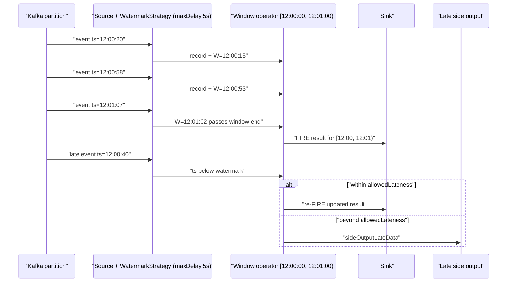
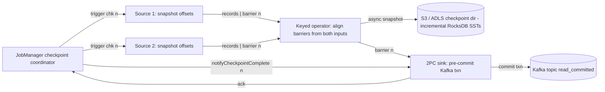
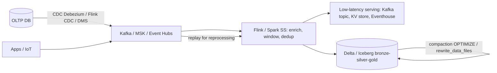

# M5 Stream processing
> Last verified: 2026-10 · Audience: senior/staff DevOps, SRE, AI eng, NetEng, DevSecOps, architects

## TL;DR
- **Event time + watermarks** are what make streaming results correct. A watermark W(t) says "no more events with timestamp ≤ t are expected". Windows fire when the watermark passes their end. Data that arrives after that is **late**: it is dropped, sent to a side output, or used to update the result within the **allowed lateness**.
- **Exactly-once end to end** needs three things: a **replayable source** (Kafka offsets stored in the checkpoint), **consistent state snapshots** (Flink checkpoint barriers, Spark offset/commit logs), and a **transactional (2PC) or idempotent sink**. If any one is missing, you have at-least-once plus dedup.
- **Flink** (2.3.0 is the latest stable, released 2026-06; 1.20.x is the LTS) is the reference engine for true record-at-a-time streaming. It has a JobManager and TaskManagers with slots, RocksDB keyed state, incremental checkpoints, savepoints for upgrades, and credit-based backpressure. **Flink 2.x disaggregated state** (the ForSt backend on S3) is still **experimental**.
- **Spark Structured Streaming** runs **micro-batch** by default (as of Spark 4.2, 2026-07). **Real-Time Mode** (RTM) arrived in OSS **Spark 4.1** (Dec 2025) and is **GA on Databricks** (latency down to about 5 ms). `transformWithState` replaces `(flat)mapGroupsWithState`. The `checkpointLocation` is the identity of the query.
- **Kafka Streams** is a library, not a cluster. Its state stores are backed by **changelog topics**. Use `exactly_once_v2`. Scaling is capped by input partitions.
- **Kappa** (one streaming path plus replay) beats **lambda** (separate batch and speed layers) when the log retains enough history. A lakehouse sink (Delta/Iceberg) plus **compaction** is the modern serving layer.
- **Cloud managed services:**
  - AWS **Managed Service for Apache Flink** now supports Flink **2.2**. Its unit is the KPU (1 vCPU + 4 GB + 50 GB).
  - **Kinesis Data Analytics for SQL is retired.**
  - Azure has **no first-party managed Flink**: **HDInsight on AKS (Flink) was retired on 2025-01-31**. Use **Stream Analytics**, **Fabric Real-Time Intelligence**, **Databricks**, or **Confluent Cloud for Flink**.
- **Operational signals to watch:** consumer lag, watermark lag, checkpoint duration and size, backpressure (busy / backPressured time), and state size. Before any upgrade or rescale, set **stable operator UIDs** and **maxParallelism**.

Builds on [C6.51 Stream processing](../C-large-scale-architecture/C6-technology-stack.md#c651-stream-processing). Kafka internals are in [M4 Kafka at scale](M4-kafka-at-scale.md).

---

## M5.1 Processing models: batch vs micro-batch vs continuous
- **How it works:**
  - **Batch:** a bounded input. The job recomputes everything per run (e.g. hourly Spark/Glue jobs). Latency is the schedule period plus the runtime.
  - **Micro-batch:** the unbounded input is split into small bounded batches. Spark SS by default starts the next batch as soon as the previous one finishes. Latency is usually about 100 ms to seconds. Fault tolerance comes from the WAL of offsets per batch plus the commit log.
  - **Continuous / record-at-a-time:** long-running operators push each record through a pipelined DAG (Flink, Kafka Streams, Spark RTM). Latency is ms to sub-ms per operator. Fault tolerance comes from asynchronous snapshots (barriers) or changelogs.
  - **Unified batch/stream:** Flink treats batch as a bounded stream (`execution.runtime-mode: BATCH`). The DataSet API was **removed in Flink 2.0**. Spark uses the same DataFrame API for both, and `Trigger.AvailableNow` runs streaming as an incremental batch.
- **Trade-offs / when to use:**

| Model | Latency | Throughput/cost | Complexity | Use |
|---|---|---|---|---|
| Batch | min–hours | best $/GB | lowest | reporting, backfills, ML features recomputed daily |
| Micro-batch | ~0.1–10 s | high | medium | streaming ETL into lakehouse, near-real-time BI |
| Continuous | ms | lower per core (no batching amortisation) | highest (state, timers) | fraud, alerting, CEP, online features |

- **Interview angles:**
  - **"Why not just run batch every minute?"** Each run pays scheduling and startup cost, cannot carry state across runs cheaply, and gives poor results for windows that span runs. **Incremental processing** with state is the answer.
  - **"Is Spark streaming 'real' streaming?"** Micro-batch by default. The old Continuous Processing trigger is experimental and supports few operations (no aggregations). **Real-Time Mode** (Spark 4.1+) is the modern low-latency path: long-running batches with concurrent stage scheduling and a streaming shuffle.
  - **Pitfall:** confusing *latency* with *freshness*. A lakehouse table written every 10 s by a continuous engine is still about 10 s fresh because of commit cadence.

## M5.2 Time semantics: event time, processing time, watermarks, late data
- **How it works:**
  - **Event time** is when the event happened (payload timestamp). **Processing time** is the wall clock at the operator. **Ingestion time** is when the broker appended it (Kafka `LogAppendTime`, `EventEnqueuedUtcTime` in Event Hubs).
  - **Watermark** = a monotonic event-time progress marker. The typical strategy is **bounded out-of-orderness**: `W = max_event_time_seen − maxDelay`. In Flink: `WatermarkStrategy.forBoundedOutOfOrderness(Duration.ofSeconds(5))`.
  - **Per-partition watermarks:** a Flink Kafka source tracks one watermark per partition. An operator's watermark = **min over its inputs**. One **idle partition** therefore stalls everything downstream. Fix it with `withIdleness(Duration)`. The KafkaSource docs warn that the source does *not* auto-idle when parallelism > partitions.
  - **Watermark alignment** (Flink): pauses fast splits whose watermark drifts too far ahead of the group (`withWatermarkAlignment(group, maxDrift)`). This prevents state blow-up during backfill when sources are skewed.
  - **Late data:**
    - **Flink:** `allowedLateness(Duration)` keeps window state and re-fires with an updated result for late records. Beyond that, records go to `sideOutputLateData(tag)`. The default allowed lateness is 0, which means late records are dropped.
    - **Spark:** `withWatermark("ts","10 minutes")` guarantees that data less than 10 minutes late is **not dropped**. Data later than that *may* be dropped. State is only cleaned in **Append/Update** mode (not Complete), and `withWatermark` must be applied on the same column, before the aggregation.
    - **Kafka Streams:** **grace period** per window (`TimeWindows.ofSizeAndGrace`). Records after the grace period are dropped. Watermark semantics come from *stream time* (the max timestamp seen per task).
    - **Azure Stream Analytics:**
      - Watermark = max event time − **out-of-order tolerance** (default **0 s**).
      - **Late-arrival tolerance** defaults to **5 s** and can be set up to **20 days**.
      - **Early-arrival** tolerance is fixed at 5 min (events arriving earlier are dropped).
      - The policy action is **Drop** or **Adjust** (changes `System.Timestamp`).
      - `TIMESTAMP BY ts OVER deviceId` gives per-key **substreams** with independent watermarks (for clock-skewed IoT).
- **Trade-offs / when to use:**
  - A bigger bound gives more complete results, but adds latency and holds more state. A smaller bound gives fast results with more late drops.
  - Processing time is fine for monitoring and rate limiting, but gives non-deterministic results on replay. Use event time for anything that must be **reproducible** (billing, ML features).
- **Interview angles:**
  - **"Window never fires."** Check for an idle partition or source, a missing timestamp assigner, or parallelism > partitions. Also check whether the producer clock is in the future (that inflates the watermark, and later events become "late").
  - **"How do you handle data that's 2 days late?"** Keep a modest watermark for the real-time path. Route late records to a side output or DLQ, then **reconcile with a batch correction** (upsert into the lakehouse via MERGE). Do not hold 2 days of window state.
  - **Follow-up:** watermarks are heuristic. Exact completeness needs source cooperation (e.g. end-of-partition markers) or a later batch correction.

## M5.3 Windows: tumbling, sliding/hopping, session
- **How it works:**

| Window | Definition | Records per window | Flink | Spark | Kafka Streams | ASA |
|---|---|---|---|---|---|---|
| **Tumbling** | fixed size, no overlap | each record → 1 | `TumblingEventTimeWindows.of(5m)` / SQL `TUMBLE` | `window(ts,"5 minutes")` | `TimeWindows.ofSizeWithNoGrace` | `TumblingWindow` |
| **Sliding / hopping** | size S, slide s < S | → S/s windows | `SlidingEventTimeWindows` / `HOP` | `window(ts,"10 min","5 min")` | `TimeWindows...advanceBy` (hopping), `SlidingWindows` (diff-based) | `HoppingWindow`, `SlidingWindow` (emits on change) |
| **Session** | per-key, closes after inactivity gap | variable | `EventTimeSessionWindows.withGap` / `SESSION` | `session_window(ts,"5 min")` | `SessionWindows` | `SessionWindow` (with max duration) |
| **Global / count** | custom trigger | — | `GlobalWindows` + trigger | — | — | `SnapshotWindow` |

- Flink SQL has **Window TVFs** (`TUMBLE`, `HOP`, `CUMULATE`, `SESSION`). `CUMULATE` covers "running total within the day, emitted every minute".
- **Triggers and evictors** (Flink) control *when* a window emits (early or speculative firing) and what it keeps.
- **Session windows merge.** A late record can bridge two sessions into one, so state backends must support merging.
- **Trade-offs / when to use:**
  - Hopping with a small slide multiplies state and output by S/s. Prefer **pre-aggregating into tumbling panes** and combining them (Flink does pane-slicing in SQL window aggregates).
  - Use **incremental aggregation** (`reduce`/`aggregate`, i.e. an `AggregateFunction`) instead of `ProcessWindowFunction` holding all elements. That is O(1) state vs O(n).
- **Interview angles:**
  - **"Top-N per 5-minute window."** Tumbling window aggregate, then a Rank (Flink SQL `ROW_NUMBER() OVER (PARTITION BY window_start ...)`, which is supported as a Window Top-N).
  - **"Sessionize clickstream."** Session window with a 30-minute gap, keyed by user. Watch for unbounded sessions from bots: cap them with a max duration or a custom trigger.

## M5.4 Stateful processing and state backends
- **How it works:**
  - **Keyed state** (ValueState, ListState, MapState, ReducingState) is partitioned by key into **key groups**. The number of key groups = **maxParallelism** (default 128 when parallelism ≤ 128, upper bound 32768). Key groups are the unit of redistribution on rescale. **Changing maxParallelism breaks state compatibility.**
  - **Operator state** (e.g. source offsets) and **broadcast state** (rules/config pushed to all tasks).
  - **Timers** (event-time or processing-time) are themselves checkpointed state.
  - **Flink backends:**

| Backend | Where state lives | Snapshot | Use when |
|---|---|---|---|
| **HashMapStateBackend** | JVM heap objects | full (async) | small state (< a few GB per TM), lowest latency |
| **EmbeddedRocksDBStateBackend** | local disk via RocksDB (off-heap, serialized) | **incremental** (uploads only new SST files) | large state (100s GB–TBs), default for production |
| **ForSt** (Flink 2.x, **experimental**) | **remote DFS (S3/HDFS)** as primary, local disk as cache | incremental, near-instant (files already remote) | huge state, cloud-native elastic rescale, fast recovery |

  - **Flink 2.x disaggregated state:**
    - Config: `state.backend.type: forst` plus the async **State V2 API**, which hides S3 latency by allowing out-of-order async state access per key.
    - SQL needs `table.exec.async-state.enabled: true`. Only a subset of operators is supported (joins, windows, rank, dedup, non-distinct aggregates), and mini-batch / two-phase aggregation are not supported.
    - The frocksdb-based ForSt is slated for a Rust successor in late 2026 (per the docs).
    - **AWS Managed Flink 2.2 does not support ForSt.**
  - **State TTL:** `StateTtlConfig.newBuilder(Duration.ofDays(7))` with an update type (OnCreateAndWrite / OnReadAndWrite) and cleanup (full-snapshot, incremental heap, **RocksDB compaction filter**). In SQL: `table.exec.state.ttl` (global) or the per-operator `STATE_TTL` hint.
  - **Spark:**
    - State store providers are HDFS-backed in-memory (default) or **RocksDB** (`spark.sql.streaming.stateStore.providerClass`). Changelog checkpointing applies to RocksDB.
    - Spark 4.1 improved RocksDB (memory tied to the unified memory manager, checksum verification, snapshot-lag detection).
    - **`transformWithState`** (4.0+) adds multiple state variables, timers and TTL. It replaces `mapGroupsWithState`.
    - The **State Data Source** (`spark.read.format("statestore")`) lets you inspect state.
  - **Kafka Streams:** RocksDB (default persistent) or in-memory stores. Each store has a compacted **changelog topic**. **Standby replicas** (`num.standby.replicas`) keep warm copies for fast failover.
- **Trade-offs / when to use:**
  - Large state means slow recovery: download from S3 plus RocksDB open, or a changelog replay in Kafka Streams. Mitigations:
    - **local recovery** (`state.backend.local-recovery`), which reuses the TM's local copy;
    - standby replicas;
    - ForSt / disaggregated state.
  - **Unbounded state growth** is the #1 production failure. Causes include regular (non-windowed) joins, `GROUP BY` on high-cardinality keys, and dedup without TTL. Always set TTL or watermark-bounded operators.
- **Interview angles:**
  - **"State is 5 TB, checkpoints take 20 min."** Fixes:
    - incremental checkpoints;
    - tune RocksDB (managed memory, block cache);
    - unaligned checkpoints if backpressured;
    - check for state leaks (TTL);
    - consider ForSt;
    - split the job.
  - **"How does rescaling redistribute keyed state?"** Through key-group ranges. That is why **maxParallelism must be set up front** (AWS docs: you cannot restore a snapshot after changing maxParallelism, and you must set it explicitly to scale past 128).

## M5.5 Exactly-once semantics
- **How it works:**
  - **Flink checkpoints = asynchronous barrier snapshotting** (Chandy–Lamport variant).
    1. The JobManager's checkpoint coordinator injects **barrier n** at sources, and sources snapshot their offsets.
    2. Each operator **aligns**: it waits until barrier n has arrived on *all* inputs, buffering post-barrier records from the fast inputs.
    3. It then snapshots its state asynchronously and forwards the barrier.
    4. The checkpoint completes when all sinks ack.
  - **Unaligned checkpoints:**
    - `execution.checkpointing.unaligned: true`. Barriers **overtake in-flight buffers**, and those buffers are stored in the checkpoint. Checkpoint time becomes independent of backpressure.
    - Hybrid mode: `execution.checkpointing.aligned-checkpoint-timeout: 30 s` starts aligned and switches to unaligned after the timeout.
    - Limits: no concurrent unaligned checkpoints, and pointwise/broadcast edges fall back to aligned.
    - **Buffer debloating** (`taskmanager.network.memory.buffer-debloat.enabled`) shrinks in-flight data instead.
  - **Two-phase commit sinks** (`TwoPhaseCommittingSink` / the Sink V2 committer):
    - *Pre-commit* at checkpoint (e.g. Kafka transaction flushed, not committed).
    - *Commit* when `notifyCheckpointComplete` arrives.
    - On failure, recovery re-commits or aborts pending transactions.
  - **Kafka EXACTLY_ONCE sink:**
    - Needs a unique `transactionalIdPrefix` per app per cluster.
    - **`transaction.timeout.ms` must exceed max checkpoint duration + max restart time**. Otherwise the broker aborts the transaction and **data is lost**. It is capped by the broker's `transaction.max.timeout.ms` (default 15 min).
    - Downstream consumers must use **`isolation.level=read_committed`**.
    - Output visibility latency ≈ checkpoint interval.
  - **Idempotent sinks:**
    - Upsert by deterministic key: JDBC `INSERT ... ON CONFLICT`, Cassandra/DynamoDB put, Elasticsearch doc id.
    - Delta/Iceberg commits keyed by `(queryId, batchId)`.
    - Replays overwrite rather than duplicate, so no 2PC is needed.
  - **Spark:**
    - Offsets are written to the **offset log (WAL) before** each batch and the **commit log after** it. Sources must be replayable, and sinks idempotent or transactional.
    - The file/Delta sinks are exactly-once.
    - `foreachBatch` is **at-least-once** unless you dedupe on `batchId`. Delta supports `txnAppId`/`txnVersion` options for idempotent writes inside foreachBatch.
  - **Kafka Streams / Kafka transactions:**
    - **Read-process-write** atomically commits output records *and* consumer offsets in one transaction.
    - `processing.guarantee=exactly_once_v2` (since 2.6; uses one producer per thread instead of one per task).
  - **ASA** guarantees exactly-once processing and at-least-once delivery. Exactly-once output holds only for selected outputs (unverified which ones exactly).
- **Trade-offs / when to use:**
  - 2PC means output latency ≥ checkpoint interval, plus long-lived open transactions. Kafka's **LSO** (last stable offset) blocks read_committed consumers behind an open transaction.
  - Idempotent upsert has lower latency, but needs a natural or deterministic key and a sink that supports upsert.
  - A shorter checkpoint interval gives lower e2e latency for 2PC sinks, but more overhead. Typical values are 10 s to 1 min. For large state, set `min-pause-between-checkpoints`.
- **Interview angles:**
  - **"Is exactly-once real?"** It is **effectively-once state and output**. Side effects (HTTP calls, emails) still happen at least once. Make them idempotent with idempotency keys.
  - **"Flink job with Kafka EOS sink loses data after a long outage."** The transaction timed out. Raise `transaction.timeout.ms` and the broker max.
  - **Pitfall:** reusing a `transactionalIdPrefix` across two jobs. They fence each other.

## M5.6 Apache Flink architecture
- **How it works:**
  - **Versions:** 2.3.0 (2026-06-25) is the latest stable; 2.2.0 came out 2025-12; 2.0.0 2025-03; **1.20.x is the LTS** (1.20.5, 2026-06).
  - **2.0 removed:** DataSet API, Scala API, legacy `SourceFunction`/`SinkFunction` (use FLIP-27 Source / FLIP-143 Sink), and Java 8/11. **Java 17** is the default.
  - **2.2 adds** VARIANT type, Delta Join, multi-way join operator, ProcessTableFunction, `ML_PREDICT`, VECTOR_SEARCH.
  - **JobManager** (one active, HA via Kubernetes or ZooKeeper leader election):
    - **Dispatcher**: REST on :8081, job submission.
    - **ResourceManager**: requests slots or TMs from YARN/K8s.
    - **JobMaster**: one per job, schedules the ExecutionGraph and coordinates checkpoints.
  - **TaskManager** = JVM worker with N **task slots** (`taskmanager.numberOfTaskSlots`):
    - A slot is a fixed share of **managed memory** (used by RocksDB and batch operators). CPU is *not* isolated.
    - **Slot sharing**: one slot can run a whole pipeline (one subtask of each operator). Required slots = max operator parallelism.
    - **Operator chaining** fuses adjacent operators into one task. No serialization between them.
  - **Deployment modes:** **Application mode** (main() runs on the JM, one cluster per app; the production default), **Session mode** (shared cluster). Per-job mode on YARN is deprecated and removed in 2.0.
  - **Kubernetes:** **Flink Kubernetes Operator** (`FlinkDeployment`, `FlinkSessionJob` CRDs) does savepoint-based upgrades and has an **autoscaler** (scales vertices by busy time and lag).
  - **Checkpoints vs savepoints:**

| | Checkpoint | Savepoint |
|---|---|---|
| Purpose | automatic failure recovery | planned ops: upgrade, rescale, migrate, A/B, fork |
| Owner | Flink (created/deleted automatically; retain on cancel optional) | user (never auto-deleted) |
| Format | native, possibly **incremental** | **canonical** (backend-independent) or **native** (faster) |
| Backend change (HashMap↔RocksDB) | no | canonical only |
| Rescale / job upgrade | supported (retained checkpoints) | yes |
| State Processor API write | no | canonical only |

  - **Backpressure:**
    - **Credit-based flow control.** Each receiver grants credits (= free buffers) per channel. A slow downstream stops credit, so upstream output buffers fill and the source slows, all the way to Kafka. Consumer lag grows, but nothing is lost.
    - Diagnose with Web UI metrics `backPressuredTimeMsPerSecond`, `busyTimeMsPerSecond`, and `idleTimeMsPerSecond`. **The first busy (≈100%) operator downstream of backpressured ones is the bottleneck.** Flame graphs help too.
  - **Restart strategies:** exponential-delay is the default in recent versions (unverified for 2.3 defaults). **Failover regions** restart only the affected pipelined region.
- **Trade-offs / when to use:**
  - Flink fits low latency, complex event-time logic, huge state, CEP (`flink-cep`), and SQL plus DataStream in one engine.
  - Costs: operational complexity (state upgrades, serializer compatibility, Kryo 2→5 change in 2.x), and connectors lag major versions (JDBC/OpenSearch not yet on 2.x per AWS's 2.2 page).
- **Interview angles:**
  - **"Upgrade a stateful job safely."** Steps:
    1. Set `uid()` on every stateful operator.
    2. `flink stop --savepointPath s3://... <jobId>` (stop-with-savepoint, which drains or suspends).
    3. Deploy the new jar with `-s <savepoint>` and `--allowNonRestoredState` only if you intentionally dropped operators.
    4. Use Avro/Protobuf/POJO serializers with schema evolution, not Kryo.
  - **"TM OOM / container killed."** Usually RocksDB native memory beyond managed memory, or too many slots per TM. Keep `state.backend.rocksdb.memory.managed: true` and size `taskmanager.memory.managed.fraction`.
  - **"Why is checkpoint size growing?"** Missing TTL, an unbounded join, or incremental checkpoint files not being compacted. RocksDB compaction affects shared SST files.

## M5.7 Spark Structured Streaming
- **How it works (Spark 4.2.0 current, 2026-07):**
  - **Model:** an unbounded input table and an incrementally maintained result table.
  - **Output modes:** **Append** (default; only finalized rows; needs a watermark for aggregations), **Update** (changed rows), **Complete** (whole result; aggregations only).
  - **Triggers:**
    - *default* (next micro-batch ASAP);
    - `processingTime("1 minute")` (fixed interval; fires immediately if the previous batch overran);
    - `availableNow` (process everything available in multiple batches, then stop; the cheap "streaming as incremental batch" pattern on a schedule; replaces deprecated `once`);
    - `continuous("1 second")` (experimental, map-like ops only, no foreachBatch);
    - **Real-Time Mode** (see below).
  - **Real-Time Mode (RTM):**
    - OSS **Spark 4.1** brings "first official support … continuous, sub-second latency … for stateless tasks … single-digit milliseconds".
    - **Databricks: GA**, latency as low as about 5 ms. It uses **long-running batches** (default 5 minutes) with **simultaneous stage scheduling** and a **streaming shuffle**.
    - Databricks limits:
      - **Update mode only**.
      - Sources: Kafka, Event Hubs (Kafka API), Kinesis (EFO), MSK.
      - Sinks: Kafka / `foreach` (**no foreachBatch**).
      - Tumbling and sliding windows but **no session windows**.
      - `transformWithState` yes, `mapGroupsWithState` no.
      - Dedicated clusters, **no serverless**.
  - **checkpointLocation** (on S3/ADLS/DBFS):
    - Contents: `offsets/` (WAL), `commits/`, `state/`, `sources/`, `metadata` (query id).
    - It **is** the query's identity. Never share one between queries.
    - Changing the source, a stateful operator, or the shuffle partition count (`spark.sql.shuffle.partitions` is fixed at first start) generally needs a new checkpoint.
  - **Stateful ops:**
    - Streaming aggregations, `dropDuplicates` / **`dropDuplicatesWithinWatermark`** (3.5+), stream-stream joins (need watermarks plus time-range conditions for state cleanup; outer joins need watermarks).
    - `transformWithState` (4.0+; Python row-based API in 4.1).
    - Multiple stateful operators chained is supported since 3.4/3.5, Append mode only (unverified edge cases).
  - **foreachBatch(df, batchId):**
    - Arbitrary batch writes per micro-batch: MERGE into Delta, multi-sink, JDBC.
    - At-least-once by default. Dedupe on `batchId` or use Delta's idempotent writes.
    - `persist()` the batch if writing it twice.
    - Not available in continuous mode or RTM.
  - **Monitoring:**
    - `StreamingQueryListener` / `query.lastProgress`: inputRowsPerSecond vs processedRowsPerSecond, batch duration, stateOperators.numRowsTotal, watermark.
    - Databricks shows backlog metrics (offsets / bytes / seconds behind latest).
- **Trade-offs / when to use:**
  - Best when the team already runs Spark/Databricks, the target is the lakehouse, and seconds of latency are fine. You get one API for batch and backfill.
  - Weaker than Flink for complex per-key timers, CEP, and multi-TB state with sub-second SLAs (RTM narrows the latency gap, but has an operator subset).
- **Interview angles:**
  - **"Cheap streaming ETL?"** `trigger(availableNow=True)` on a job cluster every 15 minutes. Exactly-once is kept via the checkpoint, and you pay nothing between runs.
  - **"Batch duration > trigger interval."** The query falls behind and lag grows. Fixes:
    - more partitions or cores;
    - `maxOffsetsPerTrigger` / `maxFilesPerTrigger` to bound batches;
    - RocksDB state store;
    - avoid small-file listing (use Auto Loader / file notification).
  - **Pitfall:** watermark plus Complete mode does not clean state.

## M5.8 Kafka Streams and ksqlDB
- **How it works:**
  - **Kafka Streams** is a client **library** embedded in your app (Java/Scala). There is no cluster. Scaling means running more instances with the same `application.id` (consumer group).
  - **Tasks** = one per input partition (per sub-topology). Max parallelism = input partition count.
  - **Repartition topics** are auto-created when you re-key (`selectKey`, `groupBy`).
  - **Abstractions:**
    - **KStream**: event stream, each record independent.
    - **KTable**: changelog, upsert by key.
    - **GlobalKTable**: fully replicated to every instance, so it can join on non-key fields without co-partitioning.
    - **Stream-table duality**: a stream aggregated by key becomes a table, and a table's changes form a stream.
  - **State stores:** RocksDB by default. Backed by **changelog topics** (compacted). Restored by replay on failover. **Standby replicas** make failover fast. **Interactive Queries** expose state over your own RPC layer.
  - **Time:** `TimestampExtractor`. **Grace period** per window. `suppress(untilWindowCloses)` emits only the final result.
  - **EOS:** `processing.guarantee=exactly_once_v2` (Kafka transactions across input offsets, state changelog and output).
  - **KIP-848 / new rebalance protocol:** Kafka 4.x brings broker-side group coordination. Kafka Streams has its own "streams" rebalance protocol (KIP-1071) rolling out (unverified GA status).
  - **ksqlDB:** a SQL server built on Kafka Streams (persistent queries become Streams topologies; push/pull queries). Confluent's strategic streaming SQL is now **Flink SQL** on Confluent Cloud. ksqlDB is in maintenance for new designs (unverified exact status).
- **Trade-offs / when to use:**
  - Kafka Streams fits microservice-embedded transforms, enrichment and aggregations where Kafka is both source and sink, without a separate cluster to run.
  - Its limits:
    - Kafka-only I/O (use Connect for others).
    - Changelog restore time for big state.
    - Partition-bound parallelism.
    - Co-partitioning is required for joins (same partition count and partitioner).
- **Interview angles:**
  - **"Kafka Streams vs Flink?"** Library vs cluster, and Kafka-only vs many connectors. State recovery is changelog replay vs snapshot download. Flink wins on huge state, event-time richness, SQL maturity and multi-source jobs.
  - **"Rebalance storms / long restore."** Remedies:
    - standbys;
    - **static membership** (`group.instance.id`);
    - persistent volumes (avoid full restore);
    - cooperative rebalancing / warmup replicas (`acceptable.recovery.lag`, `max.warmup.replicas`).

## M5.9 Streaming SQL
- **How it works:**
  - **Dynamic tables / continuous queries.** A SQL query over a stream yields a changelog (append-only, or **retract/upsert** with `-U/+U` rows).
  - **Sinks** must accept the changelog type. For example, an upsert sink needs a primary key, and the plain Kafka connector is append-only while **upsert-kafka** is compacted.
  - **Flink SQL DDL:**
    - `WATERMARK FOR ts AS ts - INTERVAL '5' SECOND`.
    - Window TVFs.
    - Regular joins (unbounded state!), interval joins, temporal joins (`FOR SYSTEM_TIME AS OF`), lookup joins.
    - `MATCH_RECOGNIZE` for CEP.
    - `table.exec.state.ttl`.
    - **Materialized Tables** (not supported on AWS MSF 2.2).
  - **Spark SQL streaming:** the same SQL on streaming DataFrames. **Databricks Lakeflow Declarative Pipelines** (formerly Delta Live Tables) provides **streaming tables and materialized views** (unverified naming as of 2026-10).
  - **ASA SQL:**
    - `TIMESTAMP BY`, window functions, `LAG`/`ISFIRST`/`LAST`, `MATCH_RECOGNIZE`, geospatial, built-in anomaly detection, JavaScript/C# UDFs.
    - Billed in **Streaming Units (SU V2)**.
    - Outputs are final only, with **no partial or early aggregates**.
  - **Fabric Eventstreams** has no-code operators (filter, aggregate, group by, windowed aggregates, join, manage fields, union). Then **KQL** in Eventhouse handles analytics, with **update policies** and materialized views at ingestion.
- **Trade-offs / when to use:** SQL is the quickest path and is optimizer-friendly. Drop down to DataStream / ProcessFunction / `transformWithState` for custom timers, async I/O, side outputs and fine-grained state.
- **Interview angles:** **"Why does my Flink SQL job's state grow forever?"** A regular join or an unbounded `GROUP BY`. Fixes: interval or temporal join, windowed aggregation, state TTL, or Flink 2.1+ **Delta Join** (needs external indexed storage such as Apache Fluss).

## M5.10 Stream-table joins and CDC
- **How it works:**

| Join type | State | Semantics | Example |
|---|---|---|---|
| **Stream–stream (regular)** | both sides, unbounded | every match ever | rarely OK in prod without TTL |
| **Interval join** | bounded by time range + watermark | `a.ts BETWEEN b.ts - 1h AND b.ts` | order ↔ payment within 1 h |
| **Temporal (versioned table) join** | versioned table state keyed by PK | value **as of event time** | price at time of order (FX rates) |
| **Lookup join** | none (cache optional) | value **as of processing time**, from external DB | enrich with customer tier from Postgres/Dynamo |
| **Broadcast / GlobalKTable** | full small table per task | latest value | country codes, rules |

- **CDC (change data capture):**
  - Log-based CDC reads the DB **WAL/binlog** without triggers or polling:
    - **Debezium** via Kafka Connect, or **Flink CDC** (3.x, YAML pipelines, schema evolution);
    - **AWS DMS**;
    - **Azure SQL/Cosmos/PostgreSQL CDC** sources in Fabric Eventstreams;
    - Databricks Lakeflow Connect.
  - Each event carries `before`/`after` plus op `c/u/d/r` and source LSN/position.
  - Initial **snapshot** plus streaming changes. Flink CDC does incremental snapshots without global locks.
- **Ordering:** key the Kafka topic by **primary key**, so all changes for a row are in one partition and in order.
- **Applying CDC to the lakehouse:** `MERGE INTO` (Delta/Iceberg) per micro-batch, `APPLY CHANGES` / AUTO CDC in Databricks pipelines (SCD1/SCD2), and Iceberg **equality deletes** / Flink upsert mode.
- **Trade-offs / when to use:**
  - Lookup joins are simple, but their results are not reproducible on replay, and they put load on the DB. Use an async lookup plus cache, or materialize the dimension as a CDC stream and use a **temporal join**.
  - CDC couples you to the source schema. Use an outbox pattern or data contracts for domain events.
- **Interview angles:**
  - **"Enrich orders with customer data that changes."** CDC customers → compacted topic → temporal join on order event time (correct and replayable) vs lookup join (simpler, processing-time).
  - **Pitfalls:**
    - Deletes need tombstones plus compaction.
    - Re-snapshots duplicate rows, so make sinks idempotent by PK.
    - Schema changes need a schema registry with compatibility rules.

## M5.11 Lambda vs kappa architecture
- **How it works:**
  - **Lambda:** an immutable master dataset, a **batch layer** (recompute views, accurate), a **speed layer** (approximate, recent), and a **serving layer** that merges them.
  - **Kappa:** **one** streaming pipeline. To reprocess, replay the log from the start into a new version of the job/table, then switch readers.
- **Trade-offs:**

| | Lambda | Kappa |
|---|---|---|
| Code paths | two (logic drift risk) | one |
| Reprocessing | batch recompute | replay from log (needs long retention / tiered storage) |
| Correctness for late data | batch fixes it | needs watermarks + upserts/corrections |
| Cost | two infra stacks | log storage + replay compute |

- **Modern pragmatic answer:** a "kappa-ish lakehouse" (unified engine plus table format).
  - Stream into Delta/Iceberg as a bronze layer, then run incremental streaming transforms to silver/gold.
  - Backfill with the **same code** in batch or `availableNow` mode.
  - Kafka **tiered storage** (KIP-405) or the lakehouse itself is the replay source.
- **Interview angles:**
  - **"When is lambda still justified?"** Heavy historical recomputation that the log can't hold, or very different SLAs and tools (e.g. a regulatory end-of-day batch must be authoritative).
  - **Follow-up on replay:** blue/green outputs (versioned topic or table), throttle with `maxOffsetsPerTrigger` or source rate limits, and expect watermark/state pressure (use watermark alignment).

## M5.12 Streaming into the lakehouse (Delta / Iceberg sinks, compaction)
- **How it works:**
  - **Delta + Spark SS:** `writeStream.format("delta").option("checkpointLocation",...)`.
    - Exactly-once via the txn log (appId/version).
    - **Delta as a streaming source** (reads the commit log). `skipChangeCommits` or **Change Data Feed** (`readChangeFeed`) handle updates and deletes.
    - Auto-optimize / **optimized writes** + **auto compaction**.
    - **Liquid clustering** replaces Z-order/partitioning on Databricks.
    - **Predictive optimization** runs OPTIMIZE/VACUUM automatically on Unity Catalog managed tables.
  - **Iceberg + Flink:**
    - The `IcebergSink` / FlinkSink commits **one snapshot per checkpoint**, using a 2PC-style committer.
    - Upsert mode writes **equality deletes** (merge-on-read).
    - The checkpoint interval controls file size and count.
  - **Iceberg + Firehose:**
    - Firehose delivers to **Iceberg tables in S3 (Glue catalog) or S3 Tables**.
    - It **routes one stream to multiple tables** and applies **insert/update/delete**. Lake Formation governs access.
    - **With self-managed Iceberg you own compaction and snapshot expiry.** S3 Tables does automatic maintenance.
  - **Confluent Tableflow** materializes Kafka topics as Iceberg/Delta tables. **Fabric Eventstream** can land data in Lakehouse (Delta) or Eventhouse, and Eventhouse data appears in **OneLake** ("one logical copy").
  - **The small-files problem:** each commit (micro-batch or checkpoint) writes files per writer task. Many commits mean many small files, metadata bloat and slow reads. Mitigations:
    - larger trigger or checkpoint interval;
    - fewer writer tasks / repartition by partition key;
    - async **compaction** (`OPTIMIZE`, Iceberg `rewrite_data_files`, `rewrite_manifests`, `expire_snapshots`, `remove_orphan_files`);
    - managed optimizers (Databricks predictive optimization, S3 Tables, AWS Glue Iceberg table optimizers).
  - **Compaction vs streaming writers:** concurrent OPTIMIZE and append usually coexist. MERGE-based upserts can **conflict** with compaction; Delta row-level concurrency / deletion vectors reduce this.
- **Trade-offs:**
  - Copy-on-write is fast to read and slow to upsert. Merge-on-read (deletion vectors, equality/position deletes) is fast to write, but needs compaction to keep reads fast.
  - Commit frequency trades freshness against file and metadata overhead. About 1 commit per minute per table is a common sane default (unverified rule of thumb).
- **Interview angles:**
  - **"Stream CDC from Postgres into Iceberg on AWS cheaply."** Options:
    - DMS/Debezium → MSK → Firehose → S3 Tables, with managed compaction and no code;
    - Managed Flink with an Iceberg sink when you need joins/transforms.
  - **"Downstream readers see duplicates from the streaming Delta table."** Check for `foreachBatch` without idempotency, or two queries sharing a checkpoint.

## M5.13 Operations: rescaling, upgrades with state, monitoring
- **Rescaling:**
  - Flink: stop-with-savepoint, then restart with new parallelism ≤ maxParallelism. With **reactive mode** / adaptive scheduler (standalone/K8s), the job rescales when TMs are added or removed.
  - Flink Kubernetes Operator autoscaler: per-vertex scaling based on busy time and lag.
  - **AWS MSF:**
    - KPUs = Parallelism / ParallelismPerKPU (ParallelismPerKPU 1–8), with **+1 orchestration KPU** billed.
    - Default KPU limit is **64** per app (raisable). Default Parallelism max is 256.
    - Auto scaling adds KPUs on CPU pressure and removes them gradually.
    - **Every scale event is a snapshot + restart**, so expect a short pause.
  - Spark: add executors, but the shuffle partition count is fixed by the checkpoint. Databricks Enhanced Autoscaling applies to pipelines.
  - Kafka Streams: add instances, up to the partition count.
- **Upgrades with state:**
  - Set stable `uid`s, use schema-evolvable serializers (Avro/Protobuf; avoid Kryo), and do **savepoint compatibility tests in CI**.
  - The **State Processor API** can bootstrap or patch savepoints.
  - Flink 1.x → 2.x: Kryo 2.24→5.6 and collections in POJOs can break state (AWS state-compatibility guide). The fallback is a **blue/green restart from source offsets** (replay) or a dual-run.
  - AWS MSF supports in-place version upgrade, keeping state if compatible. **Flink 2.2 on MSF does not support Studio notebooks.**
- **Monitoring signals:**

| Signal | Flink | Spark SS | Kafka Streams | ASA |
|---|---|---|---|---|
| Lag | `records-lag-max`, `pendingRecords`; MSF `millisBehindLatest` (Kinesis) | backlog offsets/seconds | consumer lag, `records-lag` | **Watermark Delay**, Backlogged Input Events |
| Throughput | numRecordsIn/OutPerSecond | input vs processed rows/s | process-rate | Input/Output events |
| Backpressure | backPressuredTimeMsPerSecond, busyTime | batch duration > trigger | — | SU % utilization |
| Checkpoint | lastCheckpointDuration/Size, numberOfFailedCheckpoints | commit/batch duration | commit latency | — |
| Correctness | numLateRecordsDropped, watermark skew | stateOperators numRowsDroppedByWatermark | dropped-records | Late/Early/Out-of-order events |

- **Alerting rule of thumb:** alert on **lag growth rate** and **watermark lag vs SLO**, plus checkpoint failures (≥ 2–3 consecutive) and restarts (`numRestarts`; the MSF 2.2 metric `fullRestarts` was removed). Don't alert on instantaneous lag. See [J2 Monitoring](../J-sre/J2-monitoring-and-alerting.md).
- **Interview angles:**
  - **"Lag keeps growing."** Steps:
    1. Is it backpressure? Find the bottleneck operator.
    2. Is there data skew (hot key)? Salt or two-phase aggregate.
    3. Is the sink throttled (DynamoDB WCU, ES bulk rejections)?
    4. Do checkpoints stall processing (sync phase)?
    5. Are input partitions < parallelism?
  - **"Disaster recovery for a streaming job?"**
    - Store checkpoints/savepoints in cross-region replicated storage, with source replication (MirrorMaker 2 / MSK Replicator / Event Hubs geo-replication).
    - Offsets differ across clusters, so restart from **timestamps** and dedupe at the sink.

---

## Diagrams

### Watermarks, windows and late data (event-time tumbling window, 5 s bound)


### Flink checkpoint barriers and 2PC sink


### Reference architecture (kappa + lakehouse)


---

## Cloud mapping: AWS vs Azure

| Capability | AWS | Azure | Role it plays | Key differences | Alternatives |
|---|---|---|---|---|---|
| Managed Flink | **Managed Service for Apache Flink** (ex-Kinesis Data Analytics; Flink 1.x and **2.2**; Studio = Zeppelin notebooks, not on 2.2) | **None first-party** (HDInsight on AKS Flink **retired 2025-01-31**) | Run stateful Flink jobs serverlessly | MSF: KPU billing, autoscale = restart, no ForSt, restricted configs in 2.2 | **Confluent Cloud for Flink** (AWS/Azure/GCP), Flink K8s Operator on EKS/AKS, Ververica |
| Serverless streaming SQL | MSF Studio / Flink SQL; (**KDA for SQL retired**) | **Azure Stream Analytics** (SQL, SU V2, 99.9% SLA, Trill engine, IoT Edge) | SQL windowed analytics on streams | ASA: proprietary dialect, no partial aggregates, arrival vs app time policies; MSF: open Flink | Confluent Flink SQL, Databricks SQL streaming tables |
| Spark streaming | **EMR** (on EC2/EKS/Serverless) Spark SS; **AWS Glue streaming ETL** (Spark SS micro-batch, DPUs) | **Databricks** (Structured Streaming, **Real-Time Mode GA**, Lakeflow pipelines); Fabric Spark; HDInsight 5.1 (legacy) | Micro-batch ETL into lakehouse | Databricks is first-party on Azure (Azure Databricks) and partner on AWS; Glue = serverless but coarse | Databricks on AWS, Spark on K8s |
| Ingest/delivery (no code) | **Amazon Data Firehose** (→ S3, **Iceberg/S3 Tables**, Redshift, OpenSearch, Splunk, HTTP; buffering; Lambda transform) | **Fabric Eventstreams** (no-code transforms, CDC sources, → Eventhouse/Lakehouse/Activator); Event Hubs **Capture** (→ ADLS Avro/Parquet) | Land streams into storage/warehouse | Firehose does Iceberg upserts + multi-table routing; Eventstreams adds windowed agg & routing in-UI | Kafka Connect sinks, Confluent Tableflow |
| Real-time analytics store | (Timestream / OpenSearch / Redshift streaming ingestion) | **Fabric Eventhouse** (KQL DB) / **Azure Data Explorer** | Sub-second queries on fresh events | Eventhouse = KQL, auto time-partitioning, mirrored to OneLake; AWS has no single equivalent | ClickHouse, Druid/Pinot |
| Alerting on streams | EventBridge Pipes / CloudWatch / Lambda | **Fabric Activator** | Act on conditions in streams | Activator is no-code rules over streams/KQL/Power BI | Flink CEP, ASA → Functions |
| Log/broker | Kinesis Data Streams, **MSK** | **Event Hubs** (Kafka API), HDInsight Kafka (legacy) | Replayable source for EOS | see [M4](M4-kafka-at-scale.md) | Confluent Cloud |
| Library streaming | Kafka Streams on ECS/EKS | Kafka Streams on AKS/Container Apps (vs Event Hubs Kafka endpoint, unverified for EOS txns on all tiers) | Embedded processing | Event Hubs Kafka transactions support depends on tier (unverified) | — |

- **Managed Service for Apache Flink:**
  - Fully managed Flink (Java/Python/SQL; the Scala API is removed in 2.x).
  - Parallelism / ParallelismPerKPU (≤ 8) → KPUs (1 vCPU, 4 GB, 50 GB storage each), plus 1 orchestration KPU.
  - Snapshots = savepoints managed by the service. Autoscaling is CPU-based with a restart. Multi-AZ resilience is built in.
  - 2.2 gotchas: read-only root FS (write only to `/tmp`), non-credential IMDS calls blocked, `fullRestarts` metric removed, connectors (JDBC/OpenSearch) not yet on 2.x.
- **Firehose:** buffered (size/interval) delivery, **not** a stream processor. Use it as the "last mile" into S3/Iceberg/Redshift, with an optional Lambda transform. You own Iceberg compaction unless you use **S3 Tables**.
- **EMR / Glue streaming:**
  - EMR gives full control of Spark SS or self-run Flink (EMR has a Flink application too).
  - Glue streaming = serverless Spark SS micro-batch for Kafka/Kinesis → S3/Iceberg. Simpler, but less tunable.
- **Azure Stream Analytics:**
  - SQL with temporal semantics, built on **Trill**.
  - Inputs: Event Hubs, IoT Hub, Blob/ADLS. Reference data: Blob/SQL.
  - Outputs: SQL, Cosmos, ADLS/Blob, Event Hubs, Power BI, Functions, Delta Lake (unverified listing).
  - **Streaming Units** pricing. Zone-redundant automatically in AZ regions. VNet support requires a **Stream Analytics Cluster** (dedicated). Runs on IoT Edge.
- **Fabric Real-Time Intelligence:**
  - **Real-Time hub** (catalog of streams, including CDC sources: Azure SQL, Cosmos, PostgreSQL; Kafka, Kinesis, GCP Pub/Sub, MQTT).
  - **Eventstreams** (no-code ingest, transform, route, derived streams).
  - **Eventhouse** (KQL, plus T-SQL in querysets; OneLake availability; native anomaly detection).
  - **Real-Time dashboards**, **Activator**, Fabric capacity (CU) billing.
- **Databricks Structured Streaming:** on Azure as a first-party service and on AWS. Delta-native, Auto Loader, **Real-Time Mode GA** (dedicated clusters, update mode, Kafka/Event Hubs/Kinesis/MSK), Lakeflow Declarative Pipelines for streaming tables and CDC (`AUTO CDC`/`APPLY CHANGES`).
- **Confluent Cloud for Apache Flink:**
  - Serverless **compute pools** that autoscale between 0 and max. Billed in **CFUs**.
  - Flink SQL, Java Table API GA, Python Table API preview.
  - **Region-bound**. Runs on AWS, Azure and GCP. This is the *portable* managed-Flink answer for Azure shops.
  - Integrates with **Tableflow** (topics → Iceberg/Delta).
- **Key AWS vs Azure differences:**
  - AWS has managed **open-source Flink**. Azure's native options are **proprietary** (ASA SQL, KQL/Eventstreams) or **Spark** (Databricks/Fabric).
  - Portability and exactly-once semantic control favour Flink. Azure-native low-ops favours ASA/Fabric.

---

## Hands-on (optional)

### docker compose: Kafka (KRaft) + Flink (JM + TM, RocksDB, incremental checkpoints)
```yaml
# compose.yaml - pin to tags that exist in your registry (flink:<ver>-java17)
services:
  kafka:
    image: apache/kafka:4.1.0
    ports: ["9092:9092"]
    environment:
      KAFKA_NODE_ID: 1
      KAFKA_PROCESS_ROLES: broker,controller
      KAFKA_LISTENERS: PLAINTEXT://:9092,CONTROLLER://:9093
      KAFKA_ADVERTISED_LISTENERS: PLAINTEXT://kafka:9092
      KAFKA_CONTROLLER_LISTENER_NAMES: CONTROLLER
      KAFKA_CONTROLLER_QUORUM_VOTERS: 1@kafka:9093
      KAFKA_OFFSETS_TOPIC_REPLICATION_FACTOR: 1
      KAFKA_TRANSACTION_STATE_LOG_REPLICATION_FACTOR: 1
      KAFKA_TRANSACTION_STATE_LOG_MIN_ISR: 1
      KAFKA_TRANSACTION_MAX_TIMEOUT_MS: 3600000   # allow Flink EOS sink txn timeouts > 15 min

  jobmanager:
    image: flink:2.1-java17
    command: jobmanager
    ports: ["8081:8081"]
    environment:
      FLINK_PROPERTIES: |
        jobmanager.rpc.address: jobmanager
        state.backend.type: rocksdb
        execution.checkpointing.incremental: true
        execution.checkpointing.interval: 30 s
        execution.checkpointing.dir: file:///flink-data/checkpoints
        execution.checkpointing.savepoint-dir: file:///flink-data/savepoints
        execution.checkpointing.aligned-checkpoint-timeout: 30 s
        execution.checkpointing.unaligned: true
    volumes: ["flink-data:/flink-data"]

  taskmanager:
    image: flink:2.1-java17
    command: taskmanager
    depends_on: [jobmanager]
    deploy: { replicas: 2 }
    environment:
      FLINK_PROPERTIES: |
        jobmanager.rpc.address: jobmanager
        taskmanager.numberOfTaskSlots: 2
        taskmanager.memory.process.size: 2048m
        state.backend.type: rocksdb
        taskmanager.network.memory.buffer-debloat.enabled: true
    volumes: ["flink-data:/flink-data"]

volumes:
  flink-data: {}
```
> Note: `execution.checkpointing.unaligned` is the key shown in the current stable docs; some versions also accept `execution.checkpointing.unaligned.enabled` (unverified). The Flink image tag is unverified, so pin one that exists.

### bash: topics, data, lag, savepoint-based upgrade
```bash
docker compose up -d
KAFKA="docker compose exec -T kafka /opt/kafka/bin"

# Topics: partitions >= planned source parallelism (else idle subtasks stall watermarks)
$KAFKA/kafka-topics.sh --bootstrap-server kafka:9092 --create --topic clicks --partitions 4 --replication-factor 1
$KAFKA/kafka-topics.sh --bootstrap-server kafka:9092 --create --topic clicks-agg --partitions 4 --replication-factor 1

# Produce keyed JSON events with event-time timestamps
for i in $(seq 1 1000); do
  echo "user$((i % 50)):{\"user\":\"user$((i % 50))\",\"ts\":$(date +%s%3N)}"
done | $KAFKA/kafka-console-producer.sh --bootstrap-server kafka:9092 --topic clicks \
      --property parse.key=true --property key.separator=:

# Cluster / job health via Flink REST
curl -s localhost:8081/overview
curl -s localhost:8081/jobs/overview
JOB=$(curl -s localhost:8081/jobs | grep -o '"id":"[^"]*"' | head -1 | cut -d'"' -f4)
curl -s "localhost:8081/jobs/$JOB/checkpoints" | head -c 600; echo
# Backpressure per vertex
VERTEX=$(curl -s "localhost:8081/jobs/$JOB" | grep -o '"id":"[^"]*"' | sed -n 2p | cut -d'"' -f4)
curl -s "localhost:8081/jobs/$JOB/vertices/$VERTEX/backpressure"

# Consumer lag of the Flink source group (offsets committed on checkpoint)
$KAFKA/kafka-consumer-groups.sh --bootstrap-server kafka:9092 --describe --all-groups

# Stateful upgrade / rescale: stop-with-savepoint, then resume with new jar or parallelism
docker compose exec jobmanager flink stop --savepointPath file:///flink-data/savepoints "$JOB"
docker compose exec jobmanager ls /flink-data/savepoints
# docker compose exec jobmanager flink run -d -p 4 -s file:///flink-data/savepoints/savepoint-xxxx /opt/flink/usrlib/job-v2.jar

# Read only committed output of an EXACTLY_ONCE Kafka sink
$KAFKA/kafka-console-consumer.sh --bootstrap-server kafka:9092 --topic clicks-agg \
  --from-beginning --isolation-level read_committed --max-messages 10
```

---

## Cross-links
- [C6.51 Stream processing (overview)](../C-large-scale-architecture/C6-technology-stack.md#c651-stream-processing)
- [M4 Kafka at scale](M4-kafka-at-scale.md): partitions, transactions, consumer groups, tiered storage
- [M1 Lakehouse table formats](M1-lakehouse-table-formats.md): Delta/Iceberg commits, compaction, MoR vs CoW
- [M2 Spark at scale](M2-spark-at-scale.md): shuffle, AQE, executor sizing
- [M3 Databricks platform](M3-databricks-platform.md): Lakeflow pipelines, Auto Loader, Unity Catalog
- [M6 Orchestration and ETL](M6-orchestration-etl.md): `availableNow` jobs, backfills
- [M7 Data warehouses](M7-data-warehouses.md): streaming ingestion into warehouses
- [B8 Database replication](../B-database-engineering/B8-database-replication.md): WAL/binlog that CDC reads
- [D2 Reusable parts of system design](../D-system-design/D2-reusable-parts-of-system-design.md): queues, idempotency
- [J2 Monitoring and alerting](../J-sre/J2-monitoring-and-alerting.md): lag/SLO alerting
- [K3 RAG pipelines](../K-ai-infra-llm/K3-rag-pipelines.md): streaming embedding refresh via CDC

## Sources
- https://nightlies.apache.org/flink/flink-docs-stable/docs/ops/state/disaggregated_state/
- https://nightlies.apache.org/flink/flink-docs-stable/docs/ops/state/checkpoints_vs_savepoints/
- https://nightlies.apache.org/flink/flink-docs-stable/docs/ops/state/checkpointing_under_backpressure/
- https://nightlies.apache.org/flink/flink-docs-stable/docs/connectors/datastream/kafka/
- https://flink.apache.org/downloads/
- https://spark.apache.org/docs/latest/streaming/apis-on-dataframes-and-datasets.html
- https://spark.apache.org/releases/spark-release-4.1.0.html
- https://spark.apache.org/news/index.html
- https://docs.databricks.com/aws/en/structured-streaming/real-time
- https://docs.databricks.com/aws/en/structured-streaming/real-time-reference
- https://kafka.apache.org/41/streams/core-concepts/
- https://docs.aws.amazon.com/managed-flink/latest/java/what-is.html
- https://docs.aws.amazon.com/managed-flink/latest/java/how-scaling.html
- https://docs.aws.amazon.com/managed-flink/latest/java/flink-2-2.html
- https://docs.aws.amazon.com/firehose/latest/dev/apache-iceberg-destination.html
- https://learn.microsoft.com/en-us/azure/stream-analytics/stream-analytics-introduction
- https://learn.microsoft.com/en-us/azure/stream-analytics/stream-analytics-time-handling
- https://learn.microsoft.com/en-us/fabric/real-time-intelligence/overview
- https://learn.microsoft.com/en-us/azure/hdinsight-aks/overview (retirement notice)
- https://docs.confluent.io/cloud/current/flink/overview.html
