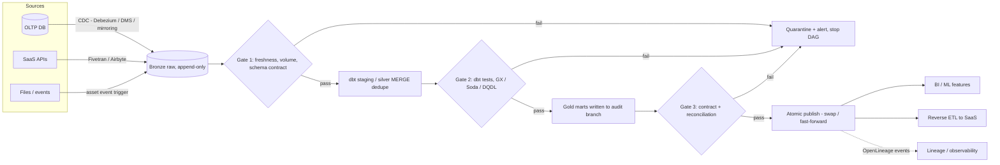
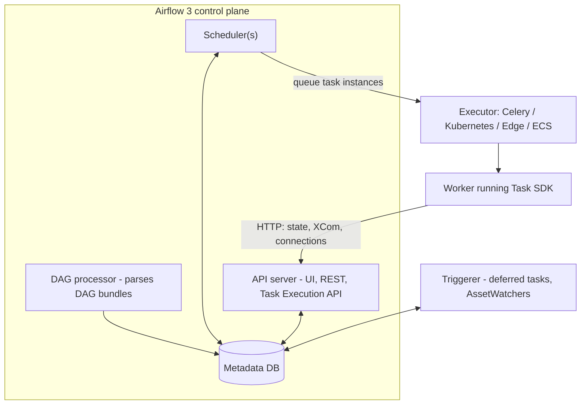

# M6 Orchestration & ETL/ELT
> Last verified: 2026-10 · Audience: senior/staff DevOps, SRE, AI eng, NetEng, DevSecOps, architects

## TL;DR
- **ELT is the default** on cloud warehouses/lakehouses: land raw data cheaply (bronze), transform in-engine with SQL/dbt/Spark; keep ETL for PII stripping before landing, heavy pre-shaping, or constrained targets.
- An orchestrator schedules **idempotent, partition-scoped tasks** in a **DAG**; correctness comes from **idempotency + deterministic data intervals**, not from "exactly-once" promises. Retries and backfills are only safe if a re-run of partition X overwrites partition X.
- **Airflow 3.x** (3.0 Apr 2025 → 3.3.2 Sep 2026) is a re-architecture: **Task SDK + Task Execution API** (workers no longer touch the metadata DB), **API server** replaces webserver, mandatory **DAG processor**, **DAG versioning/bundles**, **assets** (ex-datasets) + event-driven scheduling, **scheduler-managed backfills**, `catchup=False` by default, SLAs replaced by **Deadline Alerts** (3.1), Java/Go Task SDKs (3.3).
- Know the **asset-centric vs task-centric** split: Dagster/dbt/Airflow assets model *data products*; Step Functions/Temporal/Argo model *process steps*. Temporal / Step Functions Standard / Durable Functions = **durable execution** for long-running business workflows, not a dbt scheduler.
- **Quality gates are circuit breakers**: dbt tests / Great Expectations / Soda / Glue DQ (DQDL) fail the DAG *before* publishing; pair with **data contracts** at producer boundaries and **write-audit-publish** for zero-bad-data exposure.
- **CDC** (Debezium, AWS DMS, Fabric mirroring) reads the DB log (binlog/WAL/redo) → ordered change stream → **MERGE/upsert** into the lake; watch replication-slot WAL bloat, schema drift, deletes, and initial snapshot cost.
- Cloud map: **MWAA (+ MWAA Serverless) / Glue / Step Functions / DMS / EventBridge Scheduler** ↔ **ADF / Fabric Data Factory (pipelines, Copy job, Dataflow Gen2, Apache Airflow job) / Logic Apps / Durable Functions / Fabric mirroring**; cross-cloud: **Databricks Lakeflow Jobs**, Dagster+, dbt platform.
- Observability = **freshness, volume, schema, distribution, lineage**; emit **OpenLineage** events (Airflow provider, Spark, dbt) for impact analysis and governance (see L5).

## M6.1 ETL vs ELT
- **How it works:**
  - **ETL**: extract → transform on a separate engine (Glue Spark, ADF Mapping Data Flow / Dataflow Gen2, SSIS, Informatica) → load curated data. Target only ever sees clean data.
  - **ELT**: extract → load raw (S3/ADLS/OneLake, warehouse staging) → transform inside the target (dbt SQL, Spark SQL, Snowflake/Redshift/Fabric Warehouse/Databricks SQL).
  - **Medallion** (bronze raw/append-only → silver cleaned/conformed → gold marts) is the lakehouse expression of ELT (see [M1](./M1-lakehouse-table-formats.md), [M3](./M3-databricks-platform.md)).
  - **EtLT**: light "t" in flight (PII hashing/tokenization, dedupe, type coercion), heavy T in-warehouse — common compromise for compliance.
- **Trade-offs / when to use:**
  - ELT wins: elastic warehouse compute, replayability from raw, analysts own SQL, schema-on-read; cost = storing raw + warehouse compute for transforms.
  - ETL wins: regulated data that must not land raw (PCI/PHI — see [L1](../L-data-privacy-ai-security/L1-data-classification-pii.md)), very large reductions before load (IoT downsampling), legacy targets with weak compute, or reverse flows into OLTP.
  - Always keep an **immutable raw layer** (with retention policy) — it is your backfill source of truth.
- **Interview angles:**
  - "Why ELT?" → separation of ingest from modeling, reprocessing from raw without re-extracting from source (source APIs rate-limit, OLTP can't be re-scanned freely), version-controlled SQL with tests.
  - Pitfall: "ELT means no data engineering" — you still need contracts, dedupe, late data handling, and cost controls (runaway warehouse spend from full refreshes).
  - Fabric's own docs frame Dataflow Gen2 as ETL and Spark/SQL-in-OneLake as ELT; Fabric supports both in one pipeline.

## M6.2 Orchestration concepts
### DAGs, dependencies, scheduling
- **DAG**: tasks + directed edges, no cycles; scheduler evaluates **trigger rules** (all_success default; all_done, one_failed, none_failed_min_one_success…) to decide readiness.
- **Time-based scheduling**: cron/timedelta. **Data-aware / event-driven**: run when an upstream *asset* updates (Airflow assets, Dagster asset sensors/auto-materialize, Lakeflow Jobs table-update & file-arrival triggers, ADF/Fabric storage event triggers, EventBridge rules → Step Functions).
- Prefer data-aware triggers across team boundaries — cron "run at 03:00 and hope upstream finished" is the classic anti-pattern.
### Data-interval semantics (Airflow)
- A run covers `[data_interval_start, data_interval_end)`; **logical_date = start of the interval**, the run executes *after* the interval ends (daily run for 2026-10-08 fires at 2026-10-09T00:00).
- **Airflow 3 default timetable for cron strings is `CronTriggerTimetable`** (`[scheduler] create_cron_data_intervals = False`) — start == end, i.e. "run at this time" semantics. Airflow 2.x defaulted to `CronDataIntervalTimetable`. Migration gotcha: templates using `data_interval_start` silently change meaning.
- Others: `MultipleCronTriggerTimetable`, `EventsTimetable` (fixed list of datetimes), `AssetOrTimeSchedule` (asset events OR time).
### Idempotency, retries, backfills
- **Idempotent task** = same inputs (interval/partition) → same output state; implement with partition overwrite (`INSERT OVERWRITE`, Delta `replaceWhere`, `delete+insert` on the interval), MERGE on natural keys, deterministic file names, staging-then-swap. Never `INSERT` + `now()`.
- **Retries**: `retries`, `retry_delay`, `retry_exponential_backoff`, `execution_timeout`; 3.3 adds **pluggable retry policies**. Retry only transient errors; poison data should fail fast and alert.
- **Backfill** = re-running historical intervals; Airflow 3 backfills are **scheduler-managed** (visible in UI/API) via `airflow backfill create --from-date --to-date --reprocess-behavior {none|failed|completed} --max-active-runs N [--run-backwards]`.
- **Catchup**: Airflow 3 `catchup_by_default=False` — deploying a DAG with an old `start_date` no longer floods the cluster.
- **Concurrency controls**: `max_active_runs`, `max_active_tasks`, **pools** (protect a fragile source DB to N slots), `priority_weight`.
### Sensors, SLAs, deadlines
- **Sensors** wait for a condition (file, partition, external task). `poke` mode holds a worker slot; `reschedule` frees it between pokes; **deferrable operators** hand waiting to the async **triggerer** — the scalable default.
- **SLA**: freshness promise to consumers ("gold.orders ready by 06:00 UTC, 99% of days" — treat as an SLO, see [J1](../J-sre/J1-slis-slos-error-budgets.md)). Airflow 2 `sla=` was **removed in 3.0**; replaced by **Deadline Alerts** (3.1, sync callbacks 3.2, Deadlines UI page 3.3).
- **Interview angles:**
  - "How do you make a pipeline safe to retry?" → partition-scoped writes keyed on logical date, overwrite not append, MERGE with dedupe keys, external side effects behind idempotency keys.
  - "Backfill 2 years without killing prod?" → bounded `max_active_runs`, pools for source DBs, run on separate compute/queue, reprocess only failed/missing partitions, backfill from raw not source.
  - Pitfall: using wall-clock `now()` inside tasks breaks backfills; use templated interval values.

## M6.3 Apache Airflow architecture and 3.x changes
- **How it works (3.x components):**
  - **Scheduler**: creates DAG runs, evaluates dependencies, queues task instances to the **executor**. HA = multiple active schedulers using DB row locks (`SELECT … FOR UPDATE SKIP LOCKED`), so Postgres/MySQL 8 required.
  - **DAG processor** (mandatory standalone in 3.0): parses DAG files from **DAG bundles** (local, Git…) — keep top-level code cheap; heavy imports at parse time are the #1 perf killer.
  - **API server**: replaces the webserver; serves the React UI, public REST API, and the **Task Execution API**.
  - **Workers** run tasks using the **Task SDK** (`from airflow.sdk import dag, task, Asset`); tasks talk to the API server over HTTP — **no direct metadata-DB access** from task code (security + scalability + multi-language). **Java and Go Task SDKs** arrive in 3.3.
  - **Triggerer**: asyncio process hosting deferred tasks/sensors and **AssetWatchers** (event-driven scheduling, e.g. message-queue trigger on SQS).
  - **Metadata DB**: DAG runs, task instances, XCom, connections/variables (better: secrets backend — AWS Secrets Manager / Azure Key Vault).
- **Executors**: `LocalExecutor`; `CeleryExecutor` (Redis/RabbitMQ broker, warm workers, low latency); `KubernetesExecutor` (pod per task, isolation, cold-start seconds); **`EdgeExecutor`** (3.0, workers at remote sites/other clouds pulling over HTTP); AWS `EcsExecutor`, `BatchExecutor`. **Multiple executors concurrently** since 2.10 (`executor = LocalExecutor,CeleryExecutor`, first is default, per-task `executor=`); hard-coded `CeleryKubernetesExecutor`/`LocalKubernetesExecutor` **removed in 3.0**.
- **Other 3.x facts**: **DAG versioning** (runs pinned to the DAG version they started with; UI shows history); **assets** renamed from datasets, `schedule=` unified (no `schedule_interval`); `execution_date` removed → `logical_date`; 3.1 **human-in-the-loop** approvals; 3.2 **asset partitioning**, **multi-team deployments**, SQLAlchemy 2.0, Python 3.14; 3.3 **task & asset state store**, OTel histogram timers.
- **Trade-offs / when to use:**
  - Airflow: huge provider ecosystem, de-facto standard, Python-as-config. Weak at: sub-minute latency, large data passing (XCom is for small metadata — pass URIs), high-frequency micro-tasks.
  - Celery vs Kubernetes executor: throughput/latency vs isolation/per-task resources; mixed via multi-executor.
- **Interview angles:**
  - "Scheduler is slow" → check DAG parse time (`dag_processor` stats), number of DAG files, top-level code, DB health (connection pool, PgBouncer), `parallelism`, pool saturation.
  - "Why did 3.0 cut DB access from tasks?" → least privilege (a task could rewrite any state), DB connection storms at scale, enabling remote/edge and non-Python workers.
  - Upgrade 2→3: run `ruff` AIR rules, replace `airflow.models` imports with `airflow.sdk`, check DB-touching custom operators, `schedule_interval`, SLA usage, cron timetable semantics.

## M6.4 Managed Airflow (MWAA, MWAA Serverless, Fabric Apache Airflow job)
- **Amazon MWAA (provisioned)**: Fargate scheduler/workers in a service VPC wired to your private subnets; DAGs/requirements/plugins from S3; Celery executor with SQS; AWS-managed metadata DB; IAM-gated UI (public or private endpoint); CloudWatch logs/metrics.
  - Versions (Sep 2026): **v3.3.1, v3.2.1, v3.0.6**, v2.11.x, v2.10.x… (2.4.3/2.5.1/2.6.3 EOS 2025-12-30). Minor-version in-place upgrade/downgrade only; major 2→3 = new environment (Migration Guide). Since v3 the MWAA webserver also hosts the execution API server.
  - Schedulers 2–5 (default 2); workers min 1 / max 25 (default 10) autoscaled; classes `mw1.micro` … 2XL. `requirements.txt` must carry a `--constraint` (2.7.2+). **Multi-team mode not supported**.
  - Billing: hourly per environment class + extra workers/schedulers + metadata DB storage — idles cost money.
- **Amazon MWAA Serverless**: Airflow 3 / Python 3.12; workflows defined as **YAML (DAG-factory format)** (Python convertible), submitted via CLI/API; scheduling via **EventBridge Scheduler**; **per-workflow IAM execution role and isolated compute per task**; **pay per task run time**; built-in workflow versioning. Trade-offs: no Airflow UI, per-task cold start, AWS operators only (no custom Python operators/plugins).
- **Fabric Apache Airflow job** (next gen of ADF *Workflow Orchestration Manager*): managed Airflow inside Fabric Data Factory, Git sync, Key Vault backend, autoscale, HA, deferrable operators, pause/resume TTL. **Supported Airflow: 2.10.5 / Python 3.12** (no 3.x yet as of Oct 2026); version can't be changed in place; **no private network / VNet support** yet.
- **Others**: Google Cloud Composer, Astronomer (Astro) — commercial managed Airflow with remote execution agents.
- **Interview angles:** "MWAA vs self-hosted on EKS?" → MWAA: less ops, IAM integration, capped at 25 workers/env and version lag; EKS + official Helm chart: KubernetesExecutor, any version, custom auth, but you own DB, upgrades, HA. "Sporadic AWS-only pipelines?" → MWAA Serverless or Step Functions.

## M6.5 Alternative orchestrators and durable workflow engines
| Tool | Model | Strengths | Watch-outs |
|---|---|---|---|
| **Dagster** (OSS + Dagster+) | **Asset-centric**: software-defined assets, partitions, asset checks, sensors, declarative automation | Lineage-native, partitioned backfills, typed IO managers, great local dev/testing | Different mental model from tasks; smaller ecosystem |
| **Prefect** (3.x) | Python flows/tasks, work pools + workers, hybrid control plane | Dynamic workflows, minimal boilerplate, events/automations | Less opinionated on data assets |
| **Argo Workflows** | K8s CRD; each step a pod; DAG or steps templates (CNCF graduated) | K8s-native, artifact passing, ML/CI batch | YAML-heavy; no data-interval semantics; you build backfill logic |
| **Temporal** | **Durable execution**: workflow code replayed from event history; activities with retries/timeouts | Long-running (days–years), sagas, human waits, exactly-once *workflow* state | Deterministic workflow code required; history size limits (~50K events; continue-as-new) (unverified) |
| **AWS Step Functions** | ASL state machine; Standard (≤1 yr, exactly-once, priced per state transition, 90-day history) vs Express (≤5 min, async at-least-once / sync at-most-once, priced per execution+duration+memory) | 200+ service integrations, `.sync` job-run & `.waitForTaskToken` callbacks (Standard only), Distributed Map (Standard only) | Not a data scheduler: no backfill/interval concepts; workflow type immutable |
| **Azure Durable Functions / Logic Apps** | Code-first orchestrator functions (event-sourced replay, like Temporal) / low-code connectors workflows | Fan-out/fan-in, human interaction, eternal orchestrations | Orchestrator determinism rules; Logic Apps per-action billing (Consumption) |
| **Databricks Lakeflow Jobs** (ex-Workflows) | Multi-task jobs: notebooks, pipelines, SQL, dbt, Python, if/else, for-each, run-job | Scheduled, file-arrival, table-update, continuous triggers; repair runs; serverless jobs; 1,000 tasks/job, 2,000 concurrent task runs/workspace | Databricks-scoped; cross-system orchestration often still Airflow |
| **ADF / Fabric pipelines** | Low-code activities, control flow, triggers (schedule, tumbling window, event) | 170+ connectors, SLA 99.9% & activity runs start within 4 min | JSON/UI authoring; tumbling window is ADF's backfill-aware interval trigger |
- **Interview angles:**
  - "Airflow vs Temporal?" → Airflow = batch data scheduling by interval; Temporal = durable business process (order fulfilment, payment saga) with per-entity workflows at millions scale. Often both: Temporal for app workflows emitting events, Airflow/Dagster for analytics.
  - "Airflow vs Step Functions?" → Step Functions for serverless event-driven AWS glue with exactly-once state; Airflow for many cross-system batch DAGs needing backfills and data intervals.
  - "Why Dagster?" → orchestration of *what data should exist* (assets + freshness policies), automatic lineage, partition-aware backfills.

## M6.6 dbt (data build tool)
- **How it works:**
  - Project of **models** (SELECT statements; Jinja + `ref()`/`source()` build the DAG), **materializations**: view, table, incremental, ephemeral, materialized_view; **seeds**, **snapshots**, **tests**, **macros**, **exposures**, **semantic layer** metrics.
  - `dbt build` = run + test + snapshot + seed in DAG order; a **failing test skips downstream nodes** — built-in circuit breaker.
  - **Incremental strategies**: `append`, `merge` (needs `unique_key`; `merge_update_columns`/`merge_exclude_columns`, `incremental_predicates` to prune target scan), `delete+insert`, `insert_overwrite` (partition replace; adapter-dependent — check the adapter matrix), **`microbatch`** (1.9+: `event_time`, `batch_size` hour/day/month, `lookback`, per-batch retries and targeted backfills with `--event-time-start/--event-time-end`; adapter support varies — Snowflake, Databricks confirmed). `on_schema_change`: ignore (default) / append_new_columns / sync_all_columns / fail.
  - **Snapshots** = SCD Type 2: `timestamp` (recommended) or `check` strategy; meta columns `dbt_valid_from`, `dbt_valid_to`, `dbt_scd_id`, `dbt_updated_at`; 1.9+ YAML config, `dbt_valid_to_current`, `hard_deletes: ignore | invalidate | new_record` (adds `dbt_is_deleted`).
  - **State/slim CI**: `dbt build --select state:modified+ --defer --state prod-artifacts/` builds only changed models against prod refs.
- **Distributions (as of 2026-10, verify before quoting):** **dbt v1** (Python "dbt Core", Apache 2.0, still supported); **dbt v2** = the Rust engine (originally announced as the **dbt Fusion engine**, 2025) — default install, free, proprietary *dbt Product Licensing Agreement*, native SQL comprehension/dialect-aware compile; **dbt OSS** (`dbt-oss`, Apache 2.0) = open runtime of v2; **dbt platform** (formerly dbt Cloud) = hosted IDE, scheduler, CI, state-aware orchestration, catalog, semantic layer. Fivetran–dbt Labs merger announced Oct 2025 (unverified completion status).
- **Interview angles:**
  - "Incremental model got duplicates" → missing/not-unique `unique_key`, `append` strategy on retries, late-arriving rows outside the incremental filter (add lookback), concurrent runs.
  - "When full-refresh?" → schema change on `on_schema_change: fail`, logic change affecting history; schedule periodic full refresh or microbatch backfill for drift.
  - Orchestrating dbt from Airflow: Cosmos (renders dbt nodes as Airflow tasks) vs single `dbt build` task; trade granularity/retries vs scheduler load.

## M6.7 Data quality, contracts and circuit breakers
- **Dimensions**: freshness, volume, completeness (nulls), uniqueness, validity (ranges/enums/regex), referential integrity, distribution drift, schema.
- **Tools:**
  - **dbt tests**: generic `unique`, `not_null`, `accepted_values`, `relationships` (+ packages dbt-utils/dbt-expectations), singular SQL tests, **unit tests** (1.8+, mock inputs), `severity: warn|error`, `warn_if`/`error_if` thresholds, `store_failures`; **model contracts** (`contract: {enforced: true}` checks column names/types/constraints at build) + model **versions** for breaking changes.
  - **Great Expectations** (GX Core 1.x / GX Cloud): Expectations → Expectation Suites → Checkpoints (validate + actions) → Data Docs.
  - **Soda** (Soda Core / Soda Cloud): SodaCL YAML checks (`row_count > 0`, `missing_count(col) = 0`, freshness), anomaly checks.
  - **AWS Glue Data Quality**: built on **Deequ**; **DQDL** rulesets (2,000 rules / 65 KB max per ruleset), rule recommendations (BASIC; **ADVANCED via Amazon Bedrock**, Sep 2026), dynamic rules (`RowCount > avg(last(10))`), ML anomaly detection, row-level failure identification in ETL jobs, EventBridge events, results to S3 or Iceberg tables in the Data Catalog. Entry points: Data Catalog (at rest) vs Glue ETL jobs (in transit).
  - Azure/Fabric: Microsoft Purview Data Quality (unverified feature depth), Databricks **Lakeflow Declarative Pipelines expectations** (`expect`, `expect_or_drop`, `expect_or_fail`).
- **Patterns:**
  - **Circuit breaker**: hard-fail checks stop publish; soft checks warn. Tier checks by blast radius.
  - **Write-Audit-Publish (WAP)**: write to staging/branch (Iceberg branch, Delta shallow clone, schema swap) → audit → atomic publish; consumers never see bad data.
  - **Quarantine** bad rows to a side table with reason codes rather than dropping silently.
  - **Data contracts**: producer-owned schema + semantics + SLAs (ODCS / YAML), enforced in CI (schema registry compatibility for Kafka — see [M4](./M4-kafka-at-scale.md)) and at ingest.
- **Interview angles:** "Upstream silently changed a column meaning" → contracts + distribution checks, not just schema checks; lineage to find impacted dashboards; ownership/on-call per data product.

## M6.8 CDC ingestion (Debezium, AWS DMS, Fabric mirroring)
- **How it works:** read the DB's replication log — MySQL **binlog** (ROW format), Postgres **WAL via logical decoding** (`pgoutput`, replication slot + publication), Oracle **LogMiner/XStream**, SQL Server **CDC tables/log** — emit ordered insert/update/delete events with before/after images; initial **snapshot** then streaming. See [B8 replication](../B-database-engineering/B8-database-replication.md).
- **Debezium**: Kafka Connect source connectors (or Debezium Server → Kinesis/Pub/Sub/Event Hubs etc.); event envelope `before`/`after`/`op` (c/u/d/r)/`source` (LSN/binlog pos)/`ts_ms`; incremental snapshots via signal table; at-least-once → sinks must dedupe on key + log position. Pitfall: an idle/stuck Postgres **replication slot retains WAL → disk fills** (set `max_slot_wal_keep_size`, heartbeat).
- **AWS DMS**: replication instance or **DMS Serverless**; task types **full load / full load + CDC / CDC only**; sources Oracle, SQL Server, MySQL, Postgres, Mongo, etc.; targets RDS/Aurora, Redshift, S3 (CSV/Parquet), Kinesis, MSK/Kafka, DynamoDB, OpenSearch; **data validation**, LOB modes (limited/full/inline), **DMS Schema Conversion** for heterogeneous moves. One endpoint must be in AWS. (General facts; check per-engine limits.)
- **Fabric mirroring**: **database mirroring** (Azure SQL DB/MI, SQL Server, Cosmos DB, Azure PostgreSQL, Oracle, SAP, Snowflake, **BigQuery GA**, MySQL preview), **metadata mirroring** (shortcuts, e.g. Azure Databricks Unity Catalog, Snowflake, Dremio preview), **open mirroring** (write change files to a landing zone per spec). Lands **Delta in OneLake** + SQL analytics endpoint; changes publishable every ~15 s; **replication compute free** and **1 TB free mirror storage per CU** (F64 → 64 TB); default Delta retention 1 day (new). Replaces Azure Synapse Link. Fabric **Copy job** handles bulk/incremental/CDC copies.
- **Trade-offs:** log-based CDC = low source load, captures deletes, ordered; query-based (watermark on `updated_at`) = simple but misses hard deletes and same-timestamp updates. Mirroring = turnkey but Fabric-only target; Debezium = most flexible, you run Kafka.
- **Interview angles:** "Land CDC into a lakehouse correctly" → bronze append of raw events → silver `MERGE` keyed on PK ordered by LSN/sequence (latest wins, apply deletes), handle out-of-order and duplicates, periodic compaction; Databricks `APPLY CHANGES`/AUTO CDC, Iceberg/Delta MERGE ([M1](./M1-lakehouse-table-formats.md)).

## M6.9 Managed ETL connectors and reverse ETL
- **Fivetran**: fully managed SaaS/DB connectors, schema drift handling, priced on **Monthly Active Rows (MAR)**; HVR-based DB CDC; dbt integration. **Airbyte**: open-source (self-host on K8s) + Airbyte Cloud, 500+ connectors, low-code Connector Builder, CDK. Others: Stitch, Meltano, AWS AppFlow / Glue zero-ETL, Fabric Copy job, Lakeflow Connect.
- **Zero-ETL** (AWS Aurora/RDS/DynamoDB → Redshift/SageMaker Lakehouse; Fabric mirroring) removes pipelines for common source→warehouse paths.
- **Reverse ETL**: sync warehouse models (customer 360, lead scores) back to SaaS (Salesforce, HubSpot, ad platforms) — Hightouch, Census (acquired by Fivetran 2025, unverified). Concerns: API rate limits, upsert keys, diffing to send only changes, PII governance on egress.
- **Trade-offs:** buy connectors for long-tail SaaS APIs (maintenance is the cost); build/own for core high-volume DB CDC where cost (MAR) and latency matter.
- **Interview angles:** "Fivetran bill exploded" → a table with churny updates (MAR counts each changed row/month), unneeded columns/tables synced, re-syncs; mitigate with column/table selection, sync frequency, moving big DBs to DMS/Debezium.

## M6.10 Pipeline observability and lineage
- **Signals:** run status/duration/queue time (Airflow StatsD/**OpenTelemetry** metrics — histograms in 3.3), task retries, data **freshness**, row counts/volume deltas, schema changes, quality-check pass rate (Glue DQ score), cost per pipeline.
- **OpenLineage** (LF AI & Data graduated): spec of **Run / Job / Dataset + facets**; RunEvents `START`, `RUNNING`, `COMPLETE`, `FAIL`, `ABORT`; integrations: **Airflow provider** (`apache-airflow-providers-openlineage`), Spark listener, dbt, Flink, Trino, Great Expectations; reference backend **Marquez**; consumers include DataHub, OpenMetadata, Microsoft Purview, Unity Catalog lineage (vendor-specific). Governance/lineage context: [L5](../L-data-privacy-ai-security/L5-model-data-governance.md).
- **Data observability tools**: Monte Carlo, Bigeye, Elementary (dbt-native), Soda; MWAA → CloudWatch; Fabric → Monitoring hub.
- **Interview angles:** "A dashboard is wrong — find the cause in minutes" → column-level lineage upstream, freshness per hop, recent schema/contract changes, last successful run per asset. Tie alerts to data SLOs not to every task failure (see [J2](../J-sre/J2-monitoring-and-alerting.md), [J3](../J-sre/J3-observability.md)).

## M6.11 Cost and reliability patterns
- **Partitioned reprocessing**: everything keyed by partition (date/hour/tenant); reprocess = overwrite affected partitions only (`insert_overwrite`, Delta `replaceWhere`, dbt microbatch, Dagster partitions, Airflow backfill with `--reprocess-behavior failed`).
- **Late-arriving data**: event-time vs processing-time; **lookback window** (re-process last N partitions each run), watermarks in streaming ([M5](./M5-stream-processing.md)), late-row MERGE upsert, "restatement" flags for downstream; ADF tumbling window dependency offsets.
- **Exactly-once loads** = at-least-once delivery + idempotent sink: MERGE on business key + version/LSN, dedupe in staging (`ROW_NUMBER() … QUALIFY = 1`), transactional table formats (Delta/Iceberg atomic commits), load manifests/checkpoints (Glue **job bookmarks**, Auto Loader checkpoints), idempotency tokens on external APIs.
- **Merge/upsert costs**: MERGE rewrites files containing matched rows → cluster/partition target on merge key, use incremental predicates to prune, deletion vectors (Delta) / merge-on-read (Iceberg) for write-heavy tables, compact regularly ([M1](./M1-lakehouse-table-formats.md), [M2](./M2-spark-at-scale.md)).
- **Cost levers**: serverless/ephemeral compute per task (MWAA Serverless, Glue Flex, Databricks serverless jobs, K8s executor), right-size MWAA class, avoid full refreshes, incremental + state-based CI, schedule heavy jobs off-peak, kill zombie retries, push down filters at the source.
- **Reliability levers**: dead-man's-switch freshness alerts, pools for source protection, timeouts on every task, retries with jitter, isolation of noisy DAGs (queues/executors), runbook per data product, DR = metadata DB backup + DAGs in Git + replayable raw layer ([C3](../C-large-scale-architecture/C3-reliability.md)).
- **Interview angles:** "Pipeline must be exactly-once end to end" → push back: guarantee effective-once via idempotent writes and dedupe keys; Step Functions Standard is exactly-once *per state transition*, but external side effects still need idempotency.

## Diagrams




## Cloud mapping: AWS vs Azure
| Capability | AWS | Azure | Role it plays | Key differences | Alternatives |
|---|---|---|---|---|---|
| Managed Airflow | **MWAA** (provisioned; Airflow 3.3.1/3.2.1/3.0.6/2.11) and **MWAA Serverless** (Airflow 3, YAML) | **Fabric Apache Airflow job** (Airflow 2.10.5); ADF Workflow Orchestration Manager (predecessor) | Code-first DAG orchestration | MWAA on Airflow 3 today; Fabric still 2.10.5 & no VNet; MWAA Serverless pay-per-task, no UI | Astronomer, Cloud Composer, self-host on EKS/AKS (Helm) |
| Low-code pipelines / ETL | **AWS Glue** (Spark jobs, workflows/triggers, bookmarks, Flex), Glue Studio | **Azure Data Factory**, **Fabric Data Factory** pipelines + **Dataflow Gen2** + **Copy job** | Data movement + transform + control flow | ADF = PaaS pay-per-activity/DIU; Fabric = SaaS on F-SKU capacity; Glue = per DPU-hour | Databricks Lakeflow Jobs/Connect, Informatica |
| State-machine / durable workflow | **Step Functions** (Standard/Express) | **Logic Apps** (low-code), **Durable Functions** (code, event-sourced) | Business-process & service orchestration, sagas | SFN exactly-once Standard ≤1 yr; Durable Functions replay model like Temporal | Temporal, Argo Workflows, Prefect |
| Scheduling / event triggers | **EventBridge Scheduler** (cron/rate/one-time, flexible windows), EventBridge rules, S3 events | ADF/Fabric schedule, **tumbling window**, storage-event triggers; Fabric **Activator**; Logic Apps recurrence | Start runs on time or on data arrival | Tumbling window has native backfill/dependency semantics; EventBridge Scheduler scales to millions of schedules | Airflow assets, Dagster sensors, Lakeflow file-arrival/table-update triggers |
| CDC / replication | **AWS DMS** (+ Serverless, Schema Conversion), zero-ETL integrations | **Fabric mirroring** (database/metadata/open), Copy job CDC; ADF CDC (being superseded) | Log-based change capture into analytics | DMS = general migration/CDC to many targets; mirroring = Delta in OneLake only, free replication compute + 1 TB/CU | Debezium + Kafka/MSK/Event Hubs, Fivetran HVR, Lakeflow Connect |
| Data quality | **Glue Data Quality** (DQDL, Deequ, anomaly detection) | Purview Data Quality (unverified depth), Fabric/Databricks expectations | Gate & monitor data | Glue DQ integrated into Glue jobs & Catalog | dbt tests, Great Expectations, Soda, Monte Carlo |
| Transformation-as-code | dbt on Redshift/Athena/Glue | dbt on Fabric Warehouse; **Fabric dbt job** | SQL modeling, tests, snapshots | Fabric offers native dbt job item | dbt platform, SQLMesh, Lakeflow Declarative Pipelines |
| Lineage | SageMaker Catalog / DataZone lineage (OpenLineage-compatible) (unverified) | Microsoft Purview lineage | Impact analysis, governance | Both ingest from ADF/Glue natively; OpenLineage bridges | Marquez, DataHub, OpenMetadata, Unity Catalog |
- **MWAA** gives real Airflow with IAM UI auth, private-subnet workers and hourly environment billing; ceiling 25 workers / 5 schedulers per environment — shard environments by domain at scale. **MWAA Serverless** trades flexibility (YAML, AWS operators, no UI) for per-workflow IAM isolation and zero idle cost.
- **Glue** is the serverless Spark ETL engine + Data Catalog; Glue *workflows* are basic — complex DAGs usually move to MWAA or Step Functions (`glue:startJobRun.sync`).
- **Step Functions ↔ Durable Functions/Logic Apps**: genuinely equivalent for process orchestration; neither replaces an interval-aware data scheduler.
- **ADF → Fabric Data Factory**: Fabric drops datasets (connections only), no publish step, SHIR → on-premises data gateway, Managed VNet → customer VNet data gateway, Synapse Link → mirroring, ADF CDC → Copy job; SSIS IR not (yet) in Fabric. Pipeline SLA identical (99.9%, activity start within 4 min).
- **DMS ↔ mirroring** is the weakest equivalence: DMS is a general-purpose migration/CDC service with many targets; Fabric mirroring is a turnkey replica into OneLake. For Azure → non-Fabric targets, use ADF/Copy job CDC or Debezium on Event Hubs (Kafka endpoint).
- **Cross-cloud alternatives**: **Databricks Lakeflow Jobs** (orchestrate notebooks, pipelines, dbt, SQL with table-update triggers — strong if the lakehouse is Databricks), **Dagster+** (asset-centric, multi-cloud), **dbt platform** (scheduler for dbt-only shops; state-aware orchestration), Temporal Cloud for durable app workflows, Confluent for CDC streaming.

## Hands-on
```bash
# Local Airflow (official docker compose quick-start; pin the version you target)
AF_VER=3.3.2
mkdir -p ~/airflow-local && cd ~/airflow-local
curl -LfO "https://airflow.apache.org/docs/apache-airflow/${AF_VER}/docker-compose.yaml"
mkdir -p ./dags ./logs ./plugins ./config
echo -e "AIRFLOW_UID=$(id -u)" > .env          # Docker Engine needs >=4 GB RAM (8 GB ideal)
docker compose up airflow-init                 # migrates DB, creates airflow/airflow user
docker compose up -d                           # postgres, redis, api-server, scheduler, dag-processor, worker, triggerer
# UI: http://localhost:8080  (airflow / airflow); Flower: docker compose --profile flower up -d

# Scheduler-managed backfill (Airflow 3): rerun only failed runs, 3 at a time, newest first
docker compose exec airflow-scheduler airflow backfill create --dag-id daily_orders \
  --from-date 2026-09-01 --to-date 2026-09-30 \
  --reprocess-behavior failed --max-active-runs 3 --run-backwards

# Clear a failed task range for re-run
docker compose exec airflow-scheduler airflow tasks clear daily_orders \
  --task-regex 'load_.*' --start-date 2026-09-01 --end-date 2026-09-03 --yes
```

```yaml
# docker-compose.override.yaml — disable examples, send OpenLineage events to a Marquez instance
services:
  airflow-scheduler: &ol
    environment:
      AIRFLOW__CORE__LOAD_EXAMPLES: "false"
      AIRFLOW__OPENLINEAGE__NAMESPACE: "local-dev"
      AIRFLOW__OPENLINEAGE__TRANSPORT: '{"type":"http","url":"http://marquez:5000"}'
  airflow-worker: *ol
```

```hcl
# Amazon MWAA (provisioned) on Airflow 3 — private UI, encrypted, logs to CloudWatch
resource "aws_mwaa_environment" "this" {
  name                  = "data-platform-prod"
  airflow_version       = "3.3.1"
  environment_class     = "mw1.medium"
  execution_role_arn    = aws_iam_role.mwaa_exec.arn
  source_bucket_arn     = aws_s3_bucket.mwaa.arn
  dag_s3_path           = "dags/"
  requirements_s3_path  = "requirements.txt" # must include --constraint
  min_workers           = 2
  max_workers           = 20                 # MWAA hard max 25
  schedulers            = 2                  # 2-5
  webserver_access_mode = "PRIVATE_ONLY"
  kms_key               = aws_kms_key.mwaa.arn

  airflow_configuration_options = {
    "core.max_active_runs_per_dag" = "3"
    "secrets.backend"              = "airflow.providers.amazon.aws.secrets.secrets_manager.SecretsManagerBackend"
  }

  network_configuration {
    security_group_ids = [aws_security_group.mwaa.id]
    subnet_ids         = aws_subnet.private[*].id # two private subnets in different AZs
  }

  logging_configuration {
    task_logs {
      enabled   = true
      log_level = "INFO"
    }
    scheduler_logs {
      enabled   = true
      log_level = "WARNING"
    }
  }
}
```

## Cross-links
- [M1 Lakehouse table formats](./M1-lakehouse-table-formats.md) — MERGE, partition overwrite, WAP branches
- [M2 Spark at scale](./M2-spark-at-scale.md) · [M3 Databricks platform](./M3-databricks-platform.md) — Lakeflow Jobs/Declarative Pipelines
- [M4 Kafka at scale](./M4-kafka-at-scale.md) · [M5 Stream processing](./M5-stream-processing.md) — Debezium/Kafka Connect, watermarks
- [M7 Data warehouses](./M7-data-warehouses.md) — ELT targets
- [L5 Model & data governance](../L-data-privacy-ai-security/L5-model-data-governance.md) — lineage, OpenLineage · [L1 PII](../L-data-privacy-ai-security/L1-data-classification-pii.md) · [L6 Secrets](../L-data-privacy-ai-security/L6-secrets-supply-chain.md)
- [B8 Replication](../B-database-engineering/B8-database-replication.md) — WAL/binlog for CDC
- [J1 SLOs](../J-sre/J1-slis-slos-error-budgets.md) · [J2 Monitoring](../J-sre/J2-monitoring-and-alerting.md) · [J3 Observability](../J-sre/J3-observability.md) · [C3 Reliability](../C-large-scale-architecture/C3-reliability.md)

## Sources
- https://airflow.apache.org/docs/apache-airflow/stable/release_notes.html
- https://airflow.apache.org/docs/apache-airflow/stable/howto/docker-compose/index.html
- https://airflow.apache.org/docs/apache-airflow/stable/core-concepts/executor/index.html
- https://airflow.apache.org/docs/apache-airflow/stable/core-concepts/dag-run.html
- https://airflow.apache.org/docs/apache-airflow/stable/authoring-and-scheduling/timetable.html
- https://docs.aws.amazon.com/mwaa/latest/userguide/what-is-mwaa.html
- https://docs.aws.amazon.com/mwaa/latest/userguide/airflow-versions.html
- https://docs.aws.amazon.com/mwaa/latest/mwaa-serverless-userguide/what-is-mwaa-serverless.html
- https://github.com/hashicorp/terraform-provider-aws/blob/main/website/docs/r/mwaa_environment.html.markdown
- https://docs.aws.amazon.com/glue/latest/dg/glue-data-quality.html
- https://docs.aws.amazon.com/step-functions/latest/dg/choosing-workflow-type.html
- https://docs.aws.amazon.com/dms/latest/userguide/CHAP_Introduction.html
- https://learn.microsoft.com/en-us/fabric/data-factory/data-factory-overview
- https://learn.microsoft.com/en-us/fabric/data-factory/compare-fabric-data-factory-and-azure-data-factory
- https://learn.microsoft.com/en-us/fabric/data-factory/apache-airflow-jobs-concepts
- https://learn.microsoft.com/en-us/fabric/mirroring/overview
- https://docs.databricks.com/aws/en/jobs/
- https://docs.getdbt.com/docs/build/incremental-strategy
- https://docs.getdbt.com/docs/build/snapshots
- https://docs.getdbt.com/docs/fusion/about-fusion
- https://docs.getdbt.com/docs/dbt-licensing
- https://openlineage.io/docs/
