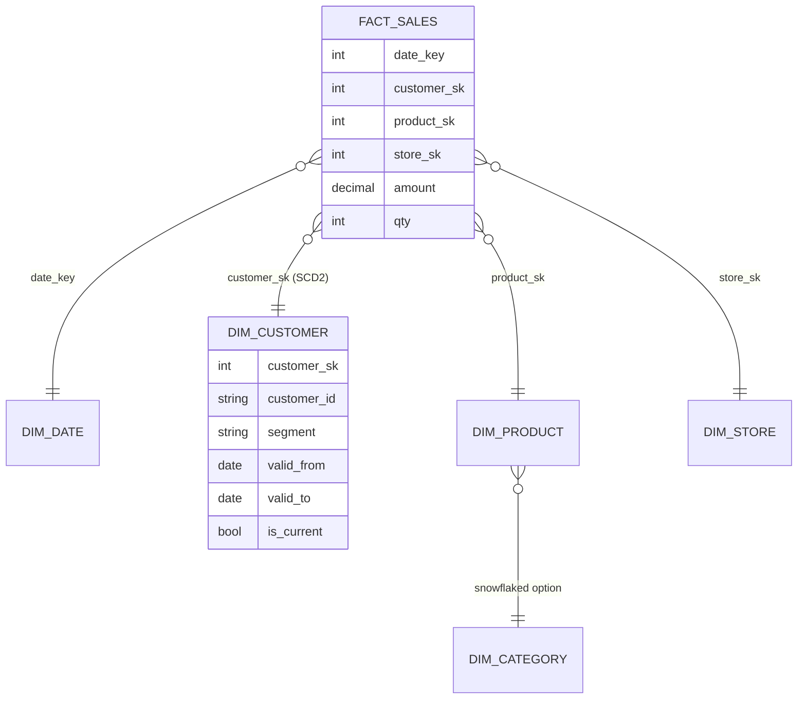
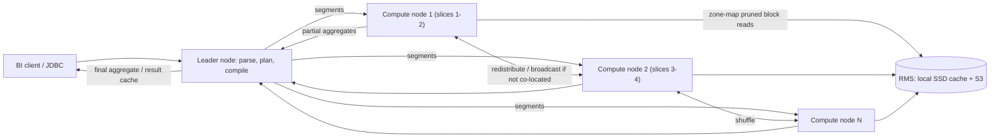
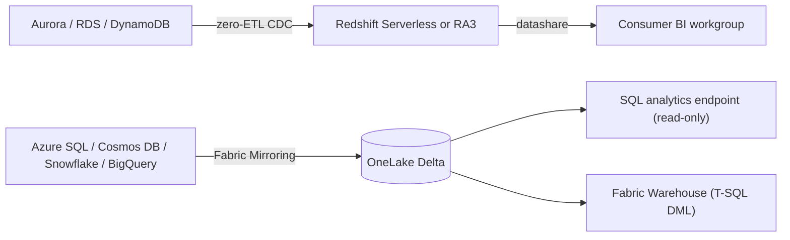

# M7 Data Warehouses (Cloud OLAP)
> Last verified: 2026-10 · Audience: senior/staff DevOps, SRE, AI eng, NetEng, DevSecOps, architects

## TL;DR
- A cloud warehouse is **columnar storage + compression + vectorized execution + MPP**. Performance comes from **reading less**: column projection, partition/zone-map/micro-partition **pruning**, and **co-located joins** that avoid network shuffles.
- Modern warehouses **separate storage and compute**: Redshift **RA3/RG** with Redshift Managed Storage (RMS) on S3, Snowflake virtual warehouses, BigQuery slots, and Fabric Warehouse on **OneLake Delta/Parquet**. You scale compute per workload and pay for storage on its own.
- Know the **cost-model shapes**: per node-hour (Redshift provisioned), **per RPU-second** (Redshift Serverless, 60 s minimum), **per TB scanned** (Athena $5/TB, BigQuery on-demand), **credits/second** (Snowflake, 60 s minimum on resume), **slot-hours** (BigQuery editions), and **capacity units (CU)** with 24 h smoothing (Fabric).
- **Physical design still matters on Redshift and Synapse**: distribution style (AUTO/EVEN/KEY/ALL; Synapse has 60 distributions with HASH, ROUND_ROBIN or REPLICATE), sort keys, skew. Snowflake, BigQuery and Fabric replace most of these choices with automatic micro-partitioning plus optional **clustering keys**.
- **Concurrency** is handled by WLM queues with priorities and **concurrency scaling** (Redshift), multi-cluster warehouses (Snowflake), slot reservations (BigQuery), and burst-then-smooth CUs (Fabric).
- **Zero-ETL** (Aurora/RDS/DynamoDB to Redshift) and **Fabric Mirroring** (Azure SQL, Cosmos DB, Snowflake, BigQuery and others to OneLake) replace hand-built CDC pipelines. Data sharing (Redshift datashares, Snowflake secure shares, Delta Sharing, OneLake shortcuts) replaces copying data.
- **Synapse dedicated SQL pools are legacy**. Microsoft points new work to **Fabric Data Warehouse** and provides a Migration Assistant.
- Use a **warehouse** for governed star schemas, high-concurrency BI and SQL-first teams. Use **lakehouse SQL engines** (Athena/Trino, Databricks SQL, Fabric SQL endpoint) for open formats, multi-engine access and ad-hoc analysis over the lake. Use **real-time OLAP** (ClickHouse/Druid/Pinot) for sub-second, user-facing analytics on fresh event data.

## M7.1 OLAP warehouse fundamentals (columnar, MPP, compression, vectorized)
- **How it works:**
  - **Columnar storage**: each column is stored on its own, so a query reads only the columns it touches. Row vs column trade-offs are covered in [B2.2](../B-database-engineering/B2-database-internals.md#b22-row-based-vs-column-based-databases).
  - **Compression** per column (dictionary, RLE, delta, bit-packing, LZ4/ZSTD) commonly reaches 3–10x, because values in one column are similar. Redshift `ENCODE AUTO`, Parquet in Fabric/Delta and Snowflake micro-partitions all compress per column.
  - **Block metadata** (min/max per block, called **zone maps** in Redshift and micro-partition metadata in Snowflake) lets the engine skip blocks without reading them.
  - **MPP**: a **leader/coordinator** parses and plans the query, then compiles it into segments that run in parallel on **compute nodes/slices**. Data moves between nodes through **redistribution/broadcast** steps (a shuffle), and the leader does the final aggregation.
    - Redshift: each compute node is split into **slices**. Default slices per node: ra3.xlplus 2, ra3.4xlarge 4, ra3.16xlarge 16.
    - Synapse dedicated: 60 distributions mapped onto compute nodes, plus a DMS (data movement service).
  - **Vectorized execution** processes batches of values (for example 1K–8K rows) per operator call, using SIMD and staying cache-friendly. Examples: Photon (Databricks), ClickHouse, Snowflake, Fabric/Polaris, and BigQuery Dremel. Redshift **compiles query segments** to machine code and caches them.
  - **Not OLTP**: single-row updates are expensive because blocks are immutable or copy-on-write. Load in **bulk** with `COPY`, CTAS or `INSERT…SELECT`, not row by row.
- **Trade-offs / when to use:**
  - Scans and aggregations over billions of rows: excellent. Point lookups, high-QPS single-row writes and enforced unique constraints: poor. Most warehouses declare PK/FK constraints but do **not enforce** them; they are used only as optimizer hints.
- **Interview angles:**
  - If asked "why is the warehouse faster than Postgres for this report?", cover I/O reduction (columns plus pruning), compression (more rows per byte of I/O and cache), parallelism across nodes, and vectorized CPU use.
  - Pitfall: `SELECT *` on a columnar engine reads every column. On per-TB-scanned engines you pay for every column.
  - Pitfall: many small single-row INSERTs create small blocks and fragmentation. Batch them, or use streaming ingestion features.

## M7.2 Dimensional modeling (star, snowflake, SCD, wide tables, Data Vault)
- **How it works:**
  - **Fact tables** hold measures (amount, qty) at a declared **grain** (one row per order line) plus foreign keys to dimensions. They are narrow and very long.
  - **Dimension tables** hold descriptive attributes (customer, product, date). They are wide, short and usually denormalized.
  - **Star schema**: the fact table joins directly to denormalized dimensions. **Snowflake schema** normalizes dimensions into sub-dimensions (product → category → department), giving more joins and less redundancy.
  - **Surrogate keys** (integers) stay stable across source-system key changes and keep join columns compact.
  - **SCD Type 1**: overwrite the value, so history is lost.
  - **SCD Type 2**: add a new row with `valid_from`/`valid_to`/`is_current` and a new surrogate key, so full history is kept. Facts join to the version that was current at event time.
    - Others: Type 3 keeps a previous-value column; Type 4 uses a history table; Type 6 is a hybrid of 1+2+3.
  - **Wide/denormalized "one big table" (OBT)**: pre-joins facts and dimensions. It suits columnar engines (no joins, and unused columns cost nothing). The downsides are expensive SCD/backfills and duplicated attributes.
  - **Data Vault 2.0**: Hubs (business keys), Links (relationships) and Satellites (attributes plus history). It is insert-only, auditable and parallel-loadable. Typically used as the **raw/integration layer**, with star-schema marts built on top.
  - Medallion layering (bronze/silver/gold) maps onto this: gold ≈ star schemas/marts. See [M1](./M1-lakehouse-table-formats.md).
- **Trade-offs / when to use:**
  - Star: the BI-tool default. Power BI semantic models and Direct Lake assume a star. Fabric documentation names star/snowflake as the ideal use case.
  - Snowflake schema: use it when dimensions are huge or shared. Costs more joins.
  - OBT: use it for a single dominant query pattern or a real-time OLAP engine such as ClickHouse/Druid/Pinot, which favour denormalized data.
  - Data Vault: use it for many sources, audit/regulatory needs, or a frequently changing source landscape. Costs model complexity.
- **Interview angles:**
  - "Design the warehouse for e-commerce": state the **grain** first. Then name the facts (`fact_order_line`, `fact_inventory_snapshot`), conformed dimensions (`dim_date`, `dim_customer` SCD2, `dim_product`), and late-arriving dimension handling (an "unknown" member row).
  - Follow-up: "how do you implement SCD2 incrementally?" Use `MERGE` on business key plus hash of attributes, close the old row, and insert the new one. On a lakehouse, use Delta `MERGE` or Change Data Feed ([M1](./M1-lakehouse-table-formats.md)).
  - Pitfall: mixing grains in one fact table, or summing semi-additive measures (balances) across time.

## M7.3 Storage–compute separation & elasticity
- **How it works:**
  - **Redshift RA3/RG + RMS**: local NVMe SSDs act as a cache, and S3 is the durable tier. Data spills to S3 automatically and storage is billed per GB-month whether it sits on SSD or in S3.
    - Per-node managed storage limits: ra3.xlplus 32 TB, ra3.4xlarge/16xlarge 128 TB. The total can reach 16 PB on 128 × ra3.16xlarge.
    - **RG nodes** (Graviton) are now recommended alongside RA3 and include an integrated data-lake query engine, whereas RA3 uses Spectrum.
    - DC2 nodes are the coupled-storage legacy type (local SSD only). DS2 is no longer available.
  - **Resize**: **elastic resize** takes minutes and redistributes slices (the slice count is preserved). **Classic resize** is slower and changes the slice layout. **Pause/resume** stops compute billing; you pay only for backup storage while paused.
  - **Snowflake**: shared storage (cloud object storage) plus independent **virtual warehouses**. Each warehouse suspends and resumes automatically, and many warehouses can read the same data without contention.
  - **BigQuery**: Colossus storage plus Dremel compute, allocated as **slots** and shuffled through a distributed memory tier. There is no cluster to manage.
  - **Fabric**: all data is Delta/Parquet in **OneLake**. Compute is the Polaris distributed engine billed from a shared **Fabric capacity** (CUs). Storage and compute are separated and the engine scales "near instantaneously" (MS docs).
  - **Synapse dedicated** (legacy) also separated storage from compute (pause, scale DWUs), but data still had to be laid out in its 60 distributions.
- **Trade-offs / when to use:**
  - Separation enables per-workload compute isolation (ETL vs BI), pause/scale-to-zero, cheap retention of large history, and data sharing without copies.
  - Cost: **cold-cache** reads from object storage are slower. The first query after resume or scale-out is slower, so warm caches for SLAs.
- **Interview angles:**
  - "Why RA3 over DC2?" Data grows faster than compute needs, so you pay per GB and get data sharing (which requires RA3/RG/Serverless) plus concurrency scaling for writes.
  - "Storage is cheap, so keep everything?" Yes, but govern retention, time-travel windows and snapshots. They all bill.

## M7.4 Data distribution & clustering
### Redshift (provisioned / Serverless)
- **DISTSTYLE** (verified):
  - **AUTO** (default): starts as ALL for small tables, may move to KEY (often the PK), then to EVEN as the table grows. Changes happen in the background.
  - **EVEN**: round-robin. Use it when a table has no joins or no clear key.
  - **KEY**: rows with the same value land on the same slice. Distribute fact and large dimension tables on the **join key** to get **co-located joins** with no redistribution.
  - **ALL**: a full copy on every node. Use it for small, slow-changing dimensions. It multiplies storage and load time, and AWS notes little benefit for small dims because broadcasting them is cheap anyway.
- **Sort keys**:
  - **Compound** sort keys are prefix-ordered, so the leading column matters most. They suit range filters on dates.
  - **Interleaved** sort keys weight each column equally, but they are costly to `VACUUM REINDEX` and **not supported by concurrency scaling**.
  - `SORTKEY AUTO` lets Redshift choose. Sort order drives **zone-map** pruning.
- Advisor views: `SVV_ALTER_TABLE_RECOMMENDATIONS` and `SVL_AUTO_WORKER_ACTION`. Check skew with `SVV_TABLE_INFO.skew_rows`.

### Azure Synapse dedicated SQL pool (legacy) vs Fabric Warehouse
- **Synapse**: every table is spread across **60 distributions**.
  - **HASH** distribution: up to 8 columns with `DW_COMPATIBILITY_LEVEL = 50`. Use it for fact tables larger than 2 GB.
  - **ROUND_ROBIN** is the default and suits staging tables.
  - **REPLICATE** suits small dimensions.
  - Choosing the hash column: many distinct values, few NULLs, **not a date column** and **not the WHERE column** (otherwise one distribution does the work). Up to 10% row skew is tolerable.
  - You cannot change the distribution column in place; rebuild with **CTAS**. Tables default to clustered columnstore.
- **Fabric Warehouse**: you choose **no distributions and no indexes**. Microsoft states "Fabric manages these optimizations automatically". Tables are Delta/Parquet with **V-Order** write optimization. Migration requires mapping data types:
  - money → decimal(19,4)
  - datetime → datetime2
  - nvarchar → varchar
  - tinyint → smallint
  - datetimeoffset is unsupported

### Snowflake
- **Micro-partitions**: 50–500 MB uncompressed, immutable and columnar, created automatically. Metadata records per-column min/max and distinct counts, which drives pruning.
- **Clustering depth** measures overlap between micro-partitions; lower is better. Check it with `SYSTEM$CLUSTERING_INFORMATION`.
- **Clustering keys** plus **Automatic Clustering** (a serverless service that consumes credits) suit only **large, frequently filtered tables** whose clustering has degraded.
- Pruning does **not** happen for predicates that contain subqueries, even constant ones.

### BigQuery
- **Partitioning** on a single column, in one of three types:
  - time-unit column (hour/day/month/year)
  - ingestion time (`_PARTITIONTIME`)
  - integer range
- Limit: **10,000 partitions per table**. Set `require_partition_filter` to block full scans.
- **Clustering**: up to **4 columns**, sorted storage blocks, block pruning. Prefer clustering over partitioning for high-cardinality columns, multi-column filters, or when partitions would be under ~10 GB.
- On-demand pricing **estimates** bytes up front for partition pruning. Clustering savings are known only after the query runs.

### Databricks / lakehouse
- Hive-style partitioning, Z-order, and now **liquid clustering**. See [M1](./M1-lakehouse-table-formats.md) and [M3](./M3-databricks-platform.md).

- **Trade-offs / when to use:** co-location (KEY/HASH on the join key) removes shuffles but risks **skew** on hot keys. Over-partitioning (too many small partitions or files) hurts more than it helps everywhere.
- **Interview angles:**
  - "Query got slow after data grew 10x": look for skew on the dist key, a broadcast of a now-large dimension, unsorted regions (Redshift `VACUUM SORT` / auto vacuum), or clustering depth degradation (Snowflake).
  - "Should I partition by customer_id?" No for BigQuery partitions (too high cardinality; cluster instead). Possibly yes for a Redshift DISTKEY if customer_id is the dominant join key and it is not skewed.

## M7.5 Concurrency & workload management
- **How it works:**
  - **Redshift WLM**: **Auto WLM** is recommended. Redshift decides concurrency and per-query memory, with up to **8 queues** and priorities (HIGHEST…LOWEST). **Manual WLM** allows up to 8 queues, a maximum of **50 slots per queue**, and AWS recommends **≤15 total slots**. Switching between WLM modes requires a **reboot**.
  - **Query Monitoring Rules (QMR)**: log, abort or change priority based on metrics such as `query_execution_time` or rows scanned. The HOP action is manual-WLM only.
  - **Short Query Acceleration (SQA)** sends predicted-short queries down a fast lane.
  - **Redshift concurrency scaling**: adds transient clusters when queues back up.
    - It handles reads and the writes COPY/INSERT/DELETE/UPDATE/CTAS/VACUUM; writes only on RA3/RG nodes.
    - Not supported: interleaved sort keys, temp tables, Python/Lambda UDFs, and writes to DISTSTYLE ALL tables or tables with identity columns.
    - `max_concurrency_scaling_clusters` defaults to **1**.
    - Billed per second while active. Clusters accrue **1 hour of free credits per 24 h** of main-cluster runtime (per pricing page; unverified on current page).
  - **Redshift Serverless**: scales RPUs automatically. **AI-driven scaling** uses a price-performance slider (Optimizes for cost ↔ Balanced (default) ↔ Optimizes for performance), recommended for the 8–512 base-RPU range.
  - **Snowflake**: isolate workloads with **separate warehouses**. Scale **up** (bigger size) for complex queries and **out** with multi-cluster warehouses (Enterprise edition, Standard/Economy scaling policies) for concurrency. The **Query Acceleration Service** offloads scan-heavy parts of outlier queries.
  - **BigQuery**: on-demand projects share a pool of up to ~**2,000 slots**. Editions use **reservations** (baseline + autoscaling slots) assigned to projects/folders, with idle-slot sharing between reservations.
  - **Fabric**: workload management is "autonomous" with no knobs. Capacity can **burst**, and consumption is **smoothed**: ≥5 min for interactive jobs and **24 h for background jobs** (most Warehouse operations are classified as background). Sustained overuse leads to throttling: rejections, SQL error **24801**, and DMVs becoming unavailable. In-flight queries are never killed mid-way. Isolate workloads with **separate capacities/workspaces**.
- **Trade-offs / when to use:** static slots waste resources when workloads idle. Priorities plus elastic burst are the modern answer, but uncapped bursting means **runaway cost**. Always set limits:
  - Redshift: max RPU-hours and usage limits
  - Snowflake: resource monitors
  - BigQuery: max bytes billed and custom quotas
  - Fabric: capacity alerts and surge protection
- **Interview angles:**
  - "Dashboards slow at 9 a.m. while ETL runs" (Redshift): set ETL priority, put BI in its own queue with concurrency scaling, use SQA, or move ETL to a separate warehouse via data sharing (producer/consumer).
  - Snowflake follow-up: a multi-cluster warehouse fixes **queueing**, not slow single queries. A bigger size fixes slow queries and **spill**.

## M7.6 Serverless vs provisioned & cost models
| Model | Platform | Unit | Billing granularity / min | Notes |
|---|---|---|---|---|
| Per node-hour | Redshift provisioned (RA3/RG/DC2) | node-hour + RMS GB-mo | hourly; RIs for steady state | Pause stops compute billing |
| Per RPU-second | Redshift Serverless | RPU-hour (1 RPU = 16 GB RAM) | per second, **60 s min** | Base 128 RPU by default. Range 4–512 (up to 1024 in some regions), steps of 8 (32 above 512). Serverless reservations available |
| Per data scanned | Athena SQL | $5/TB | **10 MB min/query**; DDL and failed queries free | Provisioned capacity $0.30/DPU-h, 24 DPU minimum |
| Per data scanned | BigQuery on-demand | per TiB | 1 TB/month free; small per-table minimum | Up to ~2,000 shared slots |
| Slot-hours | BigQuery editions (Standard/Enterprise/Enterprise Plus) | slot-hour | autoscale + baseline; 1/3-yr commitments | Predictable spend |
| Credits | Snowflake | credits/h: XS=1, doubling per size (S2, M4, L8, XL16 … 6XL=512) | per second, **60 s min per resume** | Auto-suspend/auto-resume on by default |
| Capacity Units | Fabric (F SKUs) | CU-seconds shared by all Fabric workloads | smoothing 5 min interactive / 24 h background | PAYG or reservation; pausing the capacity stops billing (and stops mirroring) |
| DBU | Databricks SQL (serverless/pro/classic) | DBU-hour | per second | See [M3](./M3-databricks-platform.md) |

- **Redshift Serverless gotchas** (verified):
  - Usage is recorded only when a transaction **ends**, so an open `BEGIN` keeps consuming RPUs.
  - Connection-pool **health checks (`SELECT 1`) are billable** and keep the warehouse awake.
  - Queries have a 24 h maximum runtime. Idle sessions time out after 1 h; idle open transactions after 6 h.
  - Spectrum and federated queries are billed as RPU time, not per TB.
  - Free point-in-time restore covers the last 24 h at 30-minute granularity.
  - The 4-RPU base supports at most 32 TB of RMS and is recommended for ≤100 columns per table. Once a workgroup scales past 4 RPUs it never scales back down to 4.
- **Trade-offs:**
  - Serverless wins for spiky or intermittent workloads, dev/test, and unknown sizing.
  - Provisioned plus reserved nodes wins for steady 24×7 utilization above ~60–70% (rule of thumb).
  - Scan-priced engines reward partitioning, columnar formats and compression. A badly written query costs money directly.
- **Interview angles:**
  - "Cut Athena costs 90%": convert CSV/JSON to Parquet/ORC with ZSTD/Snappy, partition (or use partition projection), compact small files, select only needed columns, use CTAS/UNLOAD, and set workgroup per-query data limits.
  - "When does Serverless cost more than provisioned?" Constant high base RPU around the clock. Compare RPU-hours × rate against reserved node-hours, and consider Serverless reservations.

## M7.7 Materialized views & result caching
- **How it works:**
  - **Redshift MVs**: precomputed results, refreshed incrementally where possible (aggregates and joins on supported constructs), with `AUTO REFRESH YES`. **Automatic query rewrite** uses an MV even when the query names the base tables. **Automated MVs (AutoMV)** are created by Redshift from the workload. MVs can also sit on top of **streaming ingestion** (Kinesis/MSK) and **zero-ETL** destination tables.
  - **Redshift result cache**: lives on the leader node. Reused when the SQL text, user permissions and underlying data are all unchanged. Disable per session with `enable_result_cache_for_session`.
  - **Snowflake**: the **result cache** lasts 24 h and the period resets on each reuse, up to 31 days. It needs no running warehouse, so it is free compute. Separately, the **local disk (warehouse) cache** is lost on suspend. **MVs** are Enterprise edition, maintained by a serverless background service, and limited to a single table. **Dynamic tables** are declarative, target-lag pipelines.
  - **BigQuery**: cached results last ~24 h at **no charge**; non-deterministic functions and table changes bypass the cache. MVs refresh incrementally and support smart tuning (rewrite). **BI Engine** is an in-memory accelerator.
  - **Fabric Warehouse**: supports materialized views (per MS docs), result-set caching (unverified on GA status), and automatic statistics. Power BI **Direct Lake** reads Delta directly.
- **Trade-offs:** MVs trade refresh compute plus storage for query latency; they make sense when reads far outnumber base-table changes. Result caches help repeated dashboards but **not** queries over changing data or non-deterministic SQL (`CURRENT_TIMESTAMP`, `RANDOM`).
- **Interview angles:**
  - "Dashboard of 200 tiles hits the warehouse every minute": use result cache plus MVs or aggregate tables, a BI-layer cache (Power BI import/aggregations, BI Engine), and auto-refresh MVs on streaming data.
  - Pitfall: stale MVs. Know each engine's refresh semantics, and whether a query reading an MV checks freshness against base tables (Snowflake and BigQuery do; Redshift with auto-refresh is eventually consistent).

## M7.8 Query performance tuning (pruning, join order, spill)
- **How it works / checklist:**
  1. **Read less**: project only the needed columns; filter on partition, sort or cluster columns. Avoid wrapping filter columns in functions (`WHERE DATE(ts)=…`), which can defeat pruning in some engines.
  2. **Join strategy**:
     - Broadcast small dimensions.
     - Co-locate large-to-large joins on the dist/hash key.
     - In Redshift EXPLAIN, `DS_DIST_NONE` / `DS_DIST_ALL_NONE` are good. `DS_BCAST_INNER` and `DS_DIST_BOTH` on big tables are red flags.
     - In Synapse, look for `ShuffleMove`/`BroadcastMove` in the plan.
  3. **Statistics**: run `ANALYZE` (Redshift auto analyze). Synapse needs manual `CREATE STATISTICS` after CTAS. Stale stats lead to bad join orders.
  4. **Spill to disk** happens when memory per query is too small: a hash join or aggregate goes "disk-based" (Redshift `SVL_QUERY_SUMMARY.is_diskbased`; Snowflake "bytes spilled to local/remote storage"). Fix it by:
     - adding memory (bigger warehouse, higher RPU, or a higher-priority WLM queue)
     - reducing the data (filter early, pre-aggregate)
     - fixing join explosion
  5. **Skew**: one slice or distribution does most of the work. Re-key, salt, or switch to EVEN.
  6. **Maintenance**: Redshift auto vacuum/sort and `VACUUM` boost. Snowflake reclustering. Lakehouse `OPTIMIZE` and compaction of small files ([M1](./M1-lakehouse-table-formats.md)).
  7. **Workload**: queueing vs execution time. Long queue time is a concurrency problem (M7.5), not a query problem.
- **Tools:**
  - Redshift: `EXPLAIN`, `SYS_QUERY_HISTORY`, `SYS_QUERY_DETAIL`, Advisor.
  - Snowflake: Query Profile, `QUERY_HISTORY`.
  - BigQuery: execution graph, `INFORMATION_SCHEMA.JOBS`.
  - Fabric: Query Insights (`queryinsights.*`), Capacity Metrics app.
  - Athena: `EXPLAIN ANALYZE`.
- **Interview angles:**
  - Walk through "a query went from 10 s to 10 min": was it queued or executing → plan diff (join order or distribution change) → stats freshness → spill → skew → data growth or loss of pruning (new data unsorted or unclustered).
  - Pitfall: adding nodes fixes CPU-bound queries but not skew. The slowest slice still bounds the query.

## M7.9 Zero-copy cloning, time travel & data sharing
- **How it works:**
  - **Snowflake time travel**: 1 day by default (standard edition). Enterprise allows **up to 90 days** for permanent objects; transient and temp tables allow at most 1 day.
    - Then comes **7 days of Fail-safe**, recoverable only by Snowflake support.
    - Syntax: `AT|BEFORE (TIMESTAMP|OFFSET|STATEMENT)`, `UNDROP`, `DATA_RETENTION_TIME_IN_DAYS`, and `MIN_DATA_RETENTION_TIME_IN_DAYS` as a floor.
  - **Snowflake zero-copy `CLONE`**: copies metadata only; storage is charged only for blocks that later diverge. Clones can be combined with time travel (clone as of a timestamp) and are used for dev/test environments and pre-deploy snapshots.
  - **BigQuery**: 7-day time travel window by default (configurable 2–7 days; unverified), `FOR SYSTEM_TIME AS OF`, table **clones** and **snapshots**.
  - **Fabric Warehouse**: zero-copy table clone and T-SQL time travel (`OPTION (FOR TIMESTAMP AS OF …)`), retention of up to 30 days (unverified).
  - **Delta/Iceberg**: time travel and shallow clone come from the table format log ([M1](./M1-lakehouse-table-formats.md)).
  - **Redshift**: no SQL time travel. Use snapshots (automated or manual) and Serverless recovery points.
  - **Data sharing**:
    - **Redshift datashares** share live, transactionally consistent data with **no copy** across clusters, Serverless, accounts and **regions**.
      - Granularity: database, schema, table, view, MV or UDF.
      - **Writes via datashares** are supported (INSERT/UPDATE grants).
      - Can be listed in **AWS Data Exchange**. Requires RA3/RG/Serverless.
      - The consumer pays for its own compute; cross-region sharing incurs transfer charges.
    - **Snowflake secure shares**: the provider grants and the consumer queries with **its own warehouse**. **Reader accounts** serve non-Snowflake consumers, with the provider paying. Cross-region/cloud sharing needs **replication** (listing auto-fulfilment). Marketplace listings are available.
    - **Delta Sharing**: an open protocol (REST plus pre-signed object-storage URLs) for sharing to any client (Spark, pandas, Power BI) and Databricks-to-Databricks via Unity Catalog. **OneLake shortcuts / external data sharing** share across Fabric tenants as read-only shortcuts.
- **Trade-offs:**
  - Live sharing avoids copies and staleness, but the provider's schema becomes an **API contract**. Version it.
  - Cross-region sharing still pays for egress or replication.
- **Interview angles:**
  - "Separate ETL and BI compute without copying data": Redshift producer/consumer datashares, Snowflake separate warehouses, or Fabric workspaces reading the same OneLake data.
  - "Someone dropped the prod table": Snowflake `UNDROP`, a BigQuery time-travel restore, a Fabric/Delta restore, or a Redshift snapshot table-restore.

## M7.10 Zero-ETL integrations & mirroring
- **How it works:**
  - **AWS zero-ETL → Redshift** (verified list): Aurora MySQL, Aurora PostgreSQL, RDS for MySQL/PostgreSQL/Oracle, Oracle Database@AWS, DynamoDB, self-managed MySQL/PostgreSQL/SQL Server/Oracle, and SaaS apps via Glue (Salesforce, SAP, ServiceNow, Zendesk, Meta/Instagram ads).
    - Process: initial seed, then continuous CDC into a **destination database** created `FROM INTEGRATION`. The target can be provisioned or Serverless.
    - Supports **history mode** (SCD2-like retention of changes) and MVs on replicated tables. Health events go to EventBridge.
    - Tune `REFRESH_INTERVAL` (≥5 min reduces Serverless cost when freshness is not critical).
    - Requirements (Aurora docs): the target needs `enable_case_sensitive_identifier=true` and an authorized integration source in the Redshift resource policy (unverified detail on the current page).
  - **Fabric Mirroring**:
    - **Database mirroring** sources: Azure SQL DB, SQL MI, SQL Server, Cosmos DB, Azure DB for PostgreSQL, MySQL (preview), Oracle, SAP, **Snowflake**, and **Google BigQuery (GA)**.
    - **Metadata mirroring** creates shortcuts with no data copy: Azure Databricks Unity Catalog, Dremio, Snowflake.
    - **Open mirroring** lets any app land change files in a landing zone through public APIs.
    - Output: Delta tables in OneLake plus an automatic **SQL analytics endpoint**. Changes are published as often as every ~15 s.
    - **Cost**: replication compute is free, and mirroring storage is free up to **1 TB per CU** (F64 → 64 TB). Queries bill normally. A paused capacity stops replication.
    - Default Delta retention (vacuum) is 1 day for new mirrors (7 days for older ones), and can be raised to allow time travel.
- **Trade-offs:**
  - Removes custom CDC pipelines (DMS/Debezium/Kafka; see [M4](./M4-kafka-at-scale.md), [B8](../B-database-engineering/B8-database-replication.md)).
  - You get a **replica, not transformation**. Modeling still happens downstream (dbt/MVs, [M6](./M6-orchestration-etl.md)).
  - Limited control: DDL support, unsupported data types, and table-count quotas apply.
- **Interview angles:**
  - "Near-real-time analytics on our Aurora OLTP without hurting it": zero-ETL into Redshift (storage-level replication with minimal source impact), with MVs on top. On Azure: mirror Azure SQL into Fabric and use Direct Lake for Power BI.
  - Follow-up: "what about deletes and history?" Redshift history mode, or Delta CDF downstream.

## M7.11 Lakehouse SQL engines vs warehouses
- **How it works:**
  - **Athena**: serverless **Trino/Presto-based** SQL over S3 (Parquet/ORC/Iceberg/Hudi/Delta) via the Glue Data Catalog. Supports federated connectors and Iceberg DML/`OPTIMIZE`/time travel. Also offers Athena for Apache Spark. Pricing: $5/TB, or provisioned DPUs.
  - **Redshift Spectrum / RG integrated lake engine**: queries S3 external tables from Redshift, so warehouse and lake data can be joined in one query.
  - **Databricks SQL**: SQL warehouses (serverless, pro, classic) running the **Photon** vectorized engine on Delta/Iceberg under Unity Catalog governance. Features include predictive I/O, intelligent workload management and liquid clustering ([M3](./M3-databricks-platform.md)).
  - **Fabric SQL analytics endpoint**: generated automatically for every Lakehouse and mirrored database. It is **read-only T-SQL** (views, TVFs, procedures, security), whereas the **Fabric Warehouse** item supports full DML/DDL with multi-table ACID transactions. Both use the same engine and storage format (Delta), and three-part names allow cross-database queries.
  - **Snowflake/BigQuery on open formats**: Snowflake-managed Iceberg tables and BigLake/BigQuery Iceberg tables blur the line.
- **Trade-offs:**

| Need | Prefer |
|---|---|
| High-concurrency governed BI, predictable sub-second dashboards, SQL-only team | Warehouse (Redshift, Snowflake, Fabric WH, BigQuery) |
| Open formats, multi-engine (Spark + SQL + ML), avoid lock-in | Lakehouse engine (Databricks SQL, Athena/Trino, Fabric SQL endpoint) |
| Ad-hoc, infrequent queries over huge raw data | Athena / BigQuery on-demand (pay per scan) |
| Multi-statement transactions and DML over curated marts | Warehouse / Fabric Warehouse (SQL endpoint is read-only) |

- **Interview angles:**
  - "Warehouse or lakehouse?" Answer "both, layered": land raw data in the lake in open formats, curate silver/gold as Delta/Iceberg, serve gold via a warehouse or SQL engine, and govern centrally (Unity Catalog, Lake Formation, OneLake security).
  - Pitfall: a Fabric SQL endpoint shows lag between Spark writes and metadata sync. Know that it exists.

## M7.12 Real-time OLAP (ClickHouse, Druid, Pinot)
- **How it works:**
  - **ClickHouse** uses the **MergeTree** engine. Inserts create immutable **parts** that are merged in the background.
    - `ORDER BY`/primary key builds a **sparse index** with one entry per **8,192-row granule** (`index_granularity`).
    - `PARTITION BY` is for data management, not speed; avoid over-granular partitions.
    - Also: skip indexes (minmax, set, bloom_filter), TTL tiering to S3, and MVs as insert triggers.
  - **Apache Druid**: segments are time-partitioned, with real-time ingestion from Kafka/Kinesis, bitmap indexes and rollup at ingest. Architecture: historical/broker/middle-manager nodes plus deep storage.
  - **Apache Pinot**: real-time plus offline tables, star-tree index and upsert support. Built at LinkedIn for user-facing analytics.
  - Cloud-native options: Azure **Data Explorer / Fabric Eventhouse (KQL)** and AWS (OpenSearch, or Redshift streaming ingestion plus MVs). ClickHouse Cloud, Imply and StarTree are the managed products.
- **Trade-offs:** sub-second latency at thousands of QPS on data seconds old, at the cost of weaker joins, denormalized ingestion and no full ANSI SQL transaction model. A warehouse remains the system of record.
- **Interview angles:** "User-facing analytics in a SaaS product (per-tenant dashboards, 5k QPS, <200 ms)": ClickHouse or Pinot fed from Kafka ([M4](./M4-kafka-at-scale.md), [M5](./M5-stream-processing.md)), with the tenant in the sort key. Do not serve this from Snowflake or Redshift.

## M7.13 Warehouse security (RLS/CLS, masking)
- **How it works:**
  - **Redshift**:
    - RBAC roles, **RLS policies** (`CREATE RLS POLICY … ATTACH`), column-level GRANTs, and **dynamic data masking** policies.
    - Lake Formation permissions for Spectrum/datashares, IAM Identity Center federation, and KMS encryption.
    - Network: VPC, enhanced VPC routing, Redshift-managed VPC endpoints (PrivateLink).
  - **Fabric/Synapse**:
    - T-SQL **RLS** (security predicates via inline TVF), **CLS** (column GRANT/DENY), **dynamic data masking**, and object-level security.
    - **OneLake security** roles apply across engines. Entra ID auth only for Fabric.
    - Private Link and workspace-level network protection.
  - **Snowflake**: row access policies, masking policies (tag-based), projection policies, network policies/PrivateLink, and Tri-Secret Secure (customer-managed key).
  - **BigQuery**: row-level access policies, **policy tags** (column-level, via Data Catalog/Dataplex taxonomy) with dynamic masking, authorized views/datasets, and VPC Service Controls.
- **Trade-offs:** policy-based RLS/masking keeps one copy of the data but adds query overhead and complicates caching and MVs. Some engines cannot use result cache or MV rewrite under RLS. Separate marts per audience are simpler but duplicate data.
- **Interview angles:**
  - "Multi-tenant SaaS analytics in one warehouse": RLS keyed on a session or role attribute, tenant_id as dist/cluster key, and masking for PII ([L1](../L-data-privacy-ai-security/L1-data-classification-pii.md)). Test that RLS also applies through **datashares and BI service accounts**.
  - Pitfall: masking is not encryption. Admins and owners can bypass it. Pair masking with key management ([L2](../L-data-privacy-ai-security/L2-encryption-key-management.md)) and auditing ([B12](../B-database-engineering/B12-database-security.md)).

## Diagrams






## Cloud mapping: AWS vs Azure
| Capability | AWS | Azure | Role it plays | Key differences | Alternatives |
|---|---|---|---|---|---|
| Provisioned MPP warehouse | Redshift RA3/RG (provisioned) | Synapse dedicated SQL pool (legacy) → Fabric Warehouse | Governed star-schema serving, BI concurrency | Redshift: you pick node type/count, dist and sort keys. Synapse: DWUs, 60 distributions. Fabric: no physical-design knobs | Snowflake, BigQuery editions |
| Serverless warehouse | Redshift Serverless (RPUs) | Fabric Warehouse on F-SKU capacity (CUs) | Elastic SQL compute | RPU per-second billing per workgroup vs a shared CU pool across all Fabric workloads with 24 h smoothing | Snowflake, Databricks SQL serverless, BigQuery |
| Serverless lake SQL | Athena (Trino), Redshift Spectrum | Fabric SQL analytics endpoint; Synapse serverless SQL pool (legacy) | Ad-hoc SQL on open files | Athena $5/TB scanned; Fabric endpoint billed in CUs and read-only | Trino/Starburst, Databricks SQL, BigQuery external/BigLake |
| OLTP → analytics replication | Zero-ETL (Aurora/RDS/DynamoDB/SaaS → Redshift) | Fabric Mirroring (Azure SQL, SQL MI, Cosmos DB, PG, Snowflake, BigQuery…) | No-pipeline CDC | Redshift lands data in a proprietary RMS table. Fabric lands **open Delta** in OneLake with free replication compute and storage ≤1 TB/CU | Debezium + Kafka, DMS, Fivetran |
| Live data sharing | Redshift datashares, AWS Data Exchange, Lake Formation | OneLake shortcuts / external data sharing, Delta Sharing (Azure Databricks) | Share without copy | Redshift supports cross-account/region reads and writes. OneLake shares are cross-tenant read-only shortcuts | Snowflake secure shares/Marketplace, Delta Sharing |
| Workload isolation | WLM queues + concurrency scaling; separate workgroups | Separate Fabric capacities/workspaces; Synapse workload groups/classifiers | Protect SLAs | Redshift lets you tune priorities and QMR. Fabric is autonomous (isolate by capacity) | Snowflake multi-cluster warehouses, BigQuery reservations |
| Real-time OLAP | OpenSearch, Redshift streaming ingestion + MVs | Fabric Eventhouse / Azure Data Explorer (KQL) | Sub-second on fresh events | ADX/Eventhouse is a native columnar real-time store. AWS has no direct ClickHouse-class first-party service | ClickHouse Cloud, Druid (Imply), Pinot (StarTree) |
| Fine-grained security | Redshift RLS/DDM, Lake Formation, IAM Identity Center | T-SQL RLS/CLS/DDM, OneLake security, Entra ID, Purview | Least-privilege analytics | Lake Formation governs the lake and Redshift together. OneLake security spans Fabric engines | Unity Catalog, Snowflake policies |

- **Redshift provisioned (RA3/RG)**: best for steady, heavy workloads where tuning DIST/SORT keys pays off. Recent changes: RG Graviton nodes, DS2 gone, DC2 legacy. Python UDFs reach **end of support after 2026-06-30**; migrate to Lambda or SQL UDFs.
- **Redshift Serverless**: a namespace (storage/objects) plus a workgroup (compute/network). Base 128 RPU by default. Use **max RPU-hours usage limits** and the price-performance target.
- **Athena**: per-workgroup data-scan limits, query result reuse, Iceberg support, and **provisioned capacity** for predictable concurrency.
- **Fabric Warehouse**: SaaS, Delta-native, T-SQL, deeply integrated with Power BI (Direct Lake). Billing is a shared **capacity**, so one runaway workload throttles the others. The SQL endpoint is read-only.
- **Synapse dedicated SQL pool**: still documented and operable. Microsoft docs now lead with "start with Fabric Data Warehouse" and offer a **Fabric Migration Assistant**. No retirement date was verified (unverified). Do not propose it for greenfield.
- **Key gotchas**:
  - Redshift is **regional/VPC-bound** (Multi-AZ is available for RA3 provisioned).
  - Fabric capacity is **regional per capacity**, and OneLake is tenant-wide.
  - Throttling semantics differ: Redshift queues queries, while Fabric rejects them after smoothed overuse.
- **Alternatives**: **Snowflake** (multi-cloud, credits, best-in-class sharing and cloning), **BigQuery** (serverless, slots or on-demand scan pricing), **Databricks SQL** (lakehouse-native, Photon, Unity Catalog), and **ClickHouse** (real-time OLAP).

## Hands-on (optional)
```hcl
resource "aws_redshiftserverless_namespace" "dw" {
  namespace_name      = "analytics"
  db_name             = "dev"
  admin_username      = "admin"
  manage_admin_password = true            # secret stored in Secrets Manager
  kms_key_id          = aws_kms_key.dw.arn
}

resource "aws_redshiftserverless_workgroup" "bi" {
  workgroup_name      = "bi"
  namespace_name      = aws_redshiftserverless_namespace.dw.namespace_name
  base_capacity       = 32                 # RPUs (default 128; 4-512, steps of 8)
  max_capacity        = 256                # cap autoscaling RPUs
  publicly_accessible = false
  enhanced_vpc_routing = true
  subnet_ids          = var.private_subnet_ids   # >=3 AZs recommended
  security_group_ids  = [aws_security_group.dw.id]

  price_performance_target {
    enabled = true
    level   = 50                           # 1=cost ... 50=balanced ... 100=performance
  }

  config_parameter {
    parameter_key   = "enable_case_sensitive_identifier"   # needed for zero-ETL targets
    parameter_value = "true"
  }
}

resource "aws_redshiftserverless_usage_limit" "rpu_cap" {
  resource_arn  = aws_redshiftserverless_workgroup.bi.arn
  usage_type    = "serverless-compute"
  amount        = 500                      # RPU-hours
  period        = "monthly"
  breach_action = "deactivate"             # or log / emit-metric
}
```

```bash
# Athena: run a partition-pruned query, then report bytes scanned (=cost driver)
QID=$(aws athena start-query-execution \
  --work-group analytics \
  --query-string "SELECT region, sum(amount) FROM sales.orders WHERE dt BETWEEN '2026-09-01' AND '2026-09-30' GROUP BY 1" \
  --query QueryExecutionId --output text)
aws athena get-query-execution --query-execution-id "$QID" \
  --query 'QueryExecution.[Status.State,Statistics.DataScannedInBytes,Statistics.EngineExecutionTimeInMillis]'

# Redshift Serverless via psql (IAM temp creds): check table skew and unsorted %
CREDS=$(aws redshift-serverless get-credentials --workgroup-name bi --db-name dev)
PGPASSWORD=$(jq -r .dbPassword <<<"$CREDS") psql \
  "host=bi.123456789012.eu-west-1.redshift-serverless.amazonaws.com port=5439 dbname=dev user=$(jq -r .dbUser <<<"$CREDS") sslmode=verify-full" \
  -c "SELECT \"table\", diststyle, sortkey1, skew_rows, unsorted, tbl_rows FROM svv_table_info ORDER BY skew_rows DESC NULLS LAST LIMIT 10;"
```

## Cross-links
- [B2 Database internals – row vs column](../B-database-engineering/B2-database-internals.md#b22-row-based-vs-column-based-databases)
- [B5 Database partitioning](../B-database-engineering/B5-database-partitioning.md) · [B6 Sharding](../B-database-engineering/B6-database-sharding.md) · [B8 Replication / CDC](../B-database-engineering/B8-database-replication.md)
- [B12 Database security](../B-database-engineering/B12-database-security.md)
- [M1 Lakehouse table formats](./M1-lakehouse-table-formats.md) · [M2 Spark at scale](./M2-spark-at-scale.md) · [M3 Databricks platform](./M3-databricks-platform.md)
- [M4 Kafka at scale](./M4-kafka-at-scale.md) · [M5 Stream processing](./M5-stream-processing.md) · [M6 Orchestration & ETL](./M6-orchestration-etl.md)
- [C1 Performance (caching)](../C-large-scale-architecture/C1-performance.md) · [J5 Capacity planning](../J-sre/J5-capacity-planning-load-testing.md)
- [L1 Data classification & PII](../L-data-privacy-ai-security/L1-data-classification-pii.md) · [L2 Encryption & key management](../L-data-privacy-ai-security/L2-encryption-key-management.md)

## Sources
- https://docs.aws.amazon.com/redshift/latest/mgmt/serverless-capacity.html
- https://docs.aws.amazon.com/redshift/latest/mgmt/serverless-billing.html
- https://docs.aws.amazon.com/redshift/latest/mgmt/working-with-clusters.html
- https://docs.aws.amazon.com/redshift/latest/mgmt/zero-etl-using.html
- https://docs.aws.amazon.com/redshift/latest/dg/datashare-overview.html
- https://docs.aws.amazon.com/redshift/latest/dg/cm-c-implementing-workload-management.html
- https://docs.aws.amazon.com/redshift/latest/dg/concurrency-scaling.html
- https://docs.aws.amazon.com/redshift/latest/dg/c_choosing_dist_sort.html
- https://aws.amazon.com/athena/pricing/
- https://learn.microsoft.com/en-us/fabric/data-warehouse/data-warehousing
- https://learn.microsoft.com/en-us/fabric/data-warehouse/compute-capacity-smoothing-throttling
- https://learn.microsoft.com/en-us/fabric/mirroring/overview
- https://learn.microsoft.com/en-us/fabric/data-warehouse/migration-synapse-dedicated-sql-pool-planning
- https://learn.microsoft.com/en-us/azure/synapse-analytics/sql-data-warehouse/sql-data-warehouse-tables-distribute
- https://docs.snowflake.com/en/user-guide/tables-clustering-micropartitions
- https://docs.snowflake.com/en/user-guide/warehouses-overview
- https://docs.snowflake.com/en/user-guide/data-time-travel
- https://docs.cloud.google.com/bigquery/docs/partitioned-tables
- https://cloud.google.com/bigquery/pricing
- https://clickhouse.com/docs/engines/table-engines/mergetree-family/mergetree
- https://registry.terraform.io/providers/hashicorp/aws/latest/docs/resources/redshiftserverless_workgroup
