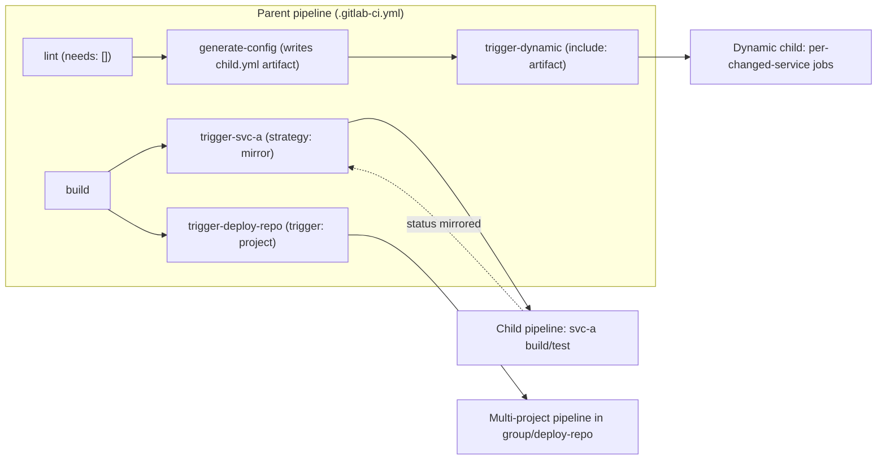
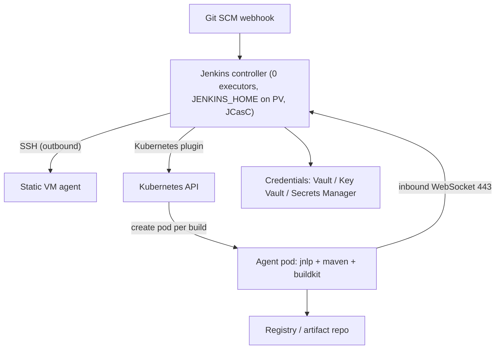
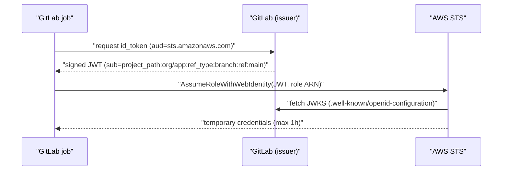

# N2 GitLab CI/CD and Jenkins
> Last verified: 2026-10 · Audience: senior/staff DevOps, SRE, AI eng, NetEng, DevSecOps, architects

## TL;DR
- **GitLab CI/CD** = one `.gitlab-ci.yml` per repo, pipelines of **stages → jobs**, run by **GitLab Runner** (a Go agent you host, or GitLab-hosted). Speed comes from a **DAG** (`needs`), not from adding stages; scale for monorepos and platforms comes from **parent-child / multi-project pipelines** and **CI/CD components** (GA in 17.0, versioned and published to the **CI/CD Catalog**).
- **Cache ≠ artifacts**: cache is a best-effort speed-up stored by the runner (dependencies); artifacts are guaranteed job outputs stored in GitLab and passed downstream (default expiry **30 days**).
- **Main-branch safety at scale**: **merged results pipelines** test the merge commit; **merge trains** (Premium+) serialize merges with up to **20** parallel speculative pipelines by default.
- **Secrets**: protected variables only reach protected refs; best practice is **no long-lived cloud keys** — use `id_tokens` (OIDC JWT with an `aud` claim) federated to AWS IAM / Entra ID / Vault. `CI_JOB_JWT(_V2)` is removed and returns 401.
- **Runners**: instance/group/project scope; prefer the **Kubernetes**, **Docker** or **Docker Autoscaler/Instance** (fleeting plugins for AWS/Azure/GCP) executors. **Docker Machine** is deprecated, and **Shell/SSH** are in maintenance mode with no job isolation. Registration moved to **runner authentication tokens (`glrt-`)**.
- **Jenkins** = a controller plus agents, Groovy pipelines (declarative preferred over scripted), **shared libraries** for reuse, the **Kubernetes plugin** for ephemeral pod agents, and **JCasC** for config-as-code. Its pain points: plugin sprawl/CVEs, a stateful single controller (`JENKINS_HOME`), Groovy/CPS quirks, and upgrade toil.
- **Migration**: inventory → standardize → convert with tooling (**GitHub Actions Importer**: audit / forecast / dry-run / migrate, aims for ~80% conversion; scripted pipelines, secrets and unknown plugins need manual work) → run both systems in parallel → cut over.
- Staff-level framing: CI is a **multi-tenant remote-code-execution platform**. Isolation (ephemeral runners, no builds on the controller), identity (OIDC), supply chain (pinned components/libraries, SLSA provenance) and cost (autoscaling, spot) matter more than YAML syntax.

## N2.1 GitLab CI/CD pipeline model: stages, jobs, rules, workflow
- **How it works:**
  - A pipeline is defined by `.gitlab-ci.yml` (the path is configurable). **Jobs** are the unit of execution and run on runners. **Stages** order the jobs: by default every job in a stage must succeed before the next stage starts. The default stages are `.pre`, `build`, `test`, `deploy`, `.post`.
  - Key job keywords: `script`/`before_script`/`after_script`, `image`, `services` (sidecar containers, e.g. postgres), `tags` (select a runner), `rules`, `needs`, `artifacts`, `cache`, `environment`, `resource_group` (mutex for deploys), `retry`, `timeout`, `interruptible` (auto-cancel redundant pipelines), `parallel` / `parallel:matrix`.
  - **`rules`** (replaces the legacy `only/except`): evaluated in order and the first match wins. Clauses are `if` (variable expressions), `changes`, `exists`, and `when` (`on_success`, `manual`, `delayed`, `never`, `always`). `allow_failure` and `variables` can be set per rule.
  - **`workflow:rules`** decides whether the **whole pipeline** is created. Use it to prevent **duplicate pipelines** (a branch pipeline plus an MR pipeline for the same push).
  - **Pipeline sources** (`$CI_PIPELINE_SOURCE`): `push`, `merge_request_event`, `schedule`, `web`, `api`, `trigger`, `pipeline` (multi-project), `parent_pipeline`.
- **Trade-offs / when to use:**
  - Stage-only pipelines are simple, but the slowest job in each stage gates everything after it. Add `needs` (N2.2) once pipelines go past about 10 minutes.
  - `rules:changes` is great in monorepos, but behaves differently on non-MR pipelines (it compares against the previous push). Pair it with `compare_to` or use MR pipelines.
- **Interview angles:**
  - "Why do we get two pipelines per push?" → there's no `workflow:rules` deduplicating branch and MR pipelines. The canonical fix: `if: $CI_PIPELINE_SOURCE == "merge_request_event"`, then `if: $CI_COMMIT_BRANCH && $CI_OPEN_MERGE_REQUESTS` → `when: never`, then `if: $CI_COMMIT_BRANCH`.
  - "How do you stop two deploys racing?" → `resource_group: production` (plus `interruptible: false` on deploy jobs).
  - Pitfall: mixing `only/except` with `rules` in one job is invalid.

## N2.2 DAG with `needs` and stageless pipelines
- **How it works:**
  - `needs: [job]` lets a job start as soon as its listed dependencies finish, ignoring stage boundaries. The result is a **directed acyclic graph**.
  - `needs: []` starts a job immediately (useful for lint and SAST).
  - **Stageless pipelines** omit `stage` and order jobs only through `needs`.
  - Options:
    - `needs:artifacts: false` skips downloading artifacts.
    - `needs:optional: true` tolerates a dependency that rules may have removed.
    - `needs:project` fetches artifacts from another project's pipeline (Premium+).
    - `needs:pipeline` mirrors an upstream pipeline's status.
  - There is a cap on how many jobs a single `needs` list may reference: historically **50**, admin-configurable on self-managed (unverified for current versions).
- **Trade-offs / when to use:**
  - A DAG cuts wall-clock time for fan-out/fan-in shapes (build per service → test per service → aggregate).
  - Cost: the graph is harder to reason about, and artifact downloads multiply.
  - `needs` also controls **which artifacts are downloaded**: only the needed jobs' artifacts, versus all earlier stages by default. That is a hidden performance win.
- **Interview angles:**
  - "Pipeline takes 40 min, how do you speed it up?" →
    1. Critical-path analysis.
    2. A `needs` DAG.
    3. `parallel` test sharding.
    4. Cache dependencies with `cache:key:files` on the lockfile.
    5. Smaller images.
    6. `interruptible` plus auto-cancel.
    7. `rules:changes` for monorepo paths.
    8. Child pipelines per component.

## N2.3 Parent-child and multi-project (downstream) pipelines
- **How it works:**
  - A **trigger job** (`trigger:`) creates a downstream pipeline. Trigger jobs **don't consume a runner**.
  - **Parent-child**: same project, ref and SHA (`trigger: include: local: child.yml`). Limits:
    - **Max nesting depth of 2** (a parent → children → grandchildren).
    - Up to **3** config files combined per child.
    - Not shown in the project's pipeline list.
  - **Dynamic child pipelines**: a job *generates* YAML, saves it as an artifact, and a trigger job runs `include: artifact: gen.yml, job: generate`. Used for monorepos and per-tenant matrices.
  - **Multi-project**: `trigger: project: group/other-project` (with optional `branch`). Shows up in the downstream project's list, with no nesting limit. Examples: platform repo → app repos, or app → deploy/infra repo.
  - **Status**: by default a trigger job succeeds once the downstream pipeline is *created*. `strategy: mirror` (newer) or `strategy: depend` makes the trigger job reflect the downstream pipeline's result.
  - Limit: **1000** downstream pipelines per hierarchy by default (configurable).
  - **Passing data**:
    - `variables` (inherited unless `inherit: variables: false`) or typed `inputs`.
    - Predefined variables must be re-mapped explicitly, e.g. `PARENT_SHA: $CI_COMMIT_SHA`.
    - Fetching artifacts across pipelines needs Premium+.
- **Trade-offs / when to use:**
  - **Parent-child**: monorepo split per component so each child has its own `rules:changes`. Keeps a giant YAML manageable, and child pipelines can be cancelled or retried independently.
  - **Multi-project**: cross-repo orchestration, e.g. a microservice triggers e2e tests in a QA repo, or GitOps-style updates to an environment repo.
  - Downsides: a fragmented view of status, variable leakage between pipelines, and debugging across pipelines.
- **Interview angles:**
  - "Monorepo with 30 services?" → dynamic child pipelines generated from changed paths, one child per service, `strategy: mirror`, and a shared component for build/test.
  - Pitfall: forgetting `strategy` → the parent goes green while the deploy child fails.

## N2.4 Reuse: include, templates, CI/CD components and the Catalog
- **How it works:**
  - **`include:`** accepts `local`, `project` (+ `ref`), `remote` (URL), `template` (GitLab-shipped templates such as `Jobs/SAST.gitlab-ci.yml`) and `component`.
  - Hidden jobs (`.base:`) plus `extends:` or YAML anchors and `!reference` give in-file reuse.
  - **CI/CD components** (GA **17.0**): a project with `templates/<name>.yml`. Each one declares typed `spec: inputs:` (string, number, boolean, array, defaults, `options`, regex) followed by a `---` separator.
    - Consumed as `include: - component: $CI_SERVER_FQDN/org/proj/name@1.2.3`.
    - Version resolution: commit SHA > tag > branch, plus partial semver (`@1`, `@1.2`) and `~latest`.
    - Limit: up to **100 components per project** (raised from 30 in 18.5).
  - **CI/CD Catalog** (GA 17.0): the component project is marked as a catalog resource, and releases must use **semantic versions**. Visibility follows the project's visibility. Available in all tiers.
- **Trade-offs / when to use:**
  - Components replace "golden template" repos included by branch name, which caused silent breaking changes.
  - Pin to a **SHA or exact version** for supply-chain safety. `~latest` and branch refs are convenient but unsafe for production pipelines (same lesson as pinning GitHub Actions by SHA, see N1).
  - `include: remote` is an injection risk if the URL isn't controlled.
- **Interview angles:**
  - "How would a platform team standardize 500 repos?" →
    - Versioned components in the catalog: build, scan, deploy.
    - Security scans enforced with **scan execution / pipeline execution policies** (Ultimate), so teams can't delete them from their YAML.
    - Renovate or Dependabot-style bumps of component versions.
    - Cross-link the golden paths in [N6 Internal developer platforms](N6-internal-developer-platforms.md).

## N2.5 GitLab Runner: scopes, executors, registration
- **How it works:**
  - **Scopes**:
    - **Instance** runners (formerly "shared"), available to all projects.
    - **Group** runners, for a group and its subgroups.
    - **Project** runners, which can be locked to specific projects.
    - **GitLab-hosted runners** on GitLab.com (Linux/Windows/macOS/GPU; billed in compute minutes).
  - **Tags** route jobs to runners. A runner can be set to run **untagged** jobs or not, and can be marked **protected** so it only runs jobs on protected branches/tags. Use that for production deploy runners with cloud privileges.
  - **Executors** (from the runner docs):
    - **Active development:** Kubernetes, Docker, Docker Autoscaler, Instance.
    - **Maintenance mode:** Shell, SSH, VirtualBox, Parallels, Custom.
    - **Deprecated:** Docker Machine.
  - Only container/VM executors protect the runner filesystem: a job can't read the runner token or other jobs' data. **Shell/SSH have no isolation.**
  - **Registration**: create the runner in the UI/API → get a **runner authentication token (`glrt-…`)** → `gitlab-runner register --token`. Legacy **registration tokens** are deprecated; since 17.0 admins can disable them, and `register` then returns `410 Gone`.
  - `config.toml` key settings:
    - `concurrent` (global job slots).
    - `[[runners]] limit`.
    - `request_concurrency`.
    - Docker `privileged` (needed for DinD; a security red flag).
    - `[runners.cache]` (S3/GCS/Azure Blob distributed cache).
- **Trade-offs / when to use:**

  | Executor | Isolation | Startup | Use when |
  |---|---|---|---|
  | Shell | none (host) | fastest | legacy, special hardware; avoid multi-tenant |
  | Docker | container per job | fast | default single-host pool |
  | Docker Autoscaler / Instance | VM per job or per N jobs | 30–90 s for a cold VM | elastic pools on AWS/Azure/GCP, strong isolation, privileged builds |
  | Kubernetes | pod per job | seconds (if node available) | org already runs K8s; cluster autoscaler/Karpenter handle capacity |

- **Interview angles:**
  - "Docker-in-Docker risks?" → `privileged: true` means effectively root on the node. Alternatives: **Kaniko** (archived in 2025 (unverified), so prefer **BuildKit rootless** or **Buildah**), building on VM-per-job executors, or a remote BuildKit service.
  - "Runner token leaked?" → reset the token, then audit which projects/tags could target that runner. Protected runners limit the blast radius.

## N2.6 Autoscaling runners
- **How it works:**
  - **Docker Autoscaler** and **Instance** executors use **fleeting** (cloud-provider plugins) plus **taskscaler** (capacity planning). Plugins exist for **AWS** (EC2 Auto Scaling group), **Azure** (VM Scale Set) and **GCP** (managed instance group).
  - Tunables:
    - `max_instances`, `capacity_per_instance` (how many jobs share a VM).
    - `max_use_count` (recycle the VM after N jobs).
    - Idle scaling policies: `idle_count`, `idle_time`, cron `periods`.
  - These replace **Docker Machine** autoscaling, which is deprecated (GitLab maintained a fork after Docker abandoned docker-machine).
  - **Kubernetes executor**: one pod per job (build, helper and service containers). Capacity comes from the cluster autoscaler or **Karpenter** (EKS) / AKS node autoprovisioning. Install with the `gitlab-runner` Helm chart.
  - **CodeBuild-hosted GitLab runners** (AWS, verified):
    - A CodeBuild "Runner project" plus a GitLab webhook on **Workflow jobs** events (`WORKFLOW_JOB_QUEUED`) starts one **ephemeral runner per job**, which terminates when the job finishes.
    - Jobs opt in with the tag `codebuild-<project>-$CI_PROJECT_ID-$CI_PIPELINE_IID-$CI_JOB_NAME`. Optional `image:`, `instance-size:` and `fleet:` override tags; `buildspec-override:true` runs install/pre/post phases.
    - The runner token is fetched during DOWNLOAD_SOURCE and **expires after 1 h**.
- **Trade-offs / when to use:**
  - Warm pools (`idle_count`) trade cost for latency. Spot/preemptible instances cut cost but need `retry` on `runner_system_failure`.
  - `capacity_per_instance > 1` with Docker Autoscaler improves bin-packing but weakens isolation. Use `1` with `max_use_count: 1` for untrusted jobs.
  - K8s executor: cheapest if a cluster already exists. Watch out for pod-scheduling latency, ephemeral-storage evictions, noisy neighbours, and no privileged builds under restricted Pod Security Standards.
- **Interview angles:**
  - "Design CI for 2,000 engineers" →
    - Separate pools per trust level (untrusted MR/fork vs protected deploy).
    - Ephemeral VMs or pods, autoscaled on queue depth.
    - Distributed S3/Blob cache and a registry pull-through cache.
    - Spot instances for tests, on-demand for deploys.
    - OIDC to the cloud.
    - SLOs on queue time (p95 < 60 s) and on pipeline duration.

## N2.7 Cache vs artifacts
- **How it works:**

  | | Cache | Artifacts |
  |---|---|---|
  | Purpose | speed: deps (node_modules, .m2, pip) | correctness: build outputs, reports |
  | Stored | runner host, or distributed S3/GCS/Blob | GitLab (object storage) |
  | Guarantee | **best-effort**, may miss | guaranteed for later jobs/stages |
  | Lifetime | until evicted / cleared | `expire_in`, default **30 days** (latest artifacts on a ref can be kept) |
  | Scope | `cache:key` (`files:` lockfile hash, `prefix`, `fallback_keys` up to 5, `CACHE_FALLBACK_KEY`) | passed via stages / `needs` / `dependencies` |
  | Policy | `pull-push` (default), `pull`, `push` | `when: on_success/on_failure/always` |

- Protected and unprotected refs get **separate caches by default** (`-protected` / `-non_protected` suffixes). This stops an MR from poisoning the cache that the protected-branch build uses.
- `artifacts:reports` (junit, coverage, SAST, dotenv, terraform) feed MR widgets. `dotenv` reports pass variables to later jobs.
- **Interview angles:**
  - "Job B can't find the binary job A built" → it was put in the cache, not in artifacts; or the runners don't share a cache; or `needs` has `artifacts: false`.
  - Cache poisoning is a supply-chain vector. Key caches on lockfile hashes and keep protected separation on. (Cross-link [L6 Secrets and supply chain](../L-data-privacy-ai-security/L6-secrets-supply-chain.md).)

## N2.8 Environments, deployments and MR pipeline types
- **How it works:**
  - `environment: name/url/action/on_stop/auto_stop_in/deployment_tier` tracks deployments and enables rollback by re-running an earlier deployment. **Review apps** use dynamic environments (`review/$CI_COMMIT_REF_SLUG`) with `on_stop` cleanup.
  - **Protected environments** (Premium+) add required approvals and restrict who can deploy. Deployment **approvals** and `resource_group` give serialized releases.
  - **Pipeline types for MRs**:

    | Type | What it tests | Notes |
    |---|---|---|
    | Branch pipeline | source branch HEAD | runs on push |
    | **MR pipeline** | source branch, in MR context | needs rules for `merge_request_event`; rules inside `include:` don't count |
    | **Merged results pipeline** | the *merge* of source into the current target | catches "green branch, red main"; Premium+ |
    | **Merge train** | each MR merged on top of the MRs queued ahead of it | needs merged results; up to **20** parallel pipelines by default (min 1, configurable); a failed MR is dropped and the pipelines behind it restart; Premium+ |

  - **Forks**: an MR from a fork runs in the fork by default. A parent-project member can run it in the parent, but it then uses the **fork's YAML** with the parent's runners and variables, so review the code first. Protected variables and runners are never exposed to fork MRs. Protected resources reach MR pipelines only when both branches are protected and in the same project.
- **Interview angles:**
  - "Why merge trains vs just requiring up-to-date branches?" → requiring a rebase serializes humans, while merge trains serialize machines. They keep main always green at high merge rates without forcing rebases. Cost: more pipeline minutes, and a failure near the front of the train restarts everything behind it.

## N2.9 Variables, protected variables, OIDC id_tokens and secrets
- **How it works:**
  - Precedence (high → low, simplified): pipeline-run/trigger/scheduled vars > project > group > instance > YAML `variables` > predefined.
  - Variables can be **protected** (only protected branches/tags), **masked** (hidden in logs; value-format constraints apply), **masked and hidden**, or of **file** type.
  - **`id_tokens`**: each job requests one or more JWTs:
    ```yaml
    id_tokens:
      AWS_ID_TOKEN:
        aud: sts.amazonaws.com
    ```
    - Claims include `iss` (the instance), `sub` (default `project_path:{group}/{project}:ref_type:{branch|tag}:ref:{name}`, customizable via the API), `aud`, `project_id`, `namespace_id`, `ref_protected`, `environment` and `pipeline_source`.
    - The legacy `CI_JOB_JWT`/`CI_JOB_JWT_V2` were removed → **401**.
  - **Cloud federation**:
    - **AWS**: an IAM OIDC provider for `https://gitlab.com` (or your instance), and a role trust policy with `StringLike` on `gitlab.com:sub` = `project_path:org/app:ref_type:branch:ref:main`. Then `aws sts assume-role-with-web-identity`.
    - **Azure**: an Entra app registration or user-assigned managed identity with a **federated identity credential** (issuer = GitLab URL, subject = exact `sub`, audience `api://AzureADTokenExchange`). Then `az login --federated-token`.
    - **Vault / OpenBao**: JWT auth with `bound_claims`, or native `secrets:` with `vault:`. Other `secrets:` providers: Azure Key Vault, GCP Secret Manager, and AWS Secrets Manager (newer; unverified version).
- **Trade-offs / when to use:**
  - OIDC removes static keys and their rotation toil. Trust is only as tight as the `sub` condition: wildcards like `project_path:org/*` let *any* project or branch assume the deploy role.
  - Match on `ref_protected:true` or the environment for prod roles.
- **Interview angles:**
  - "How does GitLab deploy to AWS without keys?" → walk through the token request with `aud` → STS validates the issuer's JWKS → short-lived credentials (≤1 h) → least-privilege role per environment.
  - Pitfall: masked does not mean secure. Scripts can exfiltrate values (base64, external curl), so protect the branch and restrict who can push.

## N2.10 Built-in security scanning (DevSecOps)
- **How it works:**
  - Scanners plug in via templates or components (`Jobs/SAST.gitlab-ci.yml`, `Jobs/Secret-Detection…`, `Jobs/Dependency-Scanning…`, `Jobs/Container-Scanning…`, `Jobs/SAST-IaC…`, `DAST`, `API-Security`, coverage fuzzing). Results are emitted as `artifacts:reports`.
  - Docs categories: repository scanning (SAST, IaC, secret detection, dependency scanning) and behavioural testing (DAST, API security testing, coverage-guided fuzzing).
  - Tiering: basic SAST, secret detection, IaC and container scanning run on **Free**. The MR security widget, Security Dashboard, vulnerability management, DAST, dependency scanning, fuzzing, **scan execution policies**, **merge request approval policies** and **pipeline execution policies** are **Ultimate** (unverified per scanner; check the tier page).
  - **Secret push protection** blocks secrets at `git push` time, before CI (Ultimate).
- **Interview angles:**
  - "Shift-left without slowing devs?" → run scanners in parallel with `needs: []`, diff-only results in the MR, block only on new critical/high findings via approval policies, and run full scans nightly.
  - "Devs disable the scan job" → pipeline execution policies inject it centrally.

## N2.11 Jenkins architecture: controller, agents, executors
- **How it works:**
  - **Controller** (formerly "master"): the UI, scheduling, plugin host, and state in **`$JENKINS_HOME`** on disk (job configs, build history, credentials encrypted with `secrets/master.key`). It is a single, stateful process, so there is no active-active HA in OSS. HA usually means fast restore plus an EBS/Azure Disk volume, or CloudBees CI (commercial).
  - **Agents (nodes)** run builds in **executors** (slots).
    - **Inbound** (formerly JNLP): the agent connects to the controller over TCP 50000 or **WebSocket** over 443.
    - **Outbound/SSH**: the controller connects to the agent.
  - Cloud plugins provision agents on demand: Kubernetes, EC2/EC2 Fleet, Azure VM Agents, Docker.
  - **Controller isolation**: set the **built-in node to 0 executors**, because builds there have the Jenkins process's access to `JENKINS_HOME` (and therefore every credential). **Agent → Controller access control** has been mandatory since **2.326**.
- **Trade-offs / when to use:**
  - Total flexibility: any language, any trigger, on-prem or air-gapped, 1,900+ plugins.
  - The cost is that you own patching, scaling, backup and plugin compatibility.
- **Interview angles:**
  - "Jenkins is slow/unresponsive" → typical causes:
    - Too many jobs or build history on the controller (set a `buildDiscarder`).
    - Heavy Groovy running on the controller: CPS steps execute there, so offload the work into `sh` on agents.
    - JVM heap/GC problems.
    - A plugin leak.
    - Disk I/O on `JENKINS_HOME`.
  - Fixes: scale out to multiple controllers per org/team, as opposed to one giant one.

## N2.12 Jenkins Pipeline: declarative vs scripted, shared libraries
- **How it works:**
  - Pipelines are defined as code in a `Jenkinsfile`, in Groovy executed with **CPS** (continuation-passing style) so they survive controller restarts. That is why non-serializable objects cause `NotSerializableException`, and why `@NonCPS` exists.
  - **Declarative**: `pipeline { agent; stages { stage { steps } }; post; options; environment; parameters; when; parallel; matrix }`. Opinionated, validated up front, and a `script {}` block is the escape hatch.
  - **Scripted**: `node { stage('x') { ... } }`. Full Groovy, imperative, and harder to lint and govern.
  - **Shared libraries**:
    - Layout: `vars/` (global steps; `vars/foo.groovy` with `call()`), `src/` (classes, must be `Serializable`), `resources/` (`libraryResource`).
    - Loading: `@Library('lib@v1.2') _` or the `library` step.
    - **Global** libraries can be *trusted* (run outside the sandbox, so they need tight write access to the library repo). **Folder** libraries are always sandboxed.
    - "Load implicitly" injects a library into every pipeline.
  - **Script Security sandbox** plus in-process script approval govern untrusted Groovy.
- **Trade-offs / when to use:**
  - Declarative plus shared-library steps (`buildJava()`, `deployHelm()`) is the scalable pattern. Scripted pipelines are the main blocker in migrations.
  - Pin library versions: an unpinned `@Library('lib')` follows the default branch, which is a supply-chain risk.
- **Interview angles:**
  - "Who can push to the trusted global library repo?" → anyone who can is effectively a **Jenkins admin** (code execution on the controller).

## N2.13 Jenkins on Kubernetes: ephemeral pod agents
- **How it works:**
  - The **Kubernetes plugin** creates **one pod per agent/build** and deletes it afterwards. The pod runs the `jnlp` (inbound-agent) container plus tool containers. `container('maven') { sh ... }` switches the container, and `defaultContainer` sets the default.
  - Pod templates come from the UI, JCasC, or inline `agent { kubernetes { yaml '''…''' } }`. Templates support inheritance.
  - Relevant settings: `containerCap`, `idleMinutes` (reuse a pod for a while), **WebSocket** mode (no TCP 50000 needed), and a ServiceAccount with RBAC to create pods.
  - The controller usually runs as a StatefulSet with a PVC (Helm chart `jenkins/jenkins`). Agent pods can run in other namespaces or clusters.
- **Trade-offs / when to use:**
  - Gains: clean environment per build, elastic capacity, no snowflake agents.
  - Costs:
    - Pod startup latency.
    - Dependency caches are lost unless PVC/cache volumes are used.
    - Docker builds need DinD/privileged mode, or BuildKit/Buildah.
    - The controller is still a single point of failure.
- **Interview angles:**
  - "Builds stuck waiting for executor" → check:
    - The container cap.
    - Namespace ResourceQuota.
    - Cluster autoscaler lag.
    - The `jnlp` container failing to connect (wrong `JENKINS_URL`/tunnel, NetworkPolicy, TLS).
    - Image pull rate limits.

## N2.14 Jenkins credentials, plugin sprawl, security and JCasC
- **How it works:**
  - **Credentials plugin**: global/system/folder scopes, with types such as username/password, secret text/file, SSH key and certificate.
    - Use `withCredentials([...])` or `environment { X = credentials('id') }`. Values are masked in logs, but scripts can still exfiltrate them.
    - External stores via plugins: HashiCorp Vault, AWS Secrets Manager credentials provider, Azure Key Vault.
    - For clouds, prefer **IRSA / EKS Pod Identity** or **AKS Workload Identity** on agent pods over stored keys.
  - **Plugin sprawl**:
    - Hundreds of plugins with transitive dependencies, and a steady stream of **security advisories** (XSS, CSRF, credential exposure, sandbox bypass).
    - Upgrades break compatibility.
    - Mitigations: a curated plugin list, `plugins.txt` used with `jenkins-plugin-cli` in an immutable controller image, staging-controller upgrade tests, and LTS releases only.
  - **JCasC** (Configuration as Code plugin):
    - Config lives in `$JENKINS_HOME/jenkins.yaml` by default, or wherever `CASC_JENKINS_CONFIG` points (file, folder or URL; comma-separated list).
    - Top-level keys: `jenkins`, `tool`, `unclassified`, `credentials`.
    - Secrets are interpolated as `${VAR}` from env, files or Vault.
    - Apply with **Reload existing configuration** (no restart needed). The current config can be exported from the UI.
    - Rule: configure **either CasC or the UI, not both**. UI edits are overwritten on restart.
  - Jobs themselves are created with **Job DSL** or **Multibranch / Organization Folder** scanning, never by clicking.
- **Interview angles:**
  - "How do you make Jenkins reproducible?" → controller image (LTS plus pinned plugins), JCasC, Job DSL/seed jobs, external secrets, ephemeral agents, and backups of only the irreducible state (build history, if needed).
  - Then it is effectively cattle.

## N2.15 Why teams migrate off Jenkins, and how
- **Why:**
  - Ops toil: controller patching, plugin CVEs and compatibility.
  - No native HA.
  - Groovy expertise is concentrated in a few people.
  - UI-configured snowflake jobs.
  - Weak native secrets/OIDC story.
  - Desire for SCM-integrated CI (MR/PR checks, security dashboards, merge trains) and SaaS-hosted runners.
- **Why some stay:**
  - Air-gapped or regulated environments.
  - Exotic hardware.
  - Massive investment in shared libraries.
  - Non-git triggers and complex orchestration.
  - CloudBees support.
- **Strategy (phased):**
  1. **Inventory**: jobs, plugins in use, credentials, agents/labels, triggers, and the job owner. Delete dead jobs (often 30–50%; anecdotal).
  2. **Standardize** the target with reusable units (GitLab components / GH reusable workflows / Azure templates), plus OIDC and runner pools.
  3. **Automate conversion**:
     - **GitHub Actions Importer** (`gh extension install github/gh-actions-importer`; runs in Docker; MIT; sources: Jenkins, GitLab, Azure DevOps, CircleCI, Bamboo, Bitbucket Pipelines, Travis).
     - Commands: `audit` → `forecast` (runner-minute estimate) → `dry-run` → `migrate` (opens a PR).
     - Target is ~**80%** conversion per workflow. **Manual work**: scripted pipelines, secrets, self-hosted runners, unknown plugins, and declarative `input`/`matrix`/`options`/`parameters`.
     - GitLab offers no official equivalent converter (unverified). Use its Jenkins → GitLab migration docs and do it manually or with community tools.
  4. **Run both in parallel**: mirror builds and compare artifacts. Cut over per team, then make Jenkins read-only and decommission it.
  5. Track **DORA** metrics before and after ([J6 Toil and release engineering](../J-sre/J6-toil-release-engineering.md)).
- **Interview angles:**
  - "Big-bang or incremental?" → incremental by repo or team. Start with greenfield and simple pipelines, and build the paved path first so migration is easier than staying.

## N2.16 Comparison: GitLab CI vs Jenkins vs GitHub Actions vs Azure Pipelines
| Dimension | GitLab CI/CD | Jenkins | GitHub Actions | Azure Pipelines |
|---|---|---|---|---|
| Config | `.gitlab-ci.yml` | `Jenkinsfile` (Groovy) + UI/JCasC | `.github/workflows/*.yml` | `azure-pipelines.yml` (+ Classic UI, legacy) |
| Unit of reuse | `include`, **components + Catalog** | **shared libraries** | reusable workflows, composite/JS/Docker actions, Marketplace | templates (stage/job/step/variable), `extends` |
| Compute | GitLab-hosted or self-managed **Runner** | controller + agents (self-run) | GitHub-hosted / larger runners / self-hosted (ARC on K8s) | Microsoft-hosted, self-hosted, **VMSS agents**, **Managed DevOps Pools** |
| Ordering | stages + `needs` DAG | stages/parallel in Groovy | jobs + `needs` | stages/jobs + `dependsOn` |
| Cloud auth | `id_tokens` OIDC | plugins / pod identity | OIDC `id-token: write` | **workload identity federation** service connections |
| Merge safety | merged results, **merge trains** | via SCM plugins | merge queue | branch policies + build validation (Azure Repos) |
| Security scanning | built in (Ultimate for most) | plugins / external | GHAS (CodeQL, secret scanning, Dependabot) | GHAS for Azure DevOps (add-on) |
| Ops burden | low (SaaS) to medium (self-managed) | **high** | low | low |
| Sweet spot | single DevSecOps platform, self-host option | bespoke, air-gapped, legacy | GitHub-centric orgs, ecosystem | Microsoft/Azure shops, Azure Repos/Boards |

- See [N1 GitHub Actions](N1-github-actions.md) and [N3 Azure DevOps and AWS CodePipeline](N3-azure-devops-aws-codepipeline.md) for depth on those two columns.

## Diagrams
GitLab parent-child pipeline with a dynamic child and a multi-project trigger:


Jenkins controller with static and ephemeral Kubernetes agents:


GitLab job OIDC to AWS:


## Cloud mapping: AWS vs Azure
| Capability | AWS | Azure | Role it plays | Key differences | Alternatives |
|---|---|---|---|---|---|
| VM-based autoscaling runners/agents | EC2 **Auto Scaling group** (GitLab fleeting-plugin-aws; Jenkins EC2 / EC2 Fleet plugin) | **Virtual Machine Scale Sets** (fleeting-plugin-azure; Jenkins Azure VM Agents; Azure Pipelines VMSS agent pools) | Elastic, VM-isolated CI compute | ASG supports mixed instances + Spot; VMSS Flexible orchestration + Spot priority; both zonal-spread capable | GitLab-hosted runners, GCP MIG |
| Container-based ephemeral runners | **EKS** (+ Karpenter) with GitLab K8s executor / Jenkins K8s plugin / ARC | **AKS** (+ cluster autoscaler / node autoprovisioning) | Pod-per-job CI | Karpenter right-sizes nodes quickly; AKS NAP is Karpenter-based | Self-managed Kubernetes, OpenShift ([N7](N7-openshift.md)) |
| Serverless containers for jobs | **Fargate** (GitLab custom-executor Fargate driver, maintenance mode (unverified); Jenkins ECS/Fargate plugin) | **Azure Container Instances** (Jenkins ACI plugin) | No node management | No privileged mode on Fargate/ACI, so no DinD; slower cold start | Cloud Run jobs |
| Fully managed per-job runner | **CodeBuild-hosted GitLab runner** (webhook → ephemeral runner per job) | **Managed DevOps Pools** / Microsoft-hosted agents (Azure Pipelines only, not GitLab) | Remove runner ops entirely | CodeBuild runs GitLab (and GitHub) jobs natively; Azure's managed pools serve Azure Pipelines | GitLab-hosted runners |
| Workload identity for jobs | IAM **OIDC identity provider** + role trust on `sub`/`aud`; IRSA / EKS Pod Identity for Jenkins pods | Entra **federated identity credential** on app reg / user-assigned MI; AKS Workload Identity | Keyless cloud access | AWS matches claims with IAM conditions (`StringLike` wildcards); Azure FIC needs an **exact subject** (flexible FIC expressions newer, unverified) | Vault JWT auth |
| Distributed runner cache | **S3** | **Blob Storage** | Shared cache across ephemeral runners | Same model; use VPC/private endpoint to avoid egress | GCS, MinIO |
| Secrets store | Secrets Manager / SSM Parameter Store | **Key Vault** | Runtime secrets for jobs | GitLab `secrets:` has native Azure Key Vault + Vault | HashiCorp Vault |
| Managed CI alternative | CodeBuild / CodePipeline | **Azure Pipelines** | Replace self-run CI | CodePipeline V2 has triggers/variables; Azure Pipelines is the fuller CI product | GitHub Actions, GitLab SaaS |

- **Roles**: ASG/VMSS give VM-per-job isolation (best for privileged Docker builds). EKS/AKS give dense, fast pod-per-job scheduling. CodeBuild-hosted runners outsource runner lifecycle while keeping execution in *your* AWS account (IAM, VPC, CloudTrail).
- **Differences / gotchas**:
  - Fargate and ACI disallow privileged containers, so image builds need BuildKit rootless or a remote builder.
  - VMSS Spot evictions and EC2 Spot interruptions (2-min notice) mean CI jobs need `retry` for runner system failures.
  - Azure FIC subjects are exact strings. Every branch/environment needs its own credential, or use environment-scoped subjects.
  - Keep runners in private subnets, with NAT or egress controls and VPC endpoints / Private Endpoints for S3/Blob, ECR/ACR and STS.
- **Alternatives**: Kubernetes everywhere (ARC for GitHub, GitLab K8s executor, Jenkins K8s plugin) for portability. GitLab-hosted or GitHub-hosted runners for zero ops. Cloudflare and Databricks are not runner platforms; deploy *to* them from CI with OIDC/API tokens.

## Hands-on (optional)
`.gitlab-ci.yml`: dedup workflow, DAG, cache vs artifacts, component, OIDC to AWS, merge-train safe deploy:
```yaml
workflow:
  rules:
    - if: $CI_PIPELINE_SOURCE == "merge_request_event"
    - if: $CI_COMMIT_BRANCH && $CI_OPEN_MERGE_REQUESTS
      when: never
    - if: $CI_COMMIT_BRANCH

include:
  - component: $CI_SERVER_FQDN/platform/ci-components/sast@2.1.0   # pinned version
  - template: Jobs/Secret-Detection.gitlab-ci.yml

stages: [build, test, deploy]

default:
  interruptible: true
  retry:
    max: 2
    when: [runner_system_failure, stuck_or_timeout_failure]

lint:
  stage: build
  image: node:22
  needs: []
  script: [npm run lint]

build:
  stage: build
  image: node:22
  cache:
    key:
      files: [package-lock.json]
    paths: [.npm/]
    policy: pull-push
  script:
    - npm ci --cache .npm
    - npm run build
  artifacts:
    paths: [dist/]
    expire_in: 7 days

unit-test:
  stage: test
  image: node:22
  needs: [build]
  parallel: 4
  script: [npm test -- --shard=$CI_NODE_INDEX/$CI_NODE_TOTAL]
  artifacts:
    reports:
      junit: junit.xml

deploy-prod:
  stage: deploy
  image: amazon/aws-cli:latest
  needs: [build, unit-test]
  tags: [prod-deployer]          # protected runner
  resource_group: production
  interruptible: false
  environment:
    name: production
    url: https://app.example.com
  id_tokens:
    AWS_ID_TOKEN:
      aud: sts.amazonaws.com
  rules:
    - if: $CI_COMMIT_BRANCH == $CI_DEFAULT_BRANCH
  script:
    - >
      export $(printf "AWS_ACCESS_KEY_ID=%s AWS_SECRET_ACCESS_KEY=%s AWS_SESSION_TOKEN=%s"
      $(aws sts assume-role-with-web-identity --role-arn "$DEPLOY_ROLE_ARN"
      --role-session-name "gl-$CI_JOB_ID" --web-identity-token "$AWS_ID_TOKEN"
      --duration-seconds 900 --query 'Credentials.[AccessKeyId,SecretAccessKey,SessionToken]'
      --output text))
    - aws s3 sync dist/ "s3://$BUCKET/"
```

Short declarative `Jenkinsfile` with an ephemeral Kubernetes pod agent and a pinned shared library:
```groovy
@Library('platform-lib@v3.4.0') _
pipeline {
  agent {
    kubernetes {
      defaultContainer 'node'
      yaml '''
        apiVersion: v1
        kind: Pod
        spec:
          serviceAccountName: ci-builder   # IRSA / AKS workload identity
          containers:
          - name: node
            image: node:22
            command: ["sleep"]
            args: ["infinity"]
      '''
    }
  }
  options { timeout(time: 30, unit: 'MINUTES'); buildDiscarder(logRotator(numToKeepStr: '30')); disableConcurrentBuilds() }
  stages {
    stage('Build') { steps { sh 'npm ci && npm run build' } }
    stage('Test')  { parallel {
      stage('Unit') { steps { sh 'npm test' } }
      stage('Lint') { steps { sh 'npm run lint' } }
    } }
    stage('Deploy') {
      when { branch 'main' }
      steps { withCredentials([string(credentialsId: 'deploy-token', variable: 'TOKEN')]) { sh './deploy.sh' } }
    }
  }
  post { always { junit allowEmptyResults: true, testResults: 'junit.xml' } }
}
```
(The Jenkinsfile is declarative pipeline config. Logic belongs in the shared library or in scripts.)

Register a runner with the new token workflow, plus the autoscaler config shape (bash):
```bash
# Runner created in UI/API first -> glrt- token (legacy --registration-token is deprecated)
sudo gitlab-runner register --non-interactive \
  --url "https://gitlab.com" \
  --token "$RUNNER_AUTH_TOKEN" \
  --executor "docker-autoscaler" \
  --docker-image "alpine:3.20"

# Then edit /etc/gitlab-runner/config.toml, e.g.:
#   [runners.autoscaler]
#     plugin = "aws:latest"          # fleeting plugin (installed via: gitlab-runner fleeting install)
#     capacity_per_instance = 1
#     max_use_count = 1               # one job per VM for untrusted workloads
#     max_instances = 50
#     [runners.autoscaler.plugin_config]
#       name = "gitlab-runner-asg"    # existing EC2 Auto Scaling group
#     [[runners.autoscaler.policy]]
#       idle_count = 2
#       idle_time  = "20m0s"
```

Terraform: AWS OIDC trust for GitLab deploy role (main branch only):
```hcl
resource "aws_iam_openid_connect_provider" "gitlab" {
  url            = "https://gitlab.com"
  client_id_list = ["sts.amazonaws.com"]
}

data "aws_iam_policy_document" "gitlab_trust" {
  statement {
    actions = ["sts:AssumeRoleWithWebIdentity"]
    principals {
      type        = "Federated"
      identifiers = [aws_iam_openid_connect_provider.gitlab.arn]
    }
    condition {
      test     = "StringEquals"
      variable = "gitlab.com:aud"
      values   = ["sts.amazonaws.com"]
    }
    condition {
      test     = "StringEquals"
      variable = "gitlab.com:sub"
      values   = ["project_path:acme/web-app:ref_type:branch:ref:main"]
    }
  }
}

resource "aws_iam_role" "gitlab_deploy" {
  name                 = "gitlab-web-app-deploy"
  assume_role_policy   = data.aws_iam_policy_document.gitlab_trust.json
  max_session_duration = 3600
}
```

## Cross-links
- [N1 GitHub Actions](N1-github-actions.md) (OIDC, reusable workflows, ARC, merge queue)
- [N3 Azure DevOps and AWS CodePipeline](N3-azure-devops-aws-codepipeline.md)
- [N4 GitOps with Argo CD and Flux](N4-gitops-argocd-flux.md): CI builds, GitOps deploys
- [N5 IaC pipelines and policy as code](N5-iac-pipelines-policy-as-code.md)
- [N6 Internal developer platforms](N6-internal-developer-platforms.md)
- [J6 Toil and release engineering](../J-sre/J6-toil-release-engineering.md)
- [L6 Secrets and supply chain](../L-data-privacy-ai-security/L6-secrets-supply-chain.md)
- [L7 Zero trust and workload identity](../L-data-privacy-ai-security/L7-zero-trust-workload-identity.md)

## Sources
- https://docs.gitlab.com/ci/pipelines/merge_trains/
- https://docs.gitlab.com/ci/pipelines/merge_request_pipelines/
- https://docs.gitlab.com/ci/pipelines/downstream_pipelines/
- https://docs.gitlab.com/ci/yaml/needs/
- https://docs.gitlab.com/ci/components/
- https://docs.gitlab.com/ci/caching/
- https://docs.gitlab.com/ci/secrets/id_token_authentication/
- https://docs.gitlab.com/ci/runners/new_creation_workflow/
- https://docs.gitlab.com/runner/executors/
- https://docs.gitlab.com/user/application_security/detect/
- https://docs.aws.amazon.com/codebuild/latest/userguide/gitlab-runner.html
- https://docs.aws.amazon.com/codebuild/latest/userguide/sample-gitlab-runners.html
- https://www.jenkins.io/doc/book/managing/casc/
- https://www.jenkins.io/doc/book/pipeline/shared-libraries/
- https://www.jenkins.io/doc/book/security/controller-isolation/
- https://plugins.jenkins.io/kubernetes/
- https://docs.github.com/en/actions/tutorials/migrate-to-github-actions/automated-migrations/use-github-actions-importer
- https://docs.github.com/en/actions/tutorials/migrate-to-github-actions/automated-migrations/jenkins-migration
