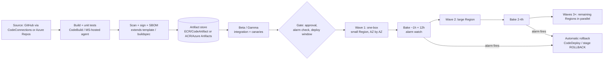
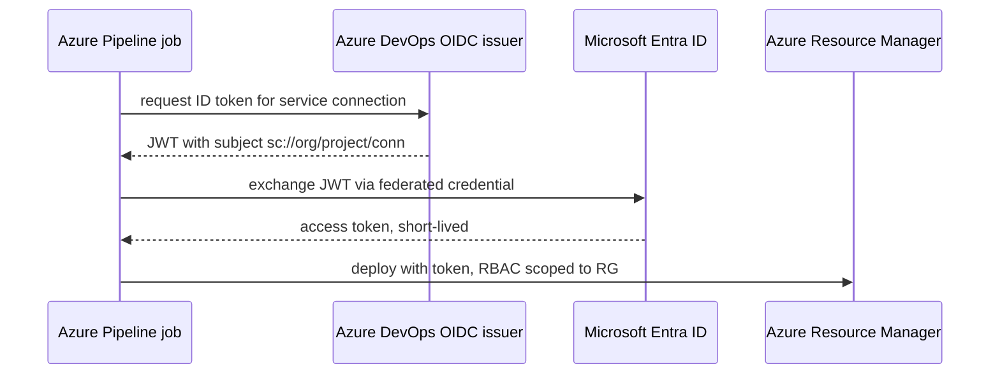

# N3 Azure DevOps & AWS CodePipeline (cloud-native CI/CD)
> Last verified: 2026-10 · Audience: senior/staff DevOps, SRE, AI eng, NetEng, DevSecOps, architects

## TL;DR
- **Azure DevOps** = Boards + Repos + Pipelines + Artifacts + Test Plans. Pipelines is the piece that matters in design interviews: **YAML multi-stage** pipelines, **extends templates** + **required-template checks** for governance, **environments** with **approvals & checks** (defined by the *resource owner*, not in YAML).
- **Identity:** Azure service connections should use **workload identity federation (OIDC)** — no secrets. New WIF connections use the **Entra issuer**; the legacy `vstoken.dev.azure.com` issuer retires **2027-07-01**. AWS equivalent: CodePipeline/CodeBuild/CodeDeploy **service roles** (IAM) plus cross-account assume-role.
- **Agents:** Microsoft-hosted (fresh VM per job, 2 vCPU/7 GB, ~10 GB free disk, no private networking) → **Managed DevOps Pools** (GA; successor to VMSS agents; VNet injection, custom images, standby agents, stateful up to 7 days, jobs up to 2 days) → plain self-hosted.
- **AWS stack:** **CodePipeline V2** (orchestrator: triggers on tags/branches/paths/PRs, pipeline variables, QUEUED/PARALLEL modes, **stage conditions** with CloudWatch-alarm rules, **automatic rollback**), **CodeBuild** (buildspec; on-demand, **reserved-capacity fleets**, Lambda compute, **managed GitHub Actions/GitLab runners**), **CodeDeploy** (EC2 in-place/blue-green, ECS and Lambda **canary/linear/all-at-once** traffic shifting, **alarm-based auto rollback**), **CodeArtifact**.
- **Service status (verify before you say it):** **CodeCommit** was de-emphasized Jul 2024 and **returned to GA on 2025-11-24**; **CodeCatalyst** closed to new customers **2025-11-07** (maintenance only). Don't recommend either for greenfield without that caveat.
- **Safe deployments (Amazon Builders' Library):** pre-prod alpha/beta/gamma → **one-box** → **waves** of Regions (1 small Region, 1 large Region, then 3, 12, rest), **bake times** (≥1 h after one-box, ~12 h after first wave, 2–4 h later), **alarm-driven automatic rollback**, business-hours windows → global rollout takes **~4–5 business days**.
- **Decision:** native (Azure Pipelines / CodePipeline) when you're single-cloud and want IAM/RBAC-native deploys and compliance evidence in the cloud account; **GitHub Actions/GitLab** for dev-experience, multi-cloud, marketplace and AI features — often **hybrid** (GitHub for CI, native for CD/deploy gates).

## N3.1 Azure DevOps services overview
- **How it works:**
  - **Boards** (work items, Kanban, sprints, Delivery Plans; integrates with GitHub commits/PRs via `AB#123` links).
  - **Repos** (Git; branch policies: min reviewers, linked work items, comment resolution, **build validation**, status checks, path-based required reviewers).
  - **Pipelines** (YAML multi-stage + legacy Classic build/release; agents; environments; library = variable groups + secure files).
  - **Artifacts** (feeds for NuGet, npm, Maven, Python, Cargo, Universal Packages; **upstream sources** to public registries; **views** `@local`/`@prerelease`/`@release` for promotion; org- or project-scoped feeds). Free tier ~2 GiB storage (unverified — check pricing page).
  - **Test Plans** (manual/exploratory testing; separately licensed — Basic + Test Plans).
  - Hierarchy: **organization → projects → repos/pipelines**; Entra ID-backed orgs; **Azure DevOps Server** = on-prem (no Microsoft-hosted agents, Managed DevOps Pools or GHAzDO).
- **Trade-offs / when to use:** strongest in Microsoft/.NET/regulated enterprises already on Entra + Azure; Boards+Test Plans are things GitHub lacks natively. Weakest: marketplace breadth, AI-assist feature velocity vs GitHub.
- **Interview angles:**
  - "Classic release vs YAML?" → YAML for pipeline-as-code, PR review of pipeline changes, templates; Classic releases are legacy — migrate. Checks live on **resources**, so YAML authors can't bypass them.
  - Pitfall: "Grant access permission to all pipelines" on service connections/pools — disables per-pipeline authorization; flagged by security reviews.

## N3.2 Azure Pipelines YAML model
- **How it works:**
  - Hierarchy **pipeline → stages → jobs → steps** (steps = `script`/`bash`/`pwsh`/`task`/`checkout`/`download`/`template`). Each **job** runs on one agent; jobs in a stage run in parallel unless `dependsOn`; stages sequential by default.
  - Job types: **agent job**, **server job** (`pool: server`, agentless — delays, invoke REST, manual validation), **deployment job** (`- deployment:` targets an environment), **container job**.
  - Triggers: `trigger` (CI, branch/path/tag filters, `batch: true`), `pr` (GitHub/Bitbucket; Azure Repos PR builds use **branch policy build validation** instead), `schedules` (cron), `resources.pipelines` (pipeline completion), `resources.repositories`.
  - Expressions: **compile-time** `${{ }}` (templates, parameters; resolved before run — can add/remove YAML), **runtime** `$[ ]` (variables, conditions), **macro** `$(var)` (substituted just before a task runs).
  - Outputs across stages: `##vso[task.setvariable variable=x;isOutput=true]` → `$[stageDependencies.Stage.Job.outputs['step.x']]`; deployment job output paths include the hook/resource name (e.g. `Deploy_<resource>.step.var`, `deploy_10.step.var` for canary increment 10).
  - `lockBehavior: sequential | runLatest` (default runLatest) with the **exclusive lock** check → serialize deploys to an environment.
- **Trade-offs:** compile-time expansion is powerful (and is what makes `extends` enforceable) but makes debugging harder; use "Download full YAML" / preview API.
- **Interview angles:**
  - "Pass a value from build to deploy stage?" → output variable + `stageDependencies`, or publish a **pipeline artifact**; never write it to a variable group from the pipeline unless a check needs it.
  - "Why is my job stuck 'pending'?" → name collision with reserved keywords/duplicate job names, no agent matching demands, parallel-job exhaustion, or a check waiting.

## N3.3 Templates & extends for governance
- **How it works:**
  - **includes** (`- template: steps.yml`) = textual insertion; **extends** (`extends: template: pipeline.yml@templates`) = the template owns the outer structure, the consumer only fills typed parameters (like inheritance).
  - Store templates in a central repo via `resources.repositories` and **pin to a tag/ref** (`ref: refs/tags/v1`).
  - Typed parameters (`string` with `values:`, `boolean`, `stepList`, `jobList`, `stageList`...) → restrict pools, images, environments.
  - Hardening inside templates: inject mandatory steps (cred scan, SBOM, signing) before/after user steps; iterate `${{ each step in parameters.usersteps }}` to **strip inline scripts**; `target: <container>` to run user steps in a container; `target: { commands: restricted, settableVariables: [..] }` to restrict **logging commands** (blocks artifact upload etc.; empty `settableVariables` = no variable setting → mitigates injection).
  - **Enforcement:** add a **Required template** check on the protected resource (service connection, environment, pool, repo). Pipelines that don't `extends` the approved template fail the check. Org-wide alternative: **pipeline decorators** (extension that injects steps into every job, including deployment-job hooks; not supported in deployment groups).
- **Trade-offs:** extends+required-template is the Azure analogue of GitHub **required workflows/rulesets** or GitLab **compliance pipelines / pipeline execution policies**; decorators are invisible to authors (surprising) but un-bypassable.
- **Interview angles:**
  - "How do you stop a team deploying to prod with a hand-rolled pipeline?" → prod service connection + environment protected by **required template** + **branch control** (`refs/heads/main`, protected) + **approval**; pipeline must `extends` the golden template that runs scans and signs artifacts.
  - Pitfall: templates without a pinned ref → a template change silently alters every pipeline.

## N3.4 Environments, approvals & checks
- **How it works:**
  - **Environment** = named deploy target (+ optional resources: Kubernetes namespaces, VMs) giving **deployment history** and traceability (commits/work items per deploy).
  - Checks can be set on **environments, service connections, repositories, variable groups, secure files, agent pools**; owned by resource admins, **not editable from YAML**.
  - Evaluated **before each stage**, for all resources the stage uses. Order of categories: **(1) static** — Branch control, Required template, Evaluate artifact (container image policy) → **(2) pre-check approvals** → **(3) dynamic** — Approval, Invoke Azure Function, Invoke REST API, Business hours, Query Azure Monitor alerts → **(4) post-check approvals** → **(5) Exclusive lock**. Also ServiceNow Change Management (extension).
  - Each check has a **timeout**; approval timeout → stage **skipped**; one terminal negative decision fails the stage. Function/REST checks with non-zero "time between evaluations" are **non-final** (re-evaluated); recommended async callback mode makes them final.
  - Approvals: group approver = any one member; option to **prevent self-approval**; **deferred approvals** (approve now, effective at a set time); admins can **bypass** a check (audited).
- **Trade-offs:** checks give strong separation of duties (SOX/ISO evidence) but add latency; Azure Monitor alert check is the built-in "bake + health gate".
- **Interview angles:**
  - "Implement a post-deploy health gate in Azure?" → next stage uses an environment with **Query Azure Monitor alerts** check (time between evaluations e.g. 5 min, timeout e.g. 60 min) — that's the Builders' Library bake time.
  - "Change-freeze window?" → **Business hours** check; for hotfix → admin bypass (audited).

## N3.5 Deployment jobs & strategies
- **How it works:**
  - `- deployment:` + `environment:` + `strategy:`; does **not** auto-checkout (`checkout: self` if needed); artifacts auto-downloaded only in the `deploy` hook.
  - Lifecycle hooks: `preDeploy` → `deploy` → `routeTraffic` → `postRouteTraffic` → `on: failure | success` (rollback/cleanup). Each hook can use an agent pool or `pool: server`.
  - **runOnce:** all hooks once.
  - **rolling:** **VM resources only**; `maxParallel` (number or %) per batch; all hooks per batch; gap: retrying a stage redeploys to **all** VMs.
  - **canary:** `increments: [10, 20]` → `preDeploy` once, then `deploy/routeTraffic/postRouteTraffic` per increment, then promote; with `KubernetesManifest` task `strategy: canary`, `percentage: $(strategy.increment)`, `action: $(strategy.action)` (deploy/promote/reject). (Pod-ratio canary unless an SMI/service-mesh traffic split is used.)
- **Trade-offs:** native strategies are thin; for serious progressive delivery on AKS use **Argo Rollouts/Flagger** ([N4](./N4-gitops-argocd-flux.md)); App Service uses **deployment slots** + swap (blue/green); Container Apps uses **revisions** with traffic weights.
- **Interview angles:** "Azure equivalent of CodeDeploy canary for Lambda?" → Azure Functions/App Service slots with traffic % routing, or Container Apps revision weights — no single CodeDeploy-like service.

## N3.6 Agents: Microsoft-hosted vs self-hosted vs Managed DevOps Pools
- **How it works:**
  - **Microsoft-hosted:** fresh VM per job, discarded after; Linux/Windows on **Standard_DS2_v2 (2 vCPU, 7 GB RAM, 14 GB SSD, ≥10 GB free)**; macOS always runs in the **US**; images updated regularly (`ubuntu-latest`=24.04, `ubuntu-26.04` GA 2026-09-29; `windows-latest` moving to 2025+VS2026). **Free tier:** 1 parallel job, **60 min/job, 1,800 min/month** (private projects); paid parallel jobs → **360 min (6 h)** per job, no monthly cap. **No ExpressRoute/VPN, no service tags** — must allow-list weekly-published `AzureCloud.<region>` IP ranges for *every region in your geography*. Not CIS-hardened.
  - **Self-hosted:** your VM/container; persistent (state leaks across jobs unless you clean); you patch it; can reach private networks.
  - **VMSS agents:** Azure DevOps scales your scale set — legacy, superseded by MDP.
  - **Managed DevOps Pools (GA):** Microsoft-managed agent VMs/containers (not in your subscription) with **VNet injection**, custom images (Azure Compute Gallery) or marketplace/hosted-equivalent images, **standby (pre-provisioned) agents**, stateful agents up to **7 days** (cache hits), jobs up to **2 days**, data disks, Key Vault cert fetch via managed identity, proxy support, scale to thousands of agents. Resource provider `Microsoft.DevOpsInfrastructure`; pay for Azure compute.
- **Trade-offs:** hosted = zero ops + strongest isolation for untrusted (fork) code; MDP = private networking + bigger SKUs with low ops; self-hosted = full control, highest security burden (never run fork PRs on them).
- **Interview angles:**
  - "Pipeline must deploy to a private AKS/Key Vault with public access disabled" → MDP with VNet injection (or self-hosted in the VNet). Hosted agents can't use Private Link.
  - AWS analogue: CodeBuild **VPC config** / reserved fleets; GitHub analogue: larger runners with Azure private networking.

## N3.7 Service connections, workload identity federation, variable groups + Key Vault
- **How it works:**
  - **ARM service connection** options (recommended first): **App registration (automatic) + WIF**; **Managed identity** (creates a federated credential on an existing **user-assigned MI** — use when you can't create app registrations); manual app reg/MI with WIF or secret. Legacy (not recommended): app reg + secret, agent-assigned MI, publish profile.
  - WIF = Azure DevOps issues an OIDC token per job; Entra trusts it via a **federated credential** (issuer + subject, subject like `sc://<org>/<project>/<service-connection>`). **Issuer change:** new connections use `https://login.microsoftonline.com/<tenant>/v2.0`; legacy `https://vstoken.dev.azure.com/<org-id>` retires **2027-07-01** (public cloud, single-tenant apps/MIs). Convert existing secret-based connections with the **Convert** button (revert within 7 days) or REST script.
  - Scope: subscription (+optional RG), management group, ML workspace — scope to RG + least-privilege role.
  - Unused ARM connections may be **auto-disabled after 100 days**.
  - **Variable groups** (library): shared vars; can be **linked to Key Vault** — only secret *names* are mapped, values fetched at runtime (service connection needs Get/List or *Key Vault Secrets User* RBAC). Alternative: `AzureKeyVault@2` task in the job. Secrets are masked in logs, not exposed to fork builds, and not passed as env vars unless mapped explicitly (`env:`).
  - **Secure files** for certs/provisioning profiles.
- **Trade-offs:** WIF removes secret rotation and expiry outages; MI option needs a pre-created UAMI per connection (good for strict Entra tenants).
- **Interview angles:**
  - "Map to AWS?" → service connection ≈ IAM role assumed by CodeBuild/CodePipeline service role, or **GitHub OIDC → `sts:AssumeRoleWithWebIdentity`** when CI is external. Variable group+Key Vault ≈ CodeBuild `env.secrets-manager` / `parameter-store`.
  - Pitfall: one subscription-wide Owner connection shared by all pipelines → put checks + required template on it, split per environment.

## N3.8 Azure DevOps vs GitHub direction; GHAS for Azure DevOps
- **How it works:**
  - Microsoft keeps shipping Azure DevOps (MDP GA, new hosted images, WIF issuer work), but **GitHub** gets the AI/Copilot-first and community features; Microsoft's own guidance is "both supported; GitHub for new dev-centric work" (unverified as an official statement — phrase as a trend). Common hybrid: **GitHub repos + Actions** with **Azure Boards** integration, or GitHub repos built by **Azure Pipelines**. Migration tool: **GitHub Enterprise Importer** (repos + PRs from Azure Repos).
  - **GitHub Advanced Security for Azure DevOps (GHAzDO):** Azure Repos (Services only, Git). Now sold as two products — **GitHub Secret Protection for Azure DevOps** (push protection, secret scanning alerts, security overview) and **GitHub Code Security for Azure DevOps** (dependency scanning, **CodeQL** code scanning incl. **default setup** on a weekly schedule, third-party SARIF findings); billed per **active committer**; enable at repo/project/org (with auto-enable for new repos/projects). Pipeline tasks: `AdvancedSecurity-Codeql-Init/Autobuild/Analyze`, `AdvancedSecurity-Dependency-Scanning`, `AdvancedSecurity-Publish`. PR **status checks** `AdvancedSecurity/AllHighAndCritical` and `AdvancedSecurity/NewHighAndCritical` as branch policies. Copilot Autofix in limited preview.
  - Push protection only applies to pushes after enablement; repo scanning covers history.
- **Interview angles:** "We're on Azure Repos — do we need to move to GitHub for secret scanning/CodeQL?" → No, GHAzDO; but billing is per active committer, and self-hosted agents must allow-list `advsec.dev.azure.com` etc.

## N3.9 AWS CodePipeline V2
- **How it works:**
  - Orchestrator: **stages → actions** (Source, Build, Test, Deploy, Approval, Invoke, **Commands**); actions in a stage run by `runOrder` (same number = parallel). Artifacts pass via an **S3 artifact store** (one per Region for **cross-Region actions**; KMS CMK needed for **cross-account**).
  - **V2-only features:** triggers with **Git tag / branch / file-path / pull-request filters** (via **CodeConnections**, formerly CodeStar Connections), **pipeline-level variables** at start time, **source revision overrides**, execution modes **SUPERSEDED** (default; newer run overtakes waiting one), **QUEUED**, **PARALLEL**, **stage rollback**, **stage conditions**, **automatic stage retry on failure**, **Commands action** (run shell commands without a CodeBuild project).
  - **Stage conditions:** `beforeEntry` (results **FAIL** or **SKIP**), `onSuccess` (**ROLLBACK** or **FAIL**), `onFailure` (**ROLLBACK**, or **RETRY** of failed stage/actions). Rules: **CloudWatchAlarm** (with WaitTime), **DeploymentWindow** (cron + TZ), **LambdaInvoke**, **VariableCheck**, Commands. SKIP only with LambdaInvoke/VariableCheck; rollback only to an execution in the current pipeline structure version; conditions (except Skip) can be **overridden** per run.
  - **Pricing shape:** V1 = per **active pipeline/month** (~$1); V2 = per **action-execution minute** (~$0.002/min, rounded up; approvals and custom actions not billed) (verify current free tier on pricing page).
  - Manual approval action (SNS notification, up to 7 days) (unverified exact max — commonly cited).
- **Trade-offs:** cheap and IAM-native, deploy actions for CloudFormation, ECS, CodeDeploy, S3, Elastic Beanstalk, EKS (v2 action), Lambda; weak UX, JSON/CFN/CDK-defined (no repo-native YAML), limited reusable templating (use **CDK Pipelines** for self-mutating multi-account pipelines).
- **Interview angles:**
  - "Block prod deploy if prod is unhealthy, and roll back if alarms fire after deploy?" → `beforeEntry` CloudWatchAlarm rule (FAIL) + `onSuccess` CloudWatchAlarm with WaitTime = bake (ROLLBACK) + CodeDeploy alarm rollback inside the stage.
  - "Monorepo — only build service X when its folder changes?" → V2 trigger with **file-path filters** (or VariableCheck + Skip).

## N3.10 AWS CodeBuild
- **How it works:**
  - **buildspec.yml** `version: 0.2`; phases `install` → `pre_build` → `build` → `post_build`; `env` (`variables`, `parameter-store`, `secrets-manager`, `exported-variables`), `artifacts`, `reports` (JUnit/Cucumber/coverage), `cache` (S3 or local modes: source, Docker layer, custom). **Batch builds** (build-graph/list/matrix/fanout).
  - Compute: **on-demand EC2 containers** (`BUILD_GENERAL1_SMALL…2XLARGE`, ARM, GPU), **Lambda compute** (fast start, 15-min limit, no Docker/privileged), **reserved capacity fleets** (always-warm EC2 instances you pay for while provisioned; Linux/Windows/**macOS M2**; custom AMI; VPC; outbound proxy rules; attribute-based compute selection; overflow to on-demand or queue; cache shared across projects in the account), instance running mode (bare EC2, not container).
  - **Runner projects:** CodeBuild as **managed ephemeral self-hosted runner** for **GitHub Actions** (webhook on `WORKFLOW_JOB_QUEUED`; `runs-on: codebuild-<project>-${{ github.run_id }}-${{ github.run_attempt }}` + optional `image:`, `instance-size:`, `fleet:` labels; org/enterprise registration), also GitLab and Buildkite. Buildspec ignored unless `buildspec-override:true`.
  - VPC config gives private access (needs NAT or VPC endpoints for internet/AWS APIs).
- **Trade-offs:** runner mode = keep GitHub UX, run inside your AWS account/VPC with IAM roles (no long-lived keys) — strong answer to "GitHub CI but private network". Reserved fleets trade standing cost for no cold start + warm caches.
- **Interview angles:** Privileged mode required for Docker-in-Docker builds; prefer ECR pull-through cache + local Docker layer cache to cut build time.

## N3.11 AWS CodeDeploy
- **How it works:**
  - **EC2/on-prem:** agent + `appspec.yml`; **in-place** (optional ELB deregistration) or **blue/green** (new ASG/instances, reroute ELB). Predefined configs: `CodeDeployDefault.AllAtOnce`, `HalfAtATime`, `OneAtATime` (default); custom `minimumHealthyHosts` (count/%) and **zonal config** (per-AZ minimum healthy, deploy AZ by AZ, `monitorDuration` bake between AZs — custom configs only).
  - **ECS** (blue/green task sets, two target groups, prod + optional **test listener**): `ECSCanary10Percent5Minutes|15Minutes`, `ECSLinear10PercentEvery1Minutes|3Minutes`, `ECSAllAtOnce` (only option with **NLB**); custom canary/linear allowed (not with CloudFormation-managed blue/green).
  - **Lambda** (alias weight shifting): `LambdaCanary10Percent5/10/15/30Minutes`, `LambdaLinear10PercentEvery1/2/3/10Minutes`, `LambdaAllAtOnce`; usually driven by SAM `DeploymentPreference`.
  - **Hooks:** EC2 in-place order `ApplicationStop → (DownloadBundle) → BeforeInstall → (Install) → AfterInstall → ApplicationStart → ValidateService`, plus `Before/AfterBlockTraffic`, `Before/AfterAllowTraffic` around LB changes; script timeout default/max **3600 s per event**; `ApplicationStop` uses the *previous* revision's scripts (skipped on first deploy). ECS: `BeforeInstall, AfterInstall, AfterAllowTestTraffic, BeforeAllowTraffic, AfterAllowTraffic`. Lambda: `BeforeAllowTraffic, AfterAllowTraffic`. ECS/Lambda hooks are **Lambda functions** that must call `PutLifecycleEventHookExecutionStatus` within **1 hour**.
  - **Auto rollback** on `DEPLOYMENT_FAILURE` and/or `DEPLOYMENT_STOP_ON_ALARM` (CloudWatch alarms attached to the deployment group, up to 10). Rollback = redeploy last good revision (new deployment ID).
- **Trade-offs:** ECS now also has **native ECS blue/green** (2025) with lifecycle hooks and bake time, reducing need for CodeDeploy on ECS (verify feature parity per use case). For EKS, CodeDeploy doesn't apply → Argo Rollouts/Flagger.
- **Interview angles:**
  - "OneAtATime succeeded though last instance failed?" → by design: last-instance failure doesn't fail the deployment.
  - "HalfAtATime across 2 ASGs" → may deploy to all of one ASG — prefer zonal config.

## N3.12 Artifact repositories: CodeArtifact & Azure Artifacts
- **How it works:**
  - **CodeArtifact:** **domain** (shared storage + KMS key, dedupe across repos, cross-account via domain policy) → **repositories** with **upstream repositories** and one **external connection** (npmjs, PyPI, Maven Central, NuGet.org...). Formats: npm, PyPI, Maven/Gradle, NuGet, Swift, Ruby, Cargo, generic. Auth via `aws codeartifact login` / `get-authorization-token` (short-lived, ≤12 h). **Package origin controls** block dependency-confusion (internal names can't be pulled from public upstream). VPC endpoints supported.
  - **Azure Artifacts:** feeds (org/project scope), upstream sources (public + other feeds), **views** for promotion, retention policies; formats incl. **Universal Packages**; auth via Entra/PAT/`NuGetAuthenticate`/`npmAuthenticate` tasks.
- **Trade-offs:** both cover the common package managers; neither is a container registry (ECR / ACR). JFrog Artifactory/Nexus for multi-format + multi-cloud.
- **Interview angles:** dependency confusion defense → upstream-only proxy, origin controls / Azure Artifacts "allow externally sourced versions" setting, scoped npm names; see [L6 Secrets & supply chain](../L-data-privacy-ai-security/L6-secrets-supply-chain.md).

## N3.13 CodeCommit & CodeCatalyst status
- **CodeCommit:** closed to new customers Jul 2024 → **back to GA 2025-11-24**; roadmap: Git LFS (Q1 2026), new Regions eu-south-2/ca-west-1 (Q3 2026); 99.9% SLA; IAM-native, VPC endpoints, CloudTrail. Safe to use for IAM-gated, in-account repos; most orgs still use GitHub/GitLab via **CodeConnections**.
- **CodeCatalyst:** **closed to new customers from 2025-11-07**; existing customers continue, security/availability maintenance only, **no new features**; AWS points to CodeBuild/CodePipeline/CodeDeploy/CodeArtifact or GitLab Duo with Amazon Q.
- **Interview angle:** naming either as a strategic pick without the status caveat is a red flag; showing awareness of the reversal is a plus.

## N3.14 Safe deployments (AWS Builders' Library)
- **How it works:**
  - Phases: **source → build → test (alpha, beta, gamma) → prod**; **gamma** is prod-like, multi-Region, runs canaries/synthetics with prod alarms.
  - **One-box**: one host/container/small Lambda % first (≈10% of a wave's traffic max) to catch bad code and **backward-compatibility** issues; **≥1 h bake**.
  - **Waves:** wave 1 = one low-traffic Region, AZ-by-AZ; wave 2 = one high-traffic Region; then 3 Regions, 12 Regions, remaining Regions in parallel; **bake ~12 h after first wave, 2–4 h after later waves**; global in ~**4–5 business days**.
  - **Automatic rollback** on high-severity alarms (fault rate, P50/P90/P99 latency, CPU/memory, health checks) of the service *and* aggregate team alarms; rollback must be safe (two-phase schema/protocol changes: deploy reader first, then writer).
  - **Time windows:** business hours, no weekends/holidays (often no Fridays); blocks on active incidents.
- **Mapping:** waves = CodePipeline stages per Region; bake = `onSuccess` CloudWatchAlarm WaitTime / Azure Monitor alerts check; one-box = CodeDeploy canary / Azure canary increments; windows = **DeploymentWindow** rule / **Business hours** check.
- **Interview angles:** tie to error budgets ([J1](../J-sre/J1-slis-slos-error-budgets.md)) and release engineering ([J6](../J-sre/J6-toil-release-engineering.md)); "why not deploy to all Regions at once?" → blast radius = one Region/AZ; Region isolation is pointless if deploys break them all simultaneously.

## N3.15 Native vs GitHub/GitLab — decision
| Factor | Azure Pipelines | CodePipeline + CodeBuild | GitHub Actions / GitLab CI |
|---|---|---|---|
| Pipeline-as-code | YAML in repo, strong templates/extends | JSON/CFN/CDK, not repo-native YAML (buildspec is) | YAML in repo, reusable workflows / includes |
| Governance gates | Checks on resources (approvals, branch, required template, Monitor alerts) | Manual approval, stage conditions, IAM | Environments + protection rules, rulesets / protected envs, compliance pipelines |
| Cloud identity | WIF service connections | Service roles (native IAM) | OIDC to AWS/Azure/GCP |
| Private networking | MDP VNet injection / self-hosted | CodeBuild VPC, reserved fleets | Self-hosted/ARC, larger runners w/ private networking, or CodeBuild runner |
| Multi-cloud | Good | AWS-only | Best |
| Ecosystem / AI | Marketplace, GHAzDO | Small | Largest marketplace, Copilot / GitLab Duo |
- **Rule of thumb:** CI where developers live (GitHub/GitLab); CD can be native when you need in-account audit trails, IAM-only trust, or CodeDeploy/Azure check-based gating. Avoid duplicating gates in two systems. See [N1 GitHub Actions](./N1-github-actions.md), [N2 GitLab CI & Jenkins](./N2-gitlab-ci-jenkins.md), [C5 Deployment](../C-large-scale-architecture/C5-deployment.md).

## Diagrams




## Cloud mapping: AWS vs Azure
| Capability | AWS | Azure | Role it plays | Key differences | Alternatives |
|---|---|---|---|---|---|
| Pipeline orchestration | CodePipeline V2 | Azure Pipelines (multi-stage YAML) | Stages, triggers, gates | CodePipeline defined via API/CFN/CDK, per-action-minute pricing; Azure YAML in repo, per parallel job pricing | GitHub Actions, GitLab CI, Jenkins |
| Build compute | CodeBuild (on-demand, Lambda, reserved fleets, runner mode) | MS-hosted agents, Managed DevOps Pools, self-hosted | Run build/test jobs | CodeBuild per-minute by compute type; MDP pays Azure VM cost; hosted agents capped 2 vCPU | GitHub larger runners, ARC on K8s, Buildkite |
| Deploy strategies | CodeDeploy configs (canary/linear/all-at-once, blue/green, zonal) | Deployment jobs runOnce/rolling/canary, App Service slots, Container Apps revisions | Progressive traffic shift + rollback | CodeDeploy is a managed traffic shifter with alarm rollback; Azure strategies are pipeline-hook based | Argo Rollouts, Flagger, LaunchDarkly flags |
| Approvals / gates | Manual approval action, stage conditions (CloudWatchAlarm, DeploymentWindow, Lambda) | Environment checks (approval, business hours, Azure Monitor, REST/Function, exclusive lock) | Change control, health gates | Azure checks owned by resource admin and order-categorized; AWS conditions in pipeline definition (IAM-protected) | ServiceNow, GitHub environments |
| Cloud identity for CI | IAM service roles; OIDC for external CI | Service connection with WIF (app reg or UAMI) | Secretless deploy auth | IAM role per pipeline/action, cross-account assume-role; Azure scope sub/RG/MG | Vault dynamic creds, SPIFFE |
| Secrets in pipeline | Secrets Manager / Parameter Store in buildspec `env` | Variable group linked to Key Vault, AzureKeyVault task | Inject secrets at runtime | AWS per-build fetch by role; Azure maps secret names into group | HashiCorp Vault |
| Package feeds | CodeArtifact | Azure Artifacts | Private packages + upstream proxy | CodeArtifact domain-level dedupe + origin controls; Azure has views + Universal Packages | Artifactory, Nexus, GitHub Packages |
| Source hosting | CodeCommit (GA again 2025-11) / CodeConnections | Azure Repos | Git + policies | Azure Repos has GHAzDO; CodeCommit IAM-native | GitHub, GitLab |
| Code security | Amazon Inspector code scanning (CodeGuru Security status: unverified) | GHAzDO Secret Protection + Code Security | SAST, secrets, SCA | GHAzDO = CodeQL + push protection per active committer | GitHub GHAS, Snyk, Wiz Code |
- **Roles:** CodePipeline ≈ the *orchestrator* only; build steps live in CodeBuild, deploys in CodeDeploy/ECS/CFN — Azure Pipelines bundles orchestration + compute + deploy in one product.
- **Scope:** CodePipeline is **regional** (cross-Region actions need per-Region artifact buckets); Azure DevOps org is **geography-scoped SaaS** independent of Azure subscriptions; agents run in the org's geography (macOS in US).
- **Pricing shape:** CodePipeline V2 per action-execution minute + CodeBuild per build-minute; Azure DevOps per user (Basic) + per **parallel job** (hosted or self-hosted) + MDP VM costs.
- **Gotchas:** Azure hosted agents can't use Private Link/ExpressRoute; CodeBuild in VPC needs NAT/endpoints; CodeDeploy ECS + NLB = AllAtOnce only; Azure rolling strategy = VMs only; CodePipeline rollback only to executions in current pipeline structure version.
- **Alternatives:** GitHub Actions + OIDC to both clouds is the most common multi-cloud answer; Argo CD/Flux for K8s CD ([N4](./N4-gitops-argocd-flux.md)); Terraform pipelines with policy-as-code ([N5](./N5-iac-pipelines-policy-as-code.md)).

## Hands-on (optional)
**azure-pipelines.yml** — extends a pinned governance template; build → staging → prod (prod protected by checks on the environment):
```yaml
trigger:
  branches: { include: [main] }
resources:
  repositories:
  - repository: templates
    type: git
    name: Platform/pipeline-templates
    ref: refs/tags/v3.2.0
extends:
  template: golden/service.yml@templates   # injects scan, SBOM, signing
  parameters:
    buildSteps:
    - script: make test build
    deployStages:
    - name: staging
      environment: web-staging
      serviceConnection: azure-staging-wif
    - name: prod
      environment: web-prod                 # approvals + Monitor alerts + business hours
      serviceConnection: azure-prod-wif
```
Inside the template, a deploy stage might look like:
```yaml
- stage: prod
  dependsOn: staging
  lockBehavior: sequential
  jobs:
  - deployment: deploy_aks
    environment: web-prod.payments          # env.resource (K8s namespace)
    pool: mdp-prod-vnet                     # Managed DevOps Pool, VNet-injected
    strategy:
      canary:
        increments: [10, 50]
        deploy:
          steps:
          - task: KubernetesManifest@1
            inputs:
              action: $(strategy.action)
              strategy: $(strategy.name)
              percentage: $(strategy.increment)
              manifests: $(Pipeline.Workspace)/drop/k8s/*.yaml
        on:
          failure:
            steps:
            - task: KubernetesManifest@1
              inputs: { action: reject, strategy: canary, manifests: $(Pipeline.Workspace)/drop/k8s/*.yaml }
```
**buildspec.yml** (CodeBuild):
```yaml
version: 0.2
env:
  variables: { IMAGE_REPO: "123456789012.dkr.ecr.eu-west-1.amazonaws.com/web" }
  secrets-manager: { SONAR_TOKEN: "ci/sonar:token" }
  exported-variables: [IMAGE_TAG]
phases:
  pre_build:
    commands:
      - aws ecr get-login-password | docker login --username AWS --password-stdin ${IMAGE_REPO%/*}
      - export IMAGE_TAG=${CODEBUILD_RESOLVED_SOURCE_VERSION:0:12}
  build:
    commands:
      - make test
      - docker build -t $IMAGE_REPO:$IMAGE_TAG .
  post_build:
    commands:
      - docker push $IMAGE_REPO:$IMAGE_TAG
      - printf '{"ImageURI":"%s"}' "$IMAGE_REPO:$IMAGE_TAG" > imageDetail.json
reports:
  unit: { files: ["reports/junit.xml"], file-format: JUNITXML }
artifacts:
  files: [imageDetail.json, appspec.yaml, taskdef.json]
cache:
  paths: ["/root/.cache/**/*"]
```
**Terraform — CodeDeploy ECS blue/green with canary + alarm rollback:**
```hcl
resource "aws_codedeploy_app" "web" {
  name             = "web"
  compute_platform = "ECS"
}

resource "aws_codedeploy_deployment_group" "web" {
  app_name               = aws_codedeploy_app.web.name
  deployment_group_name  = "web-prod"
  service_role_arn       = aws_iam_role.codedeploy.arn
  deployment_config_name = "CodeDeployDefault.ECSCanary10Percent5Minutes"

  deployment_style {
    deployment_option = "WITH_TRAFFIC_CONTROL"
    deployment_type   = "BLUE_GREEN"
  }

  ecs_service {
    cluster_name = aws_ecs_cluster.main.name
    service_name = aws_ecs_service.web.name   # deployment_controller { type = "CODE_DEPLOY" }
  }

  load_balancer_info {
    target_group_pair_info {
      prod_traffic_route { listener_arns = [aws_lb_listener.https.arn] }
      test_traffic_route { listener_arns = [aws_lb_listener.test.arn] }
      target_group { name = aws_lb_target_group.blue.name }
      target_group { name = aws_lb_target_group.green.name }
    }
  }

  blue_green_deployment_config {
    deployment_ready_option { action_on_timeout = "CONTINUE_DEPLOYMENT" }
    terminate_blue_instances_on_deployment_success {
      action                           = "TERMINATE"
      termination_wait_time_in_minutes = 15   # fast-rollback window
    }
  }

  alarm_configuration {
    enabled = true
    alarms  = [aws_cloudwatch_metric_alarm.web_5xx.alarm_name, aws_cloudwatch_metric_alarm.web_p99.alarm_name]
  }

  auto_rollback_configuration {
    enabled = true
    events  = ["DEPLOYMENT_FAILURE", "DEPLOYMENT_STOP_ON_ALARM"]
  }
}
```
Quick ops commands:
```bash
# Start a V2 pipeline with a pipeline-level variable and see stage states
aws codepipeline start-pipeline-execution --name web-pipeline \
  --variables name=RELEASE_NOTES,value="hotfix-123"
aws codepipeline get-pipeline-state --name web-pipeline \
  --query 'stageStates[].{stage:stageName,status:latestExecution.status}'
# Manually roll back the Prod stage to the last successful execution
aws codepipeline rollback-stage --pipeline-name web-pipeline --stage-name Prod \
  --target-pipeline-execution-id <previous-exec-id>
# CodeArtifact npm login (token <= 12h)
aws codeartifact login --tool npm --domain acme --repository npm-internal
```

## Cross-links
- [N1 GitHub Actions](./N1-github-actions.md) · [N2 GitLab CI & Jenkins](./N2-gitlab-ci-jenkins.md) · [N4 GitOps (Argo CD/Flux)](./N4-gitops-argocd-flux.md) · [N5 IaC pipelines & policy-as-code](./N5-iac-pipelines-policy-as-code.md)
- [C5 Deployment](../C-large-scale-architecture/C5-deployment.md) · [J6 Toil & release engineering](../J-sre/J6-toil-release-engineering.md) · [J1 SLIs/SLOs/error budgets](../J-sre/J1-slis-slos-error-budgets.md)
- [L6 Secrets & supply chain](../L-data-privacy-ai-security/L6-secrets-supply-chain.md) · [L7 Zero trust & workload identity](../L-data-privacy-ai-security/L7-zero-trust-workload-identity.md)

## Sources
- https://learn.microsoft.com/en-us/azure/devops/managed-devops-pools/overview
- https://learn.microsoft.com/en-us/azure/devops/pipelines/process/deployment-jobs
- https://learn.microsoft.com/en-us/azure/devops/pipelines/process/approvals
- https://learn.microsoft.com/en-us/azure/devops/pipelines/library/connect-to-azure
- https://learn.microsoft.com/en-us/azure/devops/pipelines/agents/hosted
- https://learn.microsoft.com/en-us/azure/devops/pipelines/security/templates
- https://learn.microsoft.com/en-us/azure/devops/repos/security/configure-github-advanced-security-features
- https://learn.microsoft.com/en-us/azure/devops/repos/security/github-advanced-security-security-overview
- https://docs.aws.amazon.com/codepipeline/latest/userguide/pipeline-types-planning.html
- https://docs.aws.amazon.com/codepipeline/latest/userguide/stage-conditions.html
- https://docs.aws.amazon.com/codedeploy/latest/userguide/deployment-configurations.html
- https://docs.aws.amazon.com/codedeploy/latest/userguide/reference-appspec-file-structure-hooks.html
- https://docs.aws.amazon.com/codebuild/latest/userguide/fleets.html
- https://docs.aws.amazon.com/codebuild/latest/userguide/action-runner.html
- https://aws.amazon.com/blogs/devops/aws-codecommit-returns-to-general-availability/
- https://aws.amazon.com/codecatalyst/
- https://builder.aws.com/content/3ErTKQOTKc5NIw031UePBPxTQ6I/automating-safe-hands-off-deployments (Builders' Library, moved from aws.amazon.com/builders-library)
