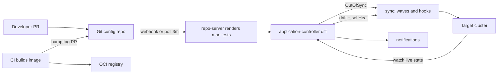
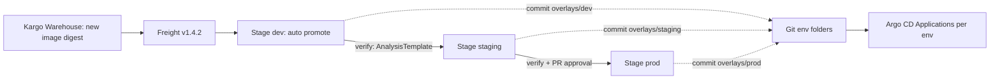

# N4 GitOps with Argo CD and Flux
> Last verified: 2026-10 · Audience: senior/staff DevOps, SRE, AI eng, NetEng, DevSecOps, architects

## TL;DR
- **GitOps = 4 OpenGitOps principles**: declarative, versioned & immutable, **pulled automatically**, **continuously reconciled**. "CI pushes kubectl" is not GitOps. CI builds and publishes artifacts, and the in-cluster agent pulls the desired state.
- **Argo CD** is centralized and app-centric, with a UI, multi-cluster from one hub, Applications/AppProjects/ApplicationSets and sync waves/hooks. **Flux** is a decentralized, per-cluster toolkit of CRDs (Source/Kustomize/Helm/Notification/Image controllers) with no first-class UI. Both are CNCF-graduated.
- **Safety defaults**: Argo CD auto-sync does **not prune** and does **not self-heal** unless you enable it. Reconcile runs every **120 s + up to 60 s jitter**. Webhooks make it fast, and polling is the fallback.
- **Argo CD 3.x** (3.0 in 2025, 3.5 current in Oct 2026) changed several defaults: **annotation-based resource tracking**, **fine-grained RBAC** (update/delete no longer inherit to sub-resources), **logs RBAC enforced**, default exclusions for high-churn resources, and repo config moved from ConfigMap to Secrets only.
- **Promotion**: prefer **folders per environment on one branch** (Kustomize overlays) over branch-per-env. Promote through PRs that bump an image tag or chart version. **Kargo** (Akuity) adds Warehouse→Freight→Stage promotion on top of Argo CD. Argo CD's **Source Hydrator** commits rendered manifests to Git.
- **Secrets never go in Git in plaintext**. Use SOPS (Flux decrypts natively), Sealed Secrets, or the **External Secrets Operator** backed by AWS Secrets Manager or Azure Key Vault.
- **Scale/DR**: shard the application controller **by cluster**, scale the repo-server horizontally (24 h manifest cache, `--parallelismlimit`), and treat Redis as disposable. Make the GitOps control plane itself declarative (Argo manages Argo, `flux bootstrap`) so you can rebuild it from Git plus a secret backup.
- **Managed offerings**: **EKS Capabilities: Argo CD** runs in the AWS control plane with Identity Center SSO. **AKS** has the **`microsoft.flux` extension** (free on AKS) and the **`Microsoft.ArgoCD` extension** (GA on AKS, preview on Arc).

## N4.1 GitOps principles, push vs pull
- **How it works:**
  - **OpenGitOps v1.0.0** (CNCF GitOps WG) defines four principles:
    1. **Declarative**: the desired state is expressed declaratively.
    2. **Versioned and immutable**: the desired state is stored immutably with full history.
    3. **Pulled automatically**: software agents pull the desired state from the source.
    4. **Continuously reconciled**: agents observe the actual state and keep applying the desired state.
  - Git is the usual source, but the principles say "source". **OCI registries** (Helm/OCI artifacts) and buckets also qualify, and Argo CD, Flux and the EKS capability all support OCI sources.
  - **Push model**: the CI runner holds cluster credentials and runs `kubectl apply` or `helm upgrade`. Nothing detects drift after the job ends.
  - **Pull model**: an agent in or near the cluster has outbound access only. It fetches the desired state, diffs it against the live state and applies the difference. The cluster API never has to be exposed to CI.
- **Trade-offs / when to use:**
  - Pull gives you drift correction, audit through Git history, rollback through `git revert`, and a smaller credential blast radius because CI holds no cluster admin credentials. It also reconstructs a cluster at scale.
  - Pull costs reconciliation latency (seconds to minutes) and makes imperative one-off operations awkward. Debugging is indirect (why is it OutOfSync?). Secrets and CRD ordering need patterns.
  - Push is still fine for non-Kubernetes targets such as Lambda, App Service or databases. A common hybrid is CI that updates Git, with GitOps applying the change.
- **Interview angles:**
  - If asked "is GitOps just CI/CD with Git?", say: no. The defining part is **pull plus continuous reconciliation**. CI ends at "artifact published plus manifest PR".
  - Pitfall: CI writing straight to the env branch with no review defeats the audit and immutability benefits.
  - Follow-up "how do you roll back?": `git revert` the promotion commit. Argo CD's UI rollback is **disabled while auto-sync is on**.
  - See the intro in [J6](../J-sre/J6-toil-release-engineering.md) and deployment strategies in [C5](../C-large-scale-architecture/C5-deployment.md).

## N4.2 Argo CD architecture
- **How it works:** these components normally run in the `argocd` namespace.
  - **argocd-server (API server)**: a gRPC/REST API for the UI, CLI and CI. It handles app operations (sync, rollback), stores repo and cluster credentials as Secrets, delegates authentication to SSO, enforces RBAC, and receives Git **webhooks** at `/api/webhook`.
  - **argocd-repo-server**: clones and caches repos and **renders manifests** with Helm template, Kustomize, plain YAML/Jsonnet or Config Management Plugins (CMP sidecars). It is stateless, has no cluster credentials, and is the place where untrusted templating runs, so isolate it.
  - **argocd-application-controller**: a Kubernetes controller that runs as a **StatefulSet**. It compares the live state with the target state from the repo-server, computes Synced/OutOfSync and health, runs syncs and hooks, and uses watches and a cluster cache per managed cluster.
  - **Redis**: a cache for manifests, app state and the cluster-info cache. It is **disposable** and gets rebuilt. HA uses redis-ha with HAProxy and needs 3 or more nodes because of anti-affinity.
  - **ApplicationSet controller**: templates many Applications from generators.
  - **Dex**: an optional OIDC broker for LDAP, SAML or GitHub. You can also connect OIDC directly to Entra ID, Okta or similar.
  - **Notifications controller**: sends events to Slack, Teams or webhooks through triggers and templates.
  - **Commit server**: optional. It is needed by the **Source Hydrator** to push rendered manifests to Git.
  - **State** lives in Kubernetes: Application/AppProject/ApplicationSet CRs plus Secrets and ConfigMaps (`argocd-cm`, `argocd-rbac-cm`, `argocd-cmd-params-cm`). There is no database.
- **Trade-offs / when to use:**
  - The hub's central view and UI are a big selling point. The price is that the hub holds credentials for every cluster: high value target, and a single point of failure for change delivery but not for running workloads.
  - Install modes are full cluster-wide, **namespaced** (manage only some namespaces), or **core** (no UI/API server, headless and Flux-like).
- **Interview angles:**
  - If asked "what happens if Argo CD is down?", say: running workloads are unaffected. You lose deploys and drift correction until it comes back.
  - "Where does Helm run?": in the repo-server, as `helm template`. Argo CD does **not** create Helm releases, so `helm ls` shows nothing and Helm hooks are mapped to Argo hooks.

## N4.3 Applications, AppProjects, App-of-Apps
- **How it works:**
  - **Application**: maps `source` (repoURL, targetRevision, path or chart, Helm/Kustomize params) to `destination` (server or name, namespace) and carries a `syncPolicy`. Multiple **`sources`** are allowed, for example a chart from one repo and values from another (`ref:`).
  - **AppProject** is the tenancy boundary. It restricts:
    - `sourceRepos`
    - `destinations` (cluster plus namespace)
    - `clusterResourceWhitelist` / `namespaceResourceBlacklist`
    - roles with JWT tokens for CI
    - **sync windows** (allow/deny cron windows)
    - `sourceNamespaces` for **Applications in any namespace**
  - The `default` project allows everything, so lock it down.
  - **App-of-Apps**: a root Application points at a directory of Application manifests. It is used for cluster bootstrap. ApplicationSets are now usually preferred for fleets.
  - **Finalizer** `resources-finalizer.argocd.argoproj.io` makes deleting an Application **cascade-delete** its resources. Without the finalizer, the resources are orphaned.
- **Trade-offs / when to use:**
  - One project per team or tenant. Keep cluster-scoped resources (CRDs, namespaces, ClusterRoles) in a platform project that only admins can use.
- **Interview angles:**
  - Pitfall: deleting the root App-of-Apps with cascade can wipe the whole cluster's workloads. Use `argocd.argoproj.io/sync-options: Delete=false` or `Prune=false` on critical resources and protect the root.

## N4.4 Sync policy, waves and hooks
- **How it works:**
  - **Automated sync** (`syncPolicy.automated`): triggered when Git and the cluster diverge.
    - `prune: false` by default, as a safety measure.
    - `selfHeal: false` by default. When enabled, a manual cluster change triggers a re-sync. The self-heal timeout defaults to **5 s** (`--self-heal-timeout-seconds`).
    - `allowEmpty` stops pruning from emptying an app.
    - `automated.enabled` toggles the feature explicitly.
    - Auto-sync does **not retry** the same commit plus parameters after a failure. Use `syncPolicy.retry` with backoff.
  - **Reconcile interval**: `timeout.reconciliation` defaults to **120 s plus 60 s jitter**, so 3 min at most. Webhooks trigger a refresh immediately.
  - **Phases and hooks** (`argocd.argoproj.io/hook`):
    - `PreSync`, for example DB migrations.
    - `Sync`.
    - `PostSync`, which runs after the app is Healthy (smoke tests, notifications).
    - `SyncFail`.
    - `PreDelete` and `PostDelete` (2.10+).
    - `Skip`.
  - **Hook delete policies**: `HookSucceeded`, `HookFailed`, `BeforeHookCreation`. The last is the default.
  - **Sync waves**: annotation `argocd.argoproj.io/sync-wave: "<int>"`. The default wave is 0 and negative values run first.
    - Order is phase → wave (lowest first) → kind (Namespaces and CRDs before Deployments) → name.
    - Argo waits for **Healthy** before moving to the next wave, with a **2 s** delay (`ARGOCD_SYNC_WAVE_DELAY`).
  - **Common sync options**:
    - `CreateNamespace=true`
    - `ServerSideApply=true`, which you need for huge CRDs over the 256 KiB last-applied annotation limit
    - `PruneLast=true`
    - `Replace=true`, which is dangerous
    - `ApplyOutOfSyncOnly=true`, for performance
    - `RespectIgnoreDifferences=true`
    - `FailOnSharedResource=true`
- **Trade-offs / when to use:**
  - Auto-sync plus prune plus self-heal is common in dev and stage. In prod, either use the same setup with promotion gates in Git, or use manual sync with sync windows. The AWS docs recommend manual sync for prod.
  - Hooks are imperative escape hatches. Keep them idempotent.
- **Interview angles:**
  - "How do you run DB migrations?": a PreSync Job hook with `BeforeHookCreation`, or wave −1. The migration must be backward-compatible (expand/contract) because pods roll after it.
  - "CRD and CR in the same app fail on first sync": put the CRDs in an earlier wave, or set `SkipDryRunOnMissingResource=true`.

## N4.5 Health, diffing and drift
- **How it works:**
  - **Sync status**: `Synced`, `OutOfSync` or `Unknown`.
  - **Health status**: `Healthy`, `Progressing`, `Degraded`, `Suspended`, `Missing` or `Unknown`.
  - There are built-in health checks for Deployments, StatefulSets, Ingress, PVCs and Argo Rollouts. For CRDs, write custom **Lua** health checks in `argocd-cm`.
  - **Diff** is the normalized live state against the target. `ignoreDifferences` covers JSON pointers, jq paths, and `managedFieldsManagers` such as an HPA owning `replicas`.
  - In 3.x, ignored differences also apply on updates, and `status` fields are ignored for all resources by default.
  - **Resource tracking**: 3.x defaults to the **annotation** `argocd.argoproj.io/tracking-id`. The old `app.kubernetes.io/instance` label caused collisions with Helm labels and the 63-char limit.
  - **Drift**: someone runs `kubectl edit`, the app goes OutOfSync, and self-heal reverts it. Without self-heal, it is only reported.
- **Trade-offs / when to use:**
  - Self-heal stops ClickOps but fights legitimate controllers such as HPA, VPA, cert-manager and mutating webhooks. Fix this with `ignoreDifferences` and server-side diff, not by turning self-heal off.
- **Interview angles:**
  - "Why is my app always OutOfSync?": a mutating webhook or defaulted fields. Use server-side diff (`ServerSideDiff=true`) or `ignoreDifferences`. Also check that the HPA owns `replicas` and that `replicas` is not set in Git.

## N4.6 ApplicationSets and multi-cluster topologies
- **How it works:**
  - **Generators**:
    - **List**
    - **Cluster**, which uses Argo-registered cluster Secrets and label selectors
    - **Git**, by directories or files
    - **Matrix**, the cartesian product of two generators
    - **Merge**
    - **SCM Provider**, which discovers repos in an org
    - **Pull Request**, for ephemeral preview environments
    - **Cluster Decision Resource**, for example OCM placement
    - **Plugin**, an RPC/HTTP call
  - Templates support Go templates (`goTemplate: true`).
  - `syncPolicy.applicationsSync` takes `create-only`, `create-update`, `create-delete` or `sync`. `preserveResourcesOnDeletion` protects workloads when an Application is deleted. In 3.x, nested selectors are always applied.
  - **Progressive Syncs** (RollingSync strategy) sync generated Applications step by step, for example by an env label. The feature is gated as alpha/beta (exact status unverified).
  - **Topologies**:
    1. **Hub-and-spoke**: one Argo CD manages N clusters. It is central and has one UI, but the hub holds every credential and network reach is needed (EKS capability: by cluster ARN plus EKS Access Entries, including private clusters, with no peering).
    2. **Instance per cluster**: isolated, scales out and has no cross-cluster credentials, but there is no single pane of glass.
    3. **Hub with agents**: the control plane is central and lightweight agents in each cluster pull. Examples are the Akuity Platform and the open-source `argocd-agent` project (GA status unverified).
    4. Flux is natively per-cluster: each cluster reconciles itself.
- **Trade-offs / when to use:**
  - Hub-spoke suits tens of clusters in one trust domain. Per-cluster or agent models suit hundreds or thousands of clusters, edge, regulated isolation, or air gaps.
- **Interview angles:**
  - "Deploy app X to every prod cluster in every region and auto-include new clusters": use a Cluster generator with a label selector `env=prod`, matrixed with a Git directory generator.
  - Pitfall: `create-delete` together with a generator glitch (an SCM API outage returning an empty list) can delete Applications. Use `create-update` or `preserveResourcesOnDeletion`.

## N4.7 RBAC, SSO and multi-tenancy (Argo CD)
- **How it works:**
  - `argocd-rbac-cm` holds Casbin CSV policies, `p, <subject>, <resource>, <action>, <project>/<object>, allow|deny`, plus `g, <group>, role:<x>` lines. `policy.default` should be `role:readonly` or empty.
  - Resources: `applications`, `applicationsets`, `clusters`, `repositories`, `projects`, `logs`, `exec`, `accounts`, `certificates`, `gpgkeys`.
  - **3.0 changes**: `update` and `delete` no longer cover sub-resources (you need `update/*` or `delete/*`, or `update/<group>/<kind>/<ns>/<name>`). `logs, get` must be granted explicitly. Dex SSO subjects now use `federated_claims.user_id` instead of `sub`.
  - **SSO**: OIDC direct (Entra ID, Okta, Keycloak) or through Dex. Use group claims to map to roles. Disable the local `admin` account after bootstrap.
  - **Project roles** issue JWTs for CI pipelines, scoped to one project.
  - The EKS capability uses **AWS Identity Center** groups mapped to uppercase `ADMIN`, `EDITOR` or `VIEWER`, with up to **1,000 identities** per capability. The AKS extension uses Entra ID OIDC plus workload identity.
- **Trade-offs / when to use:**
  - Argo RBAC is separate from Kubernetes RBAC. The controller applies with its own service account, which is often cluster-admin. Tenancy enforcement therefore comes from **AppProject restrictions**, not from the user's Kubernetes permissions.
  - Optionally use **impersonation** (`application.sync.impersonation.enabled`, beta) so syncs run under a per-destination service account.
- **Interview angles:**
  - "Can a tenant escalate through Argo?": yes, if their project permits cluster-scoped resources or `*` destinations, or if `exec` is granted. Lock the projects down and leave `exec` off.

## N4.8 Argo CD 3.x changes
- **How it works:**
  - **3.0** was released in 2025. The upgrade path is now 3.0→…→**3.5** (latest at 2026-10). A major version signals backward-incompatible defaults.
  - **3.0 key changes**:
    - Annotation tracking is the default.
    - Fine-grained RBAC for update/delete. Logs RBAC is enforced.
    - Default `resource.exclusions` for high-churn objects: Endpoints/EndpointSlices, Leases, CSRs, and Kyverno/Cilium reports.
    - Health status is no longer persisted in the Application CR by default (revert with `controller.resource.health.persist: true`). This reduces etcd churn.
    - **Legacy repo config in `argocd-cm` is removed**, so use repo Secrets.
    - Helm 3.17: `null` values now override.
    - Deprecated metrics `argocd_app_sync_status`, `argocd_app_health_status` and `argocd_app_created_time` are removed. Use `argocd_app_info`.
    - ApplicationSet nested selectors are always applied.
  - **Source Hydrator**: `drySource`, `syncSource` and an optional `hydrateTo` staging branch. Argo renders the manifests and commits them, then syncs the rendered branch. It needs the commit server and `hydrator.enabled=true`. Current docs mark it **beta, introduced 3.5.0** (earlier alpha builds existed). The minor version that introduced the alpha is unverified.
  - The repo-server can authenticate with Azure workload identity (3.0.0-rc2 and later, as cited by Microsoft).
- **Interview angles:**
  - "What breaks upgrading 2.14 → 3.0?":
    - RBAC policies relying on inheritance.
    - Dashboards using removed metrics.
    - Apps tracked by label, which show as OutOfSync until resynced.
    - Repos defined in the ConfigMap.

## N4.9 Flux architecture (GitOps Toolkit)
- **How it works:** current docs list v2.9, 2.8 and 2.7. Flux is CNCF graduated. Weaveworks shut down in 2024, and the project continues under CNCF maintainers.
  - **source-controller**:
    - `GitRepository`, `OCIRepository`, `HelmRepository` (including OCI), `HelmChart`, `Bucket`.
    - Fetches, verifies (cosign, GPG) and exposes **tarball artifacts** over in-cluster HTTP.
    - Newer CRDs **`ArtifactGenerator` → `ExternalArtifact`** compose several sources or split a monorepo into per-path artifacts, so only changed paths get a new revision.
  - **kustomize-controller**: the `Kustomization` CR (Flux's own, distinct from kustomize's `kustomization.yaml`).
    - Builds Kustomize or plain YAML and applies it with **server-side apply**.
    - `prune`, `wait`/health checks, `dependsOn` ordering, `postBuild` variable substitution.
    - **SOPS decryption** (age, PGP, AWS KMS, Azure Key Vault, GCP KMS).
    - `serviceAccountName` impersonation, `targetNamespace`.
  - **helm-controller**: `HelmRelease` runs **real Helm releases** (`helm ls` works) with install/upgrade remediation (retries, rollback), `valuesFrom` ConfigMaps or Secrets, and opt-in **drift detection** (`driftDetection.mode: enabled|warn`).
  - **notification-controller**: `Provider` (Slack, Teams, GitHub commit status, generic webhooks), `Alert`, and `Receiver`, which takes inbound webhooks from GitHub, ACR and so on to trigger reconcile immediately.
  - **image-reflector-controller** and **image-automation-controller**: `ImageRepository` scans registries, `ImagePolicy` selects a tag (semver, alphabetical or numerical with filters), and `ImageUpdateAutomation` **commits the tag back to Git** at `# {"$imagepolicy": "ns:name"}` markers.
  - `flux bootstrap github|gitlab|git` installs Flux, commits its own manifests to the repo, and has Flux manage itself.
  - Every CR has an **`interval`**. Reconcile is periodic plus event-driven, and `flux reconcile` forces it. `spec.suspend` pauses a CR.
- **Trade-offs / when to use:**
  - Composable, lightweight and naturally per-cluster, so it scales to thousands of clusters, edge sites and air gaps. Native Helm semantics, SOPS and image automation are built in.
  - There is no built-in UI. Add-on UIs include Headlamp/Flux UI, Capacitor, or Azure portal and Weave GitOps legacy. Multi-cluster views need extra tooling.
- **Interview angles:**
  - "Why would Flux run real Helm while Argo templates?": Flux keeps Helm hooks and lifecycle, rollback and `helm ls` visibility. Argo keeps a uniform diff/UI model.

## N4.10 Flux multi-tenancy and notifications
- **How it works:**
  - **Lockdown flags**:
    - `--no-cross-namespace-refs=true`
    - `--default-service-account=<sa>`, which forces impersonation so tenants apply with their own Kubernetes RBAC
    - `--no-remote-bases=true`
  - The platform repo owns the tenant namespaces, service accounts and RoleBindings plus a `GitRepository` and `Kustomization` per tenant pointing at the tenant repo.
  - On Azure, the `microsoft.flux` extension **enables multi-tenancy by default** (it impersonates `flux-applier`, and opt-out is `multiTenancy.enforce=false`). Cross-namespace `sourceRef` breaks under it.
  - For notifications, a `Receiver` speeds up reconcile, and an `Alert` posting a GitHub commit status gives devs feedback on whether their commit was applied.
- **Interview angles:**
  - Flux tenancy is **Kubernetes-RBAC-native** through impersonation. Argo tenancy is **AppProject-based** and sits above Kubernetes RBAC. That difference is a classic comparison point.

## N4.11 Argo CD vs Flux
| Dimension | Argo CD | Flux |
|---|---|---|
| Model | Central hub (or per-cluster); app-centric | Per-cluster toolkit of controllers |
| UI | Rich built-in UI, SSO, RBAC | None built-in (3rd-party / cloud portal) |
| Helm | `helm template` → Argo manages objects | Native Helm releases (hooks, rollback) |
| Tenancy | AppProjects + Argo RBAC (Casbin) | K8s RBAC via SA impersonation |
| Fleet templating | ApplicationSet generators | Kustomize overlays + `postBuild` substitution, per-cluster bootstrap |
| Ordering | Sync waves + hooks | `dependsOn` + health `wait` |
| Image update | Argo CD Image Updater (separate project) | Built-in image reflector/automation |
| Secrets | Plugins / ESO / Sealed Secrets (no native SOPS) | Native SOPS decryption |
| Progressive delivery | Argo Rollouts | Flagger |
| Managed | EKS capability, AKS `Microsoft.ArgoCD` ext, Akuity, Codefresh, OpenShift GitOps | AKS/Arc `microsoft.flux` ext, GitLab agent integration |
- **Interview angles:**
  - Pick **Argo** when developers want a UI, a central platform team runs it, and you have a modest cluster count.
  - Pick **Flux** for many or edge clusters, a strong Kubernetes-RBAC tenancy model, SOPS and image automation out of the box, or when Azure-native integration and Azure Policy at scale matter.
  - Either way, **don't run both on the same resources**. They will fight each other.

## N4.12 Repo structure and environment promotion
- **How it works:**
  - **App repo vs config (env) repo**: separate the source repo from the deployment manifests so that CI commits do not trigger loops and access can differ.
  - The **monorepo** pattern is `apps/<app>/base` plus `overlays/{dev,stage,prod}`, alongside `clusters/<cluster>/` (bootstrap) and `infrastructure/` (CRDs, controllers).
  - **Folders per environment on one branch**: promotion is a PR that copies or bumps the version from the `stage` to the `prod` overlay. Diffs between environments are visible with `diff -r`.
  - **Branch per environment** is an anti-pattern. Merges between environment branches drift, cherry-picks get missed, and environment-specific files conflict.
  - **Promotion automation**:
    - CI opens PRs, for example by bumping the tag with `kustomize edit set image`.
    - Flux image automation, or Argo CD Image Updater, writes back to Git.
    - **Kargo** (Akuity, OSS, v1.12 current) models a **Warehouse** (subscribes to image, chart or Git), **Freight** (a versioned bundle of artifact references), **Stages** (environments), and **Promotions** run as steps (git-clone → kustomize-set-image → git-commit/push or open-PR → argocd-update), with verification through Argo Rollouts AnalysisTemplates.
    - The Argo CD **Source Hydrator** with `hydrateTo` gives a PR-based "rendered manifests" promotion flow.
- **Trade-offs / when to use:**
  - The rendered-manifests pattern trades extra commits and storage for exact reviewable diffs of what hits the cluster.
  - Pin `targetRevision` to a tag or SHA in prod rather than `HEAD`.
- **Interview angles:**
  - "How do you promote the same artifact through environments?": promote the **immutable digest**, not a rebuild. Gates are PR approval plus automated analysis, and Kargo or a CI workflow handles the orchestration.

## N4.13 Helm vs Kustomize
| | Helm | Kustomize |
|---|---|---|
| Approach | Go-template packages + values | Template-free overlays/patches over base YAML |
| Distribution | Charts in HTTP/OCI repos, versioned | Git paths / remote bases / OCI via Flux |
| Strength | 3rd-party software, parameterised packages | Your own apps, env diffs readable |
| Weakness | Template sprawl, values-as-API, hard diffs | No logic/loops, patch verbosity |
- Combine them with Kustomize `helmCharts:` (Argo needs `--enable-helm`), or with the chart from upstream plus values from your repo (Argo multi-source, Flux `valuesFrom`).
- Interview angle: "Helm hooks under Argo?" Argo maps `pre-install` and `pre-upgrade` to PreSync. Some hooks such as `post-rollback` are unsupported. Validate them.

## N4.14 Secrets in GitOps
- **How it works:**
  - **SOPS**: encrypts values in YAML with KMS, Key Vault or age keys. Flux decrypts natively. For Argo you need a CMP or plugin such as helm-secrets or KSOPS.
  - **Sealed Secrets** (Bitnami): asymmetric encryption to an in-cluster controller key, applied as a `SealedSecret` CR. The controller's private key must be backed up, or every secret is lost at cluster DR.
  - **External Secrets Operator (ESO)**: Git stores only `ExternalSecret`, `SecretStore` or `ClusterSecretStore` references. ESO syncs from AWS Secrets Manager or SSM, Azure Key Vault, or Vault using IRSA/Pod Identity or Azure workload identity. This is the preferred option at enterprise scale because rotation stays in the vault.
  - **Secrets Store CSI Driver** mounts secrets as files, with optional sync to Kubernetes Secrets.
- **Trade-offs / when to use:** ESO gives central rotation and audit, while SOPS or Sealed Secrets keep the Git-only workflow and work offline or at the edge. Argo docs discourage generating secrets at manifest-render time because the repo-server would cache plaintext.
- Cross-link: [L6 Secrets & supply chain](../L-data-privacy-ai-security/L6-secrets-supply-chain.md), [L7 workload identity](../L-data-privacy-ai-security/L7-zero-trust-workload-identity.md).

## N4.15 Progressive delivery: Argo Rollouts and Flagger
- **How it works:**
  - **Argo Rollouts** replaces a Deployment with a **`Rollout`** CR that has `blueGreen` or `canary` strategies.
    - Canary steps include `setWeight`, `pause` and `analysis`.
    - **AnalysisTemplate**, **ClusterAnalysisTemplate** and **AnalysisRun** query Prometheus, Datadog, CloudWatch, New Relic or a Job, and abort or rollback on failure.
    - **Experiments** run baseline vs canary side by side.
    - Traffic routing uses Istio, NGINX, AWS ALB, SMI, Traefik, Gateway API (plugin) and others. Without a mesh it shifts traffic by replica ratio.
    - Argo CD has built-in Rollout health (Paused shows as Suspended) and UI actions such as promote and abort.
  - **Flagger** (Flux family) uses a `Canary` CR that wraps an existing Deployment and generates `-primary` and `-canary` copies. It runs metric checks and webhooks for load tests, supports canary, A/B (header or cookie) and blue/green, and works with Istio, Linkerd, App Mesh, NGINX, Contour, Gloo and Gateway API.
- **Trade-offs / when to use:** blue-green is simpler and needs no traffic manager, but doubles capacity. Canary is cheaper and gives earlier signal, but needs a traffic manager and good SLI queries.
- **Interview angles:** GitOps declares the target version, and Rollouts or Flagger control **how fast** it is exposed. A failed analysis leaves Git at the new version while the cluster has aborted, so revert Git or promote a fix. See [C5 Deployment](../C-large-scale-architecture/C5-deployment.md) and [J1 SLOs](../J-sre/J1-slis-slos-error-budgets.md).

## N4.16 Scaling Argo CD
- **How it works:**
  - **Application controller**:
    - Status processors default to **20** and operation processors to **10** (about 50 and 25 suggested for 1,000 apps). Hydration processors default to 5.
    - **Sharding** is **by cluster**: set `ARGOCD_CONTROLLER_REPLICAS` equal to the number of StatefulSet replicas. Algorithms are `legacy` (UID hash), `round-robin` and `consistent-hashing`. You can pin a cluster to a shard in its cluster Secret.
    - One giant cluster cannot be split across shards, so split the hub or use per-cluster instances instead.
    - Raise `--kubectl-parallelism-limit` and the client QPS/burst as needed.
  - **Repo-server**:
    - Scale it horizontally. `--parallelismlimit` caps concurrent renders to avoid OOM.
    - The exec timeout defaults to **90 s** (`ARGOCD_EXEC_TIMEOUT`). The manifest cache is **24 h** (`--repo-cache-expiration`).
    - Use `ARGOCD_GIT_ATTEMPTS_COUNT` for retries and shallow clones with `depth: 1`.
  - **Monorepo**:
    - The `argocd.argoproj.io/manifest-generate-paths` annotation stops every app refreshing on any commit.
    - Use webhooks plus `webhook.refresh.jitter`, and fully-qualified refs.
    - Set `timeout.reconciliation` higher, or to 0 to rely on webhooks only (polling is the fallback).
  - **Etcd and API pressure**: use resource exclusions (3.x defaults) and keep health out of the CR (3.x default).
- **Interview angles:**
  - "Argo UI slow, apps stuck Refreshing with 3,000 apps": check the controller queue depth metrics (`argocd_app_reconcile`, workqueue). Then add shards, raise processors, add repo-server replicas, use generate-paths annotations and webhooks, and exclude noisy CRDs.

## N4.17 DR of the GitOps control plane
- **How it works:**
  - Git holds the desired state of workloads **and** of Argo CD/Flux itself (Argo manages Argo through App-of-Apps; `flux bootstrap` writes itself to the repo).
  - Non-Git state includes cluster Secrets and credentials, repo credentials, the SSO client secret, the Sealed Secrets key and the SOPS age key. Back these up to a vault or export them: `argocd admin export > backup.yaml` / `argocd admin import`, or Velero for the `argocd` namespace.
  - Redis needs no backup.
  - **Rebuild order**: new mgmt cluster → bootstrap the GitOps tool → restore the secrets/keys → root app syncs everything. Set **auto-sync off or sync windows** at first so you don't stampede shared dependencies.
  - Git provider outage: running workloads continue but no deploys go out. Mirror the repo, or use OCI artifacts in a regional registry (ECR/ACR replication) as the source.
  - Managed options move the hub's availability to AWS or Azure. The EKS capability runs outside your cluster, and the AKS extension supports redis-ha (default HA needs **4 nodes**).
- **Interview angles:**
  - "Your Argo hub region is down": workloads in other regions keep serving, and only the deploy path is impaired. Mitigate with a warm standby hub (scaled to 0, same repo) or per-region instances. Avoid two active controllers on the same clusters.

## Diagrams




## Cloud mapping: AWS vs Azure
| Capability | AWS | Azure | Role it plays | Key differences | Alternatives |
|---|---|---|---|---|---|
| Managed Argo CD | **EKS Capabilities: Argo CD** | **AKS cluster extension `Microsoft.ArgoCD`** (GA on AKS, preview on Arc) | Hosted GitOps CD | EKS runs it **in the AWS control plane** (not your nodes), bills per capability-hour; AKS installs community Helm chart in-cluster, config only via extension API | Akuity Platform, Codefresh/Octopus, OpenShift GitOps, self-managed |
| Managed Flux | — (self-install Flux on EKS) | **`microsoft.flux` extension + `fluxConfigurations`** (AKS and Arc) | Per-cluster pull GitOps | Free on AKS; Arc other distros free first 6 vCPUs; Azure Policy can enforce configs at scale | GitLab agent + Flux, self-managed |
| SSO for GitOps UI | IAM Identity Center (ADMIN/EDITOR/VIEWER) | Entra ID OIDC | Human authN/Z | EKS cap ≤1,000 identities | Dex, Okta, Keycloak |
| Cluster auth for deployer | EKS Access Entries + capability IAM role (cross-account OK) | Managed identity / workload identity + AKS RBAC | Hub → spoke credentials | EKS cap reaches **private clusters without peering** | kubeconfig secrets |
| Secret backend | Secrets Manager / SSM + KMS | Key Vault | ESO/SOPS backend | | Vault |
| Source registry | ECR (OCI), CodeCommit | ACR (OCI), Azure Repos, Blob (Flux) | Artifact/manifests source | Flux on Azure supports Blob buckets | GitHub, GitLab |
| Infra-as-K8s companion | ACK + kro capabilities | Azure Service Operator (ASO) | Cloud resources reconciled from Git | | Crossplane |
- **EKS Capabilities (Argo CD, ACK, kro)**:
  - One capability of each type per cluster. Available in all commercial regions where EKS runs, for all EKS-supported Kubernetes versions.
  - Sources include Git, Helm (HTTP/OCI) and OCI images. Worker nodes don't need Git egress.
  - Clusters are registered **by ARN**, not by API URL.
  - **Default Git polling is 6 min**, so configure webhooks (CodeCommit via EventBridge).
  - Pricing is per capability-hour plus some managed resources hourly.
- **AKS Flux extension**:
  - Installs source, kustomize, helm and notification controllers (image controllers optional) plus `fluxconfig-agent` and `fluxconfig-controller` in `flux-system`, cluster-scoped only.
  - Supports the latest version and the two before it (N-2).
  - If the cluster is disconnected from Azure for more than **48 h**, pending config changes time out.
- **AKS Argo CD extension**:
  - Redis HA is the default and needs 4 nodes. Supports workload identity (ACR, Azure Repos) and Entra SSO.
  - **Don't edit Argo ConfigMaps directly**, because the extension overwrites them. Migrate from OSS by scaling the old controllers to 0 first.
- **Alternatives**:
  - **Akuity Platform**: hosted Argo CD with an agent model, plus Kargo.
  - **Codefresh GitOps**: Argo-based, now part of Octopus Deploy (unverified).
  - **Red Hat OpenShift GitOps**: see [N7](N7-openshift.md).
  - **GitLab agent for Kubernetes**: Flux integration, see [N2](N2-gitlab-ci-jenkins.md).
  - **Rancher Fleet**.
  - **Config Sync**: GCP only, the canonical GKE alternative.

## Hands-on (optional)
```yaml
apiVersion: argoproj.io/v1alpha1
kind: AppProject
metadata: { name: team-a, namespace: argocd }
spec:
  sourceRepos: ["https://github.com/acme/team-a-config.git"]
  destinations: [{ server: "*", namespace: "team-a-*" }]
  clusterResourceWhitelist: []          # no cluster-scoped objects
  syncWindows:
    - { kind: deny, schedule: "0 18 * * 5", duration: 60h, applications: ["*-prod"] }
---
apiVersion: argoproj.io/v1alpha1
kind: Application
metadata:
  name: web-prod
  namespace: argocd
  finalizers: [resources-finalizer.argocd.argoproj.io]
spec:
  project: team-a
  source:
    repoURL: https://github.com/acme/team-a-config.git
    targetRevision: main
    path: apps/web/overlays/prod
  destination: { name: prod-eu, namespace: team-a-web }
  syncPolicy:
    automated: { prune: true, selfHeal: true }
    syncOptions: [CreateNamespace=true, ServerSideApply=true, PruneLast=true]
    retry: { limit: 5, backoff: { duration: 10s, factor: 2, maxDuration: 3m } }
```

```yaml
apiVersion: argoproj.io/v1alpha1
kind: ApplicationSet
metadata: { name: web-fleet, namespace: argocd }
spec:
  goTemplate: true
  goTemplateOptions: ["missingkey=error"]
  generators:
    - matrix:
        generators:
          - clusters:
              selector: { matchLabels: { env: prod } }
          - git:
              repoURL: https://github.com/acme/team-a-config.git
              revision: main
              directories: [{ path: "apps/*/overlays/prod" }]
  syncPolicy:
    applicationsSync: create-update      # never auto-delete Apps
    preserveResourcesOnDeletion: true
  template:
    metadata:
      name: '{{index .path.segments 1}}-{{.name}}'
    spec:
      project: team-a
      source:
        repoURL: https://github.com/acme/team-a-config.git
        targetRevision: main
        path: '{{.path.path}}'
      destination: { server: '{{.server}}', namespace: 'team-a-{{index .path.segments 1}}' }
      syncPolicy: { automated: { prune: true, selfHeal: true } }
```

```bash
# Argo CD CLI essentials
argocd login argocd.example.com --sso
argocd cluster add prod-eu-context --name prod-eu --label env=prod
argocd repo add https://github.com/acme/team-a-config.git --username git --password "$TOKEN"
argocd app list -p team-a
argocd app diff web-prod                      # what would change
argocd app sync web-prod --prune --timeout 300
argocd app wait web-prod --health --timeout 600
argocd app history web-prod
argocd app set web-prod --sync-policy none    # disable auto-sync before rollback
argocd app rollback web-prod 42
argocd admin export -n argocd > argocd-backup-$(date +%F).yaml   # DR backup

# Flux equivalents
flux bootstrap github --owner=acme --repository=fleet --path=clusters/prod-eu --personal=false
flux get kustomizations -A
flux reconcile kustomization apps --with-source
flux suspend helmrelease web -n team-a   # break-glass pause
```

## Cross-links
- [J6 Toil & release engineering (GitOps intro)](../J-sre/J6-toil-release-engineering.md)
- [C5 Deployment strategies](../C-large-scale-architecture/C5-deployment.md)
- [L6 Secrets & supply chain](../L-data-privacy-ai-security/L6-secrets-supply-chain.md) · [L7 Workload identity](../L-data-privacy-ai-security/L7-zero-trust-workload-identity.md)
- [N1 GitHub Actions](N1-github-actions.md) · [N3 Azure DevOps / CodePipeline](N3-azure-devops-aws-codepipeline.md) · [N5 IaC pipelines & policy-as-code](N5-iac-pipelines-policy-as-code.md) · [N6 Internal developer platforms](N6-internal-developer-platforms.md) · [N7 OpenShift GitOps](N7-openshift.md)
- [O1 Prometheus (Argo/Flux metrics, analysis queries)](../O-observability-tooling/O1-prometheus.md)

## Sources
- https://opengitops.dev/
- https://argo-cd.readthedocs.io/en/stable/operator-manual/architecture/
- https://argo-cd.readthedocs.io/en/stable/operator-manual/high_availability/
- https://argo-cd.readthedocs.io/en/stable/user-guide/auto_sync/
- https://argo-cd.readthedocs.io/en/stable/user-guide/sync-waves/
- https://argo-cd.readthedocs.io/en/stable/operator-manual/applicationset/Generators/
- https://argo-cd.readthedocs.io/en/stable/operator-manual/upgrading/2.14-3.0/
- https://argo-cd.readthedocs.io/en/stable/operator-manual/upgrading/overview/
- https://argo-cd.readthedocs.io/en/stable/user-guide/source-hydrator/
- https://fluxcd.io/flux/components/
- https://fluxcd.io/flux/components/source/artifactgenerators/
- https://argoproj.github.io/argo-rollouts/concepts/
- https://docs.kargo.io/
- https://docs.aws.amazon.com/eks/latest/userguide/capabilities.html
- https://docs.aws.amazon.com/eks/latest/userguide/argocd.html
- https://docs.aws.amazon.com/eks/latest/userguide/argocd-considerations.html
- https://learn.microsoft.com/en-us/azure/azure-arc/kubernetes/conceptual-gitops-flux2
- https://learn.microsoft.com/en-us/azure/azure-arc/kubernetes/tutorial-use-gitops-argocd
