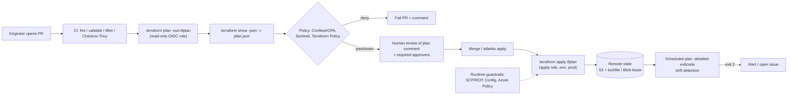
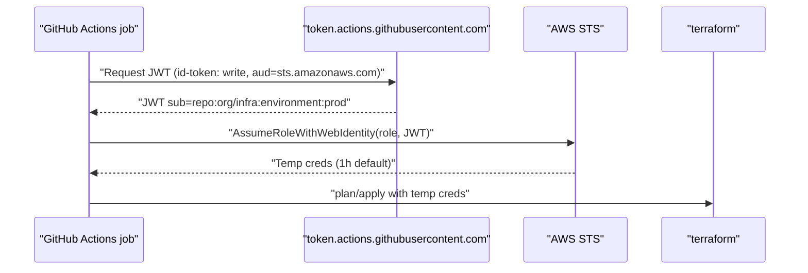

# N5 IaC Pipelines & Policy as Code
> Last verified: 2026-10 · Audience: senior/staff DevOps, SRE, AI eng, NetEng, DevSecOps, architects

## TL;DR
- **The core loop:** PR → `fmt`/`validate`/`tflint` → `plan -out` → **policy check on the plan JSON** → human review of the rendered plan → merge → **apply the exact saved plan** (not a fresh plan). Anything else lets the apply diverge from what was reviewed.
- **State is the blast-radius boundary.** Split state by env × component (network, data, app). Small states mean fast plans, narrow IAM, and contained mistakes. Lock every state. As of Terraform 1.10+, S3 has native locking (`use_lockfile`), and DynamoDB locking is **deprecated**.
- **Refactor declaratively, not with CLI surgery.** Use `moved` (1.1+), `import` blocks (1.5+, `for_each` 1.7+) and `removed` with `destroy = false` (1.7+). They are reviewable in a PR, unlike `terraform state mv/rm/import`.
- **Policy in two layers:** shift-left (Conftest/OPA, Sentinel, Checkov, Trivy, tflint on code and plan) plus **runtime guardrails** that also catch ClickOps (AWS SCP/RCP + Config, Azure Policy `deny`/`modify`/`deployIfNotExists`). Shift-left alone is bypassable.
- **No long-lived cloud keys in CI.** Use OIDC federation: GitHub → `token.actions.githubusercontent.com` → AWS `AssumeRoleWithWebIdentity` / Entra workload identity federation. Scope the trust to `repo:org/repo:environment:prod`. Use separate plan (read-only) and apply roles.
- **Secrets end up in state.** Treat state as sensitive: encrypt it, restrict access, version the bucket. Prefer **ephemeral resources and write-only `_wo` args** (TF 1.10/1.11+) or OpenTofu **state encryption** (1.7+).
- **Licensing history:** HashiCorp moved to BSL 1.1 on 2023-08-10, with Terraform 1.6+ under BSL. OpenTofu forked from 1.5.x under MPL-2.0 at the Linux Foundation. IBM completed its HashiCorp acquisition in 2025. As of 2026-10, Terraform is at 1.16 and OpenTofu at 1.13.
- **Landing zones:** AWS uses Control Tower + **AFT** (GitOps account vending, and explicitly *not* for app resources). Azure uses the **ALZ IaC accelerator** built on **Azure Verified Modules** (Bicep or Terraform). Azure Deployment Environments **retires 2027-02-22**.

## N5.1 IaC delivery workflow (PR → plan → policy → apply)
- **How it works:**
  - **Pre-commit/CI static stage:** `terraform fmt -check -recursive`, `terraform init -backend=false && terraform validate`, `tflint` (provider rule sets catch invalid instance types and deprecated args), and IaC security scanners (Checkov, Trivy `config`).
  - **Plan stage:** run `terraform plan -out=tfplan -lock-timeout=5m`, then `terraform show -json tfplan > plan.json` for policy engines. Post a plan summary as a PR comment.
  - **Policy stage:** evaluate `plan.json` (not just the HCL), because the plan has resolved values, module expansion and **the action set** (`create`/`update`/`delete`/`replace`). Deny replacing stateful resources, public buckets, `0.0.0.0/0` ingress, and missing tags.
  - **Approval:** use protected `environment` reviewers (GitHub), Atlantis `apply_requirements: [approved, mergeable, undiverged]`, or the HCP Terraform "confirm & apply" step.
  - **Apply:** `terraform apply tfplan`. A saved plan is **stale** if state changed since it was made, and Terraform refuses to apply it. Keep the plan artifact encrypted because it can hold sensitive values.
- **Trade-offs / when to use:**
  - **Apply-before-merge** (Atlantis default style): `main` is always what is deployed, but it needs PR locks to serialize work.
  - **Apply-after-merge** (CD on `main`): simpler, but a failed apply leaves `main` ahead of reality.
  - Per-PR plans across many root modules cost time and API rate limits. Use path filters (`autoplan.when_modified`, `dorny/paths-filter`) or dependency-aware orchestration (Terragrunt `run --all`, Spacelift stack dependencies, Terraform Stacks).
- **Interview angles:**
  - If asked "Why not just `apply -auto-approve` on merge?", say: the reviewed plan isn't what gets applied, state drift between the two runs can produce a different plan, and there's no destroy gate.
  - Pitfall: running plan with the **apply** role. Give the plan job a read-only role, because the PR author controls the code that plan executes (external data sources and providers run code).
  - Follow-up: "How do you stop destroys?" Use a policy on `resource_changes[].change.actions` containing `"delete"`, plus `lifecycle { prevent_destroy = true }` on critical resources. OpenTofu 1.12 makes `prevent_destroy` dynamic.
  - Cross-link: [N1 GitHub Actions](N1-github-actions.md), [N4 GitOps](N4-gitops-argocd-flux.md), [C5.13 Provisioning and configuration](../C-large-scale-architecture/C5-deployment.md#c513-provisioning-and-configuration).

## N5.2 State at scale: splitting, blast radius, locking
- **How it works:**
  - **S3 backend:** turn on `use_lockfile = true`, which writes a `<key>.tflock` object next to the state and needs `s3:GetObject/PutObject/DeleteObject` on it. The docs say `dynamodb_table` locking "is deprecated and will be removed in a future minor version". Both can run side by side during migration. Use `encrypt = true` and `kms_key_id`, **enable bucket versioning** for recovery, and note that `workspace_key_prefix` defaults to `env:`.
  - **azurerm backend:** uses Blob Storage native locking through a **blob lease**. The recommended auth is `use_oidc = true` + `use_azuread_auth = true` (Entra ID, not access keys). Grant **Storage Blob Data Contributor** on the container.
  - **HCP Terraform / TFE:** state is versioned per workspace, locking is built in, and `tfe_outputs` / remote state sharing is allow-listed.
- **Splitting strategy:**
  - Split by **environment × layer**: `org/` (accounts, SCPs), `network/` (VPC/VNet, TGW/vWAN), `data/` (RDS, KMS), `app/<svc>/`. Also split by **rate of change** and **ownership** (Conway).
  - Pass outputs between layers with `terraform_remote_state` (this needs read access to the *whole* upstream state, secrets included). Better options are SSM Parameter Store / App Configuration lookups, HCP `tfe_outputs`, or Terragrunt `dependency`.
  - Rough sizing signal: if plans take more than ~5 min or a state holds over ~1–2k resources, split it (heuristic). Terraform Stacks limits: 20 deployments, 100 components and 10,000 resources per Stack.
- **Trade-offs / when to use:** A monolithic state is easy to reason about but slow and dangerous. One `apply` can destroy everything, and the lock serializes all teams. Many states contain the blast radius, but you need cross-state dependency ordering and output plumbing.
- **Interview angles:**
  - "The lock is stuck": find the holder (lock ID in the error), confirm no run is active, then `terraform force-unlock <ID>`. Never put force-unlock in automation.
  - "State got corrupted or deleted": restore the previous S3 object version or blob snapshot. That's why versioning plus soft delete is non-negotiable.
  - **State migration:** change the backend block, then `terraform init -migrate-state`. To move resources *between* states, use `terraform state mv -state-out` (legacy). The modern way is `removed { destroy=false }` in the source plus an `import` block in the target, both reviewed in PRs.
  - Cross-link: [B5 partitioning analogy](../B-database-engineering/B5-database-partitioning.md), [L2 Encryption & keys](../L-data-privacy-ai-security/L2-encryption-key-management.md).

## N5.3 Refactoring state: import, moved, removed
- **How it works:**

| Block | Since | Purpose | Notes |
|---|---|---|---|
| `moved { from, to }` | TF 1.1 | Rename, `count`→`for_each`, move into or out of a module without destroy/recreate | Keep it in published modules so consumers on old versions upgrade cleanly. Cross-type moves need provider support (`move_state`) |
| `import { to, id \| identity, for_each, provider }` | TF 1.5 (`for_each` 1.7) | Adopt existing infra via plan/apply | `id` and `identity` are mutually exclusive. `terraform plan -generate-config-out=gen.tf` drafts the resource blocks |
| `removed { from; lifecycle { destroy = false } }` | TF 1.7 | Forget a resource without destroying it (hand it to another stack or tool) | Supports destroy-time provisioners only |

  - The CLI equivalents (`state mv`, `state rm`, `import`) mutate state immediately, with no plan and no review. Avoid them in team workflows.
- **Trade-offs / when to use:**
  - For bulk adoption of ClickOps estates, use `import` + `for_each` + `-generate-config-out`, then hand-clean the generated HCL. Alternatives are Terraformer, `aztfexport` (Azure), and the CloudFormation IaC generator.
  - Import IDs are provider-specific, and resource identity (newer providers) is preferred over opaque IDs. OpenTofu 1.12 added import-by-identity.
- **Interview angles:**
  - If asked how to rename a module without downtime, say: a `moved` block, then confirm the plan shows `0 to destroy`.
  - Pitfall: deleting `moved` blocks from a shared module too early, which breaks consumers who skip versions.

## N5.4 Module design & versioning
- **How it works:**
  - **Layers:** *resource modules* (one thin, opinionated resource), *pattern/composition modules* (VPC + endpoints + flow logs), and *root modules* (deployable units with backend and provider config). This mirrors AVM's resource / pattern / utility split.
  - **Interface:** typed `variable`s with `validation` blocks, `nullable = false`, `optional()` object attributes, and `precondition`/`postcondition` lifecycle checks. Expose minimal outputs.
  - **No provider blocks in child modules.** Pass providers in via `providers = {}` and declare them in `required_providers` with `configuration_aliases`. Commit `.terraform.lock.hcl` in **root** modules only.
  - **Versioning:** use SemVer git tags. Consume with `?ref=v1.4.2` (git) or `version = "~> 1.4"` (registry, pinned in root). Private registries include HCP Terraform, GitLab/Artifactory, and OCI registries (OpenTofu 1.10+).
- **Trade-offs / when to use:**
  - Wrapper modules around public modules (terraform-aws-modules, AVM) inject org defaults, but every upgrade becomes double work.
  - Monorepo modules are atomic to change but have no independent versions. A repo per module gives clean SemVer but more release overhead.
- **Interview angles:**
  - "Breaking change in a module?" Major version bump, `moved` blocks for renamed addresses, a changelog, and Renovate/Dependabot PRs to consumers.
  - Anti-pattern: "god modules" with 80 boolean toggles. Prefer composition.

## N5.5 Environment strategy: workspaces vs directories vs Terragrunt
| Approach | How | Good for | Pain |
|---|---|---|---|
| CLI **workspaces** | Same code, state key per workspace (`env:/<ws>/...`) | Ephemeral or identical copies (per-PR envs) | Same backend and credentials for all envs, so no prod isolation. Hidden current-ws state, easy to apply to the wrong one |
| **Directory per env** (`envs/prod/main.tf` calling modules) | Separate root module, backend and creds per env | Most orgs. Explicit diffs per env | Boilerplate. Envs drift unless module versions are promoted |
| **Terragrunt** | `terragrunt.hcl` per unit, DRY `remote_state`/`generate`, `dependency` blocks, `run --all` | Many accounts × regions × components | Extra tool and abstraction. Debugging generated code |
| **HCP Terraform workspaces / Stacks** | Workspace = state + vars + creds. Stacks = components × deployments | TFC/TFE shops | Vendor lock-in and cost model |

- **Interview angles:**
  - Note that HCP Terraform "workspaces" ≠ CLI workspaces. TFC workspaces are full isolation units.
  - Promotion: bump the module `version` in `envs/dev` → `staging` → `prod` through PRs. Don't branch-per-env, because long-lived env branches diverge.
  - Account/subscription per env is the real isolation boundary. Pair it with OIDC roles per env (N5.13).

## N5.6 Orchestration: Atlantis, HCP Terraform, Spacelift/env0
- **Atlantis (OSS, self-hosted):**
  - Driven by PR comments (`atlantis plan`/`apply`). It locks **directory + workspace per PR** until merge or close. This is separate from, and above, Terraform state locking. If the lock backend is unreachable it **fails closed** on apply.
  - `atlantis.yaml` `version: 3` sets `projects[].dir/workspace/autoplan.when_modified` (default includes `**/*.tf*`, `**/*.tofu`, `terragrunt.hcl`, `.terraform.lock.hcl`), `apply_requirements` (`approved`, `mergeable`, `undiverged`), `parallel_plan/apply`, `execution_order_group`, and a Conftest `policy_check`.
  - Security: whoever can open a PR can run code on the Atlantis server, which holds the creds. Restrict custom workflows server-side (`allowed_overrides`), and use per-project IAM roles.
- **HCP Terraform / Terraform Enterprise:**
  - Run lifecycle: plan → cost estimate → **policy check** → (run tasks) → apply.
  - Supported policy frameworks are **Sentinel**, **OPA**, and the new **Terraform Policy** (HCL-native, **beta**, also covers Stacks).
  - Health assessments (drift and continuous validation) need the Standard/Premium editions.
  - **Stacks** are GA: components (modules) × deployments (envs/regions), with deferred changes for unknown-at-plan values.
- **Spacelift / env0 / Scalr / Terramate:**
  - Commercial TACOS (Terraform Automation & COllaboration Software). They support multiple IaC tools (TF, OpenTofu, Pulumi, CloudFormation, Ansible), offer OPA-based policies at several decision points (plan, approval, trigger, login), handle stack dependencies, and provide drift detection, self-hosted workers and cost/TTL features (env0).
- **Trade-offs:**
  - Atlantis is cheap and simple but single-node and DIY on HA, RBAC and audit.
  - HCP Terraform is deeply integrated, with per-resource-under-management (RUM) pricing.
  - Spacelift/env0 are tool-agnostic and support OpenTofu first-class.
- **Interview angles:** "How would you run Terraform for 300 engineers?" Answer with an orchestrator, state per team/component, policy sets at org level, a private module registry, OIDC dynamic creds, drift schedules, and audit logs to the SIEM.

## N5.7 OpenTofu and the licence history
- **How it works:**
  - **2023-08-10:** HashiCorp relicensed from MPL-2.0 to **BSL 1.1**. Terraform **1.6+** is under BSL, which restricts "competitive offerings", and each version converts to MPL after 4 years.
  - **OpenTofu** was forked from 1.5.x by Gruntwork, Spacelift, Harness, env0, Scalr and others. It's MPL-2.0, under the Linux Foundation, and accepted into the CNCF (sandbox, 2025, unverified).
  - IBM completed its HashiCorp acquisition in Feb 2025 (unverified date).
  - The OpenTofu registry mirrors the same providers, and state is compatible up to TF 1.5.x. The two have diverged since.
  - **OpenTofu-only features:**
    - **State and plan encryption** (1.7): AES-GCM with PBKDF2, AWS KMS, GCP KMS, Azure Key Vault, OpenBao or external key providers, plus a `fallback` for migration.
    - Early variable evaluation in backend and module sources (1.8).
    - Provider `for_each` and `-exclude` (1.9).
    - OCI registry distribution (1.10).
    - Ephemeral values and `enabled` meta-argument-style conditional resources (1.11).
    - Dynamic `prevent_destroy` and import by identity (1.12).
    - 1.13 was released 2026-09-29.
- **Trade-offs:**
  - Choose OpenTofu for licence neutrality, native state encryption and vendor-neutral governance.
  - Choose Terraform for HCP integration (Stacks, Sentinel, Terraform Policy) and day-one provider features.
  - Features differ. For example, Terraform's `.tfcomponent.hcl` Stacks has no OpenTofu equivalent, and OpenTofu `.tofu` files override `.tf`.
- **Interview angles:** If asked "Does BSL stop us using Terraform internally?", say: generally no. The restriction targets offering a competing hosted or embedded product. Legal should review vendors that embed it.

## N5.8 Policy as code in the pipeline
- **How it works:**
  - **OPA / Rego + Conftest:**
    - `conftest test plan.json` evaluates rules named `deny`, `violation` and `warn` in the `main` namespace from `./policy` by default.
    - `conftest verify` runs `*_test.rego` unit tests.
    - Parsers cover HCL2, JSON, YAML, Dockerfile and more.
    - Modern Rego (OPA 1.0+) requires the `if`/`contains` keywords (v1 syntax).
  - **Sentinel:** HashiCorp proprietary, used in HCP Terraform/TFE. It reads the `tfplan/v2`, `tfconfig/v2`, `tfstate/v2` and `tfrun` imports. Enforcement levels are **advisory / soft-mandatory (overridable) / hard-mandatory**. OPA in HCP has **advisory / mandatory**.
  - **Scanners (misconfiguration):**
    - **Checkov** (Prisma Cloud): 1000+ built-in checks across TF, plan JSON, CFN, Bicep/ARM, K8s and Helm.
    - **Trivy** `trivy config`: **tfsec is now part of Trivy**, and tfsec gets no active development.
    - **KICS**.
  - **tflint:** lint and provider correctness (invalid AMI/instance types, naming, unused declarations), not security.
- **Trade-offs / when to use:**
  - Scanners give broad off-the-shelf coverage, but you get noise and have to suppress it (`#checkov:skip=` with a justification).
  - Rego and Sentinel handle org-specific rules (tag schema, allowed regions, cost limits, "no replace of RDS").
  - Policy on **HCL** misses computed values. Policy on **plan JSON** sees the real diff.
- **Interview angles:**
  - Version policies as code, unit-test them, and roll new rules out **advisory first**, then **mandatory**.
  - Same engine everywhere: OPA covers Terraform (Conftest), K8s admission (Gatekeeper) and API authz. That's one language and one team. See [L6 Secrets & supply chain](../L-data-privacy-ai-security/L6-secrets-supply-chain.md) and [P1 Wiz CNAPP](../P-security-platforms-identity/P1-wiz-cnapp.md).

## N5.9 Runtime guardrails: SCP/RCP/Config vs Azure Policy
- **AWS:**
  - **SCPs** cap the max permissions of IAM principals in **member** accounts and never grant anything. They don't apply to the **management account** or to **service-linked roles**, but they *do* apply to the member root user. Effective perms = SCP ∩ RCP ∩ identity/resource policies (∩ permission boundary). Test them on an OU before attaching to root.
  - **RCPs** (resource control policies) cap what *resources* allow, e.g. a data perimeter that stops external principals.
  - **AWS Config** rules plus conformance packs are **detective**, with SSM Automation remediation.
  - **Control Tower controls** come in three kinds: preventive (SCP/RCP), detective (Config) and proactive (CloudFormation hooks).
- **Azure Policy:**
  - Assigned at management group, subscription or RG, and inherited. The result is the "cumulative most restrictive" outcome.
  - Effects: `disabled`, `append`/`modify`, `deny`, `audit`, `manual`, `auditIfNotExists`, `denyAction`, `deployIfNotExists`, `addToNetworkGroup`, `mutate`.
  - Evaluation order: disabled → append/modify → deny → audit → manual → AINE → denyAction, then AINE/DINE after the RP succeeds.
  - **Remediation tasks** fix existing resources for `modify`/DINE using a managed identity. Initiatives (policy sets) bundle definitions.
- **Key differences:** Azure Policy evaluates **resource properties** at ARM request time and can mutate or deploy. SCPs evaluate **API actions/conditions** (IAM-style) and can't inspect most resource properties beyond condition keys. On AWS, property-level prevention needs proactive controls or CFN Guard hooks.
- **Interview angles:** "Shift-left vs runtime?" You need both. A pipeline check is advisory against a console user, and runtime deny catches everything but gives late, opaque failures. Mirror the same rule in both places (e.g. allowed regions).

## N5.10 Drift detection
- **How it works:**
  - Scheduled `terraform plan -detailed-exitcode` (exit **0** = no changes, **1** = error, **2** = changes present). Alternatively, `plan -refresh-only` shows drift without proposing config changes.
  - HCP Terraform **health assessments** add drift detection plus continuous validation (`check` blocks, pre/postconditions). This needs Standard/Premium and TF ≥1.3 for both.
  - Atlantis and Spacelift have scheduled drift runs. Cloud-native signals: the AWS Config timeline, CloudFormation drift detection, and the Azure Activity Log / Resource Graph change analysis.
- **Trade-offs:**
  - Auto-remediate (re-apply) only for low-risk stacks, because blind re-apply can revert an emergency hotfix.
  - Otherwise alert, open an issue, and decide whether to codify or revert.
  - `ignore_changes` is for fields owned by other controllers (ASG desired count, tags set by policy). Use it sparingly.
- **Interview angles:** If asked about the root cause of drift, say: break-glass console access, other controllers (autoscalers, Azure Policy `modify`), and provider default changes. Fix the process (read-only console in prod) as well as the drift.

## N5.11 Secrets in IaC
- **How it works:**
  - Anything a resource reads or returns (DB passwords, generated keys, `random_password`) lands in **state and plan in plaintext**. `sensitive = true` only redacts CLI output.
  - **Terraform 1.10+:** **ephemeral resources** (e.g. fetch a secret from Secrets Manager or Key Vault for this run only) and ephemeral variables/outputs are never persisted.
  - **Terraform 1.11+:** **write-only arguments** (`password_wo` + `password_wo_version` on `aws_db_instance`) go to the provider and are never stored.
  - **OpenTofu:** client-side state encryption (N5.7).
  - Better still, avoid the secret entirely. Use RDS `manage_master_user_password = true` (Secrets Manager-managed) or Azure SQL with Entra-only auth, and managed identities.
- **Interview angles:**
  - Controls: lock down the state bucket (KMS key policy, separate state for secret-bearing components, no `terraform_remote_state` consumers of it), enable secret scanning (gitleaks, GitHub push protection) on `*.tfvars`, and never commit `terraform.tfvars` holding secrets. Cross-link [L6](../L-data-privacy-ai-security/L6-secrets-supply-chain.md).

## N5.12 Testing IaC
- **How it works:**
  - **`terraform test`** (TF 1.6+) runs `*.tftest.hcl`/`.tftest.json` files containing `run` blocks.
    - `command = plan` gives unit-style tests. `command = apply` (the default) creates real infra and then **destroys it in reverse run order**.
    - It supports `assert { condition, error_message }`, `expect_failures` (test that validations reject bad input), root/run `variables`, `module {}` to load helper modules (setup, `http` checks), and `state_key` to share state across runs.
    - **Mock providers / `override_resource`** (TF 1.7+) give fast, credential-free unit tests.
  - **Terratest** (Go library by Gruntwork): deploys real infra, asserts via SDK/HTTP, then `defer terraform.Destroy`. Good for end-to-end checks ("is the ALB serving 200?").
  - **Pyramid:** static (fmt, validate, tflint, scanners) → plan-level tests and policy unit tests (`conftest verify`) → mocked `terraform test` → real-apply tests in a sandbox account on a nightly/merge schedule → post-deploy `check` blocks.
- **Trade-offs:** Real-apply tests are slow and cost money, and they can leak resources on failure. Run them in a nuked sandbox account (aws-nuke / scheduled cleanup) with a TTL tag.
- **Interview angles:** "How do you test a module?" Example-based integration tests per `examples/` dir, mocked unit tests on variable validation, and SemVer releases gated on green tests.

## N5.13 Pipeline credentials via OIDC
- **How it works:**
  - **GitHub → AWS:**
    - Create an IAM OIDC provider `https://token.actions.githubusercontent.com` with audience `sts.amazonaws.com`. The workflow needs `permissions: id-token: write`.
    - Trust policy `StringEquals`/`StringLike` on `token.actions.githubusercontent.com:sub`, e.g. `repo:org/infra:environment:prod` or `repo:org/infra:ref:refs/heads/main`. Avoid `repo:org/*`.
    - `aws-actions/configure-aws-credentials` calls `AssumeRoleWithWebIdentity`.
  - **GitHub/Azure DevOps → Azure:**
    - An Entra app or **user-assigned managed identity** with **federated credentials** (issuer, subject, audience `api://AzureADTokenExchange`).
    - `azure/login` with `client-id`/`tenant-id`/`subscription-id` and no secret. On the Terraform side, set `ARM_USE_OIDC=true`.
  - **HCP Terraform dynamic provider credentials** use the same mechanism, with the workspace as the OIDC subject.
- **Trade-offs:** OIDC removes secret rotation and leakage risk, but the trust-policy `sub` condition is now your security boundary. Misconfigured wildcards let any repo or branch assume prod.
- **Interview angles:** Split roles. The **plan role** is read-only plus state read/lock and is usable from PRs. The **apply role** is reachable only from the `environment: prod` subject with required reviewers. Cross-link [L7 Workload identity](../L-data-privacy-ai-security/L7-zero-trust-workload-identity.md), [P4 Identity providers](../P-security-platforms-identity/P4-identity-providers.md).

## N5.14 Alternatives: Pulumi, CDK, CloudFormation, Bicep/ARM
| Tool | Model | State | Notes |
|---|---|---|---|
| **CloudFormation** | Declarative JSON/YAML, AWS-managed | Service-side (stacks) | Change sets = plan. StackSets for multi-account/region. Drift detection. Hooks/Guard for proactive policy. IaC generator for import |
| **AWS CDK** | TS/Python/Java/Go/.NET → synthesizes CFN | CFN | L1/L2/L3 constructs. `cdk diff`. CDK Pipelines. Inherits CFN limits (500 resources per stack) |
| **Bicep** | DSL transpiling to **ARM JSON** | **No state file**. ARM is the source of truth | `what-if` = plan. **Deployment stacks** add managed-resource tracking and deny settings. Template specs for sharing. AVM Bicep modules in public registry |
| **Pulumi** | General-purpose languages (TS, Python, Go, .NET, Java, YAML) | Pulumi Cloud or a self-managed backend (S3/Blob) | `pulumi preview`. CrossGuard policy packs. Can use TF providers via bridge. Real loops/testing in-language |
| **CDKTF** | CDK-style → Terraform JSON | TF state | HashiCorp **deprecated CDKTF** (archived 2025, unverified) |

- **Interview angles:**
  - Choose HCL/Terraform or OpenTofu for multi-cloud and SaaS providers (Datadog, Cloudflare, GitHub).
  - Choose native tools (Bicep/CFN) for day-zero service support and no state to secure.
  - Choose Pulumi/CDK when app teams want real languages, though "too much power" yields unreviewable infra.
  - Pitfall: Bicep has no state, so deleting a resource from the template **doesn't delete it** in incremental mode. Use deployment stacks (`actionOnUnmanage`) or complete mode.

## N5.15 Landing zones & account/subscription vending
- **AWS Control Tower + AFT:**
  - Control Tower builds the landing zone: Organizations OUs (Security, Sandbox), log archive and audit accounts, IAM Identity Center, and controls (N5.9).
  - **Account Factory for Terraform (AFT)** runs a GitOps pipeline in a dedicated **AFT management account**, which is *not* the CT management account. It uses CodePipeline/CodeBuild and Step Functions.
  - AFT repos: account requests, global customizations, account customizations and provisioning customizations.
  - It supports Terraform Community, HCP Terraform and Enterprise, with VCS through CodeCommit or CodeConnections (GitHub/GitLab/Bitbucket).
  - Feature options: org CloudTrail data events, delete default VPC, Enterprise Support enrolment.
  - AFT is "**not intended** for deploying resources such as EC2 instances that your accounts require to run your applications". App infra goes in workload pipelines.
  - Alternatives: Customizations for Control Tower (CfCT, CloudFormation-based), Landing Zone Accelerator (LZA), or plain Organizations + Terraform.
- **Azure Landing Zones (ALZ):**
  - CAF management-group hierarchy: Root → Platform (Identity, Management, Connectivity) and Landing Zones (Corp, Online), Sandbox, Decommissioned. Heavy use of Azure Policy initiatives.
  - Recommended: the **ALZ IaC Accelerator** built on **Azure Verified Modules** for **Bicep or Terraform**. It has 4 phases (plan, prerequisites, bootstrap via PowerShell, run) and bootstraps GitHub or Azure DevOps pipelines with OIDC.
  - The portal accelerator is for teams without IaC skills.
  - The legacy `caf-enterprise-scale` TF module is superseded by the AVM-based ALZ modules (unverified exact deprecation date).
  - **Subscription vending:** an AVM pattern module creates subscriptions, places them in a management group, and sets up networking peering/vWAN and RBAC.
- **Interview angles:** Account/subscription = blast radius + billing + quota boundary. Vend through PRs, with guardrails inherited from OU/MG. Keep platform pipelines (org, network) separate from app pipelines.

## Diagrams




## Cloud mapping: AWS vs Azure
| Capability | AWS | Azure | Role it plays | Key differences | Alternatives |
|---|---|---|---|---|---|
| Terraform remote state | S3 backend (`use_lockfile`, KMS, versioning) | azurerm backend (Blob, lease lock, Entra auth) | Shared state + locking | S3 lock is a `.tflock` object (DynamoDB deprecated). Azure uses blob lease. Both need versioning/soft delete | HCP Terraform, Spacelift, Pulumi Cloud, GCS backend |
| Landing zone | Control Tower + AFT (or LZA, CfCT) | ALZ accelerator + AVM (Bicep/TF) | Multi-account/subscription baseline + vending | CT is a managed service with drift on its own controls. ALZ is reference IaC you own | Terraform org modules, Gruntwork |
| Preventive guardrail | SCP / RCP (Organizations) | Azure Policy `deny`/`denyAction` at MG/sub | Org-wide max permissions / allowed configs | SCP = action-level, no mgmt account. Azure Policy = resource-property level, can `modify`/DINE | OPA Gatekeeper (K8s), Sentinel |
| Detective + remediation | AWS Config rules, conformance packs, SSM Automation | Azure Policy `audit`/AINE + remediation tasks, Defender for Cloud | Compliance posture | Config is a separate paid recorder. Policy compliance is built in | Wiz, Prisma, Checkov runtime |
| Native IaC | CloudFormation / CDK | ARM / Bicep (+ deployment stacks) | First-party declarative deploy | CFN keeps stack state. ARM is stateless and incremental by default | Terraform, OpenTofu, Pulumi |
| Plan/preview | CFN change sets, `cdk diff` | `az deployment what-if` | Pre-apply diff | what-if can be noisy (false diffs) | `terraform plan` |
| Self-service templates | Service Catalog (+ Terraform products) | Azure Deployment Environments (**retires 2027-02-22**), template specs | Golden-path infra for devs | ADE retiring. Template specs stay for sharing ARM/Bicep | Backstage + TF, Port, Humanitec ([N6](N6-internal-developer-platforms.md)) |
| Pipeline identity | IAM OIDC provider + role trust (`sub` claim) | Entra workload identity federation (app reg/UAMI) | Secretless CI creds | AWS trusts per role. Azure: up to 20 federated creds per identity (unverified) | HCP dynamic credentials, Vault |
| Multi-account deploy | CFN StackSets | Deployment at MG scope / Azure Lighthouse | Fan-out baselines | StackSets service-managed via Organizations | Terragrunt `run --all`, Stacks |

- **S3 vs azurerm backend:** both are regional storage. Turn on versioning or blob soft delete plus point-in-time restore, and use CMK encryption (KMS / Key Vault). Authenticate the pipeline with OIDC, not access keys or SAS.
- **Control Tower vs ALZ:**
  - CT is an AWS-operated service. Landing-zone version upgrades are a button, and CT detects drift in its own SCPs and OUs.
  - ALZ is Microsoft-maintained IaC that *you* run and upgrade (AVM module versions).
  - AFT corresponds to the ALZ subscription-vending module.
- **SCP vs Azure Policy:** SCPs can't stop the management account or service-linked roles. Azure Policy exemptions are explicit objects with expiry. Azure Policy can *fix* things (`modify`, DINE). SCPs only deny.
- **CloudFormation/CDK vs Bicep/ARM:** CFN rolls back the stack on failure. ARM has no automatic rollback beyond the `--rollback-on-error` to last successful deployment.
- **Service Catalog vs ADE/template specs:** Service Catalog supports Terraform products (external/HCP engine). ADE supported ARM/Bicep/Terraform via extensibility but is retiring, so plan for Backstage/Port-based IDPs or template specs + pipelines.

## Hands-on (optional)
**GitHub Actions: plan on PR, apply the exact plan on main with OIDC**
```yaml
name: terraform
on:
  pull_request: { paths: ["envs/prod/**", "modules/**"] }
  push: { branches: [main], paths: ["envs/prod/**", "modules/**"] }
permissions: { id-token: write, contents: read, pull-requests: write }
concurrency: { group: tf-prod, cancel-in-progress: false }
defaults: { run: { working-directory: envs/prod } }
jobs:
  plan:
    runs-on: ubuntu-latest
    steps:
      - uses: actions/checkout@v4
      - uses: hashicorp/setup-terraform@v3
        with: { terraform_version: "1.16.x" }   # check current version
      - uses: aws-actions/configure-aws-credentials@v4
        with:
          role-to-assume: arn:aws:iam::111111111111:role/tf-plan-readonly
          aws-region: eu-west-1
      - run: terraform fmt -check -recursive
      - run: terraform init -input=false
      - run: terraform validate
      - run: terraform plan -input=false -lock-timeout=5m -out=tfplan
      - run: terraform show -json tfplan > plan.json
      - run: conftest test plan.json --policy ../../policy
      - uses: actions/upload-artifact@v4
        with: { name: tfplan, path: envs/prod/tfplan, retention-days: 5 }
  apply:
    if: github.event_name == 'push'
    needs: plan
    runs-on: ubuntu-latest
    environment: prod            # required reviewers; OIDC sub = repo:org/infra:environment:prod
    steps:
      - uses: actions/checkout@v4
      - uses: hashicorp/setup-terraform@v3
        with: { terraform_version: "1.16.x" }
      - uses: aws-actions/configure-aws-credentials@v4
        with:
          role-to-assume: arn:aws:iam::111111111111:role/tf-apply-prod
          aws-region: eu-west-1
      - uses: actions/download-artifact@v4
        with: { name: tfplan, path: envs/prod }
      - run: terraform init -input=false
      - run: terraform apply -input=false tfplan   # fails if state changed since plan
```

**Backend (S3 native locking)**
```hcl
terraform {
  required_version = ">= 1.10"
  backend "s3" {
    bucket       = "acme-tfstate-prod"
    key          = "network/eu-west-1/terraform.tfstate"
    region       = "eu-west-1"
    encrypt      = true
    kms_key_id   = "alias/tfstate"
    use_lockfile = true   # replaces deprecated dynamodb_table
  }
}
```

**Module + test**
```hcl
# modules/bucket/main.tf
variable "name" {
  type = string
  validation {
    condition     = can(regex("^acme-[a-z0-9-]{3,40}$", var.name))
    error_message = "Bucket name must start with acme- and be lowercase."
  }
}
variable "tags" {
  type = map(string)
  validation {
    condition     = contains(keys(var.tags), "owner")
    error_message = "tags.owner is required."
  }
}
resource "aws_s3_bucket" "this" {
  bucket = var.name
  tags   = var.tags
}
resource "aws_s3_bucket_public_access_block" "this" {
  bucket                  = aws_s3_bucket.this.id
  block_public_acls       = true
  block_public_policy     = true
  ignore_public_acls      = true
  restrict_public_buckets = true
}
output "arn" { value = aws_s3_bucket.this.arn }

# refactor without destroy
moved {
  from = aws_s3_bucket.bucket
  to   = aws_s3_bucket.this
}
```

```hcl
# modules/bucket/tests/bucket.tftest.hcl
mock_provider "aws" {}

variables {
  name = "acme-logs-dev"
  tags = { owner = "platform" }
}

run "valid_bucket_plans" {
  command = plan
  assert {
    condition     = aws_s3_bucket.this.bucket == "acme-logs-dev"
    error_message = "Bucket name not passed through."
  }
  assert {
    condition     = aws_s3_bucket_public_access_block.this.block_public_policy
    error_message = "Public policy must be blocked."
  }
}

run "rejects_bad_name" {
  command = plan
  variables { name = "Logs_Bucket" }
  expect_failures = [var.name]
}

run "requires_owner_tag" {
  command = plan
  variables { tags = { team = "x" } }
  expect_failures = [var.tags]
}
```

**Rego policy on plan JSON (Conftest, Rego v1 syntax)**
```rego
package main

import rego.v1

protected_types := {"aws_db_instance", "aws_rds_cluster", "aws_s3_bucket"}

deny contains msg if {
  rc := input.resource_changes[_]
  rc.type in protected_types
  "delete" in rc.change.actions
  msg := sprintf("%s would be deleted/replaced - needs break-glass approval", [rc.address])
}

deny contains msg if {
  rc := input.resource_changes[_]
  rc.type == "aws_security_group_rule"
  rc.change.after.type == "ingress"
  "0.0.0.0/0" in rc.change.after.cidr_blocks
  msg := sprintf("%s opens ingress to 0.0.0.0/0", [rc.address])
}

warn contains msg if {
  rc := input.resource_changes[_]
  rc.change.actions[_] == "create"
  not rc.change.after.tags.owner
  msg := sprintf("%s missing owner tag", [rc.address])
}
```
(Rego isn't on the allowed-language list. It's included because the spec explicitly asks for a small Rego snippet, and it's policy config, not a program.)

**bash: local gate**
```bash
set -euo pipefail
terraform fmt -check -recursive
tflint --init && tflint --recursive
trivy config --severity HIGH,CRITICAL --exit-code 1 .
terraform test                      # runs tests/*.tftest.hcl (mocked => no creds)
terraform plan -out=tfplan -detailed-exitcode || rc=$?; echo "plan exit=${rc:-0}"  # 2 = changes
terraform show -json tfplan > plan.json
conftest verify --policy policy/    # unit-test the policies themselves
conftest test plan.json --policy policy/ --output github
```

## Cross-links
- [C5.13 Provisioning and configuration](../C-large-scale-architecture/C5-deployment.md#c513-provisioning-and-configuration): state/backend basics
- [N1 GitHub Actions](N1-github-actions.md) · [N2 GitLab CI & Jenkins](N2-gitlab-ci-jenkins.md) · [N3 Azure DevOps & CodePipeline](N3-azure-devops-aws-codepipeline.md) · [N4 GitOps](N4-gitops-argocd-flux.md) · [N6 IDPs](N6-internal-developer-platforms.md)
- [L6 Secrets & supply chain](../L-data-privacy-ai-security/L6-secrets-supply-chain.md) · [L7 Workload identity](../L-data-privacy-ai-security/L7-zero-trust-workload-identity.md) · [L3 Residency & compliance](../L-data-privacy-ai-security/L3-residency-compliance.md)
- [G8 Transit hub](../G-cloud-network-architecture/G8-transit-hub.md) (connectivity subscription/account in landing zones) · [P3 SOC2/ISO operations](../P-security-platforms-identity/P3-soc2-iso-compliance-operations.md)

## Sources
- https://developer.hashicorp.com/terraform/language/backend/s3
- https://developer.hashicorp.com/terraform/language/backend/azurerm
- https://developer.hashicorp.com/terraform/language/tests
- https://developer.hashicorp.com/terraform/language/block/import
- https://developer.hashicorp.com/terraform/language/block/moved
- https://developer.hashicorp.com/terraform/language/block/removed
- https://developer.hashicorp.com/terraform/language/manage-sensitive-data/ephemeral
- https://developer.hashicorp.com/terraform/cloud-docs/policy-enforcement
- https://developer.hashicorp.com/terraform/cloud-docs/workspaces/health
- https://developer.hashicorp.com/terraform/cloud-docs/stacks
- https://www.hashicorp.com/en/license-faq
- https://opentofu.org/faq/
- https://opentofu.org/blog/
- https://opentofu.org/docs/language/state/encryption/
- https://www.runatlantis.io/docs/locking
- https://www.runatlantis.io/docs/repo-level-atlantis-yaml
- https://www.conftest.dev/
- https://github.com/aquasecurity/tfsec
- https://docs.github.com/en/actions/how-tos/secure-your-work/security-harden-deployments/oidc-in-aws
- https://docs.aws.amazon.com/organizations/latest/userguide/orgs_manage_policies_scps.html
- https://docs.aws.amazon.com/controltower/latest/userguide/aft-overview.html
- https://learn.microsoft.com/en-us/azure/governance/policy/concepts/effect-basics
- https://learn.microsoft.com/en-us/azure/cloud-adoption-framework/ready/landing-zone/implementation-options
- https://learn.microsoft.com/en-us/azure/deployment-environments/overview-what-is-azure-deployment-environments
- https://azure.github.io/Azure-Verified-Modules/
