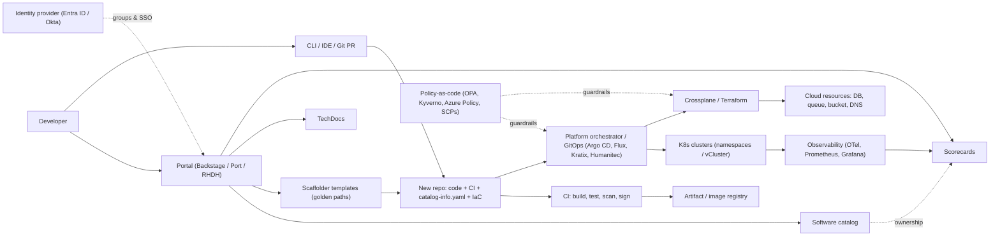

# N6 Internal Developer Platforms (Platform Engineering, Backstage, Golden Paths)
> Last verified: 2026-10 · Audience: senior/staff DevOps, SRE, AI eng, NetEng, DevSecOps, architects

> "IDP" in this file means **Internal Developer Platform**. Identity providers are covered in [P4 Identity providers](../P-security-platforms-identity/P4-identity-providers.md). Toil/release-engineering basics are in [J6](../J-sre/J6-toil-release-engineering.md); this file goes deeper on platform engineering.

## TL;DR
- **Platform** (CNCF): "an integrated collection of capabilities defined and presented according to the needs of the platform's users". **Platform engineering** = building and running that as an **internal product** whose job is to **reduce cognitive load** for stream-aligned teams via **self-service** + **golden paths**, secure by default.
- **Portal ≠ platform.** Backstage/Port/RHDH are the *front door* (catalog, templates, docs, scorecards); the platform is the APIs, IaC modules, pipelines, clusters and policies behind it. Building a portal with no self-service backend is the #1 failure mode.
- **Backstage** (CNCF, Spotify origin) = framework, not a product: software catalog (`catalog-info.yaml`), Scaffolder (software templates), TechDocs (docs-like-code via MkDocs), plugins on the **new backend system** (plugins/modules/services/extension points). Expect a dedicated team (typically several engineers) to run it; RHDH, Roadie, Port, Cortex, OpsLevel trade flexibility for lower ops burden.
- **Platform APIs**: Crossplane v2 (namespaced XRs, function-pipeline compositions, claims gone in v2-style XRs), Kratix Promises, Humanitec Orchestrator + **Score** workload spec, or plain Terraform modules behind a PR/GitOps flow.
- **Golden path = paved road with guardrails**, opt-out allowed but at the team's own cost; enforce the non-negotiables with **policy-as-code**, not with the template.
- **Measure** adoption + satisfaction (NPS/survey), time-to-first-deploy / onboarding time, request-to-fulfilment latency, and **DORA** outcomes; use **SPACE/DevEx** to avoid vanity activity metrics. CNCF maturity model: Investment, Adoption, Interfaces, Operations, Measurement × Provisional → Operationalized → Scalable → Optimizing.
- **Cloud-native IDP services are being retired (2026 gotcha):** **AWS Proton** end of support **7 Oct 2026** (no new customers since 7 Oct 2025); **Azure Deployment Environments** retires **22 Feb 2027**; **Microsoft Dev Box** retires **18 Sep 2028** (closing-down period from 14 Sep 2026, Windows 365 is the recommended path). AWS Service Catalog, CloudFormation Git sync, Bicep/AVM, azd and GitHub/ADO pipelines remain.
- **Multi-tenancy** for a shared K8s platform: namespace-per-team + RBAC + ResourceQuota/LimitRange + NetworkPolicy + PSA (soft); **Capsule** to group namespaces into tenants; **vCluster** for per-tenant control planes; cluster-per-tenant for hard isolation.

## N6.1 Platform engineering and the IDP: definitions
- **How it works:**
  - CNCF Platforms white paper: platform = integrated collection of capabilities presented per user needs; a **cross-cutting layer** that gives consistent experience to acquire and integrate services.
  - **Platform engineering** = curating foundational capabilities, frameworks and experiences for internal customers (app devs, data scientists, ML engineers) — "explicit cross-functional DevOps cooperation".
  - CNCF **7 attributes**: product approach, user experience (GUI/API/CLI/portal), documentation & onboarding (golden paths/templates), **self-service**, **reduced cognitive load**, **optional & composable**, **secure by default**.
  - CNCF **capability domains** (13): web portals; APIs/CLIs; golden-path templates & docs; build/test automation; delivery/verification automation; dev & exploratory environments; observability; infrastructure services; data services; messaging/event services; identity & secrets; security services; artifact storage.
  - Platform team typically owns **interfaces** (portal, APIs, CLI, docs) and integration; underlying **capability providers** (DB team, network team, cloud vendor) own implementations.
  - Vocabulary: **IDP** (internal developer *platform*, the whole thing) vs **internal developer portal** (the UI) vs **platform orchestrator** (backend that resolves workload intent into infra, e.g. Humanitec, Kratix).
- **Trade-offs / when to use:**
  - Worth it when many stream-aligned teams repeat the same infra/CI/compliance work; below ~5–10 teams a well-documented set of Terraform modules + reusable CI workflows is often the **thinnest viable platform** (Team Topologies term).
  - Centralisation risk: a platform team can become a ticket queue / new ops silo if it doesn't ship self-service.
- **Interview angles:**
  - "DevOps vs SRE vs platform engineering?" → DevOps = culture/practices; SRE = reliability discipline with SLOs/error budgets ([J1](../J-sre/J1-slis-slos-error-budgets.md)); platform engineering = productised self-service so DevOps scales without every team being an infra expert ("you build it, you run it" without "you build the whole stack").
  - Pitfall: equating "we installed Backstage" with "we have a platform".

## N6.2 CNCF Platform Engineering Maturity Model
- **How it works:** 5 aspects × 4 levels (Provisional → Operationalized → Scalable → Optimizing).

| Aspect | Provisional | Operationalized | Scalable | Optimizing |
|---|---|---|---|---|
| **Investment** | Voluntary/temporary, no central funding | Dedicated team, cost centre | Funded like a product on delivered value | Ecosystem; specialists extend capabilities |
| **Adoption** | Sporadic, uncoordinated | Mandates/incentives drive it | Users self-select on value | Users contribute back |
| **Interfaces** | Custom, manual processes | Standard tooling + documented golden paths | Self-service, minimal maintainer help | Transparently integrated into existing workflows |
| **Operations** | Reactive, by request | Centrally documented lifecycle | Centrally orchestrated, standard creation | Lifecycle automated, continuous delivery |
| **Measurement** | Informal/inconsistent | Structured feedback channels | Data strategically collected for insight | Quantitative + qualitative embedded in culture |

- **Trade-offs / when to use:** use it as a **gap analysis** and roadmap tool, not a scorecard to "reach Optimizing everywhere" — levels are not strictly sequential per aspect and higher levels cost more.
- **Interview angles:**
  - "Adoption is low, leadership wants to mandate it" → mandates = Operationalized; aim for Scalable (value-driven self-selection). Mandate only non-negotiables (security baseline) via policy; win the rest on DX.
  - Mention the white paper's **success metrics** triad: user satisfaction, organisational efficiency, business impact (DORA).

## N6.3 Platform as a product
- **How it works:**
  - **Users** = internal devs; run discovery (interviews, shadowing, friction logs), personas, **product manager** on the platform team, public **roadmap**, changelog, deprecation policy, SLOs for platform services.
  - **Team Topologies**: 4 team types — **stream-aligned**, **platform**, **enabling**, **complicated-subsystem**; 3 interaction modes — **collaboration** (discovery phase), **X-as-a-Service** (steady state), **facilitating** (enabling team coaching). Goal: platform consumed **X-as-a-Service** to cut stream-aligned teams' **cognitive load** (intrinsic / extraneous / germane — platform removes extraneous).
  - **Thinnest Viable Platform (TVP)**: start with a wiki + templates + a pipeline, grow only where demand is proven.
  - **DevEx metrics**: **SPACE** (Satisfaction & well-being, Performance, Activity, Communication & collaboration, Efficiency & flow — use ≥3 dimensions, mix perceptual + system data); **DevEx framework** (feedback loops, cognitive load, flow state); **DORA** (deployment frequency, lead time for changes, change failure rate, failed-deployment recovery time; DORA has also reported rework rate).
  - Start with **one or two partner teams** (CNCF guidance), prove value, then scale.
- **Trade-offs / when to use:**
  - Product approach costs PM/DevRel headcount; skipping it yields a platform nobody asked for.
  - Internal "marketing" (docs, demos, office hours, champions) is part of the job, not overhead.
- **Interview angles:**
  - "How do you prioritise the platform backlog?" → user research + friction data (where do teams lose hours: env provisioning, CI waits, access requests) × number of teams affected × risk reduction; publish roadmap; treat breaking changes with versioned APIs and deprecation windows.
  - Pitfall: measuring **activity** (number of templates, commits) instead of outcomes.

## N6.4 IDP components and reference architecture
- **How it works:** typical planes (Humanitec/CNCF-style reference architecture):
  - **Developer control plane**: portal (Backstage/Port/RHDH), CLI, IDE extensions, **workload spec** (Score / Helm values / app manifest), Git repos.
  - **Integration & delivery plane**: CI (GitHub Actions, GitLab, ADO — [N1](N1-github-actions.md), [N3](N3-azure-devops-aws-codepipeline.md)), artifact/image registry, **platform orchestrator** or GitOps CD (Argo CD/Flux — [N4](N4-gitops-argocd-flux.md)).
  - **Resource plane**: clusters, managed DBs, queues, networking — provisioned by IaC/Crossplane/Terraform ([N5](N5-iac-pipelines-policy-as-code.md)).
  - **Monitoring & logging plane**: OTel, Prometheus/Grafana, Datadog ([O1](../O-observability-tooling/O1-prometheus.md)).
  - **Security plane**: secrets (Vault/Key Vault/Secrets Manager), policy (OPA/Kyverno/Azure Policy/SCPs), identity (OIDC to cloud, workload identity — [L7](../L-data-privacy-ai-security/L7-zero-trust-workload-identity.md)).
- **Component checklist**: **service catalog** (ownership, deps, APIs, on-call); **software templates/golden paths**; **scorecards** (production readiness, security, DORA per service); **self-service infra** (DBs, buckets, queues, DNS, certs); **environments** (ephemeral/preview, long-lived); **RBAC** (groups synced from Entra ID/Okta; catalog ownership drives permissions); **docs** (TechDocs); **search**; **cost visibility** per owner.
- **Trade-offs / when to use:** "portal-first" gives quick visibility (catalog) but no automation; "backend-first" (orchestrator/APIs) gives automation but low discoverability. Mature IDPs do both; most start with **catalog + 1 golden path**.
- **Interview angles:**
  - "Design an IDP for 300 engineers on AWS+Azure" → walk the planes above; single source of truth for ownership (catalog fed from Git + IdP groups); golden path = template → repo with CI + catalog-info + IaC module → GitOps deploy → dashboards/alerts pre-wired; guardrails via policy-as-code; measure lead time & onboarding.



## N6.5 Backstage
### Software catalog
- **How it works:**
  - Entities described in YAML (convention `catalog-info.yaml` at repo root), ingested from **Locations** or entity **providers** (GitHub org discovery, LDAP/Entra ID/Okta org data, etc.).
  - Kinds: **Component, API, Resource, System, Domain, Group, User, Location, Template**. Core `apiVersion: backstage.io/v1alpha1` (Templates use `scaffolder.backstage.io/v1beta3`).
  - Required: `apiVersion`, `kind`, `metadata.name` (unique per kind within a namespace). Component spec requires `type`, `lifecycle` (experimental/production/deprecated), `owner`; optional `system`, `providesApis`, `consumesApis`, `dependsOn`.
  - Well-known annotations: `backstage.io/techdocs-ref`, `github.com/project-slug`, `backstage.io/managed-by-location`; plugins add their own (PagerDuty, Kubernetes, ArgoCD, SonarQube…).
- **Interview angles:** catalog value = **ownership graph** (who owns, who's on call, what depends on what). Stale catalogs kill trust → automate ingestion (org discovery), validate `catalog-info.yaml` in CI, scorecard "has owner/has docs/has runbook".
### Software templates (Scaffolder)
- **How it works:** `kind: Template` with `parameters` (JSON Schema → form), `steps` running **actions** (`fetch:template`, `publish:github`/`publish:gitlab`/`publish:azure`, `catalog:register`, custom actions), `output.links`. Templating `${{ parameters.x }}`, `${{ steps['id'].output.remoteUrl }}`.
- **Trade-offs:** scaffolding is **day-1 only** — generated repos drift from the template. Mitigate with shared CI workflows/reusable modules referenced by version (day-2 updates flow via dependency bumps) rather than copy-pasted boilerplate.
### TechDocs
- **How it works:** docs-like-code, Markdown in repo, **MkDocs** + `mkdocs-techdocs-core`. Recommended: **build in CI** (`techdocs-cli` or techdocs-container) and **publish to object storage** (S3 / GCS / Azure Blob); Backstage serves from storage. "Basic" mode builds on the Backstage server (fine for demos, not prod).
### Plugins and backend/frontend systems
- **How it works:** **new backend system** = **plugins** (independent, microservice-like), **modules** (extend plugins via **extension points**), **services** (shared: database, logger, auth, httpRouter, scheduler, permissions). `@backstage/backend-common` is deprecated in favour of it; create-app scaffolds the new system. A **new frontend system** (declarative extensions) is also rolling out (status per release — check release notes; unverified exact GA version).
- **Permissions framework**: policy-based authorization (allow/deny/conditional per resource); community RBAC plugin; RHDH ships no-code RBAC.
### Ops burden
- **How it works:** it's a **TypeScript monorepo you own and build** — frequent releases (roughly monthly), Node LTS upgrades (docs recommend Node 22/24, Yarn 4), plugin compatibility, PostgreSQL in prod (SQLite in-memory only for local), auth providers, scaling catalog processing.
- **Trade-offs / when to use:** maximal flexibility and open ecosystem vs a dedicated team to maintain; Spotify's own **Portal** and Roadie (hosted Backstage), **RHDH** (supported, dynamic plugins, Helm/Operator) reduce the burden.
- **Interview angles:** "Would you adopt Backstage?" → yes if you have ≥ a couple of engineers to own it and need custom plugins; otherwise managed (Roadie/RHDH/Port/Cortex). Never let a portal be the only way to do something — keep the API/CLI/GitOps path.

## N6.6 Portal and orchestrator alternatives
| Tool | Category | Model | Notes |
|---|---|---|---|
| **Backstage** | Portal framework | OSS (CNCF incubating) | Max flexibility, highest ops burden |
| **Red Hat Developer Hub (RHDH)** | Backstage distribution | Commercial support | Dynamic plugins (no rebuild), no-code RBAC, audit logging; Operator/Helm on OpenShift, EKS, AKS, GKE, air-gapped |
| **Roadie** | Hosted Backstage | SaaS | Backstage compat without running it (unverified details) |
| **Port** | Portal | SaaS | Flexible data model ("blueprints"), self-service actions trigger your CI/webhooks (unverified details) |
| **Cortex / OpsLevel** | Portal / service maturity | SaaS | Strong scorecards, catalog, maturity rubrics (unverified details) |
| **Humanitec Platform Orchestrator** | Orchestrator | SaaS | Resolves workload intent (Score) + resource definitions per environment into configs/infra (unverified details) |
| **Score** | Workload spec | OSS (CNCF sandbox, unverified) | `apiVersion: score.dev/v1b1`; `metadata`, `containers`, `service`, `resources`; implementations **score-compose**, **score-k8s**; placeholders like `${resources.db.host}` |
| **Kratix** | Platform framework | OSS (Syntasso) | **Promises** = API + pipelines + dependencies, scheduled to destination clusters via GitOps (unverified details) |
| **Crossplane** | Control-plane framework | OSS (CNCF graduated) | See N6.7 |
| **Harmonix on AWS** | Backstage + AWS plugins | AWS Partner reference impl. | AWS-named successor path for Proton users wanting a portal |

- **Trade-offs:** SaaS portals are fastest to value and data-model flexible, but your catalog/ownership data and self-service actions live in a vendor; Backstage gives control and plugin ecosystem at engineering cost.
- **Interview angles:** separate the **portal** decision from the **orchestration/API** decision; you can mix (Port front-end + Crossplane back-end, Backstage + Humanitec).

## N6.7 Platform APIs: Crossplane compositions
- **How it works:**
  - Crossplane (CNCF **graduated**, v2.x current — docs show v2.4) turns Kubernetes into a control plane for external resources. **Managed resources (MRs)** = CRDs from providers (AWS, Azure, GCP…). **XRD** defines your API (e.g. `XPostgres`), **Composition** maps it to resources via a **pipeline of composition functions** (patch-and-transform, KCL, Go templating, Python…).
  - **v2 changes**: XRs **namespaced by default**; MRs namespaced; **claims not supported** for v2-style XRs (the namespaced XR is the developer-facing object); can compose **any** K8s resource (Deployments, CloudNativePG CRDs); native patch-and-transform (non-function) **removed** — functions required; `ControllerConfig` → `DeploymentRuntimeConfig`; Operations (alpha) for one-off/cron/watch tasks.
- **Trade-offs / when to use:** continuous reconciliation (drift correction) and K8s RBAC/GitOps-native vs Terraform's plan/apply review model and broader provider maturity. Crossplane control plane becomes tier-0 infrastructure (its outage = no provisioning; MRs keep existing).
- **Interview angles:** "Terraform modules or Crossplane?" → Terraform if teams live in PR/plan workflows and resources are mostly static; Crossplane if you want K8s-native self-service APIs, GitOps (Argo CD syncs XRs) and continuous drift repair. Both behind the same golden path. Cross-link [N5](N5-iac-pipelines-policy-as-code.md).

## N6.8 Golden paths: paved road vs guardrails
- **How it works:**
  - **Golden path** (Spotify) / **paved road** (Netflix): opinionated, supported, documented way to build/ship a given kind of service — template + CI + IaC module + observability + security baked in.
  - **Guardrails** = enforced boundaries (policy-as-code: OPA/Gatekeeper, Kyverno, Azure Policy, AWS SCPs/Control Tower controls, branch protection, admission control). **Gates** = blocking manual approvals (avoid where possible).
  - Golden path is **opt-in, not mandatory**: teams may leave it, but take on support/compliance burden ("off-road" = you own it).
- **Trade-offs / when to use:** too few paths → low coverage; too many → platform team maintains a zoo. Cover the 80% case (e.g. "HTTP service on K8s with Postgres", "event consumer", "batch job", "LLM-backed service").
- **Interview angles:**
  - "How do you enforce security without blocking devs?" → put controls in the path (signed images, SBOM, OIDC, secrets manager — [L6](../L-data-privacy-ai-security/L6-secrets-supply-chain.md)) and enforce non-negotiables at admission/org-policy level so off-path teams still comply.
  - Day-2: versioned reusable workflows/modules + automated PRs (Renovate/Dependabot) so improvements reach existing services.

## N6.9 Ephemeral / preview environments
- **How it works:** per-PR environment created on PR open, torn down on merge/close or **TTL**. Patterns: namespace-per-PR (+ Argo CD **ApplicationSet PR generator**), vCluster-per-PR, cloud env per PR (Terraform workspace / Bicep deployment / previously ADE), managed preview (Vercel/Netlify/Cloudflare Pages previews for front-ends).
  - Data: seeded/synthetic or anonymised snapshot, never raw prod PII ([L1](../L-data-privacy-ai-security/L1-data-classification-pii.md)); shared expensive deps (DB cluster with per-PR schema/branch, shared Kafka with topic prefix).
  - Routing: wildcard DNS + TLS (`pr-123.preview.example.com`), header-based routing for "sandbox" deploys on shared staging.
- **Trade-offs / when to use:** faster review & fewer staging collisions vs cost, slow spin-up (DB, cloud resources), flaky dependencies. Enforce **TTL + auto-delete + cost tags + quotas**; orphaned envs are a classic FinOps leak (ADE retirement guide itself warns deleting env metadata may not delete resources outside the managed RG).
- **Interview angles:** "Preview env per PR for 50 microservices?" → deploy only the changed service, route to shared baseline for others (request routing / "sandbox" pattern), not a full copy of the system.

## N6.10 Kubernetes multi-tenancy for platforms
- **How it works:** isolation is a **spectrum** (soft ↔ hard).
  - **Namespace-per-tenant (team/app/env)** + RBAC RoleBindings + **ResourceQuota** + **LimitRange** + default-deny **NetworkPolicy** + **Pod Security Admission** (`restricted`) + API Priority & Fairness.
  - **Capsule**: `Tenant` CRD groups multiple namespaces under one owner, propagates quotas/policies/network policies, lets tenants self-create namespaces (CNCF sandbox; unverified current status).
  - **HNC** (hierarchical namespaces) — similar idea, less active (unverified).
  - **vCluster**: virtual cluster with its own API server/control plane running as a pod in a host namespace (or standalone); **syncer** copies low-level objects (pods, services) to the host; backing store embedded SQLite/etcd or external DB; tenants get cluster-admin in their vcluster (own CRDs, operators) without host access. Shared-nodes vs private-nodes modes.
  - Data plane: node pools per tenant (taints/tolerations), sandboxed runtimes (gVisor, Kata) for untrusted code.
  - **Cluster-per-tenant**: strongest isolation, highest cost — easier with managed K8s (EKS/AKS) + Cluster API / fleet tooling.

| Pattern | Isolation | Cost | Tenant can install CRDs? |
|---|---|---|---|
| Namespace + policies | Soft–medium | Low | No |
| Capsule tenant | Soft–medium | Low | No |
| vCluster | Medium–hard (control plane) | Medium | Yes |
| Dedicated nodes | Medium–hard (data plane) | Medium | No |
| Cluster per tenant | Hard | High | Yes |

- **Interview angles:** cluster-scoped things break namespace tenancy (CRDs, webhooks, operators, ClusterRoles, StorageClasses, IngressClasses). Noisy neighbours need quotas *and* PriorityClasses. For untrusted/SaaS tenants say "namespaces are not a security boundary on their own". See [N7 OpenShift](N7-openshift.md) (Projects, SCCs).

## N6.11 Measuring platform success
- **How it works:**
  - **Adoption**: % services on golden path, % in catalog with owner, active portal users, template runs.
  - **Satisfaction**: quarterly dev survey, **NPS**/CSAT, friction logs.
  - **Efficiency**: **time to first commit/deploy for a new hire**, time to provision env/DB, **request-to-fulfilment latency**, tickets to platform team per week (should fall), CI duration/queue time.
  - **Outcomes**: **DORA** four keys per team; incident rate/MTTR on platform-managed services; security posture (% images signed, critical vulns MTTR); cost per service.
  - Platform's own **SLOs**: portal availability, pipeline success rate, provisioning latency p95.
- **Trade-offs:** don't compare DORA across teams as a league table; combine perception (survey) with system data (SPACE says mix both).
- **Interview angles:** "How do you prove ROI?" → baseline before launch (e.g. 5 days to get a DB → 15 min), hours saved × teams, incident reduction from standardisation, audit evidence automated.

## N6.12 Failure modes and anti-patterns
- **Portal without platform** (pretty catalog, tickets behind every button).
- **Build it and they will come** — no user research, no PM, mandates instead of value.
- **Ticket-ops in disguise** — "self-service" that opens a Jira for a human.
- **Abstraction too thick** — hides everything, devs can't debug; or **too leaky** — they still need deep K8s/Terraform knowledge. Provide escape hatches.
- **Template drift** — day-1 scaffolding with no day-2 upgrade path.
- **Stale catalog** — manual YAML nobody updates; ownership wrong → wrong pages.
- **Platform as single point of failure** — Backstage/Argo CD/Crossplane outage blocks all deploys; give the platform its own SLOs, DR and break-glass path.
- **Big-bang rewrite** / boiling the ocean vs TVP; **vendor lock to a retiring service** (Proton, ADE, Dev Box in 2026–2028).
- **Underestimating Backstage maintenance** (upgrades, plugins, TypeScript skills).
- **Interview angles:** have a story: "we killed X because adoption < N% after two quarters; replaced with reusable workflow + docs".

## N6.13 Cloud-provider developer-platform services (status as of 2026-10)
- **AWS Proton**: versioned environment/service templates (CloudFormation or Terraform) + pipelines. **No new customers after 7 Oct 2025; end of support 7 Oct 2026** — console and Proton resources no longer accessible, Proton data deleted; deployed CloudFormation stacks keep running. AWS-listed alternatives: **CloudFormation Git sync**, **Harmonix on AWS** (Backstage-based, partner-maintained), **CodePipeline + CodeBuild**, **GitHub Actions**.
- **AWS Service Catalog**: portfolios of approved **products** (CloudFormation; Terraform also supported) with **constraints** (launch role, template, notification, tag update, StackSet), shared via IAM and AWS Organizations; still active — the AWS-native "approved self-service infra" primitive (also used by Control Tower Account Factory).
- **Azure Deployment Environments (ADE)**: dev center → projects → catalogs of **environment definitions** (ARM/Bicep/Terraform) → **environment types** mapped to subscriptions + identity. **Retires 22 Feb 2027**: write ops blocked, time-bound read/delete cleanup. Replacement: Bicep/ARM directly, **Azure Verified Modules**, GitHub/Azure DevOps workflows; `azd` configs that target Dev Center must be rebuilt.
- **Microsoft Dev Box**: cloud workstations (pools, image definitions in YAML, Intune-managed, hibernation/auto-stop). **Closing-down from 14 Sep 2026, retires 18 Sep 2028**; **Windows 365** is the recommended successor (not 1:1). Shares dev center/projects with ADE — don't delete shared dev centers until Dev Box dependencies are gone.
- **Interview angles:** a 2026 answer should **not** propose Proton or ADE for a new design; propose portal (Backstage/RHDH/Port) + IaC modules (Terraform/Bicep/AVM/CDK) + Service Catalog/GitOps + policy-as-code.

## Cloud mapping: AWS vs Azure
| Capability | AWS | Azure | Role it plays | Key differences | Alternatives |
|---|---|---|---|---|---|
| Templated app+infra self-service | AWS Proton (**EoS 7 Oct 2026**) | Azure Deployment Environments (**retires 22 Feb 2027**) | Platform-curated templates devs instantiate | Both retiring; Proton = env+service templates + pipeline; ADE = env definitions per project/env type | Backstage/RHDH/Port + Terraform/Crossplane; Harmonix on AWS |
| Approved infra product catalog | AWS Service Catalog (+ AppRegistry) | Template specs + Azure Managed Applications (service catalog) (unverified as direct equivalent) | Governed, versioned, pre-approved IaC products | SC has launch constraints (assume role) & Org sharing; Azure relies more on Policy + template specs + RBAC | Terraform private registry, Crossplane XRDs |
| GitOps-ish IaC sync | CloudFormation Git sync | Bicep via GitHub Actions/ADO (no native Git sync) | Repo-driven stack updates | CFN Git sync is GitHub-centric, no env concept | Argo CD + Crossplane, Atlantis/Terraform Cloud |
| Reusable IaC building blocks | CDK constructs, CFN modules, AWS Solutions Constructs | Azure Verified Modules (Bicep & Terraform) | Paved-road modules | AVM is Microsoft-maintained for both Bicep and TF | Terraform registry modules |
| App scaffolding CLI | Amazon Q / CDK init, SAM init (partial) | **azd** templates (`azd init`/`azd up`) | Code+infra+pipeline from a template | azd is the closest "golden path CLI"; ADE integration being retired | Backstage scaffolder, cookiecutter |
| Cloud dev workstation | Amazon WorkSpaces (unverified as dev-focused equivalent) | Microsoft Dev Box (**retires 18 Sep 2028**) → Windows 365 | Managed dev desktops | Dev Box is Intune-managed, hibernation | GitHub Codespaces, Dev Containers, Coder, Gitpod/Ona |
| Developer portal | Harmonix on AWS (Backstage) | None first-party (RHDH on AKS/ARO) | Catalog, templates, docs | Neither cloud offers a managed Backstage | Backstage, RHDH, Port, Cortex, OpsLevel, Roadie |
| Guardrails | SCPs/RCPs, Control Tower controls, Config rules | Azure Policy, Management groups, Deployment Stacks deny settings | Enforce non-negotiables outside the golden path | SCPs are deny-only on principals; Azure Policy can deny/audit/modify/deployIfNotExists | OPA/Gatekeeper, Kyverno, Sentinel |
| Managed K8s for tenant workloads | EKS (+ namespaces, Pod Identity) | AKS (+ namespaces, Workload Identity) | Platform runtime | Fleet: EKS no native fleet API; AKS Fleet Manager | vCluster, Capsule, OpenShift (ROSA/ARO) |

- **Proton vs ADE**: both were "platform team publishes templates, devs self-serve"; AWS deprecated first. Lesson for architects: prefer portable layers (Git + IaC + portal) over vendor dev-platform services.
- **Service Catalog** remains AWS's governed self-service; Azure's equivalent shape is template specs + Managed Applications + Azure Policy (looser mapping).
- **azd** is still the Azure "golden path" CLI for app templates; its ADE/Dev Center provider is affected by the ADE retirement.
- **Alternatives**: Kubernetes-native (Crossplane, Kratix, Argo CD ApplicationSets), Cloudflare (Pages preview deployments for front-ends), Databricks Asset Bundles as a "golden path" for data teams ([M3](../M-data-platforms/M3-databricks-platform.md)), Claude/Gemini as AI assistants in the portal (scaffolding, catalog Q&A) — keep them behind the same RBAC.

## Hands-on
### Minimal `catalog-info.yaml`
```yaml
apiVersion: backstage.io/v1alpha1
kind: Component
metadata:
  name: payments-api
  description: Payments REST API
  annotations:
    github.com/project-slug: acme/payments-api
    backstage.io/techdocs-ref: dir:.
  tags: [java, payments]
spec:
  type: service
  lifecycle: production
  owner: group:default/team-payments
  system: payments
  providesApis: [payments-api]
  dependsOn: [resource:default/payments-db]
```

### Scaffolder template excerpt
```yaml
apiVersion: scaffolder.backstage.io/v1beta3
kind: Template
metadata:
  name: http-service
  title: HTTP service (golden path)
spec:
  owner: group:default/platform
  type: service
  parameters:
    - title: Service details
      required: [name, owner]
      properties:
        name: { type: string, title: Name }
        owner:
          type: string
          ui:field: OwnerPicker
        repoUrl:
          type: string
          ui:field: RepoUrlPicker
          ui:options: { allowedHosts: [github.com] }
  steps:
    - id: fetch
      action: fetch:template
      input:
        url: ./skeleton            # code + CI workflow + catalog-info.yaml + IaC
        values: { name: "${{ parameters.name }}", owner: "${{ parameters.owner }}" }
    - id: publish
      action: publish:github
      input: { repoUrl: "${{ parameters.repoUrl }}" }
    - id: register
      action: catalog:register
      input:
        repoContentsUrl: ${{ steps['publish'].output.repoContentsUrl }}
        catalogInfoPath: /catalog-info.yaml
  output:
    links:
      - title: Repository
        url: ${{ steps['publish'].output.remoteUrl }}
```

### Run Backstage locally, then containerise
```bash
# Prereqs: Node 22/24 LTS, corepack (Yarn 4), Docker, Git
corepack enable
npx @backstage/create-app@latest          # prompts for app name
cd my-backstage-app && yarn start          # UI :3000, backend :7007, in-memory SQLite

# Host build + image (same Node major as the Dockerfile base image)
yarn install --immutable
yarn tsc
yarn build:backend
docker image build . -f packages/backend/Dockerfile --tag backstage
docker run -it -p 7007:7007 backstage      # serves app + backend on :7007
```

### Production-ish compose (Postgres instead of SQLite)
```yaml
services:
  db:
    image: postgres:17
    environment:
      POSTGRES_USER: backstage
      POSTGRES_PASSWORD: change-me
    volumes: [pgdata:/var/lib/postgresql/data]
  backstage:
    image: backstage:latest
    ports: ["7007:7007"]
    environment:
      POSTGRES_HOST: db
      POSTGRES_PORT: "5432"
      POSTGRES_USER: backstage
      POSTGRES_PASSWORD: change-me
    depends_on: [db]
volumes:
  pgdata: {}
```
- `app-config.production.yaml` reads these via `backend.database.client: pg` and `connection.host: ${POSTGRES_HOST}` etc.; use a secret store, not plaintext, outside a lab.

### Score workload (portable intent)
```yaml
apiVersion: score.dev/v1b1
metadata:
  name: payments-api
containers:
  main:
    image: ghcr.io/acme/payments-api:1.4.2
    variables:
      DB_HOST: ${resources.db.host}
service:
  ports:
    http: { port: 80, targetPort: 8080 }
resources:
  db:
    type: postgres
```
```bash
score-compose init && score-compose generate score.yaml && docker compose up -d   # local
score-k8s init && score-k8s generate score.yaml && kubectl apply -f manifests.yaml  # K8s
```

## Sources
- https://tag-app-delivery.cncf.io/whitepapers/platforms/
- https://tag-app-delivery.cncf.io/whitepapers/platform-eng-maturity-model/
- https://backstage.io/docs/features/software-catalog/descriptor-format
- https://backstage.io/docs/features/software-templates/writing-templates
- https://backstage.io/docs/features/techdocs/
- https://backstage.io/docs/backend-system/
- https://backstage.io/docs/backend-system/building-backends/migrating
- https://backstage.io/docs/getting-started/
- https://backstage.io/docs/deployment/docker
- https://docs.aws.amazon.com/proton/latest/userguide/Welcome.html
- https://docs.aws.amazon.com/proton/latest/userguide/proton-end-of-support.html
- https://docs.aws.amazon.com/servicecatalog/latest/adminguide/introduction.html
- https://learn.microsoft.com/en-us/azure/deployment-environments/overview-what-is-azure-deployment-environments
- https://learn.microsoft.com/en-us/azure/deployment-environments/deployment-environments-retirement-guide
- https://learn.microsoft.com/en-us/azure/dev-box/overview-what-is-microsoft-dev-box
- https://learn.microsoft.com/en-us/azure/dev-box/dev-box-retirement-guide
- https://docs.crossplane.io/latest/whats-crossplane/
- https://docs.crossplane.io/latest/whats-new/
- https://docs.score.dev/docs/score-specification/score-spec-reference/
- https://developers.redhat.com/rhdh/overview
- https://www.vcluster.com/docs/vcluster/introduction/what-are-virtual-clusters
- https://kubernetes.io/docs/concepts/security/multi-tenancy/
