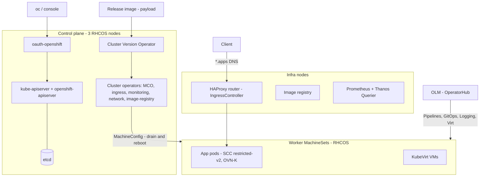
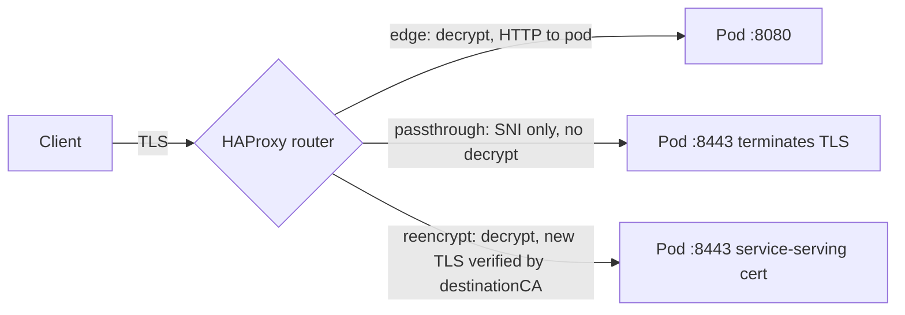
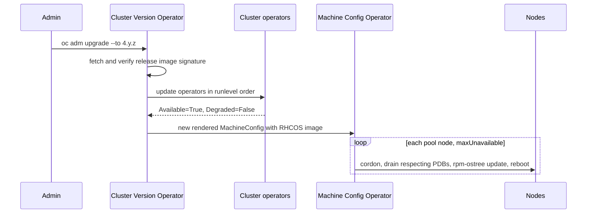

# N7 OpenShift
> Last verified: 2026-10 · Audience: senior/staff DevOps, SRE, AI eng, NetEng, DevSecOps, architects

Vanilla Kubernetes (scheduling, Deployments, Services, HPA, etc.) is covered in [C5 Deployment](../C-large-scale-architecture/C5-deployment.md) (C5.16–C5.25). This file covers only the **OpenShift deltas**. Current docs: **OpenShift Container Platform (OCP) 4.22** is the newest version in the docs.redhat.com version picker (Oct 2026).

## TL;DR
- OpenShift is **opinionated Kubernetes plus an operator-managed platform**: an immutable OS (**RHCOS**), cluster-wide upgrades run by the **Cluster Version Operator (CVO)**, built-in OAuth, registry, HAProxy router, monitoring, console, and an **OperatorHub** catalog of supported add-ons (Pipelines = Tekton, GitOps = Argo CD, Virtualization = KubeVirt, Logging = Vector + Loki).
- Security defaults are stricter than upstream: **SCC `restricted-v2`** gives each pod an **arbitrary UID from the namespace's range**, drops ALL capabilities, sets seccomp `RuntimeDefault` and an SELinux MCS label. Images that assume root, or a fixed UID that owns files, break. Fix the image (group 0, `g=u` permissions), not the SCC.
- **PSA and SCC work together.** PSA is enforced globally at `privileged`, with `restricted` used for warn/audit. A label syncer sets each namespace's warn/audit labels from what its ServiceAccounts' SCCs allow.
- Ingress is done with **Routes on the HAProxy-based Ingress Controller**, using **edge, passthrough or re-encrypt** TLS. Ingress objects get translated into Routes. **Gateway API** is supported through an Ingress-Operator-managed **Istio/OSSM** control plane (`controllerName: openshift.io/gateway-controller/v1`).
- Networking uses **OVN-Kubernetes**, the only CNI since OpenShift SDN was removed. Its add-ons are **EgressIP** (a stable source IP per namespace) and **EgressFirewall** (per-namespace egress allow/deny by CIDR or DNS name).
- Managed options: **ROSA** (AWS + Red Hat; HCP is the default, control plane in Red Hat's account reached over PrivateLink, STS roles, billed via AWS) and **ARO** (Microsoft + Red Hat jointly engineered, operated and supported, 99.95% SLA, Azure bill, managed identities, and now a hosted-control-plane architecture too).
- When OpenShift is worth it: regulated or hybrid estates that want **one supported platform across on-prem, edge and cloud**, a VMware exit (OpenShift Virtualization), or teams without the people to build the "platform on Kubernetes" themselves. When it isn't: cloud-native shops already standardized on EKS/AKS plus their own add-ons, because of subscription cost and lock-in to the opinionated stack.
- Upgrades go through **channels** (`candidate`, `fast`, `stable`, `eus`). Even-numbered minors are **EUS**, which allows control-plane-only EUS→EUS updates. You can't skip minors arbitrarily, and the update graph (OSUS/Cincinnati) decides which paths exist.

## N7.1 OpenShift family: OCP, OKD, editions
- **How it works:**
  - **OCP**: the commercial product from Red Hat, built and supported on RHCOS.
  - **OKD**: the community upstream distribution. It runs on **CentOS Stream CoreOS (SCOS)**; it previously used Fedora CoreOS. It has a single `stable-4` channel, no SLA and no EUS.
  - Subscription tiers are **OpenShift Kubernetes Engine (OKE)**, **OpenShift Container Platform**, and **OpenShift Platform Plus (OPP)**. OPP = OCP + **ACM + ACS + Quay** (+ ODF Essentials) (tier contents unverified for 2026).
  - **OpenShift Virtualization Engine (OVE)** is a VM-only subscription. It allows unlimited VMs on subscribed hosts but **no application containers** (verified in the docs).
  - Managed offerings: **ROSA** (AWS), **ARO** (Azure), and **OpenShift Dedicated (OSD)** (on AWS or GCP, run by Red Hat).
- **Trade-offs / when to use:** use OKD for labs or for learning the deltas for free. Production on OKD means you are your own vendor.
- **Interview angles:**
  - If asked "OpenShift vs Kubernetes" → it's a **CNCF-conformant distribution** plus the opinionated pieces upstream leaves out. Name them: OS, upgrades, auth, registry, router, monitoring, console, catalog, SCC.
  - Pitfall: calling OpenShift "a fork". The API is upstream Kubernetes; the extras are added through CRDs in groups like `*.openshift.io` (`route.openshift.io`, `config.openshift.io`, and so on).

## N7.2 RHCOS, MachineConfig and the Machine API
- **How it works:**
  - **RHCOS** is an immutable, image-based OS built with rpm-ostree / bootc. It is configured at first boot by **Ignition** and runs CRI-O. Control-plane nodes **must** be RHCOS; RHEL compute nodes were historically allowed (deprecated or removed path — unverified for 4.22).
  - The **Machine Config Operator (MCO)** renders `MachineConfig` objects into a pool config (`MachineConfigPool`, e.g. `master` and `worker`). It then drains and reboots nodes **one at a time** by default (`maxUnavailable: 1`). Changing a file means a MachineConfig, never SSH.
  - The **Machine API** (`machine-api` operator) defines a `MachineSet`, which works like a ReplicaSet for cloud VMs. A `Machine` is one VM. A `MachineHealthCheck` replaces unhealthy nodes. The **ClusterAutoscaler** and **MachineAutoscaler** scale MachineSets. Bare metal uses Metal3/BMC instead.
  - The **Control Plane Machine Set** manages the control-plane VMs on supported clouds.
  - **Infra nodes** are a MachineSet labelled `node-role.kubernetes.io/infra` that hosts the router, registry, monitoring and logging. Workloads running only on infra nodes don't count toward OCP subscription cores (support-policy detail).
- **Trade-offs / when to use:** you get drift-free, reproducible nodes and atomic OS updates as part of cluster upgrades. In exchange, there are no ad-hoc packages. Use `rpm-ostree`/layering or **on-cluster image layering** for extras such as drivers.
- **Interview angles:**
  - If asked "how do you patch the OS?" → you don't patch it separately. The CVO ships the RHCOS image inside the release payload, and the MCO rolls it out node by node.
  - Pitfall: a MachineConfig change with a bad pool selector reboots every node in that pool. Pause the pool (`spec.paused: true`) during change windows.
  - The `oc debug node/<n>` → `chroot /host` pattern replaces SSH.

## N7.3 Operators, OLM and the Cluster Version Operator
- **How it works:**
  - **Two operator tiers:**
    1. **Cluster (platform) operators**, about 30+ of them (`oc get clusteroperators`). The **CVO** manages them from the release payload, and they report `Available/Progressing/Degraded`.
    2. **Add-on operators**, installed through **OLM**.
  - **OLM v0 objects:** `CatalogSource`, then `Subscription` (channel plus `installPlanApproval: Automatic|Manual`), then `InstallPlan`, then `ClusterServiceVersion` (CSV). `OperatorGroup` sets the namespace scope.
  - **OLM v1** is GA in OCP 4.x (current docs). It adds a cluster-scoped **`ClusterExtension`** API (Operator Controller) plus **`ClusterCatalog`** (catalogd). It is declarative and GitOps-friendly, lets you pin a target version, and serves file-based catalogs over HTTPS. Its bundle size isn't limited by the etcd value size.
- **Trade-offs / when to use:** operators encode day-2 operations, but each one is another controller to trust. They often need cluster-scoped RBAC, which is a supply-chain risk.
- **Interview angles:**
  - If asked "why Manual install plan approval?" → so an operator upgrade can't roll out unreviewed in production. Promote it like any other change.
  - **Operator maturity levels (Operator Framework capability model, 1–5):** basic install → seamless upgrades → full lifecycle → deep insights → auto pilot.

## N7.4 Cluster upgrades (CVO, channels, EUS)
- **How it works:**
  - The update path is `oc adm upgrade`. The CVO pulls a **release image** that pins every component digest, including RHCOS.
  - It updates in order: control-plane operators first, then the MCO rolls the nodes.
  - **Channels:**
    - `candidate-4.y`: unsupported early access.
    - `fast-4.y`: GA builds as soon as errata ship.
    - `stable-4.y`: released after a telemetry soak, with no SLO on the delay. New clusters default to stable.
    - `eus-4.y`: even minors only.
  - **Conditional updates** are risks flagged in the graph that you must accept (`--allow-not-recommended`). **Admin-acks** gate minors that remove APIs.
  - **Control Plane Only update (EUS→EUS):** for example 4.20 → 4.21 → 4.22 for the control plane, while worker pools stay paused, so workers reboot once.
  - **Disconnected clusters** use `oc-mirror` plus a local **OpenShift Update Service (OSUS)**.
- **Trade-offs / when to use:** a fast channel means quicker fixes but you're an early adopter. Stable plus EUS suits change-averse enterprises.
- **Interview angles:**
  - "How do you de-risk a minor upgrade?" →
    - Run the deprecated API check (`APIRequestCount`).
    - Check operator compatibility (`olm.maxOpenShiftVersion`).
    - Set PDBs so drains can make progress.
    - Use canary MachineConfigPools.
    - Pause non-critical pools.
    - Watch `oc get co` and `oc adm upgrade status`.
  - **Pitfall:** strict PDBs (`minAvailable` = replicas) block MCO drains forever.
  - **ROSA HCP**: control plane and machine pools upgrade **separately**. ROSA classic upgrades the whole cluster together.

## N7.5 Projects, built-in OAuth and RBAC
- **How it works:**
  - A **Project** is a Namespace plus annotations (display name, description, SCC UID/MCS ranges). `oc new-project` goes through a **ProjectRequest** template, which can inject quotas, LimitRanges and NetworkPolicies by default. Self-provisioning is controlled by the `self-provisioner` ClusterRole.
  - **Built-in OAuth server** (`oauth-openshift`): identity providers are configured in `OAuth/cluster`. Options are htpasswd, LDAP, OIDC (Entra ID, Keycloak / Red Hat build of Keycloak), GitHub/GitLab, Google, Keystone and request-header.
  - It issues opaque `sha256~` OAuth access tokens. Users and identities are stored as `User`/`Identity`/`Group` objects, and group sync from LDAP is available.
  - **External OIDC (direct authentication)** lets the API server trust an external IdP and bypass the built-in OAuth server. It's available on ROSA HCP (`external_auth_providers_enabled`) and on OCP for some IdPs (exact OCP GA scope unverified).
  - **RBAC** is upstream Kubernetes RBAC plus default roles (`admin`, `edit`, `view`, `cluster-admin`, `cluster-reader`, `self-provisioner`). `kubeadmin` is a bootstrap secret; remove it after configuring an IdP.
- **Interview angles:**
  - If asked "how do devs get namespaces safely?" → a self-service ProjectRequest template with quota, LimitRange, a default-deny NetworkPolicy and RoleBindings. The same idea as an IDP golden path ([N6 Internal developer platforms](N6-internal-developer-platforms.md)).
  - Pitfall: leaving `kubeadmin` in place, or htpasswd in production.

## N7.6 Security: SCCs vs Pod Security Admission
- **How it works:**
  - The **SCC admission plugin** (`security.openshift.io/v1`) controls:
    - privileged containers and `allowPrivilegeEscalation`
    - capabilities
    - host namespaces and ports
    - hostPath and allowed volume types
    - SELinux context
    - `runAsUser`, fsGroup and supplemental groups
    - read-only root filesystem
    - seccomp profiles
  - **Default SCCs:** `restricted-v2` (default for authenticated users since 4.11), `restricted` (legacy), `nonroot(-v2)`, `anyuid`, `hostnetwork(-v2)`, `hostaccess`, `hostmount-anyuid`, `node-exporter`, `privileged`, and the new `nested-container` (runs container engines inside a pod using a user namespace, `hostUsers: false`).
  - **`restricted-v2`:**
    - drops **ALL** capabilities; only `NET_BIND_SERVICE` can be added back
    - seccomp `runtime/default`
    - `allowPrivilegeEscalation` must be false or unset
    - `runAsUser: MustRunAsRange`
    - SELinux `MustRunAs`
  - **Pre-allocated values** come from namespace annotations:
    - `openshift.io/sa.scc.uid-range`, e.g. `1000680000/10000`, gives the UID
    - `openshift.io/sa.scc.mcs` gives the SELinux level, e.g. `s0:c26,c15`
    - `openshift.io/sa.scc.supplemental-groups` gives fsGroup and supplemental groups
  - Pods get the **minimum UID of the range**, and the GID is always **0 (root group)**.
  - **SCC selection order:** priority field (highest first), then most restrictive, then name. `privileged: true` in a pod spec does not force the `privileged` SCC.
  - Access is granted with RBAC `use` on the SCC, e.g. `oc adm policy add-scc-to-user nonroot-v2 -z mysa`. Never grant to `system:authenticated`.
  - **Never edit default SCCs**, because upgrades reset them. Create your own.
  - **Never set `openshift.io/run-level`** on a namespace, because then no SCC applies at all.
  - **PSA:** globally, **`privileged` is enforced** and **`restricted` is used for warn/audit**. The **label synchronizer** sets each namespace's **warn/audit** labels to the most privileged profile its **ServiceAccounts'** SCCs allow. User permissions aren't considered.
  - **Excluded from sync:** `default`, `kube-*`, `openshift`, and system `openshift-*` namespaces (`openshift-operators` can opt in). Hand-editing a PSA label disables sync for that label; `security.openshift.io/scc.podSecurityLabelSync=true` forces it back.
- **Trade-offs / when to use:** SCC is finer-grained than PSA (UID ranges, SELinux MCS, volume types) and is the real gate. PSA mainly provides upstream-standard warnings.
- **Interview angles:**
  - **"Why does my Docker Hub image crash on OpenShift?"** → it runs as a random UID with GID 0 and can't write to `/var/cache/...`. Fix it in the image:

    ```dockerfile
    RUN chgrp -R 0 /app && chmod -R g=u /app
    USER 1001
    ```

    Listen on a port above 1024, or add only `NET_BIND_SERVICE`. **Don't** reach for `anyuid`.
  - Arbitrary UIDs plus MCS labels mean pods in different projects can't read each other's files even on shared storage. That's defense-in-depth against container escape.
  - Related: [L7 Zero trust & workload identity](../L-data-privacy-ai-security/L7-zero-trust-workload-identity.md), [C4 Security](../C-large-scale-architecture/C4-security.md).

## N7.7 Networking: OVN-Kubernetes, egress IP, egress firewall
- **How it works:**
  - **OVN-Kubernetes** is the default and only first-party CNI. OpenShift SDN was deprecated and then removed (4.17), so migration is mandatory before upgrading.
  - It uses **Geneve** overlay encapsulation (UDP 6081) and OVS on every node.
  - **Gateway modes:** shared (default) or local.
  - Optional **IPsec** for east-west traffic. Also supports hybrid networking for Windows nodes.
  - **EgressIP** gives a namespace or pod selector a stable SNAT source IP. On clouds it's assigned as a secondary IP on node NICs, with capacity limited by per-NIC IP quotas. Use it for allow-listing at legacy firewalls or databases.
  - **EgressFirewall** (`k8s.ovn.org/v1`): **one per namespace**, named `default`. Its ordered `Allow/Deny` rules match `cidrSelector` or `dnsName`, plus ports. It only applies to traffic leaving the cluster. It complements NetworkPolicy, which handles in-cluster traffic, and `AdminNetworkPolicy`/`BaselineAdminNetworkPolicy`, which are cluster-scoped admin guardrails.
  - **User-Defined Networks (UDN/CUDN)** give namespace-isolated primary networks, used for multi-tenancy and VMs. **Multus** provides secondary NICs (SR-IOV, macvlan, bridge) for CNF and VM workloads.
- **Interview angles:**
  - "How do you stop data exfiltration from a namespace?" → an EgressFirewall with a default deny `0.0.0.0/0` at the end plus allowed FQDNs, then a cloud egress firewall or proxy as a second layer.
  - Pitfall: EgressIP on AWS/Azure is bounded by the node NIC's secondary-IP limits and needs nodes labelled `k8s.ovn.org/egress-assignable`.
  - Gateway API doesn't support UDN namespaces (per the 4.22 docs).
  - Related: [F7 Network routing](../F-network-engineering/F7-network-routing.md), [G14 Service-to-service networking](../G-cloud-network-architecture/G14-service-to-service-networking.md).

## N7.8 Routes vs Ingress vs Gateway API (HAProxy router, TLS modes)
- **How it works:**
  - The **Ingress Operator** manages `IngressController` resources. The `default` one is an **HAProxy** deployment, usually 2 replicas on infra or worker nodes, exposed through a cloud LB or HostNetwork/NodePort on bare metal (with MetalLB or an external LB).
  - The wildcard DNS name is `*.apps.<cluster>.<domain>`. **Router sharding** uses extra IngressControllers with `routeSelector`/`namespaceSelector`, for example internal vs public.
  - A **Route** (`route.openshift.io/v1`) supports host/path routing, weighted **A/B backends** (`alternateBackends`), sticky cookies, and per-route annotations (timeouts, rate limits, IP allow-lists via `haproxy.router.openshift.io/*`).
  - **TLS termination modes** (details in [I2 TLS & certificates](../I-dns-tls-acceleration-gaps/I2-tls-and-certificates.md) (I2.1)):
    - **edge**: TLS ends at the router, which sends plain HTTP to the pod. Set `insecureEdgeTerminationPolicy` to `Redirect`, `Allow` or `None`.
    - **passthrough**: the router routes by **SNI** without decrypting, and the pod terminates TLS. No L7 features, no cookies, no path routing. Fits mTLS end to end.
    - **reencrypt**: the router terminates, then opens new TLS to the pod. It validates the pod's cert against `destinationCACertificate`, or against the **service-serving CA** via the `service.beta.openshift.io/serving-cert-secret-name` annotation.
  - **Ingress objects become Routes** automatically. Annotate with `route.openshift.io/termination: edge|passthrough|reencrypt` (unset means edge) and `route.openshift.io/destination-ca-certificate-secret`.
  - **Gateway API (GA):**
    - Creating a `GatewayClass` with `controllerName: openshift.io/gateway-controller/v1` makes the Ingress Operator install a lightweight **Istio (OpenShift Service Mesh-based) control plane** in `openshift-ingress`. Gateways run Envoy.
    - The Ingress Operator owns the Gateway API CRDs. Pre-existing CRDs at a different version **block upgrades** behind an admin-gate.
    - 4.22 removed the block on the experimental `gateway.networking.x-k8s.io` CRDs, but the built-in controller doesn't reconcile them.
- **Trade-offs:** Routes are simple, battle-tested and fast (HAProxy), but OpenShift-only. Gateway API is portable and role-oriented (GatewayClass → Gateway → HTTPRoute/GRPCRoute), but needs more resources and Envoy scaling. On-prem it needs MetalLB plus manual DNS.
- **Interview angles:**
  - "Need end-to-end mTLS with client certs to the pod?" → passthrough. "Need WAF-ish L7 features plus encryption to the pod?" → reencrypt.
  - Pitfall: passthrough with HTTP/2 or a misconfigured SNI. Another: the default router cert is self-signed, so replace the `default` IngressController certificate with a wildcard cert from your CA or cert-manager.

## N7.9 Builds and images: BuildConfig/S2I, Shipwright, ImageStreams
- **How it works:**
  - **BuildConfig** (`build.openshift.io`) strategies are **Docker**, **Source-to-Image (S2I)** and **Custom** (the Jenkins pipeline strategy is deprecated). Triggers are GitHub/GitLab/generic webhooks, ImageChange and ConfigChange.
  - **S2I** layers app source onto a **builder image** (`assemble`/`run` scripts) and produces a runnable image without a Dockerfile.
  - **Builds for Red Hat OpenShift** (separate product, docs v1.x) is based on **Shipwright**. It has CRDs `Build`/`BuildRun`/`BuildStrategy`, ships **Buildah and S2I** strategies, supports local-source builds through the `shp` CLI, and runs on Tekton-style task runs. It's the Kubernetes-native successor path to BuildConfig.
  - The **internal image registry** is the `image-registry` operator, backed by S3, Blob, ODF or PVC. It's set to `Removed` on some bare-metal installs by default.
  - **ImageStream** (`image.openshift.io`) is a virtual pointer of tags to **immutable digests** in any registry. **ImageStreamTag** triggers redeploys when a tag moves (the `image.openshift.io/triggers` annotation on Deployments). `--scheduled` import re-polls external tags.
  - The **Samples operator** provides builder ImageStreams in the `openshift` namespace.
- **Trade-offs:** in-cluster builds are convenient for developers, but they run a build workload with privileges, compete for cluster capacity and put CI risk inside production. Many enterprises build in external CI (GitHub Actions or GitLab) and only deploy to OpenShift.
- **Interview angles:**
  - "ImageStream vs plain image tag?" → it decouples the deployment from the registry and gives tag-move triggers and rollback by digest. The cost is lock-in to the OpenShift API.
  - Pitfall: Docker strategy builds need more privileges. Prefer Buildah via Shipwright or Pipelines, which run as rootless or in user namespaces.
  - Supply chain: sign with Sigstore/cosign and verify with a `ClusterImagePolicy`/`ImagePolicy`, or with ACS policies. See [L6 Secrets & supply chain](../L-data-privacy-ai-security/L6-secrets-supply-chain.md).

## N7.10 Delivery: OpenShift Pipelines (Tekton) and OpenShift GitOps (Argo CD)
- **How it works:**
  - **OpenShift Pipelines** = **Tekton** (`Task`, `Pipeline`, `PipelineRun`, `Trigger`/`EventListener`), plus **Pipelines as Code** (`.tekton/` in the repo, GitHub App) and **Tekton Chains** (SLSA provenance and signing). Each step is a container in the pod and there's no central controller VM. Compare Jenkins in [N2 GitLab CI & Jenkins](N2-gitlab-ci-jenkins.md).
  - **OpenShift GitOps** = **Argo CD** managed by an operator. It creates a default cluster-scoped instance in `openshift-gitops` for cluster configuration, and app teams get namespaced instances. It integrates with the OpenShift OAuth/Dex SSO and ships Argo Rollouts. Details: [N4 GitOps (Argo CD, Flux)](N4-gitops-argocd-flux.md).
  - **DeploymentConfig** has been **deprecated since 4.14**. Use Deployments plus ImageStream triggers or Argo Rollouts.
- **Interview angles:**
  - The canonical pattern is **Tekton for CI (build, scan, sign) → write the digest to Git → Argo CD syncs**, with the cluster pulling and never being pushed to.
  - Pitfall: the default Argo CD instance has broad cluster-admin-ish rights. Don't let app teams use it.

## N7.11 Built-in monitoring and logging
- **How it works:**
  - The **platform monitoring stack** in `openshift-monitoring` comes preinstalled and is managed by the Cluster Monitoring Operator:
    - Prometheus (HA pair) plus Alertmanager
    - **Thanos Querier** (one query endpoint)
    - kube-state-metrics, node-exporter
    - Console dashboards
  - It's configured through the `cluster-monitoring-config` ConfigMap.
  - **User Workload Monitoring** (`enableUserWorkload: true`) adds a separate Prometheus in `openshift-user-workload-monitoring` for `ServiceMonitor`/`PrometheusRule` in app namespaces. Remote-write goes out to Thanos, Mimir or a SaaS.
  - **Red Hat OpenShift Logging** is a separate cadence, with docs at **6.6** (Oct 2026). Logging 6.x uses **Vector** collectors, the `ClusterLogForwarder` (`observability.openshift.io/v1`), and the **LokiStack** store (Loki Operator, object storage backend) with a console UI plugin.
  - **Elasticsearch/Kibana/Fluentd were removed in Logging 6.0**, from memory; the 6.x docs landing page didn't confirm it (unverified).
  - Tracing is Tempo plus the Red Hat build of OpenTelemetry. Related: [O1 Prometheus](../O-observability-tooling/O1-prometheus.md), [O2 Grafana LGTM](../O-observability-tooling/O2-grafana-lgtm-stack.md).
- **Interview angles:**
  - Pitfall: platform Prometheus has limited retention and size. Don't put tenant metrics there; use User Workload Monitoring, and don't override platform ServiceMonitors because the operator reverts them.
  - "Logs to Splunk/CloudWatch/Azure Monitor?" → set `ClusterLogForwarder` outputs. ROSA HCP can forward control-plane and audit logs to CloudWatch.

## N7.12 OpenShift Virtualization (KubeVirt) and VMware exits
- **How it works:**
  - **KubeVirt** runs VMs as pods (`virt-launcher` wraps QEMU/KVM). It's installed by the HyperConverged operator.
  - **CRDs:** `VirtualMachine`, `VirtualMachineInstance`, `DataVolume` (CDI import/clone), `VirtualMachineInstanceMigration` (live migration needs **RWX** storage).
  - **Migration Toolkit for Virtualization (MTV)** does warm or cold migration from vSphere, RHV and OpenStack.
  - **VMware concept mapping** (from Red Hat docs):

    | VMware | OpenShift Virtualization |
    |---|---|
    | Datastore | PV/PVC |
    | DRS | Eviction policy + **descheduler** live-migrating VMs |
    | NSX | OVN-Kubernetes / UDN / Multus / certified CNIs (no direct equivalent) |
    | SPBM | StorageClass |
    | vCenter | Console + ACM |

  - Needs **bare-metal nodes**: on-prem metal, AWS `*.metal` instances (ROSA), or Azure on supported VM sizes/metal (ARO support state unverified).
  - **On ROSA/OSD**, RHEL guest subscriptions are included: unlimited on hosts with **96 or more vCPUs**, otherwise up to an **8:1 guest-to-host vCPU** ratio.
- **Trade-offs:** you get one platform and one ops model for VMs and containers, and avoid per-socket VMware (post-Broadcom) licensing. In exchange, the storage (ODF/Portworx/NetApp) and networking design must be rebuilt, there's no vMotion equivalent without RWX, and Windows VMs need dedicated storage classes.
- **Interview angles:** "Plan a 2,000-VM VMware exit" →
  - Assess the dependency map.
  - Land on OCP-Virt with ODF or a SAN CSI.
  - Use MTV warm migration in waves.
  - Rebuild NSX microsegmentation as NetworkPolicy/ANP/UDN.
  - Containerize opportunistically later.
  - Consider the cloud alternatives: VMware Cloud on AWS/AVS, or rehost onto EC2/Azure VMs.

## N7.13 Multicluster and security add-ons: ACM, ACS, Developer Hub
- **How it works:**
  - **Advanced Cluster Management (ACM):**
    - Hub-and-spoke, with a `klusterlet` agent on each managed cluster.
    - Cluster lifecycle through the **multicluster engine (MCE)**, including HyperShift-hosted control planes.
    - `Policy`/`PlacementRule`/`Placement` governance (config and compliance, with Gatekeeper/Kyverno integration).
    - Observability (Thanos-based), app placement with Argo CD ApplicationSets, and Submariner cross-cluster networking.
  - **Advanced Cluster Security (ACS)** = **StackRox**. Its parts:
    - **Central**: UI, API, policy and risk engine. It can be self-hosted or the Cloud Service.
    - **Sensor**: one per cluster.
    - **Collector**: eBPF-based runtime process and network telemetry.
    - **Admission controller**: deploy-time enforcement.
    - **Scanner V4**: images and nodes.

    Capabilities: build/deploy/runtime policies, network graph, and NetworkPolicy generation. CI scan uses `roxctl image check`. Compare [P1 Wiz CNAPP](../P-security-platforms-identity/P1-wiz-cnapp.md).
  - **Red Hat Developer Hub (RHDH)** is the supported **Backstage** distribution: software catalog, templates and dynamic plugins. It's the IDP portal layer; see [N6 Internal developer platforms](N6-internal-developer-platforms.md).
- **Interview angles:**
  - "Fleet of 200 clusters (edge plus cloud)?" → ACM for lifecycle, policy and placement, GitOps via ApplicationSets, ACS for security posture, and HCP to cut control-plane cost.
  - Pitfall: the ACM hub is a single point of management (not data-plane) failure. Back it up or restore it, and run it on a dedicated cluster.

## N7.14 Small and edge topologies: SNO, compact, MicroShift, hosted control planes
- **How it works:**
  - **Single-Node OpenShift (SNO)** puts the full OCP control plane and worker on one node. Minimum is roughly 8 vCPU and 16 GB RAM (unverified for 4.22). It has **no HA**, and an upgrade reboots everything. Installs through Assisted, Agent or **image-based install (IBI)** for fast factory provisioning.
  - **Compact cluster**: 3 schedulable control-plane nodes.
  - **Two-node OpenShift with fencing or arbiter**: newer edge option (GA status unverified).
  - **MicroShift** (Red Hat build of MicroShift): a minimal OpenShift-derived Kubernetes **on RHEL for Edge** (RPM or **bootc image mode**). It's a single binary on a single node, for far-edge or constrained devices. It has no CVO, no console, no OLM by default, and updates with the OS (ostree/bootc rollback). SCCs still apply.
  - **Hosted control planes (HCP / HyperShift)**: control planes run as pods on a management cluster (MCE/ACM), with worker NodePools elsewhere. This is the architecture behind ROSA HCP and ARO HCP, and it's also available self-managed (bare metal, KubeVirt, AWS).
- **Interview angles:** retail store, factory line or vehicle → MicroShift (single device) vs SNO (needs the full API and operators) vs a 3-node compact cluster (needs HA). Manage the fleet with ACM plus GitOps and zero-touch provisioning (ZTP).

## N7.15 Install methods: IPI, UPI, Assisted, Agent-based
- **How it works:**
  - The docs list four methods:
    - **Interactive**: Assisted Installer, a SaaS web UI/API with pre-flight validation.
    - **Local Agent-based**: an `openshift-install agent create image` ISO, for disconnected or restricted networks. A no-external-registry, self-contained media option also exists.
    - **Automated (IPI)**: installer-provisioned infrastructure. The installer creates the cloud VPC/VNet, LBs, DNS and VMs, or uses BMC/Redfish on metal.
    - **Full control (UPI)**: you pre-build networking, LBs, DNS and Ignition-booted nodes, for maximum customization.
  - Inputs are `install-config.yaml` → manifests → Ignition configs. The **bootstrap node** is temporary.
  - **Credentials:** cloud credentials use **CCO** modes (mint, passthrough, **manual + STS/Workload Identity** via `ccoctl`).
  - **Disconnected installs:** use `oc-mirror` to a mirror registry (Quay or the mirror-registry tool) plus `ImageDigestMirrorSet`.
- **Interview angles:**
  - For regulated cloud installs, use **manual CCO mode with short-lived tokens** (AWS STS / Azure Workload Identity / GCP WIF). Don't leave a long-lived admin key in `kube-system`.
  - The bootstrap certs **expire after 24h**. Clusters left off soon after install need CSR approval (`oc get csr`).

## N7.16 Managed OpenShift: ROSA vs ARO
- **How it works:**
  - **ROSA** (Red Hat OpenShift Service on AWS) is jointly supported and operated by AWS and Red Hat. Red Hat SRE runs it 24x7, with a **99.95% SLA**.
  - **HCP vs classic on ROSA:**

    | | ROSA HCP | ROSA classic |
    |---|---|---|
    | Control plane | Red Hat-owned AWS account, multi-AZ | Your account, single or multi-AZ |
    | Worker → control plane | AWS PrivateLink | Same VPC |
    | IAM | AWS managed policies | Customer-managed policies |
    | Infra nodes | None (router, registry, monitoring run on workers) | 2–3 dedicated infra nodes |
    | Upgrades | Control plane and each machine pool separately | Whole cluster together |
    | Minimum EC2 | 2 instances | 7 single-AZ / 9 multi-AZ |

  - **ROSA auth:** **STS everywhere**. Account roles (Installer, Support, Worker) plus operator roles plus an **OIDC config** let in-cluster operators assume IAM roles with short-lived tokens.
  - **ROSA billing:** paid through AWS Marketplace, as a **service fee per 4 vCPU-hour of worker nodes** plus, for HCP, an **hourly cluster fee**, plus EC2/EBS/LB infrastructure. 1- and 3-year contracts are available.
  - **ROSA network options:** private clusters (`private = true`, PrivateLink to SRE), zero-egress clusters, shared VPC, FedRAMP High and HIPAA-qualified in GovCloud.
  - **ARO** (Azure Red Hat OpenShift) is **jointly engineered, operated and supported by Microsoft and Red Hat**. Clusters deploy into your subscription (with a locked managed resource group) and show up on the **Azure bill**, with a **99.95% SLA**.
  - **ARO architectures:**
    - **Standard**: control plane on dedicated VMs in your subscription.
    - **Hosted control planes**: built on HyperShift, with the control plane on shared Microsoft/Red Hat infrastructure (GA and region scope unverified).
  - **ARO identity:** **managed identities / workload identity**:
    - **8 operator user-assigned identities**: image-registry, cloud-network-config, disk-csi, file-csi, ingress, cloud-controller-manager, machine-api, aro-operator.
    - **1 cluster identity** (`aro-cluster`) that creates federated credentials.
    - Built-in "Azure Red Hat OpenShift *" roles assigned at subnet or VNet scope.
    - A 4.19 basic install needs about **28 role assignments at subnet scope**, so watch the **4,000 role assignments per subscription** limit.
    - The Azure Files StorageClass is disabled by default under managed identity because it uses shared keys.
    - Before upgrading, set the `upgradeable-to` annotation on CloudCredential.
  - **ARO networking:** a VNet with **2 empty subnets** (control plane and workers). Private API and ingress use `--apiserver-visibility Private --ingress-visibility Private`. **UserDefinedRouting** sends egress through Azure Firewall or an NVA. Entra ID integrates as an OIDC IdP.
- **Interview angles:**
  - "ROSA HCP or classic?" → HCP: cheaper (no control-plane or infra EC2), about 10–15 minute provisioning, independent node-pool upgrades, PrivateLink-isolated control plane. Classic only when you need a feature HCP lacks.
  - "ARO vs AKS?" → ARO is OpenShift parity with on-prem and a joint SLA, but it's pricier and the minimum footprint is bigger (3 control-plane plus 3 worker VMs on the standard architecture). AKS gives a free or standard tier control plane plus the Azure-native add-on ecosystem.
  - Both are "**shared responsibility**": the provider owns control-plane and platform upgrades on its schedule, and you own workloads, IdP, quotas and app networking. Don't install anything that fights the SRE-managed bits; ROSA and ARO block some cluster-admin actions.

## N7.17 Licensing, cost and when OpenShift is worth it
- **How it works:**
  - Self-managed OCP is sold as **subscriptions per core pair (2 cores / 4 vCPU) or per bare-metal socket pair** (current SKU detail unverified). Only **worker** capacity running application workloads counts. Control-plane and properly-labelled infra nodes are exempt.
  - Cloud marketplaces offer hourly pricing. ROSA and ARO bundle the subscription into hourly worker fees.
- **Decision table:**

  | Signal | Lean OpenShift (OCP/ROSA/ARO) | Lean EKS/AKS (+ DIY add-ons) |
  |---|---|---|
  | Estate | Hybrid: on-prem + multiple clouds + edge, one ops model | Single cloud, cloud-native |
  | Org | Small platform team, wants a vendor-supported "platform in a box" | Strong platform team, wants best-of-breed choice |
  | Compliance | FIPS, STIG/CIS (Compliance Operator), disconnected or air-gapped | Cloud-native controls suffice |
  | Workloads | VMware exit, CNF/telco, regulated legacy Java/.NET | Serverless-heavy, deep AWS/Azure PaaS integration |
  | Cost | Subscription cost < people cost of building and maintaining the add-ons | Avoid per-core subscription; free EKS/AKS control plane tier economics |

- **Interview angles:**
  - Frame it as **TCO**: subscription vs the engineers needed to build and patch an equivalent stack (ingress, registry, auth, monitoring, policy, OS lifecycle, upgrade testing).
  - Add the cost of **lock-in to OpenShift APIs** (Routes, ImageStreams, BuildConfig, SCC). Mitigate it by using upstream APIs (Ingress/Gateway API, Deployments, Argo CD, Tekton) where possible.

## Diagrams







## Cloud mapping: AWS vs Azure

| Capability | AWS | Azure | Role it plays | Key differences | Alternatives |
|---|---|---|---|---|---|
| Managed OpenShift | **ROSA** (HCP default; classic) | **ARO** (standard; hosted control planes) | Supported OpenShift without running the control plane | ROSA: Red Hat SRE runs it, with AWS as the jointly supporting party. ARO: jointly *engineered and operated* by Microsoft + Red Hat. Both 99.95% SLA | Self-managed OCP IPI on EC2/Azure VMs; OSD |
| Vanilla managed K8s | **EKS** | **AKS** | Same workloads, upstream APIs | Control-plane fee: EKS hourly; AKS Free/Standard/Premium tiers. Add-ons are DIY | GKE, Rancher/RKE2, Tanzu |
| Cluster to cloud IAM | **STS** + OIDC operator roles (IRSA-style) | **User-assigned managed identities** + federated credentials (workload identity) | Short-lived credentials for operators and pods | ROSA: account roles + operator roles + OIDC config. ARO: 8 operator identities + 1 cluster identity, role-assignment count limit | Static keys (CCO mint mode), which is the anti-pattern |
| Private control-plane access | **PrivateLink** (HCP workers → control plane; private clusters to SRE) | Private API/ingress visibility + Private Link Service for SRE | Keep the API off the internet | ROSA HCP always reaches the control plane over PrivateLink | Site-to-site VPN / bastion |
| Egress control | NAT GW, Network Firewall; ROSA zero-egress | **UserDefinedRouting** → Azure Firewall/NVA | Allow-list cluster egress | ARO UDR makes you own Red Hat/Microsoft endpoint allow-lists | OVN EgressFirewall (in-cluster) |
| Billing | AWS Marketplace: per 4 vCPU-hour worker fee + HCP cluster-hour fee + EC2 | Azure bill: OpenShift license per worker VM-hour + VMs | Single invoice / commit burn-down | Both count against cloud commits (EDP/MACC) (unverified per contract) | Self-managed subscriptions (BYOS) |
| Registry | ECR | ACR | Image storage outside the cluster | Internal registry backed by S3 / Blob | Quay |
| Ingress LB | NLB (default router) | Azure LB | Fronts `*.apps` | ROSA can add AWS LB Operator for ALB; ARO uses Azure LB + Front Door optionally | Cloudflare in front of router |

- **ROSA HCP** is the AWS-recommended path. It's faster to provision, needs no infra nodes, and runs the control plane in Red Hat's account. You pay a per-cluster hourly fee, but the 3 control-plane and 2–3 infra EC2 instances go away. Use `rosa create account-roles/operator-roles/oidc-config` or the `rhcs` Terraform provider.
- **ARO** creates a **locked managed resource group** with a deny assignment, so you can't change those resources. Its API is `Microsoft.RedHatOpenShift/openShiftClusters`. A pull secret from Red Hat unlocks OperatorHub content.
- **EKS/AKS vs ROSA/ARO:** the managed Kubernetes services give you a cheaper control plane and native integrations (Karpenter / Node Auto Provisioning, Pod Identity / Workload Identity). In return, you assemble the ingress, registry, policy, GitOps and monitoring yourself. ROSA/ARO give you those batteries plus OCP parity with on-prem.
- **Alternatives:**
  - Rancher/RKE2 or Tanzu, for multi-cluster on-prem.
  - Upstream Kubernetes + Argo CD + Kyverno + Cilium, as a DIY "platform".
  - GKE Enterprise, as the canonical GCP alternative.
  - For VM workloads, AVS / VMware Cloud on AWS as rehost-without-replatform options.

## Hands-on (optional)

Custom SCC (copy of restricted-v2, adds a fixed UID range for a legacy app), bound to one ServiceAccount:
```yaml
apiVersion: security.openshift.io/v1
kind: SecurityContextConstraints
metadata:
  name: legacy-uid-5000
priority: 10
allowPrivilegedContainer: false
allowPrivilegeEscalation: false
requiredDropCapabilities: ["ALL"]
allowedCapabilities: ["NET_BIND_SERVICE"]
runAsUser:
  type: MustRunAsRange
  uidRangeMin: 5000
  uidRangeMax: 5000
seLinuxContext:
  type: MustRunAs
fsGroup:
  type: MustRunAs
supplementalGroups:
  type: RunAsAny
seccompProfiles: ["runtime/default"]
readOnlyRootFilesystem: false
volumes: ["configMap", "downwardAPI", "emptyDir", "persistentVolumeClaim", "projected", "secret"]
users: []
groups: []
```

Re-encrypt Route using the service-serving CA (Service annotated `service.beta.openshift.io/serving-cert-secret-name: api-tls`):
```yaml
apiVersion: route.openshift.io/v1
kind: Route
metadata:
  name: api
  namespace: shop
  annotations:
    haproxy.router.openshift.io/timeout: 30s
    haproxy.router.openshift.io/ip_whitelist: "10.0.0.0/8"
spec:
  host: api.apps.example.com
  to:
    kind: Service
    name: api
    weight: 100
  port:
    targetPort: https
  tls:
    termination: reencrypt
    insecureEdgeTerminationPolicy: Redirect
    # destinationCACertificate omitted: router trusts the service-serving CA automatically
```

EgressFirewall (one per namespace, must be named `default`):
```yaml
apiVersion: k8s.ovn.org/v1
kind: EgressFirewall
metadata:
  name: default
  namespace: shop
spec:
  egress:
  - type: Allow
    to:
      dnsName: api.stripe.com
    ports:
    - protocol: TCP
      port: 443
  - type: Allow
    to:
      cidrSelector: 10.20.0.0/16
  - type: Deny
    to:
      cidrSelector: 0.0.0.0/0
```

Day-2 `oc` commands:
```bash
# cluster health and upgrades
oc get clusterversion; oc get clusteroperators
oc adm upgrade channel stable-4.22 && oc adm upgrade            # list recommended + conditional updates
oc adm upgrade --to=4.22.3                                      # start update
oc get mcp; oc get nodes -o wide                                # watch MCO roll nodes

# why was my pod rejected / which SCC did it get?
oc get pod web-1 -o jsonpath='{.metadata.annotations.openshift\.io/scc}{"\n"}'
oc get ns shop -o yaml | grep -E 'sa.scc.(uid-range|mcs)|pod-security'
oc adm policy scc-subject-review -f deploy.yaml                 # which SCC would admit this
oc create sa legacy -n shop && oc adm policy add-scc-to-user legacy-uid-5000 -z legacy -n shop

# routes and certs
oc create route edge web --service=web --hostname=web.apps.example.com
oc get routes -A; oc -n openshift-ingress get pods
oc -n openshift-ingress-operator get ingresscontroller default -o yaml

# node access without SSH
oc debug node/worker-0 -- chroot /host journalctl -u crio --since -10m

# operators (OLM v0)
oc get csv -A; oc get subscriptions -A; oc get installplan -n openshift-gitops-operator
```

ROSA HCP with the `rhcs` provider (roles/OIDC created beforehand via the `rosa` CLI or the provider's modules):
```hcl
terraform {
  required_providers {
    rhcs = { source = "terraform-redhat/rhcs" }
    aws  = { source = "hashicorp/aws" }
  }
}

provider "rhcs" {}                       # token from RHCS_TOKEN env var

data "aws_caller_identity" "current" {}

resource "rhcs_cluster_rosa_hcp" "this" {
  name                   = "prod-hcp"
  cloud_region           = "us-east-1"
  aws_account_id         = data.aws_caller_identity.current.account_id
  aws_billing_account_id = data.aws_caller_identity.current.account_id
  aws_subnet_ids         = var.private_subnet_ids
  availability_zones     = ["us-east-1a", "us-east-1b", "us-east-1c"]
  replicas               = 3            # multiple of private subnets
  compute_machine_type   = "m6i.xlarge"
  private                = true          # API via PrivateLink only
  channel_group          = "stable"
  etcd_encryption        = true
  etcd_kms_key_arn       = var.kms_key_arn
  properties             = { rosa_creator_arn = data.aws_caller_identity.current.arn }
  sts = {
    role_arn             = var.installer_role_arn
    support_role_arn     = var.support_role_arn
    instance_iam_roles   = { worker_role_arn = var.worker_role_arn }
    operator_role_prefix = "prod-hcp"
    oidc_config_id       = var.oidc_config_id
  }
  wait_for_create_complete = true
}
```

ARO (standard architecture) with azurerm (service-principal flavour shown; the managed-identity flavour needs the 9 user-assigned identities, and its provider support is unverified):
```hcl
resource "azurerm_redhat_openshift_cluster" "aro" {
  name                = "aro-prod"
  location            = azurerm_resource_group.rg.location
  resource_group_name = azurerm_resource_group.rg.name

  cluster_profile {
    domain  = "aroprod"
    version = var.aro_version             # from `az aro get-versions -l <region>`
  }
  network_profile {
    pod_cidr      = "10.128.0.0/14"
    service_cidr  = "172.30.0.0/16"
    outbound_type = "UserDefinedRouting"   # egress via Azure Firewall
  }
  main_profile {
    vm_size   = "Standard_D8s_v5"
    subnet_id = azurerm_subnet.control.id
  }
  worker_profile {
    vm_size      = "Standard_D4s_v5"
    disk_size_gb = 128
    node_count   = 3
    subnet_id    = azurerm_subnet.worker.id
  }
  api_server_profile { visibility = "Private" }
  ingress_profile    { visibility = "Private" }
  service_principal {
    client_id     = var.sp_client_id
    client_secret = var.sp_client_secret
  }
}
```

## Cross-links
- [C5 Deployment](../C-large-scale-architecture/C5-deployment.md) (C5.16–C5.25 vanilla Kubernetes)
- [I2 TLS & certificates](../I-dns-tls-acceleration-gaps/I2-tls-and-certificates.md) (I2.1, termination modes)
- [N1 GitHub Actions](N1-github-actions.md) · [N2 GitLab CI & Jenkins](N2-gitlab-ci-jenkins.md) · [N4 GitOps](N4-gitops-argocd-flux.md) · [N5 IaC pipelines & policy-as-code](N5-iac-pipelines-policy-as-code.md) · [N6 IDPs](N6-internal-developer-platforms.md)
- [O1 Prometheus](../O-observability-tooling/O1-prometheus.md) · [O2 Grafana LGTM](../O-observability-tooling/O2-grafana-lgtm-stack.md)
- [L6 Secrets & supply chain](../L-data-privacy-ai-security/L6-secrets-supply-chain.md) · [L7 Zero trust & workload identity](../L-data-privacy-ai-security/L7-zero-trust-workload-identity.md) · [P1 Wiz CNAPP](../P-security-platforms-identity/P1-wiz-cnapp.md)
- [G7 Service endpoints & Private Link](../G-cloud-network-architecture/G7-service-endpoints-private-link.md) · [G14 Service-to-service networking](../G-cloud-network-architecture/G14-service-to-service-networking.md)

## Sources
- https://docs.redhat.com/en/documentation/openshift_container_platform/ (version list: 4.22 current)
- https://docs.redhat.com/en/documentation/openshift_container_platform/4.22/html/authentication_and_authorization/managing-pod-security-policies
- https://github.com/openshift/openshift-docs (official OCP docs source, `main`): modules `security-context-constraints-about`, `security-context-constraints-pre-allocated-values`, `security-context-constraints-psa-about`, `security-context-constraints-psa-synchronization`, `security-context-constraints-psa-sync-exclusions`, `nw-ingress-creating-a-route-via-an-ingress`, `gateway-api-*`, `enable-gateway-api-ingress-operator`, `understanding-update-channels`, `olmv1-highlights`, `builds-about`, `installation-overview`, `virt-what-you-can-do-with-virt`, `virt-vmware-comparison`; assembly `cicd/builds_using_shipwright/overview-openshift-builds.adoc`
- https://docs.redhat.com/en/documentation/builds_for_red_hat_openshift/
- https://docs.redhat.com/en/documentation/red_hat_openshift_logging/ (6.6 current)
- https://docs.aws.amazon.com/rosa/latest/userguide/what-is-rosa.html
- https://docs.aws.amazon.com/rosa/latest/userguide/rosa-architecture-models.html
- https://learn.microsoft.com/en-us/azure/openshift/intro-openshift
- https://learn.microsoft.com/en-us/azure/openshift/howto-understand-managed-identities
- https://github.com/terraform-redhat/terraform-provider-rhcs/blob/main/docs/resources/cluster_rosa_hcp.md
