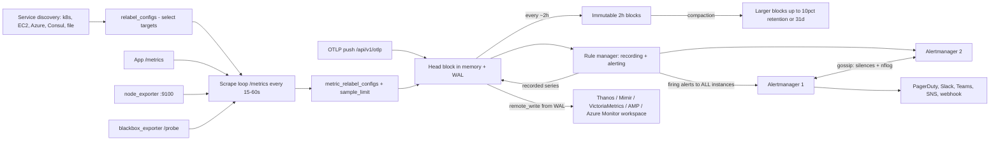
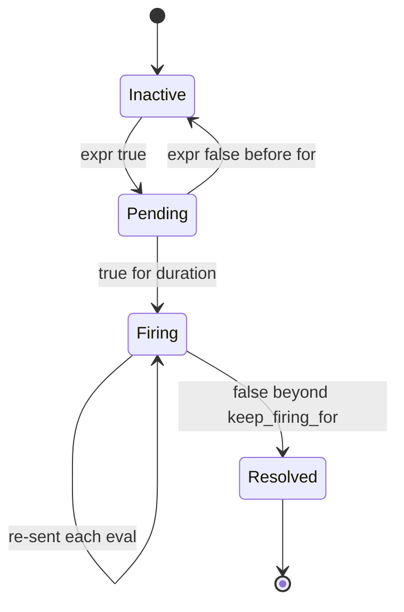

# O1 Prometheus (deep dive)
> Last verified: 2026-10 · Audience: senior/staff DevOps, SRE, AI eng, NetEng, DevSecOps, architects

Concepts (golden signals, burn-rate SLO alerts, a Prometheus architecture overview, cardinality as a cost driver, OTel histograms) are in [J2](../J-sre/J2-monitoring-and-alerting.md#j27-prometheus-architecture) and [J3](../J-sre/J3-observability.md#j32-metric-types-nativeexponential-histograms-exemplars). This file goes deeper on the tool itself.

## TL;DR
- **A series is a metric name plus a unique label set.** Cost is roughly proportional to **active series in the head block**, and series count is the **product** of each label's distinct values. A classic histogram multiplies that again by (buckets + 3).
- **Pull model** with service discovery and two relabelling stages. `relabel_configs` runs **before** the scrape and acts on targets. `metric_relabel_configs` runs **after** the scrape and acts on samples. Pushgateway is only for **service-level batch jobs**.
- **PromQL:** apply `rate()` **before** `sum()`, and make the range at least **4× the scrape interval**. Use `increase()` for humans, `irate()` only for spiky graphs, and `histogram_quantile` over `sum by (le)` (classic) or directly (native). Name recording rules `level:metric:operations`.
- **TSDB:** the in-memory **head** is protected by a **WAL** (128 MB segments). Data is cut into **2h blocks**, then compacted up to **10% of retention or 31d**, whichever is smaller. Default retention is **15d**, at about **1–2 bytes/sample**. A single node has no clustering and no built-in HA beyond running identical replicas.
- **Alertmanager:** a routing tree (`group_wait 30s` / `group_interval 5m` / `repeat_interval 4h` defaults), inhibition, silences, and **gossip HA**. Every Prometheus sends to **all** Alertmanagers, with no load balancer in between.
- **Prometheus 3.x** (3.0 Nov 2024; latest **3.15.0**, Sep 2026; **3.13** is LTS) brings UTF-8 names, an OTLP receiver, a new UI, left-open range selectors and stricter scrape Content-Type checks. **Native histograms are stable since v3.8**, but you still have to opt in with `scrape_native_histograms: true`.
- **Scale-out:** shard with `hashmod`, use agent mode plus **remote write** to **Thanos / Mimir / VictoriaMetrics** or managed services (**AMP**, **Azure Monitor workspace**, Grafana Cloud). Federate only aggregates.
- **On Kubernetes:** Prometheus Operator / kube-prometheus-stack CRDs (`ServiceMonitor`, `PodMonitor`, `PrometheusRule`, `Probe`, `ScrapeConfig`, `AlertmanagerConfig`). The classic pitfall is selector label mismatch, e.g. the Helm `release` label.

## O1.1 Data model and cardinality math
- **How it works:**
  - A sample is `(float64 or native histogram, ms timestamp)`. A series is identified by `__name__` plus labels, and **any** label change creates a new series.
  - Cardinality of one metric = ∏(distinct values per label), bounded by the combinations that actually occur. Example: `http_requests_total{method(5), route(50), status(10), pod(30)}` gives up to **75,000 series**.
  - A **classic histogram** with N buckets emits N+1 `_bucket` series (including `+Inf`) plus `_sum` and `_count`, so N+3 series per label set. 10 buckets × the labels above gives roughly **975k series**. A **native histogram** is **1 series** per label set.
  - **Churn:** pod/container/instance labels change on every rollout, and old series remain in the head until they are compacted out (up to about 3h). So the series count after a deploy can be roughly 2× steady state.
  - **Memory:** usually budgeted at a few KB per active head series (**rule of thumb, unverified**; measure `process_resident_memory_bytes / prometheus_tsdb_head_series` on your own build). Disk = retention_s × samples/s × 1–2 B.
  - 3.x allows **UTF-8** metric and label names. Quote them: `{"http.server.duration", "service.name"="api"}`. `metric_name_validation_scheme` defaults to `utf8`.
- **Trade-offs / when to use:**
  - Labels exist for **aggregation dimensions you will query by**. Identifiers (user/request/trace ID, raw URL, error message) belong in logs, traces or **exemplars**.
  - Bounded enums are good. Anything user-controlled is dangerous, because an attacker can blow up your TSDB with crafted paths.
- **Interview angles:**
  - "Estimate Prometheus sizing for 500 nodes" → series/node (node_exporter ≈ 500–1,500, **unverified/typical**) × nodes, plus app series. Divide by the scrape interval to get samples/s, then apply the disk formula. Add headroom for churn.
  - Follow-up "why not just add `user_id`?" → each value is a new series, so head memory, index size and query fan-out all grow without bound. Use an exemplar or a log line instead.

## O1.2 Metric types, native histograms, exemplars
- **How it works:**
  - **Counter:** monotonic and resets on restart. Always wrap it in `rate`/`increase`. Suffix `_total`.
  - **Gauge:** a current value. Use `*_over_time`, `delta`, `deriv`, `predict_linear`.
  - **Classic histogram:** cumulative `le` buckets fixed at instrumentation time. Aggregatable across instances.
  - **Summary:** client-side quantiles. **Not aggregatable** across instances (averaging p99s is meaningless). Only `_sum`/`_count` aggregate.
  - **Native histogram:** exponential sparse buckets, schema −4..8, plus a zero bucket. One series per label set, mergeable across standard schemas.
    - **Stable since v3.8.0.** `--enable-feature=native-histograms` is a **no-op since v3.9**. Scraping still requires `scrape_native_histograms: true` (default `false`), which makes Prometheus prefer the **classic protobuf** exposition format. OpenMetrics 2.0 text support is in progress.
    - Scraping and remote-writing native histograms by default is planned for v4 (per the spec).
    - `native_histogram_bucket_limit` / `native_histogram_min_bucket_factor` reduce resolution when a histogram has too many buckets.
    - `always_scrape_classic_histograms` (renamed from `scrape_classic_histograms` in 3.0) keeps the classic series during migration.
  - **NHCB (schema −53):** `convert_classic_histograms_to_nhcb: true` stores classic buckets as one native series. That gives a big series reduction with no instrumentation change, but NHCBs with different layouts don't merge.
  - **Exemplars:** a trace_id attached to a bucket or counter sample. Requires `--enable-feature=exemplar-storage` (still **experimental**), which stores them in a fixed-size circular buffer, plus an OpenMetrics or protobuf scrape. Grafana links them to Tempo/Jaeger.
- **Trade-offs / when to use:**
  - New latency SLIs → native histograms (accurate quantiles with exponential interpolation, about 10× fewer series). Brownfield → NHCB conversion. Summaries only when you need exact single-process quantiles.
  - Check every backend before switching. AMP caps native histograms at **200 buckets** per sample, **2048 B** per sample, and schema −4..8. Remote Write 2.0 carries them natively.
- **Interview angles:**
  - "p99 across 50 pods?" → `histogram_quantile(0.99, sum by (le) (rate(x_bucket[5m])))`. Never `avg(quantile)` from summaries.
  - "Why is my p99 exactly 0.5?" → it was interpolated inside a wide bucket. Classic quantile accuracy is bounded by bucket boundaries, which is the argument for native histograms.

## O1.3 Scraping, service discovery and relabelling
- **How it works:**
  - **Global defaults:** `scrape_interval: 1m`, `scrape_timeout: 10s`, `evaluation_interval: 1m`, `metrics_path: /metrics`, `honor_labels: false`, `honor_timestamps: true`. Most production setups set 15s–30s explicitly.
  - Every scrape yields synthetic series: `up`, `scrape_duration_seconds`, `scrape_samples_scraped`, `scrape_samples_post_metric_relabeling`, `scrape_series_added`.
  - **Service discovery (SD):** `kubernetes_sd_configs` (roles `node`, `pod`, `service`, `endpoints`, `endpointslice`, `ingress`), `ec2_sd_configs`, `azure_sd_configs`, `consul_sd_configs`, `dns_sd_configs`, `file_sd_configs`, `http_sd_configs`, plus Lightsail/ECS/MSK/ElastiCache/RDS, Nomad, Docker and others.
    - SD exposes `__meta_*` labels that are discarded after relabelling unless copied.
  - **`relabel_configs`** (target relabelling, before the scrape): select and drop targets, then build `__address__`, `__scheme__`, `__metrics_path__` and `__param_*`. Labels starting with `__` are dropped afterwards.
  - **`metric_relabel_configs`** (after the scrape, before ingest): drop expensive metrics or labels. **You still pay the scrape and parse cost.**
  - **Actions:** `replace`, `keep`, `drop`, `keepequal`, `dropequal`, `hashmod`, `labelmap`, `labeldrop`, `labelkeep`, `lowercase`, `uppercase`.
  - **Guardrails per job** (all default 0 = unlimited): `sample_limit`, `label_limit`, `label_name_length_limit`, `label_value_length_limit`, `target_limit`. When `sample_limit` is exceeded, the **whole scrape fails** and `up` = 0.
  - **3.0 strictness:** a scrape with a missing or unknown `Content-Type` now **fails**. Set `fallback_scrape_protocol` for broken exporters. Default ports are no longer appended to `__address__`.
  - **Pushgateway:** caches the last pushed value **forever** until deleted, is a single point of failure, and loses per-instance `up` health. Use it only for **service-level batch jobs**, scraped with `honor_labels: true`. Don't use it to turn Prometheus into push for ordinary services.
  - **Push alternatives:**
    - **OTLP receiver:** `--web.enable-otlp-receiver`, endpoint `/api/v1/otlp/v1/metrics`. Configure the `otlp:` block (`promote_resource_attributes`, `translation_strategy`, `keep_identifying_resource_attributes`) and set `storage.tsdb.out_of_order_time_window`.
    - **Remote-write receiver:** `--web.enable-remote-write-receiver`. These flags replaced 2.x feature flags.
- **Trade-offs / when to use:**
  - Pull gives free liveness (`up`), lets you curl a target to debug it, and makes the scraper control load. Push suits short-lived jobs, NAT/edge, and OTel-first shops.
  - Dropping a metric in `metric_relabel_configs` is a stopgap. The real fix is in the instrumentation or exporter flags (e.g. node_exporter `--no-collector.*`).
- **Interview angles:**
  - "Target missing from /targets" → it's an SD or `relabel_configs` problem: a `keep` didn't match, a port or annotation is missing, RBAC is missing for SD, or there's a namespace selector issue. Check **/service-discovery** to see dropped targets, and raise `keep_dropped_targets` to retain them.
  - "Target present but `up == 0`" → network or NetworkPolicy, TLS/auth, timeout (`scrape_duration_seconds` close to `scrape_timeout`), `sample_limit` exceeded, or Content-Type (3.x).

## O1.4 PromQL deep dive
- **How it works:**
  - **Instant vector:** one sample per series at evaluation time T. Looks back up to the **5m lookback delta** (`--query.lookback-delta`), and **staleness markers** end a series immediately when a target disappears.
  - **Range vector** `x[5m]`: all samples in **(T−5m, T]**, which is **left-open in 3.x**. Only functions accept range vectors, so you can't graph one directly.
  - **`rate(c[w])`:** per-second average over the window. It handles counter resets and **extrapolates** to the window edges, so `increase()` of an integer counter can be fractional. Needs at least 2 samples.
  - **`increase()`** = rate × window seconds. **`irate()`** uses only the last two samples: responsive but noisy, and **bad for alerts and recording rules**.
  - **Counter resets:** any decrease is treated as a reset to 0. You must **rate first, then aggregate**: `sum(rate(x[5m]))`, never `rate(sum(x)[5m:])`. Summing hides resets.
  - **Aggregation:** `sum by (svc) (...)` keeps the listed labels and `without (pod, instance)` drops them. `without` is safer because it keeps unforeseen labels such as `cluster`.
  - **Binary ops** match on identical label sets. Use `on()/ignoring()` with `group_left/group_right` for many-to-one joins, e.g. adding the `node` label from `kube_pod_info`.
  - **Modifiers:** `offset 1w` for week-over-week, `@ end()` / `@ <unix>` for a fixed evaluation time. Both were feature flags in 2.x and are default in 3.0.
  - **Subquery** `expr[30m:1m]` evaluates an instant expression over a range at a given step (default step = global evaluation interval). It's expensive, so prefer recording rules.
  - **Histograms:**
    - **Classic:** `histogram_quantile(0.99, sum by (le, svc) (rate(h_bucket[5m])))`. Native histograms drop the `_bucket` and the `le`.
    - `histogram_fraction(0, 0.3, ...)` gives the fraction of requests faster than 300 ms, which makes a good SLI. `histogram_count`/`histogram_sum`/`histogram_avg` work on native histograms.
    - Interpolation is linear for classic buckets and exponential for native ones. The result is `NaN` if there are fewer than 2 buckets, no `+Inf`, or 0 observations.
  - **Absence and prediction:** `absent(up{job="x"})` and `absent_over_time(...)` catch "metric vanished". `predict_linear(node_filesystem_avail_bytes[6h], 4*3600) < 0` predicts disk exhaustion.
  - **3.x renames and experimental functions:** `holt_winters` became `double_exponential_smoothing`, which is experimental and needs `--enable-feature=promql-experimental-functions`. Other experimental functions: `info()` (joins `target_info` resource attributes), `mad_over_time` and `ts_of_*_over_time`. In regex, `.` now matches newlines.
  - **Recording rules** are named `level:metric:operations`:
    - `job:http_requests:rate5m` = `sum without (instance) (rate(http_requests_total[5m]))`.
    - `job_route:http_request_duration_seconds:p99_5m`.
    - Drop `_total` once a rate is applied.
- **Trade-offs / when to use:**
  - **Window size:** at least 4× `scrape_interval`, so 1m for 15s scrapes; Grafana's `$__rate_interval` handles this. A larger window is smoother but slower to react.
  - **Recording rules** for anything on dashboards, in SLOs, or federated/remote-written. Alert on recorded series to keep evaluation cheap.
- **Interview angles:**
  - "Why does `increase()` return 2.97 for a counter that went up by 3?" → extrapolation to the window edges.
  - "Error ratio": `sum(rate(req_total{code=~"5.."}[5m])) / sum(rate(req_total[5m]))`. Pitfall: the division drops series whose label sets don't match. Aggregate both sides identically.
  - Anti-pattern: `rate()` on a gauge, or `sum()` before `rate()`.

## O1.5 TSDB internals: head, WAL, blocks, compaction, retention
- **How it works:**
  - **Ingestion and the head block:** samples go to the in-memory **head block** and are appended to the **WAL**. The WAL is written in 128 MB segments and always keeps at least 3 files, so that roughly the last 2h of raw data can be recovered.
  - **Chunks:** full chunks (about 120 samples is typical, **unverified** for 3.15's XOR2 encoding) are **mmapped** to disk (`chunks_head/`) to cut RSS.
  - **Block cut:** when the head spans about 1.5× the block range (~3h), the oldest **2h** is written as an immutable **block** (`chunks/` up to 512 MB segments, `index`, `meta.json`, `tombstones`), and the WAL is truncated and checkpointed.
  - **Compaction:** merges blocks into larger ones covering up to **10% of retention or 31d**, whichever is smaller. Deletes are tombstones until compaction rewrites the block.
  - **Retention:** `--storage.tsdb.retention.time` (default **15d** when no retention flag is set) and/or `--storage.tsdb.retention.size` (default off). Whole blocks are deleted. Keep the size limit at **≤ 80–85% of disk** to leave compaction headroom.
  - **Out-of-order samples:** `out_of_order_time_window` adds a **WBL** (write-behind log) and OOO head. Needed for OTLP, remote-write receivers and backfill.
  - **Restart:** WAL replay can take minutes at high series counts. The experimental `memory-snapshot-on-shutdown` flag speeds this up. Backfilling uses `promtool tsdb create-blocks-from openmetrics|rules`.
  - **Agent mode** (`--agent`, its own flag since 3.0): WAL only, with no local querying or rules, built purely for remote write.
- **Trade-offs / when to use:**
  - Local TSDB is fast and simple but **single-node**: no replication, and an NFS-backed volume is unsupported. Use local SSD or block storage and push long-term retention to object storage via Thanos/Mimir.
  - 3.0 changed the TSDB format, so you can only downgrade to **2.55+**.
- **Interview angles:**
  - "Prometheus OOMs after restart" → WAL replay of a churned head. Fix cardinality and churn, and give it memory headroom. The memory snapshot flag helps.
  - "Disk filled although retention is 15d" → the size limit wasn't set, compaction temporarily doubles space, or OOO/WBL is growing.

## O1.6 Alertmanager: routing, grouping, inhibition, silences, HA
- **How it works:**
  - **Prometheus rules** evaluate `expr` per `evaluation_interval`. `for:` moves alerts from pending to firing, and `keep_firing_for:` damps flapping on resolve. Prometheus re-sends active alerts and **does not notify itself**.
  - **Routing tree:** the root route with child routes matched in order. `continue: false` is the default, so the first match wins. `matchers` support UTF-8 and `= != =~ !~`.
  - **Grouping defaults:** `group_wait: 30s` (first notification), `group_interval: 5m` (updates to a group), `repeat_interval: 4h`. `group_by: ['...']` disables grouping. `resolve_timeout: 5m`.
  - **Inhibition:** `source_matchers` mute `target_matchers` when the `equal:` labels match, e.g. `ClusterDown` mutes all `cluster=X` alerts.
  - **Silences:** time-boxed matcher sets set via the UI or `amtool`. **Time intervals:** `mute_time_intervals` and `active_time_intervals` for business hours.
  - **Receivers:** email, Slack, PagerDuty, Opsgenie, MS Teams (v1 and **v2**), Jira, incident.io, Webex, Telegram, Discord, SNS, webhook, and others.
  - **HA:** run N instances with `--cluster.peer` gossip (default port 9094, **unverified**) that replicate silences and the **notification log**, so only one notification goes out.
    - Each Prometheus lists **all** Alertmanagers, with **no load balancer** in between.
    - `--alerts.per-alertname-limit` caps a runaway alert.
- **Trade-offs / when to use:**
  - Group by `alertname, cluster, service` to get one page per incident. Over-grouping hides distinct failures. `repeat_interval` too low causes noise, too high hides ongoing pain.
  - Inhibition beats silences for known dependency chains, because a silence is manual and easy to forget.
- **Interview angles:**
  - **"Flapping alerts":**
    - Add `for:` of at least 2–3 evaluation intervals and `keep_firing_for`.
    - Alert on `rate[5m]` rather than `irate`, or on a recording rule. Use hysteresis (different fire and clear thresholds) and SLO burn-rate alerts (J2.5).
    - Check scrape gaps: a missed scrape makes the series vanish, which resolves the alert.
  - "Duplicate pages in HA" → a load balancer is in front of Alertmanager, or the cluster isn't meshed (check `alertmanager_cluster_members`).

## O1.7 Prometheus Operator and kube-prometheus-stack
- **How it works:**
  - **CRDs** (`monitoring.coreos.com`):
    - `Prometheus`, `Alertmanager`, `ThanosRuler`, `ServiceMonitor`, `PodMonitor`, `Probe` and `PrometheusRule` are v1.
    - `PrometheusAgent`, `ScrapeConfig` and `AlertmanagerConfig` are v1alpha1 (AlertmanagerConfig also v1beta1). API versions are **unverified** for the latest operator release.
  - **ServiceMonitor** selects Services by label and scrapes their **Endpoints/EndpointSlices** by named port. **PodMonitor** selects pods directly (no Service needed, e.g. sidecars and DaemonSets). **Probe** drives blackbox-exporter for ingresses and static URLs. **ScrapeConfig** covers out-of-cluster targets and other SD types.
  - **Instance selectors:** the `Prometheus` CR picks up config objects through `serviceMonitorSelector`, `podMonitorSelector`, `ruleSelector`, `probeSelector`, `scrapeConfigSelector` and their `*NamespaceSelector` variants. An **empty `{}` matches all**, while **null/unset matches none** (or only the current namespace for namespace selectors).
  - **kube-prometheus-stack (Helm)** bundles the operator, Prometheus, Alertmanager, Grafana, node-exporter, kube-state-metrics, default rules and dashboards. By default it only selects monitors carrying the chart's `release: <name>` label, unless `serviceMonitorSelectorNilUsesHelmValues: false`.
- **Trade-offs / when to use:**
  - Monitoring as code per team: app teams own their `ServiceMonitor` and `PrometheusRule` objects next to their Deployments. Rules are validated by an admission webhook.
  - On managed clouds: Azure managed Prometheus supports its own Pod/ServiceMonitor CRDs (`azmonitoring.coreos.com`, **unverified**). AMP managed collectors take a Prometheus scrape config rather than CRDs (**unverified**).
- **Interview angles:**
  - **"I created a ServiceMonitor but nothing is scraped":**
    - Its labels don't match `serviceMonitorSelector` (the `release` label).
    - The namespace isn't selected.
    - The `port` name doesn't match the Service port **name**.
    - RBAC doesn't cover that namespace.
    - Check the generated config at `/config` and the targets at `/service-discovery`.

## O1.8 Exporters
- **How it works:**
  - **node_exporter (:9100):** host metrics (`node_cpu_seconds_total`, `node_memory_MemAvailable_bytes`, filesystem, network, pressure/PSI). Runs as a DaemonSet with hostPID/hostNetwork. Enable or disable collectors with flags. The **textfile collector** handles cron-job metrics, and is often a better fit than Pushgateway for per-host batch jobs.
  - **blackbox_exporter (:9115):** **black-box** probes (HTTP, TCP, ICMP, DNS, gRPC). Prometheus calls `/probe?target=X&module=http_2xx` through relabelling (`__param_target`). It outputs `probe_success`, `probe_duration_seconds`, and `probe_ssl_earliest_cert_expiry` for cert expiry alerts.
  - **kube-state-metrics (:8080):** Kubernetes **object state** from the API server (`kube_pod_status_phase`, `kube_deployment_status_replicas_available`, `kube_pod_container_status_restarts_total`). It does not report resource usage.
  - **cAdvisor:** container **resource usage** (`container_cpu_usage_seconds_total`, `container_memory_working_set_bytes`), embedded in the kubelet at `/metrics/cadvisor`. It produces lots of labels, so drop unused metrics. Join to pod metadata via kube-state-metrics.
  - Other ports: Pushgateway :9091, Alertmanager :9093, Prometheus :9090.
- **Trade-offs / when to use:** prefer native `/metrics` in apps (client libraries or the OTel Prometheus exporter) over sidecar exporters. Exporters suit third-party software: mysqld, postgres, redis, kafka (JMX), snmp_exporter for network gear.
- **Interview angles:** "Memory metric for OOMKill?" → `container_memory_working_set_bytes` (what the kubelet evicts on), not RSS or usage, which includes page cache.

## O1.9 Scaling: federation, sharding, remote write, long-term storage
- **How it works:**
  - **Vertical first:** one Prometheus comfortably handles single-digit millions of series on a large node (**rule of thumb, unverified**).
  - **Functional sharding** (one Prometheus per team or cluster) → **hashmod sharding** across replicas (`hashmod` on `__address__`, then `keep` where the modulus equals the shard index; the Operator `shards:` field does this).
  - **Federation** `/federate?match[]=` with `honor_labels: true`: pull **only recording-rule aggregates** to a global tier. Not for raw series or long-term storage.
  - **Remote write:** reads the WAL and streams to a remote store through a sharded queue (`queue_config` controls `capacity`, `max_shards`, `max_samples_per_send`). If the remote is down longer than the WAL keeps data (~2h), you lose data.
    - **Remote Write 2.0** adds metadata, exemplars, native histograms, created/start timestamps and string interning. The spec is still marked **experimental** in the storage docs.
    - HTTP/2 is **off by default since 3.0**.
  - **HA pair:** two identical Prometheus servers with an `external_labels` replica label. The backend dedupes them (Thanos query `--query.replica-label`, the Mimir/AMP **HA tracker**).
  - **Long-term backends** (details in O2):
    - **Thanos:** sidecar uploads 2h blocks to object storage, plus Querier, Store Gateway, Compactor (downsampling) and Ruler.
    - **Mimir/Cortex:** remote-write → distributor → ingesters → object storage, horizontally scalable and multi-tenant.
    - **VictoriaMetrics:** vminsert/vmstorage/vmselect, MetricsQL, high compression.
- **Trade-offs / when to use:**
  - Thanos sidecar keeps local querying and suits pull-heavy setups. Mimir/VM are push-first and centralised, which fits agent mode at the edges. Managed services (AMP, Azure, Grafana Cloud) trade per-sample cost for no operations.
  - With many clusters, use Prometheus agent mode or an OTel Collector in each cluster and send to one global store. Evaluate global rules there.
- **Interview angles:**
  - "Design monitoring for 200 clusters":
    - Each cluster runs an agent with low retention plus local rules for fast alerts.
    - Remote write to a multi-tenant Mimir or AMP (one tenant/workspace per environment).
    - A global ruler handles cross-cluster SLOs.
    - Grafana sits on top, with exemplars linking to traces.
  - Pitfall: alerting only from the central store adds ingest delay and a single point of failure. Keep critical alerts close to the data, and add a dead-man's-switch `Watchdog` alert.

## O1.10 Prometheus 3.x changes
- **3.0 (Nov 2024):**
  - **Default-on:** `@` modifier, negative offset, the new SD manager, `expand-external-labels`, `auto-gomemlimit`/`auto-gomaxprocs`, and **no default scrape port**.
  - **Became dedicated flags:** agent mode and the remote-write receiver.
  - **Behaviour changes:**
    - Range selectors are left-open.
    - Regex `.` matches newline.
    - `le`/`quantile` label values are normalised to floats, so `le="1"` becomes `le="1.0"`. This breaks hard-coded matchers.
    - Scrapes fail without a recognised Content-Type (`fallback_scrape_protocol`).
  - **Other changes:**
    - `holt_winters` became `double_exponential_smoothing`.
    - Alertmanager v1 API dropped (need AM ≥ 0.16).
    - Logging moved to `slog`.
    - New UI (the old one is kept behind the `old-ui` flag).
    - UTF-8 names and the OTLP receiver.
- **3.1–3.15 (2025–2026):**
  - **Native histograms stable (3.8).**
  - Created/start-timestamp work: `created-timestamp-zero-ingestion`, `st-storage`, `use-start-timestamps` (all experimental).
  - `type-and-unit-labels` adds `__type__` and `__unit__` labels.
  - OTLP delta handling: `otlp-deltatocumulative` and `otlp-native-delta-ingestion`.
  - Concurrent rule evaluation (`concurrent-rule-eval`).
  - UDS scraping, OM 2.0 parsing work (experimental), and an **LTS line (3.13.x)**.
  - Some details come from release-note summaries and are **unverified** individually.
- **Interview angles:** "Upgrading 2.x → 3.x checklist":
  - Upgrade to 2.55 first.
  - Grep dashboards and rules for `le="1"`-style matchers and `holt_winters`.
  - Add `fallback_scrape_protocol` for odd exporters.
  - Re-check aligned subqueries (left-open ranges).
  - Remove obsolete feature flags.
  - Make sure Alertmanager is ≥ 0.16.

## O1.11 Debugging runbook: cardinality, missing targets, flapping alerts
- **High cardinality / OOM:**
  - Run `prometheus_tsdb_head_series` and `rate(prometheus_tsdb_head_series_created_total[5m])` (churn).
  - Check `/tsdb-status` or `/api/v1/status/tsdb` for the top metrics, labels and label pairs.
  - Run `topk(10, count by (__name__) ({__name__=~".+"}))` and `count(count by (route) (http_requests_total))`, and use `promtool tsdb analyze`.
  - **Fix order:** instrumentation → `metric_relabel_configs` drop/`labeldrop` → `sample_limit`/`label_limit` guardrails → shard.
- **Missing targets:**
  - Not in `/service-discovery` → an SD or RBAC problem.
  - Dropped → a relabel `keep` didn't match.
  - `up==0` → see O1.3.
  - Scrape too slow → raise the timeout or split the job. Alert on `up == 0` **and** `absent(up{job="x"})`.
- **Remote write lag:**
  - Watch `prometheus_remote_storage_highest_timestamp_in_seconds - ignoring(remote_name, url) group_right prometheus_remote_storage_queue_highest_sent_timestamp_seconds`.
  - Watch `prometheus_remote_storage_samples_failed_total` and `..._shards_desired` > `max_shards`.
- **Rule evaluation:** watch `prometheus_rule_group_last_duration_seconds` > interval, which means missed evaluations (`prometheus_rule_group_iterations_missed_total`).
- **Flapping:** see O1.6. Also look for gaps in `scrape_duration_seconds` and target restarts (counter resets show up via `resets()`).

## Diagrams




## Cloud mapping: AWS vs Azure
| Capability | AWS | Azure | Role it plays | Key differences | Alternatives |
|---|---|---|---|---|---|
| Managed Prometheus store | **Amazon Managed Service for Prometheus (AMP)** workspace | **Azure Monitor managed service for Prometheus** → **Azure Monitor workspace** | Cortex/Mimir-style PromQL store with remote-write ingest | AMP: **50M active series default** (auto-scales from 2M, max 1.5B), 1.67M samples/s, retention configurable (150d default per J2). Azure: **1M active series / 1M events/min default** (raisable), **18-month fixed retention at no storage cost**, **case-insensitive** names/labels | Grafana Cloud (Mimir), Chronosphere, GCP Managed Service for Prometheus, self-run Mimir/Thanos/VM |
| Collection | **AMP managed collector** (agentless scraper for EKS incl. Fargate, plus MSK/OpenSearch; ENIs in your subnets, writes via VPC endpoint), ADOT / OTel Collector, or Prometheus agent + SigV4 remote write | **ama-metrics** (Azure Monitor agent add-on) on AKS/Arc driven by **DCR** + ConfigMaps (custom scrape jobs, Pod/ServiceMonitor CRDs); self-managed Prometheus remote write via DCR endpoint | Scrape + forward | AMP collector uses Prometheus scrape config. Azure DCR caps: 15k req/min, 50 GB/min per DCR | Grafana Alloy, OTel Collector, Prometheus agent mode |
| Rules | Rule groups namespaces (YAML upload); **2,000 rules/workspace**, min eval interval 30s | **Prometheus rule groups** (ARM/Bicep resources); **500 groups/workspace**, **20 rules/group (hard)**, 1m–24h interval | Recording + alerting rules | Azure rule groups are ARM resources scoped to cluster/workspace. AMP takes Prometheus-native YAML | Mimir ruler, Thanos Ruler |
| Alert routing | AMP **alert manager** (Alertmanager config; receiver **SNS only**, ≤100 inhibition rules, ≤1,000 alerts) | Prometheus alerts → **Azure Monitor alerts + action groups** (no Alertmanager) | Notify | AMP keeps Alertmanager semantics. Azure replaces them with action groups and alert processing rules | Self-hosted Alertmanager, Grafana Alerting, PagerDuty |
| Query / visualise | Amazon Managed Grafana, PromQL API (SigV4); query limits: 95-day range, 50M samples, 5 GB scanned per 24h span | Azure Managed Grafana, Azure Monitor dashboards with Grafana (preview), metrics explorer with PromQL; **32-day max query range**, 500k series/metric, 50M samples/query | PromQL consumers | Azure's 32-day range means long-range trends need recording rules or step aggregation | Grafana Cloud, self-hosted Grafana |
| Pricing shape | Samples ingested (tiered) + storage GB-month + **query samples processed** | Samples ingested + queries; **storage free** | Cost model | Both are per-sample: cardinality × scrape frequency drives cost | Chronosphere (control-plane aggregation to shape cost) |

- **AMP:**
  - A regional workspace, with data replicated across 3 AZs (per J2).
  - Ingest is throttled with a token bucket, and requests are **rejected whole**, not partially. Samples older than **1h are refused**. The out-of-order window defaults to **60s** (max 600s).
  - Native histograms are limited to **200 buckets** and schema −4..8.
  - Use **CloudWatch usage metrics** (`DiscardedSamples` with reason `rate_limited`) to alarm on throttling.
  - The HA tracker dedupes Prometheus replica pairs (up to 500 clusters).
- **Azure:**
  - The **Azure Monitor workspace** is separate from a Log Analytics workspace.
  - The **case-insensitivity** gotcha: `Foo` and `foo` collapse into one series.
  - The remote-write proxy sidecar handles about **150k series** per container.
  - Container insights and Prometheus recommended alerts are one-click.
- **Grafana Cloud / Chronosphere:** SaaS PromQL stores. Chronosphere's selling point is cardinality and cost control (aggregation rules before storage). Grafana Cloud offers Adaptive Metrics for the same goal (**unverified** naming). Both accept remote write and OTLP.
- **Kubernetes-native alternative:** kube-prometheus-stack plus Thanos or Mimir on any cluster (see O2). **Cloudflare** doesn't host Prometheus but exposes zone analytics via APIs that exporters scrape (**unverified**).

## Hands-on (optional)
```yaml
# docker-compose.yml — Prometheus + node_exporter + Alertmanager (pin versions in real use)
services:
  prometheus:
    image: prom/prometheus:latest
    ports: ["9090:9090"]
    volumes: ["./prometheus.yml:/etc/prometheus/prometheus.yml:ro", "./rules.yml:/etc/prometheus/rules.yml:ro"]
    command:
      - --config.file=/etc/prometheus/prometheus.yml
      - --storage.tsdb.retention.time=15d
      - --storage.tsdb.retention.size=8GB
      - --web.enable-otlp-receiver
      - --web.enable-lifecycle
  node-exporter:
    image: prom/node-exporter:latest
    pid: host
    volumes: ["/:/host:ro,rslave"]
    command: ["--path.rootfs=/host"]
  alertmanager:
    image: prom/alertmanager:latest
    ports: ["9093:9093"]
    volumes: ["./alertmanager.yml:/etc/alertmanager/alertmanager.yml:ro"]
```

```yaml
# prometheus.yml
global: {scrape_interval: 15s, evaluation_interval: 15s, external_labels: {cluster: lab, replica: a}}
rule_files: ["/etc/prometheus/rules.yml"]
alerting:
  alertmanagers: [{static_configs: [{targets: ["alertmanager:9093"]}]}]
scrape_configs:
  - job_name: node
    sample_limit: 5000
    static_configs: [{targets: ["node-exporter:9100"]}]
    metric_relabel_configs:
      - {source_labels: [__name__], regex: "node_scrape_collector_.*", action: drop}
  - job_name: prometheus
    scrape_native_histograms: true
    static_configs: [{targets: ["localhost:9090"]}]
```

```yaml
# rules.yml
groups:
  - name: node
    rules:
      - record: instance:node_cpu_utilisation:rate5m
        expr: 1 - avg without (cpu) (rate(node_cpu_seconds_total{mode="idle"}[5m]))
      - alert: NodeHighCPU
        expr: instance:node_cpu_utilisation:rate5m > 0.9
        for: 10m
        keep_firing_for: 5m
        labels: {severity: warning}
        annotations: {summary: "CPU > 90% on {{ $labels.instance }}", runbook_url: "https://runbooks/node-cpu"}
      - alert: DiskFullIn4h
        expr: predict_linear(node_filesystem_avail_bytes{fstype!~"tmpfs|overlay"}[6h], 4*3600) < 0
        for: 30m
        labels: {severity: page}
```

```yaml
# alertmanager.yml
route:
  receiver: default
  group_by: [alertname, cluster, instance]
  group_wait: 30s
  group_interval: 5m
  repeat_interval: 4h
  routes:
    - matchers: ['severity="page"']
      receiver: pager
inhibit_rules:
  - source_matchers: ['severity="page"']
    target_matchers: ['severity="warning"']
    equal: [alertname, instance]
receivers:
  - name: default
  - name: pager
    webhook_configs: [{url: "http://example.invalid/hook"}]
```

```bash
# Validate, then query
docker run --rm -v "$PWD":/w -w /w --entrypoint promtool prom/prometheus:latest check config prometheus.yml
docker run --rm -v "$PWD":/w -w /w --entrypoint promtool prom/prometheus:latest check rules rules.yml
docker run --rm -v "$PWD":/w -w /w --entrypoint amtool prom/alertmanager:latest check-config alertmanager.yml
docker compose up -d && curl -s -X POST localhost:9090/-/reload

promtool query instant http://localhost:9090 'sum by (job) (up)'
promtool query instant http://localhost:9090 'topk(10, count by (__name__) ({__name__=~".+"}))'
curl -s localhost:9090/api/v1/status/tsdb | jq '.data.seriesCountByMetricName[:5]'
curl -s 'localhost:9090/api/v1/targets?state=active' | jq -r '.data.activeTargets[] | "\(.labels.job) \(.health) \(.lastError)"'
promtool tsdb analyze /prometheus      # run inside the container against the data dir
amtool --alertmanager.url=http://localhost:9093 silence add alertname=NodeHighCPU --duration=2h --comment="maintenance"
```

PromQL cheat sheet (for the interview whiteboard):
```bash
cat <<'EOF'
sum without (instance, pod) (rate(http_requests_total[5m]))                     # throughput
sum(rate(http_requests_total{code=~"5.."}[5m])) / sum(rate(http_requests_total[5m]))   # error ratio
histogram_quantile(0.99, sum by (le, service) (rate(http_request_duration_seconds_bucket[5m])))  # classic p99
histogram_quantile(0.99, sum by (service) (rate(http_request_duration_seconds[5m])))   # native p99
histogram_fraction(0, 0.3, sum(rate(http_request_duration_seconds[5m])))              # % under 300ms (native)
rate(http_requests_total[5m]) / rate(http_requests_total[5m] offset 1w)                # week-over-week
max_over_time(rate(errors_total[1m])[1h:1m])                                           # subquery: worst minute last hour
kube_pod_info * on (namespace, pod) group_left(node) ...                               # many-to-one join idiom
absent(up{job="checkout"})                                                             # target vanished
EOF
```

## Cross-links
- [J2.7 Prometheus architecture](../J-sre/J2-monitoring-and-alerting.md#j27-prometheus-architecture) · [J2.5 burn-rate alerts](../J-sre/J2-monitoring-and-alerting.md#j25-multi-window-multi-burn-rate-slo-alerts)
- [J3.2 Metric types / native histograms](../J-sre/J3-observability.md#j32-metric-types-nativeexponential-histograms-exemplars) · [J3.3 Cardinality](../J-sre/J3-observability.md#j33-cardinality-management-and-cost)
- [O2 Grafana LGTM stack (Mimir, Thanos alternatives, Loki, Tempo)](./O2-grafana-lgtm-stack.md) · [O4 Datadog](./O4-datadog.md) · [O5 Zabbix](./O5-zabbix.md)
- [J1 SLIs/SLOs](../J-sre/J1-slis-slos-error-budgets.md) · [J4 Incident response](../J-sre/J4-incident-response-postmortems.md) · [N4 GitOps](../N-cicd-platform-engineering/N4-gitops-argocd-flux.md)

## Sources
- https://prometheus.io/docs/prometheus/latest/migration/
- https://prometheus.io/docs/prometheus/latest/storage/
- https://prometheus.io/docs/prometheus/latest/feature_flags/
- https://prometheus.io/docs/prometheus/latest/configuration/configuration/
- https://prometheus.io/docs/prometheus/latest/querying/basics/
- https://prometheus.io/docs/prometheus/latest/querying/functions/
- https://prometheus.io/docs/specs/native_histograms/
- https://prometheus.io/docs/guides/opentelemetry/
- https://prometheus.io/docs/alerting/latest/alertmanager/
- https://prometheus.io/docs/alerting/latest/configuration/
- https://github.com/prometheus/prometheus/releases
- https://prometheus-operator.dev/docs/getting-started/design/
- https://docs.aws.amazon.com/prometheus/latest/userguide/AMP_quotas.html
- https://docs.aws.amazon.com/prometheus/latest/userguide/AMP-collector.html
- https://learn.microsoft.com/en-us/azure/azure-monitor/metrics/prometheus-metrics-overview
- https://learn.microsoft.com/en-us/azure/azure-monitor/fundamentals/service-limits
