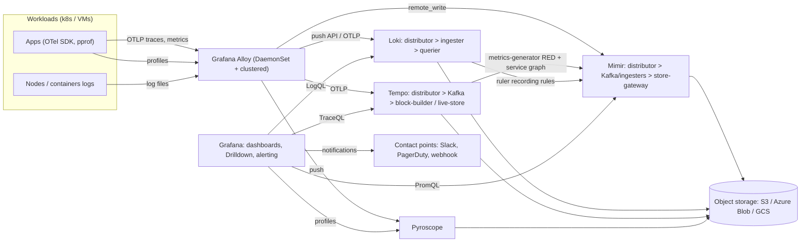
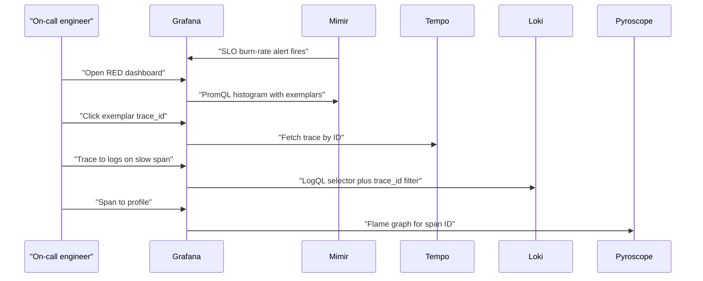

# O2 Grafana and the LGTM stack (Loki, Grafana, Tempo, Mimir + Alloy, Pyroscope)
> Last verified: 2026-10 · Audience: senior/staff DevOps, SRE, AI eng, NetEng, DevSecOps, architects

## TL;DR
- **LGTM** = **L**oki (logs), **G**rafana (UI/alerting), **T**empo (traces), **M**imir (metrics), plus **Pyroscope** (profiles) and **Alloy** (collector). Shared design DNA: **stateless distributors → hash-ring/Kafka-buffered write path → cheap object storage (S3/GCS/Azure Blob) as the system of record**, multi-tenancy via the `X-Scope-OrgID` header.
- **Loki indexes only labels, not log content** → orders of magnitude cheaper ingest/storage than Elasticsearch, but brute-force scanning at query time. Label **cardinality** is the #1 operational concern (aim 10–15 labels; default limit 15 index labels). High-cardinality data goes into **structured metadata**.
- **Alloy is the only forward-looking Grafana collector**: Promtail is **EOL since 2 Mar 2026**; Grafana Agent is EOL (Nov 2025, see O2.7). Alloy = OpenTelemetry Collector distribution + native Prometheus pipelines.
- **Version state (2026-10):** Grafana **13.x** (13.0 made **dynamic dashboards** and **Git Sync** GA; 13.2 current), **Mimir 3.x** (Kafka-based **ingest storage** + **Mimir Query Engine** default), **Tempo 3.x** (ingesters removed; Kafka + **block-builder/live-store**; TraceQL metrics GA), Loki **Simple Scalable mode deprecated** (removal planned for Loki 4.0).
- **Correlation is the selling point**: exemplars (metric → trace), trace → logs (shared labels/trace ID), trace → profiles (span profiles), logs → traces (derived fields).
- **Licensing**: Grafana, Loki, Tempo, Mimir (and Pyroscope) are **AGPLv3**; Alloy/agents/SDKs are Apache 2.0. Running unmodified internally is fine; AGPL bites only if you modify **and** offer it over a network.
- **Cost story vs ELK/Datadog**: LGTM is cheap on storage (object store, no full-text index) and has no per-host/per-GB vendor fees, but you pay in ops (rings, caches, compactors, Kafka) — or buy Grafana Cloud / Amazon/Azure Managed Grafana for the UI layer only.

## O2.1 Grafana core: data sources, dashboards, variables, dashboard design
- **How it works:**
  - Grafana stores **no telemetry**; it queries **data sources** (Prometheus/Mimir, Loki, Tempo, Pyroscope, Elasticsearch/OpenSearch, CloudWatch, Azure Monitor, SQL DBs, etc.) via backend plugins. Grafana's own state (users, dashboards, alert rules) lives in **SQLite by default** → use **PostgreSQL/MySQL** for HA (multiple Grafana replicas behind an LB, shared DB, plus shared/remote cache for alerting HA).
  - **Mixed** data source panels and **SQL Expressions** (12.0 private preview → maturing in 13.x) allow joining/transforming results across sources server-side.
  - **Variables** (query, custom, interval, data source, ad hoc filters, constant, text box). `$__interval`/`$__rate_interval` auto-scale step; **chained variables** (`cluster` → `namespace` → `pod`). 13.2 redesigned the query-variable editor.
  - **Drilldown apps** (Metrics/Logs/Traces Drilldown, GA in 12.0): **queryless** exploration — the modern replacement for writing ad hoc Explore queries.
  - Grafana **12.0**: Angular plugin support **removed**, Git Sync/new schema/dynamic dashboards experimental, SCIM preview. Grafana **13.0**: **dynamic dashboards GA and default** (new layout engine, tabs, conditional rows), **Git Sync GA**, **Grafana Advisor** health checks, **Grafana Assistant** (LLM) available on-prem, Image Renderer plugin support removed, HTTP compression on by default, tighter RBAC for custom roles; 13.0.0 had a Git Sync migration data-loss bug → go straight to ≥13.0.1.
- **Dashboard design (what interviewers want):**
  - **USE** (utilization/saturation/errors) for resources, **RED** (rate/errors/duration) for services, golden signals for SLO dashboards; top row = SLO/error-budget burn, then drill-down rows.
  - One dashboard **template** parameterized by variables rather than N copies; link dashboards with data links; keep queries cheap (recording rules in Mimir/Prometheus for heavy aggregations, avoid `.*` regex variables over huge cardinality).
  - Use `$__rate_interval` with `rate()` (≥4× scrape interval) to avoid gaps.
- **Trade-offs / when to use:** Grafana is the de-facto "single pane" across vendors; weakness is that it is only as fast as the slowest data source and dashboards sprawl without governance (folders, RBAC, dashboards-as-code).
- **Interview angles:**
  - "Grafana is slow" → it is almost always the data source query (cardinality, range, missing recording rules), not Grafana; check Query Inspector.
  - "How do you HA Grafana?" → stateless replicas + external SQL DB + HA alerting (gossip/Redis) + sticky-free auth (OIDC).
  - Pitfall: SQLite in production, dashboards edited only in UI (drift, no review).

## O2.2 Dashboards as code, folders and RBAC
- **How it works:**
  - **File provisioning**: YAML under `provisioning/datasources|dashboards|alerting|plugins` loaded at startup; dashboards loaded from JSON on disk (`allowUiUpdates: false` to block drift).
  - **Terraform `grafana/grafana` provider**: `grafana_folder`, `grafana_dashboard` (`config_json`), `grafana_data_source`, `grafana_contact_point`, `grafana_notification_policy`, `grafana_rule_group`, `grafana_team`, `grafana_folder_permission`, also Grafana Cloud stacks. Typical pair with **Grafonnet (Jsonnet)** or **Grafana Foundation SDK** to generate JSON.
  - **Git Sync** (experimental 12.0 → **GA in 13.0**): bidirectional sync between Grafana and a Git repo (GitHub, GitLab, Bitbucket; 13.2 adds GitLab/Bitbucket webhooks, GitHub Enterprise); UI edits become PRs. Backed by the new **resource-oriented, versioned dashboard APIs** (Kubernetes-style `apiVersion/kind`) and **dashboard schema v2**.
  - `grafanactl` / Observability-as-Code CLI for pulling/pushing resources (unverified naming detail).
- **Folders & RBAC:** Org → **folders (nestable)** → dashboards/alert rules/library panels. Basic roles **Viewer / Editor / Admin** (+ **No basic role**), plus **fine-grained RBAC** (Enterprise/Cloud; custom roles) and **teams** synced from IdP groups (Team Sync / SCIM). Permissions are granted at folder level and inherited. `editors_can_admin` removed in 12.0.
- **Trade-offs:** Terraform = drift detection + review, but JSON blobs are noisy diffs; Git Sync = UI-friendly GitOps but newer; file provisioning = simple but requires redeploy/restart patterns.
- **Interview angles:** "How do you stop dashboard sprawl?" → folders per team/service, RBAC at folder, dashboards-as-code in CI, library panels, ownership labels, delete unused (usage insights in Enterprise). Service accounts + tokens for automation (API keys are legacy).

## O2.3 Grafana unified alerting and contact points
- **How it works:**
  - **Grafana-managed alert rules** (query any data source, multi-dimensional — one rule → many alert instances per label set) vs **data-source-managed rules** (rules evaluated by Mimir/Loki **ruler**, notifications via Mimir Alertmanager). 12.0 GA: migration tool from DS-managed to Grafana-managed rules.
  - Pipeline: rule (query → expressions: reduce/math/threshold) → **pending period** → firing → labels → **notification policy tree** (label matchers, grouping `group_by`, `group_wait`, `group_interval`, `repeat_interval`, mute timings) → **contact point** (email, Slack, PagerDuty, Opsgenie, webhook, Teams, etc.) with **templates**. Alertmanager semantics under the hood.
  - **Silences** (ad hoc) vs **mute timings** (recurring) vs **active time intervals**. Recording rules can also be Grafana-managed.
  - Alert state in HA Grafana deduplicated via gossip/Redis peers.
- **Trade-offs:** Grafana-managed = one place for all sources (Loki + CloudWatch + SQL); DS-managed in Mimir = scales with the metrics backend and survives Grafana outage (better for critical paging). Many orgs page from Mimir/Prometheus ruler and use Grafana alerts for non-Prometheus sources.
- **Interview angles:** "Alert fatigue?" → page on **SLO burn rate** (multi-window), route by `severity`/`team` labels, group aggressively, inhibit downstream alerts. Cross-link [J2 Monitoring and alerting](../J-sre/J2-monitoring-and-alerting.md), [J1 SLOs](../J-sre/J1-slis-slos-error-budgets.md).

## O2.4 Loki architecture: label-indexed logs, chunks, deployment modes
- **How it works:**
  - A **stream** = unique label set. Index (**TSDB**, schema **v13**; boltdb-shipper deprecated) maps labels → **chunks** (compressed log lines, e.g. snappy/gzip) in object storage. No full-text index → ingest is cheap; queries **select streams by label, then grep chunks in parallel**.
  - Write path: **distributor** (validation, rate limits, hashes stream to ingesters via ring, replication factor typically 3) → **ingester** (builds chunks in memory, WAL, flushes to object store). Read path: **query-frontend** (splitting by time, sharding, results cache) → **query-scheduler** → **querier** (ingesters for recent + store) → **index-gateway** for index. **Compactor** (index compaction + retention/deletes), **ruler** (LogQL alerts/recording rules).
  - **Deployment modes:** **Monolithic** (single binary, `-target=all`, ~**20 GB/day**); **Simple Scalable (SSD)** — read/write/backend targets, ~1 TB/day — **deprecated, removal planned with Loki 4.0**; **Microservices** (each component separate, for very large clusters; Helm `loki` chart distributed mode). Interview answer in 2026: monolithic for small, microservices for production at scale.
  - Caches matter: results cache, chunks cache, index/query caches (memcached).
- **Trade-offs:** Excellent for "I know which service/namespace, show me errors"; poor for "find this string across all logs in 30 days" (brute-force scan cost) unless blooms/structured metadata help. Elasticsearch wins for ad hoc full-text and analytics; Loki wins on storage cost and operational simplicity of storage.
- **Interview angles:** "Why is Loki cheap?" → small index (labels only) + object storage + compression; cost moves to query time. Pitfall: ingester OOMs from too many streams; out-of-order writes (now accepted within a window, `unordered_writes` default true — (unverified) exact window).

## O2.5 Loki labels, cardinality, structured metadata, blooms, retention
- **Labels rules (official):** fewer labels, **aim 10–15 max**; **default limit 15 index labels** per stream; labels should be **bounded, stable, queried often** (cluster, namespace, app, env, level). **Never** label on user ID, request ID, IP, trace ID, timestamps. Each unique combination = a stream → many tiny chunks, ingester memory blow-up, slow queries.
- **Static vs dynamic labels:** static = set by the shipper from discovery (k8s metadata); dynamic = extracted from content — only if bounded (e.g. `level`, maybe `status_code` class).
- **Structured metadata:** per-line key/values **stored with the line but not indexed**; requires **schema v13 + TSDB** and `allow_structured_metadata: true` in `limits_config` (the docs say not enabled by default; check your version's default); limits **64 KB per line** and **128 entries per line**. Designed for **native OTLP ingestion** (resource/log attributes like `trace_id`, `k8s.pod.name`). Query: `{app="api"} | trace_id="abc123"` — filter happens after stream selection without label-cardinality cost.
- **Bloom filters:** **experimental** (public preview in Grafana Cloud for big customers); index **structured metadata keys and key=value pairs** so the bloom gateway can skip chunks for "needle in a haystack" queries. Components: **bloom planner** (single), **bloom builder** (scalable, ~4 MB/s/core), **bloom gateway** (consistent hashing, local SSD cache). Intended for ≥ **75 TB/month**; SSD or microservices only.
- **Retention:** done by the **compactor** (`retention_enabled: true`, needs `delete_request_store`, index period 24h). Default `retention_period: 0s` = **keep forever**. Per-tenant overrides and per-stream `retention_stream` (selector + priority, min 24h). Chunks deleted asynchronously after `retention_delete_delay` (default 2h). **Table Manager is deprecated**; don't rely on bucket lifecycle alone (index would point at deleted chunks) — or if you use bucket lifecycle, set it longer than Loki retention.
- **Interview angles:** "Team added `request_id` as a label and Loki fell over — fix?" → drop it as a label (relabel in Alloy), move to structured metadata or keep in line and use `|=`/parsers; check `loki_ingester_memory_streams`, per-tenant `max_global_streams_per_user`.

## O2.6 LogQL: stream selectors, filters, parsers, metric queries
- **Log queries:** `{namespace="prod", app=~"api|web"}` (selector, must have ≥1 positive matcher) → **line filters** `|= "error"`, `!= "health"`, `|~ "timeout|refused"` (put these first, cheapest) → **parsers** `| json`, `| logfmt`, `| pattern "<ip> - - <_> \"<method> <path> <_>\" <status>"`, `| regexp`, `| unpack` → **label filters** `| status >= 500`, `| duration > 1s` → **formatting** `| line_format "{{.method}} {{.path}}"`, `| label_format`, `| drop`/`| keep`. **Structured metadata** filtered like labels after the selector.
- **Metric queries:** range aggregations `count_over_time`, `rate`, `bytes_over_time`, `bytes_rate`, `absent_over_time`; unwrapped `sum_over_time`, `avg_over_time`, `quantile_over_time(0.99, ... | unwrap duration [5m])`; vector aggregations `sum by (app)`, `topk`. These power Loki ruler alerts and recording rules (remote_write to Mimir).
- Examples:
  - Error rate per app: `sum by (app) (rate({namespace="prod"} |= "level=error" [5m]))`
  - p99 latency from JSON logs: `quantile_over_time(0.99, {app="api"} | json | unwrap duration_ms [5m]) by (route)`
  - Top talkers: `topk(10, sum by (client_ip) (count_over_time({app="nginx"} | pattern "<client_ip> <_>" [1h])))`
- **Interview angles:** order of operations for performance: narrow selector → line filter → parser → label filter. Avoid `| json` before `|=` (parses every line). Grafana query splitting/sharding needs query-frontend.

## O2.7 Shippers: Grafana Alloy (replaces Agent and Promtail) and Fluent Bit
- **Alloy:** open-source (Apache 2.0) **OpenTelemetry Collector distribution with built-in Prometheus pipelines** and native Loki/Pyroscope support; one binary for metrics, logs, traces, profiles. Config in the **Alloy configuration syntax** (formerly "River", HCL-like) of **components** wired into pipelines (`discovery.kubernetes` → `discovery.relabel` → `loki.source.kubernetes` → `loki.process` → `loki.write`; `prometheus.scrape` → `prometheus.remote_write`; `otelcol.receiver.otlp` → `otelcol.processor.batch` → `otelcol.exporter.otlp`; `pyroscope.ebpf`). Built-in UI on :12345 with live component graph and debugging. Clustering mode shards scrape targets across Alloy replicas.
- **EOL facts:** **Promtail is EOL as of 2 March 2026** (commercial support ended, no updates; `lambda-promtail` exempt). **Grafana Agent** (Static/Flow/Operator) deprecated Apr 2024, LTS ended 31 Oct 2025 → **EOL 1 Nov 2025** (per Grafana Labs announcement; date not re-fetched this pass — (unverified)). Migration: `alloy convert --source-format=promtail|static|prometheus|otelcol` (unverified exact flag list).
- **Fluent Bit:** CNCF, C-based, very low footprint, ubiquitous on EKS/AKS/GKE (AWS for Fluent Bit image; Azure Container Insights historically Fluent Bit-based), has a **Loki output plugin** and OTLP output; good when one DaemonSet must fan out to Loki + CloudWatch + Elasticsearch + Kafka.
- **Trade-offs:** Alloy = tight LGTM integration (k8s discovery, relabeling identical to Prometheus, profiles) and OTel-native; Fluent Bit = vendor-neutral, battle-tested, smallest memory; OTel Collector (upstream/contrib) = most neutral for traces/metrics.
- **Interview angles:** "Where do you enforce label hygiene?" → at the collector (relabel/drop, `loki.process` stages), plus Loki per-tenant limits as the backstop. Pitfall: shipping `/var/log/containers` with multiline stack traces split per line — use multiline stage.

## O2.8 Tempo: object-storage tracing, TraceQL, metrics-generator
- **How it works (Tempo 3.x):**
  - **Distributor** receives **OTLP, Jaeger, Zipkin**, enforces per-tenant limits. **Microservices mode: distributor writes to Kafka** (durable WAL); **block-builder** consumes Kafka and writes **Apache Parquet** blocks (vParquet4/**vParquet5**, production-ready in 3.0) to object storage; **live-store** holds recent traces in memory for queries. **Monolithic**: in-process push to live-store and metrics-generator. **Ingesters removed in 3.0**; **compactor replaced by backend scheduler + workers** (compaction, retention, blocklist). Migration helper: `tempo-cli migrate config`.
  - Read path: **query-frontend** shards searches into jobs → **queriers** read live-stores + Parquet blocks (columnar → read only needed columns). Storage: **S3, GCS, Azure Blob**. Only index-free trace-ID lookup + Parquet columnar search; no Elasticsearch/Cassandra.
- **TraceQL:** span-set selection language: `{ resource.service.name = "checkout" && span.http.response.status_code >= 500 }`, `{ duration > 2s && name = "GET /cart" }`, structural operators `>>` (descendant), `>` (child), `~` (sibling): `{ resource.service.name="frontend" } >> { status = error }`; aggregates `| count() > 3`, `| avg(duration) > 1s`, `select(span.db.statement)`. **TraceQL metrics (GA in 3.0)**: `{ resource.service.name="api" } | rate() by (span.http.route)`, `| quantile_over_time(duration, .99)`, with comparison operators (e.g. filter services > 10 req/s). 3.0 changed semantics of `!=`/`!~` on array attributes.
- **Metrics-generator:** processors **service-graphs** (edges between client/server spans → `traces_service_graph_request_total`, `..._failed_total`, duration histograms), **span-metrics** (RED: `traces_spanmetrics_calls_total`, `traces_spanmetrics_latency` histogram by service/span name/kind/status + configured dimensions), **host-info**; remote-writes to Mimir/Prometheus with `X-Scope-OrgID`; exemplars point back to trace IDs. Cardinality controls in 3.0: per-label limits and **DRAIN-based span name sanitization**.
- **Trade-offs:** cheapest trace storage (object store, no index) → you can afford **100% or high sampling**; search by arbitrary attributes is slower than an indexed store unless promoted to **dedicated columns** (up to 20 per scope in vParquet5). Tail sampling still lives in the collector (Alloy/OTel `tail_sampling`).
- **Interview angles:** "Head vs tail sampling?" → head is cheap but drops the interesting errors; tail sampling needs all spans of a trace on one collector (load-balancing exporter by trace ID). "Service map without instrumenting dependencies?" → service-graph processor infers from client/server spans (and peer attributes for uninstrumented DBs).

## O2.9 Mimir: horizontally scalable Prometheus
- **How it works:**
  - Prometheus-compatible long-term store (remote_write in, PromQL out), **multi-tenant** via `X-Scope-OrgID`. Data stored as **Prometheus TSDB blocks (2h)** in object storage, compacted to larger ranges.
  - **Write path (classic):** **distributor** (validate, HA-dedupe Prometheus pairs via `cluster`/`__replica__` labels, rate-limit, shard by series hash) → **ingesters** with **replication factor 3**, write succeeds on **quorum (2 of 3)**; ingesters keep head block + WAL and upload blocks every 2h. **Read path:** **query-frontend** (split by day, sharding, results cache) → **query-scheduler** → **querier** (ingesters for recent data, **store-gateways** for blocks in object storage, using bucket index + index-header). **Compactor** (merge/dedupe blocks, retention), **ruler**, **Alertmanager** (multi-tenant).
  - **Hash ring:** consistent hashing over 32-bit token space; used by ingesters, store-gateways, compactors, (optional) rulers and Alertmanagers; ring state shared via **memberlist (default)**, Consul or etcd. **Zone-aware replication** places replicas across AZs; a healthy ring is needed even for reads in classic mode.
  - **Mimir 3.0:** **ingest storage architecture** — distributors write to **Kafka**; ingesters consume asynchronously, decoupling read and write paths (classic still exists/selectable; docs list classic as default in microservices mode — confirm per version). **Mimir Query Engine (MQE)** is default (up to 92% less peak memory vs Prometheus engine; `-querier.query-engine=prometheus` to revert); read-write deployment mode removed; experimental **Remote-Write 2.0** and OTLP delta ingestion. Latest docs: **v3.2**.
  - **Limits (per tenant, runtime overrides file):** `ingestion_rate`, `ingestion_burst_size`, `max_global_series_per_user`, `max_global_series_per_metric`, `max_label_names_per_series`, `max_fetched_chunks_per_query`, `max_query_lookback`, `compactor_blocks_retention_period`, `ruler_max_rules_per_rule_group`. **Shuffle sharding** isolates noisy tenants to a subset of ingesters/queriers.
- **Trade-offs:** vs **Thanos** (sidecar/receive, more pieces, keeps Prometheus as ingester) and **Cortex** (Mimir is the Cortex fork); vs managed **AMP / Azure Monitor managed Prometheus** (no ops, per-sample pricing, fewer knobs).
- **Interview angles:** "Ingester OOM after a deploy" → cardinality explosion (new label); use cardinality API / `cortex_ingester_memory_series`, enforce `max_global_series_per_metric`, drop at Alloy. "Why RF=3 and quorum?" → tolerate 1 ingester loss without data loss/write failure; during rollout restart one zone at a time. Cross-link [O1 Prometheus](O1-prometheus.md).

## O2.10 Pyroscope: continuous profiling
- **How it works:** multi-tenant continuous-profiling aggregation system (Phlare + acquired Pyroscope merged, Mimir-like architecture, object storage). Ingest via **push** (language SDKs: Go, Java, .NET, Python, Ruby, Node, Rust) or **pull** (Alloy `pyroscope.scrape` of Go pprof endpoints) or **eBPF** (Alloy `pyroscope.ebpf`, whole-host, no code change, best for compiled languages). Profile types: CPU, alloc/in-use memory, goroutines, mutex, block, lock contention (language-dependent). Flame graphs, diff/compare time ranges.
- **Span profiles:** SDK tags profiles with span IDs → from a slow span in Tempo jump straight to its CPU/memory flame graph (native in Tempo 3.0 + Grafana traces-to-profiles).
- **Trade-offs:** low overhead (typically ~1–5% for sampling profilers, (unverified) general figure) vs huge diagnostic value for "latency regressed but no errors"; eBPF has no language-level symbols for some runtimes.
- **Interview angles:** "Fourth pillar?" → profiles answer *why* the code is slow once traces say *where*; use for cost optimization (CPU hot paths) too.

## O2.11 Signal correlation: exemplars, trace↔logs, trace↔profiles
- **Metrics → traces:** **exemplars** — trace IDs attached to histogram samples (OpenMetrics; Prometheus `--enable-feature=exemplar-storage`, Mimir stores them per tenant); Grafana shows exemplar dots linked to a Tempo data source.
- **Traces → logs:** Tempo data source **"trace to logs"** maps span/resource attributes (`service.name`, `k8s.pod.name`) to Loki labels and time-shifts the window; or filter by `trace_id` in structured metadata. **Traces → metrics**: generated span-metrics queries. **Traces → profiles**: span profiles.
- **Logs → traces:** Loki **derived fields** (regex or structured metadata `trace_id`) create a link to Tempo.
- **Prerequisite:** **consistent resource attributes** across signals (OTel semantic conventions; same `service.name`, `cluster`, `namespace` labels from the same Alloy discovery) — correlation fails silently when label names diverge.
- **Interview angles:** walk the incident flow: SLO burn alert → dashboard → exemplar → trace → slow span → logs for that trace → profile for that span. Cross-link [J3 Observability](../J-sre/J3-observability.md).

## O2.12 LGTM vs ELK vs Datadog; AGPLv3 and Grafana Cloud
| Dimension | LGTM (self-hosted) | Elastic Stack (ELK) | Datadog |
|---|---|---|---|
| Log indexing | Labels only; content scanned at query | Full inverted index on content | Indexed on ingest; "Flex"/archives tiers |
| Storage | Object store (S3/Blob/GCS) | Local/hot-warm-cold SSD + searchable snapshots | Vendor SaaS |
| Cost shape | Compute + object storage; ops headcount | Heavy compute/disk for index; license tiers | Per host, per GB ingested + per million indexed events, per span |
| Strength | Cheap high-volume logs/traces, PromQL native, correlation in Grafana | Ad hoc full-text, SIEM, analytics | Zero ops, polished APM/RUM/security, 900+ integrations |
| Weakness | Needle searches over large ranges, many moving parts | Index cost, cluster ops (shards, JVM) | Cost at scale, lock-in, custom metric pricing |
- **Licensing:** April 2021 Grafana Labs moved **Grafana (8.0+), Loki (2.3+), Tempo (1.0+)** from Apache 2.0 to **AGPLv3**; **Mimir** launched as AGPLv3 (2022); Pyroscope AGPL (unverified for current version). **Apache 2.0** retained for **Alloy/Agent, plugins SDKs, client libraries, Grafonnet**. AGPL §13 obligation triggers when you **modify** the software and let users interact with it **over a network** → must offer source of modifications. Internal unmodified use = no obligation; many legal teams still restrict AGPL — Grafana Enterprise (commercial license) is the escape hatch.
- **Grafana Cloud:** SaaS LGTM + Pyroscope + k6 + IRM (OnCall/Incident) + Frontend/App Observability; usage-based pricing (active series, GB logs/traces/profiles, users) with free tier; **Adaptive Metrics/Adaptive Logs** reduce unused cardinality/volume. Self-hosted LGTM ≈ Grafana Cloud backend code (Grafana Enterprise Metrics/Logs/Traces are the commercial self-managed builds).
- **Interview angles:** "Choose for 5 TB/day logs, small platform team" → Loki on object storage (or Grafana Cloud) for cost; keep Elastic/OpenSearch only for security/full-text analytics use cases. "Datadog bill exploded" → custom metrics cardinality + indexed logs; mitigate via exclusion filters/tiers or move bulk logs to Loki. Cross-link [O3 Elastic](O3-elastic-stack.md), [O4 Datadog](O4-datadog.md).

## Diagrams




## Cloud mapping: AWS vs Azure
| Capability | AWS | Azure | Role it plays | Key differences | Alternatives |
|---|---|---|---|---|---|
| Managed Grafana UI | **Amazon Managed Grafana (AMG)** workspaces | **Azure Managed Grafana** (Standard X1/X2) | Hosted Grafana, SSO, AWS/Azure data sources | AMG: per **active user** (editor/viewer) pricing, IAM Identity Center or SAML, limited version list. Azure: per instance-hour + per active user, **Entra ID** auth, managed identity to data sources, zone redundancy, private endpoints; **Essential tier deprecated (no new; retired 31 Mar 2027)** | Grafana Cloud, self-hosted Grafana on EKS/AKS |
| Managed metrics backend (≈Mimir) | **Amazon Managed Service for Prometheus (AMP)** (Cortex-based) | **Azure Monitor managed service for Prometheus** (Azure Monitor workspace) | Prometheus remote_write + PromQL, no ring ops | Both per-sample ingested + query pricing; AMP uses SigV4 remote_write; Azure integrates with Container Insights/AKS add-on | Self-hosted Mimir/Thanos, Grafana Cloud Metrics |
| Object storage for L/T/M/P | **S3** (+ **EKS Pod Identity** or IRSA role) | **Blob Storage** (+ **Entra Workload ID** federated credential on a user-assigned managed identity) | Chunk/block system of record | S3 strong consistency, request pricing matters (many small GETs → use caches); Blob: hot/cool tiers, Loki/Mimir `azure` backend config uses account + `use_federated_token` (workload identity) | GCS + Workload Identity |
| Kafka buffer (Mimir 3 / Tempo 3) | **Amazon MSK** | **Event Hubs (Kafka API)** | Durable write-ahead log decoupling read/write | Event Hubs Kafka compatibility is partial — check client features; MSK is real Kafka | Confluent Cloud, self-managed Kafka/Strimzi |
| Log store alternative | **CloudWatch Logs** (Logs Insights) | **Log Analytics workspace** (KQL) | Managed logs | CloudWatch per-GB ingest + storage, Infrequent Access class; Log Analytics per-GB with Analytics/Basic/Auxiliary plans and commitment tiers | Loki, Elastic/OpenSearch, Datadog |
| Tracing alternative | **AWS X-Ray** / CloudWatch Application Signals | **Application Insights** (Azure Monitor) | Managed APM/traces | Both accept OTel (ADOT / Azure Monitor OTel distro) | Tempo, Datadog APM |
| Collector | **ADOT** (AWS Distro for OTel), CloudWatch agent | **Azure Monitor Agent**, Azure Monitor OTel distro | Ship telemetry | Vendor-tuned OTel builds | Alloy, Fluent Bit, OTel Collector |
- **AMG** supports a limited set of Grafana versions per workspace (8.4, 9.4, 10.4 and a 12.x line — (unverified) exact current list); plugin management and Enterprise plugins are an add-on; VPC connectivity to reach private data sources. Good fit when data is CloudWatch/AMP/X-Ray/OpenSearch.
- **Azure Managed Grafana** Standard: X2 size supports **1,000 alert rules per org vs 500** on X1; downgrade X2→X1 unsupported; Grafana Enterprise is an optional add-on within Standard. Grafana dashboards also appear natively **inside Azure Monitor** (separate from the managed workspace).
- **Identity for object storage:** never use static keys in Loki/Tempo/Mimir configs on k8s. AWS: **EKS Pod Identity** association (or IRSA OIDC) giving the service account an IAM role scoped to the bucket. Azure: AKS OIDC issuer + **workload identity** federated credential; pod label `azure.workload.identity/use: "true"`; grant **Storage Blob Data Contributor** on the container.
- **Self-hosted LGTM vs native cloud:** native (CloudWatch/Log Analytics) wins on zero-ops and IAM integration; LGTM wins on multi-cloud consistency, cost at high log volume, and PromQL/LogQL portability. Many orgs use AMG/Azure Managed Grafana as the UI over **both** native services and self-hosted Loki/Tempo.

## Hands-on (optional)
Local LGTM-lite: Grafana + Loki + Alloy + Prometheus (pin image tags in real use).

```yaml
# docker-compose.yaml
services:
  loki:
    image: grafana/loki:latest
    command: -config.file=/etc/loki/local-config.yaml   # bundled monolithic config, filesystem storage
    ports: ["3100:3100"]
  prometheus:
    image: prom/prometheus:latest
    command:
      - --config.file=/etc/prometheus/prometheus.yml
      - --web.enable-remote-write-receiver
      - --enable-feature=exemplar-storage
    volumes: ["./prometheus.yml:/etc/prometheus/prometheus.yml:ro"]
    ports: ["9090:9090"]
  alloy:
    image: grafana/alloy:latest
    command: run --server.http.listen-addr=0.0.0.0:12345 --storage.path=/var/lib/alloy/data /etc/alloy/config.alloy
    volumes:
      - ./config.alloy:/etc/alloy/config.alloy:ro
      - /var/run/docker.sock:/var/run/docker.sock:ro
    ports: ["12345:12345"]
    depends_on: [loki, prometheus]
  grafana:
    image: grafana/grafana:latest
    environment:
      GF_AUTH_ANONYMOUS_ENABLED: "true"
      GF_AUTH_ANONYMOUS_ORG_ROLE: Admin
    volumes: ["./datasources.yaml:/etc/grafana/provisioning/datasources/ds.yaml:ro"]
    ports: ["3000:3000"]
```

```yaml
# prometheus.yml
global: { scrape_interval: 15s }
scrape_configs:
  - job_name: alloy
    static_configs: [{ targets: ["alloy:12345"] }]
```

```yaml
# datasources.yaml (Grafana provisioning)
apiVersion: 1
datasources:
  - { name: Prometheus, type: prometheus, uid: prom, url: http://prometheus:9090, isDefault: true }
  - { name: Loki, type: loki, uid: loki, url: http://loki:3100 }
```

```hcl
// config.alloy — Alloy configuration syntax (HCL-like): tail Docker container logs into Loki
discovery.docker "local" {
  host = "unix:///var/run/docker.sock"
}

discovery.relabel "containers" {
  targets = discovery.docker.local.targets
  rule {
    source_labels = ["__meta_docker_container_name"]
    regex         = "/(.*)"
    target_label  = "container"     // bounded, low-cardinality label
  }
}

loki.source.docker "default" {
  host          = "unix:///var/run/docker.sock"
  targets       = discovery.docker.local.targets
  relabel_rules = discovery.relabel.containers.rules
  forward_to    = [loki.write.local.receiver]
}

loki.write "local" {
  endpoint {
    url = "http://loki:3100/loki/api/v1/push"
  }
}
```

```bash
docker compose up -d
# Alloy pipeline UI: http://localhost:12345 ; Grafana: http://localhost:3000
export LOKI_ADDR=http://localhost:3100
logcli labels                                   # list label names
logcli labels container                         # values for one label
logcli series '{container=~".+"}'               # stream count = cardinality check
logcli query --since=15m --limit=50 '{container="loki"} |= "level=error"'
logcli query --since=1h 'sum by (container) (count_over_time({container=~".+"}[5m]))'
logcli query --tail '{container="grafana"} | logfmt | level="warn"'
# Loki readiness and ingester stream counts
curl -s localhost:3100/ready
curl -s localhost:3100/metrics | grep -E '^loki_ingester_memory_streams'
```

TraceQL examples (paste into Grafana Explore against a Tempo data source):
```text
{ resource.service.name = "checkout" && status = error }
{ span.http.route = "/api/cart" && duration > 500ms } | count() > 2
{ resource.service.name = "frontend" } >> { span.db.system = "postgresql" && duration > 200ms }
{ resource.service.name = "api" } | quantile_over_time(duration, .99) by (span.http.route)
```

Terraform: folder + dashboard + folder permission with the `grafana/grafana` provider.
```hcl
terraform {
  required_providers {
    grafana = { source = "grafana/grafana", version = "~> 4.0" } # check latest major
  }
}

provider "grafana" {
  url  = "http://localhost:3000"
  auth = var.grafana_sa_token          # service account token
}

variable "grafana_sa_token" { sensitive = true }

resource "grafana_folder" "payments" {
  title = "Payments"
}

resource "grafana_dashboard" "payments_red" {
  folder    = grafana_folder.payments.uid
  overwrite = true
  config_json = jsonencode({
    title = "Payments RED"
    uid   = "payments-red"
    templating = { list = [{ name = "app", type = "custom", query = "payments,ledger" }] }
    panels = [{
      type       = "timeseries"
      title      = "Error rate"
      gridPos    = { x = 0, y = 0, w = 12, h = 8 }
      datasource = { type = "loki", uid = "loki" }
      targets = [{
        refId = "A"
        expr  = "sum(rate({container=\"$app\"} |= \"level=error\" [$__auto]))"
      }]
    }]
  })
}

resource "grafana_folder_permission" "payments" {
  folder_uid = grafana_folder.payments.uid
  permissions {
    role       = "Viewer"
    permission = "View"
  }
}
```

## Cross-links
- [O1 Prometheus](O1-prometheus.md) — scraping, PromQL, remote_write that feeds Mimir.
- [J3 Observability](../J-sre/J3-observability.md) — pillars, OTel, sampling theory.
- [J2 Monitoring and alerting](../J-sre/J2-monitoring-and-alerting.md), [J1 SLIs/SLOs](../J-sre/J1-slis-slos-error-budgets.md).
- [O3 Elastic Stack](O3-elastic-stack.md), [O4 Datadog](O4-datadog.md) — comparison targets.
- [M4 Kafka at scale](../M-data-platforms/M4-kafka-at-scale.md) — Kafka buffers in Mimir 3 / Tempo 3.
- [L7 Zero trust & workload identity](../L-data-privacy-ai-security/L7-zero-trust-workload-identity.md) — Pod Identity / Entra Workload ID for bucket access.
- [N4 GitOps](../N-cicd-platform-engineering/N4-gitops-argocd-flux.md) — Git Sync / dashboards as code.

## Sources
- https://grafana.com/docs/grafana/latest/whatsnew/ (v12.0, v13.0, v13.2 pages)
- https://grafana.com/docs/loki/latest/get-started/labels/
- https://grafana.com/docs/loki/latest/get-started/labels/structured-metadata/
- https://grafana.com/docs/loki/latest/get-started/deployment-modes/
- https://grafana.com/docs/loki/latest/operations/bloom-filters/
- https://grafana.com/docs/loki/latest/operations/storage/retention/
- https://grafana.com/docs/loki/latest/send-data/promtail/
- https://grafana.com/docs/alloy/latest/introduction/
- https://grafana.com/docs/tempo/latest/introduction/architecture/
- https://grafana.com/docs/tempo/latest/release-notes/v3-0/
- https://grafana.com/docs/tempo/latest/metrics-from-traces/metrics-generator/
- https://grafana.com/docs/mimir/latest/references/architecture/deployment-modes/
- https://grafana.com/docs/mimir/latest/references/architecture/hash-ring/
- https://grafana.com/docs/mimir/latest/release-notes/v3.0/
- https://grafana.com/docs/pyroscope/latest/introduction/
- https://grafana.com/licensing/
- https://docs.aws.amazon.com/grafana/latest/userguide/what-is-Amazon-Managed-Service-Grafana.html
- https://learn.microsoft.com/en-us/azure/managed-grafana/overview
