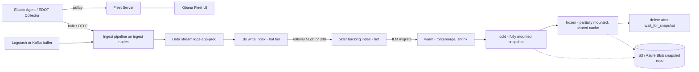
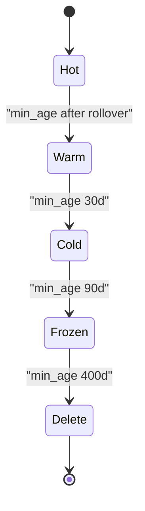

# O3 Elastic Stack (Elasticsearch, Kibana, Agent/Fleet, APM) for observability and security
> Last verified: 2026-10 · Audience: senior/staff DevOps, SRE, AI eng, NetEng, DevSecOps, architects

## TL;DR
- **Elastic Stack = Elasticsearch** (distributed Lucene store and search/aggregation engine) + **Kibana** (UI, alerting, Fleet, Security app) + collectors (**Elastic Agent/Fleet**, legacy **Beats**, **Logstash**, **EDOT**/OTel). The C6 notes introduce ELK. This file covers running it in production.
- Model time-series data as **data streams**: an append-only alias over hidden `.ds-*` backing indices, created from an **index template**, rolled over and aged by **ILM** (or the simpler data stream lifecycle) across **hot → warm → cold → frozen → delete** tiers. Frozen uses **partially mounted searchable snapshots** on object storage.
- **Shard sizing:** aim for **10–50 GB per shard** and **under 200M docs per shard**. The default cap is **1000 non-frozen shards per node**, and master nodes should hold **fewer than 3000 indices per GB of heap**. Too many small shards is the classic failure mode, so use rollover rather than daily indices.
- **JVM heap:** Xms = Xmx, **at most 50% of RAM**, and below the compressed-oops threshold (**about 26 GB is safe, up to about 30 GB on some systems**). The OS page cache needs the other half. Keep **3 master-eligible nodes**, and never stop half or more of the voting configuration at once.
- **Mappings matter most for cost and stability.** Use `keyword` for exact match and aggregations and `text` for full-text. Prevent **mapping explosion** with ECS/OTel semconv, `dynamic` controls, `flattened`, and the 1000-field limit.
- **Cost levers (2026):** **logsdb index mode** (default for new `logs-*-*` data streams in 9.0+, up to about **60% less storage**, with 10–20% indexing overhead), **synthetic `_source`**, TSDS and downsampling for metrics, and the frozen tier.
- **Query languages:** **KQL** (Kibana filter bar), **Lucene** syntax, **Query DSL** (JSON), **EQL** (event sequences, used by Security), and **ES|QL** (piped, GA, default 1000 rows and max 10,000).
- **Licensing:** Apache 2.0 until 7.10, then **SSPL/ELv2 from 2021**, which triggered AWS's Apache-2.0 **OpenSearch** fork. **AGPLv3 was added as a third option in 2024.** AWS offers managed **Amazon OpenSearch Service** but not managed Elastic. Azure has no first-party Elastic or OpenSearch service, only the **Elastic Native ISV** integration or Log Analytics / Data Explorer.

## O3.1 Stack components and reference architecture
- **How it works:**
  - **Elasticsearch:** a cluster of nodes with roles: `master`, `data_hot`, `data_warm`, `data_cold`, `data_frozen`, `data_content`, `ingest`, `ml`, `transform`, `remote_cluster_client`, and coordinating-only (no roles). An index is split into primary shards plus replicas, and each shard is a Lucene index made of immutable segments. Refresh (default 1s, skipped on search-idle shards) makes documents searchable. Flush plus the translog provide durability.
  - **Kibana:** a stateless UI and app server that stores its own state in system indices. It hosts Discover, Dashboards, Lens, Alerting, Fleet, APM/Observability, Security, ML, and Dev Tools. Scale it horizontally behind a load balancer.
  - **Collectors:** Elastic Agent (unified and Fleet-managed), Beats (Filebeat, Metricbeat, Packetbeat, Auditbeat, Heartbeat, Winlogbeat), Logstash (a heavyweight pipeline with persistent queues and many plugins), and EDOT/OTel collectors and SDKs.
  - **Typical production flow:** agents → (optional Kafka or Logstash buffer) → ingest nodes or pipelines → data streams → ILM tiers → Kibana. Data flows directly to Elasticsearch unless you need buffering, fan-out, or heavy transforms.
- **Trade-offs / when to use:**
  - Elastic is strong at full-text search plus analytics over semi-structured logs, at a single pane for logs, metrics, APM, and SIEM, and at ad-hoc high-cardinality queries.
  - Its weaknesses are ops burden (heap, shards, upgrades), storage cost of the inverted index plus doc values, and licensing nuance.
  - Deployment options: **Elastic Cloud Hosted** (you choose the version and capacity), **Elastic Cloud Serverless** (usage-based, always the latest version, no shard or ILM tuning), **ECK** (Elastic Cloud on Kubernetes operator), or self-managed.
- **Interview angles:**
  - If asked "ELK vs EFK", say that Fluentd/Fluent Bit replaces Logstash or Beats as the shipper, and that the storage and query layer is the same. See [C6 Technology stack](../C-large-scale-architecture/C6-technology-stack.md) (C6.43–C6.47).
  - Put **Kafka in front** when sources are bursty or numerous, when you need replay, or when several consumers read the same data (SIEM plus data lake). See [M4 Kafka](../M-data-platforms/M4-kafka-at-scale.md).
  - **Pitfall:** running masters on busy data nodes in large clusters. Use dedicated masters once you pass a handful of nodes or a high shard count.

## O3.2 Elastic Agent, Fleet and integrations (vs Beats)
- **How it works:**
  - **Elastic Agent** is one binary that runs inputs defined by an **agent policy**. Each policy is a set of **integrations**, for example System, Nginx, AWS, Azure, Kubernetes, and **Elastic Defend** (EDR).
  - An **integration package** installs index templates, ingest pipelines, ILM policies, and dashboards. Data lands in data streams named `type-dataset-namespace`, for example `logs-nginx.access-prod`.
  - **Fleet** is the central management UI in Kibana. **Fleet Server** is the control-plane endpoint that agents check in to. It reads policy changes from Elasticsearch and pushes them to agents, and it also handles remote upgrades and agent health.
  - **Modes:** Fleet-managed (recommended) or **standalone**, where you write the YAML yourself. Standalone suits GitOps or air-gapped setups.
  - **OTel convergence (verify):** Elastic Agent 9.2+ can run an embedded OTel Collector. The EDOT reference page states that from 9.5 the EDOT Collector capability is integrated into Elastic Agent.
- **Trade-offs / when to use:**
  - Agent gives one binary and one policy for logs, metrics, and security, with central rollout. Beats are still supported and are simpler for a single purpose, but each needs its own config management.
  - Fleet Server is a dependency: size it and make it highly available (HA). Agents keep running their last policy if Fleet Server is down.
- **Interview angles:**
  - If asked "how do you roll out log collection to 10k hosts", answer: Fleet agent policies per environment, enrollment tokens, staged upgrades, a namespace per team or environment for RBAC and retention, and no hand-edited configs.
  - **Pitfall:** one giant policy for everything. Split policies by OS, role, and environment.

## O3.3 Elastic APM, EDOT and OpenTelemetry ingest
- **How it works:**
  - **Elastic APM** consists of language agents (Java, .NET, Node.js, Python, Go, Ruby, PHP, plus RUM for browsers). They send data to **APM Server**, either as a binary or as the APM integration in Agent / the Cloud Integrations Server. APM Server writes to the `traces-apm*`, `metrics-apm*`, and `logs-apm*` data streams.
  - **OTLP intake:** the stack accepts OTLP natively, sent to APM Server or to the **Managed OTLP endpoint (mOTLP)** on Serverless and Cloud Hosted, so you don't run your own collector tier.
  - **EDOT (Elastic Distributions of OpenTelemetry)** are tested OTel distributions:
    - Collector (now part of Elastic Agent)
    - GA SDKs for .NET, Java, Node.js, PHP, Python, Android, and iOS
    - Browser SDK in technical preview
    - Cloud forwarders: AWS (GA), Azure and GCP (preview)
  - OTel data is stored in its **native OTel semantic conventions, not translated to ECS**. You need OTel content packs or dashboards, because the ECS-based Beats dashboards won't work on it.
  - Classic APM agents offer an OTel API **bridge**, which is partial.
  - Sampling: agents do head-based sampling. **Tail-based sampling** runs in APM Server or the collector and keeps errors and slow traces.
- **Trade-offs / when to use:**
  - For new instrumentation, prefer OTel/EDOT. It is vendor-neutral and lets you switch backends (Datadog, Grafana Tempo).
  - Classic agents offer some deeper Elastic-specific features but more lock-in.
  - Mixing ECS and OTel data means two schema worlds, so plan for field aliases or dashboard duplication.
- **Interview angles:**
  - "Is Elastic APM vendor lock-in?" Not if you instrument with OTel. Elastic is then just an OTLP backend.
  - Know where tail sampling lives and why it needs every span of a trace to reach the same sampler instance.
  - Cross-link: [J3 Observability](../J-sre/J3-observability.md) and [O2 Grafana LGTM](O2-grafana-lgtm-stack.md).

## O3.4 Data streams, index templates and rollover
- **How it works:**
  - A **data stream** is a named, append-only target backed by hidden indices named `.ds-<stream>-<yyyy.MM.dd>-<generation>`.
  - Every document needs `@timestamp`. Writes go to the current **write index**, and searches fan out across all backing indices.
  - Updates and deletes require `_update_by_query` / `_delete_by_query`, or a direct write to a specific backing index.
  - **Index templates** (composable, with `index_patterns`, `priority`, and `composed_of` component templates, plus `data_stream: {}`) define settings, mappings, ILM policy, and index mode.
  - Built-in templates match `logs-*-*`, `metrics-*-*`, `traces-*-*`, and `synthetics-*-*`. **Don't override them by accident with a higher-priority catch-all template.**
  - **Rollover** creates a new write index when a condition is met: `max_primary_shard_size` (for example 50gb), `max_age`, `max_docs`, or `max_primary_shard_docs`. Optional `min_*` conditions prevent tiny indices. A **forced rollover happens if any shard reaches 200M docs**.
  - The built-in ILM policies for logs and metrics typically roll over at **50 GB primary shard size or 30 days** (verify per version).
  - A **data stream lifecycle** (`lifecycle: {data_retention: "30d"}`) is a simpler alternative to ILM. Serverless uses it, and it has no tier movement.
- **Trade-offs / when to use:**
  - Use data streams for logs, metrics, traces, and events. Use a plain index plus alias for mutable entity data, such as an entity store or CMDB.
  - Size-based rollover gives uniform shards. Date-named daily indices create many tiny shards in quiet periods and huge ones on busy days.
- **Interview angles:**
  - Know the naming scheme `type-dataset-namespace` and why it exists. It lets you set retention and RBAC per namespace without new templates.
  - "Mapping change on a live data stream?" Update the template, then **manually roll over** (`POST <stream>/_rollover`). Existing backing indices keep their old mapping unless you reindex.

## O3.5 ILM, data tiers and searchable snapshots
- **How it works:**
  - **Phases and actions:**

    | Phase | Typical actions |
    |---|---|
    | Hot | rollover, set_priority, forcemerge, shrink, downsample, readonly, searchable_snapshot |
    | Warm | allocate/migrate, shrink, forcemerge, readonly, downsample |
    | Cold | searchable_snapshot (fully mounted), allocate/migrate, downsample |
    | Frozen | searchable_snapshot (partially mounted) only |
    | Delete | wait_for_snapshot, delete |

  - `min_age` counts **from rollover**, not from index creation, for rolled-over indices. ILM runs every `indices.lifecycle.poll_interval` (default 10m, from memory, so verify).
  - **Data tiers:** nodes declare roles such as `data_hot`. Indices carry `index.routing.allocation.include._tier_preference`, and ILM's implicit **migrate** action moves them between tiers.
  - **Searchable snapshots** require an **Enterprise license** on self-managed clusters:
    - **Fully mounted (cold):** the whole shard is copied to local disk, so search speed is close to a regular index. Index names get the prefix `restored-`.
    - **Partially mounted (frozen):** only a fixed **shared cache** on frozen nodes is kept locally, and cache misses fetch from the repository. Index names get the prefix `partial-`.
    - Neither needs replicas, because the snapshot repository (S3, Azure Blob, GCS, and others) provides resilience.
  - **Frozen capacity:** up to **3000 shards per dedicated frozen node**.
- **Trade-offs / when to use:**
  - Hot uses NVMe/SSD and a high CPU-to-disk ratio. Warm uses dense HDD or SSD.
  - Cold halves storage by dropping replicas. Frozen gives roughly object-storage cost with slow first queries, which fits compliance retention of 1–7 years.
  - Watch repository **GET/egress costs**. Elastic warns that searchable snapshots can cost *more* if reads from the repository are expensive.
- **Interview angles:**
  - "Keep 400 days of logs cheaply but searchable?" Answer: hot for 3–7 days, then optionally warm, then cold for about 30 days, then frozen to 400 days, then delete. Back the repository with S3 or Blob lifecycle rules, and use `wait_for_snapshot` before delete.
  - **Pitfall:** an ILM policy stuck in an `ERROR` step. Check `GET <index>/_ilm/explain` and retry with `POST <index>/_ilm/retry`.
  - Cross-link: [B5 Partitioning](../B-database-engineering/B5-database-partitioning.md).

## O3.6 Shard sizing and capacity planning
- **How it works (current guidance):**
  - **10–50 GB per shard** and **under 200M docs per shard**. The Lucene hard limit is about 2.147B docs per shard.
  - Default `cluster.max_shards_per_node` is **1000 non-frozen**, or **3000 per frozen node**.
  - Master nodes should hold **fewer than 3000 indices per GB of heap**.
  - Field-mapping heap overhead is measured with `_nodes/stats` `total_estimated_overhead`. The old "20 shards per GB of heap" rule is **retired**.
  - Search parallelism: one thread per shard. Too few shards limits parallelism, and too many adds per-shard overhead and cluster-state bloat.
- **Trade-offs / when to use:**
  - Raise primary shard count only for indexing throughput (aim for roughly one primary per hot node). Use **replicas for read scaling and HA**.
  - `_shrink` reduces shards in warm. `_split` exists but is rarely needed with rollover.
- **Interview angles:**
  - Sizing exercise: daily ingest × (1 + replicas) × retention × index overhead. With logsdb the overhead can be below 1×, and with plain `_source` and doc values it is about 1.1–1.5× (unverified heuristic). Divide by a disk watermark budget of about 85% low and 90% high, then decide hot vs frozen split.
  - Disk watermarks are **85% low** (no new shards allocated), **90% high** (shards relocated away), and **95% flood-stage** (indices set read-only). These defaults are from memory.
  - Cross-link: [J5 Capacity planning](../J-sre/J5-capacity-planning-load-testing.md).

## O3.7 Ingest pipelines vs Logstash (vs OTel Collector)
- **How it works:**
  - **Ingest pipelines** run processors on ingest-role nodes. Processors include grok, dissect, date, rename, set, geoip, user_agent, script (Painless), enrich, pipeline, reroute, and redact.
  - Supporting features:
    - `on_failure` handlers
    - `index.default_pipeline` and `final_pipeline` settings
    - The **failure store** routes rejected documents to a `::failures` side store instead of returning a 4xx (verify GA version)
    - **`reroute`** routes documents to other data streams by dataset or namespace
    - `_simulate` lets you test a pipeline
  - **Logstash** has input → filter → output stages, hundreds of plugins, persistent queues on disk, a DLQ, and multiple pipelines with pipeline-to-pipeline routing. It runs on the JVM, so it needs its own heap sizing.
- **Trade-offs / when to use:**

  | Need | Ingest pipeline | Logstash | OTel/EDOT Collector |
  |---|---|---|---|
  | Simple parse and enrich | Best (no extra tier) | Overkill | OK (transform processor) |
  | Buffering or back-pressure | No, relies on client retry | Persistent queue | Limited (file storage ext) |
  | Fan-out to non-Elastic sinks | No | Yes | Yes |
  | Heavy enrichment (JDBC, HTTP lookups) | enrich processor only | Yes | Limited |
  | Ops cost | Lowest | Highest | Medium |

- **Interview angles:**
  - Prefer **dissect over grok** for fixed formats, because it is faster and has no regex backtracking.
  - Watch for an ingest CPU bottleneck. Add dedicated ingest nodes or move parsing to the edge.
  - If you must send to a SIEM and to S3 at the same time, use Logstash, Kafka, or a collector.
  - Cross-link: [M6 Orchestration/ETL](../M-data-platforms/M6-orchestration-etl.md).

## O3.8 Mappings: keyword vs text, mapping explosion, ECS and OTel semconv
- **How it works:**
  - **`text`** is analyzed into tokens in the inverted index. Use it for full-text search; it has no aggregations by default.
  - **`keyword`** is not analyzed and has doc values. Use it for exact match, terms aggregations, and sorting.
  - Default dynamic string mapping is `text` plus a `.keyword` subfield with `ignore_above: 256`. That doubles cost for fields you never full-text search.
  - **Mapping limits:**
    - `index.mapping.total_fields.limit` defaults to **1000**
    - `depth.limit` defaults to 20
    - `nested_fields.limit` defaults to 50
    - `nested_objects.limit` defaults to 10000
  - Every new field updates the **cluster state**, which the master publishes to all nodes.
  - **Ways to prevent explosion:**
    - `dynamic: strict | false | runtime`
    - `flattened` type for arbitrary key/value blobs such as labels or headers
    - `subobjects: false`
    - Runtime fields (schema-on-read)
    - `match_only_text` for messages
    - `wildcard` type for grep-like matching on high-cardinality strings
  - **ECS (Elastic Common Schema)** standardizes names such as `host.name`, `source.ip`, and `event.category`, which lets prebuilt dashboards and detection rules work across sources. **ECS was donated to OpenTelemetry in 2023 and is converging with OTel semantic conventions.** OTel-native data in Elastic keeps OTel names, for example `service.name` and `resource.attributes.*`.
- **Trade-offs / when to use:**
  - Strict mappings give stable cost and early errors, but risk dropped or rejected data. Use them together with a failure store or DLQ.
  - `flattened` is cheap but treats every value as a keyword, so you lose numeric range queries.
- **Interview angles:**
  - "Cluster got slow and the master is unstable after a new app started logging JSON." Suspect a **mapping explosion**: unique keys such as user IDs or request IDs used as field names. Fix it with `flattened` or by moving those values under a key/value structure, and add a limit alert.
  - Cross-link: [B3 Indexing](../B-database-engineering/B3-database-indexing.md).

## O3.9 Query languages: KQL, Lucene, Query DSL, EQL, ES|QL
- **How it works:**
  - **KQL (Kibana Query Language)** is for filtering only: `service.name : "api" and http.response.status_code >= 500`. It supports wildcards and nested queries, but **no regex, fuzzy matching, or aggregations**.
  - **Lucene query syntax** adds regex `/.../`, fuzzy `~`, proximity, and boosting.
  - **Query DSL** is JSON with bool, must, filter, should, and must_not. Filter context is cached and does not score.
  - **EQL** expresses event sequences, for example `sequence by host.id [process where ...] [network where ...]`. Security uses it.
  - **ES|QL** is a piped language (`FROM logs-* | WHERE ... | STATS count() BY host.name | SORT ... | LIMIT ...`) served by the `_query` endpoint. It runs on its own compute engine rather than translating to Query DSL. It also supports `EVAL`, `ENRICH`, and `LOOKUP JOIN`; the JOIN GA version is unverified.
  - **ES|QL limits:** **1000 rows by default** and a maximum of **10,000** via `LIMIT`, configurable with `esql.query.result_truncation_max_size`. It does not support `nested`, `binary`, or `completion` fields. A query fails if any target shard is unassigned.
- **Trade-offs / when to use:**
  - KQL suits analysts in Discover. DSL suits applications. ES|QL suits ad-hoc analytics, computed fields, and detection rules.
  - **Don't confuse Kibana KQL with Azure's KQL (Kusto Query Language).** They are entirely different languages, and the clash is a common interview trap.
- **Interview angles:**
  - "Why is my query slow?" Look for leading wildcards on `keyword`, regex, deep pagination (use `search_after` with a PIT instead of `from`/`size` beyond 10k), high-cardinality terms aggregations, and too many shards per query. Investigate with the Profile API.

## O3.10 Cluster operations: quorum, heap, snapshots, CCR/CCS, upgrades
### Master quorum
- Decisions need **more than half of the voting configuration**. **3 master-eligible nodes tolerate 1 failure.** The cluster manages the voting configuration automatically, and an even count adds nothing.
- **Never stop half or more of the voting nodes at the same time.**
- `cluster.initial_master_nodes` is used only for the very first bootstrap. Remove it afterwards.
- A `voting_only` node can act as a cheap tiebreaker.
### JVM and OS
- Default auto heap sizing is recommended. If you set heap manually:
  - Xms must equal Xmx
  - Heap must be **at most 50% of RAM**
  - Heap must stay **below the compressed-oops threshold** (about 26 GB is safe, up to about 30 GB on some systems). Check that `using_compressed_ordinary_object_pointers` is true.
- **Bootstrap checks** are enforced in production mode:
  - `vm.max_map_count` of **at least 262,144** (1,048,576 recommended)
  - Enough file descriptors
  - At least **4096 threads**
  - Unlimited `fsize`
  - Heap min equal to max
  - Successful memory lock if `bootstrap.memory_lock` is set
- Also disable swap.
### Snapshots
- Snapshots are incremental at the segment level. **SLM (snapshot lifecycle management)** schedules them. A snapshot is the only valid backup; copying data directories is not. Repositories can be S3, Azure Blob, GCS, or a shared filesystem.
### CCS and CCR
- **CCS (cross-cluster search)** queries remote clusters (`remote:index`), which suits regional clusters with a global search view.
- **CCR (cross-cluster replication)** creates leader→follower indices, pull-based and active-passive. It is used for DR and for data locality, and it requires a paid tier (verify).
- Remote cluster connections use API keys (8.x and later) or certificates.
### Rolling upgrades
- **Steps per node:**
  1. Set `cluster.routing.allocation.enable` to `primaries`.
  2. Optionally flush.
  3. Upgrade the node and restart it.
  4. Re-enable allocation.
  5. Wait for green.
- **Order:** go tier by tier, **frozen → cold → warm → hot**, then other nodes, then **master-eligible nodes last**.
- **Version path:** for a major upgrade, first move to the last 8.x minor (8.19) and clear the Upgrade Assistant deprecations, then upgrade to 9.x. Indices created in 7.x must be reindexed or archived first.
- **Interview angles:**
  - **Red vs yellow:** red means a primary shard is unassigned and data is missing. Yellow means a replica is unassigned, which is normal on a single node.
  - Diagnose with `_cluster/allocation/explain`.
  - "Split brain?" It was impossible by design since 7.x Zen2 auto-managed voting. Before that, `minimum_master_nodes` was a common misconfiguration.

## O3.11 Elastic Security (SIEM) basics
- **How it works:**
  - Data comes from Agent integrations (cloud audit logs, IdP, firewall), **Elastic Defend** (EDR/XDR), and third-party feeds, all ECS-normalized.
  - **Detection rules** run as Kibana alerting tasks. Rule types include custom query (KQL/Lucene), EQL sequence, ES|QL, threshold, indicator match (threat intel), new terms, and ML anomaly. Elastic maintains a prebuilt rule set mapped to **MITRE ATT&CK**.
  - Alerts go to `.alerts-security*` indices. Investigation tools include **Timeline**, **Cases**, and entity analytics (risk scoring).
  - AI features include the AI Assistant and **Attack Discovery**, which correlates alerts using an LLM connector such as Claude, Azure OpenAI, or Bedrock.
- **Trade-offs / when to use:**
  - Elastic gives a SIEM on the same platform as observability, with ingest-cost economics you control and portable detection rules (open repository).
  - The cost is the tuning effort, and data retention cost is on you (use the frozen tier).
- **Interview angles:**
  - Compare with **Microsoft Sentinel** (Log Analytics-backed, Kusto KQL) and with **Splunk** / **CrowdStrike Falcon Next-Gen SIEM**. See [P2 CrowdStrike](../P-security-platforms-identity/P2-crowdstrike-edr-xdr.md).
  - Rule lookback must exceed the interval (add a gap) to avoid missing late-arriving events.

## O3.12 Cost control: logsdb, synthetic _source, TSDS, downsampling
- **How it works:**
  - **`index.mode: logsdb`** combines index sorting on `host.name` and `@timestamp`, synthetic `_source`, and specialized codecs. It is **GA in Stack 9.0+ and Serverless**, and is the **default for *new* `logs-*-*` data streams in 9.0+**.
    - An 8.x cluster upgraded to 9.x gets it only if no `logs-*-*` streams existed at upgrade time.
    - Benchmarks show **up to about 60% less storage** with **10–20% indexing overhead**.
    - `logsdb_columnar` is in preview from 9.5.
  - **Synthetic `_source`** (`index.mapping.source.mode: synthetic`) rebuilds `_source` from doc values and stored fields instead of storing the original JSON. It requires a subscription, which is unverified for self-managed tiers.
    - The rebuilt `_source` sorts fields alphabetically, flattens arrays of objects, and reduces geo precision.
    - Use `synthetic_source_keep: arrays|all` to keep exact structure for selected fields.
    - Fetching documents adds read latency.
  - **TSDS** (`index.mode: time_series`) is for metrics. It uses dimension and metric fields with routing by `_tsid`, and **downsampling** (for example from 10s to 5m to 1h) in ILM or the lifecycle shrinks old metrics.
  - **Other levers:**
    - `match_only_text`
    - Drop unused fields in pipelines
    - `index: false` or `doc_values: false` on fields you never query or aggregate
    - Fewer replicas in warm and none in cold or frozen
    - `best_compression` codec in warm
    - Force-merge to 1 segment after rollover
- **Trade-offs / when to use:**
  - Synthetic source breaks anything that needs byte-exact original documents, such as some reindex or update workflows and legal hold. Test before enabling it.
  - logsdb costs some ingest CPU in exchange for disk. That trade almost always pays off for logs.
- **Interview angles:**
  - "Log bill doubled. What do you do?"
    1. Measure per-dataset volume and identify the top talkers.
    2. Sample or drop debug logs at the edge.
    3. Enable logsdb.
    4. Shorten hot retention and push older data to frozen.
    5. Convert metrics-from-logs into TSDS.
    6. Consider routing raw data to S3 or Blob (cheap) and only enriched or security-relevant data to Elastic.
  - Cross-link: [K7 cost control](../K-ai-infra-llm/K7-ai-gateways-caching-cost.md) for the analogous LLM pattern.

## O3.13 Licensing history and the OpenSearch fork
- **How it works:**
  - **Up to 7.10:** Apache 2.0, with X-Pack features under the Elastic License.
  - **2021 (7.11+):** Elasticsearch and Kibana moved to dual **SSPL / ELv2**, aimed at cloud providers reselling Elastic as a service.
  - **AWS forked 7.10.2 as OpenSearch and OpenSearch Dashboards** under Apache 2.0. In 2024 OpenSearch moved to the **OpenSearch Software Foundation** under the Linux Foundation.
  - **Aug 2024:** Elastic **added AGPLv3** as a third option alongside SSPL and ELv2. In Shay Banon's words, "Elasticsearch and Kibana can be called Open Source again."
  - Paid features (searchable snapshots, CCR, ML, some security) still depend on the **subscription tier** (Free/Basic, Platinum, Enterprise), whatever the source license.
- **Trade-offs / when to use:**
  - ELv2 forbids offering the product as a managed service. AGPL lets you do so if you publish your modifications.
  - Internal use is fine under any of the three licenses.
- **Interview angles:**
  - "Can we self-host Elastic in our SaaS?" Internal use is fine. Exposing Elasticsearch itself as a service needs AGPL compliance or a commercial agreement. Get a legal check.
  - AWS-managed "Elasticsearch" stops at **7.10 legacy**. Anything newer on AWS is OpenSearch or Elastic Cloud via Marketplace.

## O3.14 Elastic vs OpenSearch vs Loki vs Datadog
| Dimension | Elastic | OpenSearch | Grafana Loki | Datadog Logs |
|---|---|---|---|---|
| Index model | Full inverted index plus doc values | Same (forked from 7.10) | **Labels only**; chunks in object storage, brute-force grep | SaaS index; Flex/archives tiers |
| Query | KQL, DSL, ES\|QL, EQL | DQL, DSL, **PPL**, SQL | LogQL | Datadog query syntax |
| Lifecycle | ILM / DSL, frozen searchable snapshots | **ISM**, UltraWarm/cold (AWS), remote-backed storage | Retention per tenant/stream | Retention per index, rehydrate from archive |
| Security | Elastic Security (SIEM + Defend) | Security Analytics plugin (Sigma rules), free security plugin (FGAC) | None native | Cloud SIEM |
| Cost shape | Infra or Elastic Cloud capacity / Serverless usage | Infra / AWS instance-hours, OCUs | Very cheap storage, query CPU at read time | Per GB ingested plus per million indexed events (unverified detail) |
| Licence | AGPL/SSPL/ELv2 + subscription | Apache 2.0 | AGPLv3 | Proprietary SaaS |
- **When to use:**
  - **Elastic:** search-heavy work, SIEM plus observability, high-cardinality ad-hoc queries.
  - **OpenSearch:** you need Apache-2.0 or AWS-native, plus vector search.
  - **Loki:** cheap high-volume logs when you mostly filter by labels and already run Grafana or Prometheus.
  - **Datadog:** zero ops and unified APM, at the price of a bill that scales with volume.
- **Interview angles:**
  - **Loki pitfall:** high-cardinality labels such as user IDs explode its stream count.
  - **Elastic pitfall:** shards and mappings.
  - **Datadog pitfall:** custom metrics and indexed-log pricing.
  - See [O2 LGTM](O2-grafana-lgtm-stack.md) and [O4 Datadog](O4-datadog.md).

## Diagrams




## Cloud mapping: AWS vs Azure
| Capability | AWS | Azure | Role it plays | Key differences | Alternatives |
|---|---|---|---|---|---|
| Managed search/log engine | **Amazon OpenSearch Service** (managed domains; legacy Elasticsearch up to 7.10) | **No first-party equivalent**; **Elastic Cloud on Azure (Azure Native ISV, `Microsoft.Elastic/monitors`)** | Hosted cluster for logs and search | AWS runs the OpenSearch fork; Azure partners with Elastic itself (Marketplace billing, Entra SSO) | Elastic Cloud on AWS (Marketplace + PrivateLink); ECK on EKS/AKS |
| Serverless | **OpenSearch Serverless** (collections: time series, search, vector; OCUs) | **Elastic Cloud Serverless** via the Native ISV (Search, Observability, Security, Vector DB) | No shard or node tuning | AOSS: separate indexing/search OCUs, S3 storage, no cross-Region, no manual snapshots, about 10s refresh | Elastic Serverless on AWS |
| Cheap tiers | **UltraWarm**, **cold storage**, **OpenSearch-optimized OR1/OR2/OM2/OI2** instances | Elastic **frozen tier** on Azure Blob | Low-cost retention | UltraWarm is read-only and S3-backed. OR* instances keep data in S3 synchronously, are irreversible, have a refresh of 10s or more, and need OS 2.11+ | Loki on Blob/S3 |
| Native log analytics (non-Elastic) | CloudWatch Logs (Logs Insights) | **Azure Monitor Log Analytics**, **Azure Data Explorer** (Kusto KQL) | First-party log store | Azure's answer to "managed OpenSearch" is Log Analytics or ADX, not a fork | Datadog, Grafana Cloud |
| Ingest | **OpenSearch Ingestion** (Data Prepper, OCUs), Data Firehose | Event Hubs → Elastic Agent/Logstash; Native ISV diagnostic-log forwarding (tag rules) | Pipeline into the cluster | Native ISV auto-routes activity and diagnostic logs | Kafka/Confluent, OTel Collector |
| SIEM | OpenSearch Security Analytics; Security Lake (OCSF) | **Microsoft Sentinel** | Detections and investigation | Sentinel is first-party on Log Analytics | Elastic Security, CrowdStrike, Splunk |
| Snapshots | S3 repository (automated hourly snapshots on AOS) | Azure Blob repository | Backup and searchable snapshots | AOS automated snapshots are managed. Self-managed uses SLM | GCS |
| Private access | VPC domains, PrivateLink to Elastic Cloud | Private Link / traffic filters on Elastic Native ISV | No public endpoint | | Cloudflare Tunnel (self-managed) |

- **Amazon OpenSearch Service:**
  - Domain = cluster. Supports **OpenSearch 1.0–3.5** and **legacy ES 1.5–7.10**, with up to **1002 data nodes** and 25 PB.
  - Multi-AZ across 2–3 AZs with no inter-AZ transfer charge.
  - **Extended support charges** begin after end of standard support. Many old ES and OpenSearch versions ended standard support on 2025-11-07, and their extended-support fees equal the instance cost from 2026-11-07, so upgrade.
- **OpenSearch-optimized instances:**
  - Local EBS (or NVMe on OI2) plus a **synchronous S3 copy**, with indexing on primaries only and automatic red-index recovery from S3.
  - Replicas lag by a few seconds (monitor `ReplicationLagMaxTime`).
  - Migration is **one-way**.
- **OpenSearch Serverless:**
  - Uses decoupled ingest and search compute (an **OCU** is 6 GiB RAM plus vCPU) with S3 as primary storage.
  - The collection type can't be changed after creation.
  - Time-series collections don't allow custom doc IDs or upserts.
  - Clients must be compatible with OpenSearch 3.x.
- **Elastic on Azure (Native ISV):**
  - Deployed from the portal and billed on the Azure invoice. The Marketplace SaaS ID maps 1:1 to an Elastic org.
  - **Azure free credits can't pay for it.**
  - Supports Entra SSO, one-click Agent on VMs, Azure OpenAI connector, and Private Link traffic filters.
  - Offered as Serverless or Cloud Hosted. The Vector Database offering is Serverless-only.
- **Gotchas:**
  - Azure KQL (Kusto) is not Kibana KQL.
  - AWS's managed "Elasticsearch" is frozen at 7.10. Elastic 8.x/9.x features (ES|QL, logsdb, frozen tier) are **not** in AOS. OpenSearch has its own equivalents: PPL, ISM, remote-backed storage.

## Hands-on (optional)
Single-node lab (security disabled for local use only, so never do this in production). Pin `STACK_VERSION` to the current 9.x release.
```yaml
# docker-compose.yml
services:
  es:
    image: docker.elastic.co/elasticsearch/elasticsearch:${STACK_VERSION:-9.1.0}
    environment:
      - discovery.type=single-node
      - xpack.security.enabled=false
      - ES_JAVA_OPTS=-Xms1g -Xmx1g
    ulimits:
      memlock: { soft: -1, hard: -1 }
    ports: ["9200:9200"]
    volumes: ["esdata:/usr/share/elasticsearch/data"]
    healthcheck:
      test: ["CMD-SHELL", "curl -s localhost:9200/_cluster/health | grep -vq red"]
      interval: 10s
      retries: 30
  kibana:
    image: docker.elastic.co/kibana/kibana:${STACK_VERSION:-9.1.0}
    environment:
      - ELASTICSEARCH_HOSTS=http://es:9200
    ports: ["5601:5601"]
    depends_on:
      es: { condition: service_healthy }
volumes:
  esdata: {}
```

```bash
# Host prerequisite (Linux): bootstrap check value
sudo sysctl -w vm.max_map_count=262144
docker compose up -d

ES=http://localhost:9200
curl -s "$ES/_cat/health?v"
curl -s "$ES/_cat/nodes?v&h=name,node.role,heap.percent,ram.percent,cpu,load_1m,master"
curl -s "$ES/_cat/indices?v&s=store.size:desc&expand_wildcards=all" | head -20
curl -s "$ES/_cat/shards?v&s=store:desc" | head -20
curl -s "$ES/_cat/allocation?v"                 # disk per node vs watermarks
curl -s "$ES/_cluster/allocation/explain?pretty" # why is a shard unassigned (errors if none)

# ILM policy: hot rollover -> warm -> delete (single-node lab has no frozen tier)
curl -s -X PUT "$ES/_ilm/policy/app-logs" -H 'Content-Type: application/json' -d '{
  "policy": { "phases": {
    "hot":    { "actions": { "rollover": { "max_primary_shard_size": "50gb", "max_age": "1d" } } },
    "warm":   { "min_age": "7d",  "actions": { "forcemerge": { "max_num_segments": 1 }, "shrink": { "number_of_shards": 1 } } },
    "delete": { "min_age": "30d", "actions": { "delete": {} } }
  } } }'

# Index template -> data stream with logsdb mode and the ILM policy
curl -s -X PUT "$ES/_index_template/app-logs" -H 'Content-Type: application/json' -d '{
  "index_patterns": ["logs-app-*"], "data_stream": {}, "priority": 300,
  "template": { "settings": { "index.mode": "logsdb", "index.lifecycle.name": "app-logs" } } }'

curl -s -X POST "$ES/logs-app-dev/_doc" -H 'Content-Type: application/json' \
  -d '{"@timestamp":"2026-10-08T12:00:00Z","message":"hello","host":{"name":"web-1"}}'
curl -s "$ES/_data_stream/logs-app-dev?pretty"
curl -s "$ES/logs-app-dev/_ilm/explain?pretty"
curl -s -X POST "$ES/_query?format=txt" -H 'Content-Type: application/json' \
  -d '{"query":"FROM logs-app-* | STATS c = COUNT(*) BY host.name"}'
```

Production frozen-tier phase snippet (add it to the policy above; it needs an Enterprise license and a registered repository):
```json
"frozen": { "min_age": "90d", "actions": { "searchable_snapshot": { "snapshot_repository": "s3-repo" } } }
```

## Cross-links
- [C6 Technology stack (ELK intro, C6.43–C6.47)](../C-large-scale-architecture/C6-technology-stack.md)
- [O1 Prometheus](O1-prometheus.md) · [O2 Grafana LGTM](O2-grafana-lgtm-stack.md) · [O4 Datadog](O4-datadog.md) · [O5 Zabbix](O5-zabbix.md)
- [J2 Monitoring and alerting](../J-sre/J2-monitoring-and-alerting.md) · [J3 Observability](../J-sre/J3-observability.md)
- [M4 Kafka at scale](../M-data-platforms/M4-kafka-at-scale.md) · [K2 Vector DBs](../K-ai-infra-llm/K2-embeddings-vector-databases.md) (Elastic/OpenSearch as vector store)
- [P2 CrowdStrike EDR/XDR](../P-security-platforms-identity/P2-crowdstrike-edr-xdr.md) · [L1 PII classification](../L-data-privacy-ai-security/L1-data-classification-pii.md) (redact processor)

## Sources
- https://www.elastic.co/docs/deploy-manage/production-guidance/optimize-performance/size-shards
- https://www.elastic.co/docs/manage-data/data-store/data-streams/logs-data-stream
- https://www.elastic.co/docs/manage-data/lifecycle/index-lifecycle-management/index-lifecycle
- https://www.elastic.co/docs/manage-data/lifecycle/index-lifecycle-management/rollover
- https://www.elastic.co/docs/deploy-manage/tools/snapshot-and-restore/searchable-snapshots
- https://www.elastic.co/docs/reference/elasticsearch/mapping-reference/mapping-source-field
- https://www.elastic.co/docs/reference/elasticsearch/jvm-settings
- https://www.elastic.co/docs/deploy-manage/deploy/self-managed/bootstrap-checks
- https://www.elastic.co/docs/deploy-manage/distributed-architecture/discovery-cluster-formation/modules-discovery-quorums
- https://www.elastic.co/docs/explore-analyze/query-filter/languages/esql
- https://www.elastic.co/docs/reference/query-languages/esql/limitations
- https://www.elastic.co/docs/reference/fleet
- https://www.elastic.co/docs/reference/opentelemetry
- https://www.elastic.co/docs/solutions/observability/apm/opentelemetry
- https://www.elastic.co/blog/elasticsearch-is-open-source-again
- https://docs.aws.amazon.com/opensearch-service/latest/developerguide/what-is.html
- https://docs.aws.amazon.com/opensearch-service/latest/developerguide/or1.html
- https://docs.aws.amazon.com/opensearch-service/latest/developerguide/serverless-overview.html
- https://learn.microsoft.com/en-us/azure/partner-solutions/elastic/overview
