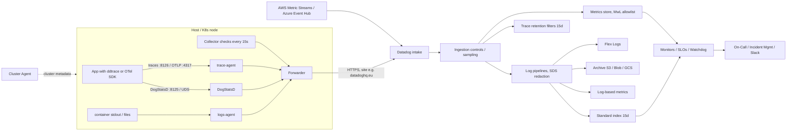
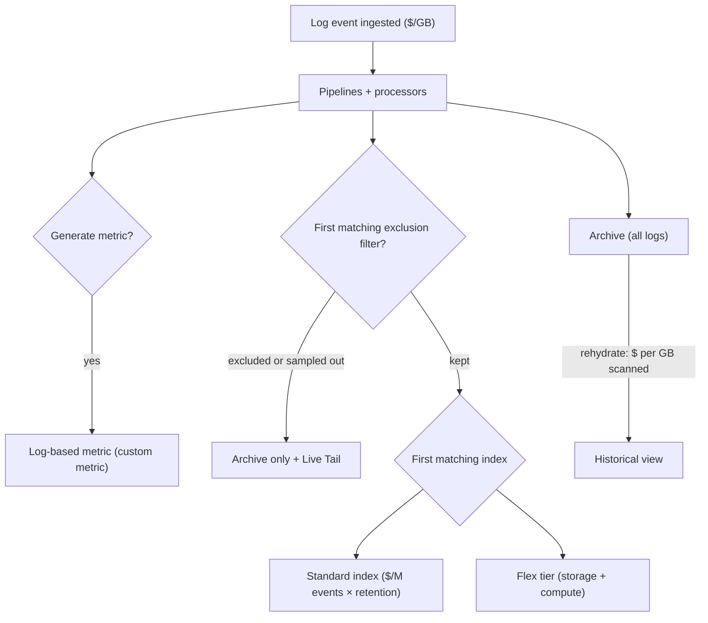

# O4 Datadog
> Last verified: 2026-10 · Audience: senior/staff DevOps, SRE, AI eng, NetEng, DevSecOps, architects

## TL;DR
- Datadog is a **SaaS, multi-signal observability + security platform**. A single **Agent** (collector + forwarder + DogStatsD + trace-agent) ships data to a regional **intake** (site: US1/US3/US5/EU1/AP1/US1-FED). Products sit on top: Infra, APM, Logs, RUM, Synthetics, Security, Incident/On-Call, Bits AI.
- **Unified service tagging** (`env`, `service`, `version`) links metrics, traces and logs together. **Tag cardinality** is what drives the bill and the query cost.
- The bill has **three main parts**: **hosts** (infra/APM, billed on the 99th-percentile high-water mark), **volume** (log GB ingested, million events indexed, spans ingested/indexed) and **cardinality** (custom metrics = metric name × unique tag-value combinations).
- You control cost **at each pipeline stage**: sample at the source (head sampling, `DD_APM_TARGET_TPS`), drop/route at ingest (log exclusion filters, Observability Pipelines), index only what you query (log indexes, Flex Logs, trace retention filters, Metrics without Limits), archive the rest (S3/Blob/GCS + rehydration).
- APM keeps the decision on the head: by default the Agent targets **10 traces/s**, plus error (10 tps) and rare (5 tps, off by default) samplers. Indexed spans are kept for **15 days**. The **Intelligent retention filter** is free.
- **OpenTelemetry strategy:** instrument with OTel SDKs and route through the **DDOT Collector** (embedded in the Agent), Agent OTLP ingest (4317/4318), or a vanilla Collector with the Datadog exporter. This lowers lock-in on instrumentation, though the backend stays proprietary.
- Monitors (about 29 types) cover anomaly, forecast, outlier, composite and SLO burn-rate alerts. SLOs can be metric-based, monitor-based or time-slice over 7/30/90-day windows.
- Compared with alternatives, Datadog gives the broadest integrated UX and fastest time-to-value but the highest and least predictable cost at scale. The Grafana LGTM stack and Elastic trade operational effort for cost control. Dynatrace and New Relic are the closest SaaS peers.

## O4.1 Platform overview and Agent architecture
- **How it works:**
  - **Agent v7** (Go) has several components. The **Collector** runs checks every **15 s**. The **Forwarder** sends HTTPS payloads to intake and buffers them in memory during network splits. **DogStatsD** listens on **UDP 8125**, or a Unix domain socket, which is preferred in containers because it keeps origin detection. The **trace-agent** (APM) listens on **8126**, is on by default and computes trace stats. The **process-agent** is off by default. **system-probe** (eBPF) handles Cloud Network Monitoring and USM. The **security-agent** handles CWS.
  - Local ports: **5000** (Agent's own expvar metrics), **5001** (CLI/IPC), **5002** (GUI, Windows/macOS).
  - **Integrations:** there are 1,000+. Some are Agent checks (YAML in `conf.d/<check>.d/conf.yaml`, open-source `integrations-core`). Others are crawler-based cloud integrations (AWS/Azure/GCP API polling) or library/SDK integrations (ddtrace auto-instrumentation).
  - **DogStatsD** extends StatsD with tags, histograms, distributions, events and service checks. The Agent aggregates client-side into 10 s flush buckets before forwarding.
  - **Sites:** the org lives in one site (data residency). The API/app key and `DD_SITE` must match, e.g. `datadoghq.eu`.
  - **Fleet Automation / Remote Configuration** let you upgrade and configure Agents and change APM sampling from the UI. Remote sampling needs Agent 7.42+.
- **Trade-offs / when to use:**
  - One Agent for every signal cuts down on sidecars. The cost is a fat privileged DaemonSet with host-level access (security review needed).
  - **Agentless** paths exist: API, Lambda extension, direct OTLP intake, cloud crawlers. They are simpler but lose host metadata, local aggregation and sampling control.
- **Interview angles:**
  - If asked "how does a custom app metric reach Datadog?" → app → DogStatsD (UDS/UDP 8125) → Agent aggregates → forwarder → intake → metrics store. Mention that UDP is fire-and-forget (silent loss under load) and that UDS adds container tagging.
  - Pitfall: **API key vs application key**. The API key only submits data. The app key plus API key reads and configures. Rotate both, and keep the app key out of Agents.

## O4.2 Unified service tagging, tags and cardinality
- **How it works:**
  - The three reserved tags are **`env`, `service`, `version`**. Set them through `DD_ENV` / `DD_SERVICE` / `DD_VERSION`, or K8s labels `tags.datadoghq.com/{env,service,version}`, or Docker labels `com.datadoghq.tags.*`. Requires Agent ≥ 6.19/7.19.
  - Tags come from the Agent (`DD_TAGS`), cloud integrations (EC2 tags, Azure resource tags), K8s labels/annotations (`DD_KUBERNETES_POD_LABELS_AS_TAGS`), and the SDK.
  - **Cardinality** is the number of distinct tag-value combinations per metric. Each combination is a time series and therefore a billable custom metric (see O4.7).
  - **Reserved tags:** `host`, `device`, `source`, `service`, `env`, `version`.
- **Trade-offs / when to use:**
  - Rich tags make slicing easy, but unbounded tags (`user_id`, `request_id`, `pod_name` on custom metrics, `url` with IDs) multiply series and the bill.
  - Put high-cardinality context on **spans/logs** (billed per volume), not on **metrics** (billed per series).
- **Interview angles:**
  - If asked "how do you correlate a deploy with a latency spike?" → `version` tag drives Deployment Tracking and lets you compare versions in APM. Logs↔traces linking comes from trace_id/span_id injection (`DD_LOGS_INJECTION=true`).
  - Governance: enforce a **tagging policy** (required tags `team`, `service`, `env`, `cost-center`), run tag-policy checks in CI/Terraform, and set the Agent `tags` baseline per cluster.
  - See [O1 Prometheus](O1-prometheus.md) for the same cardinality problem in label form.

## O4.3 Infrastructure and container monitoring (Kubernetes)
- **How it works:**
  - **Node Agent** runs as a **DaemonSet** (one pod per node, with containers agent / trace-agent / process-agent / system-probe). It collects kubelet, cAdvisor and containerd data plus host metrics.
  - The **Cluster Agent** (Deployment, usually 2 replicas) does several jobs:
    - acts as a proxy between the API server and node Agents, which reduces API-server load and lets node Agents run with reduced RBAC;
    - collects cluster metadata and events;
    - dispatches **cluster checks** (for example to databases or LBs) to exactly one Agent, and **endpoint checks**;
    - serves as the **External Metrics Provider** for HPA/WPA on Datadog queries;
    - runs the **Admission Controller**, which injects `DD_AGENT_HOST`, UST env vars and APM library **Single Step Instrumentation**.
  - **Deploy via** the **Datadog Operator** (`DatadogAgent` CRD, v1.0+) or the **Helm chart** (`datadog/datadog`). The Cluster Agent is on by default in both.
  - **Autodiscovery** templates pod annotations like `ad.datadoghq.com/<container>.checks` (v2 JSON format) so checks follow pods. The `%%host%%` / `%%port%%` template variables resolve at runtime.
  - **KSM Core** check (kube-state-metrics built into the Cluster Agent) replaces deploying KSM separately. Also available: Orchestrator Explorer (live resources), Container/Process views.
  - **Serverless/ECS Fargate:** run the Agent as a sidecar in the task. Fargate is billed per task-hour.
- **Trade-offs / when to use:**
  - Operator vs Helm: Operator = CRD-driven, reconciled, GitOps friendly. Helm = familiar, every value exposed.
  - Cluster checks avoid duplicate scraping of shared endpoints.
- **Interview angles:**
  - "HPA on p95 latency from APM?" → Cluster Agent External Metrics Provider with a `DatadogMetric` CRD.
  - Container allotment: **Pro 5 / Enterprise 10 containers per host**. Beyond that, each container-hour is billed, which is a surprise on dense nodes.
  - Scraping Prometheus endpoints: the OpenMetrics check turns every series into a **custom metric**. Filter with `metrics:` allowlists.

## O4.4 APM and distributed tracing
- **How it works:**
  - **Instrumentation:** `ddtrace` SDKs (Java, Python, Node, .NET, Go, Ruby, PHP, C++) auto-instrument frameworks. **Single Step Instrumentation** injects them without code changes. Propagation uses Datadog headers plus **W3C `traceparent`** (both by default in recent SDKs).
  - **Trace metrics** (hits/errors/latency per service/resource) are calculated on **100% of traffic** by the Agent before sampling, so RED dashboards stay accurate even under heavy sampling.
  - **Ingestion (head-based) sampling:** the decision is made at the root and propagated downstream (`ingestion_reason` tag on spans):
    - `auto`: Agent target **10 traces/s per Agent** (`DD_APM_TARGET_TPS`), distributed across services by traffic.
    - `rule`: SDK sampling rules per service/resource, default rate limit **100 traces/s per service instance**. These override the Agent setting.
    - `error`: up to **10 tps per Agent** (`DD_APM_ERROR_TPS`) catches errors that head sampling dropped.
    - `rare`: up to **5 tps per Agent** (`DD_APM_ENABLE_RARE_SAMPLER`, off by default).
    - Others: `manual` (keep/drop), `single_span`, product-based (RUM, Synthetics, ASM), `otel`.
  - **Retention filters** decide what gets indexed (searchable for **15 days**):
    - The **Intelligent retention filter** is always on. It does diversity sampling over env/service/resource, including errors and p75/p90/p95 latency, plus 1% flat. It is **not billed**.
    - Defaults: Error, App and API Protection, Synthetics, Dynamic Instrumentation.
    - Custom filters (span- or trace-level) **are billed as indexed spans**.
  - **Live Search** covers all ingested spans for the last **15 minutes**.
  - Related: Continuous Profiler (4 profiled containers/host included), Dynamic Instrumentation, Data Streams Monitoring, Database Monitoring (explain plans).
- **Trade-offs / when to use:**
  - Head sampling is cheap and keeps traces complete, but rare tail errors can be missed (the error/rare samplers mitigate this).
  - True **tail-based** sampling needs an OTel Collector `tail_sampling` processor or Observability Pipelines in front of Datadog. That costs extra infra, and trace stats must then be computed before sampling (Datadog connector).
- **Interview angles:**
  - "Two separate knobs": **ingestion controls** (what crosses the wire = ingested span GB billing) vs **retention filters** (what is indexed = indexed-span billing). Candidates often conflate them.
  - "Why are my APM metrics right but I can't find the trace?" → it was sampled out at ingestion or not retained after 15 minutes.
  - Cross-link: [J3 Observability](../J-sre/J3-observability.md).

## O4.5 OpenTelemetry ingestion and lock-in strategy
- **How it works:**
  - **Option 1, DDOT Collector** (Datadog Distribution of the OTel Collector, embedded in Agent 7): OTel pipelines plus Datadog Fleet Automation, container tagging and integrations. Datadog's **recommended** path.
  - **Option 2, Agent OTLP ingest:** off by default. Enable with `DD_OTLP_CONFIG_RECEIVER_PROTOCOLS_GRPC_ENDPOINT=0.0.0.0:4317` / `..._HTTP_ENDPOINT=0.0.0.0:4318`. Traces and metrics are supported since Agent 7.32, logs since 7.48. **Logs are disabled by default** to avoid surprise billing.
  - **Option 3, a vanilla/contrib OTel Collector** with the **`datadog` exporter** plus the **`datadog` connector**, which computes APM stats before tail sampling.
  - **Option 4, direct OTLP intake** (agentless, for example from serverless).
  - **Semantic convention mapping:** `service.name`→`service`, `deployment.environment`→`env`, `service.version`→`version`. OTel metrics are typically billed as **custom metrics**.
- **Trade-offs / when to use:**
  - OTel SDK + Collector gives **portable instrumentation** and lets you dual-ship to a second backend (for migration, cost arbitrage, or a cheap long-term store).
  - It may lose some Datadog-specific features (some profiler/ASM/runtime-metric features are SDK-only). Check Datadog's OTel feature-compatibility table.
- **Interview angles:**
  - "How do you reduce vendor lock-in?" → OTel SDKs and the W3C context standard. Collector as the routing layer. Dashboards/monitors as code (Terraform) so they can be ported. Keep raw logs in your own bucket via archives. Avoid proprietary query features in runbooks.
  - Be honest: dashboards, monitors, notebooks and query languages remain proprietary. Lock-in moves from instrumentation to workflow.
  - See [O2 Grafana LGTM](O2-grafana-lgtm-stack.md) and [J3 Observability](../J-sre/J3-observability.md).

## O4.6 Log management (pipelines, indexes, Flex, archives)
- **How it works:**
  - **Collection:** Agent tails files and container stdout (`DD_LOGS_ENABLED=true`, `DD_LOGS_CONFIG_CONTAINER_COLLECT_ALL`). Other sources: cloud forwarders (AWS Lambda forwarder/Firehose, Azure Event Hub/native), HTTP intake, Observability Pipelines (Vector-based, on-prem pre-processing and routing).
  - **Pipelines and processors** (applied at intake, in order):
    - Grok parser, date/status/service remappers, attribute remapper, URL/user-agent parser, category, arithmetic, lookup, trace-ID remapper.
    - **Sensitive Data Scanner** redacts PII at intake.
    - Integration pipelines are auto-installed per `source`.
  - **"Logging without Limits"** means everything is ingested and processed. You then decide per log:
    - **Generate metrics** from logs (log-based metrics: 15-month retention, billed as custom metrics), even from excluded logs.
    - **Index** it: Standard indexing with a per-index retention. Routing is **first-matching index wins**. Default limit is **100 indexes**. Each index can have a **daily quota** that resets at 14:00 UTC by default.
    - **Exclusion filters**: only the first matching filter applies. Sampling is 0–100%, per log or per attribute (e.g. keep 10% of `status:info` but all traces of a sampled `trace_id`). Excluded logs are still in Live Tail, metrics and archives.
    - **Flex Logs**: storage is billed separately from compute. **Starter** offers 3/6/12/15-month retention with bundled compute. **Scalable compute** sizes XS→L each roughly double the previous one (Starter < 10 B events … L 0.5–1 T events), with retention of 30–450 days. **No monitors or Watchdog** on Flex. Dashboards are allowed but consume compute.
    - **Archives** go to S3 / Azure Blob / GCS that you own (cheap, long-term, compliance).
    - **Rehydration** brings archived logs back into "historical views" of up to 1 B events. It is **billed on GB scanned for the whole timeframe**, because query filters apply after download, so the time range is the cost lever. Exclusion filters don't apply.
- **Trade-offs / when to use:**

| Tier | Query speed | Monitors | Cost shape | Use for |
|---|---|---|---|---|
| Standard index | fast, frequent | yes | per M events × retention (e.g. 15 d) | on-call debugging, alerting |
| Flex Logs | slower, compute-capped | no | per M events stored + compute size | security, audit, high-volume, infrequent |
| Archive + rehydrate | minutes, on demand | no | object storage + GB scanned | compliance, rare forensics |
| Log-based metric only | n/a (aggregate) | yes | custom metric | counting noisy logs (e.g. 2xx access logs) |

- **Interview angles:**
  - "Log bill tripled after a deploy" → find the top `service`/`source` via **Log Usage / estimated usage metrics** (`datadog.estimated_usage.logs.ingested_bytes`). Add an exclusion filter or sampling, then move debug logs to Flex or archive-only. Set index daily quotas plus a usage monitor. Fix the root cause (log level).
  - Ingestion (~$0.10/GB) is cheap compared with indexing (~$1.70 per M events at 15-day retention, annual price). **Indexing is the lever**.
  - Cross-link: [O3 Elastic](O3-elastic-stack.md) (hot/warm/frozen ILM is the self-managed analogue).

## O4.7 Metrics: custom metrics, distributions, Metrics without Limits
- **How it works:**
  - A **custom metric = one unique combination of metric name + tag values (including `host`)**. Sources: DogStatsD, custom checks, OpenMetrics/Prometheus scrapes, OTel metrics, log/span-based metrics, and non-standard integrations.
  - **Allotment per host:** Pro **100**, Enterprise **200** (ingested and indexed), pooled across the account. Billing is the **monthly average of custom metrics per hour**.
  - **Metric types:** count, rate, gauge, set, histogram (Agent-side aggregation, `.avg/.count/.max/.median/.95percentile` = 5 series per combination), and **distribution** (server-side, globally accurate percentiles over DDSketch).
  - **Distributions:** **5 series per tag combination** by default (count/sum/min/max/avg). **Enabling percentiles** (p50/p75/p90/p95/p99) adds another 5×, so **10× in total**.
  - **Metrics without Limits (MwL):** ingest everything, but choose an **allowlist of queryable tags** per metric. **Ingested** custom metrics (original volume) and **indexed** custom metrics (after the allowlist) are billed separately, and ingested is far cheaper. Datadog can suggest tags based on actual query usage.
  - Retention: metrics are kept for **15 months** at full granularity for standard metrics.
- **Trade-offs / when to use:**
  - Histograms are cheap but **percentiles can't be aggregated across hosts** (you get an average of p95s, which is wrong). Distributions give correct global percentiles but cost more series.
  - MwL saves on indexed series but you still pay ingest. It is not a fix for unbounded tags.
- **Interview angles:**
  - "A developer added `customer_id` to a counter" → 50 hosts × 10 endpoints × 5 statuses × 20 k customers = **50 M series**. Fix: remove the tag, use MwL to drop it from indexing, and put customer context on spans/logs. Add a **usage anomaly monitor** on `datadog.estimated_usage.metrics.custom`.
  - Same problem in Prometheus terms: [O1](O1-prometheus.md).

## O4.8 Monitors, SLOs, downtimes, dashboards and notebooks
- **How it works:**
  - **About 29 monitor types:** metric, anomaly, forecast, outlier, change, host, process, service check, integration, APM, logs, RUM, Synthetics, event, composite, SLO, Watchdog, CI, Error Tracking, Database Monitoring, network/NetFlow/Network Path, Cloud Cost, Audit Trail, Data Observability, Analysis.
  - **Simple alert vs multi alert:** a multi alert groups by tags, e.g. `by {service,env}`, giving one alert state per group with per-group notifications and auto-resolve.
  - **Composite** monitors combine monitors with boolean logic (e.g. high latency AND high error rate), which cuts noise.
  - **Anomaly** algorithms: basic, agile, robust (seasonal). **Forecast** algorithms: linear/seasonal (e.g. disk full in 7 d). **Outlier** algorithms: DBSCAN/MAD across a group.
  - Monitor settings include evaluation window, recovery thresholds, **no-data** behaviour, renotify, `@slack-…`/`@pagerduty-…`/`@oncall-team` handles, and template variables `{{host.name}}`.
  - **Downtimes / scheduled downtimes** mute monitors by scope during maintenance. They can be recurring (RRULE) and scoped by tags.
  - **SLOs:**
    - **Metric-based** = good/total events (count-based).
    - **Monitor-based** = monitor uptime (time-based).
    - **Time-slice** = custom uptime from a metric query, with no monitor needed.
    - Windows are **7/30/90-day** rolling. Error budget = 100% − target.
    - **SLO alerts** come as error-budget or **burn-rate** alerts, multi-window/multi-burn-rate style. The UI flags a burn rate above 6× as critical over a rolling 2 h window.
    - Corrections (maintenance exclusions) are capped, e.g. 100 one-time per 90 days.
  - **Dashboards:** timeboards and screenboards are unified into dashboards with template variables. Powerpacks are available, and dashboards can be shared publicly or with selected users. **Notebooks** hold investigation and postmortem narrative with live graphs.
- **Trade-offs / when to use:**
  - Anomaly monitors are convenient but noisy without enough history (≥ 1 seasonal cycle).
  - Prefer **SLO burn-rate alerts** for paging and threshold monitors for tickets (see [J2](../J-sre/J2-monitoring-and-alerting.md)).
- **Interview angles:**
  - "How do you manage 2,000 monitors?" → **Terraform `datadog` provider** or Datadog-managed recommended monitors. Tag monitors with `team:` and route by team (On-Call). Run periodic noisy-monitor reviews (Monitor Quality page / Monitor Notifications Overview).
  - SLO math and policy: [J1 SLIs/SLOs/error budgets](../J-sre/J1-slis-slos-error-budgets.md).

## O4.9 RUM, Session Replay and Synthetics
- **How it works:**
  - **RUM** (browser/mobile SDK) captures views, actions, errors, resources, Core Web Vitals (LCP, INP, CLS) and long tasks. It is billed **per 1k sessions**, and **Session Replay** is billed separately. Sampling uses `sessionSampleRate` / `sessionReplaySampleRate`.
  - **RUM↔APM linking** comes from `allowedTracingUrls` injecting trace headers, which gives a frontend-to-DB waterfall.
  - **Synthetics** offers API tests (HTTP, SSL, DNS, TCP, UDP, WebSocket, gRPC, ICMP; multistep), **browser tests** (recorded journeys) and mobile app tests. They run from **managed locations** or **private locations**, which are Docker containers inside your network for internal apps. They are billed per **10k API test runs** and per **1k browser test runs**.
  - **Continuous Testing** runs Synthetics in CI (`datadog-ci`).
- **Trade-offs / when to use:**
  - RUM shows what real users experience (real devices and networks). Synthetics gives a proactive, consistent baseline and covers the case where no traffic is coming in.
  - Test frequency × locations × steps drives Synthetics cost. One test every minute from 10 locations is about 432k runs/month.
- **Interview angles:**
  - "Monitor an internal-only app" → Synthetics private location, plus RUM if users exist.
  - Synthetic frequency/location cost trade-off; pair with an SLO on synthetic uptime.

## O4.10 Security products (brief)
- **Cloud SIEM:** detection rules over ingested logs (CloudTrail, Entra ID, Okta, K8s audit) produce signals. It is billed per analyzed GB/events. **Bits AI Security Analyst** triages signals.
- **Cloud Security** (formerly Cloud Security Management, CSM; naming as of 2026 (unverified)) covers misconfigurations (CSPM), vulnerabilities, identity risks (CIEM) and **Workload Protection** (formerly CWS: eBPF runtime threat detection through system-probe).
- **App and API Protection (AAP)** (formerly Application Security Management, ASM) is in-app WAF / RASP-like protection via the tracing library, plus API discovery. **Code Security** (SCA/IAST) is related.
- **Sensitive Data Scanner** redacts and classifies PII in logs, spans and RUM at intake.
- **Interview angles:**
  - The selling point is a shared agent and shared tags with observability, so triage happens in one place.
  - The weakness is less depth than a dedicated CNAPP or EDR. See [P1 Wiz](../P-security-platforms-identity/P1-wiz-cnapp.md) and [P2 CrowdStrike](../P-security-platforms-identity/P2-crowdstrike-edr-xdr.md).

## O4.11 Watchdog, Bits AI, Incident Management and On-Call
- **Watchdog:** automatic ML anomaly detection across APM, logs and infra. It produces **Watchdog Insights**, **Root Cause Analysis** (dependency-graph-based) and impact analysis. A Watchdog monitor type lets you alert on its stories. It does not work on Flex Logs.
- **Bits AI** (2026 naming per docs):
  - **Bits Investigation**, the "Bits AI SRE" agent, runs autonomous alert investigation.
  - **Bits Code**, the "Dev Agent", proposes code fixes and PRs.
  - **Bits Security Analyst** triages SIEM signals.
  - **Bits Chat** answers natural-language questions over your data.
  - Also: Bits Data Analysis, Bits Detection, Bits Remediation.
  - Not available on the gov sites. GA vs preview status per feature: (unverified).
- **Incident Management:** declare an incident from a monitor, Slack or Teams. You get severity, roles (IC, comms), a timeline, integrated status updates, auto-generated **postmortem** notebooks, and follow-up tasks.
- **On-Call** (paging; seat-based, part of the Incident Response suite):
  - **Teams** receive **Pages** (states Triggered → Acknowledged → Resolved) from monitors, incidents or security signals.
  - **Escalation policies**, **schedules** (multi-timezone) and **routing rules** (urgency by metadata) control who gets paged.
  - Resources can't be deleted (to preserve history), so test in a sandbox org.
  - It competes with PagerDuty and Opsgenie (Atlassian is retiring Opsgenie, which pushes migrations; (unverified) timeline).
- **Interview angles:**
  - "Should AI agents auto-remediate?" → only with human-in-the-loop, scoped runbooks (Workflow Automation), and audit trails. Use investigation agents to cut MTTR on triage, not to replace the incident commander.
  - See [J4 Incident response](../J-sre/J4-incident-response-postmortems.md) and [R1 Incident communication](../R-support-communication/R1-incident-communication.md).

## O4.12 Cost management and governance (the interview topic)
- **How it works (pricing shape, list prices from datadoghq.com/pricing, 2026-10):**

| SKU | Unit | Approx. list (annual / on-demand) | What explodes it |
|---|---|---|---|
| Infra Pro / Enterprise | host/month | $15 / $18; $23 / $27 | autoscaling, short-lived nodes, many small VMs |
| Containers over allotment | container-hour | $0.002 (5 or 10 per host included) | dense nodes, sidecars, job pods |
| APM / APM Pro / APM Enterprise | APM host/month | $31 / $35 / $40 (with infra, annual) | every host running a tracer counts |
| Ingested / indexed spans | GB / M spans | per SKU (see pricing) | `DD_TRACE_SAMPLE_RATE=1`, custom retention filters |
| Log ingest | GB | $0.10 | verbose debug logs, multiline stack traces |
| Log standard indexing | M events (15 d) | $1.70 / $2.55 | long retention, no exclusion filters |
| Flex Logs storage | M events stored | $0.05 / $0.075 + compute | months of retention × volume |
| Custom metrics over allotment | per 100 (contract) | contract (unverified list price) | high-cardinality tags, percentiles on distributions, OpenMetrics scrapes |
| RUM / Session Replay / Synthetics | 1k sessions / 10k API runs / 1k browser runs | see pricing (unverified) | 100% session sampling, 1-min tests × many locations |

- **Host billing** is the **high-water mark of the lowest 99% of hours** (top 1% of hours, about 7 h/month, ignored). It applies to Infra, APM, DBM and CNM hosts. Sustained scale-out still counts.
- **How bills explode (classic stories):**
  - Cardinality bomb on a custom metric (pod name, user ID, URL path).
  - Debug logging left on in production.
  - A Prometheus/OpenMetrics scrape of an exporter with thousands of series.
  - APM enabled cluster-wide, so every node becomes an APM host.
  - Ephemeral CI runners or spot nodes counted as hosts.
  - Rehydrating a 30-day window to find one log.
  - Synthetics at 1-minute frequency from many locations.
  - On-demand overage above the annual commit.
- **Governance playbook:**
  - **Visibility:** Plan & Usage page, `datadog.estimated_usage.*` metrics, Usage Attribution by `team`/`service` tags (Enterprise), chargeback/showback.
  - **Guardrails:** usage anomaly monitors, log index daily quotas, ingestion sampling rules via Remote Config, MwL tag allowlists, OpenMetrics allowlists, Observability Pipelines (filter/sample/dedupe/route before intake).
  - **Policy:** default log level INFO, a required-tags policy, a ban on unbounded tags on metrics, PR review for new custom metrics, Terraform for monitors/indexes/pipelines.
  - **Commercial:** annual commit sized to the baseline, committed-use vs on-demand rates, renegotiate SKUs, check Cloud Cost Management for joint cloud and Datadog cost visibility.
- **Interview angles:**
  - "Cut the Datadog bill 40% without losing incident capability" → audit the top 3 SKUs first. For logs: exclusion filters, then Flex or archives, then log-based metrics. For metrics: MwL and tag cleanup. For APM: lower custom retention, rely on the Intelligent filter and the 15-minute Live Search. Right-size APM hosts. Keep SLO-critical signals untouched. Measure before and after.
  - Show unit economics: cost per host, per GB, per service. Compare with self-hosting the LGTM stack (infra plus about 1–3 FTE of platform engineering).

## O4.13 Datadog vs Grafana stack vs Elastic vs New Relic / Dynatrace

| Dimension | Datadog | Grafana LGTM (OSS or Cloud) | Elastic (ELK / Elastic Observability) | New Relic | Dynatrace |
|---|---|---|---|---|---|
| Model | SaaS only | self-host or Grafana Cloud | self-host, Elastic Cloud, serverless | SaaS | SaaS + Managed |
| Pricing shape | per host + per GB + per series + per SKU | per active series / GB (Cloud) or infra cost | resource-based (cloud) or license | **per GB ingested + per user** | host-hours / memory-GiB-hours, DPS consumption |
| Strength | breadth, UX, integrations, correlation | cost control, OSS, Prometheus native, PromQL/LogQL | log search, SIEM, full-text, ES\|QL | simple usage pricing, all-in-one | **OneAgent auto-discovery, Davis causal AI, Smartscape topology** |
| Weakness | cost unpredictability, lock-in | operational burden, several UIs and query languages | ops-heavy at scale, cost of hot tier | user-seat costs, fewer enterprise APM depths (unverified) | premium price, complexity |
| OTel | DDOT, OTLP, exporter | native (Alloy) | EDOT, native OTLP | native OTLP | OTLP ingest + OneAgent |

- **Interview angles:**
  - "When would you NOT pick Datadog?" → heavy, high-cardinality metrics at scale (Mimir/VictoriaMetrics is cheaper), strict on-prem or sovereignty needs (no self-host; mind the site choice), log-heavy security analytics (Elastic or a SIEM data lake), or a team with strong platform engineering capacity.
  - Hybrid is common: Prometheus/OTel at the edge, Datadog for APM and on-call, cheap object storage for logs.
  - Cross-links: [O1 Prometheus](O1-prometheus.md), [O2 Grafana LGTM](O2-grafana-lgtm-stack.md), [O3 Elastic](O3-elastic-stack.md), [O5 Zabbix](O5-zabbix.md).

## Diagrams




## Cloud mapping: AWS vs Azure
| Capability | AWS | Azure | Role it plays | Key differences | Alternatives |
|---|---|---|---|---|---|
| Account auth for Datadog crawler | **IAM role** with external ID (CloudFormation / Terraform `datadog_integration_aws_account`) | **App registration (service principal)** with Monitoring Reader, or **Azure Native Datadog** resource | Datadog polls cloud APIs for metrics, tags and metadata | AWS: cross-account role trust. Azure: Entra ID app/MSI. The native resource is created via Marketplace | OTel Collector with cloud receivers |
| Metric collection | API polling (~10 min) or **CloudWatch Metric Streams → Kinesis Data Firehose** (2–3 min latency) | Azure Monitor API polling | Platform metrics into Datadog | Metric Streams adds AWS Firehose and CloudWatch cost; some metrics (S3 bucket size, billing) are still polled | Grafana CloudWatch / Azure Monitor data sources |
| Log forwarding | **Datadog Forwarder Lambda** (S3/CloudWatch Logs triggers) or **Firehose → Datadog HTTP endpoint** | **Diagnostic settings → Event Hub → forwarder function**, or **Azure Native** automatic forwarding (activity, resource, Entra ID logs) | Cloud and service logs into Log Management | Azure Native is **US3 site only**; other sites use the automated log-forwarding (ARM template) setup | Observability Pipelines, Vector, Fluent Bit |
| Serverless tracing | **Datadog Lambda Extension** (layer) + library layer | Azure Functions / App Service via **.NET/Java extensions** or the serverless-init sidecar | Traces, metrics and logs from serverless without a host Agent | The Lambda Extension flushes at invocation end; Azure varies by plan | ADOT / OTel Lambda layer, App Insights |
| Agent on VMs | SSM / user-data / EC2 Image Builder | **Datadog VM extension** (via the Azure Native resource) | Host-level metrics, APM, logs | Azure Native can bulk-install the extension from the portal | Azure Monitor Agent, CloudWatch agent |
| Native comparison | **CloudWatch** (metrics, Logs, X-Ray/Application Signals, Synthetics canaries, RUM) | **Azure Monitor** (Metrics, Log Analytics/KQL, Application Insights, alerts) | Cloud-native observability | Native tools are cheap, IAM-integrated and single-cloud; Datadog is multi-cloud with unified UX | Grafana, Elastic, New Relic, Dynatrace |

- **AWS integration** is a CloudFormation-deployed IAM role with external ID. Datadog polls CloudWatch every ~10 min by default. Metric Streams brings this down to 2–3 min, and cross-account streaming needs `oam:ListSinks` / `oam:ListAttachedLinks` (CloudWatch cross-account observability). Tags and metadata still come from polling.
- **Azure Native Datadog** (Microsoft.Datadog/monitors) is billed through the Azure Marketplace (it can draw down a MACC commitment). It configures diagnostic settings automatically and runs only on the **US3** site. The classic path is app registration + Event Hub + forwarder function.
- **Gotchas:**
  - Cloud integrations can count as hosts (EC2/VM) even without an Agent. Use host/tag filters (`limit metric collection to resources with tag`) to avoid paying for dev VMs.
  - Log forwarding through Event Hub/Firehose adds cloud cost on top of Datadog ingest.
- **Native alternatives:** CloudWatch + Application Signals / X-Ray, Azure Monitor + Application Insights (KQL). Pick them when you're single-cloud and cost-sensitive. Pick Datadog when you're multi-cloud, need one pane of glass, or need deep APM/RUM.

## Hands-on (optional)
Run the Agent in Docker with APM, logs, DogStatsD and OTLP enabled:
```bash
docker run -d --name dd-agent \
  -e DD_API_KEY="$DD_API_KEY" -e DD_SITE="datadoghq.eu" \
  -e DD_ENV=staging -e DD_APM_ENABLED=true -e DD_APM_NON_LOCAL_TRAFFIC=true \
  -e DD_LOGS_ENABLED=true -e DD_LOGS_CONFIG_CONTAINER_COLLECT_ALL=true \
  -e DD_DOGSTATSD_NON_LOCAL_TRAFFIC=true \
  -e DD_OTLP_CONFIG_RECEIVER_PROTOCOLS_GRPC_ENDPOINT=0.0.0.0:4317 \
  -e DD_OTLP_CONFIG_RECEIVER_PROTOCOLS_HTTP_ENDPOINT=0.0.0.0:4318 \
  -p 8125:8125/udp -p 8126:8126 -p 4317:4317 -p 4318:4318 \
  -v /var/run/docker.sock:/var/run/docker.sock:ro \
  -v /proc/:/host/proc/:ro -v /sys/fs/cgroup/:/host/sys/fs/cgroup:ro \
  -v /var/lib/docker/containers:/var/lib/docker/containers:ro \
  gcr.io/datadoghq/agent:7

docker exec dd-agent agent status          # check health of collector/forwarder/APM/logs
echo -n "checkout.latency:120|d|#env:staging,service:cart" | nc -u -w1 localhost 8125   # distribution via DogStatsD
```

Agent config fragment (`datadog.yaml`) and a log exclusion at the source:
```yaml
api_key: ${DD_API_KEY}
site: datadoghq.eu
env: prod
tags: ["team:payments", "cost-center:cc-42"]
apm_config:
  enabled: true
  target_traces_per_second: 10        # DD_APM_TARGET_TPS
  errors_per_second: 10
logs_enabled: true
logs_config:
  processing_rules:
    - type: exclude_at_match
      name: drop_healthchecks
      pattern: "GET /healthz"
otlp_config:
  receiver:
    protocols:
      grpc: { endpoint: 0.0.0.0:4317 }
```

Terraform: a multi-alert monitor plus a metric-based SLO with burn-rate alerting:
```hcl
terraform {
  required_providers { datadog = { source = "DataDog/datadog" } }
}
provider "datadog" { api_url = "https://api.datadoghq.eu/" } # keys via DD_API_KEY / DD_APP_KEY

resource "datadog_monitor" "cart_errors" {
  name    = "[cart] high 5xx rate on {{env.name}}"
  type    = "query alert"
  query   = "sum(last_5m):sum:trace.http.request.errors{service:cart} by {env}.as_count() / sum:trace.http.request.hits{service:cart} by {env}.as_count() > 0.05"
  message = "5xx > 5% for cart in {{env.name}}. @oncall-payments"
  monitor_thresholds {
    critical = 0.05
    warning  = 0.02
  }
  notify_no_data = false
  tags           = ["team:payments", "service:cart"]
}

resource "datadog_service_level_objective" "cart_availability" {
  name = "cart availability"
  type = "metric"
  query {
    numerator   = "sum:trace.http.request.hits{service:cart,env:prod}.as_count() - sum:trace.http.request.errors{service:cart,env:prod}.as_count()"
    denominator = "sum:trace.http.request.hits{service:cart,env:prod}.as_count()"
  }
  thresholds {
    timeframe = "30d"
    target    = 99.9
    warning   = 99.95
  }
  tags = ["team:payments"]
}
```
- Burn-rate alerts on the SLO use `datadog_monitor` with `type = "slo alert"` and a query like `burn_rate("<slo_id>").over("30d").long_window("1h").short_window("5m") > 14.4`. The exact query syntax should be checked against the provider docs (unverified).

## Cross-links
- [J1 SLIs/SLOs/error budgets](../J-sre/J1-slis-slos-error-budgets.md) · [J2 Monitoring and alerting](../J-sre/J2-monitoring-and-alerting.md) · [J3 Observability](../J-sre/J3-observability.md) · [J4 Incident response](../J-sre/J4-incident-response-postmortems.md)
- [O1 Prometheus](O1-prometheus.md) · [O2 Grafana LGTM](O2-grafana-lgtm-stack.md) · [O3 Elastic](O3-elastic-stack.md) · [O5 Zabbix](O5-zabbix.md)
- [L1 Data classification / PII](../L-data-privacy-ai-security/L1-data-classification-pii.md) (Sensitive Data Scanner) · [N5 IaC pipelines](../N-cicd-platform-engineering/N5-iac-pipelines-policy-as-code.md)

## Sources
- https://docs.datadoghq.com/agent/architecture/
- https://docs.datadoghq.com/getting_started/tagging/unified_service_tagging/
- https://docs.datadoghq.com/containers/cluster_agent/
- https://docs.datadoghq.com/tracing/trace_pipeline/ingestion_mechanisms/
- https://docs.datadoghq.com/tracing/trace_pipeline/trace_retention/
- https://docs.datadoghq.com/opentelemetry/
- https://docs.datadoghq.com/opentelemetry/setup/otlp_ingest_in_the_agent/
- https://docs.datadoghq.com/logs/log_configuration/indexes/
- https://docs.datadoghq.com/logs/log_configuration/flex_logs/
- https://docs.datadoghq.com/logs/log_configuration/rehydrating/
- https://docs.datadoghq.com/account_management/billing/custom_metrics/
- https://docs.datadoghq.com/account_management/billing/pricing/
- https://www.datadoghq.com/pricing/
- https://docs.datadoghq.com/monitors/types/
- https://docs.datadoghq.com/service_level_objectives/
- https://docs.datadoghq.com/bits_ai/
- https://docs.datadoghq.com/service_management/on-call/
- https://docs.datadoghq.com/integrations/guide/aws-cloudwatch-metric-streams-with-kinesis-data-firehose/
- https://docs.datadoghq.com/integrations/guide/azure-native-integration/
