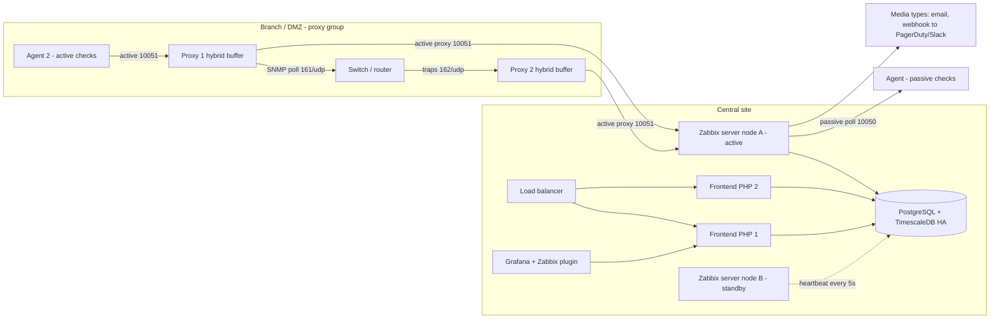
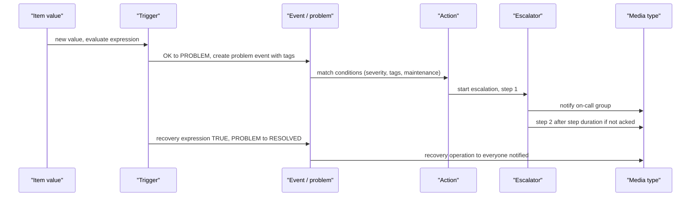

# O5 Zabbix
> Last verified: 2026-10 · Audience: senior/staff DevOps, SRE, AI eng, NetEng, DevSecOps, architects

## TL;DR
- **Zabbix = all-in-one, DB-centric monitoring suite**: server (C) + RDBMS (PostgreSQL/TimescaleDB or MySQL/MariaDB) + PHP web frontend + agents/proxies. Configuration, history, events and alert routing all live in **one SQL database**; that DB is both the strength (one source of truth, SQL-able) and the scaling bottleneck.
- **Current LTS (Oct 2026): Zabbix 7.0 LTS** (released 2024-06-04; full support to 2027-06-30, limited to 2029-06-30). Latest standard: **7.4** (2025-07). **8.0 LTS is planned for Q4 2026** — check whether it has shipped before claiming it. 7.0 changed the licence **GPLv2 → AGPL-3.0**.
- Collection is **push and pull**: passive agent checks (server → agent :10050), active checks (agent → server/proxy :10051), plus agentless **SNMP v1/v2c/v3 polling and traps, IPMI, JMX (Java gateway), HTTP agent, ODBC, SSH/Telnet, VMware, script and browser items**. This breadth is why Zabbix wins in network/legacy/on-prem estates.
- **Proxies** collect on behalf of the server for remote sites, DMZs and segmented networks; 7.0 adds **proxy groups** (automatic host distribution + proxy HA) and **memory/hybrid buffers**. Server **HA cluster** (since 6.0) = active/standby nodes sharing one DB, default failover delay 1 min.
- Alerting chain: **item → trigger (expression, optional recovery expression = hysteresis) → event/problem → action (conditions) → operations with escalation steps → media types** (email, SMS, script, JS webhooks to Slack/Teams/PagerDuty/Jira/ServiceNow…).
- Scale via **templates + LLD** (low-level discovery of filesystems, interfaces, SNMP tables, cloud resources), network discovery and active-agent autoregistration. Storage: **history** (raw) short, **trends** (hourly min/max/avg/count) long; TimescaleDB compression + chunk-dropping housekeeping.
- Positioning: choose **Zabbix** for heterogeneous infra, network gear, Windows/Unix fleets, air-gapped/on-prem and "one box does it all"; **Prometheus** for Kubernetes/cloud-native, label-rich, high-churn workloads; **Datadog** for SaaS, APM/logs/traces correlation and when you'd rather pay than operate.

## O5.1 Architecture and components
- **How it works:**
  - **Zabbix server** (C daemon): pollers, trappers, preprocessing, history syncers (write to DB), timer/escalator/alerter processes, housekeeper, LLD processors. Listens on **10051/TCP** (trapper: active agents, proxies, `zabbix_sender`).
  - **Database**: stores config, history, trends, events, audit. Zabbix 7.0 supports **PostgreSQL 13–18**, **TimescaleDB 2.13–2.29** (recent 7.0.x), **MySQL/Percona 8.0.30–9.7**, **MariaDB 10.5–12.3** (InnoDB only); **Oracle 19c/21c deprecated**; **SQLite proxies only**.
  - **Web frontend** (PHP, Nginx/Apache): UI + **JSON-RPC API** (`api_jsonrpc.php`, API tokens since 5.4). The frontend reads the DB directly and talks to the server for live data (queue, script execution).
  - **Agents**: `zabbix_agentd` (C) and **agent 2** (Go) on hosts, listen on **10050/TCP** for passive checks.
  - **Proxy**: lightweight collector with its own DB (SQLite/MySQL/PostgreSQL) and buffer.
  - Helpers: **Java gateway** (JMX, default 10052), **web service** (PDF scheduled reports), `zabbix_get`, `zabbix_sender`, `zabbix_js`.
  - Ports to remember: 10050 agent, 10051 server/proxy trapper, 161/UDP SNMP polling, 162/UDP traps (snmptrapd), 623/UDP IPMI, 10052 Java gateway.
- **Sizing (official examples):** ~1k metrics → 2 cores/8 GB; 10k → 4/16; 100k → 16/64; 1M → 32 cores/96 GB (m6i.large … m6i.8xlarge). The real unit of load is **NVPS** (new values per second), not host count.
- **Trade-offs / when to use:**
  - Single integrated stack (collect, store, alert, visualize, RBAC, maintenance windows, SLA/services) — fewer moving parts than Prometheus + Alertmanager + Grafana + exporters.
  - DB write path is the ceiling: history sync to an RDBMS; at high NVPS you tune DB, partition (TimescaleDB) and offload to proxies.
- **Interview angles:**
  - "Where's the bottleneck at scale?" → **database I/O** (history inserts, housekeeper deletes) and the **history cache** filling; then poller busy %. Fix with TimescaleDB, faster disks, more DBSyncers, proxies, longer intervals, preprocessing throttling.
  - Pitfall: running server, DB and frontend on one small VM in prod and keeping 90-day history for everything.

## O5.2 Agents: agent vs agent 2, passive vs active checks
- **How it works:**
  - **Passive check**: server/proxy connects to agent :10050, asks for one key, agent replies (pull). Agent's `Server=` lists allowed pollers. 7.0 adds JSON protocol for passive checks.
  - **Active check**: agent connects to server/proxy :10051 (`ServerActive=`), downloads its list of active items (refreshed every `RefreshActiveChecks`, default **5 s**, range 1–86400), collects locally, sends batches. Host is identified by `Hostname=` matching the host name in Zabbix.
  - **Log/eventlog items (`log`, `logrt`, `eventlog`) are active-only.** Active is also required when the agent is behind NAT/firewall that blocks inbound.
  - **Agent 2 (Go)**: plugin architecture, **concurrent** checks, **persistent buffer** (SQLite file) to survive outages, native plugins for **Docker, PostgreSQL, MySQL, Redis, Memcached, MongoDB, systemd, MQTT, Ceph, Oracle**, etc.; Linux (systemd only) and Windows. Classic agent: C, broader OS coverage (AIX, Solaris, FreeBSD…), C loadable modules.
  - Both support **PSK or certificate TLS** for agent↔server/proxy encryption; `AllowKey/DenyKey` replace old `EnableRemoteCommands` for `system.run`.
- **Trade-offs / when to use:**
  | | Passive | Active |
  |---|---|---|
  | Connection | server → agent | agent → server/proxy |
  | Firewall | inbound 10050 on every host | outbound 10051 only |
  | Server load | server pollers do the work | trappers receive batches; scales better |
  | Logs | not possible | required |
  | Availability detection | agent unreachable visible directly | use `nodata()` triggers / heartbeat |
- **Interview angles:**
  - "10k hosts behind NAT?" → active agents + **autoregistration** by `HostMetadata` + proxies per site.
  - Pitfall: `Hostname` mismatch → "host not found" in server log, no data. Pitfall: active-only hosts show no agent availability icon; alert with `nodata(/host/agent.ping,5m)=1`.
  - Agent 2 log buffer: `BufferSize` must be ≥ `MaxLinesPerSecond × 2` or log collection stalls.

## O5.3 Proxies and distributed monitoring
- **How it works:**
  - Proxy collects (agents, SNMP, IPMI, HTTP, discovery…), preprocesses (since 6.4/7.0 proxies do preprocessing), buffers, and forwards to the server. Hosts are assigned **to a proxy or proxy group**.
  - **Active proxy**: proxy connects to server (fetches config, pushes data) — only outbound from remote site. **Passive proxy**: server connects to proxy — use when the central site must initiate (proxy in a DMZ that cannot dial out).
  - **Buffer modes (7.0):** `ProxyBufferMode=disk` (default on upgrade; DB buffer), **`hybrid`** (recommended: memory with DB fallback on fill/age/stop), `memory` (fastest, data loss on stop/overflow). `ProxyMemoryBufferSize`, `ProxyMemoryBufferAge`; legacy `ProxyLocalBuffer` / `ProxyOfflineBuffer` (hours to keep data while server unreachable) apply to disk mode.
  - **Proxy groups (7.0):** hosts automatically spread across proxies in a group, rebalanced, and **redistributed immediately when a proxy goes offline** → proxy-level HA and load balancing. Agents list all group proxies in `Server`/`ServerActive`.
  - Proxy DB: SQLite is fine for small/medium; MySQL/PostgreSQL for large. TimescaleDB **not supported on proxies**.
- **Trade-offs / when to use:**
  - Use proxies for: remote sites over WAN (buffering through link outages), **segmented networks/DMZs/OT** (single firewall rule proxy→server), offloading pollers from the server, multi-tenant MSP setups.
  - Cost: another component to patch; config propagation delay (`ProxyConfigFrequency`) means new items appear on the proxy after a delay.
- **Interview angles:**
  - "Monitor 50 branch offices with flaky WAN" → active proxy per branch, hybrid buffer, `ProxyOfflineBuffer` sized for longest expected outage, triggers on proxy `lastaccess`.
  - "Monitor an isolated PCI/OT segment" → proxy inside segment, only proxy→server 10051 allowed outbound, TLS PSK/cert between them.

## O5.4 High availability cluster mode
- **How it works:**
  - Since 6.0: multiple `zabbix_server` nodes share **one database**; one **active**, others **standby** (only an HA manager runs, no listening ports). Enabled by setting `HANodeName` (unique) and `NodeAddress` (IP:port the frontend uses) in `zabbix_server.conf`.
  - Nodes update heartbeat in DB every **5 s**. Graceful stop → takeover within ~5 s. Crash → takeover after **failover delay (default 1 min, range 10 s–15 min)** + 5 s. Active node stops if it loses DB for > `failover_delay − 5 s` (avoids split-brain).
  - Runtime: `zabbix_server -R ha_status | ha_remove_node=<name> | ha_set_failover_delay=<t>`.
  - Agents/proxies must list **all nodes**: passive (`Server=`) comma-separated; active (`ServerActive=`) **semicolon**-separated = same cluster, comma = independent servers.
- **Trade-offs / when to use:**
  - Covers server process/VM failure only; the **DB is the single point of failure** → pair with PostgreSQL HA (Patroni, RDS Multi-AZ, Azure Database for PostgreSQL zone-redundant HA) and frontends behind a load balancer.
  - No load sharing between server nodes — scale-out of collection is via proxies.
- **Interview angles:**
  - "Design HA Zabbix" → 2–3 server nodes (HA cluster) + managed/HA PostgreSQL + ≥2 frontends behind LB + proxy groups per site + snmptrapd on each node (trapper resumes by timestamp after failover).
  - Pitfall: using commas in `ServerActive` for an HA cluster → agent sends duplicate data to "two servers".

## O5.5 Data collection: item types
- **How it works (item types):**
  - **Zabbix agent / agent (active)**; **simple checks** (`icmpping`, `net.tcp.service`) from server/proxy; 7.4 adds an ICMP ping item with configurable retries.
  - **SNMP agent**: v1/v2c (community) and **v3** (USM: authNoPriv/authPriv, SHA/AES variants). Bulk via `walk[]` item + dependent items/LLD (6.4+), async SNMP pollers in 7.0.
  - **SNMP traps**: `snmptrapd` → handler (bash, Perl `zabbix_trap_receiver.pl`, or **SNMPTT**) writes to `SNMPTrapperFile` with `ZBXTRAP <ip>` marker → server/proxy `StartSNMPTrapper=1` reads file, matches to host by **SNMP interface IP/DNS** → items `snmptrap[regex]` and `snmptrap.fallback`. File rotation tracked by inode (rename before delete).
  - **IPMI** (BMC sensors: fans, temps, PSU; `StartIPMIPollers` default 0), **JMX** via Java gateway (`StartJavaPollers` default 0), **VMware** (vCenter/ESXi via SOAP/REST, `StartVMwareCollectors`).
  - **HTTP agent**: REST/JSON polling with auth, headers, proxies; can also act as a **Prometheus scraper** with "Prometheus pattern" / "Prometheus to JSON" preprocessing.
  - **Database monitor (ODBC)**: run SQL via unixODBC (`db.odbc.select/get/discovery`).
  - **Script items** (JavaScript/Duktape, used by cloud templates), **browser items** (7.0, WebDriver/Selenium, experimental), **web scenarios** (multi-step HTTP), **SSH/Telnet**, **external checks**, **calculated**, **dependent** (split one master value), **trapper** (`zabbix_sender` push), **internal** (`zabbix[...]` self-monitoring).
  - **Preprocessing**: JSONPath, regex, XPath, JavaScript, CSV/XML→JSON, **change per second**, multiplier, **"Discard unchanged with heartbeat"** throttling, Prometheus pattern, validation (in range/regex) with custom on-fail. Executed by the preprocessing manager + workers (`StartPreprocessors`).
- **Trade-offs / when to use:**
  - **Master + dependent items** (one HTTP/SNMP walk call, many metrics) beats N separate polls — key optimisation for APIs and SNMP.
  - Throttling cuts DB writes dramatically for slow-changing values (status, version strings).
- **Interview angles:**
  - "Poll vs trap for network gear?" → poll for metrics (counters, utilisation), traps for instant state changes (link down, PSU fail); always poll as backstop because traps are UDP and can be lost.
  - SNMPv3 is the security answer (auth + privacy); v2c community strings are cleartext.

## O5.6 Discovery: LLD, network discovery, autoregistration
- **How it works:**
  - **Low-level discovery (LLD)**: a discovery rule returns a **JSON array** of objects with `{#MACRO}` values (e.g. `vfs.fs.discovery` → `{#FSNAME}`, `net.if.discovery` → `{#IFNAME}`, SNMP `walk[]`/`discovery[]` for interface tables). **Item, trigger, graph and host prototypes** are instantiated per entity. Tabs: rule → preprocessing → LLD macros (JSONPath) → **filters** → **overrides** (e.g. different thresholds or no trends for some entities).
  - Lost resources: **"Disable lost resources"** and **"Delete lost resources"** periods (7.0 split; keep deletion delayed so a bad filter doesn't wipe history).
  - **Nested LLD (7.4)**: discovery inside discovered entities (DB instance → tablespaces → tables); host prototypes work on discovered hosts.
  - **Network discovery**: IP ranges + checks (ICMP, SNMP, agent, TCP/HTTP…) → **discovery actions** (add host, link template, add to group). 7.0 made discovery concurrent.
  - **Active agent autoregistration**: agent connects with `HostMetadata` (e.g. `Linux prod web`) → autoregistration action matches metadata → creates host, links templates. Preferred for cloud/auto-scaling fleets.
- **Trade-offs / when to use:** autoregistration > network discovery for dynamic fleets (no scanning, works through NAT); network discovery suits static LANs/network gear inventory.
- **Interview angles:** "Auto-scaling group of VMs" → bake agent 2 + `HostMetadata` into the image, autoregistration action, and a cleanup policy (or cloud-template host prototypes) for terminated instances; scanning ephemeral IPs is an anti-pattern.

## O5.7 Items, triggers, hysteresis, events
- **How it works:**
  - **Item** = host + key + interval (flexible/scheduling intervals possible) + value type (float, unsigned, char, log, text) + history/trends retention.
  - **Trigger expression** (5.4+ syntax): `function(/host/key,params) <op> const`, e.g. `avg(/web01/system.cpu.util,5m)>85`, `nodata(/web01/agent.ping,5m)=1`, `count(/h/k,10m,"gt",100)>3`, `change(/h/k)<>0`; `#N` = last N values. Severities: Not classified, Information, Warning, Average, High, **Disaster**.
  - **Hysteresis**: OK event generation = Expression / **Recovery expression** / None. With a recovery expression, the problem resolves only when the problem expression is FALSE **and** recovery is TRUE (e.g. problem `>80`, recovery `<60`) → anti-flapping.
  - **PROBLEM event generation mode**: Single vs Multiple (e.g. one event per log line). **OK event closes**: all problems, or only problems whose **tag values match** (event correlation, e.g. per-interface traps). Manual close option.
  - **Trigger dependencies**: suppress child alerts when parent (core switch/router/uplink) is down — classic network alert-storm control. **Maintenance** windows (with or without data collection) suppress problems.
  - Events: trigger, discovery, autoregistration, internal (item unsupported, etc.) → problems view; **tags** drive filtering, action routing, correlation and services/SLA.
- **Trade-offs / when to use:** hysteresis and `min()/max()` over a window beat `last()` thresholds (single-sample flaps). `nodata()` is the only reliable liveness check for active/trapper data.
- **Interview angles:** compare to Prometheus `for:` duration + Alertmanager inhibition → Zabbix uses time-window functions + recovery expressions + trigger dependencies. See [O1.6](O1-prometheus.md#o16-alertmanager-routing-grouping-inhibition-silences-ha) and [J2.6](../J-sre/J2-monitoring-and-alerting.md#j26-alert-fatigue-paging-vs-ticket-runbooks-per-alert).

## O5.8 Actions, escalations, media types
- **How it works:**
  - **Action** types: trigger, discovery, autoregistration, internal, service. Conditions (host group, tags, severity, time period, maintenance status) filter events.
  - **Operations** (problem), **recovery operations**, **update operations** (on acknowledge/comment/severity change). Operation = send message to users/groups via media type or run **remote command** (on agent/proxy/server, or IPMI, SSH).
  - **Escalations**: step duration (min 60 s; default per action), steps "from–to" (e.g. step 1 = on-call immediately, steps 2–5 repeat every 30 min, step 6 = manager). Escalation stops when problem resolves, is acknowledged (if configured "pause/stop on ack"), action/trigger disabled ("Escalation canceled" note), or paused for suppressed (maintenance) problems.
  - **Media types**: Email (SMTP, OAuth2 for Gmail/Office365 in 7.4), SMS (GSM modem), Script, **Webhook** (JavaScript) — official ones for Slack, Teams, PagerDuty, Opsgenie, Jira, ServiceNow, Telegram, etc. from the integrations library. Users' media have severity and time-period filters.
- **Interview angles:** "Avoid paging for warnings" → action condition on severity ≥ High + tag `team=` routing; warnings to ticketing webhook. Auto-remediation via remote command (e.g. restart service at step 2) — guard with `AllowKey` and audit.

## O5.9 Templates, macros, template groups
- **How it works:**
  - **Template** = reusable items, triggers, graphs, dashboards, LLD rules, web scenarios, value maps; linked to hosts; nested templates supported. Official library (`git.zabbix.com` / zabbix.com/integrations): OS (Linux/Windows by agent/agent 2), SNMP vendors (Cisco, Juniper, Arista, MikroTik, HPE…), DBs, Kubernetes/Docker, AWS/Azure/GCP, apps.
  - **Template groups** (6.2+) are separate from **host groups** — separate RBAC for template editing vs host visibility.
  - **User macros** at global/template/host level (`{$CPU.UTIL.CRIT}`), **context macros** (`{$VFS.FS.PUSED.MAX.CRIT:"/var"}`), **secret** and **vault** macros (HashiCorp Vault, CyberArk) — 7.4 lets server/proxy resolve vault macros independently.
  - Templates exported/imported as YAML/XML/JSON → keep in Git, push via API (templates-as-code).
- **Interview angles:** "Tuning thresholds per host without forking templates" → override macros at host level (or context macros), never edit vendor templates in place (upgrades overwrite).

## O5.10 History, trends, housekeeping, TimescaleDB
- **How it works:**
  - **History** = every raw value (tables per type: `history`, `history_uint`, `history_str`, `history_text`, `history_log`). **Trends** = hourly **min/max/avg/count** for numeric items only (`trends`, `trends_uint`); text/log have no trends. Trends appear on graphs after the hour closes.
  - Retention per item (or global override in Housekeeping). Doc guidance: e.g. **history 14 d, trends 5 y**; set to 0 to disable storage.
  - **Housekeeper** runs every `HousekeepingFrequency` (default 1 h) and DELETEs expired rows (capped per task by `MaxHousekeeperDelete`, default 5000; 0 = unlimited) — row deletes on large plain PostgreSQL/MySQL tables cause bloat and I/O spikes.
  - **TimescaleDB**: history/trends/audit become **hypertables**; housekeeping **drops whole chunks** (requires global "override item history/trend period" ON); **compression** of chunks older than 7 d by default (Timescale Community licence, not Apache-2 build). Late data (e.g. proxy backlog) older than the compression threshold is **discarded**. Not supported on proxy.
- **Trade-offs / when to use:** TimescaleDB (or MySQL partitioning scripts) is the standard answer once housekeeper delete time grows; compression typically gives large storage savings (vendor claims — quantify only with your data).
- **Interview angles:** "DB growing out of control" → shorten history, rely on trends, throttle with "discard unchanged", raise intervals, TimescaleDB + compression, check top NVPS items. Long-term analytics beyond trends → export (real-time export to files / connectors in 6.4+ → Kafka/Elastic).

## O5.11 Performance tuning
- **How it works (key server params, 7.0 defaults):**
  - Caches: `CacheSize` **32M** (configuration cache), `HistoryCacheSize` 16M, `HistoryIndexCacheSize` 4M, `TrendCacheSize` 4M, `ValueCacheSize` 8M (values used by trigger functions), all up to 4G.
  - Processes: `StartPollers` 4, **`StartAgentPollers` 4, `StartHTTPAgentPollers` 1, `StartSNMPPollers` 1** (7.0 **asynchronous pollers**, each running up to `MaxConcurrentChecksPerPoller` concurrent checks, **default 1000**), `StartPollersUnreachable` 1, `StartTrappers` 5, `StartPingers` 1, `StartDiscoverers` 1, `StartPreprocessors` 3, `StartDBSyncers` 4, `StartLLDProcessors` 2, `StartODBCPollers` 1, `StartBrowserPollers` 1, `StartJavaPollers`/`StartIPMIPollers`/`StartVMwareCollectors` 0. `Timeout` 3 s (1–30; per-item timeouts in 7.0).
  - **Self-monitoring**: template "Zabbix server health" — internal items `zabbix[process,<type>,avg,busy]`, `zabbix[wcache,history,pfree]`, `zabbix[rcache,buffer,pfree]`, **queue** (Administration → Queue) of delayed items.
  - Runtime: `zabbix_server -R config_cache_reload`, `-R diaginfo`, `-R log_level_increase=<proc>`, `-R snmp_cache_reload`; 7.4 adds history cache clearing tools.
- **Tuning playbook:** process busy > ~75% → add processes (or proxies); history cache free dropping → DB is slow → tune DB (shared_buffers, WAL, fast disks), increase DBSyncers carefully; queue growing on one proxy → split hosts / proxy groups; unreachable pollers busy → fix dead hosts or reduce `UnreachableDelay` noise.
- **Interview angles:** "How do you know Zabbix itself is healthy?" → monitor the monitor: internal items, queue > 10 min, NVPS trend, plus an external dead-man's-switch (e.g. heartbeat to a SaaS/cloud alarm) since Zabbix can't alert if Zabbix is down.

## O5.12 Versions and Zabbix 7.x LTS features
- **Release model:** LTS every ~1.5–2 years (**5 years support**: 3 full + 2 limited); standard (.2/.4) releases ~6 months full support. Timeline: 6.0 LTS (2022-02, limited until 2027-02) → **7.0 LTS (2024-06)** → 7.2 → **7.4 (2025-07)** → **8.0 LTS (planned Q4 2026)**.
- **7.0 LTS headline features:** AGPL-3.0 licence; **asynchronous agent/HTTP/SNMP pollers**; **proxy groups** (load balancing + HA); proxy **memory/hybrid buffer**; per-item **timeouts**; **browser items** (synthetic UI journeys); **MFA** (TOTP, Duo) and **JIT user provisioning** (SAML/LDAP); concurrent network discovery; new widgets (Gauge, Pie, Honeycomb, Top triggers, host/item navigators); multi-page scheduled reports; AWS Backup Vault & Cost Explorer templates.
- **7.4 (standard):** **nested LLD**, host prototypes on discovered hosts, new **Host Wizard**, live widget editing, OAuth 2.0 SMTP, **TLS frontend↔server**, item card widget, `firstclock/lastclock/logtimestamp` functions, history cache management.
- **Interview angles:** enterprise answer is "standardise on LTS (7.0 now, plan 8.0 migration after .x stabilises)"; upgrades are one-way DB schema upgrades — snapshot DB, upgrade proxies after server (7.0 server supports outdated proxies in limited mode).

## O5.13 Network devices and legacy/on-prem estates (where Zabbix shines)
- **Why Zabbix fits:** first-class **SNMP polling + traps + SNMPv3**, vendor templates, interface LLD with `ifHC*` 64-bit counters + change-per-second, **ICMP/latency/loss** simple checks, **IPMI**/BMC hardware health, **VMware** discovery, Windows perfcounters/eventlog, agents for AIX/Solaris/HP-UX-era Unix, **maps** (network topology with link status), **proxies for segmented networks**, trigger dependencies to suppress downstream alert storms, inventory fields from SNMP.
- **Vs Prometheus here:** Prometheus needs `snmp_exporter` + generator (MIB compiling), `blackbox_exporter`, no trap receiver (needs `snmptrapd` → Alertmanager glue), and is pull-only through firewalls; it shines with labels/high-cardinality app metrics and Kubernetes SD. Zabbix struggles with **ephemeral containers/pods and high label cardinality** (host/item model, every series is a DB-configured item).
- **Interview angles:** "Hybrid: K8s apps + 2,000 switches + legacy DC" → Prometheus/Grafana for cloud-native, Zabbix for network/legacy, unify visualization in Grafana (O5.14) and alert routing in one incident tool (PagerDuty/Opsgenie). Zabbix can also scrape `/metrics` endpoints via HTTP agent if you need one pane.

## O5.14 Zabbix + Grafana plugin
- **How it works:** **Grafana Zabbix app plugin** (`alexanderzobnin-zabbix-app`, v6.x; requires Grafana ≥ 11.6 for current release). Data source talks to the **Zabbix API** (API token; per-user auth via bearer tokens to respect Zabbix RBAC); optional **direct DB connection** (via a Grafana SQL data source) for fast history/trends queries. Query modes: metrics, text, ITServices/SLA, problems; regex host/item selection; functions (avg, median, scale, timeShift, alias, top N); **Problems panel**; annotations from events; template variables.
- **Trade-offs:** Grafana gives better ad-hoc dashboards and mixing with Prometheus/Loki/CloudWatch/Azure Monitor sources; Zabbix stays the alerting engine (avoid duplicating alert rules in Grafana).
- **Interview angles:** API-only mode on large ranges can hammer the frontend/API → use trends for long ranges, direct DB mode, or limit panel queries. Cross-link [O2 Grafana / LGTM](O2-grafana-lgtm-stack.md).

## O5.15 Alternatives and choosing Zabbix vs Prometheus vs Datadog
| Tool | Model | Strength | Weakness |
|---|---|---|---|
| **Zabbix** | Server + RDBMS, agents/agentless, push+pull | All-in-one, SNMP/traps/IPMI, proxies, free (AGPL) | DB scaling, cardinality, UI-heavy config |
| **Nagios Core / Icinga 2** | Check plugins returning state (OK/WARN/CRIT) | Huge plugin ecosystem; Icinga 2 has distributed zones, API, IcingaDB | State-based, metrics need add-ons (Graphite/InfluxDB) |
| **Checkmk** | Agent-based "service discovery", Nagios-core heritage (CMC core) | Very fast auto-discovery, good for ops teams | Best features in commercial editions |
| **LibreNMS** | SNMP auto-discovery NMS (PHP, RRD/InfluxDB) | Network-focused, autodiscovery via CDP/LLDP, billing/ports | Not a general server/app monitor |
| **PRTG** | Windows-based, licensed per sensor | Easy GUI, SMB networks | Windows server, sensor licensing cost, scale limits |
| **Prometheus (+Alertmanager, Grafana)** | Pull, TSDB, labels, PromQL | Cloud-native, K8s SD, ecosystem | Long-term storage/HA need Thanos/Mimir; weak for SNMP traps/legacy |
| **Datadog** | SaaS agent + integrations | Metrics+APM+logs+RUM+security correlated, zero ops | Cost (per host, custom metrics, logs), data egress/residency |
- **Decision heuristics:**
  - **Zabbix**: on-prem/air-gapped/regulated, heavy network & hardware, mixed OS fleets, small team wanting one tool, cost-sensitive.
  - **Prometheus**: Kubernetes, microservices, SLO burn-rate alerting, high-churn targets, engineers comfortable with PromQL/GitOps config ([O1](O1-prometheus.md)).
  - **Datadog**: cloud-heavy, need APM/traces/logs in one SaaS, faster time-to-value > licence cost ([O4](O4-datadog.md)).
  - Common real answer: **combination** — Zabbix for infra/network, Prometheus for platform/apps, cloud-native monitors for managed services, one on-call router.

## Diagrams




## Cloud mapping: AWS vs Azure
| Capability | AWS | Azure | Role it plays | Key differences | Alternatives |
|---|---|---|---|---|---|
| Zabbix server/proxy compute | EC2 (ASG of 1 per node or fixed pair across AZs) | Azure VM (Availability Zones / VMSS) | Run server HA nodes, proxies, frontends | Both zonal; Zabbix HA handles failover, not the cloud | Containers on EKS/AKS (official images), ECS/Container Apps for frontend |
| Zabbix DB | RDS for PostgreSQL / Aurora PostgreSQL (Multi-AZ) | Azure Database for PostgreSQL Flexible Server (zone-redundant HA) | Shared DB for HA cluster | **TimescaleDB extension is not available on RDS/Aurora** and on Azure Flexible Server is (unverified) restricted to Apache-2 edition (no compression) → self-managed PG or Timescale Cloud if you need compression | MySQL on RDS / Azure DB for MySQL; Timescale Cloud |
| Frontend load balancing | ALB | Application Gateway / Load Balancer | HA web/API tier | ALB regional; App Gateway regional with WAF option | Cloudflare in front for access |
| Cloud resource monitoring by Zabbix | Official AWS templates: EC2, RDS, S3, ELB, ECS, Lambda, EBS, CloudWatch alarms, Backup, Cost Explorer via **script items calling CloudWatch `GetMetricData`** + LLD | Official Azure templates: VMs, VMSS, SQL/MI, PostgreSQL/MySQL flexible, Cosmos DB (Mongo API), Storage, Backup, Cost via **Azure Monitor REST API** | Pull cloud metrics into Zabbix | AWS auth: access keys, **AssumeRole**, or instance role (server/proxy on EC2); Azure auth: **service principal** (app id/secret/tenant/subscription, Reader role) | Native: CloudWatch / Azure Monitor |
| Managed monitoring alternative | **CloudWatch** (metrics, alarms, Logs, Synthetics, Internet Monitor) | **Azure Monitor** (Metrics, Log Analytics/KQL, alerts, Network Watcher) | Native, no ops | Pay per metric/API call/log GB; limited on-prem/SNMP (CloudWatch agent / Azure Monitor Agent + Arc for hybrid) | Datadog, Grafana Cloud, Amazon Managed Prometheus / Azure Monitor managed Prometheus |
| Hybrid network monitoring | Proxy in VPC; reach on-prem over **Direct Connect / Site-to-Site VPN**; VPC Flow Logs, Reachability Analyzer | Proxy in VNet over **ExpressRoute / VPN Gateway**; Network Watcher Connection Monitor, NSG flow logs | Monitor on-prem gear from cloud or vice versa | Proxies keep SNMP/ICMP traffic local, only 10051 crosses the link | ThousandEyes, Kentik, Cloudflare Magic Network Monitoring |
- **Roles:** run the Zabbix control plane in cloud with managed PostgreSQL for the DB SPOF; put **proxies next to the targets** (each VPC/VNet, each on-prem site) so only proxy→server 10051/TCP crosses peering/DX/ExpressRoute. Use cloud templates for managed services where you cannot install agents.
- **Gotchas:** cloud templates poll the provider APIs — **CloudWatch `GetMetricData` is billed per metric requested** and Azure Monitor API has throttling limits; keep intervals ≥ 1–5 min and filter LLD. CloudWatch basic EC2 metrics are 5-min resolution (1 min with detailed monitoring), so Zabbix can't do better than the source. Agent-level metrics (memory, disk) still need agent 2 on the instance.
- **Managed vs Zabbix:** CloudWatch/Azure Monitor are regional/zero-ops and integrate with autoscaling/IAM; Zabbix gives one pane across clouds + on-prem + network gear and avoids per-metric pricing, at the cost of running it.

## Hands-on (optional)
Minimal lab (Zabbix 7.0 LTS images; UI on http://localhost:8080, default login `Admin` / `zabbix`):
```yaml
# docker-compose.yml
services:
  postgres:
    image: postgres:16-alpine
    environment:
      POSTGRES_USER: zabbix
      POSTGRES_PASSWORD: zabbix
      POSTGRES_DB: zabbix
    volumes: [pgdata:/var/lib/postgresql/data]
  zabbix-server:
    image: zabbix/zabbix-server-pgsql:alpine-7.0-latest
    environment:
      DB_SERVER_HOST: postgres
      POSTGRES_USER: zabbix
      POSTGRES_PASSWORD: zabbix
      POSTGRES_DB: zabbix
    ports: ["10051:10051"]
    depends_on: [postgres]
  zabbix-web:
    image: zabbix/zabbix-web-nginx-pgsql:alpine-7.0-latest
    environment:
      ZBX_SERVER_HOST: zabbix-server
      DB_SERVER_HOST: postgres
      POSTGRES_USER: zabbix
      POSTGRES_PASSWORD: zabbix
      POSTGRES_DB: zabbix
      PHP_TZ: UTC
    ports: ["8080:8080"]
    depends_on: [zabbix-server]
  zabbix-agent2:
    image: zabbix/zabbix-agent2:alpine-7.0-latest
    hostname: zabbix-agent2
    environment:
      ZBX_HOSTNAME: "Zabbix server"      # must match host name in UI
      ZBX_SERVER_HOST: zabbix-server     # sets Server/ServerActive
    ports: ["10050:10050"]
volumes:
  pgdata: {}
```
- After `docker compose up -d`: in the UI edit host **"Zabbix server"** → agent interface → DNS `zabbix-agent2`, connect to DNS (default interface is 127.0.0.1, which is the server container itself).

```bash
# Install CLI tools on the host (Debian/Ubuntu with Zabbix repo), or exec into a container that ships them
sudo apt-get install -y zabbix-get zabbix-sender

# Passive check: ask the agent directly (agent's Server= must allow your source IP)
zabbix_get -s 127.0.0.1 -p 10050 -k agent.ping
zabbix_get -s 127.0.0.1 -p 10050 -k 'system.cpu.load[all,avg1]'
zabbix_get -s 127.0.0.1 -p 10050 -k vfs.fs.discovery      # raw LLD JSON

# Trapper push: create item type "Zabbix trapper", key backup.status, on host "Zabbix server"
zabbix_sender -z 127.0.0.1 -p 10051 -s "Zabbix server" -k backup.status -o 0 -vv

# Batch push from file: "<host> <key> <value>" per line
printf '"Zabbix server" backup.duration 312\n"Zabbix server" backup.size 1048576\n' > /tmp/vals.txt
zabbix_sender -z 127.0.0.1 -i /tmp/vals.txt

# Server health / runtime control
docker compose exec zabbix-server zabbix_server -R ha_status
docker compose exec zabbix-server zabbix_server -R diaginfo=historycache
```
- Verify: Monitoring → Latest data shows agent items; `zabbix_sender` returns `processed: 1; failed: 0` (failed > 0 = wrong host name, key, or item not a trapper / Allowed hosts mismatch).

## Cross-links
- [O1 Prometheus](O1-prometheus.md) — pull/label model, Alertmanager vs Zabbix actions, SNMP exporter comparison ([O1.8 Exporters](O1-prometheus.md#o18-exporters)).
- [O2 Grafana / LGTM stack](O2-grafana-lgtm-stack.md), [O3 Elastic Stack](O3-elastic-stack.md), [O4 Datadog](O4-datadog.md).
- [J2 Monitoring and alerting](../J-sre/J2-monitoring-and-alerting.md) — symptom vs cause, alert fatigue ([J2.6](../J-sre/J2-monitoring-and-alerting.md#j26-alert-fatigue-paging-vs-ticket-runbooks-per-alert)), black-box vs white-box ([J2.8](../J-sre/J2-monitoring-and-alerting.md#j28-black-box-vs-white-box-monitoring)).
- [J3 Observability](../J-sre/J3-observability.md), [J4 Incident response](../J-sre/J4-incident-response-postmortems.md).
- Network context: [F5 Popular networking protocols](../F-network-engineering/F5-popular-networking-protocols.md) (SNMP), [G5 Traffic monitoring & troubleshooting](../G-cloud-network-architecture/G5-traffic-monitoring-troubleshooting.md), [G9 Hybrid network basics](../G-cloud-network-architecture/G9-hybrid-network-basics.md).
- DB side: [B5 Database partitioning](../B-database-engineering/B5-database-partitioning.md), [B8 Database replication](../B-database-engineering/B8-database-replication.md).

## Sources
- https://www.zabbix.com/life_cycle_and_release_policy
- https://www.zabbix.com/documentation/current/en/manual/introduction/whatsnew (7.4)
- https://www.zabbix.com/documentation/7.0/en/manual/introduction/whatsnew
- https://www.zabbix.com/documentation/7.0/en/manual/concepts/server/ha
- https://www.zabbix.com/documentation/7.0/en/manual/concepts/proxy
- https://www.zabbix.com/documentation/7.0/en/manual/appendix/agent_comparison
- https://www.zabbix.com/documentation/7.0/en/manual/config/items/itemtypes/zabbix_agent
- https://www.zabbix.com/documentation/7.0/en/manual/config/items/itemtypes/snmptrap
- https://www.zabbix.com/documentation/7.0/en/manual/config/triggers/expression
- https://www.zabbix.com/documentation/7.0/en/manual/config/notifications/action/escalations
- https://www.zabbix.com/documentation/7.0/en/manual/discovery/low_level_discovery
- https://www.zabbix.com/documentation/7.0/en/manual/config/items/history_and_trends
- https://www.zabbix.com/documentation/7.0/en/manual/appendix/install/timescaledb
- https://www.zabbix.com/documentation/7.0/en/manual/appendix/config/zabbix_server
- https://www.zabbix.com/documentation/7.0/en/manual/installation/requirements
- https://www.zabbix.com/documentation/7.0/en/manual/installation/containers
- https://www.zabbix.com/integrations/aws
- https://www.zabbix.com/integrations/azure
- https://github.com/zabbix/zabbix/blob/release/7.0/conf/zabbix_server.conf (default values)
- https://grafana.com/grafana/plugins/alexanderzobnin-zabbix-app/
