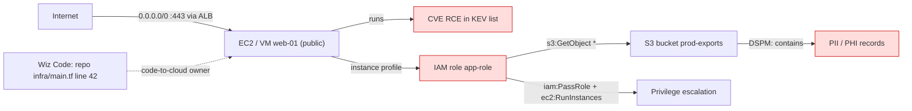
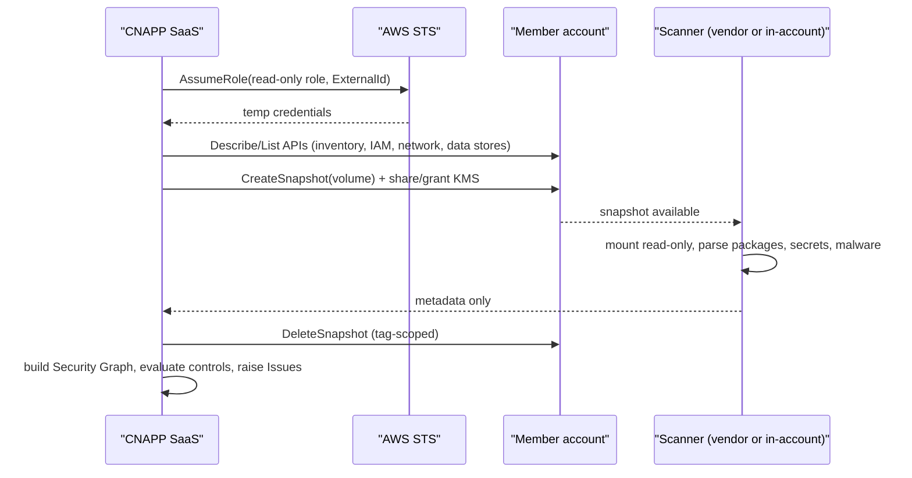

# P1 Wiz & CNAPP (Cloud-Native Application Protection)
> Last verified: 2026-10 · Audience: senior/staff DevOps, SRE, AI eng, NetEng, DevSecOps, architects

## TL;DR
- **CNAPP** = one platform that merges **CSPM** (config posture) + **CWPP** (workload protection) + **CIEM** (entitlements) + **DSPM** (data) + **KSPM** (Kubernetes posture) + **code/IaC/secret scanning** + **vulnerability management**, correlated on one asset/risk graph. Term coined by Gartner (2021).
- The differentiator is **context, not more findings**: a graph that joins exposure + vulnerability + identity + data to surface **toxic combinations / attack paths** and suppress the long tail of isolated findings.
- **Agentless** (API + disk **snapshot** scanning via a read-only cross-account role) gives 100 % coverage in minutes with zero workload impact; **agents/eBPF sensors** are still needed for real-time runtime detection and response. Mature programs run both.
- **Wiz** product line (2026): **Wiz Cloud** (agentless CNAPP: CSPM, CIEM, DSPM, AI-SPM, VM, compliance), **Wiz Code** (IaC/secrets/SCA/SAST/ASPM, code-to-cloud), **Wiz Defend** (CDR using eBPF **Wiz Sensor** + cloud/SaaS logs).
- **Google acquired Wiz**: announced **18 Mar 2025**, **$32B all-cash**, closed **11 Mar 2026**; Wiz joins Google Cloud but commits to remain **multicloud** (AWS, Azure, GCP, OCI).
- Native alternatives: AWS **Security Hub** (new unified, GA **2 Dec 2025**; the old one is now **Security Hub CSPM**) + GuardDuty + Inspector + Macie + IAM Access Analyzer; Azure **Microsoft Defender for Cloud** (Foundational/Defender CSPM + CWPP plans + DevOps security + AI-SPM).
- Interview frame: *"Posture tells you what could happen, runtime tells you what is happening, code tells you where to fix it — CNAPP closes the loop code → cloud → runtime → back to the owning repo/team."*

## P1.1 CNAPP concept and component map
- **How it works:**
  | Acronym | Answers | Typical signal |
  |---|---|---|
  | **CSPM** | Is my cloud configured safely? | Public bucket, open SG 0.0.0.0/0:22, no MFA on root, CIS/benchmark failures |
  | **KSPM** | Is my K8s configured safely? | Privileged pods, no NetworkPolicy, anonymous auth, CIS Kubernetes Benchmark |
  | **CWPP** | Are my workloads (VMs, containers, serverless) vulnerable/compromised? | CVEs, malware, runtime anomalies |
  | **CIEM** | Who/what can do what (effective permissions)? | Unused admin roles, cross-account trust, privilege escalation paths |
  | **DSPM** | Where is sensitive data, who can reach it? | PII/PHI/PCI in buckets, DB snapshots, exposed backups |
  | **Vuln mgmt / SBOM** | Which packages are vulnerable and reachable? | CVE + EPSS/KEV + exposure |
  | **IaC / code / secrets / ASPM** | Will this commit create risk? | Terraform misconfig, hardcoded keys, vulnerable deps |
  | **CDR** | Is an attack happening now in the control/data plane? | CloudTrail/Activity Log anomalies, eBPF process events |
  | **AI-SPM** | What AI models/pipelines/agents exist and are they exposed? | Public endpoints, over-permissive model roles, training data exposure |
- Predecessors were siloed tools (CSPM vendor + CWPP agent + scanner) → duplicated inventory and no correlation. CNAPP = **single inventory + single graph + single policy engine**.
- **Trade-offs / when to use:**
  - CNAPP buy vs. native stack: multicloud estates (AWS + Azure + GCP + OCI) favour a third-party CNAPP; single-cloud shops often reach 80 % with native (Security Hub / Defender for Cloud) at lower cost.
  - Breadth vs. depth: CNAPP runtime is usually lighter than a dedicated EDR (see [P2 CrowdStrike EDR/XDR](./P2-crowdstrike-edr-xdr.md)).
- **Interview angles:**
  - "What is CNAPP?" → list the components, then say *the value is correlation across them*.
  - Pitfall: treating CSPM finding counts as a KPI — 50k findings is noise; measure **critical attack paths closed** and **MTTR per severity**.

## P1.2 Agentless vs agent-based (snapshot scanning)
- **How it works (agentless):**
  - CNAPP gets a **read-only cross-account role / service principal**; enumerates resources via cloud control-plane APIs (Describe/List/Get).
  - For workload depth it **snapshots** the VM disk (EBS, Azure managed disk, GCP PD), shares/copies it to a **scanner** (vendor-hosted, or customer-hosted "outpost"/in-account scanner for data-sovereignty), mounts read-only, inventories OS packages, libraries, secrets, malware, config files; then **deletes the snapshot**.
  - Encrypted disks need **KMS grant / Key Vault wrap-unwrap** permissions (CMK coverage is a separate opt-in in Defender for Cloud).
  - Defender for Cloud example: snapshot stays **in the VM's region**, scanning env is "regional, volatile, isolated"; snapshots kept "typically a few minutes". AWS role `VmScanner` can only delete snapshots tagged `CreatedBy=Microsoft Defender for Cloud`. Available in **Defender CSPM** and **Defender for Servers P2** (malware scanning P2 only).
- **Agent / sensor (eBPF):** process exec, file, network, syscalls in real time; can block/kill; needs DaemonSet/host install, kernel compatibility, CPU/mem budget, lifecycle mgmt.
- **Trade-offs / when to use:**
  | | Agentless | Agent / eBPF sensor |
  |---|---|---|
  | Coverage | All accounts in minutes, incl. stopped VMs & forgotten assets | Only where installed |
  | Freshness | Periodic (≈ daily snapshot cycle; unverified exact cadence per vendor) | Real time |
  | Perf impact | None on workload (cost: snapshot + scanner compute) | Some CPU/mem on node |
  | Runtime detect/respond | No | Yes |
  | Ephemeral/serverless | Scans images/functions packages | Hard for short-lived; sidecar/extension models |
- **Interview angles:**
  - "Why did agentless win the CSPM market?" → coverage + time-to-value + no change-management on prod hosts; Log4Shell showed you need *every* vulnerable host in hours.
  - "Is agentless enough?" → no — it's posture, not detection. Pair with sensor/EDR on internet-facing and crown-jewel workloads.
  - Security of the scanner itself: snapshot of a prod disk contains secrets/PII → insist on in-region scanning, CMK, short retention, in-account scanner option for regulated data ([L3 residency](../L-data-privacy-ai-security/L3-residency-compliance.md)).

## P1.3 Wiz architecture: connectors, Security Graph, issues vs findings
- **How it works:**
  - **Connectors:** AWS (org-level **read-only IAM role** with external ID, deployed via CloudFormation StackSet / Terraform across the AWS Organization), Azure (app registration / **service principal** granted Reader-type roles at **management group / tenant root** scope), GCP (service account at org/folder), OCI, Alibaba, K8s, SaaS, VCS (GitHub/GitLab/Bitbucket/Azure DevOps), registries. Detailed permission sets are in docs.wiz.io (login-gated — role names here are general practice, unverified).
  - **Security Graph:** every resource, identity, network path, vulnerability, secret, data classification, and code origin is a node; edges = "can reach", "can assume", "runs image", "deployed from repo". Queried via the graph explorer / Cloud Configuration Rules / API (GraphQL).
  - **Findings** = raw signals (a CVE on a host, a misconfig, an over-permissive role). **Issues** = prioritized, correlated risk produced by **controls** that match a graph pattern (e.g., *publicly exposed VM with high-severity RCE CVE and a role with admin to S3 containing PII*). Issues have severity, owner (project), status, and drive tickets.
  - **Toxic combination** = co-occurrence of individually "medium" risks that together form a critical **attack path** (exposure → exploitable vuln → lateral identity → sensitive data).
- **Trade-offs / when to use:** graph-based prioritization dramatically shrinks backlog, but it's only as good as connector coverage; a missing account or unscanned registry silently drops edges.
- **Interview angles:**
  - "How do you prioritize 100k findings?" → graph context: **external exposure + exploitability (KEV/EPSS) + identity blast radius + data sensitivity**; fix the *choke point* edge (e.g., remove the public IP or the admin role) rather than every CVE.
  - Follow-up: "Why read-only?" → least privilege, no write path for a compromised vendor; remediation goes through your pipelines/tickets, or a separately-scoped optional remediation role.

## P1.4 Wiz Code: IaC, secrets, code-to-cloud
- **How it works:**
  - Scans **IaC** (Terraform, CloudFormation, Kubernetes manifests, Helm; Wiz cites **1,000+ IaC rules**), **secrets** (in code and container images), **SCA + SBOM**, SAST, malware, sensitive data in code, VCS/CI posture (branch protection, pipeline hardening), and **ASPM** aggregation of third-party scanners.
  - Integration points: IDE plugin, PR/MR scanning (GitHub app, etc.), **Wiz CLI** in CI for IaC/image/dir scans with policy gates, MCP server, Slack.
  - **Code-to-cloud tracing:** links a running cloud resource/container back to the image → Dockerfile → repo/commit/owner, so a cloud issue becomes a PR fix on the correct line.
- **Trade-offs / when to use:** shift-left catches issues pre-deploy, but **policy parity** matters — the same rule must fire in IDE, CI, admission, and runtime posture, or devs learn to bypass gates.
- **Interview angles:**
  - "Where do you gate?" → warn in IDE/PR, **block in CI only for criticals with a fix available**, enforce at admission for K8s; avoid blocking on unfixable CVEs (use exception workflow with expiry).
  - Cross-link: supply-chain/secret scanning and signing → [L6 Secrets & supply chain](../L-data-privacy-ai-security/L6-secrets-supply-chain.md); IaC policy-as-code → [N5](../N-cicd-platform-engineering/N5-iac-pipelines-policy-as-code.md).

## P1.5 Wiz Sensor runtime and Wiz Defend (CDR)
- **How it works:**
  - **Wiz Sensor:** lightweight **eBPF**-based runtime sensor (K8s DaemonSet or host install) for VMs, containers, serverless (per Wiz product page); collects process/file/network events, enforces runtime rules.
  - **Wiz Defend** = **cloud detection & response (CDR)**: correlates Sensor runtime signals + **cloud and SaaS audit logs** (CloudTrail, Azure Activity/Entra logs, GCP Audit) + agentless graph context. Includes **ITDR** (identity) and **DDR** (data) detections, MITRE ATT&CK mapping, AI-specific detections (prompt injection, model exfiltration, MCP server attacks), automated investigation ("Blue Agent"), playbooks, Workflows for response.
- **Trade-offs / when to use:** CDR is cloud-control-plane aware (e.g., "role assumed from new ASN then `CreateAccessKey`") — EDR alone misses this; conversely Wiz's host depth is lighter than a full EDR (CrowdStrike/Defender for Endpoint).
- **Interview angles:**
  - "Difference between CSPM and CDR?" → CSPM = state (could be exploited); CDR = events (is being exploited), with graph context for blast radius.
  - Detection engineering: log coverage first (org CloudTrail incl. data events where needed, Entra sign-in logs), then tune; see [J2 Monitoring & alerting](../J-sre/J2-monitoring-and-alerting.md).

## P1.6 DSPM
- **How it works:** discover data stores (S3/Blob/GCS buckets, RDS/SQL snapshots, DynamoDB/Cosmos, data warehouses, file shares inside VMs), **sample and classify** (PII, PHI, PCI, secrets, custom regex/ML), then join with the graph: *who can read it, is it public, is it encrypted, is it replicated cross-region*.
- **Trade-offs / when to use:** sampling vs full scan cost; in-account scanning for regulated data; classification false positives on test data.
- **Interview angles:** "Shadow data" (forgotten DB snapshot shared publicly) is the classic DSPM win. Native equivalents: **Amazon Macie** (S3-focused), **Defender CSPM data-aware posture / Defender for Storage sensitive data discovery**, Microsoft Purview. Cross-link [L1 Data classification](../L-data-privacy-ai-security/L1-data-classification-pii.md).

## P1.7 AI-SPM
- **How it works:** inventories AI services and assets — managed model platforms (Bedrock, Azure AI Foundry/OpenAI, Vertex AI), self-hosted models, notebooks, training datasets, vector DBs, AI SDK packages in images — producing an **AI-BOM**; flags exposed endpoints, over-privileged model execution roles, training data containing sensitive data, unapproved models.
- Verified: **Wiz Cloud** lists AI-SPM; **Defender CSPM** includes AI-SPM with **AI BOM** and attack paths for gen-AI workloads, plus separate **AI threat protection** plan.
- **Interview angles:** AI risk is mostly *classic cloud risk on new assets* (public endpoint, broad IAM, data leakage) + new runtime threats (prompt injection, tool abuse) → see [L4 AI security threats](../L-data-privacy-ai-security/L4-ai-security-threats.md) and [K8 Agents/MCP](../K-ai-infra-llm/K8-agents-tool-use-mcp.md).

## P1.8 Container and Kubernetes security
- **How it works:**
  - **Build:** image scanning in CI + registry scanning (push-triggered + periodic) — ECR, ACR, GAR.
  - **Deploy:** **admission controller** (validating webhook) blocks images with critical CVEs, unsigned images, privileged pods, `hostPath`, `latest` tags. Wiz ships an admission controller; Defender uses **Azure Policy for Kubernetes** (extends **OPA Gatekeeper v3**); OSS: Kyverno, Gatekeeper, Sigstore policy-controller.
  - **Posture (KSPM):** agentless via cloud API + K8s API (Defender uses **AKS Trusted Access** and a `ClusterRoleBinding` for read access; EKS via access entry/`aws-auth`).
  - **Runtime:** eBPF DaemonSet (Wiz Sensor; Defender sensor `microsoft-defender-collector-ds` needs `SYS_ADMIN`, `SYS_RESOURCE`, `SYS_PTRACE`, egress HTTPS 443); **control-plane detection** from K8s audit logs.
- **Trade-offs / when to use:** admission with `failurePolicy: Fail` can block all deploys if the webhook is down → run HA, exempt `kube-system`, start in audit/dry-run mode.
- **Interview angles:** "Defense in depth for K8s?" → scan → sign → admit → least-privilege RBAC/workload identity → NetworkPolicy → runtime sensor → audit-log detection. Cross-link [L7 Zero trust & workload identity](../L-data-privacy-ai-security/L7-zero-trust-workload-identity.md).

## P1.9 Risk prioritization (exposure + identity + data)
- **How it works:** risk score combines
  - **Exposure:** effective network reachability from the internet (compute the path: IGW/LB/public IP → SG/NSG → NACL → port), not just "has public IP".
  - **Exploitability:** CVSS is necessary but weak → add **CISA KEV**, **EPSS**, exploit availability, package actually loaded (runtime-confirmed).
  - **Identity blast radius:** effective permissions of attached role (CIEM), ability to escalate (`iam:PassRole`, `*:*`), cross-account trust.
  - **Data sensitivity:** DSPM classification of reachable stores.
  - **Business context:** environment tag (prod), project/owner, crown-jewel labels.
- **Interview angles:** "CVSS 9.8 in an isolated batch job vs CVSS 7.5 on an internet-facing pod with admin role to PHI bucket — fix which first?" → the second. AWS Security Hub (new) does the same natively with **exposure findings** + **attack path graph**; Defender CSPM via **attack path analysis** + **cloud security explorer**.

## P1.10 Workflows: projects, RBAC, ticketing, remediation
- **How it works:**
  - **Projects** scope resources (by account/subscription, tags, repos, clusters) to business units; RBAC (SSO/SCIM roles) limits each team to its own projects → each team sees only its issues.
  - **Integrations:** Jira, ServiceNow, Slack/Teams, PagerDuty, SIEM/SOAR (Splunk, Sentinel, Chronicle/Google SecOps), webhooks; bi-directional ticket sync (close issue → close ticket).
  - **Remediation:** guided console/CLI steps, auto-generated IaC fix PRs (code-to-cloud), optional auto-remediation via serverless functions / Workflows; exceptions with justification + expiry.
- **Trade-offs:** auto-remediation in prod risks outages (e.g., closing an SG port that a legacy partner uses) → limit to low-blast-radius fixes (block public S3 ACLs) and require change approval otherwise.
- **Interview angles:** "How do you make devs fix things?" → route to the **owning team** via tags/code-owners, SLA by severity (e.g., critical 7 days / high 30), dashboards per project, fix in code not console (avoid drift). Cross-link [R2 Ticket handling](../R-support-communication/R2-ticket-handling-jira.md).

## P1.11 Compliance framework mapping
- **How it works:** controls (config rules) are mapped to framework requirements: **CIS Benchmarks** (AWS/Azure/GCP Foundations, Kubernetes, OS), **NIST 800-53 / CSF**, **SOC 2** (Trust Services Criteria CC6/CC7), **ISO/IEC 27001:2022 Annex A**, **PCI DSS v4.0**, **HIPAA Security Rule**, GDPR. Produces per-framework posture % and evidence exports.
- Native: Security Hub CSPM standards — **AWS FSBP, CIS AWS Foundations, PCI DSS, NIST** (needs **AWS Config** recording; enable in **all Regions** for full CIS compliance; only sees findings after enablement). Defender for Cloud — **Microsoft cloud security benchmark** (default, multicloud) + regulatory compliance dashboard (Defender CSPM).
- **Interview angles:** CNAPP evidence ≠ certification — it covers *technical* controls; auditors also need process evidence (access reviews, change mgmt). See [P3 SOC 2 / ISO ops](./P3-soc2-iso-compliance-operations.md), [L3 Residency & compliance](../L-data-privacy-ai-security/L3-residency-compliance.md), [Q2 HIPAA engineering](../Q-industry-domains/Q2-healthcare-cloud-hipaa-engineering.md).

## P1.12 Google acquisition of Wiz and implications
- **Facts:** announced **18 Mar 2025**, **$32B all-cash** (Google's largest acquisition), Wiz joins **Google Cloud**; deal **closed 11 Mar 2026**. Both Google and Wiz state products remain available across AWS, Azure, GCP and OCI.
- **Implications to discuss:**
  - Customers on AWS/Azure worry about roadmap bias and data handling by a competitor cloud → ask for contractual multicloud commitments, data residency, and where scanner/snapshot data is processed.
  - Expect tighter integration with **Google Security Operations (Chronicle SIEM/SOAR)**, Mandiant threat intel, and Security Command Center (unverified specifics).
  - Market effect: accelerated consolidation (Palo Alto Cortex Cloud, CrowdStrike, Microsoft unifying Defender portal).

## P1.13 Competitive landscape
| Vendor/product | Model | Notes |
|---|---|---|
| **Wiz** (Google) | Agentless-first + eBPF Sensor | Security Graph, toxic combinations, strong UX; Code/Cloud/Defend |
| **Palo Alto Prisma Cloud → Cortex Cloud** | Agent + agentless | Cortex Cloud = CNAPP + CDR on Cortex (XSIAM) data platform, runtime agent; positioned as successor/evolution of Prisma Cloud (launched 2025 — unverified exact date) |
| **Orca Security** | Agentless pioneer ("SideScanning") | Snapshot scanning, unified data model |
| **CrowdStrike Falcon Cloud Security** | Agent-heritage (Falcon sensor) + agentless CSPM/CIEM | Strong runtime/EDR + threat intel; see [P2](./P2-crowdstrike-edr-xdr.md) |
| **Microsoft Defender for Cloud** | Native CNAPP, multicloud connectors | Free Foundational CSPM; paid Defender CSPM + CWPP plans; moving into Defender portal / XDR |
| **AWS Security Hub (+ CSPM, GuardDuty, Inspector, Macie)** | Native, AWS-only (CSPM can ingest Azure via integration) | Exposure findings, attack path graph, OCSF |
| Others | — | Sysdig (Falco), Aqua, Lacework (acquired by Fortinet), Upwind, Google SCC |
- **Interview angle:** choose on (1) cloud mix, (2) runtime depth needed, (3) existing SOC stack (Sentinel vs Google SecOps vs Splunk), (4) data residency of scanning, (5) price model (per workload/resource vs per finding/check).

## Diagrams
Toxic-combination attack path (what a CNAPP graph surfaces as one critical Issue):


Agentless scan + connector flow:


## Cloud mapping: AWS vs Azure
| Capability | AWS | Azure | Role it plays | Key differences | Alternatives |
|---|---|---|---|---|---|
| CSPM / posture | **Security Hub CSPM** (FSBP, CIS, PCI, NIST) on AWS Config | **Defender for Cloud Foundational CSPM** (free, MCSB) / **Defender CSPM** (paid) | Config checks vs benchmarks, secure score | AWS needs Config recording per Region; Azure policy-based (Azure Policy), multicloud connectors for AWS/GCP | Wiz, Orca, Prisma/Cortex Cloud |
| Unified risk / attack paths | **Security Hub** (new, GA 2 Dec 2025): exposure findings, attack path graph, OCSF | **Defender CSPM**: attack path analysis, cloud security explorer (graph) | Correlation & prioritization | AWS-native only vs Defender's AWS/GCP connectors | Wiz Security Graph |
| Threat detection / CDR | **GuardDuty** (CloudTrail, VPC Flow, DNS, EKS audit, runtime monitoring, S3, RDS, Lambda) | **Defender for Servers/Containers/Storage/Key Vault/Resource Manager/DNS** plans + **Microsoft Sentinel** | Detect active attacks | Azure splits by per-resource plans; GuardDuty is one service with protection-plan toggles | Wiz Defend, CrowdStrike, Cortex Cloud |
| Vulnerability mgmt | **Amazon Inspector** (EC2 agent-based via SSM + agentless, ECR, Lambda) | **Defender Vulnerability Management** via Defender for Servers / agentless scanning; Defender for Containers registry scanning | CVE inventory | Defender agentless in Defender CSPM & Servers P2 | Wiz, Qualys, Tenable |
| DSPM | **Amazon Macie** (S3) | **Defender CSPM** data-aware posture / Defender for Storage sensitive data discovery; **Purview** | Find & classify sensitive data | Macie is S3-centric; Defender covers storage + DBs (scope varies) | Wiz DSPM, Cyera |
| CIEM | **IAM Access Analyzer** (external + **unused access**, 90-day lookback, policy recommendations) | **Defender CSPM** permissions management (CIEM); Entra ID Governance / PIM | Least-privilege, unused access | Entra Permissions Management standalone retired (unverified date) – CIEM folded into Defender CSPM | Wiz CIEM |
| Containers/K8s | GuardDuty EKS + Inspector ECR + EKS Pod Security / Kyverno | **Defender for Containers** (eBPF sensor, Azure Policy/Gatekeeper, ACR/ECR/GAR scanning, Arc for EKS/GKE) | KSPM + runtime + admission | Defender can protect EKS/GKE via Arc | Wiz Sensor + admission controller, Sysdig |
| DevOps / code | **Amazon Inspector** code scanning / CodeGuru (Security) (unverified current state) | **Defender for Cloud DevOps security** (GitHub, Azure DevOps, GitLab connectors) | IaC/secret/code findings with cloud context | Microsoft deeper on code-to-cloud natively | Wiz Code, Snyk, GitHub Advanced Security |
| AI-SPM | Security Hub + Bedrock guardrails (no distinct AI-SPM product, unverified) | **Defender CSPM AI-SPM (AI BOM)** + **AI threat protection** plan | AI asset inventory & threats | Azure has explicit AI-SPM | Wiz AI-SPM |
| CNAPP connector identity | Cross-account **IAM role** (trust vendor account + ExternalId), deployed org-wide via **CloudFormation StackSets** / Terraform | **Service principal / managed identity** with Reader + Security Reader (+ scanner roles) at **management group** scope | Read-only API access for the CNAPP | AWS = per-account role in every member; Azure = one RBAC assignment inherited down the MG hierarchy | Wiz, Orca, Prisma connectors |
- **Security Hub (new) vs Security Hub CSPM:** the original service was renamed **Security Hub CSPM** and is now one input to the unified **Security Hub**, which correlates CSPM + GuardDuty + Inspector + Macie + IAM Access Analyzer into exposure findings, uses **OCSF** (CSPM keeps **ASFF**), has Jira/ServiceNow ticketing, EventBridge automation, resource-based pricing. Security Hub CSPM: **30-day free trial**, regional (use a **cross-Region aggregation** Region + delegated admin in AWS Organizations).
- **Defender for Cloud:** CSPM free tier on every subscription; paid plans per resource type (Servers P1/P2, Containers, Storage, Databases, App Service, Key Vault, Resource Manager, APIs, AI Services). DNS alerts now included in Servers P2 for new customers (since 1 Aug 2023). Being folded into the **Microsoft Defender portal** (XDR) experience.
- **Scope gotchas:** AWS services are **regional** — enable in every Region (incl. unused, attackers love them) and aggregate; Azure enablement is per **subscription**, best via Azure Policy `DeployIfNotExists` at management-group scope.
- **How Wiz connects:** AWS — org-wide read-only role (+ optional scanning permissions for snapshot/KMS) via StackSet; Azure — Entra app/service principal granted roles at tenant-root/management-group; GCP — org-level SA; private repos via an in-network broker (unverified naming).
- **Alternatives:** Kubernetes-native (Falco, Kyverno, Trivy Operator), Cloudflare (CASB/ZT for SaaS posture, not CNAPP), Google **Security Command Center** + Wiz for GCP-first estates.

## Hands-on (optional)
Generic read-only cross-account role for a CNAPP connector (Terraform; apply via StackSet/AFT in each member account):
```hcl
variable "vendor_account_id" { type = string }
variable "external_id" {
  type      = string
  sensitive = true
}

data "aws_iam_policy_document" "trust" {
  statement {
    actions = ["sts:AssumeRole"]
    principals {
      type        = "AWS"
      identifiers = ["arn:aws:iam::${var.vendor_account_id}:root"]
    }
    condition {
      test     = "StringEquals"
      variable = "sts:ExternalId"
      values   = [var.external_id]   # confused-deputy protection
    }
  }
}

resource "aws_iam_role" "cnapp_readonly" {
  name                 = "cnapp-readonly"
  assume_role_policy   = data.aws_iam_policy_document.trust.json
  max_session_duration = 3600
}

resource "aws_iam_role_policy_attachment" "security_audit" {
  role       = aws_iam_role.cnapp_readonly.name
  policy_arn = "arn:aws:iam::aws:policy/SecurityAudit"
}

resource "aws_iam_role_policy_attachment" "view_only" {
  role       = aws_iam_role.cnapp_readonly.name
  policy_arn = "arn:aws:iam::aws:policy/job-function/ViewOnlyAccess"
}

# Snapshot scanning: tag-scoped, no data-plane reads of S3 objects here
data "aws_iam_policy_document" "snapshot_scan" {
  statement {
    actions   = ["ec2:CreateSnapshot", "ec2:CreateTags", "ec2:DescribeSnapshots"]
    resources = ["*"]
  }
  statement {
    actions   = ["ec2:DeleteSnapshot", "ec2:ModifySnapshotAttribute"]
    resources = ["*"]
    condition {
      test     = "StringEquals"
      variable = "ec2:ResourceTag/CreatedBy"
      values   = ["cnapp-scanner"]
    }
  }
}

resource "aws_iam_role_policy" "snapshot_scan" {
  role   = aws_iam_role.cnapp_readonly.id
  policy = data.aws_iam_policy_document.snapshot_scan.json
}
```

Azure: service principal with read roles at management-group scope:
```hcl
resource "azuread_application" "cnapp" { display_name = "cnapp-connector" }
resource "azuread_service_principal" "cnapp" { client_id = azuread_application.cnapp.client_id }

data "azurerm_management_group" "root" { name = var.tenant_root_mg_id }

resource "azurerm_role_assignment" "reader" {
  scope                = data.azurerm_management_group.root.id
  role_definition_name = "Reader"
  principal_id         = azuread_service_principal.cnapp.object_id
}

resource "azurerm_role_assignment" "security_reader" {
  scope                = data.azurerm_management_group.root.id
  role_definition_name = "Security Reader"
  principal_id         = azuread_service_principal.cnapp.object_id
}
```

Enable native services (bash):
```bash
# AWS: delegate admin from the management account, then enable in the security account
aws organizations enable-aws-service-access --service-principal securityhub.amazonaws.com
aws securityhub enable-organization-admin-account --admin-account-id 111122223333
aws securityhub enable-security-hub --enable-default-standards        # CSPM: FSBP + CIS by default
aws securityhub create-finding-aggregator --region-linking-mode ALL_REGIONS
aws guardduty create-detector --enable --finding-publishing-frequency FIFTEEN_MINUTES
aws inspector2 enable --resource-types EC2 ECR LAMBDA
aws macie2 enable-macie
aws accessanalyzer create-analyzer --analyzer-name org-unused --type ORGANIZATION_UNUSED_ACCESS

# Azure: Defender plans per subscription
az security pricing create -n CloudPosture --tier Standard        # Defender CSPM
az security pricing create -n VirtualMachines --tier Standard --subplan P2
az security pricing create -n Containers --tier Standard
az security pricing create -n StorageAccounts --tier Standard --subplan DefenderForStorageV2
az security pricing list -o table
```
- Gotchas: Security Hub CSPM needs **AWS Config** recording first and per-Region enablement (or central configuration policies); run `az security pricing` per subscription or enforce with Azure Policy at MG scope.

## Cross-links
- [C4 Security](../C-large-scale-architecture/C4-security.md)
- [L6 Secrets & supply chain](../L-data-privacy-ai-security/L6-secrets-supply-chain.md) · [L7 Zero trust & workload identity](../L-data-privacy-ai-security/L7-zero-trust-workload-identity.md) · [L1 Data classification](../L-data-privacy-ai-security/L1-data-classification-pii.md) · [L3 Residency & compliance](../L-data-privacy-ai-security/L3-residency-compliance.md) · [L4 AI security threats](../L-data-privacy-ai-security/L4-ai-security-threats.md)
- [P2 CrowdStrike EDR/XDR](./P2-crowdstrike-edr-xdr.md) · [P3 SOC 2 / ISO compliance ops](./P3-soc2-iso-compliance-operations.md) · [P4 Identity providers](./P4-identity-providers.md)
- [N5 IaC pipelines & policy-as-code](../N-cicd-platform-engineering/N5-iac-pipelines-policy-as-code.md) · [J2 Monitoring & alerting](../J-sre/J2-monitoring-and-alerting.md)

## Sources
- https://blog.google/inside-google/company-announcements/google-agreement-acquire-wiz/
- https://www.wiz.io/blog/google-closes-deal-to-acquire-wiz
- https://www.wiz.io/platform/wiz-cloud
- https://www.wiz.io/platform/wiz-code
- https://www.wiz.io/platform/wiz-defend
- https://www.wiz.io/academy/cloud-security/agentless-scanning
- https://docs.aws.amazon.com/securityhub/latest/userguide/what-is-securityhub.html
- https://docs.aws.amazon.com/securityhub/latest/userguide/what-is-securityhub-v2.html
- https://aws.amazon.com/blogs/aws/aws-security-hub-now-generally-available-with-near-real-time-analytics-and-risk-prioritization/
- https://learn.microsoft.com/en-us/azure/defender-for-cloud/defender-for-cloud-introduction
- https://learn.microsoft.com/en-us/azure/defender-for-cloud/concept-agentless-data-collection
- https://learn.microsoft.com/en-us/azure/defender-for-cloud/defender-for-containers-architecture
- https://www.paloaltonetworks.com/cortex/cloud
