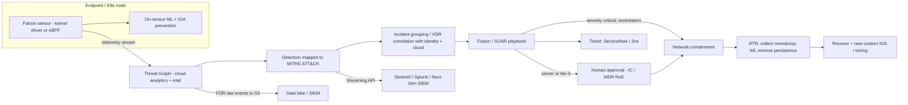
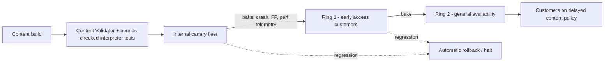

# P2 CrowdStrike, EDR & XDR
> Last verified: 2026-10 · Audience: senior/staff DevOps, SRE, AI eng, NetEng, DevSecOps, architects

## TL;DR
- **EPP prevents, EDR records and responds, XDR correlates across domains (endpoint, identity, email, cloud), MDR is a service where people run it for you, SIEM stores and searches logs, SOAR automates the response.** Interviewers want you to know where each one sits in the pipeline, not their marketing definitions.
- **CrowdStrike Falcon** is one lightweight sensor that streams telemetry to a cloud graph (**Threat Graph**). Detection and hunting happen mostly in the cloud. Modules are licensed separately but use the same agent: NGAV/EDR, identity, cloud (CNAPP), **Next-Gen SIEM** (built on LogScale), **Exposure Management**, **Charlotte AI**, and **Falcon Complete** MDR.
- **IOAs** describe attacker *behaviour* (what is happening, such as an Office app spawning PowerShell that injects into LSASS). **IOCs** are *artifacts* (hashes, IPs, domains) and they go stale fast. Map both to **MITRE ATT&CK**. As of ATT&CK content **v19** there are **15 Enterprise tactics**, because Defense Evasion was split into **Stealth (TA0005)** and **Defense Impairment (TA0112)**.
- The **Windows sensor runs in the kernel** (`csagent.sys`). The **Linux sensor can run as user-mode eBPF** (`FALCON_BACKEND=auto|bpf|kernel`), which has a smaller blast radius and does not depend on kernel-module support. **RFM** (Reduced Functionality Mode) is what the Linux kernel-mode sensor falls back to when it does not support the running kernel.
- Main lesson of **July 2024** (details in [J4.10](../J-sre/J4-incident-response-postmortems.md#j410-famous-public-postmortems-as-interview-anecdotes)): **content is code**. Use **canary → rings → bake time**, give customers control over **N/N-1 sensor and content pinning**, and add runtime bounds checks. Industry follow-up: the **Microsoft Windows Resiliency Initiative** (user-mode endpoint-security platform, **MVI 3.0** safe-deployment requirements, **Quick Machine Recovery**).
- Deploying at scale is mostly a **platform-engineering problem**: golden images (be careful with the AID/agent ID in VDI), SSM Distributor / Intune / GPO, a K8s **DaemonSet** for nodes, a **sidecar injector** for Fargate and other serverless containers, and automated coverage reporting ("unmanaged hosts" is a KPI).
- Native cloud alternatives: **GuardDuty Runtime Monitoring** (EKS, ECS-Fargate, EC2) on AWS and **Defender for Servers** (MDE plus agentless scanning, with **Azure Arc** for non-Azure machines) on Azure.

## P2.1 Security tool categories: EPP vs EDR vs XDR vs MDR vs SIEM vs SOAR
| Category | What it does | Data | Who operates | Example |
|---|---|---|---|---|
| **EPP / NGAV** | Pre-execution prevention: ML on file features, exploit blocking, signatures | Files, process launch | Policy owners | Falcon Prevent, Defender Antivirus |
| **EDR** | Continuous endpoint telemetry ("DVR"), behavioural detection, investigation, host response | Process, file, registry, network and driver events | SOC tier 1–3 | Falcon Insight, MDE P2, SentinelOne |
| **XDR** | Correlation and response across endpoint, identity, email, cloud and network, with one incident per attack | Several first-party telemetry sources (native XDR) or third-party ones (open XDR) | SOC | Falcon Insight XDR, Microsoft Defender XDR, Cortex XDR |
| **MDR** | A **service**: a 24/7 vendor SOC triages and responds, often with authority to contain | Vendor tooling | Vendor analysts | Falcon Complete, Defender Experts for XDR/Servers |
| **SIEM** | Ingests, normalizes, retains and searches **all** logs. Correlation rules, compliance retention | Any log source | SOC / detection engineering | Splunk, Sentinel, Falcon Next-Gen SIEM |
| **SOAR** | Playbooks: enrichment, ticketing, automated containment | API calls | SecOps engineering | Falcon Fusion / Agentic SOAR, Sentinel playbooks (Logic Apps) |
| **ITDR** | Identity threat detection (AD/Entra: Kerberoasting, golden ticket, MFA abuse) | DC traffic, IdP logs | SOC/IAM | Falcon Identity, Defender for Identity |
| **CNAPP/CDR** | Cloud posture, workload protection, cloud detection & response | Cloud APIs, runtime | Cloud sec | see [P1 Wiz/CNAPP](P1-wiz-cnapp.md) |
- **Trade-offs / when to use:**
  - EDR alone produces alerts that someone has to work. Without a 24/7 SOC, buy **MDR** rather than more tools.
  - **SIEM vs XDR:** XDR gives curated detections on the vendor's own data at low cost per event. A SIEM is still needed for third-party logs, long retention (audit/regulatory) and custom detections. The trend is to merge them: Falcon Next-Gen SIEM, Sentinel inside the Defender portal.
  - Native XDR (one vendor) gives deeper correlation but more lock-in. Open XDR is more flexible but correlation is shallower.
- **Interview angles:**
  - "We have EDR, why do we still get breached?" → coverage gaps (unmanaged hosts, Linux, containers), alert fatigue with no one triaging, identity attacks that never touch a managed endpoint, and response that isn't authorized ahead of time.
  - "SIEM costs are exploding" → tier the data (hot/cold), send EDR raw telemetry only where you hunt on it, filter at the source, use the XDR's own data lake for endpoint data.

## P2.2 CrowdStrike Falcon platform and modules
- **How it works:**
  - **Single lightweight sensor** + cloud-native backend. Telemetry is streamed to the **Threat Graph** (a cloud graph database of events and relationships). CrowdStrike also uses the term "Enterprise Graph" for the wider cross-domain data. Most detection logic, threat intel and hunting run in the cloud, while prevention (ML plus IOA blocking) runs on the sensor so it still works offline.
  - Modules sold as SKUs and enabled on the same sensor and console (names from crowdstrike.com, 2026):
    - **Endpoint Security**: **Falcon Prevent** (NGAV), **Falcon Insight XDR** (EDR/XDR), Device Control, Firewall Management.
    - **Threat hunting**: **Falcon OverWatch**, the managed 24/7 human hunting service. It now sits under the "Threat Intelligence & Hunting" / Counter Adversary Operations line (the exact branding changes often).
    - **Falcon Complete Next-Gen MDR**: fully managed detection *and* remediation, done by CrowdStrike under pre-authorized actions.
    - **Next-Gen Identity Security** (was Falcon Identity Protection, from the Preempt acquisition): AD/Entra ITDR and real-time MFA step-up at the DC.
    - **Cloud Security** (Falcon Cloud Security, CNAPP): agent (sensor) plus agentless CSPM/CIEM/CWP/ASPM.
    - **Next-Gen SIEM**, built on **Falcon LogScale** (Humio acquisition). Index-free, compression-heavy log management. Native Falcon data plus third-party connectors.
    - **Agentic SOAR** / **Falcon Fusion** workflows. **Charlotte AI** (GenAI/agentic analyst).
    - **Exposure Management** (asset inventory, vulnerability prioritization, attack-surface), **IT Automation**, **XIoT Security**, **Data Security**, **SaaS Security (SSPM)**, **AI Detection & Response**, **Seraphic Enterprise Browser**.
  - Customer tenants are split by **cloud region**: `us-1`, `us-2`, `us-3`, `eu-1`, `us-gov-1`, `us-gov-2`. This affects API base URLs, data residency and FedRAMP scope.
- **Trade-offs / when to use:**
  - The single agent and cloud graph mean less host overhead and fast global intel. The cost is heavy dependence on cloud connectivity for full EDR, plus vendor concentration (July 2024 showed the downside).
  - Every module is an extra SKU. Platform consolidation is cheaper per capability but deepens lock-in.
- **Interview angles:**
  - "Why cloud-native EDR?" → correlation across the whole customer base, no on-prem server to scale, new detections without upgrading the sensor (Rapid Response Content). The other side: content changes reach millions of hosts within minutes, so **blast-radius control matters more**.

## P2.3 Sensor architecture (Windows kernel driver, Linux eBPF, RFM)
- **How it works:**
  - **Windows:** a kernel-mode driver (`csagent.sys`; the RCA stack trace shows `csagent!TemplateGetString`) plus user-mode services. It hooks kernel callbacks (process, thread, image load, registry, file minifilter, network/WFP) and uses an **ELAM** boot-start driver so it loads early. Content and channel files live in `C:\Windows\System32\drivers\CrowdStrike\`.
  - **Sensor Content** ships with sensor releases (code, ML models, **Template Types**) and goes through full QA. **Rapid Response Content** consists of **Template Instances** delivered as channel files. They are config interpreted by the in-kernel **Content Interpreter**, update **several times a day**, and change behaviour without a code release.
  - **Linux:** two backends, **kernel** (a kernel module, which requires a supported kernel) and **user mode / eBPF** (`bpf`). Installer `FALCON_BACKEND=auto|bpf|kernel`. In K8s, the process name shows the mode: `falcon-sensor` means kernel and `falcon-sensor-bpf` means eBPF. The eBPF backend uses the kernel's verified, sandboxed eBPF runtime, so a bug cannot panic the kernel the way a faulty module can. This removes the problem of kernel-version support and is the default choice on fast-moving distros and managed node images.
  - **RFM (Reduced Functionality Mode):** when the kernel-mode Linux sensor sees an unsupported kernel, it keeps running with limited visibility and prevention and shows as RFM in the console. Check with `falconctl -g --rfm-state`. Moving to the eBPF backend usually removes RFM risk caused by kernel churn. *(RFM details come from CrowdStrike support docs that need a login; unverified on a public page.)*
  - **macOS:** uses Apple's **Endpoint Security framework** and system extensions. Third-party kexts are not used. This is the model Microsoft is copying for Windows.
  - Identity: each host gets an **AID** (agent ID) at first registration, under the tenant **CID** (customer ID, with a checksum suffix). Grouping uses **sensor tags** (`FALCON_TAGS` / `--tags`) and host groups.
  - **Uninstall and maintenance protection**: removing or upgrading the sensor needs a maintenance token, so an attacker with local admin cannot just uninstall it. For the K8s node DaemonSet this cannot be used on sensor 7.34+ (per falcon-helm).
- **Trade-offs:** kernel mode gives the most visibility and tamper resistance and can block synchronously. The cost is that a bug means a **BSOD/kernel panic**, which fails closed for availability. User mode / eBPF has a smaller blast radius, but visibility depends on what the OS exposes and some tamper resistance is lost.
- **Interview angles:** "Why does an EDR need the kernel at all?" → to block synchronously before an action finishes (process creation, file write), to resist tampering by admin-level malware, and for full visibility. Then say the industry is moving to OS-provided security APIs (macOS ESF, Linux eBPF, Windows' coming user-mode platform). See [A1 Why an OS](../A-operating-systems/A1-why-an-os.md) for the background on kernel vs user mode.

## P2.4 Sensor update policies and staged content rollout (post-2024)
- **How it works:**
  - **Sensor update policies** control the sensor *code* version per host group: **Auto – Latest (N)**, **Auto – N-1**, **Auto – N-2**, a pinned specific build, or Sensor Updates Off. Common practice is a canary group on N, most production on N-1, and critical infrastructure on N-2. `FALCON_SENSOR_UPDATE_POLICY_NAME` in the installer attaches a policy at install time.
  - **Content update policies** (added after the RCA): customers decide **where and when Rapid Response Content is deployed**, for example early-access vs general-availability timing, delayed rings, and **sensor content pinning** (RCA, Aug 2024). Exact setting names in the console are *(unverified)*. There are subscribable release notes for content updates.
  - CrowdStrike's internal process after 2024: **canary testing → successive deployment rings with bake time** in which crash, false-positive volume and performance telemetry are checked, then promote or **roll back**. The **Content Validator** now allows only wildcards in the 21st IPC field, and the **Content Interpreter has runtime array bounds checks**. Two independent third-party code/process reviews were done.
- **Trade-offs:** delaying content reduces the risk of a bad update but **increases exposure to new threats**. Detection content is time-sensitive, so use rings measured in hours for content and weeks for sensor code, not one fixed delay for everything.
- **Interview angles:**
  - "Design a safe rollout for security content" → treat it like code: schema/compile-time validation, fuzzing, canary on internal fleet, rings by customer/region/host-criticality, automatic halt on crash or FP signals, a fast kill switch, and **a recovery path that does not depend on the host being healthy**. Link this to [J6 release engineering](../J-sre/J6-toil-release-engineering.md) and [C5 deployment](../C-large-scale-architecture/C5-deployment.md).
  - Pitfall: putting everything on "Auto – Latest" because the vendor recommends it. Ask what your rings are and who owns the policy.

## P2.5 Detections: IOAs vs IOCs, MITRE ATT&CK mapping
- **How it works:**
  - **IOC** = a known-bad artifact: file hash, IP, domain, URL, mutex. Cheap and precise, but **reactive**. The Pyramid of Pain applies: hashes and IPs are trivial for an attacker to change, TTPs are not. Falcon supports **custom IOCs** with an action (detect/block/allow) per host group.
  - **IOA** = a behavioural sequence that shows *intent*, whatever the malware (for example `winword.exe → powershell -enc → network → LSASS access`). It catches fileless, LOLBin (living-off-the-land binary) and hands-on-keyboard attacks. Falcon offers **Custom IOA rules** (process/file/network/domain creation patterns) for your own detections.
  - Every detection is tagged with ATT&CK **tactic / technique** (for example T1059.001 PowerShell, T1003.001 LSASS Memory). Severity and confidence feed incident grouping.
  - **MITRE ATT&CK (content v19.x as of 2026)**: 15 Enterprise tactics TA0043 Reconnaissance, TA0042 Resource Development, TA0001 Initial Access, TA0002 Execution, TA0003 Persistence, TA0004 Privilege Escalation, **TA0005 Stealth**, **TA0112 Defense Impairment**, TA0006 Credential Access, TA0007 Discovery, TA0008 Lateral Movement, TA0009 Collection, TA0011 C2, TA0010 Exfiltration, TA0040 Impact. Older material shows 14 tactics with "Defense Evasion". ATT&CK now also publishes **Detection Strategies** and **Analytics**.
  - **MITRE Engenuity ATT&CK Evaluations** are the public vendor tests. Read the *detection* and *technique* coverage numbers, not the vendors' "100%" marketing.
- **Trade-offs:** IOAs need tuning (FPs on admin tooling), while IOCs have near-zero false positives but short lifetimes. ATT&CK coverage heatmaps are a planning tool, not proof of detection quality.
- **Interview angles:** "How do you measure detection coverage?" → map rules to ATT&CK techniques that are relevant to *your* threat model, validate with **purple-team / Atomic Red Team** emulation, and track MTTD and the true-positive rate per rule. Link to [J7 chaos engineering](../J-sre/J7-chaos-engineering.md) for the "test in prod" mindset.

## P2.6 Response: Real Time Response, network containment, remediation
- **How it works:**
  - **Network containment** (host isolation): the sensor blocks all network traffic **except the connection to the Falcon cloud** and any **containment policy allowlist** (for example a remediation server or DNS). The host stays manageable and the attacker loses connectivity. MDE equivalent: **Isolate device** (full or selective).
  - **Real Time Response (RTR)**: a remote shell through the sensor's cloud channel with role-tiered commands. **Responder** can do `ls`, `ps`, `netstat`, `get` (file pull), `kill`, `rm`, `reg`. **Active Responder / Admin** can do `put`, `run`, `runscript` (custom scripts) and `memdump`. Every session is audited. **RTR is privileged remote code execution on every host**, so protect it with RBAC, MFA and session logging (see [L7](../L-data-privacy-ai-security/L7-zero-trust-workload-identity.md#l72-human-identity-sso-phishing-resistant-mfa-conditional-access-device-posture-jitjea)).
  - Other actions: kill process, quarantine file (with release from quarantine), hash block via custom IOC, **Falcon Fusion** workflows that, for example, contain a host on critical severity and open a ticket. Identity can force MFA or a password reset.
- **Trade-offs:** auto-containing a **server** can cause an outage. Use auto-contain for workstations and human approval (or pre-authorized MDR) for production servers. Always keep an exclusion list of tier-0 or critical hosts where containment needs IC sign-off.
- **Interview angles:** "Ransomware is spreading laterally, what do you do?" → contain patient zero and its lateral-movement targets, disable the compromised identities (AD/Entra), block IOCs fleet-wide, preserve evidence (RTR `memdump` and `get`) *before* reimaging, and check that backups are clean.

## P2.7 Deploying at scale (golden images, VDI, Kubernetes, Fargate, serverless)
- **Golden images / AMIs:** install the sensor in the image with the CID, but **do not let the image register with an AID**. Either install without starting the service, or remove the AID before sealing (CrowdStrike documents a "no-start" install for imaging, `NO_START=1` on Windows *(unverified flag name)*). Otherwise all clones share one AID and show up as a single host.
- **VDI / non-persistent desktops:** use the **VDI install flag** (`VDI=1` on Windows) so each clone registers its own AID that is tied to the hostname. Without it the console fills with ghost hosts and licences run out. Set up inactive-host cleanup.
- **Fleet push:** Windows via Intune/SCCM/GPO. Linux via package repo plus config management or the `falcon-linux-install.sh` script (API-driven download plus CID). **AWS:** **SSM Distributor** package `FalconSensor-CrowdStrike` and the automation doc `CrowdStrike-FalconSensorDeploy`, with credentials in Parameter Store (`/CrowdStrike/Falcon/ClientId|ClientSecret|Cloud`) or Secrets Manager. The API client needs **Installation Tokens: READ** and **Sensor Download: READ**. A **State Manager association** re-runs it on a schedule so new instances get covered. **Azure:** VM extensions / Azure Policy / **Azure Arc** for hybrid machines.
- **Kubernetes:**
  - **Node sensor DaemonSet** (`crowdstrike/falcon-sensor` Helm chart, `node.enabled=true`): a privileged pod per node that sees every container on the node. This is the preferred option wherever you control the nodes (EKS EC2, AKS, GKE Standard).
  - **Container sensor sidecar injector** (`container.enabled=true`): a mutating admission webhook (port **4433**) injects the sensor into each pod. Needed where there is **no node access**: **EKS on Fargate**, **ECS Fargate** (task-definition patching), and similar.
  - **Falcon Operator** (Red Hat-certified) is preferred for **OpenShift**. **GKE Autopilot** needs a `WorkloadAllowlist` / `AllowlistSynchronizer`.
  - Plus **Kubernetes Admission Controller** and **Image Assessment** (registry/CI scanning) from Falcon Cloud Security.
  - Mirror sensor images into your own registry (ECR/ACR). Do not pull from the vendor registry at runtime.
- **Serverless (Lambda/Functions):** no persistent host, so use the vendor's agentless/serverless scanning plus cloud-log detection (CloudTrail/Activity Log). The Falcon Lambda/serverless options are *(unverified scope)*.
- **Coverage as a KPI:** reconcile cloud inventory (Config/Resource Graph) and CMDB against the Falcon host list and alert on unmanaged hosts. Exposure Management / "unmanaged assets" helps with this.
- **Interview angles:** "How do you guarantee every EC2 has the agent?" → put it in the AMI pipeline, add a State Manager association as a backstop, add an SCP/Config rule or a tag-based compliance check, and report coverage drift every day. Same pattern on AKS: DaemonSet plus Azure Policy.

## P2.8 Tuning and false positives
- **How it works:**
  - Exclusion types, from narrowest to broadest: **detection suppression** (hide a specific pattern on specific hosts), **IOA exclusions** (a process command-line regex for one IOA), **ML exclusions** (path/glob, which skip ML scanning), **Sensor Visibility exclusions** (*no telemetry at all*, the most dangerous), and **custom IOC allow**.
  - **Prevention policy** levels are set per OS and host group (ML aggressiveness detect vs prevent, sensor-level features like script control and exploit mitigation). Roll prevention out **detect-only first**, measure FPs, then switch to prevent in rings.
  - Common FP sources: developer tooling (compilers, `curl | bash`), IT admin scripts (RMM, PsExec), backup/AV interplay, CI runners, and DB/IO-heavy servers (performance-related exclusions).
- **Trade-offs:** every exclusion is a **blind spot that attackers know to abuse** (for example dropping payloads into excluded build directories). Prefer narrow exclusions with an owner and an expiry date, and manage them as code (Terraform/API, reviewed in PRs).
- **Interview angles:** "SOC is drowning in alerts" → measure the FP rate per detection, tune the noisiest 10, auto-close known-benign patterns with SOAR, raise severity thresholds for paging, and route low-severity alerts to tickets. This is the same alert-hygiene thinking as [J2 monitoring & alerting](../J-sre/J2-monitoring-and-alerting.md).

## P2.9 Integrating with SIEM, SOAR and ticketing
- **How it works:**
  - **Falcon Streaming API / event streams** send near-real-time detections and audit events to a SIEM. Splunk add-on, Sentinel and others use this.
  - **Falcon Data Replicator (FDR)** delivers *raw* sensor telemetry as batched files to an **S3 bucket** (CrowdStrike-managed or customer-managed) with SQS notifications. This is the bulk feed for data lakes and SIEMs.
  - **Microsoft Sentinel** connectors (from the Sentinel reference): *CrowdStrike API Data Connector (via Codeless Connector Framework)*, *CrowdStrike Falcon Data Replicator (User Managed AWS-S3) (via CCF)*, *CrowdStrike-Managed AWS S3*, and *CrowdStrike Falcon Adversary Intelligence*.
  - **AWS Security Hub CSPM**: "CrowdStrike Falcon" is a **Send findings** integration (product ARN `…:517716713836:product/crowdstrike/crowdstrike-falcon`) through the open-source **falcon-integration-gateway**. Findings go to ASFF, then EventBridge, then automation.
  - Ticketing/ChatOps: Falcon Fusion / Agentic SOAR has actions for ServiceNow, Jira, Slack and Teams. Alternatively, have the SIEM/SOAR open the ticket with dedup keys = detection/incident ID (see [R2 ticket handling](../R-support-communication/R2-ticket-handling-jira.md)).
- **Trade-offs:** sending only detections is cheap but loses hunting context. Sending all of FDR into a SIEM is costly at petabyte scale. Common middle ground: FDR into a cheap lake (S3/ADLS + Athena/Databricks/Data Explorer) and only detections into the SIEM.
- **Interview angles:** idempotent ticket creation (one ticket per incident, not per detection), bidirectional status sync (closing the ticket closes the detection), and preserving the audit trail for SOC 2 / ISO evidence ([P3](P3-soc2-iso-compliance-operations.md)).

## P2.10 Incident response workflow with EDR
- **How it works (NIST SP 800-61 style):** **Detect** (EDR detection or hunting lead) → **Triage** (process tree, parent/child, command lines, network, user; check whether it is real and what scope it has) → **Scope** (search Threat Graph/LogScale for the IOC or behaviour across the fleet, look for lateral movement via identity logs) → **Contain** (network containment, disable accounts, block IOCs) → **Eradicate** (kill/quarantine, remove persistence, reimage) → **Recover** (release containment, monitor more closely) → **Lessons learned** (new custom IOA, tuning, postmortem).
- Collect evidence **before** wiping: memory dump, triage package, and an EDR event timeline.
- Run this with the incident-command roles from [J4.3](../J-sre/J4-incident-response-postmortems.md#j43-incident-command-system-roles-ic-ops-lead-comms-lead-scribeplanning). Legal and comms join early when data may have been exposed.
- **Interview angles:**
  - "MDR is engaged, who decides to isolate a domain controller?" → it is pre-agreed in the **rules of engagement / RACI**. The MDR gets pre-authorization for workstations, and tier-0 needs the customer IC.
  - Metrics: MTTD, MTTR, dwell time. CrowdStrike markets "1-10-60" (detect in 1 min, investigate in 10, remediate in 60) as a target.

## P2.11 Competitors: Defender for Endpoint/XDR, SentinelOne, Cortex XDR
| | **CrowdStrike Falcon** | **Microsoft Defender for Endpoint / Defender XDR** | **SentinelOne Singularity** | **Palo Alto Cortex XDR / XSIAM** |
|---|---|---|---|---|
| Agent model | Single lightweight sensor, cloud-heavy analytics | Built into Windows (Defender AV + EDR sensor). Onboard via Intune/GPO/script. Linux/macOS agents | Single agent with strong **on-device autonomous AI**, so it works offline. **Storyline** correlation | Cortex XDR agent plus NGFW/Prisma data |
| Strength | Threat intel, OverWatch hunting, Falcon Complete MDR | **Licensing** (M365 E5 includes MDE P2). XDR across email/identity/cloud apps. **Automatic attack disruption**, AIR | Autonomous remediation, **1-click rollback** on Windows (VSS-based) | Network plus endpoint correlation. XSIAM SOC platform |
| SIEM | Next-Gen SIEM (LogScale) | **Microsoft Sentinel** (unified in Defender portal) | Singularity Data Lake / AI SIEM | XSIAM |
| Note | July 2024 outage changed buyer perception of content safety | Plans: **MDE P1, P2, Defender for Business**. Runs in **passive mode** next to third-party AV. EDR in block mode | | |
- **Interview angles:** "Why would a Microsoft shop still buy CrowdStrike?" → more mature MDR and intel, better cross-OS consistency, no single-vendor dependency (OS plus security from the same company). Counter-argument: MDE is "free" in E5 and integrates natively with Entra conditional access through device risk. Running **two EDRs** in active mode on one host is an anti-pattern. Use MDE in passive mode instead.

## P2.12 Lessons from July 2024 and the move out of the kernel
- Incident facts are in [J4.10](../J-sre/J4-incident-response-postmortems.md#j410-famous-public-postmortems-as-interview-anecdotes): Channel File 291, 21 vs 20 IPC fields, 04:09–05:27 UTC, Windows sensor 7.11+, BSOD loop, manual WinRE/Safe Mode recovery with BitLocker keys. Linux and macOS were not affected.
- **Lessons:**
  1. **Config/content is code.** Run it through the same validation, fuzzing, canary and rings as code. "It's just data" is how most 2024–2025 global outages started.
  2. **Kernel privilege multiplies the blast radius.** An exception in user mode crashes a process. In the kernel it crashes the OS, and a **boot-start driver crash loop prevents the remote fix from arriving**.
  3. **Recovery must not depend on the failed component.** Have offline BitLocker key escrow, out-of-band management, PXE/reimage paths, and break-glass procedures that you actually rehearse.
  4. **Customer-side controls:** use N-1/N-2 sensor policies, content rings, separate policies for critical infrastructure, and **vendor diversity** for the most critical systems (for example, don't put every DC and every kiosk on the same day-0 content).
  5. **Concentration risk** is a board-level vendor-risk topic, the same as a single-cloud dependency.
- **Microsoft Windows Resiliency Initiative** (announced Nov 2024, update **June 26 2025**):
  - A **Windows endpoint security platform** that lets AV/EDR **run in user mode "just as apps do"**. **Private preview for selected MVI partners from July 2025.** GA timing is *(unverified as of 2026-10)*.
  - **MVI 3.0** (Microsoft Virus Initiative) requires partners to use **safe deployment practices** (gradual rollout, deployment rings, monitoring) and to test their incident-response processes.
  - **Quick Machine Recovery (QMR)**: when a widespread boot failure happens, Windows RE (the Windows Recovery Environment) connects to the network and applies targeted fixes from Windows Update. Windows 11 24H2. Admin-controllable on Pro/Enterprise.
  - Named partners: Bitdefender, **CrowdStrike**, ESET, **SentinelOne**, Sophos, Trellix, Trend Micro, WithSecure.
- **Interview angles:** "Would you still run kernel EDR in 2026?" → yes on Windows until the user-mode platform reaches GA. Mitigate with rings, N-1, and a tested mass-recovery runbook. On Linux, prefer the eBPF backend. Long term, OS-provided security APIs (ESF, eBPF, the Windows platform) are the right architecture.

## Diagrams




## Cloud mapping: AWS vs Azure
| Capability | AWS | Azure | Role it plays | Key differences | Alternatives |
|---|---|---|---|---|---|
| Native runtime threat detection | **GuardDuty Runtime Monitoring** (EKS, ECS on Fargate, EC2) | **Defender for Servers P1/P2** (MDE-based) + **Defender for Containers** | Cloud-native EDR-lite for workloads | GuardDuty: managed security agent, detects threats but has **no RTR or host isolation**. Defender for Servers: full MDE EDR, multicloud (AWS/GCP via connectors, on-prem via **Arc**) | CrowdStrike, SentinelOne, Sysdig/Falco, Wiz Defend |
| Full EDR/XDR | CrowdStrike/S1 from AWS Marketplace | **Defender for Endpoint + Defender XDR** (first-party) | Endpoint detection & response | Azure has a first-party EDR. AWS does not | CrowdStrike Falcon, Cortex XDR |
| Agent deployment | **SSM Distributor** + State Manager association (`FalconSensor-CrowdStrike`) | VM extensions, **Azure Policy**, Intune; **Azure Arc** for hybrid | Guarantee coverage at scale | SSM needs the SSM agent + instance profile. Arc projects non-Azure machines into ARM so Policy/extensions work | Ansible, golden images |
| K8s coverage | EKS: DaemonSet; **EKS Fargate / ECS Fargate: sidecar** | AKS: DaemonSet; ACI: sidecar-style only | Container runtime protection | GuardDuty does **not** support EKS on Fargate | Falco (CNCF), Tetragon |
| Findings aggregation | **Security Hub CSPM** (CrowdStrike sends findings via falcon-integration-gateway), EventBridge | **Defender for Cloud** + **Microsoft Sentinel** (CrowdStrike FDR/API connectors) | Single pane, routing to automation | Security Hub uses ASFF findings, not a SIEM. Sentinel is a full SIEM/SOAR (KQL, Logic Apps) | Splunk, Falcon Next-Gen SIEM, Chronicle/SecOps |
| Raw telemetry lake | S3 (FDR target) + Athena / **Security Lake** (OCSF) | ADLS / **Sentinel data lake** / Azure Data Explorer | Hunting, long retention | Security Lake normalizes to OCSF | Databricks, LogScale |
| Managed SOC | AWS Security Incident Response (service) / partner MDR | **Defender Experts for XDR / Servers** | 24/7 human response | Microsoft's MDR only covers Defender-generated alerts | Falcon Complete |
- **GuardDuty Runtime Monitoring:** watches OS-level file, process and network events through a GuardDuty security agent that GuardDuty can install and update for you (EKS add-on, ECS Fargate sidecar, EC2 via SSM). It is regional, has a 30-day trial and is priced per vCPU/instance-hour. It is good for "cheap baseline everywhere" but is **not** a replacement for EDR in incident response.
- **Defender for Servers:** P1 = MDE EDR integration. P2 adds agentless vulnerability/malware/secrets scanning, FIM, JIT VM access, the 500 MB/day Log Analytics ingestion benefit, and Defender for DNS alerts. P2 can only be enabled at subscription level. MDE auto-provisions on connected machines. It no longer depends on the Log Analytics agent or AMA for most features. Per-server-hour billing.
- **Azure Arc** is how Defender for Servers, Policy and extensions reach AWS/GCP/on-prem machines. On AWS, the equivalent "control non-native machines" role is SSM hybrid activations.
- **Sentinel:** Microsoft is moving it into the unified **Defender portal**. Azure-portal Sentinel is being retired *(retirement date unverified)*. AWS renamed the original Security Hub to **Security Hub CSPM** (verified in docs). A newer unified Security Hub exists *(feature scope unverified)*.
- Alternatives: **Kubernetes-native** runtime security (Falco, Cilium Tetragon, both eBPF), **Wiz/CNAPP** ([P1](P1-wiz-cnapp.md)) for agentless posture combined with a sensor for runtime, and **Claude/LLM copilots** (Charlotte AI, Security Copilot) for triage summaries. Treat LLM output as advisory only, never as the action.

## Hands-on (optional)
```bash
# Linux install via CrowdStrike's official script (API client needs Sensor Download:READ + Installation Tokens:READ)
export FALCON_CLIENT_ID="xxxxxxxx" FALCON_CLIENT_SECRET="yyyyyyyy" FALCON_CLOUD="us-1"
export FALCON_BACKEND="bpf"                       # auto|bpf|kernel  (bpf = user-mode eBPF)
export FALCON_SENSOR_UPDATE_POLICY_NAME="prod-n-1" # pin to N-1 ring
export FALCON_TAGS="env/prod,team/payments"
curl -L https://raw.githubusercontent.com/crowdstrike/falcon-scripts/v1.14.0/bash/install/falcon-linux-install.sh | bash

# Verify
sudo systemctl status falcon-sensor --no-pager
sudo /opt/CrowdStrike/falconctl -g --cid --aid --version   # AID present => registered with cloud
sudo /opt/CrowdStrike/falconctl -g --rfm-state             # rfm-state=false is healthy
sudo /opt/CrowdStrike/falconctl -g --backend               # kernel or bpf
ps aux | grep -E 'falcon-sensor(-bpf)?' | grep -v grep

# Golden image prep: remove the AID before sealing the image so each clone registers its own
# (exact flag per CrowdStrike docs: falconctl -d -f --aid)  (unverified)
```

```yaml
# helm upgrade --install falcon-sensor crowdstrike/falcon-sensor -n falcon-system --create-namespace -f values.yaml
# repo: helm repo add crowdstrike https://crowdstrike.github.io/falcon-helm
node:
  enabled: true                 # DaemonSet on every node (EKS EC2 / AKS / GKE Standard)
  image:
    repository: 123456789012.dkr.ecr.eu-west-1.amazonaws.com/falcon-node-sensor   # mirrored image
    tag: "7.xx.0-xxxxx-1"
container:
  enabled: false                # set true (and node.enabled=false) for Fargate: sidecar injector webhook on 4433
falcon:
  cid: "<CID-with-checksum>"    # or use falconSecret.enabled + existing Secret
  tags: "k8s,env/prod"
  trace: none
```

```hcl
# Ensure every tagged EC2 instance gets the Falcon sensor via SSM Distributor, re-checked daily
resource "aws_ssm_association" "falcon" {
  name                = "AWS-ConfigureAWSPackage"
  association_name    = "falcon-sensor-install"
  schedule_expression = "rate(1 day)"

  parameters = {
    action = "Install"
    name   = "FalconSensor-CrowdStrike"   # distributor package; installer reads creds from /CrowdStrike/Falcon/* in Parameter Store
  }

  targets {
    key    = "tag:Falcon"
    values = ["enabled"]
  }
}
```
- Note: CrowdStrike's own approach runs the `CrowdStrike-FalconSensorDeploy` **automation** document from a State Manager association (it fetches the token through the API and passes it to the distributor). The `AWS-ConfigureAWSPackage` association above shows the pattern. Check which parameters your package version expects.

## Cross-links
- [J4 Incident response & postmortems](../J-sre/J4-incident-response-postmortems.md#j410-famous-public-postmortems-as-interview-anecdotes): CrowdStrike July 2024 timeline
- [J6 Toil & release engineering](../J-sre/J6-toil-release-engineering.md): progressive delivery and rings
- [P1 Wiz / CNAPP](P1-wiz-cnapp.md): agentless cloud posture vs sensor-based runtime
- [P3 SOC 2 / ISO compliance operations](P3-soc2-iso-compliance-operations.md): EDR as an audit control
- [P4 Identity providers](P4-identity-providers.md): identity signals for XDR/ITDR
- [L7 Zero trust & workload identity](../L-data-privacy-ai-security/L7-zero-trust-workload-identity.md): device posture and continuous verification
- [L6 Secrets & supply chain](../L-data-privacy-ai-security/L6-secrets-supply-chain.md): vendor/agent supply-chain risk
- [O1 Prometheus](../O-observability-tooling/O1-prometheus.md) / [J2 Monitoring & alerting](../J-sre/J2-monitoring-and-alerting.md): alert-fatigue parallels

## Sources
- https://www.crowdstrike.com/en-us/platform/
- https://www.crowdstrike.com/en-us/blog/falcon-content-update-preliminary-post-incident-report/
- https://www.crowdstrike.com/wp-content/uploads/2024/08/Channel-File-291-Incident-Root-Cause-Analysis-08.06.2024.pdf
- https://www.crowdstrike.com/en-us/blog/falcon-update-for-windows-hosts-technical-details/
- https://www.crowdstrike.com/en-us/cybersecurity-101/endpoint-security/endpoint-detection-and-response-edr/
- https://github.com/CrowdStrike/falcon-helm (falcon-sensor chart README)
- https://github.com/CrowdStrike/falcon-scripts (bash/install README)
- https://github.com/CrowdStrike/aws-ssm-distributor (official-package README)
- https://github.com/CrowdStrike/falcon-operator (node sensor docs)
- https://blogs.windows.com/windowsexperience/2025/06/26/the-windows-resiliency-initiative-building-resilience-for-a-future-ready-enterprise/
- https://attack.mitre.org/tactics/enterprise/
- https://learn.microsoft.com/en-us/defender-endpoint/microsoft-defender-endpoint
- https://learn.microsoft.com/en-us/azure/defender-for-cloud/defender-for-servers-overview
- https://learn.microsoft.com/en-us/azure/sentinel/data-connectors-reference
- https://docs.aws.amazon.com/guardduty/latest/ug/runtime-monitoring.html
- https://docs.aws.amazon.com/securityhub/latest/userguide/securityhub-partner-providers.html
