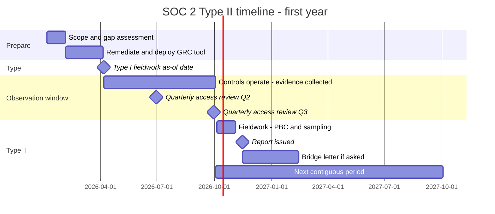
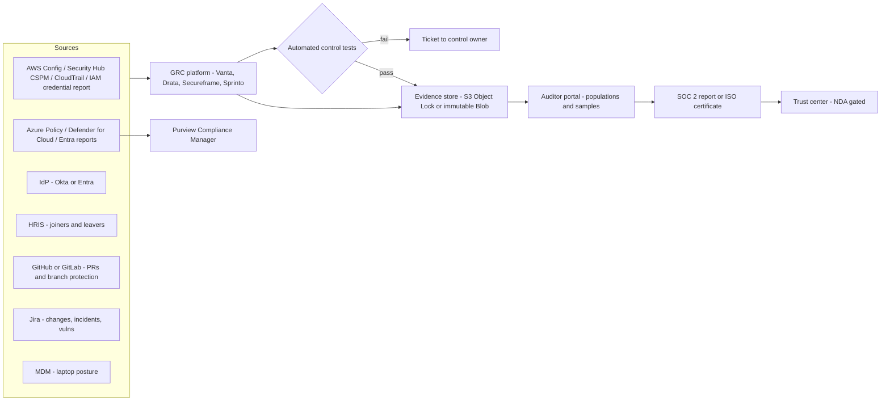
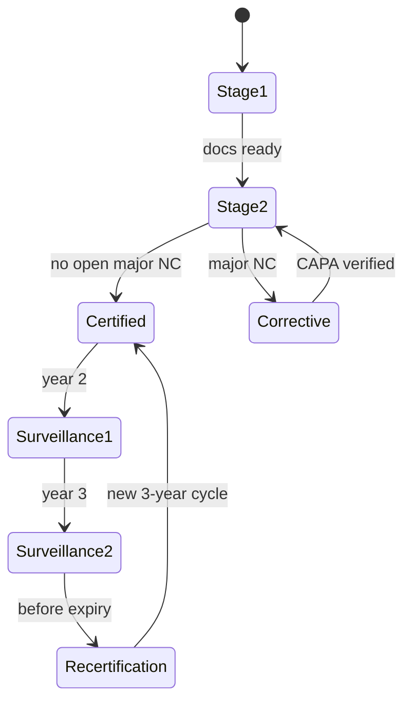

# P3 SOC 2 / ISO 27001 compliance operations
> Last verified: 2026-10 · Audience: senior/staff DevOps, SRE, AI eng, NetEng, DevSecOps, architects

> Scope: **running** a compliance program as an engineer. For what SOC 2, ISO 27001, HIPAA and PCI *are*, see [L3 Residency & compliance](../L-data-privacy-ai-security/L3-residency-compliance.md#l37-soc-2).

## TL;DR
- **SOC 2** is an AICPA **attestation** by a licensed **CPA firm**. **ISO 27001** is a **certification** of an ISMS by an accredited certification body. Run both from **one common control framework (CCF)**: write each control once and map it to many frameworks.
- **SOC 2 timeline:** readiness/gap assessment → **Type I** (design at a point in time) → **observation window** (3–12 months; 6–12 is the norm for the first Type II, then annual and back-to-back) → **Type II** (operating effectiveness) → **bridge letters** between report periods.
- Most TSC controls are **engineering controls**: SSO+MFA, quarterly **access reviews**, **PR approvals plus CI gates as change management**, encryption, centralized logging and alerting, **vuln remediation SLAs**, backup **restore tests**, IR tabletops, joiner/mover/leaver within SLA.
- **ISO 27001:2022** has **clauses 4–10** (the ISMS itself, all mandatory) and **Annex A 93 controls in 4 themes**. The **Statement of Applicability** justifies each inclusion or exclusion. The cycle is 3 years: Stage 1 + Stage 2, then **surveillance** audits in years 2 and 3, then **recertification**. The 2013 → 2022 transition ended **31 Oct 2025**.
- **Evidence should be continuous and system-generated.** Use a GRC platform (**Vanta, Drata, Secureframe, Sprinto**) that reads cloud, IdP, HRIS, Git and ticketing APIs, plus cloud-native sources (AWS Config / Security Hub CSPM, Defender for Cloud regulatory compliance → Purview Compliance Manager). **AWS Audit Manager is in maintenance mode** (closed to new setups since 30 Apr 2026).
- Auditors **sample from populations** (all changes, all terminations, all new hires). Most findings are **process gaps that leave no evidence**: a missed review, a late offboarding, a self-approved PR, a skipped restore test. The fix is automation plus an owner and a calendar.
- **Exceptions are not fatal.** A Type II with a few exceptions plus management responses is normal. A **qualified opinion** is what hurts sales.
- **Trust centers** (public plus NDA-gated reports) and questionnaire automation (SIG, CAIQ, AI-assisted answers from a vetted answer library) turn the program into **sales enablement**.

## P3.1 Compliance program operating model
- **How it works:**
  - **Scope first:** which products, environments (prod only? CI/CD?), data stores, people and locations. A smaller scope means cheaper audits, but customers read the **system description** and notice when scope is narrow.
  - **Common control framework (CCF):** about 100–200 internal controls, each with an **owner**, a **frequency** (continuous/daily/quarterly/annual), an **evidence source** and **mappings** (SOC 2 CC, ISO Annex A, HIPAA §164.3xx, NIST CSF 2.0 subcategories, PCI req).
  - **RACI:** GRC/security owns the program. Engineering, IT, HR, Legal and Finance own individual controls. Executive sponsor plus a **management review** cadence.
  - **Calendar of recurring controls:** quarterly access reviews, annual risk assessment, annual policy review, annual pentest, annual DR/restore test, annual IR tabletop, annual security training, vendor reviews.
  - **Inherited / carved-out controls:** physical and environmental controls come from the cloud provider's SOC 2/ISO reports (via AWS Artifact or the Service Trust Portal). Your report then lists the CSP as a **subservice organization** (carve-out) plus the **CUECs/CSOCs** you rely on.
- **Trade-offs / when to use:**
  - Start with SOC 2 for US B2B and ISO 27001 for EU or global enterprise buyers. Add HIPAA, PCI or ISO 42001 only when contracts require them.
  - Choosing controls stricter than you can operate creates exceptions. **Write controls you actually do**, then raise the bar.
- **Interview angles:**
  - "We need SOC 2 in 6 months, plan it" → month 0–1 scope + gap assessment + GRC tool + policies; month 1–3 remediate (SSO/MFA, branch protection, logging, MDM, background checks, training); month 3 Type I; window starts; Type II report about 3–6 months later. Name the risk: a too-short window gives buyers less assurance, and some will want 6+ months.
  - Pitfall: treating compliance as a project rather than a **continuous operating process**. Year-2 Type II failures usually come from controls decaying after the first audit.

## P3.2 SOC 2 audit lifecycle
### Phases
| Phase | What happens | Engineer involvement |
|---|---|---|
| **Readiness / gap assessment** | Map current state to TSC, find gaps. Done by a consultant, the GRC tool or the auditor's advisory arm (the auditor can't consult and then audit the same controls, for independence) | Fix gaps: SSO, MFA, branch protection, logging, encryption, backups |
| **Type I** | Opinion on **fairness of the system description** and **suitability of control design** *as of a date* | Walkthroughs, screenshots/config exports showing each control exists |
| **Observation window** | Controls must operate **every day of the period**. Minimum about 3 months, typically 6–12 | Keep producing evidence: reviews, tickets, PR approvals, alerts handled |
| **Type II fieldwork** | Auditor pulls **populations**, selects **samples**, inspects and re-performs, writes up **exceptions** | Answer PBC (provided-by-client) requests, walkthrough calls, re-pull data |
| **Report issued** | Sections: management assertion, **auditor's opinion**, **system description**, **controls + tests + results**, optional other info (management responses) | Review the draft for factual errors and write responses to exceptions |
| **Bridge (gap) letter** | **Management**-signed (not the auditor) statement covering the gap between period end and now, typically up to 3 months | None, but must be true: material changes need to be disclosed |

- **How it works:**
  - **Opinion types:** **unqualified** (clean), **qualified** (one or more criteria not met because of design or operating failures), **adverse**, **disclaimer**. Exceptions noted in Section IV don't automatically qualify the opinion. The auditor judges whether the criterion is still met.
  - **Report use:** SOC 2 is **restricted use** (customers and prospects under NDA). **SOC 3** is the general-use public summary with no test details.
  - **Auditors:** must be a **licensed CPA firm** (AICPA attestation standards, **SSAE 18 / AT-C 105 & 205**). The market ranges from Big 4 down to boutique firms. GRC vendors partner with firms. The AICPA has publicly warned about "fast and easy" low-quality SOC engagements, and enterprise buyers increasingly scrutinize who signed the report.
  - **Description criteria:** the **DC 200** (2018, with 2022 implementation guidance) system description covers infrastructure, software, people, procedures, data, boundaries, principal service commitments and system requirements, subservice orgs, CUECs and incidents.
  - **Cadence:** annual Type II with **contiguous periods** (e.g. Jan 1–Dec 31). Gaps between periods need bridge letters and invite questions.
- **Trade-offs / when to use:**
  - Type I is fast (weeks) and unblocks early deals but proves little. Skip it if you can afford to wait for a Type II.
  - Short first window (3 months) vs longer (6–12 months): short is faster to market, long carries more credibility and costs about the same.
  - Adding TSC categories (Availability, Confidentiality, Processing Integrity, Privacy) means more controls and evidence. Add **Availability** if you sell SLAs and **Confidentiality** if you handle customer confidential data. **Privacy** is rare and heavy.
- **Interview angles:**
  - "Type I vs Type II?" → design at a point in time vs design **plus operating effectiveness over a period**, with sampled testing.
  - "Report period ended 5 months ago, customer is asking" → issue a **bridge letter** now. If the gap is long, schedule the next period so it is contiguous.
  - "What's in the report a customer should read?" → scope/boundaries, period, opinion, **exceptions + management responses**, subservice orgs (carve-out), **CUECs** they must operate.

## P3.3 Trust Services Criteria → engineering controls
- **How it works:**
  - **TSC 2017 (revised points of focus, 2022).** Security = **Common Criteria CC1–CC9**. CC1–CC5 mirror the **COSO 2013** 17 principles. Additional criteria: **A1** (availability), **C1** (confidentiality), **PI1** (processing integrity), **P1–P8** (privacy).
  - Points of focus are **guidance, not checklist requirements**. You design your own controls to meet each criterion.

| Criterion | Theme | Engineering control (what auditors test) | Typical evidence |
|---|---|---|---|
| CC1 | Control environment | Background checks, code of conduct, org chart, security roles | HRIS export, signed acknowledgments |
| CC2 | Communication & information | Security policies published, customer commitments, incident reporting channel | Policy portal, status page, ToS/DPA |
| CC3 | Risk assessment | Annual risk assessment, risk register, fraud risk | Risk register with dated review |
| CC4 | Monitoring activities | Internal control monitoring, pentest, GRC dashboards | Pentest report + remediation tickets |
| CC5 | Control activities | Policies → procedures, segregation of duties | Policy versions, approvals |
| **CC6** | Logical & physical access | **SSO + MFA everywhere**, least privilege, **quarterly access reviews**, onboarding/offboarding within SLA (e.g. revoke ≤24 h), encryption at rest/in transit, key mgmt, MDM/disk encryption on laptops, network segmentation | IdP MFA report, access review sign-offs, termination tickets vs IdP deprovision timestamps, KMS/TLS config |
| **CC7** | System operations | **Centralized logging + alerting**, IDS/GuardDuty/Defender, **vuln scanning with SLAs** (e.g. critical ≤7–15 d, high ≤30 d), incident response plan + **annual tabletop**, post-incident reviews | SIEM alert samples, scanner exports with fix dates, IR tickets, tabletop notes |
| **CC8** | Change management | **PR review by someone other than the author**, branch protection, CI tests pass, segregated prod deploy, emergency change process with retro approval, IaC | Population of prod deploys → sampled PRs showing approver ≠ author + green checks |
| **CC9** | Risk mitigation | **Vendor risk mgmt** (collect vendor SOC 2s annually, review CUECs), BCP, cyber insurance | Vendor inventory, review records |
| **A1** | Availability | Capacity monitoring, **backups + restore tests**, DR plan + **annual DR test**, RTO/RPO | Backup job logs, restore test record, DR exercise report |
| **C1** | Confidentiality | Data classification, retention + **secure deletion** on contract end | Deletion tickets, retention config |
| PI1 | Processing integrity | Input validation, job reconciliation, error queues | Reconciliation reports |
| P1–P8 | Privacy | Notice, consent, DSAR, retention, disclosure | DSAR log |

- **Trade-offs / when to use:**
  - Automated, preventive controls (e.g. branch protection that *cannot* be bypassed, SCIM deprovisioning) are cheaper to audit than detective/manual ones. The auditor tests the config once plus a few samples, instead of 25–40 samples.
  - Admin bypass on branch protection is itself a finding risk. Either remove it or log and review every bypass.
- **Interview angles:**
  - "How do you satisfy CC8 with trunk-based development and 50 deploys/day?" → required PR review (approver ≠ author), required status checks, no direct pushes, deploys only via pipeline (prod creds held by CI via OIDC, not humans), auto-generated change population from the CD system, emergency path with post-hoc review. See [N1 GitHub Actions](../N-cicd-platform-engineering/N1-github-actions.md) and [N5 IaC pipelines](../N-cicd-platform-engineering/N5-iac-pipelines-policy-as-code.md).
  - "Solo on-call engineer needs to hotfix at 3 a.m." → documented **emergency change** procedure: break-glass role, logged, reviewed within 1 business day.
  - Pitfall: vuln SLAs written in policy but not measured. The auditor samples criticals and checks fix date − detect date.

## P3.4 ISO/IEC 27001:2022 ISMS operations
### Clauses 4–10 (mandatory ISMS requirements)
| Clause | Requirement | Key artifacts |
|---|---|---|
| 4 Context | Internal/external issues, interested parties, **ISMS scope** | Scope statement, context register |
| 5 Leadership | Top management commitment, **information security policy**, roles | Signed policy, RACI |
| 6 Planning | **Risk assessment + risk treatment** process, **SoA**, objectives (6.3 planning of changes added in 2022) | Risk methodology, register, treatment plan, SoA |
| 7 Support | Resources, competence, awareness, communication, documented information | Training records, doc control |
| 8 Operation | Run risk assessments at planned intervals, implement treatment plan | Dated assessments |
| 9 Performance evaluation | Monitoring/measurement, **internal audit**, **management review** | Metrics, internal audit report, MR minutes |
| 10 Improvement | **Nonconformity + corrective action**, continual improvement | CAPA log |

### Annex A (reference controls)
- **93 controls in 4 themes** (2013 had 114 controls in 14 domains): **5 Organizational (37)**, **6 People (8)**, **7 Physical (14)**, **8 Technological (34)**.
- **11 new controls** in 2022: 5.7 threat intelligence, 5.23 information security for **cloud services**, 5.30 ICT readiness for business continuity, 7.4 physical security monitoring, 8.9 **configuration management**, 8.10 information deletion, 8.11 **data masking**, 8.12 **DLP**, 8.16 **monitoring activities**, 8.23 web filtering, 8.28 **secure coding**.
- Each control has attributes (control type, CIA properties, cybersecurity concepts aligned to NIST CSF functions, operational capabilities, security domains), which help with mapping.
- **Amendment 1:2024** added climate-change considerations to clauses 4.1/4.2 (unverified wording; iso.org blocked fetch).

### How it works
- **Risk assessment & treatment:** identify risks (asset- or scenario-based), score likelihood × impact, then **treat** (modify/mitigate, retain/accept, avoid, share/transfer). Risk owners formally **accept residual risk**. Annex A is used as a cross-check that no necessary control was omitted.
- **Statement of Applicability (SoA):** lists all 93 controls, applicable yes/no, **justification** for inclusion/exclusion, and implementation status. Versioned and referenced on the certificate.
- **Certification cycle (3 years):** **Stage 1** (documentation and readiness review) → **Stage 2** (implementation effectiveness, sampling) → certificate → **surveillance audits** in years 2 and 3 (partial scope) → **recertification** audit before expiry.
- **Nonconformities:** a **major** NC (control or clause missing or systemically failing) blocks certification until corrected. A **minor** NC needs a corrective action plan, verified at the next audit. **Opportunities for improvement (OFIs)** are not binding.
- **Internal audit** must cover the whole ISMS over the cycle and be performed by someone **independent of the area audited** (often outsourced at small companies). **Management review** inputs are defined in 9.3 (status of actions, changes, performance, feedback, risk results, opportunities).
- **Transition:** 27001:2013 certificates **expired/withdrawn after 31 Oct 2025** (IAF MD 26, 3-year transition from Oct 2022). As of 2026 every valid certificate is 2022.
- **Trade-offs / when to use:**
  - ISO certifies the **management system** (risk-driven, continual improvement). SOC 2 reports on specific controls with detailed test results. Buyers that want *detail* prefer SOC 2. Global/EU procurement often requires the ISO certificate.
  - ISO has no "observation period". Evidence is sampled from whatever records exist, but the auditor still expects records showing the ISMS has been running (typically ≥ one internal audit + management review before Stage 2).
- **Interview angles:**
  - "What's the most important ISO artifact?" → the **risk register + treatment plan + SoA** chain: every applicable control traces to a risk or requirement.
  - "Can we exclude Annex A controls?" → yes, with justification in the SoA (e.g. 7.x physical controls fully inherited from the CSP and remote-only office). But you **can't exclude clauses 4–10**.
  - Related: **ISO 27701** (privacy) and **ISO 42001** (AI management systems) reuse the same management-system structure. See [L3.8](../L-data-privacy-ai-security/L3-residency-compliance.md#l38-isoiec-27001-27701-42001).

## P3.5 Control mapping across frameworks (SOC 2 ↔ ISO ↔ HIPAA ↔ NIST CSF 2.0)
- **How it works:**
  - **NIST CSF 2.0** (published **26 Feb 2024**): **6 functions**: **Govern (GV, new)**, Identify (ID), Protect (PR), Detect (DE), Respond (RS), Recover (RC). **22 categories, 106 subcategories**. **Organizational Profiles** (current vs target), **Tiers 1–4** (Partial, Risk Informed, Repeatable, Adaptive), **Implementation Examples**, **Informative References** (online mappings via NIST's CPRT/OLIR). Scope widened from critical infrastructure to all organizations. Supply chain risk management now sits in **GV.SC**.
  - Map one CCF control to many framework requirements:

| CCF control | SOC 2 | ISO 27001:2022 Annex A | HIPAA Security Rule | NIST CSF 2.0 |
|---|---|---|---|---|
| SSO + MFA for all workforce | CC6.1 | 5.17, 8.5 | §164.312(d) person/entity authentication | PR.AA |
| Quarterly access review | CC6.2, CC6.3 | 5.18 | §164.308(a)(4) | PR.AA |
| Offboarding ≤24 h | CC6.2 | 5.11, 6.5 | §164.308(a)(3)(ii)(C) termination | PR.AA |
| Encryption at rest/in transit | CC6.1, CC6.7 | 8.24 | §164.312(a)(2)(iv), (e)(1) | PR.DS |
| Centralized logging + review | CC7.2 | 8.15, 8.16 | §164.312(b) audit controls | DE.CM |
| Change mgmt via PR review | CC8.1 | 8.32, 8.25 | (§164.308(a)(1) risk mgmt) | PR.PS |
| Vuln scan + remediation SLA | CC7.1 | 8.8 | §164.308(a)(1)(ii)(B) | ID.RA |
| Backups + restore test | A1.2, A1.3 | 8.13 | §164.308(a)(7) contingency plan | RC.RP, PR.DS |
| Incident response + tabletop | CC7.3–CC7.5 | 5.24–5.27 | §164.308(a)(6) | RS.MA, RS.AN |
| Vendor risk review | CC9.2 | 5.19–5.22 | §164.308(b) BAAs | GV.SC |
| Security awareness training | CC1.4, CC2.2 | 6.3 | §164.308(a)(5) | PR.AT |
| Risk assessment | CC3.1–CC3.4 | Clause 6.1.2, 8.2 | §164.308(a)(1)(ii)(A) | ID.RA, GV.RM |

  - Mappings are **many-to-many and approximate** (treat the table cells as indicative). A mapped control satisfies a requirement only if its *scope and frequency* meet the stricter framework. For example, PCI DSS v4 has prescriptive frequencies, such as access reviews of user accounts at least every 6 months (req. 7.2.4).
- **Trade-offs / when to use:** you can use a vendor CCF (GRC tool library, SCF (Secure Controls Framework), or CSA CCM for cloud) or build your own. Vendor libraries are faster but may over-scope.
- **Interview angles:**
  - "Adding ISO 27001 on top of SOC 2: how much new work?" → typically 60–80% overlap (unverified rule of thumb). The new work is mostly the **ISMS layer**: formal risk methodology, SoA, internal audit, management review, clause-level documentation.
  - "Where does NIST CSF fit?" → it is **not certifiable**. Use it as a board-level maturity/outcome language (profiles, tiers) on top of the CCF.

## P3.6 Evidence collection automation (GRC platforms)
- **How it works:**
  - **Vanta / Drata / Secureframe / Sprinto** connect read-only to: **cloud** (AWS cross-account IAM role with `SecurityAudit`, e.g. Drata's `DrataAutopilotRole` with an external ID; Azure via app registration with Reader; GCP), **IdP** (Okta, Entra, Google Workspace), **HRIS** (Rippling, BambooHR, Workday: the source of truth for joiners and leavers), **Git** (GitHub/GitLab branch protection, PR reviews), **ticketing** (Jira, Linear), **MDM** (Jamf, Intune, Kandji), **vuln scanners**, **background check** and **training** providers.
  - **Automated tests** run continuously (typically hourly to daily; vendor-specific, unverified exact cadence). They check, for example, "every human in the IdP is in the HRIS and active", "MFA enforced", "S3 buckets encrypted and not public", "terminated employee deprovisioned in all apps within N hours".
  - Controls ↔ tests ↔ evidence ↔ framework requirements. Failing tests open tickets for owners.
  - **Auditor portal:** the CPA firm logs in and sees the evidence. Many vendors partner with audit firms, which compresses fieldwork.
  - **Agents** on laptops (disk encryption, screen lock, OS updates, AV/EDR present) for endpoint evidence.
  - **Policy templates**, employee policy acceptance, training, vendor management, risk register, **trust center**, **questionnaire automation** (often LLM-assisted).
- **Trade-offs / when to use:**
  - Great for startups to mid-market. Large enterprises use **ServiceNow IRM / Archer / AuditBoard / OneTrust** with custom integrations.
  - **Automation ≠ compliance.** Tests check config states. Process controls (reviews, tabletops, vendor assessments) still need humans. Bad integrations produce false confidence. Watch for unscoped accounts (shadow AWS accounts and dev tenants are not monitored).
  - Vendor lock-in of control text and evidence. Export evidence periodically to your own immutable store.
  - Read-only integration permissions are still a **supply-chain risk** (the GRC vendor holds read keys to your whole estate). Scope the roles, use external IDs, and review the vendor's own SOC 2.
- **Interview angles:**
  - "Design an evidence pipeline without buying a GRC tool" → scheduled jobs (CI cron or EventBridge/Logic Apps) pull from AWS Config / Security Hub, Defender/Azure Policy, IdP and Git APIs → normalize to JSON/CSV with timestamp + source + hash → write to **S3 Object Lock / immutable Blob** with retention ≥ audit period + 1 year → index per control ID → dashboards plus alerts on control failure.
  - Also see [L3.13 Audit evidence automation](../L-data-privacy-ai-security/L3-residency-compliance.md#l313-audit-evidence-automation).

## P3.7 Cloud-native evidence sources
- **How it works:**
  - **AWS Artifact:** provider SOC/ISO/PCI reports plus agreements (BAA, GDPR DPA). Inherited-control evidence.
  - **AWS Config + conformance packs:** 100+ sample templates (PCI DSS v4.0, HIPAA Security, NIST 800-53 r5, CIS, FedRAMP). Org-wide deploy, remediation, resource **configuration timelines** (`get-resource-config-history`), advanced query export. **No SOC 2, GDPR or ISO 27001 pack.** Conformance packs contain **only technical controls**.
  - **Security Hub CSPM standards:** AWS FSBP, CIS, NIST 800-53 r5, NIST 800-171, PCI DSS. Severity-ranked, central config across accounts/regions/OUs.
  - **AWS Audit Manager:** **maintenance mode**. From **30 Apr 2026** it can't be set up in new accounts, regions or orgs. Existing users can continue with no new frameworks or versions. Evidence is retained 2 years. Enable **Evidence Finder** (CloudTrail Lake export) *before* disabling. AWS points to Config conformance packs plus partners (Vanta, Drata).
  - **Control Tower** controls keyed by framework, deployable per OU (controls-only experience, no landing zone prerequisite).
  - **Azure Policy regulatory compliance initiatives** surface in **Defender for Cloud → Regulatory compliance**. MCSB is the default. **Non-default standards need ≥1 paid Defender plan**. Covers **Azure, AWS and GCP** connectors. Assessments run **about every 12 h**. Manual attestation + evidence upload, PDF/CSV reports, "Audit reports" download of Microsoft's certs, **continuous export** (Event Hubs / Log Analytics, stream or weekly snapshot), Logic Apps workflow on state change. Needs **Reader** (Security Reader does *not* see policy compliance data).
  - **Purview Compliance Manager:** **360+ regulation templates** (availability depends on license), assessments, **Microsoft-managed vs your vs shared controls**, improvement actions with evidence storage and assignments, risk-weighted **compliance score**. Defender for Cloud standard data surfaces automatically.
  - **Identity evidence:** IAM **credential report** (CSV, regenerated at most every **4 h**, `mfa_active`, `password_last_used`, `access_key_N_last_rotated/last_used_date`; only the first 2 access keys, no Bedrock/service-specific credentials). Entra **userRegistrationDetails** (Graph `GET /reports/authenticationMethods/userRegistrationDetails`, `AuditLog.Read.All`, `isMfaRegistered`/`isMfaCapable`/`isAdmin`, up to **36 h latency**, excludes disabled users) and sign-in logs (need P1/P2 for API access and longer retention).
- **Trade-offs / when to use:** native tools are cheap and authoritative for infra, but blind to HR, vendor, training and policy controls. Pair them with GRC tooling.
- **Interview angles:** "AWS dropped Audit Manager, now what?" → Config conformance packs (+ custom pack for SOC 2-relevant rules), Security Hub CSPM for scoring, CloudTrail Lake for activity evidence, a GRC partner for full framework/control mapping, and evidence exports into Object Lock.

## P3.8 How engineers get pulled in: PBC requests, populations, samples, exceptions
- **How it works:**
  - **PBC list (provided by client):** the auditor's request list. Engineers own items like "list of all production changes in the period", "all users with prod access", "termination list vs access removal", "backup config + restore test", "vuln scan results + tickets".
  - **Population first, then sample.** The auditor tests **completeness & accuracy** of the population (it must be **system-generated** IPE (information produced by the entity) with the query shown, not a hand-edited spreadsheet), then samples from it.
  - **Typical sample sizes** (common audit guidance, varies by firm, unverified): annual control → 1, quarterly → 2, monthly → 2–5, weekly → 5–15, daily → 20–40, many-times-per-day or transactional → 25–60.
  - **Walkthroughs:** screen-share showing a control operating (e.g. live branch protection settings, IdP MFA policy, alert routing).
  - **Exceptions:** a sample that fails (a PR merged without approval, an access review missing a system, a user deprovisioned on day 9 vs a 24 h SLA). The auditor asks for root cause, then may **expand the sample**. The report lists the exception and a **management response** (cause, remediation, compensating controls).
- **Trade-offs / when to use:** pre-audit **self-testing** (run the same sample logic yourself monthly) costs some engineering time but prevents surprise exceptions.
- **Interview angles:**
  - "Auditor found 2 PRs merged without review in a sample of 25" → don't argue. Investigate (admin bypass? bot account?), quantify across the full population, remediate (remove bypass, require CODEOWNERS), show a compensating control (post-deploy review), write the management response.
  - Pitfall: giving the auditor **screenshots without timestamps or source context**. Include URL, timestamp and account ID, or better, export the raw API output.
  - Pitfall: **bot/service accounts** in user populations confuse access testing. Tag them with owners and document them as non-human identities ([L7](../L-data-privacy-ai-security/L7-zero-trust-workload-identity.md)).

## P3.9 Policies as living documents
- **How it works:**
  - The typical policy set: Information Security (umbrella), Acceptable Use, Access Control, Change Management, SDLC/Secure Coding, Encryption & Key Management, Logging & Monitoring, Vulnerability Management, Incident Response, BC/DR, Vendor Management, Data Classification & Retention, Risk Management, HR Security, Physical Security, Privacy.
  - **Annual review + approval** with version history (who, when). Employee **acknowledgment** at hire and annually.
  - **Policy ↔ reality:** the auditor tests what the policy *says*. "Critical vulns fixed in 7 days" means every sampled critical must meet 7 days.
  - Living-docs pattern: policies in Git (Markdown), PR-based changes with owner approval, rendered to the GRC tool or intranet, with the version history serving as review evidence.
- **Trade-offs / when to use:** template policies are fast but often promise more than you do (e.g. "quarterly DR tests"). Edit them to match reality or you create guaranteed exceptions.
- **Interview angles:** "Policy says MFA everywhere but legacy app X doesn't support it" → document an **exception with risk acceptance**, compensating controls (VPN + IP allowlist + SSO proxy), an expiry date and an owner.

## P3.10 Security questionnaires & trust centers
- **How it works:**
  - Questionnaires: **SIG / SIG Lite** (Shared Assessments), **CAIQ** (CSA, aligned to CCM v4), **HECVAT** (higher ed), plus custom spreadsheets and vendor-portal questionnaires (OneTrust, Whistic, etc.).
  - Answer library: vetted, owner-approved answers with review dates. LLM-assisted auto-fill drafts answers from the library, policies and the SOC 2 report, and a human reviews before sending.
  - **Trust center** (Vanta/Drata/SafeBase/Conveyor/Whistic): a public overview (frameworks, subprocessors, controls summary) with NDA-gated download of the SOC 2 report, pentest summary and ISO certificate, plus access logs.
- **Trade-offs / when to use:** trust centers deflect many questionnaires, but large enterprises still require their own forms. Answers are **contractual representations**, so over-claiming creates legal risk.
- **Interview angles:**
  - "How do you scale questionnaire response?" → trust center + answer library with owners + AI drafting + SME review + a feedback loop where new questions become library entries.
  - Pitfall: inconsistent answers across deals (sales edits). Lock the library and route changes through GRC.
  - The flip side, **your** vendor risk: request vendors' SOC 2 reports, read the exceptions and CUECs, and track renewals and bridge letters ([P1 Wiz](./P1-wiz-cnapp.md) and other security vendors included).

## P3.11 Common audit findings and how to avoid them
| Finding | Root cause | Prevention |
|---|---|---|
| **Late or missing deprovisioning** | HR ticket not linked to IT; non-SSO apps | HRIS → IdP **SCIM** automation, SSO-only apps, weekly HRIS ↔ IdP diff |
| **Access review incomplete** | Missed systems (DB, cloud console, CI), rubber-stamping, no evidence of changes made | Review generated from the system inventory, reviewer ≠ the user's own access, record revocations with tickets |
| **Unapproved changes** | Admin bypass, self-approval, direct pushes, console changes in prod | Branch protection with no bypass, CODEOWNERS, SCP/Policy deny console writes, drift detection |
| **Vuln SLA misses** | No tracking of detect→fix dates, risk acceptance undocumented | Scanner → ticket with due date, SLA dashboard, formal exception workflow |
| **No restore / DR test** | Backups configured but never restored | Scheduled restore test with recorded RTO/RPO results ([J7 chaos](../J-sre/J7-chaos-engineering.md)) |
| **IR plan not tested** | No incidents → nothing to show | Annual tabletop with minutes + action items ([J4](../J-sre/J4-incident-response-postmortems.md)) |
| **Training / policy acknowledgment gaps** | New hires missed, contractors excluded | GRC-enforced onboarding checklist, auto reminders |
| **Background checks missing** | Contractors, international hires | Policy defines scope, track in HRIS |
| **Vendor reviews not done** | No inventory | Inventory from SSO + finance spend, annual review of critical vendors |
| **Logging gaps** | Logs exist but no alert review evidence | Alert → ticket routing, on-call ack records ([J2](../J-sre/J2-monitoring-and-alerting.md)) |
| **Population can't be proven complete** | Hand-built spreadsheets | System-generated exports with queries, timestamps and hashes |

- **Interview angles:** "Top 3 things you'd automate before an audit?" → joiner/mover/leaver via SCIM, change-management enforcement in Git/CI, and a continuous evidence pipeline (cloud posture + IdP MFA + access review exports).

## Diagrams






## Cloud mapping: AWS vs Azure
| Capability | AWS | Azure | Role it plays | Key differences | Alternatives |
|---|---|---|---|---|---|
| Provider attestations (inherited controls) | **AWS Artifact** | **Service Trust Portal**, Defender "Audit reports" | CSP SOC/ISO/PCI reports for carve-out subservice org | Artifact also holds BAA/DPA acceptance per account/org | Vendor trust centers |
| Detective config checks mapped to frameworks | **Config rules + conformance packs** | **Azure Policy** regulatory compliance initiatives | Technical control evidence + history | Config packs lack SOC 2/ISO/GDPR. Azure has built-in initiatives for ISO 27001, SOC 2, NIST, PCI, HIPAA HITRUST. Azure Policy can also **deny** | Cloud Custodian, OPA/Conftest, Prowler, Steampipe |
| Posture scoring vs standards | **Security Hub CSPM** standards | **Defender for Cloud regulatory compliance** | Dashboard + severity + per-resource drill-down | Defender is multicloud (AWS/GCP connectors), with a 12 h assessment cycle and a paid plan needed for non-default standards. Security Hub is AWS-only, with central config | Wiz, Prisma Cloud, Orca ([P1](./P1-wiz-cnapp.md)) |
| Compliance program / control mgmt | **Audit Manager** (maintenance mode since 30 Apr 2026) → Config + partners | **Purview Compliance Manager** (360+ templates, compliance score, improvement actions) | Map controls, store evidence, assign owners | Microsoft keeps a first-party GRC-lite product. AWS defers to partners | Vanta, Drata, Secureframe, Sprinto, ServiceNow IRM, AuditBoard |
| Activity / audit trail | CloudTrail org trail, CloudTrail Lake | Activity Log, Entra audit + sign-in logs → Log Analytics | Who-did-what evidence for CC7/CC8 | CloudTrail has 90-day free event history. Entra logs need diagnostic settings and P1/P2 for longer retention | Splunk, Sentinel, Datadog ([O4](../O-observability-tooling/O4-datadog.md)) |
| Identity/MFA evidence | IAM credential report, IAM Identity Center, Access Analyzer unused access | Entra userRegistrationDetails, sign-in logs, Access Reviews (ID Governance) | CC6 access + MFA evidence | Entra has a native **Access Reviews** feature (P2/ID Governance). AWS relies on the IdP or Identity Center + custom reviews | Okta, ConductorOne, Veza ([P4](./P4-identity-providers.md)) |
| Immutable evidence store | S3 Object Lock (compliance mode) | Blob immutability (time-based retention, locked) | Tamper-evident evidence retention | Both WORM. Compliance mode / locked policy can't be shortened even by root/owner | Vault-backed archives |

- **AWS Artifact vs Service Trust Portal:** both distribute the provider's reports. They prove the **CSP's** controls only, never yours.
- **Config conformance packs vs Azure Policy initiatives:** AWS splits preventive (SCP/RCP), proactive (CloudFormation hooks) and detective (Config). Azure Policy covers audit and deny in one engine assigned at management-group scope.
- **Security Hub CSPM vs Defender for Cloud:** Defender's dashboard feeds Purview Compliance Manager automatically. Security Hub findings go to a GRC tool via EventBridge/API.
- **Audit Manager vs Compliance Manager:** the key 2026 divergence. On AWS, plan on **Config + Security Hub + a partner GRC**. On Azure, Compliance Manager can be the system of record for Microsoft-estate controls, still usually alongside a GRC platform for HR/vendor controls.
- **Gotchas:** Defender regulatory compliance requires **Reader**, not Security Reader. Entra registration report lags by up to 36 h and omits disabled users. IAM credential report covers only 2 access keys and no service-specific credentials. Config charges per rule evaluation, so org-wide packs in every region add up.

## Hands-on (optional)
```bash
#!/usr/bin/env bash
# Pull SOC 2 / ISO evidence into a timestamped, hashed bundle.
set -euo pipefail
TS=$(date -u +%Y%m%dT%H%M%SZ); OUT="evidence/$TS"; mkdir -p "$OUT"
ACCT=$(aws sts get-caller-identity --query Account --output text)

# --- AWS: IAM credential report (CC6.1 MFA, key rotation) ---
aws iam generate-credential-report >/dev/null
until aws iam get-credential-report >/dev/null 2>&1; do sleep 5; done
aws iam get-credential-report --query Content --output text | base64 -d > "$OUT/aws-$ACCT-credential-report.csv"
# Console users without MFA (columns: 4=password_enabled, 8=mfa_active)
awk -F, 'NR>1 && $4=="true" && $8=="false" {print $1}' "$OUT/aws-$ACCT-credential-report.csv" > "$OUT/aws-users-no-mfa.txt"

# --- AWS Config: conformance pack + noncompliant rules (CC7.1 / CC6.x) ---
aws configservice describe-conformance-pack-compliance \
  --conformance-pack-name Operational-Best-Practices-for-NIST-800-53-rev-5 > "$OUT/aws-cpack-nist.json" || true
aws configservice describe-compliance-by-config-rule \
  --compliance-types NON_COMPLIANT > "$OUT/aws-config-noncompliant.json"
# Config history for one resource over the period (auditor timeline request)
aws configservice get-resource-config-history --resource-type AWS::S3::Bucket \
  --resource-id my-prod-bucket --earlier-time 2026-04-01T00:00:00Z > "$OUT/aws-s3-history.json"

# --- Security Hub CSPM: enabled standards + failed controls ---
aws securityhub get-enabled-standards > "$OUT/aws-securityhub-standards.json"
aws securityhub get-findings --filters \
  '{"ComplianceStatus":[{"Value":"FAILED","Comparison":"EQUALS"}],"RecordState":[{"Value":"ACTIVE","Comparison":"EQUALS"}]}' \
  --max-items 1000 > "$OUT/aws-securityhub-failed.json"

# --- Azure: MFA registration (Entra), policy + regulatory compliance ---
az rest --method get \
  --url "https://graph.microsoft.com/v1.0/reports/authenticationMethods/userRegistrationDetails?\$filter=isMfaRegistered eq false" \
  > "$OUT/entra-users-no-mfa.json"
SINCE=$(date -u -d '-7 days' +%Y-%m-%dT%H:%M:%SZ)
az rest --method get \
  --url "https://graph.microsoft.com/v1.0/auditLogs/signIns?\$filter=createdDateTime ge $SINCE&\$top=999" \
  > "$OUT/entra-signins-7d.json"   # requires Entra ID P1/P2 + AuditLog.Read.All
az policy state summarize > "$OUT/azure-policy-summary.json"
az security regulatory-compliance-standards list -o json > "$OUT/defender-reg-standards.json"

# --- GitHub: branch protection proves CC8 change-management design ---
gh api repos/acme/api/branches/main/protection > "$OUT/gh-api-main-protection.json"
# Population of merged PRs in the period (for sampling approver != author)
gh pr list -R acme/api --state merged --search "merged:2026-04-01..2026-09-30" \
  --json number,author,mergedAt,reviews,url --limit 1000 > "$OUT/gh-api-merged-prs.json"

# --- Seal: hashes + upload to Object Lock bucket (WORM evidence) ---
( cd "$OUT" && sha256sum * > SHA256SUMS )
aws s3 cp "$OUT" "s3://acme-audit-evidence/$TS/" --recursive   # bucket has Object Lock (see HCL)
```

```hcl
# Immutable evidence bucket (Object Lock compliance mode, 3-year retention)
resource "aws_s3_bucket" "evidence" {
  bucket              = "acme-audit-evidence"
  object_lock_enabled = true
}
resource "aws_s3_bucket_object_lock_configuration" "evidence" {
  bucket = aws_s3_bucket.evidence.id
  rule {
    default_retention {
      mode  = "COMPLIANCE"
      years = 3
    }
  }
}

# Deploy a conformance pack org-wide (detective technical controls)
resource "aws_config_organization_conformance_pack" "nist" {
  name          = "nist-800-53-r5"
  template_body = file("${path.module}/Operational-Best-Practices-for-NIST-800-53-rev-5.yaml")
}
```

```yaml
# GitHub Actions: weekly evidence pull (OIDC to AWS, no static keys)
name: compliance-evidence
on:
  schedule: [{ cron: "0 6 * * 1" }]
  workflow_dispatch: {}
permissions: { id-token: write, contents: read }
jobs:
  pull:
    runs-on: ubuntu-latest
    steps:
      - uses: actions/checkout@v4
      - uses: aws-actions/configure-aws-credentials@v4
        with:
          role-to-assume: arn:aws:iam::123456789012:role/evidence-reader
          aws-region: us-east-1
      - run: ./scripts/pull-evidence.sh
        env: { GH_TOKEN: "${{ secrets.EVIDENCE_GH_TOKEN }}" }
```

## Cross-links
- [L3 Residency & compliance: SOC 2](../L-data-privacy-ai-security/L3-residency-compliance.md#l37-soc-2), [ISO 27001/27701/42001](../L-data-privacy-ai-security/L3-residency-compliance.md#l38-isoiec-27001-27701-42001), [Audit evidence automation](../L-data-privacy-ai-security/L3-residency-compliance.md#l313-audit-evidence-automation)
- [L2 Encryption & key management](../L-data-privacy-ai-security/L2-encryption-key-management.md), [L6 Secrets & supply chain](../L-data-privacy-ai-security/L6-secrets-supply-chain.md), [L7 Zero trust & workload identity](../L-data-privacy-ai-security/L7-zero-trust-workload-identity.md)
- [P1 Wiz / CNAPP](./P1-wiz-cnapp.md), [P2 CrowdStrike EDR/XDR](./P2-crowdstrike-edr-xdr.md), [P4 Identity providers](./P4-identity-providers.md)
- [N1 GitHub Actions](../N-cicd-platform-engineering/N1-github-actions.md), [N5 IaC pipelines & policy as code](../N-cicd-platform-engineering/N5-iac-pipelines-policy-as-code.md)
- [J4 Incident response & postmortems](../J-sre/J4-incident-response-postmortems.md), [J7 Chaos engineering](../J-sre/J7-chaos-engineering.md)
- [Q2 Healthcare cloud / HIPAA engineering](../Q-industry-domains/Q2-healthcare-cloud-hipaa-engineering.md), [Q3 Payment processing (PCI)](../Q-industry-domains/Q3-payment-processing-integration.md)
- [R2 Ticket handling (Jira)](../R-support-communication/R2-ticket-handling-jira.md)

## Sources
- https://docs.aws.amazon.com/audit-manager/latest/userguide/audit-manager-availability-change.html
- https://docs.aws.amazon.com/IAM/latest/UserGuide/id_credentials_getting-report.html
- https://learn.microsoft.com/en-us/purview/compliance-manager
- https://learn.microsoft.com/en-us/azure/defender-for-cloud/regulatory-compliance-dashboard
- https://learn.microsoft.com/en-us/entra/identity/authentication/howto-authentication-methods-activity
- https://learn.microsoft.com/en-us/graph/api/authenticationmethodsroot-list-userregistrationdetails?view=graph-rest-1.0
- https://www.nist.gov/cyberframework and https://nvlpubs.nist.gov/nistpubs/CSWP/NIST.CSWP.29.pdf (CSF 2.0, 26 Feb 2024)
- https://www.aicpa-cima.com/resources/download/2017-trust-services-criteria-with-revised-points-of-focus-2022
- https://www.aicpa-cima.com/topic/audit-assurance/audit-and-assurance-greater-than-soc-2
- https://help.drata.com (AWS integration: DrataAutopilotRole / SecurityAudit)
