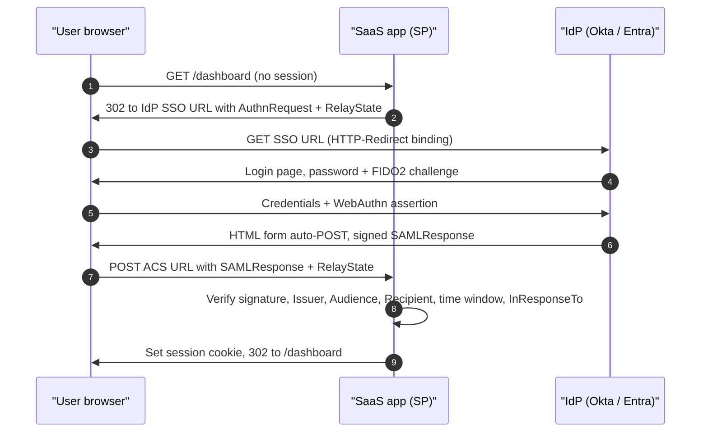
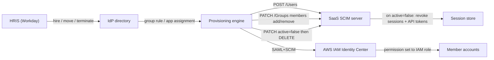

# P4 Identity providers (IdPs): SAML, OIDC, SCIM, Okta, Entra ID, Keycloak, and federating the cloud
> Last verified: 2026-10 · Audience: senior/staff DevOps, SRE, AI eng, NetEng, DevSecOps, architects

## TL;DR
- An **IdP** does four jobs: **authenticate** (credentials + MFA), **SSO** (one session, many apps), **federate** (issue signed SAML assertions or OIDC tokens that apps trust), and **lifecycle** (joiner/mover/leaver via **SCIM**). SSO without SCIM leaves orphaned accounts and standing access after people leave.
- **SAML 2.0**: XML, browser POST, mature in enterprise SaaS. **OIDC**: JSON/JWT on OAuth 2.0, works for SPAs, mobile, and APIs. Default to OIDC for new apps and support SAML because enterprise customers ask for it. Most SAML outages come from **cert rotation, clock skew, or Audience/ACS/NameID mismatch**.
- **Phishing-resistant MFA** (FIDO2/passkeys, Okta FastPass, Windows Hello, CBC) binds the login to the origin. Push MFA, even with number matching, OTP, and SMS can all be phished through an **AiTM** proxy. After login the target is the **session token**, so add token binding, CAE, short sessions, and ITDR.
- **Conditional access** (Entra CA, Okta authentication policies) is if-then policy over user, device, location, app, and risk signals. It runs **after first-factor auth** and is not a DoS control.
- **Entra ID**: app registration (global **application object**) vs enterprise app (**service principal** in each tenant). **PIM** gives JIT roles. **External ID** covers B2B guests in workforce tenants and CIAM in external tenants. **Azure AD B2C is closed to new customers since 2025-05-01.** Mandatory MFA applies to Azure portals (Phase 1) and to CLI, PowerShell, IaC, and ARM writes (Phase 2, from 2025-10-01).
- **AWS**: **IAM Identity Center** handles workforce (an external IdP over SAML plus SCIM, then permission sets, which become IAM roles in each account). **Cognito** user pools handle customers and B2B SaaS. The Azure equivalents are Entra ID (workforce) and Entra External ID (customers).
- **Breakglass**: at least 2 cloud-only accounts with FIDO2 or CBA, excluded from blocking CA policies, alerting on every sign-in, and tested at least every 90 days.
- The **Okta Oct-2023 support breach** (HAR files containing session tokens; 134 customers, 5 hijacked) is the standard example that **session tokens are credentials** and that IdPs are tier-0 assets.

## P4.1 IdP role, core vocabulary, and where it sits
- **How it works:**
  - **IdP / OP** (OpenID Provider) authenticates and issues assertions or tokens. **SP / RP** (Relying Party) consumes them. The **directory** (Universal Directory, Entra ID, AD, LDAP) stores identities. The **source of truth** is often the HRIS (Workday, SuccessFactors), which drives HR-driven provisioning.
  - **Authentication** (who you are) and **authorization** (what you can do) are separate. The IdP mostly does AuthN and passes coarse AuthZ (groups, roles, claims). The app or cloud enforces fine-grained AuthZ.
  - **Lifecycle (JML)**: joiner → create plus birthright access; mover → re-evaluate groups; leaver → disable, revoke sessions, deprovision downstream.
  - **Federation** means trust without a shared password DB. It relies on exchanged **metadata** (entity IDs, endpoints, signing certs or JWKS).
- **Trade-offs / when to use:**
  - **Workforce IdP** (Okta WIC, Entra ID, Google Workspace, Ping) is a different product from **CIAM** (Auth0/Okta CIC, Entra External ID, Cognito, Keycloak, Ping/ForgeRock). CIAM optimizes for self-signup, social login, branding, MAU pricing, and very large user counts.
  - One IdP is simpler. Multiple IdPs (M&A, OT, contractors) need **brokering**: Keycloak, Okta org2org, Entra cross-tenant sync, or Cognito with many IdPs.
- **Interview angles:**
  - "What does SSO buy you?" → central MFA and policy, instant revocation at one point, an audit trail, and fewer passwords. Revocation is only instant if apps use short sessions or token lifetimes, or support back-channel logout or CAE.
  - Pitfall: SSO-only apps with **local fallback passwords** that bypass the IdP. Enforce "SSO-only" and disable password login.
  - OAuth/JWT basics are in [C4.23 OAuth2 token grant](../C-large-scale-architecture/C4-security.md#c423-oauth2-token-grant) and [C4.28 JWT](../C-large-scale-architecture/C4-security.md#c428-json-web-tokens). The SSO concept is in [C4.19](../C-large-scale-architecture/C4-security.md#c419-single-sign-on).

## P4.2 SAML 2.0
### Flows and bindings
- **SP-initiated**: user hits the app → SP sends an `AuthnRequest` (usually **HTTP-Redirect** binding: deflated, base64, signed via query params) → IdP authenticates → IdP returns a `<Response>` with an `<Assertion>` via **HTTP-POST** binding (auto-submitting form) to the SP's **ACS URL** → SP validates and creates a session. `RelayState` carries the deep link.
- **IdP-initiated**: user clicks a tile in the IdP portal → unsolicited Response POSTed to the ACS with no `InResponseTo`. It is convenient but weaker, because it is **open to login CSRF / assertion injection** and the SP can't correlate a request. Many SPs disable it or turn it into an SP-initiated redirect. Cognito, for example, requires IdP-initiated to be explicitly enabled (unverified detail).
- **Artifact binding** (back-channel resolution) exists but is rare in SaaS.
### Assertion anatomy (what to validate)
- `Issuer` = IdP entityID. **Signature** over the Response and/or the Assertion (RSA-SHA256; SHA-1 is legacy and should be rejected).
- `Subject/NameID`: format is emailAddress, persistent, transient, or unspecified. `SubjectConfirmation` method `bearer` with `Recipient` = ACS URL, `NotOnOrAfter`, and `InResponseTo`.
- `Conditions`: `NotBefore` / `NotOnOrAfter` and `AudienceRestriction/Audience` = SP entityID.
- `AuthnStatement` (AuthnInstant, SessionIndex, AuthnContextClassRef) and `AttributeStatement` (email, groups, roles).
- **Encryption** (`EncryptedAssertion`, encrypted with the SP's public key) is optional. It protects PII in the browser, and the SP needs a decryption key.
- **Metadata** XML publishes entityID, SSO/SLO endpoints, bindings, and **signing/encryption certs**. Prefer **metadata URLs** with auto-refresh over static uploads.
### Common breakages (troubleshooting checklist)
| Symptom | Likely cause | Fix |
|---|---|---|
| "Assertion not yet valid / expired" | **Clock skew** between IdP and SP | NTP on both sides; SPs typically allow a few minutes of skew |
| Signature validation failed after a date | **IdP signing cert rotated** and SP has the old cert | Use a metadata URL; pre-publish a secondary cert; rotate with overlap |
| "Invalid audience" | SP entityID mismatch (trailing slash, http vs https, per-env IDs) | Align `Audience` with the SP entityID exactly |
| "Invalid recipient / destination" | ACS URL mismatch (region, custom domain, LB rewrite) | Fix ACS in the IdP app; preserve `Host`/scheme behind proxies |
| User logs in as a "new" user | **NameID changed** (email rename, case change) | Map NameID to an immutable ID (objectId, employeeId); Cognito matches NameID case-sensitively |
| Loop / `InResponseTo` mismatch | Cookie lost (SameSite, multiple app nodes without shared state) | `SameSite=None; Secure` on the request-state cookie; sticky or shared session store |
- **Interview angles:**
  - "How do you debug SAML?" → capture the POST (browser SAML tracer), base64-decode, and check Issuer, Audience, Recipient, time window, NameID, the cert fingerprint versus the SP's configured cert, and the signature location (Response vs Assertion).
  - Attacks: **XML Signature Wrapping (XSW)**, comment injection in NameID, accepting unsigned assertions, and not pinning the IdP cert. Defense: use a well-maintained library, strict schema, validate the signed element is the one you consume, and reject anything unsigned.
  - SAML **SLO** (single logout) is fragile. Most real systems rely on short SP sessions instead.

## P4.3 OIDC for SSO, and the SAML-vs-OIDC decision
- **How it works:**
  - OIDC = OAuth 2.0 + the `openid` scope + an **ID token** (JWT) + **UserInfo** + **Discovery** (`/.well-known/openid-configuration`, which returns issuer, authorization/token/userinfo endpoints, `jwks_uri`, supported scopes, claims, algs, `end_session_endpoint`).
  - Flows: **Authorization Code + PKCE** (RFC 7636, `S256`) for everything interactive, including confidential web apps (OAuth 2.0 Security BCP / OAuth 2.1 direction). **Client credentials** for machine-to-machine (no ID token). **Device code** for CLIs and TVs. Implicit and ROPC are deprecated. ROPC breaks with MFA, and Microsoft deprecated MSAL's username/password APIs.
  - ID token claims: `iss`, `sub` (stable per issuer; the key to bind on is **`iss`+`sub`**, never email), `aud` (= client_id), `exp`, `iat`, `nonce` (replay), `auth_time`, `acr`/`amr` (how the user authenticated, e.g. `mfa`, `hwk`), `azp`. Entra adds `tid` and `oid`.
  - Validation: signature against JWKS (cache it and handle `kid` rollover), `iss` exact match, `aud`, `exp`, `nonce`. For multi-tenant Entra, validate `tid` against the allowed tenants. Don't accept any issuer just because it matches the pattern `https://login.microsoftonline.com/{tid}/v2.0`.
  - Logout: RP-initiated logout, front-channel, and **back-channel logout** (logout token to the RP), which is better than SAML SLO.
- **Trade-offs / when to use:**

| Dimension | SAML 2.0 | OIDC |
|---|---|---|
| Format / transport | XML + XML-DSig, browser POST | JSON/JWT, redirects + back-channel token call |
| Clients | Browser web apps | Web, SPA, native/mobile, CLI (device code), APIs |
| API access | No (needs separate OAuth) | Native (access token alongside ID token) |
| Key rollover | Cert in metadata (manual pain) | JWKS with `kid` (automatic) |
| Enterprise SaaS support | Universal, often "Enterprise tier" | Growing, near universal in new SaaS |
| Security footguns | XSW, canonicalization | `alg=none`/alg confusion, missing aud/nonce checks |
- **Interview angles:**
  - "SAML or OIDC for a new app?" → OIDC (plus PKCE). Accept SAML **inbound** from enterprise customers' IdPs through a broker so the app only speaks OIDC to one issuer.
  - "Why not use the access token to identify the user?" → access tokens are for the resource server. Their audience and format are opaque to the client. ID tokens are for the client.
  - Token storage and BFF patterns: [C4.29 Token storage](../C-large-scale-architecture/C4-security.md#c429-token-storage).

## P4.4 SCIM 2.0 provisioning, deprovisioning, and JIT
- **How it works:**
  - **RFC 7643** (core schema: `User`, `Group`, Enterprise User extension `urn:ietf:params:scim:schemas:extension:enterprise:2.0:User`) and **RFC 7644** (protocol: REST over HTTPS, `application/scim+json`).
  - Endpoints: `/Users`, `/Groups`, `/Bulk`, `/Me`, plus discovery: `/ServiceProviderConfig`, `/ResourceTypes`, `/Schemas`.
  - Ops: `POST` create, `GET` with `filter=userName eq "a@b.com"`, `startIndex`/`count` pagination (1-based), `PUT` replace, **`PATCH`** (`add`/`replace`/`remove` with paths like `members[value eq "id"]`), `DELETE`. ETags/versions are optional.
  - Key attributes: `id` (assigned by the SP), **`externalId`** (assigned by the IdP; map it to an immutable source ID), `userName` (unique), `active`.
  - The **IdP is the SCIM client and pushes** to the app (the SCIM server). The schedule is set by the IdP: Okta pushes near-real-time on events, and Entra provisioning runs incremental cycles roughly every 40 minutes (unverified for the current interval).
  - **Deprovisioning**: most IdPs first send `PATCH active=false` (soft disable), then optionally `DELETE`. The app must **kill sessions and API tokens on `active=false`**, not just block new logins.
- **AWS IAM Identity Center SCIM specifics** (verified):
  - The bearer token is valid for **1 year**. Reminders go out from 90 days before expiry via the console and the Health Dashboard. If it expires, **sync silently stops**, so put rotation in the runbook.
  - Every user needs first name, last name, username, and display name, or the user is not provisioned. **Multi-valued attributes are not supported** and the sync fails. The SAML `NameID` must equal the SCIM `userName` or sign-in fails.
  - Once SCIM is on, users can't be edited in the console. Identity Store APIs still work, which can cause **drift and privilege escalation**. Block them with an SCP on the delegated admin account (SCPs don't apply to the management account).
  - Google Workspace doesn't do SCIM *group* push to Identity Center, so groups are managed via the Identity Store API.
- **JIT provisioning**: the account is created at first SAML/OIDC login from assertion attributes.
  - Pros: no SCIM needed, simple.
  - Cons: **no deprovisioning** (the account lingers until reaped), no pre-assignment before first login, and attributes only refresh at login.
  - Pattern: JIT + short sessions + a periodic "inactive N days → disable" job, or SCIM for anything privileged.
- **Interview angles:**
  - "User left 2 hours ago but still has access to the SaaS app — why?" → SSO session revoked at the IdP, but the app session or refresh token is still alive. SCIM `active=false` hasn't arrived yet (cycle interval), or the app ignores it. Fix with SCIM event push, short app sessions, back-channel logout or CAE, and revoking refresh tokens.
  - "Design a SCIM server for your SaaS" → per-tenant bearer token or OAuth client, idempotent upserts keyed on `externalId`, case-insensitive `userName` filter, PATCH group membership in batches (large groups), 429 with Retry-After, and an audit log.
  - **Group push vs. group-as-claim**: SCIM groups let the app pre-authorize. Groups in tokens get large (Entra emits an overage claim above 200 groups in JWT, 150 in SAML; unverified current numbers) → filter groups assigned to the app.

## P4.5 MFA and phishing resistance
- **How it works:**
  - Strength ladder, weakest to strongest: SMS/voice < email OTP < TOTP < push < **push with number matching** (Microsoft Authenticator enforced it in 2023; Okta has "number challenge") < **phishing-resistant**: FIDO2/WebAuthn security keys, **passkeys** (device-bound or synced), platform authenticators (Windows Hello for Business, Okta **FastPass**), and certificate-based auth / PIV smartcards.
  - Why FIDO2 resists phishing: the authenticator signs a challenge scoped to the **RP ID (origin)**, so an AiTM proxy on `login-okta.evil.com` gets a signature that is useless for the real origin. **FastPass** signs a per-request challenge with an enrollment key in Okta Verify, validates origin binding, and collects **device posture** (OS version, screen lock, disk encryption, EDR signals).
  - **Synced passkeys** (iCloud/Google) favor usability. **Device-bound** keys (YubiKey, attested) are required for high assurance (AAL3) and for admins.
  - NIST SP 800-63B-4 (final 2025; unverified) treats syncable authenticators as AAL2.
- **Trade-offs / when to use:**
  - Admins, breakglass, and production access → device-bound FIDO2 or CBA. Workforce → passkeys, FastPass, or WHfB. Customers → passkeys with an OTP fallback. SMS only as a last-resort recovery factor.
  - **Account recovery** and **helpdesk resets** are the weak link (Scattered Spider/MGM 2023). Require identity proofing, a manager or video check, and a recovery step-up equal to the enrolled factor.
- **Interview angles:**
  - "Does number matching stop phishing?" → It stops **MFA fatigue/push bombing** (Uber 2022). It does **not** stop AiTM (Evilginx), where the user enters the number shown on the real prompt.
  - "How do you enforce phishing-resistant MFA only for admins?" → Entra **authentication strengths** in CA ("Phishing-resistant MFA") targeted at directory roles. Okta: an authentication policy requiring "phishing resistant" possession for the admin console app.
  - Cross-ref: [L7.2 Human identity](../L-data-privacy-ai-security/L7-zero-trust-workload-identity.md#l72-human-identity-sso-phishing-resistant-mfa-conditional-access-device-posture-jitjea).

## P4.6 Conditional / adaptive access and device trust
- **How it works:**
  - **Entra Conditional Access** (verified): signals are user/group/**agent** (preview), IP or named location or country, device platform or state (filters for devices), application, Entra ID Protection **risk** (sign-in/user risk, **P2**), and Defender for Cloud Apps sessions.
  - Decisions: **block**, or grant with requirements: MFA, **authentication strength**, compliant device (Intune), hybrid-joined device, approved client app, app protection policy, password change, terms of use.
  - CA requires **P1** (or M365 Business Premium). Risk-based policies require **P2**. CA runs **after first-factor authentication**.
  - **Report-only** mode and the **What If** tool exist for safe rollout. When licenses lapse, policies stay enforced but can't be edited.
  - Free tenants get **Security defaults** instead.
  - **Okta**: global session policy plus per-app authentication policies (Okta Identity Engine). Device assurance policies (OS version, disk encryption, biometrics). Okta **Identity Threat Protection** (ITP) re-evaluates risk during the session (Shared Signals/CAEP).
  - **Device trust** options: MDM compliance (Intune, Jamf, Kandji), device certificates, EDR posture (CrowdStrike ZTA score), and managed browser.
- **Trade-offs / when to use:**
  - Location-based allowlists are weak alone (VPN, cloud egress). Device compliance plus phishing-resistant MFA is the modern baseline.
  - Each additional policy adds lockout risk. Version CA as code (Graph API, Terraform `azuread_conditional_access_policy`) and always exclude breakglass from blocking policies.
- **Interview angles:**
  - Baseline policy set: block legacy auth, MFA for all users, phishing-resistant MFA for admins, require a compliant device for sensitive apps, block high-risk sign-ins and force a password change on high user risk, block unsupported countries, and require MFA to register security info from a trusted location.
  - "Why does CA not stop password spraying?" → it evaluates after the first factor. Smart lockout, banned passwords, and passwordless address spraying.
  - **CAE** (Continuous Access Evaluation) lets resource providers (Exchange, SharePoint, Graph) reject tokens on critical events (user disabled, password reset, IP change) before expiry. See [L7.9](../L-data-privacy-ai-security/L7-zero-trust-workload-identity.md#l79-continuous-verification-cae-session-revocation-workload-ca).

## P4.7 Okta: Workforce Identity Cloud and Customer Identity (Auth0)
- **How it works (Workforce Identity Cloud):**
  - **Universal Directory** (profiles, profile sourcing from HR/AD, attribute mapping).
  - **SSO** (OIN catalog of thousands of SAML/OIDC/SWA integrations).
  - **Lifecycle Management** (SCIM provisioning, HR-as-a-source, group rules).
  - **Workflows** (no-code automation for JML, e.g. "on deactivate → transfer Google Drive, revoke Slack tokens").
  - **Adaptive MFA**, **Okta Verify** (push, number challenge, TOTP), and **FastPass** (phishing-resistant, device-bound, Android/iOS/macOS/Windows/Linux).
  - **AD/LDAP agents** (outbound-only, multiple agents for HA) and delegated auth.
  - **Okta Identity Engine (OIE)** replaced Classic Engine. Policies are app-centric.
  - Also: Okta Privileged Access, Identity Governance (access requests/reviews), ITP.
- **Customer Identity (Okta CIC = Auth0)**: Okta acquired Auth0 in 2021.
  - Tenants, Universal Login, Actions (Node.js extensibility hooks), **Organizations** (B2B multi-tenant: per-org connections, invites, branding), enterprise connections (SAML/OIDC/AD/LDAP), and MAU pricing.
  - Okta also sells "Okta Customer Identity Solution" built on the Okta platform (naming has shifted; unverified as of 2026).
- **Trade-offs / when to use:**
  - Okta is vendor-neutral, which helps in heterogeneous estates (Google + AWS + M365). It is an extra cost if you're already an M365 E3/E5 shop, where Entra ID P1/P2 is bundled.
  - It is a concentrated risk: an IdP compromise affects every downstream app (see P4.14).
- **Interview angles:**
  - "Okta in front of Entra/M365?" → Okta federates M365 via WS-Fed/SAML. Mandatory Azure MFA then needs the federated IdP to send the **MFA claim** (`multipleauthn`), or you use Entra **external MFA**.
  - org2org (hub-and-spoke Okta orgs) for M&A or multi-region data residency.

## P4.8 Microsoft Entra ID
- **How it works:**
  - **Tenant** = a dedicated directory instance with GUID tenant ID and default `*.onmicrosoft.com` domain. Configuration is **workforce** or **external**.
  - **App registration → application object**: a global blueprint in the home tenant (client ID, redirect URIs, secrets/certs, **federated credentials**, app roles, required permissions).
  - **Enterprise application → service principal**: the local instance in each tenant where the app is used. Consent creates it, and it holds assignments, CA scope, and SAML SSO settings.
  - A single-tenant app has 1 SP. A multi-tenant app has an SP in every consenting tenant. **Managed identities** are SPs with no app object. Legacy SPs have no app registration.
  - Deleting the app object deletes the home SP. Restoring the app object does **not** restore the SP. **Deactivate** blocks new tokens without deleting.
  - **Workload identity federation**: federated credentials on the app or a user-assigned MI trust external OIDC issuers (GitHub Actions, AKS, AWS, GCP), so no secrets are needed. See [L7.3](../L-data-privacy-ai-security/L7-zero-trust-workload-identity.md#l73-workload-identity-on-cloud-compute-imdsv2-irsa--eks-pod-identity-managed-identities-aks-workload-id).
  - **PIM** (Entra ID Governance / P2 licensing): eligible vs active, time-bound assignments, JIT activation with max duration, **MFA, justification, and approval** on activation, notifications, access reviews, and audit. It covers Entra roles, Azure RBAC roles, and **PIM for Groups**, and it prevents removing the last active Global Admin or Privileged Role Admin.
  - **External ID**:
    - **B2B collaboration** creates guest user objects in the workforce tenant that authenticate at their home IdP. Cross-tenant access settings control inbound/outbound access and **trust the home tenant's MFA and device claims**.
    - **B2B direct connect** (Teams shared channels; no guest object).
    - **External tenants** handle CIAM (self-service signup, social IdPs, email OTP or SMS MFA, MAU billing).
    - **Azure AD B2C: no new purchases since 2025-05-01** (legacy; IEF custom policies).
  - **Mandatory MFA**: Phase 1 (from Oct 2024) covers Azure portal, Entra admin center, and Intune. M365 admin center followed from Feb 2025. **Phase 2 (from 2025-10-01)** covers Azure CLI, PowerShell, mobile app, IaC, REST, and SDK **create/update/delete** against `management.azure.com`, with postponement up to 2026-07-01. Workload identities are exempt; **user accounts used as service accounts are not**, so migrate them to SPs or MIs. Breakglass accounts are included, so use FIDO2 or CBA.
- **Trade-offs / when to use:**
  - App registrations: prefer **certificates or federated credentials over client secrets** (max 2-year secrets; enforce with app management policies).
  - Limit who can register apps and who can **consent** (admin consent workflow), because illicit consent grant is a top phishing vector.
- **Interview angles:**
  - "App registration vs enterprise app?" → class vs instance. Permissions *requested* live on the app object, permissions *granted* and user assignment live on the SP.
  - "Multi-tenant SaaS on Entra" → `signInAudience=AzureADMultipleOrgs`, use the `organizations` endpoint, validate `tid` against your onboarded-tenant list, and onboard through admin consent per customer tenant.
  - "Why did our Terraform pipeline break in Oct 2025?" → Phase 2 mandatory MFA hit a user-account-based automation identity. Fix with OIDC federation from CI to an SP or MI.

## P4.9 Keycloak (self-hosted, open source)
- **How it works:**
  - CNCF incubating project. Quarkus-based distribution since v17. Docs reference **26.x** (26.8.0 at time of check).
  - **Realms** isolate users, credentials, roles, groups, clients, and IdPs. Use **`master` only to administer other realms** and put apps in their own realms.
  - **Clients** = OIDC or SAML apps: confidential (secret, signed JWT, or mTLS), public (PKCE), bearer-only/resource. Service accounts for client credentials.
  - **Identity brokering** to upstream OIDC/SAML/social IdPs with a "first broker login" flow (link or create the account) and mappers. This is the standard way to accept many customer IdPs and emit one OIDC issuer to the app.
  - **User federation** with LDAP/AD in edit modes **READ_ONLY**, **WRITABLE**, or **UNSYNCED**, with optional import, periodic full/changed sync, and Kerberos.
  - **Organizations** feature (GA in 26) for B2B multi-tenancy inside one realm.
- **Self-hosting ops:**
  - PostgreSQL backend. Infinispan distributed caches (embedded, or external for multi-site). Persistent user sessions are the default in recent 26.x, so sessions survive restarts (unverified exact version).
  - Run `kc.sh build` for an optimized image. Health and metrics are on the management port 9000.
  - Operator for Kubernetes.
  - Major upgrades include DB migrations, so stage them and back up the DB.
  - Theme and SPI customizations break on upgrades.
- **Trade-offs / when to use:**
  - No license cost, full control, and it can be air-gapped or sovereign. In exchange you own HA, patching (CVE cadence), DDoS/WAF, key rotation, and 24x7 on-call for a tier-0 service.
  - Red Hat build of Keycloak (RHBK) is available for support.
- **Interview angles:**
  - "Realm per tenant or organizations?" → realm per tenant gives hard isolation but hits scale and operational limits at hundreds to thousands of realms (startup time, admin UI). Organizations or a single realm with brokered IdPs scales better.

## P4.10 Ping Identity / ForgeRock and Google Workspace
- **Ping/ForgeRock**:
  - Thoma Bravo took Ping private (2022) and merged it with ForgeRock (2023).
  - PingOne (SaaS: SSO, MFA, DaVinci orchestration), PingFederate (on-prem/self-managed federation server, strong in banks and large enterprises), and **PingOne Advanced Identity Cloud** (formerly ForgeRock Identity Cloud) for complex CIAM journeys. PingAccess/PingGateway for reverse-proxy authZ.
  - Fits regulated, hybrid, or legacy-heavy environments that need deep customization.
- **Google Workspace / Cloud Identity**:
  - IdP for Google-first orgs: SAML/OIDC SSO to third-party apps, auto-provisioning (SCIM-like connectors) to some SaaS, 2SV with passkeys/security keys, and context-aware access (BeyondCorp).
  - Can also act as an SP federated from Entra or Okta, which is common for M365-plus-Google shops.
  - Limits: no SCIM group push to AWS Identity Center, and a weaker CA engine than Entra or Okta.
- **Interview angles:**
  - When choosing an IdP, weigh existing licensing (M365 → Entra), heterogeneity (→ Okta), sovereignty or self-hosting (→ Keycloak/PingFederate), CIAM complexity (→ Auth0/Ping AIC), and cost per MAU.

## P4.11 AD/LDAP and hybrid identity
- **How it works:**
  - **AD DS**: Kerberos/NTLM, LDAP(S) 389/636, Global Catalog 3268/3269, GPO, forests and domains, trusts. Most enterprises still have it as the authoritative source for joiners.
  - **Entra Connect Sync**: a Windows server (MIM-based engine). One active server plus optional **staging-mode** servers. Default sync every 30 min. Supports PHS, PTA, federation (AD FS), and device and Exchange hybrid writeback.
  - **Entra Cloud Sync** (verified): a lightweight **provisioning agent** (outbound-only via Service Bus, auto-updated, multiple active agents for HA). Configuration and orchestration live in the cloud. Uses SCIM internally, syncs **every 2 minutes**, natively handles **multiple disconnected forests** (M&A), supports cloud-to-AD group provisioning and device sync for hybrid join, and is the direction Microsoft recommends for new deployments.
  - Remaining gaps versus Connect are listed in Microsoft's comparison guide. Check it before migrating, because some advanced writeback and filtering scenarios still require Connect (unverified per-feature).
  - **Auth options**:
    - **PHS** (hash of hash synced). The most resilient, and it enables leaked-credential detection.
    - **PTA**: agents validate against on-prem DCs. On-prem dependency.
    - **Federation (AD FS)**: legacy, a big attack surface (Golden SAML). Migrate to managed auth.
- **Trade-offs / when to use:**
  - PHS + seamless SSO + CA is the default recommendation. Keep PTA or AD FS only for a hard requirement such as on-prem password policy enforcement at sign-in time.
  - The sync server or agent host is **tier-0** (it can write to cloud identity). Protect it like a DC.
- **Interview angles:**
  - "Golden SAML?" → steal the AD FS token-signing key and forge assertions for any user, bypassing MFA (SolarWinds 2020). Mitigation: move off AD FS, use HSM-protected keys, and monitor for assertions with no matching AD FS logon.
  - Cross-ref LDAP/Kerberos fundamentals in [F5 protocols](../F-network-engineering/F5-popular-networking-protocols.md).

## P4.12 Federating cloud consoles: AWS IAM Identity Center vs Azure native
- **AWS IAM Identity Center** (successor to AWS SSO):
  - One **identity source** at a time: the Identity Center directory, AD (AWS Managed Microsoft AD or AD Connector), or an **external IdP (SAML 2.0 + SCIM)**.
  - SAML cannot query users, so they **must be provisioned first** (SCIM or manual) before you can assign them.
  - **Permission sets** (AWS managed and customer-managed policies, inline policy, permissions boundary, session duration 1–12 h) are deployed as `AWSReservedSSO_*` IAM roles in each assigned account.
  - Assignments are (principal, permission set, account).
  - **ABAC**: SAML or SCIM attributes become session tags (`aws:PrincipalTag/...`).
  - CLI v2 `aws sso login` (or `aws configure sso`) yields short-lived creds.
  - Run it from a **delegated admin** account rather than the management account. An organization instance is recommended over account instances.
  - Legacy pattern: per-account **IAM SAML providers** with `AssumeRoleWithSAML` still work, but they don't scale and have no central assignment.
- **Azure**: Entra ID *is* the control plane identity. Azure RBAC role assignments at management group, subscription, RG, or resource scope go to Entra users, groups, SPs, or MIs. **PIM** provides JIT. External IdPs (Okta, Ping) are **federated into Entra** (domain federation or SAML/WS-Fed), and Azure still authorizes against Entra objects. You can't put Okta "in front of" Azure RBAC without Entra in between.
- **Trade-offs / when to use:**
  - Multi-cloud with Okta as the hub: Okta → SAML+SCIM → Identity Center, and Okta → federation → Entra (users are synced or provisioned into Entra too). With Entra as the hub: Entra → SAML+SCIM → Identity Center (a first-class gallery app).
  - Use **groups** for assignments, never individual users. Use IdP group names that map 1:1 to (account set × permission set).
- **Interview angles:**
  - "User removed from IdP group but still in AWS?" → existing role sessions stay valid until expiry (up to the permission-set session duration, max 12 h). SCIM lag, or an expired SCIM token (1-year validity), stops the sync. Revoke active sessions with an explicit deny on `aws:TokenIssueTime` or disable the user in Identity Center.
  - Cross-ref least privilege, SCP/RCP vs Azure Policy: [L7.7](../L-data-privacy-ai-security/L7-zero-trust-workload-identity.md#l77-least-privilege-at-scale-access-analyzer-permission-boundaries-scprcp-vs-azure-rbacpolicy-pim-ciem). Developer portals pulling identity from the IdP: [N6.4](../N-cicd-platform-engineering/N6-internal-developer-platforms.md#n64-idp-components-and-reference-architecture). Note that "IDP" there means *internal developer platform*.

## P4.13 Breakglass (emergency access) accounts
- **How it works** (Entra guidance, verified; the same principles apply elsewhere):
  - **At least 2** cloud-only accounts on `*.onmicrosoft.com`, not federated or synced, with no dependency on the on-prem IdP.
  - Use **phishing-resistant auth (FIDO2 passkey, or CBA if PKI exists) that differs from normal admin methods**. Credentials must not expire and must not fall into inactivity cleanup.
  - **Permanent active** Global Admin in PIM (not eligible). Otherwise, if every GA is eligible and approval has no approvers, the tenant is locked out.
  - **Exclude** them (via a dedicated group) from CA policies that block or restrict sign-in. Report-only policies need no exclusion. Mandatory Azure MFA still applies, which is why they need FIDO2 or CBA.
  - Keep credentials or keys in separate fireproof safes. Use a PAW.
  - **Alert on every sign-in** (Log Analytics `SigninLogs` with UserId filter, threshold > 0, Sev 0). Run a post-mortem on each use.
  - **Validate at least every 90 days** and after staff changes.
- **AWS equivalent**: root user of the management account (hardware MFA; AWS now supports multiple MFA devices on root and **centralized root access management** to remove root creds from member accounts), plus 1–2 IAM users with hardware MFA in the management account that bypass Identity Center, used only if the IdP or Identity Center is down. Identity Center is a regional service, so plan for region impairment (multi-Region replication of Identity Center was announced in 2025; unverified GA scope).
- **Interview angles:**
  - "Your Okta is down and everyone federates to AWS and Azure. How do you get in?" → breakglass accounts that bypass the federated IdP, stored offline, with alerting. Drill it.
  - Anti-pattern: a breakglass account with SMS MFA registered to one admin's phone, or one synced from AD.

## P4.14 Identity-based attacks and ITDR
- **Okta support system breach (Sept 28 – Oct 17 2023)** (verified RCA):
  - An Okta employee saved a **service account** credential to their **personal Google profile** in Chrome on a managed laptop. That account was likely compromised, and the attacker used it to access the **customer support case system**.
  - The attacker downloaded **HAR files** that customers had uploaded for troubleshooting. These files contained **session tokens**, which enabled session hijacking.
  - **134 customers** (<1%) had files accessed. **5** had sessions hijacked. BeyondTrust, Cloudflare, and 1Password detected it first.
  - Detection was delayed 14 days because file access via a different path produced a different log event type.
  - Remediations: disabled the service account, blocked personal Google profiles on managed Chrome, **bound admin sessions to network location (IP)**, and moved to zero standing privileges for Okta admins.
  - A later update said a report listing **all support-system users' names and emails** was also exfiltrated (unverified detail; from Okta's Nov 2023 update).
  - Lessons: **sanitize HAR files** (strip cookies and Authorization headers), keep admin sessions short and bound to IP/device, alert on admin sessions from new ASNs, and treat the IdP vendor as part of your supply chain.
- **Attack catalogue**:

| Attack | Mechanism | Primary mitigations |
|---|---|---|
| Password spray / credential stuffing | Low-and-slow common passwords, breached creds | Smart lockout, banned passwords, passwordless, block legacy auth |
| **MFA fatigue / push bombing** | Spam pushes until the user approves (Uber 2022) | Number matching, push rate limits, phishing-resistant MFA |
| **AiTM phishing** (Evilginx, EvilProxy) | Reverse proxy relays creds + MFA, steals session cookie | FIDO2/passkeys, compliant-device CA, token protection |
| **Session/token theft** (pass-the-cookie, infostealers, HAR leaks) | Replay stolen cookie or refresh token | Token binding (Entra **Token Protection**, DBSC), CAE, short sessions, IP/device binding, ITP |
| **Helpdesk social engineering** (Scattered Spider) | Reset MFA/password via a phone call | Verified-identity reset workflow, no SMS fallback for admins |
| **Illicit consent grant** | User consents to a malicious multi-tenant OAuth app | Restrict user consent, admin consent workflow, app governance |
| **Golden SAML / forged tokens** | Stolen signing key → forge assertions (also Storm-0558 2023, stolen MSA signing key) | Managed auth, HSM keys, key rotation, issuer validation |
| **Device code phishing** | Victim enters attacker's device code | Block the device code flow via CA where not needed |
| Privilege persistence | Add creds to SP, new federated domain, rogue IdP in tenant | Alert on federation/SP-credential changes, PIM, CA for workload IDs |
- **ITDR (Identity Threat Detection and Response)** is Gartner's 2022 category. It covers detection over IdP and directory telemetry (impossible travel, token replay, anomalous admin actions, new MFA device then sensitive action, AD attacks such as DCSync and Kerberoasting) and response actions (revoke sessions, reset, disable, force re-auth).
  - Products: Microsoft Defender for Identity + Entra ID Protection, CrowdStrike Falcon Identity Protection ([P2](./P2-crowdstrike-edr-xdr.md)), Okta ITP + Identity Security Posture Management, SentinelOne Singularity Identity, Silverfort.
  - **ISPM** (posture: stale admins, MFA gaps, shadow apps) complements ITDR. See also [P1 Wiz CNAPP](./P1-wiz-cnapp.md) for CIEM.
- **Interview angles:**
  - "We have MFA everywhere, how did they get in?" → token theft after MFA, an AiTM proxy, or a helpdesk reset. MFA protects the login event, not the session.
  - Logging must-haves: IdP system log (Okta System Log, Entra sign-in + audit + **non-interactive** + SP sign-in logs) sent to the SIEM with ≥1-year retention. Incident flow: [J4](../J-sre/J4-incident-response-postmortems.md).

## P4.15 Designing multi-tenant B2B SSO for a SaaS product
- **Requirements to clarify:** number of tenants, whether each needs its own IdP (SAML and/or OIDC), SCIM, per-tenant MFA policy, local-password fallback, data residency, whether admins self-serve configuration, and pricing tier.
- **Reference design:**
  - **Broker pattern**: the app trusts one OIDC issuer (Auth0 Organizations, Cognito user pool, Entra External ID, Keycloak Organizations, WorkOS/Descope-style vendors). Each customer IdP connection (SAML/OIDC) is configured in the broker, so the app code never parses SAML.
  - **Home-realm discovery**: the user enters an email → domain → tenant → IdP redirect. Cognito supports **up to 50 identifiers per SAML IdP** with email-domain routing via `idp_identifier`, or `identity_provider` to force one IdP. Alternatives are tenant subdomains (`acme.app.com`) or tenant-specific login URLs.
  - **Domain verification** (DNS TXT) before an IdP may claim a domain. Without it, tenant A can configure an IdP asserting `@tenantB.com` users, which is **account takeover**.
  - **Identity key** = (`tenant_id`, `iss`/IdP entityID, `sub`/NameID). Never link accounts on email alone across IdPs.
  - **Per-tenant SCIM** endpoint and token, scoped writes, and deprovision → kill sessions.
  - **Self-service admin portal**: upload metadata URL or XML, display your SP entityID and ACS, test-connection button, cert expiry warnings, and support for **two IdP certs during rotation**.
  - **Enforcement switches**: "SSO required" (disable passwords for the domain), allowed IdP-initiated (off by default), session lifetime, and an MFA requirement checked via `amr`/`acr` or AuthnContext.
  - **Isolation**: tenant ID in every token and row-level authZ. Rate-limit per tenant. Auditable connection changes.
- **Trade-offs:**

| Option | Pros | Cons |
|---|---|---|
| Build on SAML/OIDC libs | Full control, no MAU cost | XSW/CVE exposure, ops of certs/metadata, slow onboarding |
| Managed broker (Auth0, Cognito, External ID) | Fast, standards handled, SCIM sometimes included | MAU/connection pricing, vendor limits (per-pool quotas), lock-in |
| Keycloak self-host | No license, flexible | You run tier-0 HA + patching |
- **Interview angles:**
  - "Customer's IdP cert rotates and SSO breaks every year" → metadata URL polling, dual-cert window, a 30/7/1-day expiry alert to the customer admin, and a status page.
  - "Cognito user pool per tenant or shared?" → shared pool + IdP per tenant scales to many tenants. Pool-per-tenant gives isolation (different MFA/password policies) but hits account quotas (user pools per account are a soft limit; unverified exact number) and multiplies ops. The same trade-off applies to Keycloak realm-per-tenant.

## Diagrams
SAML 2.0 SP-initiated SSO:


SCIM provisioning lifecycle (IdP as SCIM client):


## Cloud mapping: AWS vs Azure
| Capability | AWS | Azure | Role it plays | Key differences | Alternatives |
|---|---|---|---|---|---|
| Workforce SSO to cloud console/CLI | IAM Identity Center | Entra ID (native control plane) | Central sign-in + short-lived creds | AWS needs an identity source (external IdP via SAML+SCIM); Azure *is* the IdP | Okta, Ping, Google as hub |
| Per-account federation (legacy) | IAM SAML/OIDC identity providers + `AssumeRoleWithSAML` | Federated domains (AD FS/3rd-party) into Entra | Direct IdP → role trust | AWS per-account, no central assignment | Identity Center |
| Customer / B2B app identity (CIAM) | Cognito user pools (+ identity pools for AWS creds) | Entra External ID (external tenant); Azure AD B2C legacy, closed to new customers | Signup, social/enterprise federation, OIDC tokens | Cognito: regional, feature plans (Lite/Essentials/Plus), 50 identifiers per SAML IdP; External ID: MAU billing, Entra CA in external tenant | Auth0/Okta CIC, Keycloak, Ping AIC |
| Partner (B2B) access to your workforce resources | Identity Center users from IdP, or cross-account roles | B2B collaboration guests, cross-tenant access, B2B direct connect | External users with home-IdP auth | Azure creates guest objects and can trust home-tenant MFA | Okta org2org |
| JIT privileged access | Identity Center + TEAM (Temporary Elevated Access Mgmt, open-source solution) | Entra PIM (roles, Azure RBAC, groups) | Eligible → time-bound activation with approval | Azure native and first-party; AWS relies on a solution or 3rd party | Okta Privileged Access, CyberArk, Teleport |
| Conditional / adaptive access | IAM condition keys (IP, MFA present, VPC), Verified Access (app-level) | Entra Conditional Access (P1), ID Protection risk (P2) | Policy on signals at sign-in | AWS has no tenant-wide sign-in policy engine for federated users; delegated to the IdP | Okta auth policies, Cloudflare Access |
| Directory / hybrid AD | AWS Managed Microsoft AD, AD Connector | Entra Connect Sync / Cloud Sync, Entra Domain Services | Bring on-prem AD identities | Azure syncs identities into the cloud IdP; AWS proxies or hosts AD | Okta AD agent, Keycloak LDAP federation |
| Identity threat detection | GuardDuty (IAM anomalies), CloudTrail, Detective | Entra ID Protection, Defender for Identity, Sentinel | ITDR | Azure has deeper native identity risk scoring | CrowdStrike Identity, Okta ITP |
| Workload identity federation | IAM OIDC provider + `AssumeRoleWithWebIdentity`, IAM Roles Anywhere | Federated identity credentials on app/MI | Secretless CI/CD and cross-cloud | See L7.3/L7.4 | SPIFFE/SPIRE |
- **IAM Identity Center**: regional (one home Region per org instance), free, supports one identity source. Permission sets become IAM roles. SCIM token valid 1 year. Recommended over per-account IAM users. Pair it with SCPs/RCPs for guardrails.
- **Cognito**: user pools are OIDC IdPs and brokers for SAML/OIDC/social. Identity pools exchange tokens for AWS creds. Quotas are per Region and account. Tiered feature plans arrived in late 2024 (Lite / Essentials / Plus, where Plus adds threat protection). Managed login replaced the classic hosted UI as the recommended UI. Weaker at complex B2B org management than Auth0 Organizations.
- **Entra ID**: global service (tenant data in a geo). Licensing tiers Free / P1 (CA) / P2 (ID Protection, PIM) / ID Governance. It is both the workforce IdP and the Azure control plane identity. External ID uses separate external tenants for CIAM.
- **Gotchas**:
  - AWS role sessions outlive IdP deprovisioning until they expire.
  - Azure mandatory MFA (Phase 2) breaks user-based automation.
  - Cognito NameID matching is case-sensitive.
  - Identity Center rejects multi-valued SCIM attributes.
  - Entra multi-tenant apps must validate `tid`.
- **Alternatives**: **Okta** (neutral workforce hub), **Auth0** (developer-centric CIAM, Organizations for B2B), **Keycloak** (self-hosted, sovereignty), **Ping** (regulated enterprise, PingFederate), **Cloudflare Access** (ZTNA in front of apps using any IdP), and **Google Cloud Identity** (Google-centric).

## Hands-on (optional)
Terraform: Identity Center permission set + group assignment (group provisioned by SCIM from the IdP):
```hcl
data "aws_ssoadmin_instances" "this" {}

locals {
  sso_instance_arn  = tolist(data.aws_ssoadmin_instances.this.arns)[0]
  identity_store_id = tolist(data.aws_ssoadmin_instances.this.identity_store_ids)[0]
}

resource "aws_ssoadmin_permission_set" "readonly" {
  name             = "PlatformReadOnly"
  instance_arn     = local.sso_instance_arn
  session_duration = "PT4H" # ISO-8601, 1-12h
}

resource "aws_ssoadmin_managed_policy_attachment" "readonly" {
  instance_arn       = local.sso_instance_arn
  permission_set_arn = aws_ssoadmin_permission_set.readonly.arn
  managed_policy_arn = "arn:aws:iam::aws:policy/ReadOnlyAccess"
}

data "aws_identitystore_group" "platform" {
  identity_store_id = local.identity_store_id
  alternate_identifier {
    unique_attribute {
      attribute_path  = "DisplayName"
      attribute_value = "aws-platform-readonly" # pushed by SCIM from Okta/Entra
    }
  }
}

resource "aws_ssoadmin_account_assignment" "platform_prod" {
  instance_arn       = local.sso_instance_arn
  permission_set_arn = aws_ssoadmin_permission_set.readonly.arn
  principal_id       = data.aws_identitystore_group.platform.group_id
  principal_type     = "GROUP"
  target_id          = "111122223333"
  target_type        = "AWS_ACCOUNT"
}
```

Terraform: Entra app registration + service principal with a GitHub Actions federated credential (no secret):
```hcl
data "azuread_client_config" "current" {}

resource "azuread_application" "deployer" {
  display_name     = "gha-deployer"
  sign_in_audience = "AzureADMyOrg"
  owners           = [data.azuread_client_config.current.object_id]
}

resource "azuread_service_principal" "deployer" {
  client_id = azuread_application.deployer.client_id # azuread provider v3 attribute
  owners    = [data.azuread_client_config.current.object_id]
}

resource "azuread_application_federated_identity_credential" "gha_main" {
  application_id = azuread_application.deployer.id
  display_name   = "github-main"
  issuer         = "https://token.actions.githubusercontent.com"
  subject        = "repo:acme/infra:ref:refs/heads/main"
  audiences      = ["api://AzureADTokenExchange"]
}
```

bash: OIDC discovery, JWKS, and SCIM calls:
```bash
# OIDC discovery (Entra tenant, Okta org, Keycloak realm)
curl -s https://login.microsoftonline.com/$TENANT_ID/v2.0/.well-known/openid-configuration | jq '{issuer, authorization_endpoint, token_endpoint, jwks_uri}'
curl -s https://$OKTA_DOMAIN/.well-known/openid-configuration | jq '.code_challenge_methods_supported'
curl -s https://kc.example.com/realms/acme/.well-known/openid-configuration | jq -r .jwks_uri | xargs curl -s | jq '.keys[] | {kid, alg, use}'

# SCIM against AWS IAM Identity Center (endpoint + bearer token from the console)
SCIM=https://scim.us-east-1.amazonaws.com/$TENANT/scim/v2
curl -s -H "Authorization: Bearer $SCIM_TOKEN" "$SCIM/ServiceProviderConfig" | jq .
curl -s -G -H "Authorization: Bearer $SCIM_TOKEN" "$SCIM/Users" \
  --data-urlencode 'filter=userName eq "alice@example.com"' | jq '.Resources[] | {id, userName, active}'

# Soft-deprovision (what most IdPs send first)
curl -s -X PATCH -H "Authorization: Bearer $SCIM_TOKEN" -H "Content-Type: application/scim+json" \
  "$SCIM/Users/$USER_ID" -d '{
    "schemas":["urn:ietf:params:scim:api:messages:2.0:PatchOp"],
    "Operations":[{"op":"replace","path":"active","value":false}]}'

# Decode a SAMLResponse captured from the browser (POST binding = base64, not deflated)
echo "$SAML_RESPONSE" | base64 -d | xmllint --format - | grep -E 'Issuer|Audience|NotOnOrAfter|Recipient|NameID'
```

## Cross-links
- [C4.14 Authentication and authorization](../C-large-scale-architecture/C4-security.md#c414-authentication-and-authorization) · [C4.19 SSO](../C-large-scale-architecture/C4-security.md#c419-single-sign-on) · [C4.24 Code flow](../C-large-scale-architecture/C4-security.md#c424-oauth2-token-grant-code-flow) · [C4.28 JWT](../C-large-scale-architecture/C4-security.md#c428-json-web-tokens) · [C4.29 Token storage](../C-large-scale-architecture/C4-security.md#c429-token-storage)
- [L7 Zero trust & workload identity](../L-data-privacy-ai-security/L7-zero-trust-workload-identity.md) · [L6 Secrets & supply chain](../L-data-privacy-ai-security/L6-secrets-supply-chain.md) · [L2 Encryption & key management](../L-data-privacy-ai-security/L2-encryption-key-management.md)
- [N6 Internal developer platforms](../N-cicd-platform-engineering/N6-internal-developer-platforms.md) · [N1 GitHub Actions (OIDC to cloud)](../N-cicd-platform-engineering/N1-github-actions.md)
- [P1 Wiz CNAPP](./P1-wiz-cnapp.md) · [P2 CrowdStrike](./P2-crowdstrike-edr-xdr.md) · [P3 SOC 2 / ISO operations (access reviews)](./P3-soc2-iso-compliance-operations.md)
- [I2 TLS and certificates](../I-dns-tls-acceleration-gaps/I2-tls-and-certificates.md)

## Sources
- https://docs.aws.amazon.com/singlesignon/latest/userguide/provision-automatically.html
- https://docs.aws.amazon.com/singlesignon/latest/userguide/manage-your-identity-source-idp.html
- https://docs.aws.amazon.com/cognito/latest/developerguide/cognito-user-pools-saml-idp.html
- https://docs.aws.amazon.com/cognito/latest/developerguide/cognito-user-pools-managing-saml-idp-naming.html
- https://learn.microsoft.com/en-us/entra/identity/conditional-access/overview
- https://learn.microsoft.com/en-us/entra/identity/role-based-access-control/security-emergency-access
- https://learn.microsoft.com/en-us/entra/identity-platform/app-objects-and-service-principals
- https://learn.microsoft.com/en-us/entra/identity/hybrid/cloud-sync/what-is-cloud-sync
- https://learn.microsoft.com/en-us/entra/external-id/external-identities-overview
- https://learn.microsoft.com/en-us/entra/id-governance/privileged-identity-management/pim-configure
- https://learn.microsoft.com/en-us/entra/identity/authentication/concept-mandatory-multifactor-authentication
- https://sec.okta.com/articles/2023/11/unauthorized-access-oktas-support-case-management-system-root-cause
- https://sec.okta.com/articles/harfiles/
- https://help.okta.com/oie/en-us/content/topics/identity-engine/devices/fp/fp-main.htm
- https://www.keycloak.org/docs/latest/server_admin/index.html
- https://www.rfc-editor.org/rfc/rfc7643 · https://www.rfc-editor.org/rfc/rfc7644 · https://www.rfc-editor.org/rfc/rfc7636
- https://docs.oasis-open.org/security/saml/Post2.0/sstc-saml-tech-overview-2.0.html
- https://openid.net/specs/openid-connect-discovery-1_0.html
