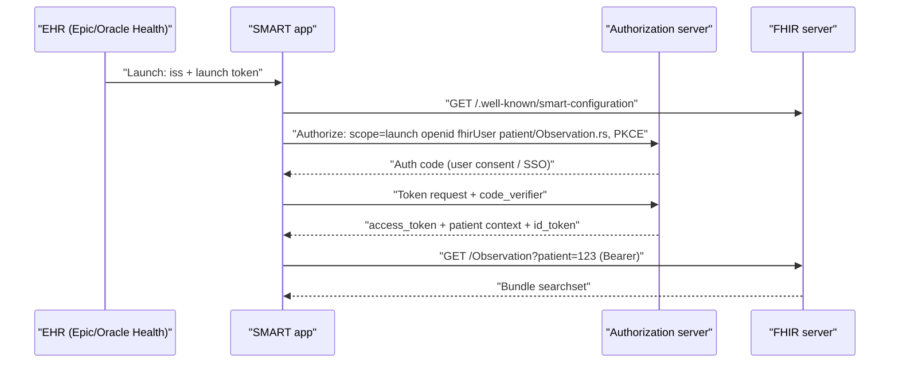
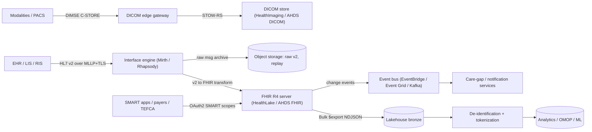

# Q1 Healthcare interoperability
> Last verified: 2026-10 · Audience: senior/staff DevOps, SRE, AI eng, NetEng, DevSecOps, architects

## TL;DR
- Healthcare integration is **three generations running side by side**: **HL7 v2** (pipe-delimited events over **MLLP**, still most hospital ADT/lab traffic), **CDA/C-CDA** (XML clinical documents), and **FHIR R4** (REST + JSON resources, which US regulation requires). Add **DICOM** for imaging and **X12 EDI** for claims and payment.
- An **interface engine** (Mirth/NextGen Connect, Rhapsody, Cloverleaf, InterSystems) is the hub. It handles routing, transformation, ACKs, queuing and replay. Treat it like a message broker that also knows the healthcare formats.
- **FHIR**: resources + REST + search + Bundles. Behaviour is constrained by **profiles/IGs** (US Core ↔ USCDI). **SMART on FHIR** (OAuth2/OIDC scopes) handles app authorization, **CDS Hooks** puts decision support into the clinician workflow, and **Bulk FHIR `$export`** (async NDJSON) feeds population-level analytics.
- **Codes matter as much as formats**: SNOMED CT (findings), LOINC (labs/observations), ICD-10-CM (diagnoses/billing), RxNorm (drugs), CPT/HCPCS (procedures/billing). Mapping between them is a large part of the integration work.
- Regulation drives the roadmap. The **Cures Act information-blocking** rules, **ONC (ASTP) HTI-1** (USCDI v3 baseline by 2026-01-01, AI/DSI transparency) and the **CMS-0057-F** payer APIs (Provider Access, Payer-to-Payer, Prior Authorization) all apply. CMS-0057-F has operational provisions from **2026-01-01** and APIs from **2027-01-01**. **TEFCA/QHINs** provide national network-of-networks exchange.
- **Patient identity is the hardest problem**. The US has no national patient ID, so systems depend on an **EMPI** with probabilistic matching. An **overlay** (two people merged into one record) is a patient-safety event, while a duplicate record is mainly a cost and quality problem.
- Cloud: **AWS HealthLake** (FHIR R4) + **HealthImaging** (DICOM) + **HealthOmics** ↔ **Azure Health Data Services** (FHIR service, DICOM service, de-identification service) + **Microsoft Fabric healthcare data solutions**. **Azure API for FHIR was retired 2026-09-30**, and the Azure **MedTech service** is deprecated (support for existing instances ends 2028-05-03). Google Cloud Healthcare API is the main alternative.
- Senior-level signals: idempotent message processing with ordering per patient, replay from durable storage, PHI-aware logging, BAA-only services, and de-identification before data reaches analytics. Treat "the EHR is the source of truth" as a design constraint.

## Q1.1 Healthcare data landscape
- **How it works:**
  - **Providers** (hospitals, clinics, labs, imaging centres) run an **EHR/EMR**. The main US vendors are **Epic** (largest acute-care share), **Oracle Health** (formerly Cerner, acquired 2022), **MEDITECH**, and in ambulatory care athenahealth, eClinicalWorks, NextGen and Veradigm. Departmental systems (LIS for lab, RIS/PACS for radiology, pharmacy, ADT/registration, billing/RCM) feed each other through the EHR or an interface engine.
  - **Payers** (Medicare/Medicaid run by CMS, Medicare Advantage, commercial plans) receive **claims** and return **remittances**. **Clearinghouses** (Availity, Waystar, Optum/Change Healthcare) validate, translate and route X12 between thousands of providers and payers.
  - **HIEs / networks**: regional HIEs, **Carequality**, **CommonWell**, **eHealth Exchange**, and now **TEFCA QHINs** carry document queries (IHE XCA/XDS) between organizations. Epic **Care Everywhere** rides on Carequality.
  - **Other actors**: pharmacy networks (Surescripts, NCPDP SCRIPT), public health (immunization registries, eCR/eICR), life sciences/research (OMOP CDM, i2b2), and digital health apps that use patient-access FHIR APIs.
- **Trade-offs / when to use:**
  - Integrating through **vendor-native APIs** (Epic on FHIR/App Orchard successor "Showroom", Oracle Health Code) gives richer data, at the cost of vendor-specific onboarding and fees. **Standards-only** integration is more portable but limited to what US Core exposes.
  - **Change Healthcare ransomware (Feb 2024)**: a single clearinghouse outage stopped claims and pharmacy flows across the US. It is the standard example of **concentration risk**, and the reason to design in multi-clearinghouse failover.
- **Interview angles:**
  - "Who are the stakeholders?" → provider, payer, patient, clearinghouse, HIE/QHIN, regulator (ONC/ASTP, CMS, OCR for HIPAA). Each one uses different standards: providers use v2/FHIR, payers use X12 plus the CMS-mandated FHIR APIs.
  - Pitfall: assuming FHIR has replaced HL7 v2. In practice FHIR sits **on top of** v2-heavy internal plumbing.

## Q1.2 HL7 v2.x messaging
- **How it works:**
  - **Text messages**, segments separated by `\r`, fields by `|`, components `^`, repetitions `~`, escape `\`, sub-components `&`. The encoding characters are declared in **MSH-1/MSH-2**.
  - **Key segments**: **MSH** (header: sending/receiving app and facility, MSH-7 timestamp, **MSH-9 message type** e.g. `ADT^A01`, **MSH-10 control ID**, MSH-11 processing ID P/T/D, **MSH-12 version** e.g. 2.5.1), **EVN** (event), **PID** (patient: PID-3 identifier list with assigning authority, PID-5 name, PID-7 DOB, PID-8 sex), **PV1** (visit/encounter), **ORC/OBR** (order common/observation request), **OBX** (observation result: value type, LOINC code in OBX-3, value OBX-5, units OBX-6, abnormal flag OBX-8, status OBX-11), **NK1**, **AL1**, **DG1**, **IN1**, and **Z-segments** (site-specific custom segments).
  - **Common message types**: **ADT** (A01 admit, A02 transfer, A03 discharge, A04 register outpatient, A08 update, A11/A13 cancels, **A40 merge patient**), **ORM^O01** (orders; superseded by **OML/OMG** in v2.5+), **ORU^R01** (results), **SIU** (scheduling), **MDM** (documents), **DFT** (charges), **VXU** (immunizations), **RDE/RAS** (pharmacy).
  - **ACKs**: the receiver returns `ACK` with **MSA-1** = `AA` (accept), `AE` (error) or `AR` (reject). Original mode is an application ACK. Enhanced mode separates commit (CA/CE/CR) from application ACKs.
  - **MLLP transport**: TCP with framing `0x0B` + message + `0x1C 0x0D`. It has **no TLS, auth or retries built in**, so it needs a VPN, stunnel or TLS-MLLP wrapper. Senders typically use **one connection per interface, sequential send-and-wait-for-ACK**, which gives FIFO order and also caps throughput.
  - **Versions**: 2.3/2.3.1 and **2.5.1** dominate (2.5.1 is named in US certification for lab and immunization). The latest is 2.9.x (unverified exact point release). The "standard" is loose, so every interface needs a **spec/mapping document**.
  - **Interface engines**: **NextGen Connect (Mirth)**: from 4.6 (2025), new releases are commercial-licence only (unverified detail), and the open-source forks are community-maintained. Also **Rhapsody**, **Infor Cloverleaf**, **InterSystems HealthShare/IRIS for Health**, Epic **Bridges** (Epic-side interface module), and Azure/AWS-native builds (Logic Apps, Lambda + MLLP adapters).
- **Trade-offs / when to use:**
  - v2 is real-time and event-driven, and every hospital supports it. It is the de facto way to get ADT and results feeds. On the other hand semantics vary by site, there is no query model (it is push only), and it is hard to validate.
  - Ordering: patient-scoped ordering matters, e.g. an A08 must not be applied before its A01. Parallelize **across** patients, never **within** a patient (partition key = MRN).
- **Interview angles:**
  - "How do you make an HL7 feed reliable?" → persist the raw message before you ACK it (store-then-ACK), make processing idempotent on MSH-10 plus sending facility, use a dead-letter queue for AE/AR, replay from the raw store, alert on queue depth and age, and track **heartbeat/no-traffic alerts** per interface (silence is the most common failure).
  - Pitfall: ACKing before persisting loses messages on crash. ACKing only after the downstream system finishes causes sender timeouts and duplicate resends.
  - Merges (A40/A34) must propagate to every downstream copy, or records diverge.

## Q1.3 HL7 FHIR core: resources, REST, search, bundles
- **How it works:**
  - **Resources** are typed, modular JSON/XML/RDF documents with `id`, `meta.versionId`, `meta.lastUpdated`, `meta.profile`, narrative `text`, and **extensions**. Examples: Patient, Practitioner, Organization, Encounter, Observation, Condition, MedicationRequest, AllergyIntolerance, DiagnosticReport, DocumentReference, Coverage, Claim/ExplanationOfBenefit.
  - **Versions**: **R4 (4.0.1, 2019)** is the first release with **normative** content and the version US regulation is pinned to. **R4B (4.3.0, 2022)** has STU-only changes. **R5 (5.0.0, published 2023-03-26)** is current. **R6** is in development and targets a larger normative scope (status unverified). Most production servers, including HealthLake and the Azure FHIR service, run **R4**.
  - **REST**: `GET [base]/Patient/123` (read), `/_history/2` (vread), `PUT` (update), `POST` (create), `DELETE`, `PATCH` (JSON Patch / FHIRPath Patch), `GET [base]/metadata` (**CapabilityStatement**). Errors come back as an **OperationOutcome**. **Optimistic locking** uses `ETag: W/"3"` + `If-Match`. **Conditional create** uses `If-None-Exist: identifier=...` and is the idempotency tool.
  - **Search**: `GET /Observation?patient=123&code=http://loinc.org|4548-4&date=ge2025-01-01&_sort=-date&_count=50`. Supports modifiers (`:exact`, `:missing`, `:not`), **chaining** (`subject:Patient.identifier=...`), **reverse chaining** (`_has`), and `_include`/`_revinclude`. Results come back as a **Bundle `searchset`** with paging `link.next` (opaque cursor). Prefer `_elements`/`_summary` to trim payloads.
  - **Bundle types**: `searchset`, `transaction` (**atomic**, all or nothing, internal references via `urn:uuid:`), `batch` (independent entries), `document` (a Composition comes first; immutable), `message`, `collection`, `history`.
  - **Operations**: `$everything` (Patient), `$validate`, `$match` (MPI), `$export`, `$lookup`/`$expand`/`$translate` (terminology), plus custom operations.
- **Trade-offs / when to use:**
  - Use FHIR REST for **transactional, patient-scoped** access (apps, point-to-point). Use **Bulk FHIR** for population analytics. Don't page through millions of resources with search.
  - Wide resources with extensions are flexible, but **every implementation profiles differently**. Interop only holds when both sides agree on an IG.
- **Interview angles:**
  - "R4 or R5?" → R4 (+ US Core), because certification and CMS mandates reference it. Use R5 features (topic Subscriptions) on R4 through **backport IGs**.
  - "Idempotent create?" → conditional create on a business identifier, or `PUT` with a client-assigned id where the server allows it.
  - Pitfall: treating FHIR as a database schema. Search is limited to the defined **SearchParameters**, so analytics should move to a lakehouse (SQL on FHIR / flattened views).

## Q1.4 Profiles, Implementation Guides, US Core and USCDI
- **How it works:**
  - **StructureDefinition** profiles constrain resources (cardinality, **Must Support**, bound ValueSets, required extensions). **IGs** package profiles, examples, CapabilityStatements and terminology. Conformance is checked with the HL7 **validator** or `$validate`.
  - **USCDI** (ONC's data-element list) maps to **US Core** profiles. HTI-1 makes **USCDI v3 / US Core 6.1.0** the certification baseline from **2026-01-01**. Later USCDI versions (v4, v5) map to US Core 7.x and 8.x (exact pairing to verify per program).
  - Key IG families: **Da Vinci** (payer/provider: **CRD**, **DTR**, **PAS** for prior auth; **PDex**; **Plan-Net** provider directory; HRex), **CARIN Blue Button** (claims/EOB for patient access), **Bulk Data** (v2), **SMART App Launch** (v2.x), **IPA** (international patient access), **mCODE** (oncology), **IHE** profiles (PDQm, PIXm, MHD for FHIR documents).
- **Trade-offs / when to use:** pick **one** IG per exchange and pin its version. Validate on ingest (strict) or tag and quarantine (lenient). Strict validation breaks on real EHR data, so the usual choice is lenient ingestion plus a data-quality report.
- **Interview angles:** "How do you support multiple partners?" → keep a canonical internal profile and map each partner to it at the edge. That gives N adapters instead of N² mappings.

## Q1.5 SMART on FHIR and CDS Hooks
- **How it works (SMART App Launch 2.x):**
  - Built on **OAuth 2.0 + OIDC**. Discovery is at `[base]/.well-known/smart-configuration`. There are two launch types. **EHR launch**: the EHR opens the app with `iss` + `launch` params, and the app requests the `launch` scope. **Standalone launch**: the app requests `launch/patient` and the user picks a patient. Public clients (browser, mobile) must use **PKCE (S256)**. The token response carries context such as `patient` and `encounter`.
  - **Scopes v2**: `{patient|user|system}/{Resource}.{c r u d s}` with optional query filters, e.g. `patient/Observation.rs?category=laboratory`. v1 `.read` = v2 `.rs`, v1 `.write` = v2 `.cud`. Other scopes: `openid fhirUser`, `offline_access` (refresh token beyond the session) and `online_access`.
  - **SMART Backend Services**: `client_credentials` grant with a **JWT client assertion** signed by a key in the client's **JWKS** (RS384/ES384), using `system/` scopes. No user is involved. It is used for Bulk FHIR and server-to-server flows.
- **CDS Hooks:**
  - The EHR calls remote CDS services at workflow **hooks** (`patient-view`, `order-select`, `order-sign`, `appointment-book`, `encounter-start`, `encounter-discharge`). Discovery is at `GET {base}/cds-services`. The request carries `context` + **prefetch** (FHIR data templated by the service) + `fhirAuthorization`. The response is **cards** (`info`/`warning`/`critical`) with suggestions (proposed FHIR actions) or links to launch a SMART app.
  - Da Vinci **CRD** (coverage requirements discovery) is built on CDS Hooks. It is the path for prior auth in the clinician workflow.
- **Trade-offs:** SMART apps can embed in the EHR and work across vendors, but per-vendor app registration and review is still needed. CDS Hooks run on a **latency budget** (sub-second, because the clinician is waiting), so cache prefetch data and always fail **open**. A slow CDS service must never block an order.
- **Interview angles:**
  - "Secure a third-party app's access" → least-privilege v2 scopes, PKCE, short-lived access tokens, refresh token only with `offline_access`, token introspection, and audit everything to AuditEvent and the SIEM.
  - Pitfall: `system/*.rs` granted to a vendor integration is a full PHI dump. Scope it per resource, and use Group-level export.



## Q1.6 Bulk FHIR $export and FHIR Subscriptions
- **How it works (Bulk Data Access IG v2):**
  - Kick-off: `GET [base]/$export`, `[base]/Patient/$export` or `[base]/Group/{id}/$export` with `Accept: application/fhir+json` and `Prefer: respond-async`. Parameters include `_type`, `_since` (incremental), `_typeFilter` and `_outputFormat=application/fhir+ndjson`.
  - The server replies **202** + `Content-Location` (status URL). The client polls the status URL and gets 202 + `X-Progress`/`Retry-After` until **200** with a **manifest** listing NDJSON file URLs per resource type (`requiresAccessToken`). `DELETE` on the status URL cancels the job.
  - Auth uses **SMART Backend Services**. Cloud servers write output to object storage (HealthLake → S3, Azure FHIR → a Storage account with managed identity).
  - Bulk **`$import`** is **not** standardized in the same way. Vendor imports exist (HealthLake StartFHIRImportJob, Azure `$import`).
- **Subscriptions:**
  - **R4**: criteria-based `Subscription` (search string + channel `rest-hook`/`websocket`/`email`/`message`).
  - **R5**: **topic-based** (`SubscriptionTopic` + `Subscription` + `SubscriptionStatus` notification bundles, with heartbeats and event numbers for gap detection). The **Subscriptions R5 Backport IG** brings this model to R4/R4B.
  - Payload options are `empty`, `id-only` or `full-resource`. **id-only** is the PHI-minimizing default: the receiver fetches the resource with its own token.
  - Cloud-native alternative: the server emits events to a bus (HealthLake → **EventBridge**, Azure FHIR → **Event Grid**) for fan-out.
- **Trade-offs:** Bulk works for nightly or incremental analytics feeds, but it is not real time. Subscriptions or events work for near-real-time workflows, but delivery is at-least-once, so consumers must be idempotent and detect gaps (event numbers).
- **Interview angles:** "Feed a lakehouse from FHIR" → Bulk `$export` with `_since` watermark → NDJSON in object storage → flatten (SQL on FHIR ViewDefinitions / Spark) → de-identify → Delta/Iceberg. See [M1 Lakehouse table formats](../M-data-platforms/M1-lakehouse-table-formats.md).

## Q1.7 CDA / C-CDA clinical documents
- **How it works:**
  - **CDA R2** is XML derived from the HL7 v3 RIM. A document has a header (patient, author, custodian, encounter) and a body of **sections**. Each section has a **LOINC section code**, a **templateId**, human-readable narrative (legally authoritative), and optional coded **entries**.
  - **C-CDA** (Consolidated CDA, R2.1 is the version in widest use; newer releases exist, unverified which is mandated) defines document types: **CCD** (summary), Discharge Summary, Referral Note, Progress Note, H&P, Consultation, Care Plan.
  - Exchanged via **IHE XDS.b/XCA** (Carequality/CommonWell/eHealth Exchange/TEFCA document query), **Direct** messaging (S/MIME over SMTP with HISP trust bundles), or FHIR `DocumentReference` + `Binary`.
- **Trade-offs:** documents are snapshots with signatures and context, and good for transitions of care. They are poor for granular queries, deduplication and analytics. Converting C-CDA to FHIR is lossy and template-heavy (tools include Azure FHIR converter Liquid templates and HealthLake Data Transformation Agent (preview)).
- **Interview angles:** "Why still CDA?" → TEFCA/Carequality document query volume is still dominated by C-CDA. Expect to ingest, deduplicate (the same CCD is pulled from many sites) and reconcile meds/allergies/problems.

## Q1.8 DICOM and medical imaging
- **How it works:**
  - **Data model**: Patient → **Study** (StudyInstanceUID) → **Series** (SeriesInstanceUID, one modality) → **Instance/SOP** (SOPInstanceUID). Each object carries **tags** `(group,element)`, e.g. `(0010,0010)` PatientName and `(0008,0060)` Modality, plus pixel data in a **transfer syntax** (uncompressed, JPEG, JPEG-LS, JPEG 2000, **HTJ2K**, RLE).
  - **DIMSE** networking (classic): association between **AE Titles** over TCP **104 / 11112**. Services are **C-ECHO**, **C-STORE**, **C-FIND** (query), **C-MOVE** (the remote pushes to a third AE, which makes it firewall-hostile), **C-GET**, and **Modality Worklist** (MWL, fed by orders/ADT).
  - **DICOMweb** (RESTful, PS3.18): **QIDO-RS** (query `GET /studies?PatientID=...`), **WADO-RS** (retrieve study/series/instance/frames/rendered), **STOW-RS** (store via `POST` multipart/related), **UPS-RS** (worklist). WADO-URI is legacy.
  - **PACS** (radiology department archive + viewer) vs **VNA** (vendor-neutral enterprise archive across departments). Sizes: CT is hundreds of MB per study. Breast tomosynthesis and whole-slide pathology are **GBs per study**, which makes petabyte-scale storage tiering a real design issue.
  - De-identification follows **PS3.15 Annex E** profiles (remove/replace tags, UID remapping). Watch for **burned-in annotations** in the pixels and private tags.
- **Trade-offs:** cloud DICOM stores (HealthImaging, Azure DICOM service, Google Healthcare API) give DICOMweb + scale, but modalities still speak DIMSE, so you need an **on-prem DICOM router/gateway** at the edge. Lossless HTJ2K enables fast progressive retrieval.
- **Interview angles:** "Move a hospital's imaging to cloud" → keep the edge DIMSE gateway (store-and-forward, AE whitelist), use DIMSE→STOW-RS, a cache for prior studies on-site, lifecycle tiering for cold studies, egress-cost awareness for viewers, and bandwidth sizing via [G12 Dedicated interconnect](../G-cloud-network-architecture/G12-dedicated-interconnect.md).

## Q1.9 Clinical and billing terminologies
| System | Covers | Owner / licence | Notes |
|---|---|---|---|
| **SNOMED CT** | Clinical findings, problems, procedures, body sites | SNOMED International; free in the US via NLM UMLS | Polyhierarchy, post-coordination; problem lists in US Core |
| **LOINC** | Lab tests, observations, document & section types | Regenstrief; free | OBX-3 / `Observation.code`; vital signs panels |
| **ICD-10-CM / -PCS** | Diagnoses (CM) / inpatient procedures (PCS) | CDC/NCHS, CMS (US mods of WHO ICD-10) | Billing-driven. ICD-11 is in force at WHO since 2022; the US has not adopted it (as of 2026) |
| **RxNorm** | Clinical drugs (RXCUI) | NLM; free | Maps NDC (package-level) to normalized drug concepts |
| **CPT** | Outpatient/physician procedures | **AMA, licensed (fees)** | HCPCS Level II (CMS) for supplies, drugs, DME |
| **CVX / MVX** | Vaccines / manufacturers | CDC | Immunization registries (VXU) |
| **UCUM** | Units | Regenstrief | `Quantity.system` in FHIR |
- **How it works:** FHIR `CodeableConcept` = `coding[]` (system + code + display) + `text`. Use the **terminology server** operations (`$lookup`, `$validate-code`, `$expand` ValueSets, `$translate` with ConceptMap) and the **VSAC** (NLM Value Set Authority Center) for quality-measure value sets.
- **Trade-offs:** mapping local lab codes to LOINC is manual and expensive (it is the largest lab-integration cost). Crosswalks such as SNOMED→ICD-10-CM are one-to-many and need context.
- **Interview angles:** "Store codes how?" → keep the **original code + system + version** and the normalized mapping side by side. Never overwrite the source, and version the terminology releases you loaded. CPT licensing can bite SaaS products that display CPT descriptors.

## Q1.10 X12 EDI for claims and payments
- **How it works:**
  - HIPAA-mandated **X12 005010** transaction sets. **837P/837I/837D** (professional/institutional/dental claim), **835** (remittance advice / ERA), **270/271** (eligibility inquiry/response), **276/277** (claim status), **278** (services review / prior auth), **834** (enrollment), **820** (premium payment). Acknowledgments: **TA1** (interchange), **999** (syntax), **277CA** (claim acceptance).
  - **Envelopes**: `ISA/IEA` (interchange) → `GS/GE` (functional group) → `ST/SE` (transaction). Segments are delimited by `~`, elements by `*`. Loops are positional, e.g. 2000A billing provider, 2300 claim, 2400 service line.
  - Transport: SFTP batch, or real-time **CAQH CORE** connectivity (SOAP / HTTP MIME over TLS) for 270/271. Pharmacy uses **NCPDP** (D.0 telecom, SCRIPT) instead of X12.
  - Typical flow: provider RCM → clearinghouse (scrub/edit) → payer → 999/277CA → adjudication → 835 + EFT (CCD+ payment matched via the TRN re-association number).
- **Trade-offs:** X12 is batch-oriented and strictly validated, and partner companion guides vary. **CMS-0057-F** pushes FHIR prior auth (Da Vinci PAS). HHS uses **enforcement discretion** so payers can run FHIR PAS without wrapping X12 278 (verify current status).
- **Interview angles:** "Design a claims pipeline" → idempotent on claim control number (CLM01), 999/277CA reconciliation and dashboards, 835 auto-posting with exception queues, dual clearinghouses for resilience (the Change Healthcare lesson), and PHI encryption at rest/in transit with audited SFTP keys. Cross-link [Q3 Payment processing integration](./Q3-payment-processing-integration.md).

## Q1.11 US regulations driving interoperability
- **21st Century Cures Act (2016) → ONC Cures Act Final Rule (2020):**
  - **Information blocking** is prohibited for health IT developers of certified health IT, HINs/HIEs and providers. Compliance began 2021-04-05, and the full **EHI** scope applied from 2022-10-06.
  - **Exceptions** exist, e.g. preventing harm, privacy, security, infeasibility, content and manner, plus the TEFCA manner exception added by HTI-1.
  - Penalties: OIG civil monetary penalties **up to $1M per violation** for developers/HINs. Providers face CMS **disincentives** under the 2024 rule (e.g. Promoting Interoperability, MIPS, ACO).
  - It also created the certified **standardized API** criterion **§170.315(g)(10)**: FHIR R4 + US Core + SMART + Bulk.
- **ONC is renamed ASTP/ONC** (Assistant Secretary for Technology Policy, 2024).
- **HTI-1** (final Dec 2023, effective 2024-03-11): **USCDI v3** baseline by **2026-01-01**, **Decision Support Interventions (DSI)** criterion with **predictive AI algorithm transparency** (source attributes), the "Insights" condition, and information-blocking updates.
- **HTI-2 / HTI-3 / HTI-4 / HTI-5** (unverified details; check healthit.gov):
  - **HTI-2** proposed 2024-07, finalized in parts in Dec 2024, covering TEFCA governance and the protecting-care-access information-blocking provisions (the latter as **HTI-3**).
  - **HTI-4** (2025, with CMS IPPS) adds **electronic prior authorization** certification criteria aligned to CMS-0057-F.
  - **HTI-5** (proposed late 2025) is a **deregulatory** rule removing or simplifying certification criteria.
- **CMS Interoperability & Prior Authorization Final Rule (CMS-0057-F, Jan 2024)**:
  - Impacted payers are **MA organizations, state Medicaid & CHIP (FFS and managed care), and QHP issuers on the FFEs**.
  - **From 2026-01-01**: prior-auth decision timeframes of **72 h expedited / 7 calendar days standard** (MA, Medicaid, CHIP), a specific denial reason, and public prior-auth **metrics** reporting (first report by 2026-03-31; timeframe detail per CMS, verify).
  - **From 2027-01-01**: **Provider Access API**, **Payer-to-Payer API**, **Prior Authorization API** (Da Vinci CRD/DTR/PAS recommended), and prior-auth data added to the **Patient Access API**. Builds on **CMS-9115-F (2020)** Patient Access + Provider Directory APIs.
  - Provider side: MIPS/PI "Electronic Prior Authorization" measure.
- **TEFCA**: ONC framework + **Common Agreement** (v2.0 in 2024 adds **FHIR** exchange). **RCE = The Sequoia Project** (5-yr contract from Aug 2023). The **first QHINs were designated in Dec 2023** (e.g. eHealth Exchange, Epic Nexus, Health Gorilla, KONZA, MedAllies, CommonWell, Kno2, eClinicalWorks; the full list is on healthit.gov). Six **exchange purposes**: treatment, payment, health care operations, public health, government benefits determination, individual access services (IAS).
- **HIPAA** still governs privacy and security: BAAs, minimum necessary, breach notification, and the right of access. A Security Rule NPRM was published Jan 2025 (final status unverified). **42 CFR Part 2** covers SUD records and was aligned to HIPAA in 2024. State laws such as CA CMIA, WA My Health My Data and Texas are stricter. See [Q2 Healthcare cloud & HIPAA engineering](./Q2-healthcare-cloud-hipaa-engineering.md).
- **Interview angles:** "Why does a payer need a FHIR platform by 2027?" → CMS-0057-F APIs + Patient Access. Map Provider Access to Bulk `$export` with Group-level attribution lists, Payer-to-Payer to PDex member match + Bulk, and Prior Auth to CRD/DTR/PAS. Pitfall: "privacy" is not a blanket excuse not to share. Information-blocking exceptions have **specific conditions**.

## Q1.12 Patient matching and the Master Patient Index
- **How it works:**
  - The US has **no national patient identifier**: Congress has barred HHS from funding one since 1999. Matching therefore uses demographics: name, DOB, sex, address, phone, SSN fragment, email.
  - **Deterministic** matching uses exact or rule-based keys. **Probabilistic** matching (**Fellegi–Sunter**: m/u weights, phonetic comparators such as Soundex/NYSIIS/Double Metaphone, Jaro–Winkler) scores candidate pairs into **auto-link / review / non-link** bands. **Referential** matching compares against third-party identity reference data.
  - An **EMPI** issues an **enterprise ID** and keeps a cross-reference of local MRNs (assigning authority + identifier). Interfaces: IHE **PIX/PDQ** (v2/v3) and **PIXm/PDQm**, FHIR **`Patient/$match`** (scored candidates), `Patient.link` (replaced-by/seealso), and v2 **A40/A24/A37** merge, link and unlink messages.
  - Blocking keys keep candidate-pair generation tractable (avoid O(n²)).
- **Trade-offs:** a **false positive = overlay** (two people in one chart) is the most dangerous error because of wrong-patient care. A **false negative = duplicate** fragments the record. Tune thresholds toward a human **data-steward review queue**, and make every merge reversible with unmerge plus audit.
- **Interview angles:** "Design an MPI at 50M records" → normalization (USPS address standardization, nickname tables), blocking, scoring, a steward queue, event-sourced merge history, and propagation of merges downstream through events. Measure precision/recall on a labelled set. Payer-to-payer **member match** (Da Vinci HRex `$member-match`) is the CMS-0057-F flavour.

## Q1.13 Integration architecture patterns and de-identification
- **How it works:**
  - **Interface-engine hub** (hub-and-spoke): sources connect once (MLLP/SFTP/DIMSE/REST) and the engine routes, transforms and fans out. This avoids N² point-to-point links.
  - **Canonical model = FHIR**: v2 → FHIR conversion (HL7 v2-to-FHIR IG mappings, Azure FHIR converter / `$convert-data`, HealthLake transformation) at ingest, then a FHIR server as the operational store.
  - **Event-driven**: the FHIR server emits change events (Subscriptions / EventBridge / Event Grid) to a bus (Kafka / Event Hubs / Kinesis), which feeds consumers (care-gap alerts, notifications, CDS, analytics). Partition by patient for ordering.
  - **Analytics**: Bulk export or change feed → lakehouse (Delta/Iceberg) → **OMOP CDM** for research / SQL on FHIR views → BI/ML. **Microsoft Fabric healthcare data solutions** and **HealthLake + Athena/Lake Formation** productize this path.
  - **De-identification (HIPAA §164.514)**:
    - **Safe Harbor**: remove the **18 identifiers**. Dates are reduced to year, ZIP to the first 3 digits only if that area has more than 20,000 people, and ages over 89 are aggregated.
    - **Expert Determination**: a statistician certifies very small re-identification risk. This allows dates or 5-digit ZIP when justified.
    - A **Limited Data Set** + Data Use Agreement keeps dates and city/ZIP.
    - Linkage across de-identified sets uses **privacy-preserving tokens** (keyed hash of normalized PII, Datavant-style).
    - Free text and images need NLP or pixel scrubbing (Azure de-identification service, HealthLake/Comprehend Medical PHI detection).
- **Trade-offs:** a hub engine is mature and has strong v2 tooling, but it can become a monolith and a SPOF. A bus + microservices scales, but you must re-implement ACK, replay and mapping governance. Many designs use both: the engine at the edge and the bus inside.
- **Interview angles:** "The FHIR server is the analytics DB?" → no. Keep separate OLTP (FHIR) and OLAP (lakehouse) stores, de-identify in a separate, locked-down account/subscription, and keep the token/re-id key in an HSM/KMS outside the analytics tenant. See [L1 Data classification & PII](../L-data-privacy-ai-security/L1-data-classification-pii.md) and [M4 Kafka at scale](../M-data-platforms/M4-kafka-at-scale.md).



## Q1.14 Interview angles: building a healthcare integration platform
- **Requirements to elicit:** who are the trading partners (EHR vendors, payers, labs), which standards (v2, C-CDA, FHIR, X12, DICOM), latency (real-time ADT vs nightly claims), regulatory drivers (CMS-0057-F 2027 APIs, (g)(10), TEFCA), volume (a large IDN produces ~millions of v2 messages/day; unverified order of magnitude), and data residency.
- **Reliability:** store-then-ACK, idempotency keys (MSH-10, CLM01, FHIR identifiers), per-patient ordering, DLQs with replay tooling, interface heartbeat SLOs ("no ADT for 15 min from site X" pages someone), and backpressure when the EHR is down (queue, don't drop). See [J1 SLIs/SLOs](../J-sre/J1-slis-slos-error-budgets.md).
- **Security/compliance:** BAA-covered services only, PHI-free logs and metrics (hash MRNs in traces), field-level encryption/CMKs, private endpoints (PrivateLink/Private Link), SMART least-privilege scopes, an AuditEvent trail with immutable retention (HIPAA documentation retention is 6 years), break-glass access, and **consent** enforcement (FHIR Consent, Part 2 segmentation).
- **Data quality:** terminology mapping service, validation against IGs, MPI/steward workflow, provenance (FHIR `Provenance`, `meta.source`).
- **Multi-tenant SaaS:** a datastore/workspace per tenant (HealthLake datastore / AHDS FHIR service) for blast-radius and BAA clarity, or a shared store with compartment-level authorization. Isolation is easier to defend in audits.
- **Common pitfalls:** treating FHIR as the analytics DB; ignoring merges; logging full HL7 payloads to a SaaS log tool without a BAA; C-MOVE across NAT; assuming one "HL7 v2" spec; skipping a terminology version strategy; single-clearinghouse dependency.

## Cloud mapping: AWS vs Azure
| Capability | AWS | Azure | Role it plays | Key differences | Alternatives |
|---|---|---|---|---|---|
| Managed FHIR server | **AWS HealthLake** (FHIR R4 datastore) | **Azure Health Data Services FHIR service** (in a workspace; R4, STU3) | Operational FHIR store, SMART, Bulk export | HealthLake: integrated medical NLP, Athena/Lake Formation, S3 import/export, preload Synthea, EventBridge events. AHDS: Entra ID RBAC, `$convert-data`, `$import`, Event Grid events, Private Link, CMK. **Azure API for FHIR retired 2026-09-30** → migrate to AHDS | Google Cloud Healthcare API (FHIR store); self-host **HAPI FHIR**, Microsoft open-source FHIR Server, Smile CDR, Firely |
| DICOM / imaging | **AWS HealthImaging** (image sets, HTJ2K, DICOMweb retrieve) | **AHDS DICOM service** (DICOMweb QIDO/WADO/STOW, Data Lake Storage integration) | Petabyte imaging archive and viewer back-end | HealthImaging optimizes sub-second frame retrieval via HTJ2K. Azure DICOM can write to your own ADLS Gen2 for analytics | Google Healthcare API DICOM store; Orthanc/dcm4chee self-hosted |
| Genomics / omics | **AWS HealthOmics** (sequence stores, private workflows WDL/Nextflow/CWL) | No direct PaaS equivalent; Azure Batch/CycleCloud + Cromwell, **Microsoft Genomics retired** (unverified date) | Store reads, run bioinformatics pipelines | AWS has the purpose-built service. On Azure you assemble it from batch compute | Databricks (Glow), Terra/GCP, DNAnexus |
| Device / IoT → FHIR | IoT Core/Kinesis + Lambda → HealthLake (DIY) | **MedTech service: deprecated** (initiated 2025-05-03, support ends **2028-05-03**); OSS version on GitHub | Device telemetry → FHIR Observation | Both are now DIY. Use Event Hubs / IoT Hub + Functions | Kafka + stream processing |
| De-identification | Comprehend Medical (PHI detection), HealthLake NLP, Macie for S3 | **AHDS de-identification service** (tag/redact/surrogate PHI in text) | Analytics/research datasets | Azure has a first-class service. AWS composes it | Google DLP / Healthcare API de-identify |
| Healthcare analytics | HealthLake + **Athena / Lake Formation**, Glue, SageMaker | **Microsoft Fabric healthcare data solutions** (FHIR → OneLake medallion, OMOP, DICOM, de-id) | Lakehouse on clinical data | Fabric is SaaS capacity-priced with prebuilt pipelines. AWS is service-composed | Databricks (Delta, Lakehouse for Healthcare), Snowflake |
| HL7 v2 / integration | Lambda/ECS MLLP listeners, Step Functions, Amazon MQ; Marketplace engines | Logic Apps (v2/X12 via Integration Account), Functions, Service Bus | Interface engine role | Neither has a full managed v2 engine. Azure Logic Apps has X12/EDIFACT B2B connectors | Mirth/NextGen Connect, Rhapsody, Cloverleaf, InterSystems on VMs/K8s |
| Events from FHIR | EventBridge | Event Grid | Change notification fan-out | Both near-real-time, at-least-once | FHIR R5/backport Subscriptions, Kafka |
| Private access | PrivateLink to HealthLake | Private Link to AHDS workspace | Keep PHI off the internet | Per-service endpoints | — |
- **Roles:** HealthLake and the AHDS FHIR service are the operational FHIR stores. HealthImaging and the AHDS DICOM service replace or augment the PACS/VNA archive. HealthOmics has no Azure peer. Fabric healthcare data solutions is the Azure analytics answer to "HealthLake + Athena + Lake Formation".
- **Differences / gotchas:**
  - Both are **regional**, HIPAA-eligible, and require a **BAA** (AWS BAA via Artifact, Microsoft BAA via the Product Terms/DPA).
  - HealthLake is **R4 only** (`datastore_type_version = "R4"`). Azure FHIR service supports R4 (and STU3).
  - Azure groups FHIR + DICOM in a **workspace**. AWS services are independent resources.
  - Azure API for FHIR (Gen1) customers had to migrate to the AHDS FHIR service by 2026-09-30.
  - Pricing shape: HealthLake charges per datastore-hour + storage + queries/NLP. AHDS FHIR charges for storage + API requests. Check current pricing pages; both differ from VM-hosted HAPI economics.
- **Alternatives:**
  - **Google Cloud Healthcare API**: FHIR/HL7v2/DICOM stores in one dataset. It is the only one of the three with a **native HL7v2 store + MLLP adapter**.
  - Self-hosted **HAPI FHIR** on Kubernetes/Postgres for full control.
  - **Databricks/Spark** for FHIR/OMOP analytics.
  - **Kafka/Confluent** as the event backbone.
  - **Claude/Gemini** for clinical-text summarization or coding assistance, but only under a BAA, with de-identified or minimum-necessary inputs and human review.

## Hands-on
Query and create against the public HAPI test server. **Never send real PHI** to public servers; they are wiped periodically.
```bash
BASE=https://hapi.fhir.org/baseR4
curl -s "$BASE/metadata" | jq '.fhirVersion'                    # expect "4.0.1"
curl -s "$BASE/Patient?family=smith&birthdate=ge1980-01-01&_count=5&_elements=name,birthDate" \
  -H 'Accept: application/fhir+json' | jq '.total, .entry[].resource.id'
# Conditional (idempotent) create keyed on a business identifier
curl -s -X POST "$BASE/Patient" -H 'Content-Type: application/fhir+json' \
  -H 'If-None-Exist: identifier=urn:example:mrn|MRN-0001' \
  -d '{"resourceType":"Patient","identifier":[{"system":"urn:example:mrn","value":"MRN-0001"}],"name":[{"family":"Test","given":["Demo"]}],"gender":"female","birthDate":"1990-01-01"}' \
  -w '\nHTTP %{http_code}\n'                                      # 201 first time, 200 afterwards
# Lab observations with LOINC code, newest first, include the patient
curl -s "$BASE/Observation?code=http://loinc.org|4548-4&_sort=-date&_include=Observation:subject&_count=3" | jq '.entry[].resource.resourceType'
```
Run a local HAPI FHIR server (base `http://localhost:8080/fhir`) and start a Bulk export:
```bash
docker run -d --name hapi -p 8080:8080 hapiproject/hapi:latest
until curl -sf http://localhost:8080/fhir/metadata >/dev/null; do sleep 5; done
curl -si "http://localhost:8080/fhir/Patient/\$export?_type=Patient,Observation" \
  -H 'Accept: application/fhir+json' -H 'Prefer: respond-async' | grep -i content-location
# poll the Content-Location URL until HTTP 200, then download NDJSON files from the manifest
```
Send an HL7 v2 ADT over MLLP (e.g. to a Mirth listener on 6661) using VT/FS/CR framing:
```bash
MSG='MSH|^~\&|REG|HOSP|ENGINE|HOSP|20261009120000||ADT^A01|MSG0001|P|2.5.1\rPID|1||MRN-0001^^^HOSP^MR||TEST^DEMO||19900101|F\rPV1|1|I|ICU^01^A'
printf '\x0b%b\x1c\x0d' "$MSG" | nc -w 5 localhost 6661 | tr '\r' '\n'   # expect MSA|AA|MSG0001
```
Terraform: an Azure Health Data Services FHIR service and an AWS HealthLake datastore (HealthLake is in the **awscc** provider):
```hcl
resource "azurerm_healthcare_workspace" "ws" {
  name                = "hcws01"
  location            = "eastus"
  resource_group_name = "rg-health"
}

resource "azurerm_healthcare_fhir_service" "fhir" {
  name                = "fhir01"
  location            = "eastus"
  resource_group_name = "rg-health"
  workspace_id        = azurerm_healthcare_workspace.ws.id
  kind                = "fhir-R4"
  authentication {
    authority = "https://login.microsoftonline.com/${var.tenant_id}"
    audience  = "https://hcws01-fhir01.fhir.azurehealthcareapis.com"
  }
  identity { type = "SystemAssigned" }
}

resource "awscc_healthlake_fhir_datastore" "lake" {
  datastore_name         = "clinical-r4"
  datastore_type_version = "R4"
  sse_configuration = {
    kms_encryption_config = {
      cmk_type   = "CUSTOMER_MANAGED_KMS_KEY"
      kms_key_id = var.kms_key_arn
    }
  }
}
```

## Cross-links
- [Q2 Healthcare cloud & HIPAA engineering](./Q2-healthcare-cloud-hipaa-engineering.md) · [Q3 Payment processing integration](./Q3-payment-processing-integration.md)
- [L1 Data classification & PII](../L-data-privacy-ai-security/L1-data-classification-pii.md) · [L2 Encryption & key management](../L-data-privacy-ai-security/L2-encryption-key-management.md) · [L3 Residency & compliance](../L-data-privacy-ai-security/L3-residency-compliance.md) · [L7 Zero trust & workload identity](../L-data-privacy-ai-security/L7-zero-trust-workload-identity.md)
- [P4 Identity providers (OAuth/OIDC)](../P-security-platforms-identity/P4-identity-providers.md) · [G7 Service endpoints & Private Link](../G-cloud-network-architecture/G7-service-endpoints-private-link.md)
- [M1 Lakehouse table formats](../M-data-platforms/M1-lakehouse-table-formats.md) · [M4 Kafka at scale](../M-data-platforms/M4-kafka-at-scale.md) · [M6 Orchestration & ETL](../M-data-platforms/M6-orchestration-etl.md)
- [D2 Reusable parts of system design](../D-system-design/D2-reusable-parts-of-system-design.md) · [J1 SLIs/SLOs](../J-sre/J1-slis-slos-error-budgets.md)

## Sources
- https://hl7.org/fhir/R5/versions.html
- https://hl7.org/fhir/smart-app-launch/scopes-and-launch-context.html
- https://www.cms.gov/priorities/burden-reduction/overview/interoperability/policies-regulations/cms-interoperability-prior-authorization-final-rule-cms-0057-f
- https://www.healthit.gov/topic/interoperability/policy/trusted-exchange-framework-and-common-agreement-tefca
- https://www.healthit.gov/topic/laws-regulation-and-policy/health-data-technology-and-interoperability-certification-program
- https://learn.microsoft.com/en-us/azure/healthcare-apis/healthcare-apis-overview
- https://learn.microsoft.com/en-us/azure/healthcare-apis/azure-api-for-fhir/overview
- https://learn.microsoft.com/en-us/azure/healthcare-apis/iot/overview
- https://docs.aws.amazon.com/healthlake/latest/devguide/what-is.html
- https://github.com/hashicorp/terraform-provider-awscc/blob/main/docs/resources/healthlake_fhir_datastore.md
- https://github.com/hashicorp/terraform-provider-azurerm/blob/main/website/docs/r/healthcare_fhir_service.html.markdown
