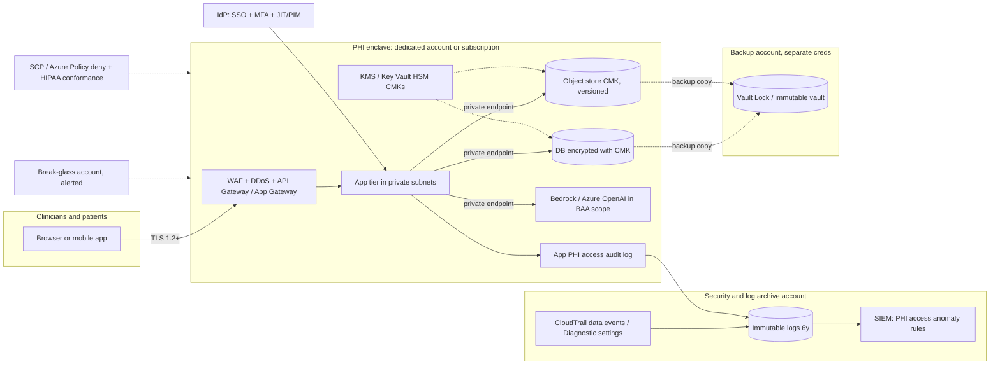
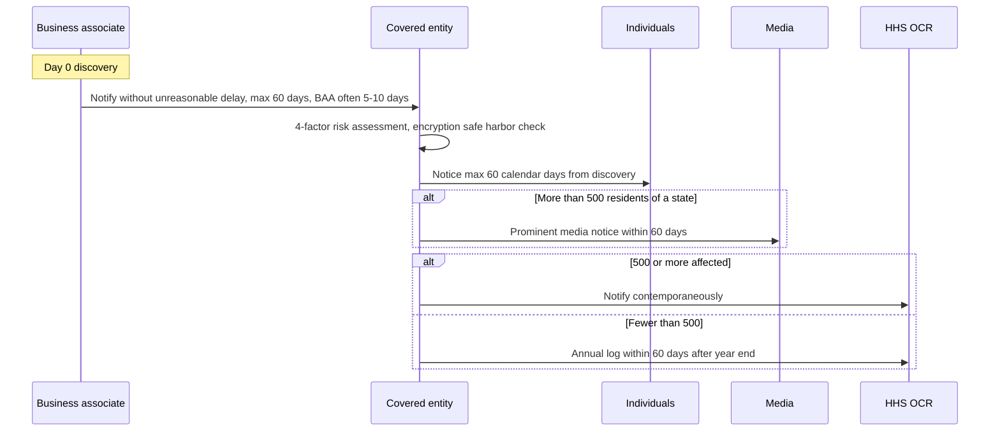

# Q2 Healthcare cloud & HIPAA engineering
> Last verified: 2026-10 · Audience: senior/staff DevOps, SRE, AI eng, NetEng, DevSecOps, architects

## TL;DR
- **HIPAA is a law, not a certification.** No HHS-approved certification exists for cloud providers or apps; you get a **BAA**, use only **HIPAA-eligible / in-scope services** for PHI, and own your **risk analysis** and configuration (shared responsibility).
- The **Security Rule** (45 CFR 164.302–318) is risk-based: **administrative, physical, technical** safeguards, each standard "required" or "addressable" (addressable ≠ optional: implement, or document why an equivalent is reasonable). Policy/documentation retention = **6 years** (164.316(b)(2)).
- **2025 Security Rule NPRM** (90 FR 898, published 2025-01-06) would make encryption, MFA, asset inventory/network map, 6-monthly vuln scans, annual pen tests and 72-hour restore mandatory. **As of the Fall 2025 Unified Agenda it was moved to "Long-Term Actions" with final action listed as 07/2027** — not law; design to it anyway.
- **PHI de-identification**: **Safe Harbor** (remove 18 identifiers + no actual knowledge) or **Expert Determination** (statistician certifies "very small" re-identification risk). **Limited Data Set** keeps dates/ZIP/city but needs a **Data Use Agreement**.
- **Breach**: presumed unless a 4-factor risk assessment shows low probability of compromise; notify individuals **≤60 calendar days** from discovery; **500+** → HHS contemporaneously + **media** if >500 residents of a state; **<500** → HHS log within 60 days after calendar year end. **Properly encrypted PHI (key not compromised) is "secured" → no notification.**
- Reference architecture: **dedicated accounts/subscriptions for PHI**, guardrails (SCP / Azure Policy deny), **CMK encryption**, **private endpoints only**, centralized **immutable audit logs** (CloudTrail data events / diagnostic settings), **app-level PHI access audit**, least privilege + JIT + **break-glass**, **immutable, isolated backups** with tested restore.
- **AI with PHI**: Bedrock, Bedrock AgentCore, SageMaker AI, Amazon Q Business are on AWS's HIPAA-eligible list (updated 2026-09-03); Azure OpenAI/Foundry models are covered via Microsoft's BAA for in-scope GA services. Still: minimum necessary, de-identify where possible, no PHI in prompt logs/traces you don't control.
- **Change Healthcare (Feb 2024)** is *the* healthcare ransomware case: stolen creds on a remote-access portal **without MFA**, ~190M+ individuals, nationwide claims/pharmacy outage → MFA everywhere, segmentation, third-party concentration risk, isolated recovery.

## Q2.1 HIPAA landscape for engineers
- **How it works:**
  - **Covered entities (CE)**: health plans, clearinghouses, providers that bill electronically. **Business associates (BA)**: anyone who creates/receives/maintains/transmits PHI on a CE's behalf (your SaaS, your MSP, your cloud). **Subcontractor BAs** (cloud under your SaaS) are directly liable since the **2013 Omnibus Rule**.
  - Rules: **Privacy Rule** (uses/disclosures, **minimum necessary**, patient rights incl. access), **Security Rule** (ePHI safeguards), **Breach Notification Rule** (HITECH 2009), **Enforcement Rule** (civil money penalties in 4 culpability tiers, inflation-adjusted annually; state AGs can also sue; criminal via DOJ).
  - Enforced by **HHS OCR**. Recent enforcement focus: **"Risk Analysis Initiative"** — many 2024–2025 settlements cite failure to perform an enterprise-wide risk analysis (unverified: exact count).
  - **Recognized security practices** (HITECH amendment, Pub. L. 116-321, Jan 2021): OCR must consider ≥12 months of documented practices (NIST CSF, HHS **405(d) HICP**) when setting penalties/audits — a real incentive to adopt a framework.
- **Trade-offs / when to use:**
  - BA status is triggered by **function, not intent**: a log vendor ingesting PHI-bearing logs is a BA → needs a BAA.
  - Not all health data is PHI: a consumer wellness app not acting for a CE is outside HIPAA but may hit **FTC Health Breach Notification Rule** / state laws (Q2.10).
- **Interview angles:**
  - "Are you HIPAA certified?" → "There is no HIPAA certification; we sign BAAs, run an annual risk analysis, and evidence controls via HITRUST r2 / SOC 2 + HIPAA mapping."
  - Pitfall: treating HIPAA as purely security — the **Privacy Rule's minimum necessary** drives data model, RBAC and analytics design.

## Q2.2 Security Rule safeguards (what each means in cloud)
- **How it works (R = required, A = addressable):**

| Safeguard (CFR) | Key standards / specs | Cloud implementation |
|---|---|---|
| **Administrative** 164.308 | Risk analysis (R), risk management (R), sanction policy (R), **information system activity review (R)**, assigned security official, workforce security, access management, awareness training, incident procedures, **contingency plan** (backup R, DR R, emergency mode R, testing A, criticality A), evaluation, BA contracts | Annual risk analysis tied to asset inventory; IdP lifecycle (joiner/mover/leaver); SIEM review cadence; IR runbooks; DR tests |
| **Physical** 164.310 | Facility access, workstation use/security, **device & media controls** (disposal R, re-use R) | Inherited from CSP data centers (SOC 2/ISO reports); you own endpoints, MDM, disk encryption, laptops |
| **Technical** 164.312 | **Access control**: unique user ID (R), **emergency access procedure (R)**, auto logoff (A), encryption at rest (A); **audit controls (R)**; **integrity** (A); **person/entity authentication (R)**; **transmission security**: integrity (A), encryption (A) | SSO + MFA, no shared accounts; break-glass; session timeouts; KMS/Key Vault; CloudTrail/Activity + app audit logs; checksums/versioning/Object Lock; TLS 1.2+ |
| **Org / documentation** 164.314/316 | BAAs; written policies; **retain 6 years** from creation or last effective date; review periodically | Policy-as-code repo + versioned docs; WORM storage for evidence |

- **Trade-offs / when to use:**
  - "Addressable" encryption was historically the loophole; in practice every OCR breach settlement for stolen laptops/unencrypted media argues it was reasonable → **treat encryption as required** (and the NPRM would make it so).
  - Physical safeguards are mostly inherited — but **only for the CSP's part**; your on-prem DR site, office, and laptops are yours.
- **Interview angles:**
  - "What does HIPAA say about log retention?" → "Nothing explicit for logs; **documentation** of policies/actions is 6 years, so most orgs retain audit evidence 6 years. Medical record retention is **state law**, not HIPAA."
  - "Emergency access procedure" = **break-glass** (Q2.8). Interviewers like hearing that it's a *required* spec.

## Q2.3 2025 Security Rule NPRM — content and status
- **How it works (proposed, per the Jan 2025 NPRM; HHS pages not fetchable for this revision — details from NPRM as published, verify):**
  - Remove the **required vs addressable** distinction (almost everything required, limited exceptions).
  - Written **technology asset inventory and network map** of ePHI flows, reviewed ≥ every 12 months.
  - **Encryption of ePHI at rest and in transit**; **MFA** (limited exceptions).
  - **Vulnerability scanning ≥ every 6 months**, **penetration test ≥ every 12 months**, patching within defined timeframes, anti-malware, remove extraneous software, network **segmentation**.
  - Contingency: restore relevant systems/data **within 72 hours**; criticality analysis.
  - **Compliance audit ≥ every 12 months**; BAs verify safeguards annually (written analysis + certification); BAs notify CEs **within 24 hours** of activating contingency plans.
- **Status (verified via reginfo.gov):** NPRM 2025-01-06 (90 FR 898), RIN **0945-AA22**. Spring 2025 agenda targeted final rule 05/2026; **Fall 2025 agenda moved it to "Long-Term Actions", final action 07/2027**. As of 2026-10 it is **not in force**.
- **Trade-offs / when to use:** Use the NPRM as a **de-facto control baseline** — it largely codifies what OCR already expects and what HITRUST/405(d) demand; avoids rework if finalized.
- **Interview angles:** "Is MFA required by HIPAA today?" → "Not explicitly; it's an outcome of risk analysis and person/entity authentication. The 2025 NPRM would mandate it, but it's parked as long-term. After Change Healthcare no reasonable risk analysis omits MFA on remote access."

## Q2.4 PHI, the 18 identifiers, de-identification, limited data sets
- **How it works:**
  - **PHI** = individually identifiable health info held by a CE/BA (any medium); **ePHI** = electronic subset (Security Rule scope). Employment records held as employer and FERPA records are excluded.
  - **Safe Harbor (164.514(b)(2))** — remove these 18 for the individual *and relatives, employers, household members*, and have **no actual knowledge** the remainder could identify:
    1. Names 2. Geographic units smaller than a state (first 3 ZIP digits allowed if that 3-digit area > 20,000 people, else `000`) 3. All date elements except year (birth, admission, discharge, death) and **ages > 89** (aggregate to 90+) 4. Phone 5. Fax 6. Email 7. SSN 8. Medical record numbers 9. Health plan beneficiary numbers 10. Account numbers 11. Certificate/license numbers 12. Vehicle IDs/plates 13. Device IDs/serials 14. URLs 15. **IP addresses** 16. Biometrics (finger/voice prints) 17. Full-face photos & comparable images 18. **Any other unique identifying number, characteristic or code** (a re-identification code is allowed if not derived from PHI and the key is not disclosed).
  - **Expert Determination (164.514(b)(1))**: qualified expert applies statistical methods, documents that re-identification risk is **"very small"** for the anticipated recipient; can keep e.g. dates shifted or 5-digit ZIP if justified. Typically scoped to a recipient/environment and time-limited.
  - **Limited Data Set (164.514(e))**: strips direct identifiers but **may keep dates, city/state/5-digit ZIP, ages**; only for **research, public health, health care operations**; requires a **Data Use Agreement**. Still PHI.
- **Trade-offs / when to use:**
  - Safe Harbor: mechanical, auditable, but destroys temporal/geographic utility (bad for epidemiology, ML time series). Expert Determination: keeps utility, costs money + re-certification when data/recipient changes.
  - **Hashing an MRN is not de-identification** (rule 18 — derived from PHI, brute-forceable). Use random tokens with a vaulted lookup.
  - Free text (clinical notes, DICOM headers, burned-in pixel text) is where Safe Harbor fails in practice → NLP de-id (Comprehend Medical `DetectPHI`, Azure AI Language PII/Text Analytics for health) + human QA sampling.
- **Interview angles:** "Is an IP address PHI?" → yes when linked to health info by a CE/BA (identifier #15) — the root of the tracking-pixel issue (Q2.7). Deep dive on techniques (k-anonymity, tokenization, DP): [L1.3](../L-data-privacy-ai-security/L1-data-classification-pii.md#l13-de-identification-techniques).

## Q2.5 BAAs, HIPAA-eligible services, shared responsibility
- **How it works:**
  - **AWS**: accept the **AWS BAA in AWS Artifact** (single account or org-wide from the management account). PHI may only be processed in **HIPAA Eligible Services** (list last updated **2026-09-03**; "all features eligible unless noted", e.g. SageMaker AI excludes Studio Lab, Ground Truth Plus, public/vendor workforce). You may run any service in the account, but PHI must stay in eligible ones.
  - **Azure**: no separate signature — the **HIPAA BAA is part of the Microsoft Product Terms / DPA** for all customers by default; covered services are in the "Microsoft Azure Compliance Offerings" appendix (Service Trust Portal). Microsoft **won't sign your BAA paper**.
  - **SaaS on cloud**: your CE customers sign a BAA **with you**, not with AWS/Microsoft; you need your own BAA with the CSP (subcontractor chain).
  - HHS cloud guidance (2016): a CSP storing **encrypted ePHI without the key ("no-view")** is **still a BA**; the **conduit exception** is narrow (transmission-only, e.g. ISP/courier) and **does not cover storage**.
  - CSPs evidence controls via FedRAMP / NIST 800-53 / ISO 27001 / HITRUST — not a HIPAA cert.
- **Trade-offs / when to use:** New services/features often launch **not yet eligible** → gate with SCP/Azure Policy allow-lists; previews are generally excluded from BAA coverage on Azure.
- **Interview angles:**
  - "The vendor says they're HIPAA compliant" → ask for BAA + scope + SOC 2/HITRUST report + subprocessors list.
  - Pitfall: observability/support/email/CRM/ticketing tools quietly receiving PHI without a BAA (see Q2.7).

## Q2.6 Reference architecture for a HIPAA workload
- **How it works:**
  - **Isolation**: dedicated **PHI OU/accounts** (AWS Organizations/Control Tower) or **PHI management group/subscriptions** (Azure landing zone). Separate prod-PHI from dev (dev uses synthetic or de-identified data).
  - **Guardrails**: SCPs/RCPs deny non-eligible services, non-approved regions, disabling CloudTrail/Config/GuardDuty; Azure Policy **deny** for allowed locations, public network access, missing CMK, plus the **HITRUST/HIPAA** initiative in audit mode.
  - **Encryption**: CMK in **KMS** / **Key Vault Premium or Managed HSM**, per data domain; key policy separates key admins from data users; TLS 1.2+ (1.3 preferred) everywhere incl. east-west; deny non-TLS at bucket/storage policy. See [L2.5](../L-data-privacy-ai-security/L2-encryption-key-management.md#l25-key-ownership-models-provider-managed-cmk-byok-hyok).
  - **Network**: no public endpoints for data stores; **VPC endpoints / PrivateLink**, **Private Endpoints** with public network access disabled; WAF + DDoS on ingress; egress via firewall with FQDN allow-list (exfil control).
  - **Identity**: SSO + phishing-resistant MFA, **JIT elevation** (IAM Identity Center + temporary elevation / Entra **PIM**), ABAC tags (`data-class=phi`), no long-lived keys (workload identity).
  - **Logging**: org CloudTrail incl. **data events on PHI buckets/tables**, Config, VPC/NSG flow logs → **log archive account / immutable storage** (S3 Object Lock compliance mode, Azure immutable blob) for ≥6 years; SIEM with PHI-access detections.
  - **Discovery**: **Macie** / **Microsoft Purview** to find PHI in unexpected stores.
  - **Backup/DR**: AWS Backup **Vault Lock** + cross-account/cross-region copy; Azure Backup **immutable vault** + soft delete + **multi-user authorization (Resource Guard)**; documented RTO/RPO; quarterly restore tests.
- **Trade-offs / when to use:** Account-per-workload multiplies ops cost but shrinks blast radius and audit scope ("only these 6 accounts are in HIPAA scope"). CMK adds key-policy failure modes (lockout, cross-account grants) vs provider-managed keys, but gives revocation + key-usage audit.
- **Interview angles:** "How do you scope the audit?" → isolate PHI into an enclave so SOC 2/HITRUST scope stays small; prove no PHI elsewhere with Macie/Purview scans + DLP.

## Q2.7 Audit trails of PHI access & logging without leaking PHI
- **How it works:**
  - Two audit layers: **control plane** (CloudTrail management events, Azure Activity Log) and **data plane** (CloudTrail **S3/DynamoDB data events**, storage/SQL diagnostic logs) — plus the one auditors actually ask for: **application-level "who viewed which patient record, when, why"** (EHR access log, FHIR **AuditEvent**, IHE ATNA — see [Q1](Q1-healthcare-interoperability.md)).
  - "Information system activity review" (R) means **someone reviews** them: alerts for VIP/celebrity record snooping, mass export, access outside care relationship, after-hours bulk reads.
  - **Log hygiene**: log **pseudonymous IDs/tokens**, never names, DOB, MRN, notes, full FHIR payloads; strip query strings (`/Patient?name=...`); allow-list structured fields; redact in the pipeline (OTel Collector redaction/transform processor, Fluent Bit filters); disable request-body capture in APM/error trackers; scrub LLM prompt/response traces.
  - Any log store that *might* receive PHI is a PHI system → must be **HIPAA-eligible + BAA** (CloudWatch Logs, Azure Monitor are in scope; third-party SaaS needs its own BAA).
  - **Tracking tech**: OCR's 2022 bulletin on pixels/analytics (IP + page = PHI) was **partly vacated in June 2024** (AHA v. Becerra, re unauthenticated pages); authenticated patient-portal pages are still squarely in scope.
- **Trade-offs / when to use:** Full payload logging speeds debugging but turns your SIEM into the largest PHI store with the widest access. Prefer **tokenized correlation IDs + break-glass lookup** to a restricted vault.
- **Interview angles:** "An engineer needs PHI to debug prod" → JIT, approved, time-boxed access via break-glass/PAM, session recorded, ticket-linked; not "dump it to Slack". General PII-in-logs: [L1.4](../L-data-privacy-ai-security/L1-data-classification-pii.md#l14-pii-in-logs--telemetry).

## Q2.8 Break-glass, backup/DR and ransomware resilience (Change Healthcare 2024)
- **How it works:**
  - **Break-glass** (HIPAA "emergency access procedure", required): pre-provisioned emergency identities (Azure: 2 cloud-only **emergency access accounts**, FIDO2, excluded from risky CA policies; AWS: root/break-glass IAM role in a sealed account) with credentials in a safe/split custody, **alert on every use**, post-use review and rotation. Clinical break-glass in the EHR ("emergency override") is logged and reviewed too.
  - **Ransomware controls**: immutable + logically air-gapped backups (separate account/tenant, different credentials), MFA on all remote access, EDR, segmentation of clinical/IoMT networks, tested **72-hour-class restore** (NPRM target), isolated recovery environment, offline downtime procedures for clinicians.
  - **Change Healthcare case** (facts from public testimony/reports; official pages not fetchable — **unverified**):
    - Attackers (ALPHV/BlackCat affiliate) used **compromised credentials on a Citrix remote-access portal lacking MFA** (~Feb 12, 2024); ransomware deployed **Feb 21, 2024**.
    - UnitedHealth paid a **~$22M ransom**; data still leaked/extorted (RansomHub).
    - Affected **~190 million+** individuals (later ~192.7M on the OCR portal) — **largest HIPAA breach ever reported**.
    - Nationwide claims, eligibility, and pharmacy processing outages for weeks; HHS/CMS issued provider cash-flow relief; OCR let Change notify on behalf of affected CEs.
- **Trade-offs / when to use:** Immutable backups with long lock periods raise storage cost and complicate legitimate deletion (right-of-amendment is not deletion under HIPAA, but contract termination/data return is). Paying ransom does not guarantee data deletion.
- **Interview angles:**
  - Lessons → **MFA on every external entry point**, legacy acquisitions integrated into security baseline fast (Change was acquired 2022), **third-party concentration risk** (one clearinghouse = sector-wide outage), business-continuity alternate clearinghouse connections.
  - More: [J4 incident response](../J-sre/J4-incident-response-postmortems.md), [L6 secrets/supply chain](../L-data-privacy-ai-security/L6-secrets-supply-chain.md).

## Q2.9 HITRUST CSF (e1 / i1 / r2) and SOC 2 + HIPAA
- **How it works:**

| Assessment | Scope | Validity | Use |
|---|---|---|---|
| **e1** | **43** foundational controls | 1 year | Startups, low-risk vendors |
| **i1** | **182** leading-practice, threat-adaptive controls | 1 year | Established programs, mid-tier vendors |
| **r2** | Risk-based, tailored (hundreds of requirements depending on scoping factors) | **2 years** (with interim assessment) | Large BAs/CEs, HIPAA + NIST mapping, "gold standard" asked by payers/hospitals |

  - HITRUST **CSF** harmonizes HIPAA, NIST 800-53/CSF, ISO 27001, PCI DSS etc.; assessments are **traversable** (e1 → i1 → r2 reuse). Validated by an external assessor and QA'd by HITRUST; supports **inheritance** of CSP controls (AWS/Azure publish HITRUST inheritance).
  - **SOC 2 + HIPAA**: AICPA SOC 2 Type II with an additional **HIPAA criteria mapping** section ("SOC 2+") — common in SaaS. Neither is a "HIPAA certification".
- **Trade-offs / when to use:** r2 is expensive (months of evidence) but unlocks large health-system deals; SOC 2 + HIPAA is cheaper and familiar to tech buyers. Choose by what customers' vendor-risk teams demand.
- **Interview angles:** "HITRUST vs SOC 2?" → HITRUST is prescriptive (control-level scoring/maturity), SOC 2 is criteria-based with auditor-designed controls. Broader compliance context: [L3.7](../L-data-privacy-ai-security/L3-residency-compliance.md#l37-soc-2), [P3](../P-security-platforms-identity/P3-soc2-iso-compliance-operations.md).

## Q2.10 State laws, 42 CFR Part 2 and other overlays
- **How it works:**
  - **Preemption**: HIPAA preempts *contrary* state law **unless the state law is more stringent** (more privacy-protective) → you implement the strictest union.
  - Examples: **California CMIA**; **Texas HB 300** (broader "covered entity", training duties); **Washington My Health My Data Act** (consumer health data outside HIPAA, consent + private right of action, effective 2024); state breach laws with **shorter deadlines** and AG notice thresholds (often 30–45 days; varies by state, unverified per-state).
  - **42 CFR Part 2** — substance use disorder (SUD) records from federally assisted programs. **Feb 2024 final rule** aligned Part 2 with HIPAA: single consent for TPO, HIPAA-style breach notification and penalties, prohibition on use in proceedings against the patient without consent/court order; **compliance date Feb 16, 2026** (unverified; HHS page blocked). Engineering impact: **data segmentation/tagging** (e.g. HL7 DS4P security labels) and consent-aware redisclosure.
  - **FTC Health Breach Notification Rule** (amended 2024) covers health apps not under HIPAA.
  - **Reproductive health Privacy Rule amendment (2024)** was vacated by a federal court in 2025 (unverified).
- **Trade-offs / when to use:** Tag sensitive categories (SUD, HIV, mental health, reproductive, genetic) at ingestion; retrofitting segmentation into a data lake is painful.
- **Interview angles:** "Multi-state telehealth platform?" → data map by state + category, strictest-rule policy engine, consent service, per-state breach playbooks. Residency/global: [L3](../L-data-privacy-ai-security/L3-residency-compliance.md#l35-hipaa).

## Q2.11 Breach response and timelines
- **How it works (45 CFR 164.400–414):**
  - **Breach** = impermissible acquisition/access/use/disclosure of **unsecured** PHI, **presumed** unless a documented **4-factor risk assessment** shows low probability of compromise: (1) nature/extent of PHI and re-identification likelihood, (2) who received it, (3) whether actually acquired/viewed, (4) extent mitigated.
  - Exceptions: unintentional good-faith workforce access, inadvertent disclosure between authorized persons, recipient couldn't reasonably retain it.
  - **Secured PHI**: encrypted per HHS guidance (NIST SP 800-111 at rest, TLS per SP 800-52 in transit) **with keys not compromised**, or destroyed (SP 800-88) → **no notification duty** (encryption safe harbor).
  - Timelines (from **discovery** = first day known or would have been known with reasonable diligence):
    - **Individuals**: without unreasonable delay, **≤60 calendar days**; substitute notice (web 90 days or media + toll-free number) if ≥10 unreachable.
    - **Media**: if **>500 residents of a state/jurisdiction**, ≤60 days.
    - **HHS**: **500+** → contemporaneously with individual notice; **<500** → log, submit **≤60 days after end of calendar year** (verified 164.408).
    - **BA → CE**: without unreasonable delay, ≤60 days (BAAs usually contract much shorter, e.g. 5–10 days).
    - Law-enforcement delay allowed. Burden of proof on CE/BA. 500+ breaches appear on OCR's public breach portal.
- **Trade-offs / when to use:** 60 days is an **outer limit**, not a target — OCR has penalized late notice. State laws and contracts may be shorter; the SEC 8-K (4 business days after materiality) applies for public companies.
- **Interview angles:** "Laptop with ePHI stolen?" → if full-disk encrypted with FIPS-validated crypto and key not on device/compromised → secured, document, no notice. "S3 bucket was public for 3 days" → access logs/CloudTrail data events determine "actually viewed" factor — **without data events you can't prove non-access**, so you notify.

## Q2.12 AI / LLMs with PHI
- **How it works:**
  - **AWS**: **Amazon Bedrock**, **Bedrock AgentCore**, **SageMaker AI**, **Amazon Q Business**, **Comprehend Medical**, **HealthLake** are HIPAA-eligible (list 2026-09-03). Bedrock doesn't use prompts to train and model providers don't access them; enable invocation logging only to a PHI-grade, encrypted destination (or not at all).
  - **Azure**: Azure OpenAI in **Microsoft Foundry** (formerly Azure AI Foundry / Azure AI Studio) is covered under the Product Terms BAA for in-scope GA services/models (verify specific model & feature; **preview features generally not covered**). Default **abuse monitoring** may retain prompts for human review → healthcare customers apply for **modified abuse monitoring** (limited access).
  - Third-party models: Claude via **Bedrock** / Microsoft Foundry and Gemini via **Vertex AI** inherit the respective cloud BAA; direct vendor APIs need their own BAA (and often zero-data-retention terms) (unverified per vendor).
  - Controls: **minimum necessary** context; **de-identify/tokenize before prompting** when the task allows (re-insert identifiers after); private endpoints for model APIs; RAG indexes containing PHI are PHI stores (encrypt, ACL-filter retrieval by patient/role); guardrails for PII leakage; human-in-the-loop for clinical outputs; eval sets built from de-identified data.
- **Trade-offs / when to use:** De-identification loses clinical utility (dates matter for medication timelines) → use LDS/Expert Determination or keep PHI inside a BAA-covered enclave with tight logging. Fine-tuning on PHI creates a model that can **memorize/regurgitate PHI** → treat the model artifact as PHI.
- **Interview angles:** "Can we send patient notes to ChatGPT?" → only via a BAA-covered endpoint, in-scope service, no training on data, logs controlled; consumer tools are off-limits (DLP block). More: [K6](../K-ai-infra-llm/K6-managed-model-platforms.md), [L1.5](../L-data-privacy-ai-security/L1-data-classification-pii.md#l15-pii-in-ai-pipelines), [L4](../L-data-privacy-ai-security/L4-ai-security-threats.md).

## Q2.13 Continuous compliance tooling
- **How it works:**
  - **AWS Config conformance pack "Operational Best Practices for HIPAA Security"** — 70+ managed rules mapped to 164.308/312 (EBS default encryption, `rds-storage-encrypted`, `s3-bucket-server-side-encryption-enabled`, `cloudtrail-enabled`, `vpc-flow-logs-enabled`, `restricted-ssh`…). Sample template, **not** a compliance guarantee.
  - **AWS Security Hub CSPM** (renamed when the new unified Security Hub launched): **no HIPAA standard** — available standards are FSBP, AI Security Best Practices, Resource Tagging, CIS, **NIST 800-53 r5**, NIST 800-171 r2, PCI DSS, Control Tower service-managed. Use NIST 800-53 as the proxy (HIPAA ↔ 800-53 crosswalk via NIST SP 800-66r2).
  - **AWS Audit Manager** has HIPAA Security Rule 2003 (24 automated / 61 manual controls) and Omnibus frameworks, but is **closed to new customers** (existing ones continue).
  - **Azure Policy built-in initiative "HITRUST/HIPAA"** — ID `a169a624-5599-4385-a696-c8d643089fab`, v14.14.0, ~587 policy references grouped by HITRUST control IDs; mostly Audit/AuditIfNotExists/Manual. Shows up in **Defender for Cloud → Regulatory compliance** as a standard. **Azure Blueprints** (old HIPAA/HITRUST blueprint) is deprecated → use Policy initiatives + Template Specs/Deployment Stacks/Terraform.
- **Trade-offs / when to use:** Dashboards cover technical controls only (~30–40% of HIPAA); administrative controls need GRC evidence (Vanta/Drata/ServiceNow). Run detective in audit mode, enforce the critical subset with **deny/SCP**.
- **Interview angles:** "Is there a Security Hub HIPAA standard?" → no; Config conformance pack + NIST 800-53 standard. Evidence automation: [L3.13](../L-data-privacy-ai-security/L3-residency-compliance.md#l313-audit-evidence-automation), policy-as-code: [N5](../N-cicd-platform-engineering/N5-iac-pipelines-policy-as-code.md).

## Diagrams




## Cloud mapping: AWS vs Azure
| Capability | AWS | Azure | Role it plays | Key differences | Alternatives |
|---|---|---|---|---|---|
| BAA | AWS BAA accepted in **AWS Artifact** (account/org) | HIPAA BAA in **Product Terms/DPA**, automatic | Legal basis for CSP as BA | AWS = explicit click-accept per account/org; Azure = default via licensing | GCP BAA (Vertex AI); Cloudflare BAA (Enterprise, unverified) |
| Eligible-service list | **HIPAA Eligible Services Reference** | Compliance Offerings appendix (in-scope for HIPAA BAA) | What may touch PHI | AWS page updated frequently (2026-09-03); Azure via Service Trust Portal doc | — |
| Org isolation & guardrails | Organizations OU + **SCP/RCP**, Control Tower | Management groups + **Azure Policy deny**, landing zone | PHI enclave, service/region allow-list | SCP is a permission ceiling; Policy evaluates resource properties | Terraform/OPA, Kyverno in K8s |
| Compliance mapping | **Config conformance pack (HIPAA Security)**; Security Hub CSPM (NIST 800-53, no HIPAA std); Audit Manager (closed to new) | **HITRUST/HIPAA Policy initiative**; **Defender for Cloud regulatory compliance** | Continuous technical-control evidence | Azure has a native HIPAA/HITRUST standard in posture dashboard; AWS uses Config pack | Wiz/Prisma compliance frameworks ([P1](../P-security-platforms-identity/P1-wiz-cnapp.md)) |
| Keys | **KMS** CMK, CloudHSM, XKS | **Key Vault Premium / Managed HSM**, CMK | Encryption + revocation + audit | KMS regional, key policy model; Key Vault RBAC/access policy, soft-delete + purge protection | HashiCorp Vault, Thales |
| Private access | **VPC endpoints / PrivateLink** | **Private Endpoint / Private Link** | No public data paths | Azure PE gets NIC IP in VNet + Private DNS zones; AWS interface endpoints similar, gateway endpoints for S3/DynamoDB | Cloudflare Zero Trust for user access |
| Audit logs | **CloudTrail** (mgmt + **data events**), CloudTrail Lake, S3 Object Lock | **Activity Log + Diagnostic settings**, Log Analytics, immutable blob | PHI access trail, 6-year evidence | Data events are opt-in & billed per event; Azure resource logs opt-in per resource via diagnostic settings | Splunk/Datadog/Elastic (need BAA) |
| PHI discovery | **Macie** | **Microsoft Purview** (data map, sensitive info types) | Find stray PHI | Macie S3-only; Purview spans Azure, M365, multicloud | Nightfall, BigID |
| Backup/ransomware | **AWS Backup Vault Lock**, logically air-gapped vault | **Azure Backup immutable vault**, soft delete, **Resource Guard (MUA)** | Restore within RTO after ransomware | Both offer compliance-mode immutability; Azure MUA = separate-tenant approval | Rubrik/Cohesity |
| Break-glass / JIT | IAM Identity Center + temporary elevated access, sealed root | **Entra PIM** + emergency access accounts | Required emergency access + least privilege | PIM native JIT; AWS TEAM solution or 3rd-party PAM | CyberArk, Teleport |
| Healthcare data/AI | **HealthLake** (FHIR), Comprehend Medical, **Bedrock** | **Azure Health Data Services** (FHIR/DICOM), Text Analytics for health, **Azure OpenAI in Foundry** | FHIR store, PHI NLP, GenAI | Both BAA-covered (GA); Azure abuse monitoring opt-out needs approval | Google Healthcare API, Claude via Bedrock/Foundry |

- **BAA mechanics differ**: AWS requires explicit acceptance in Artifact (track which accounts are covered — org-level acceptance is simpler); Azure's BAA is implicit in licensing, so the control is "only in-scope services", enforced by Policy.
- **Posture**: Azure gives a native **HITRUST/HIPAA** compliance standard in Defender for Cloud; AWS Security Hub CSPM has **no HIPAA standard** — use the Config conformance pack (+ NIST 800-53 standard). Audit Manager is closed to new customers as of 2026.
- **Scope/regionality**: KMS keys and CloudTrail trails are regional (org multi-region trail recommended); Azure Policy assignments inherit down management groups — assign the initiative at the PHI management group.
- **Gotcha**: CloudTrail **data events are off by default** — without them you cannot answer "was the PHI object read?" in breach risk assessment.
- **Alternatives**: Kubernetes-based PHI platforms (EKS/AKS) need the same controls in-cluster (namespace isolation, network policy, secrets encryption with KMS, audit logs); GCP Assured Workloads / Vertex AI under Google BAA.

## Hands-on (optional)
Terraform — PHI bucket (CMK, TLS-only, no public access) + CloudTrail **data events** for it (audit bucket/key policies for CloudTrail omitted for brevity):
```hcl
resource "aws_kms_key" "phi" {
  description         = "CMK for PHI data"
  enable_key_rotation = true
}

resource "aws_s3_bucket" "phi" {
  bucket = "acme-phi-prod-docs"
  tags   = { "data-class" = "phi" }
}

resource "aws_s3_bucket_versioning" "phi" {
  bucket = aws_s3_bucket.phi.id
  versioning_configuration { status = "Enabled" }
}

resource "aws_s3_bucket_server_side_encryption_configuration" "phi" {
  bucket = aws_s3_bucket.phi.id
  rule {
    apply_server_side_encryption_by_default {
      sse_algorithm     = "aws:kms"
      kms_master_key_id = aws_kms_key.phi.arn
    }
    bucket_key_enabled = true
  }
}

resource "aws_s3_bucket_public_access_block" "phi" {
  bucket                  = aws_s3_bucket.phi.id
  block_public_acls       = true
  block_public_policy     = true
  ignore_public_acls      = true
  restrict_public_buckets = true
}

resource "aws_s3_bucket_policy" "phi_tls_only" {
  bucket = aws_s3_bucket.phi.id
  policy = jsonencode({
    Version = "2012-10-17"
    Statement = [{
      Sid       = "DenyInsecureTransport"
      Effect    = "Deny"
      Principal = "*"
      Action    = "s3:*"
      Resource  = [aws_s3_bucket.phi.arn, "${aws_s3_bucket.phi.arn}/*"]
      Condition = { Bool = { "aws:SecureTransport" = "false" } }
    }]
  })
}

# Audit bucket with Object Lock (WORM) for ~6 years of evidence
resource "aws_s3_bucket" "audit" {
  bucket              = "acme-phi-audit-logs"
  object_lock_enabled = true
}

resource "aws_s3_bucket_object_lock_configuration" "audit" {
  bucket = aws_s3_bucket.audit.id
  rule {
    default_retention {
      mode = "COMPLIANCE"
      days = 2192
    }
  }
}

resource "aws_cloudtrail" "phi_data" {
  name                       = "phi-data-events"
  s3_bucket_name             = aws_s3_bucket.audit.id
  is_multi_region_trail      = true
  enable_log_file_validation = true

  advanced_event_selector {
    name = "PHI bucket object-level reads and writes"
    field_selector {
      field  = "eventCategory"
      equals = ["Data"]
    }
    field_selector {
      field  = "resources.type"
      equals = ["AWS::S3::Object"]
    }
    field_selector {
      field       = "resources.ARN"
      starts_with = ["${aws_s3_bucket.phi.arn}/"]
    }
  }
}
```

Terraform — assign the Azure **HITRUST/HIPAA** initiative to a PHI subscription (audit effects, so no managed identity needed):
```hcl
data "azurerm_subscription" "phi" {}

resource "azurerm_subscription_policy_assignment" "hipaa_hitrust" {
  name                 = "hipaa-hitrust"
  display_name         = "HITRUST/HIPAA regulatory compliance"
  subscription_id      = data.azurerm_subscription.phi.id
  policy_definition_id = "/providers/Microsoft.Authorization/policySetDefinitions/a169a624-5599-4385-a696-c8d643089fab"
}
```

Bash — check compliance on both clouds:
```bash
# AWS: confirm BAA acceptance (Artifact API) and deploy the HIPAA conformance pack
aws artifact list-customer-agreements --query 'customerAgreements[].{name:name,state:state}'
curl -sO https://raw.githubusercontent.com/awslabs/aws-config-rules/master/aws-config-conformance-packs/Operational-Best-Practices-for-HIPAA-Security.yaml
aws configservice put-conformance-pack --conformance-pack-name hipaa-security \
  --template-body file://Operational-Best-Practices-for-HIPAA-Security.yaml
aws configservice get-conformance-pack-compliance-summary --conformance-pack-names hipaa-security

# AWS: is the PHI bucket's data-event trail logging?
aws cloudtrail get-event-selectors --trail-name phi-data-events
aws cloudtrail get-trail-status --name phi-data-events --query IsLogging

# Azure: find the initiative and summarize compliance for the assignment
az policy set-definition list --query "[?displayName=='HITRUST/HIPAA'].name" -o tsv
az policy state trigger-scan --no-wait
az policy state summarize --policy-assignment hipaa-hitrust \
  --query "policyAssignments[0].results.{nonCompliantResources:nonCompliantResources,nonCompliantPolicies:nonCompliantPolicies}"
```

## Cross-links
- [L1 Data classification & PII](../L-data-privacy-ai-security/L1-data-classification-pii.md#l13-de-identification-techniques) — de-identification techniques, PII in logs/AI.
- [L2 Encryption & key management](../L-data-privacy-ai-security/L2-encryption-key-management.md) — KMS/Key Vault, CMK/BYOK, crypto-shredding.
- [L3.5 HIPAA (summary)](../L-data-privacy-ai-security/L3-residency-compliance.md#l35-hipaa) and [L3.7 SOC 2](../L-data-privacy-ai-security/L3-residency-compliance.md#l37-soc-2).
- [Q1 Healthcare interoperability](Q1-healthcare-interoperability.md) — FHIR, HL7, AuditEvent, information blocking.
- [Q3 Payment processing](Q3-payment-processing-integration.md) — PCI DSS enclave design is the sibling pattern.
- [L7 Zero trust & workload identity](../L-data-privacy-ai-security/L7-zero-trust-workload-identity.md), [G7 Private Link](../G-cloud-network-architecture/G7-service-endpoints-private-link.md), [J4 Incident response](../J-sre/J4-incident-response-postmortems.md), [P3 SOC 2/ISO ops](../P-security-platforms-identity/P3-soc2-iso-compliance-operations.md), [K6 Managed model platforms](../K-ai-infra-llm/K6-managed-model-platforms.md).

## Sources
- https://aws.amazon.com/compliance/hipaa-compliance/
- https://aws.amazon.com/compliance/hipaa-eligible-services-reference/ (last updated 2026-09-03)
- https://docs.aws.amazon.com/config/latest/developerguide/operational-best-practices-for-hipaa_security.html
- https://docs.aws.amazon.com/securityhub/latest/userguide/standards-reference.html
- https://docs.aws.amazon.com/audit-manager/latest/userguide/HIPAA.html
- https://learn.microsoft.com/en-us/azure/compliance/offerings/offering-hipaa-us
- https://learn.microsoft.com/en-us/azure/compliance/offerings/cloud-services-in-audit-scope
- https://learn.microsoft.com/en-us/azure/governance/policy/samples/hipaa-hitrust-9-2
- https://github.com/Azure/azure-policy/blob/master/built-in-policies/policySetDefinitions/Regulatory%20Compliance/HIPAA_HITRUST_audit.json
- https://hitrustalliance.net/assessments-and-certifications
- https://www.reginfo.gov/public/do/eAgendaViewRule?pubId=202510&RIN=0945-AA22 (Security Rule NPRM status)
- https://www.law.cornell.edu/cfr/text/45/164.408 (45 CFR 164.408 text)
- hhs.gov/hipaa (Security Rule, de-identification guidance, cloud guidance, breach notification) — returned HTTP 403 to automated fetch; content from those pages cited from prior knowledge and marked where uncertain.
