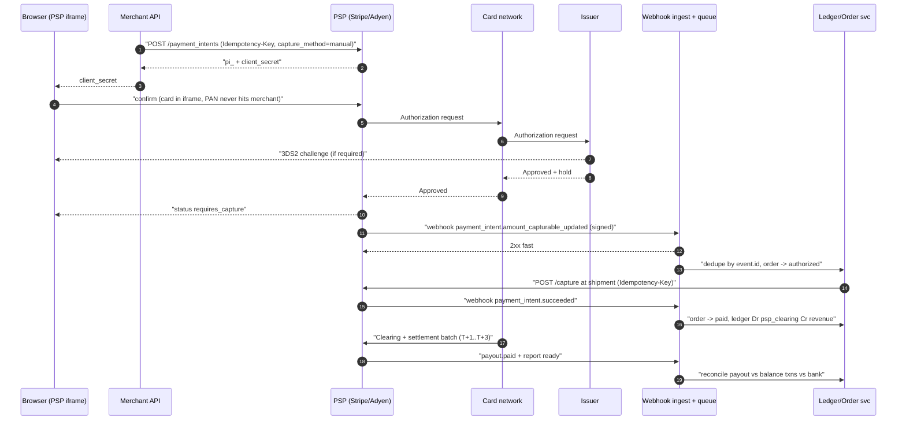
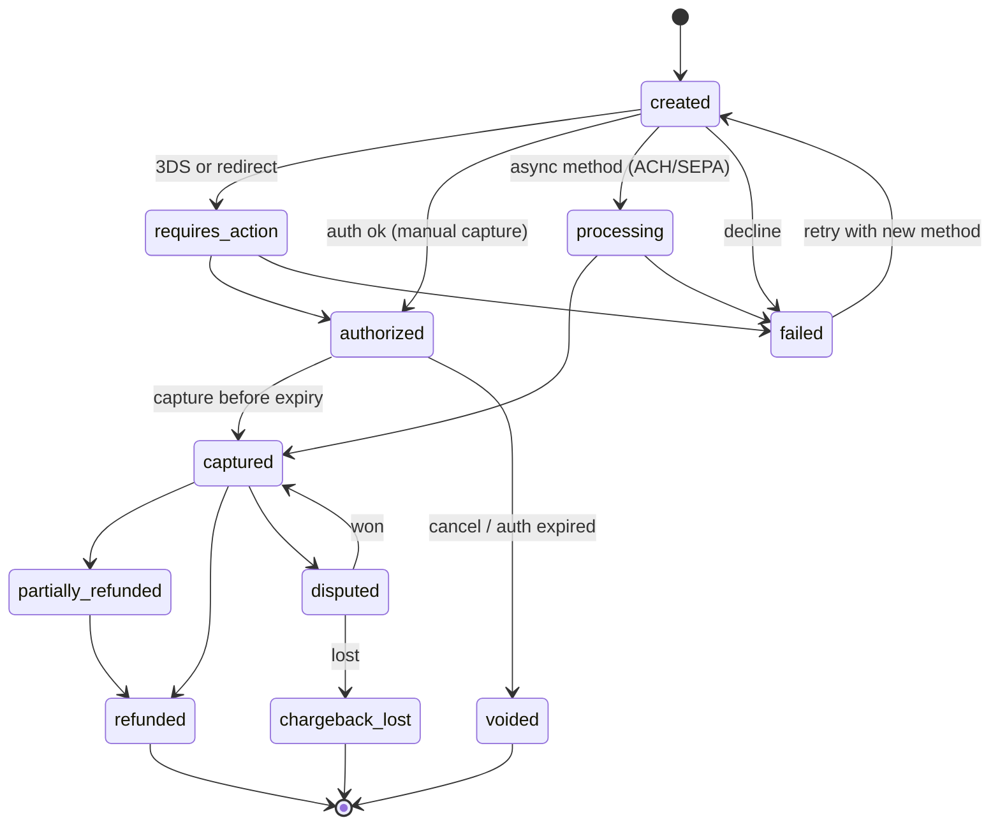
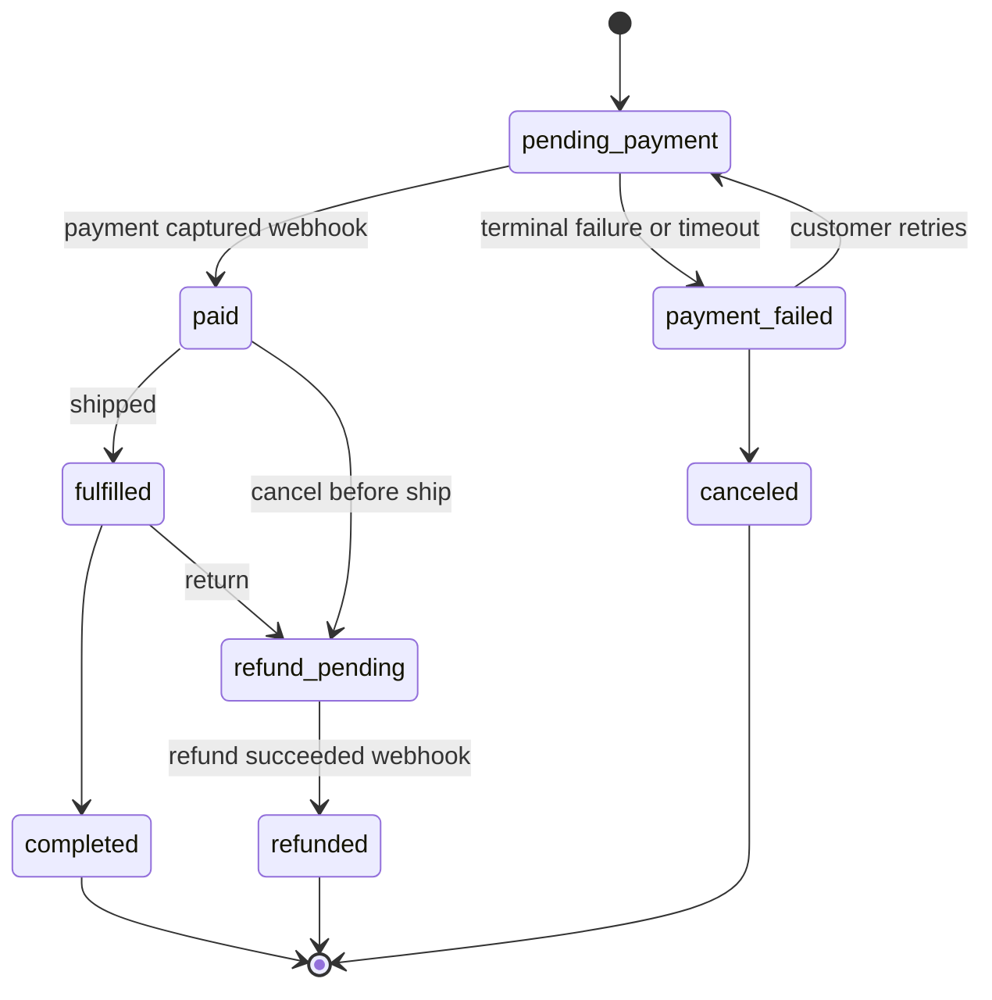
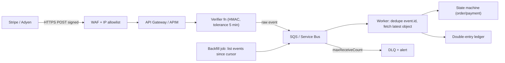

# Q3 Payment processing integration
> Last verified: 2026-10 · Audience: senior/staff DevOps, SRE, AI eng, NetEng, DevSecOps, architects

## TL;DR
- **Roles:** cardholder → **issuer** (cardholder's bank) ↔ **card network** (Visa/Mastercard; Amex/Discover act as both network and issuer) ↔ **acquirer** (merchant's bank) ← **processor/gateway/PSP** ← **merchant**. Stripe/Adyen/Checkout.com sell all of this as one product. Stripe Connect and Adyen for Platforms are **PayFac-style** products for marketplaces.
- **Card lifecycle:** **authorize** (seconds) → **capture** (Stripe: within ~7 days for online card-not-present, 2 days card-present for MC/Amex/Discover; Visa MIT and card-present ≈ 5 days) → **clearing and settlement** (batch, T+1 to T+2) → **payout**. After that come **refund** (new money movement), **void/cancel** (before capture, releases the hold) and **dispute/chargeback** (typically up to 120 days; you get 7–21 days to respond; the issuer decides in 60–75 days).
- **Scope PCI with architecture:** a hosted redirect or a PSP iframe means PAN never reaches your servers, so you file **SAQ A**. If your page script can influence the payment form, it is **SAQ A-EP**. If you touch PAN, it is **SAQ D**. Since 31 Mar 2025, SAQ A dropped 6.4.3/11.6.1 but added an eligibility criterion: you must confirm your site "is not susceptible to attacks from scripts".
- **Correctness = idempotency + webhooks + state machine.** Send an `Idempotency-Key` on every mutating POST (Stripe stores it ≥24 h and accepts up to 255 chars). Treat **webhooks as the source of truth** for async outcomes. They are at-least-once and unordered, so verify the HMAC signature, dedupe by event ID, enqueue, and return 2xx fast.
- **Money correctness:** use integers in **minor units**, an **append-only double-entry ledger**, and a **daily three-way reconciliation** (internal ledger ↔ PSP balance transactions/payout report ↔ bank statement).
- **SCA/3DS2 (EEA/UK):** authenticate customer-initiated transactions (CIT). Use exemptions: low value, TRA, MIT, recurring. A successful 3DS authentication **shifts fraud-chargeback liability to the issuer**. An exemption does not.
- **Resilience:** use network tokens and the account updater for card-on-file, Smart Retries/dunning for subscriptions, and multi-PSP routing behind your own **token vault**. Without that vault you are locked into one PSP.

---

## Q3.1 Payments ecosystem and roles
- **How it works:**
  - **Four-party model** (Visa, Mastercard): cardholder, **issuer**, merchant, **acquirer**, with the network in between running authorization messaging (ISO 8583) and clearing/settlement. **Three-party model** (Amex, Discover): the network is also the issuer and often the acquirer.
  - **Payment gateway:** the technical front door. It takes the payment request from a checkout and routes it to a processor. Historically it was separate (Authorize.net).
  - **Processor:** connects to the networks for the acquirer, moves auth/clearing messages, and produces settlement files. Examples: Fiserv, Worldpay, TSYS.
  - **PSP (payment service provider):** bundles gateway, processing, acquiring, risk tools, payment-method aggregation and payouts behind one contract and API. Examples: **Stripe, Adyen, Checkout.com, PayPal/Braintree, Square, Worldpay** (Worldpay spun out of FIS in 2024 and was acquired by Global Payments, a deal announced April 2025; (unverified) whether it has closed).
  - **Payment facilitator (PayFac):** holds a master merchant account and onboards **sub-merchants** under it, taking on KYC/KYB and risk. Stripe and Square are PayFacs. Platforms use **Stripe Connect** or **Adyen for Platforms** instead of becoming a registered PayFac themselves.
  - **Merchant of record (MoR):** the entity on the cardholder statement that bears tax, refund and chargeback liability. It can be the platform or the connected account (see Q3.4 Connect charge types).
- **Trade-offs / when to use:**
  - **All-in-one PSP** (Stripe/Adyen): fastest time-to-market and one API. Downside: blended pricing and lock-in on stored cards.
  - **Adyen:** single global acquiring platform with local acquiring in many markets, which helps auth rates. Contracts are enterprise-oriented.
  - **PayPal/Braintree:** PayPal wallet and Venmo reach.
  - **Square:** omnichannel point of sale.
  - **Direct acquirer + gateway:** best interchange++ pricing, but you own PCI scope, routing and reconciliation complexity.
- **Interview angles:**
  - "Who actually decides to approve a card?" → the **issuer**. The PSP/acquirer only forwards the request. Your levers are data quality (AVS/CVC, 3DS data, network tokens), **local acquiring**, correct MIT/CIT flags and retry timing.
  - "Gateway vs processor vs PSP?" → gateway = API/routing; processor = network connectivity; acquirer = bank that holds the merchant relationship and funds; PSP = all of these bundled.

## Q3.2 Card payment lifecycle: auth, capture, clearing, settlement, refunds, voids, chargebacks
- **How it works:**
  - **Authorization:** the issuer checks funds and fraud, then places a **hold**. It returns an approve/decline code within seconds. Money has not moved yet.
  - **Capture:** the merchant confirms the final amount. It can be immediate (`capture_method=automatic`) or **delayed** (`manual`). Stripe authorization validity windows (verified):

    | | Visa | Mastercard | Amex | Discover |
    |---|---|---|---|---|
    | Card-not-present, customer-initiated (CIT) | 7 d | 7 d | 7 d | 7 d |
    | Card-not-present, merchant-initiated (MIT) | ~5 d (4 d 18 h) | 7 d | 7 d | 7 d |
    | Card-present | ~5 d (4 d 18 h) | 2 d | 2 d | 2 d |

    - **Extended authorization** (up to ~30 days) exists for eligible merchant categories such as hotels and car rental.
    - Japan JPY: 30-day holds.
    - An expired authorization moves the PaymentIntent to `canceled`.
    - **Partial capture** releases the remainder automatically. Only one capture is allowed unless **multicapture** is enabled. **Overcapture** and **incremental auth** are opt-in for specific merchant categories.
  - **Clearing:** a batch of captured transactions is sent through the network to issuers with the final amounts.
  - **Settlement:** interchange flows issuer → network → acquirer, minus fees. The acquirer or PSP credits the merchant balance, typically **T+1 to T+3**. Funds become `available_on` a later date, then a **payout** goes to the bank (Stripe US default is 2 business days, (unverified) per account and region).
  - **Void/cancel:** possible only before capture. It releases the hold and creates no fee-bearing transaction. Stripe: cancel the PaymentIntent. ACH/SEPA in `processing` can sometimes be canceled within a short window.
  - **Refund:** happens after capture. It is a new credit to the card, takes 5–10 business days to appear, and the original processing fee is usually not returned. A refund before settlement may be processed as a **reversal**. Stripe notes that a reversal within ~2 h of capture can prevent the fraud report.
  - **Dispute/chargeback** (Stripe, verified):
    - Cardholders typically have **120 days** from the payment to dispute. For future-dated services, the window starts at the service date.
    - The disputed amount plus a **dispute fee** is debited immediately.
    - You have **7–21 days** to submit evidence, depending on the network.
    - The issuer decides in **60–75 days**. The whole cycle runs 2–3 months.
    - **Inquiries/retrievals** are mainly Amex and Discover. An unanswered inquiry can escalate to an unwinnable chargeback.
    - **Early fraud warnings** (Visa TC40, Mastercard SAFE): roughly 40% become fraud disputes.
    - You **cannot refund a charge while its dispute is open**.
    - Local payment method disputes (Klarna, PayPal) allow up to ~180 days.
- **Trade-offs / when to use:**
  - **Auth-then-capture** suits shipping goods, hotels, ride-hail and marketplaces where the final amount is unknown. **Capture at shipment** reduces refunds and chargebacks.
  - The risk of delayed capture is that the auth expires, so build a **capture-before-expiry job**. Stripe's `automatic_delayed` capture is in private preview.
  - **Immediate capture** suits digital goods and simpler accounting.
- **Interview angles:**
  - "Refund vs void?" → void before capture (no money moved, hold released). Refund after capture (money moves back, fees usually lost).
  - "Why does the customer see two charges?" → a pending authorization hold plus the posted capture, or a re-authorization. Issuer UIs often show both.
  - Pitfall: treating a successful **authorization as payment**. Fulfill on `succeeded`/captured. For async methods, wait for the webhook.

## Q3.3 Integration patterns and PCI scoping
- **How it works:**

  | Pattern | Example | Who renders the PAN field | Typical SAQ |
  |---|---|---|---|
  | **Hosted redirect** | Stripe Checkout (hosted), Adyen Hosted Checkout, PayPal | PSP domain | **A** |
  | **Embedded iframe fields** | Stripe Elements/Payment Element, Adyen Drop-in/Components, Braintree Hosted Fields | PSP iframe inside your page | **A** (all payment fields in PSP iframes) |
  | **Direct post / JS tokenization on your DOM** | Your page posts card data to the PSP from your own JS | Your page | **A-EP** |
  | **Server-to-server PAN** | Raw card API, card vault, migrations | Your servers | **D** (plus more than 300 controls) |

  - **Client-side tokenization:** the browser or mobile SDK sends the PAN directly to the PSP and gets back a token or PaymentMethod ID (`pm_...`). Your backend only sees the token, last4, brand and expiry. Stripe states these fields are out of PCI scope and can be stored.
  - Stripe is a **PCI Level 1 Service Provider**. The merchant still attests annually (SAQ or ROC).
  - **SAQ A change, effective 31 Mar 2025** (PCI SSC, verified):
    - **6.4.3, 11.6.1 and 12.3.1 were removed** from SAQ A.
    - In their place, the merchant must confirm its site is **not susceptible to attacks from scripts** that could affect the e-commerce system.
    - In practice: CSP, Subresource Integrity, script inventory or a PSP-provided attestation still make sense for iframe pages.
  - **SAQ A-EP and SAQ D merchants** must meet **6.4.3** (inventory, authorize and integrity-check every script on payment pages) and **11.6.1** (detect unauthorized changes to payment-page HTTP headers and content at least weekly or per targeted risk analysis). Both are mandatory since **31 Mar 2025**.
- **Trade-offs / when to use:**
  - **Hosted checkout:** least PCI work, built-in SCA/3DS, wallets and localization. Less UI control, and the redirect can cost conversion.
  - **Embedded elements:** branded UX and still SAQ A-eligible. Needs CSP allowances. Stripe's documented directives include `frame-src https://js.stripe.com https://*.js.stripe.com https://hooks.stripe.com` and `script-src https://js.stripe.com`.
  - **Direct API with PAN:** only for PSP-agnostic vaulting, card issuing or migrations. Isolate it in a dedicated CDE account or subscription (see [L3.6 PCI DSS v4.0.1](../L-data-privacy-ai-security/L3-residency-compliance.md#l36-pci-dss-v401)).
- **Interview angles:**
  - "How do you keep PCI scope minimal?" → PSP iframe or hosted page, tokens only, never log request bodies from payment routes, keep the webhook endpoint free of card data (Stripe never puts PAN in webhooks), and keep CSP/SRI on checkout pages.
  - "Magecart?" → the attack class 6.4.3/11.6.1 target. Answer with script inventory, SRI, CSP with `report-to`, and change-detection monitoring.
  - Pitfall: a "SAQ A" site whose parent page loads 40 third-party tags. The script-susceptibility criterion now makes you think about this.

## Q3.4 Stripe object model: PaymentIntents, SetupIntents, Customers, PaymentMethods, Connect, Billing
- **How it works:**
  - **PaymentIntent (PI):** tracks one payment attempt lifecycle.
    - Statuses: `requires_payment_method` → `requires_confirmation` → `requires_action` (3DS or redirect) → `processing` (async methods) or `requires_capture` (manual capture) → `succeeded` or `canceled`.
    - A decline returns the PI to `requires_payment_method` so the customer can retry on the same PI.
    - Create the PI **as soon as the amount is known**. Retries reuse it.
  - **SetupIntent:** saves and authenticates a payment method for **future off-session** use without charging. It creates a mandate for later MITs.
  - **Checkout Sessions:** Stripe now recommends Checkout Sessions (hosted, or `ui_mode: elements` with the Payment Element) over raw PaymentIntents for most integrations. Some features, such as Adaptive Pricing, exist only there.
  - **Customer + PaymentMethod (`pm_`):** a reusable instrument attached to a Customer. Use `setup_future_usage=off_session` to save it during a payment.
  - **Connect** charge types (verified):

    | Type | Charge lives on | Refunds/chargebacks debit | Use case |
    |---|---|---|---|
    | **Direct** | Connected account | Connected account | SaaS platforms (Shopify-style); customer may not know the platform |
    | **Destination** | Platform, auto-transfer to one account | Platform (recover by transfer reversal) | Rideshare, service marketplaces |
    | **Separate charges and transfers** | Platform, transfers decoupled | Platform | Multi-seller cart, unknown payee at charge time |

    - `on_behalf_of` makes the connected account the **business of record**: settlement country, fees and statement descriptor.
    - `application_fee_amount` takes the platform's cut.
  - **Billing:** Products/Prices → Subscriptions → Invoices → PaymentIntents, plus Smart Retries, dunning and test clocks (Q3.16).
- **Trade-offs / when to use:**
  - **Direct charges** push risk to sellers. **Destination charges and separate charges and transfers** keep the platform liable for disputes and negative balances, but give it control.
  - Legacy **Charges API / Sources** are not SCA-ready and cause high EEA decline rates. Migrate to PaymentIntents.
- **Interview angles:**
  - "Design a marketplace payout flow" → separate charges and transfers with `transfer_group`, hold funds until delivery, transfer reversals on refund, Connect webhooks scoped to `@accounts` vs `@self`.
  - Pitfall: polling PI status from the client to fulfill. **Fulfill from the webhook** because the client can close the tab mid-3DS.

## Q3.5 Adyen, PayPal/Braintree and other PSP models
- **How it works:**
  - **Adyen hierarchy:** **company account** → **merchant accounts** (per region, business line or currency; each has its own settlement and config) → **stores**. API credentials and webhooks are configured per company or merchant account.
  - **Adyen Sessions flow:** your server calls `/sessions` once. The **Drop-in or Components** client handles payment methods, 3DS and redirects. **Advanced flow** uses `/paymentMethods`, `/payments` and `/payments/details` for full control.
  - Every Adyen payment has a **`pspReference`**. **Modifications** (capture, cancel, refund) are **asynchronous**: the API returns `received`, and the actual outcome arrives by webhook (`CAPTURE`, `REFUND`, `CANCELLATION`).
  - **Adyen webhooks** (verified): accept with **2xx (e.g. 202) within 10 s**, otherwise the event is marked failing and queued for retry. Verify the **HMAC signature** (plus optional basic auth). Duplicates share `eventCode` + `pspReference`. Use the latest event, order by timestamp, and use `sequenceNumber` where present. Event codes include `AUTHORISATION`, `CAPTURE`, `REFUND`, `CHARGEBACK` and `REPORT_AVAILABLE`.
  - Adyen also supports an **`Idempotency-Key`** header ((unverified): max 64 chars, retained at least 7 days).
  - **PayPal Orders v2:** create order → buyer approves on PayPal → **capture** (or authorize then capture; PayPal holds 10 days, and Stripe-for-PayPal auto-extends to 20). Idempotency uses the `PayPal-Request-Id` header. Webhooks are verified via the verify-webhook-signature API or certificate check (unverified detail).
  - **Braintree:** client token → client SDK returns a **payment method nonce** → server `transaction.sale` (submit-for-settlement). Settlement batches run daily (unverified).
- **Trade-offs / when to use:**
  - Adyen's merchant-account split maps cleanly onto **entity, region and currency segregation** for finance and residency.
  - Asynchronous modifications force you to build webhook-driven state from day one.
  - PayPal adds wallet conversion but brings a separate dispute system and different settlement timing.
- **Interview angles:**
  - "Adyen capture returned 200; is the money captured?" → **No**. `[capture-received]` only means the request was accepted. Wait for the `CAPTURE` webhook with `success=true`.

## Q3.6 Strong Customer Authentication, PSD2 and 3-D Secure 2
- **How it works:**
  - **SCA** under PSD2 RTS has been in force since **14 Sep 2019**, with enforcement phased by country through 2020–21. It applies when the business (or connected account) is in the **EEA/UK**, the customer is in the EEA, and the payment is by card. It requires 2 of 3 factors: knowledge, possession, inherence.
  - **3DS2** (EMVCo): rich device and transaction data, 100+ elements, goes to the issuer ACS. Outcomes:
    - **Frictionless:** risk-based, no challenge.
    - **Challenge:** OTP or biometric in the banking app.
    - Versions in use are 2.2 and 2.3.x. Networks sunset 2.1 around 2024 (unverified exact dates).
  - **Exemptions** (PSD2 RTS; requested by the acquirer, but the issuer can override; not re-verified this pass):
    - **Low value:** < €30, until a cumulative €100 or 5 consecutive transactions.
    - **TRA** (transaction risk analysis): up to €100 / €250 / €500 depending on the acquirer's fraud rate (0.13% / 0.06% / 0.01%).
    - **Trusted beneficiary** (allow-list), **secure corporate payments**.
    - **Recurring with a fixed amount** (after the first authenticated transaction).
  - **Out of scope** (not exemptions):
    - **MITs** (off-session, made under a mandate set up with SCA).
    - **MOTO**.
    - **One-leg-out** (issuer or acquirer outside the EEA): best-effort.
    - Anonymous prepaid.
  - **Liability shift:** a successfully authenticated 3DS payment moves fraud-dispute liability to the **issuer**. If an exemption was applied, there is **no liability shift** (Stripe docs, verified).
  - **Grandfathering:** cards saved before 31 Dec 2020 (EU) or 14 Sep 2021 (UK) can be charged off-session under previous agreements (Stripe, verified).
- **Trade-offs / when to use:**
  - Requesting exemptions improves conversion, but you keep fraud liability. Always forcing 3DS shifts liability but adds friction and abandonment.
  - Use **Radar rules / dynamic 3DS**: request 3DS only for high-risk payments, or always for high-value ones.
- **Interview angles:**
  - "Subscription renewals in the EU?" → authenticate once with SetupIntent or the first PI using `setup_future_usage=off_session`. Charge renewals as MIT (`off_session=true`). Handle `authentication_required` declines by bringing the customer back on-session (email link).
  - "Is 3DS mandatory in the US?" → no regulation requires it. Use it selectively for liability shift on risky transactions.

## Q3.7 Idempotency keys and safe retries
- **How it works (Stripe v1, verified):**
  - Send the **`Idempotency-Key`** header on **POST**. It has no effect on GET or DELETE, which are idempotent by definition. Keys are up to **255 chars**. Use V4 UUIDs, and never PII.
  - Stripe saves the **status code and body of the first request once endpoint execution begins**. **Retries return the saved response, including 500s.**
  - Keys can be pruned after **≥24 h**. Reusing a key after pruning creates a new request.
  - If the parameters differ from the original request under the same key, Stripe returns an **error**, which prevents misuse.
  - Nothing is saved if validation fails or the request **conflicts with a concurrent request using the same key**. Those can be retried.
  - **API v2:** retries drive failed or partial work to completion instead of replaying a saved error.
- **Design pattern:**
  - Derive the key from **your business intent**, e.g. `order_123:payment:attempt_1` or a UUID persisted with the order row **before** calling the PSP. That way a crash and replay reuses the same key.
  - Use a new key only for a deliberate new attempt, e.g. after a decline with a new card.
  - Retry with **exponential backoff and jitter** on network errors, timeouts, 429, 409 lock conflicts and 5xx. Do not retry 4xx validation or decline errors.
  - **Outbox pattern:** write `payment_attempt(status=pending, idem_key)` in the same DB transaction as the order. A worker calls the PSP. A webhook or poll reconciles.
- **Trade-offs / when to use:**
  - The PSP's idempotency window (24 h) is shorter than your retry horizon for stuck jobs. For long-tail recovery, check the PSP for an existing object first (`metadata.order_id`, search API) before creating a new one.
- **Interview angles:**
  - "Client timed out on a charge; retry?" → yes, **with the same key**: either you get the same result or no second charge is made.
  - "Server-side idempotency for *your* API?" → a unique constraint on `(merchant_id, idem_key)`. Store the request hash and response, return the stored response on replay, and return 409 while the first request is in flight. See [B7 double booking](../B-database-engineering/B7-concurrency-control.md#b74-solving-the-double-booking-problem) for the locking and unique-constraint side.

## Q3.8 Webhooks: verification, delivery semantics, ordering, replay
- **How it works (Stripe, verified):**
  - **Signature:** the `Stripe-Signature` header has the form `t=<ts>,v1=<hmac>`. The HMAC-SHA256 is computed over `"<t>.<raw_body>"` with the endpoint's `whsec_` secret.
    - **Ignore non-`v1` schemes** (`v0` is a fake signature on test events) to avoid downgrade attacks.
    - Compare in **constant time**.
    - Verification needs the **raw body**, so frameworks must not re-serialize JSON.
  - **Replay protection:** the library default **tolerance is 5 min**. Never set it to 0 (that disables the check). Keep clocks NTP-synced. Every retry gets a new timestamp and signature.
  - **Secret rotation:** "Roll secret" can keep the old secret valid **up to 24 h**, during which events carry **one signature per active secret**.
  - **Delivery:**
    - **At-least-once.** Live mode retries with exponential backoff **for up to 3 days**. Sandbox retries **3 times over a few hours**.
    - Redirects (3xx) count as failures. **TLS 1.2+** is required.
    - Manual resend: Dashboard within 15 days, CLI (`stripe events resend`) within 30 days.
  - **No ordering guarantee.** `created` has second resolution, so don't use it for ordering or dedupe. **Dedupe on `event.id`**, and sometimes on `data.object.id` + `type`, because two distinct events can describe the same change.
  - **Thin vs snapshot events:**
    - **Thin** (recommended for new integrations) carries only an ID and related object. Fetch the latest state.
    - **Snapshot** carries the object at event time, pinned to the account API version at creation.
  - Up to **16 event destinations**. Native destinations exist for **Amazon EventBridge** and **Azure Event Grid**.
  - Also allowlist **Stripe IPs** and exempt the route from CSRF.
- **Handler pattern:** verify → persist raw event (unique on `event_id`) → enqueue → **return 2xx** → async worker. The worker re-fetches the object (thin or "fetch latest"), applies an **idempotent state transition** (only forward moves, ignore stale ones) and writes ledger entries.
- **Trade-offs / when to use:**
  - **Push (webhooks) plus a periodic poll/backfill job** (list events or objects since a cursor) covers missed deliveries and disabled endpoints.
  - **EventBridge or Event Grid** destinations remove public-endpoint exposure and signature handling. The trade-off is cloud lock-in and a different delivery SLA.
- **Interview angles:**
  - "Webhook arrives before your API call returns" → this is normal. Make both paths converge on the same idempotent `apply(event)` keyed by PI ID.
  - "Endpoint down for 4 days?" → retries stopped after 3 days, so backfill from the Events API (Stripe retains events for 30 days, (unverified) for the list API) and reconcile.
  - Pitfall: doing slow work (email, ERP sync) before returning 200. That causes timeouts, so the retry storm duplicates side effects.

## Q3.9 State machines for orders and payments
- **How it works:**
  - Model the **Order** and the **PaymentAttempt** (one order has many attempts) as **separate state machines**. Store every PSP ID: `pi_`, `ch_`, `re_`, `dp_` (dispute), `po_` (payout).
  - Payment states mirror the PSP: `created → requires_action → authorized(requires_capture) → captured(succeeded) → partially_refunded/refunded`. Side branches: `failed`, `canceled/voided`, `disputed → won/lost`.
  - Order states: `pending_payment → paid → fulfilled → completed`. Side branches: `payment_failed`, `canceled`, `refund_pending → refunded`.
  - Guard transitions in the DB: `UPDATE ... SET status='captured' WHERE id=? AND status IN ('authorized')`, checking that the affected row count equals 1. Alternatively use an optimistic version column. Log every transition (event sourcing or an audit table).
  - Cross-service flows (inventory reserve → payment auth → shipping → capture) use a **saga with compensations**: release inventory, void the auth, refund. See [C2.35 Saga](../C-large-scale-architecture/C2-scalability.md#c235-compensating-transactions-saga-pattern).
- **Trade-offs / when to use:**
  - **Strict monotonic transitions** make out-of-order webhooks harmless. Example: `payment_failed` arriving after `succeeded` is ignored because the state already moved past it.
  - A **timeout sweeper** (auth near expiry, PI stuck in `requires_action` > N hours) drives terminal states.
- **Interview angles:** "How do you avoid shipping unpaid orders and charging for unshipped ones?" → fulfill only on `captured`/`succeeded`. Run a capture-before-expiry job. Use sagas to void or refund when fulfillment fails. Reconcile daily.

## Q3.10 Reconciliation: payouts, balance transactions, settlement reports
- **How it works:**
  - Every money movement on Stripe creates a **balance transaction** (`txn_`) with gross, fee, net, `available_on` and a **`reporting_category`** (charge, refund, dispute, fee, transfer, payout, etc.).
  - **Payout reconciliation report** (verified): only for **automatic payouts**. It groups the balance transactions included in each payout, with itemized CSV columns such as `automatic_payout_id`, `balance_transaction_id`, `payment_intent_id`, `payment_metadata[key]` and `trace_id`. Report data webhooks fire twice daily, for the 00:00 and 12:00 UTC cuts.
  - **Instant or manual payouts** can't be attributed to specific transactions. Use the **Balance report** instead.
  - **Adyen** equivalents: **Settlement details report** and **Payment accounting report**. A `REPORT_AVAILABLE` webhook signals that a report is ready to download.
  - **Three-way match:**
    1. Your ledger (expected) ↔ PSP transactions, matched on `payment_intent_id` / `metadata.order_id`.
    2. PSP payout ↔ bank statement line, matched on amount, date and `trace_id`.
    3. Fees and FX are booked separately.
- **Trade-offs / when to use:**
  - Put your **order ID in PSP metadata** at creation. It is the join key in every report.
  - Reconcile in **settlement currency and net of fees**. Timing differences (`available_on`, weekends, bank holidays) mean "unmatched" is often just "in transit". Age the breaks and alert when one is older than N days.
- **Interview angles:**
  - "Design reconciliation" → ingest reports into a warehouse (Reporting API → S3/ADLS → dbt or Spark), match rules (exact ID → amount and date tolerance → manual queue), a breaks dashboard, and journal entries for fees and FX. See [M7 Data warehouses](../M-data-platforms/M7-data-warehouses.md) and [M6 Orchestration](../M-data-platforms/M6-orchestration-etl.md).

## Q3.11 Double-entry ledger design
- **How it works:**
  - **Accounts** (e.g. `customer_receivable`, `psp_clearing:stripe:usd`, `merchant_payable:acct_x`, `revenue`, `fees_expense`, `fx_gain_loss`, `bank:usd`).
  - **Journal entries** contain ≥2 **postings** whose sum is **0 per currency**: debits = credits.
  - **Append-only and immutable.** Corrections are **reversing entries**, never UPDATEs.
  - Example flows:
    - Capture of $100 with a $3.20 fee: `Dr psp_clearing 96.80, Dr fees_expense 3.20, Cr revenue 100.00`.
    - Payout: `Dr bank 96.80, Cr psp_clearing 96.80`.
    - Refund: reverse revenue against psp_clearing.
    - Dispute: move the amount to `disputes_receivable` and the fee to expense.
  - **Balances** are derived (sum of postings) or kept as materialized running balances updated in the **same transaction**, with a version or lock per account to prevent overdraft races.
  - Amounts are **integers in minor units** plus a currency code. Every posting carries the source `event_id` / `idem_key` under a **unique constraint**, which makes it **idempotent**.
- **Trade-offs / when to use:**
  - **RDBMS (Postgres/Aurora/Azure SQL)** gives serializable or row-locked consistency, which is simplest for most companies.
  - Purpose-built ledgers (e.g. TigerBeetle) suit very high throughput.
  - **Amazon QLDB** reached end of support in July 2025 (unverified exact date), so don't propose it. Azure SQL **ledger tables** give tamper-evidence (a digest) without changing the data model.
  - Hot accounts (the platform clearing account) contend on locks. Mitigate with sharded sub-accounts, batched postings, or balances computed asynchronously, with checks only where overdraft matters.
- **Interview angles:**
  - "Why double-entry?" → every movement is balanced and auditable, errors show up as non-zero sums, and finance can produce a trial balance.
  - "How do you prove the ledger is right?" → invariants (Σ postings per entry = 0, Σ all accounts = 0), daily reconciliation to the PSP and bank, and hash-chained or digest tamper-evidence.

## Q3.12 Multi-currency, FX and minor units
- **How it works (Stripe, verified):**
  - API `amount` is in **minor units**: `1099` = 10.99 USD.
  - **Zero-decimal currencies** (JPY, KRW, ...) use the amount as-is: `500` = ¥500.
  - **Special cases:** ISK and UGX must be sent two-decimal with `00`. HUF and TWD payouts must be divisible by 100.
  - **Three-decimal currencies** (BHD, JOD, KWD, OMR, TND): Stripe requires the last digit to be 0 (unverified).
  - **Presentment** currency (what the customer is charged) vs **settlement** currency (your bank). Converting between them costs FX fees. The issuer may also add a foreign-transaction fee.
  - **Minimums:** 0.50 USD/EUR, 0.30 GBP, 50 JPY, and so on.
  - **Maximums:** up to 12 digits for most cards, 9 for Amex, 8 digits for most non-card methods.
  - Disputes on FX payments can be for a **different amount** than the original, because the rate moves.
- **Trade-offs / when to use:**
  - **Local presentment** raises conversion and auth rates. **Multi-currency settlement** avoids double conversion. Book **FX gain/loss** explicitly in the ledger.
  - Store `(amount_minor BIGINT, currency CHAR(3))`. **Never use floats.** Round with banker's rounding or per-PSP rules at a single, documented boundary.
- **Interview angles:** "Where do bugs come from?" → assuming 2 decimals (JPY ×100 overcharge), float math, converting at display time vs charge time, and refunds after a rate change.

## Q3.13 Alternative payment methods (APMs)
- **How it works:**
  - **Wallets (Apple Pay, Google Pay):** device-bound **network tokens** (DPAN) plus a cryptogram. Mostly SCA-satisfying (biometric), with high auth rates. Apple Pay on the web requires **domain verification**.
  - **Bank debits:**
    - **ACH** (US): batch. Returns arrive in about 2 banking days (R01 NSF). Unauthorized returns (R10) can come up to 60 days later.
    - **SEPA Direct Debit** (EU): the customer can claim a refund with no questions for 8 weeks, and for 13 months if unauthorized.
    - Status sits in `processing` for days. There is **no instant guarantee**, so fulfill on the `succeeded` webhook.
  - **Instant credit transfers:**
    - **RTP** (The Clearing House) and **FedNow** (Fed, launched July 2023): 24/7, irrevocable, push-only plus request-for-pay. Per-transaction limits were raised in 2025 (unverified).
    - **Pix** (Brazil, central bank): instant QR or key-based. Pix Automático handles recurring payments.
    - **UPI** (India), **iDEAL / Wero** (EU, (unverified) migration timing).
  - **BNPL (Klarna, Afterpay/Clearpay, Affirm):** the provider takes the credit risk and pays the merchant upfront. Capture windows differ: Klarna 28 days, Afterpay 13 days, Affirm 30 days (Stripe, verified).
- **Trade-offs / when to use:**
  - Push payments (Pix, RTP) mean **no chargebacks**, but they are irrevocable. Refunds are a new outbound transfer, and APP-fraud reimbursement rules exist (e.g. in the UK).
  - Debits are cheap but carry **delayed failure and return risk**, so hold fulfillment or accept the risk.
  - APMs vary by country. Use **dynamic payment methods** (Payment Element or Adyen Drop-in decide which to show).
- **Interview angles:** "Your state machine assumed cards" → add `processing` and long-tail failure after success-looking states (ACH return after fulfillment). Separate "payment initiated" from "funds final".

## Q3.14 Network tokens and card account updater
- **How it works:**
  - **Network tokens** come from Visa Token Service and Mastercard MDES. A **merchant-scoped token** replaces the PAN for card-on-file, and each transaction gets a cryptogram. The networks update the token automatically when the card is reissued, lost or expired.
  - Benefits: higher authorization rates, lower fraud, and sometimes lower interchange (unverified, varies by network and region).
  - **Account updater** (Visa Account Updater, Mastercard Automatic Billing Updater): batch or real-time updates of PAN and expiry for stored cards. Stripe applies these automatically to saved cards.
  - **PSP token vs network token:** the PSP token (`pm_`) is PSP-scoped and not portable. The network token is network-scoped and travels with the card relationship.
- **Trade-offs / when to use:**
  - Essential for **subscriptions and card-on-file**. Most PSPs provision them transparently.
  - **Portability:** to switch PSPs you need a **PAN export (PCI-to-PCI migration)** or your own vault/tokenization service (Basis Theory, VGS, Spreedly, (unverified) current product names).
- **Interview angles:** "Involuntary churn from expired cards?" → network tokens plus account updater plus Smart Retries plus a dunning email with a hosted card-update link.

## Q3.15 Fraud: Radar, 3DS, velocity and rules
- **How it works:**
  - **Stripe Radar:** an ML risk score (0–99) per payment trained across the network. Default block and review thresholds.
  - **Radar for Fraud Teams:** custom **rules** such as `Block if :risk_score: > 75`, `Request 3D Secure if :amount_in_usd: > 500`, velocity attributes (`:total_charges_per_card_number_hourly:`) (unverified exact attribute names), allow/block lists, and a manual review queue.
  - **Signals:** CVC/AVS checks, IP/geo vs BIN country, device fingerprint, email/phone age, **velocity** (cards per device, attempts per IP), and card-testing patterns (many small auths).
  - **Card-testing defence:** CAPTCHA or bot detection, rate limits per IP/session/customer, require login, and decline small $0–1 auth bursts. Networks may restrict uncaptured $1 auths (Stripe note).
  - **Dispute side:**
    - Respond to **EFWs**. Stripe's guidance is to refund EFWs when the charge is ≤ roughly the dispute fee.
    - Evidence packs for disputes.
    - **Visa Compelling Evidence 3.0** (2023): prior undisputed transactions with matching device or IP.
    - Keep the dispute rate below network monitoring thresholds (Visa VAMP / Mastercard ECM, roughly 0.9–1% ranges, (unverified) current thresholds).
- **Trade-offs / when to use:**
  - False positives cost revenue. Tune by **expected loss**: P(fraud) × amount + dispute fee vs margin.
  - **3DS on high-risk** payments shifts liability. A blanket 3DS policy hurts conversion.
- **Interview angles:**
  - "Card-testing attack at 3 am" → detect with an auth-decline-rate spike on low amounts. Mitigate with WAF and rate limits, enable CAPTCHA, block BIN ranges and IPs, tighten Radar rules, and alert in the SRE paging policy. See [J2 Monitoring](../J-sre/J2-monitoring-and-alerting.md).

## Q3.16 Subscriptions and dunning
- **How it works (Stripe Billing, verified):**
  - **Smart Retries** pick retry times with ML. The recommended default is **8 tries within 2 weeks**. Configurable windows: 1 week, 2 weeks, 3 weeks, 1 month, 2 months. A custom schedule allows up to 3 retries at chosen day offsets.
  - **Hard declines** (`lost_card`, `stolen_card`, `incorrect_number`, `authentication_required`, `transaction_not_allowed`, ...) are not retried until a new payment method is attached.
  - **After retries are exhausted:** cancel, mark `unpaid` (invoices stay as drafts), leave `past_due`, or `pause`.
  - **Events:** `invoice.payment_failed` (with `attempt_count`), `invoice.paid`, `customer.subscription.updated`.
  - **Bank-debit retries** are opt-in, e.g. ACH 2 retries within 40 days, SEPA 2 within 30.
  - Subscription statuses include `trialing`, `active`, `incomplete` (first payment needs action; becomes `incomplete_expired` after ~23 h, (unverified)), `past_due`, `unpaid`, `canceled` and `paused`.
  - **Test clocks** simulate time advancing across billing cycles.
- **Trade-offs / when to use:**
  - Gate entitlements on `active`/`trialing`. Decide on a grace period for `past_due`.
  - **Proration** and mid-cycle upgrades create invoice items, so the ledger must handle credits.
  - India-issued cards carry RBI e-mandate rules and Stripe does not auto-retry them.
- **Interview angles:** "Design dunning" → retry policy, emails with a hosted update-card link, in-app banner, network tokens and updater, entitlement downgrade after the grace period, and metrics (recovery rate, involuntary churn).

## Q3.17 Multi-PSP routing and failover
- **How it works:**
  - Put a **payment orchestration layer** in front of 2+ PSPs or acquirers. It holds your own **vault** (PCI-scoped), or a third-party vault that forwards PAN to each PSP.
  - The router picks a PSP by **BIN/issuer country** (local acquiring), currency, method, cost, real-time **auth-rate and latency SLOs**, and health.
  - **Failover:**
    - **Retry soft declines** (issuer unavailable, `processing_error`) on a secondary PSP.
    - **Never retry hard declines** (stolen, do-not-honor policies). Excessive retries violate network rules (e.g. Visa/Mastercard reattempt limits, (unverified) exact counts).
    - Circuit breakers per PSP and region.
  - Idempotency becomes cross-PSP. Your **attempt record** (not the PSP key) is the dedupe unit. **Never have two PSPs holding auths for the same order simultaneously** without voiding one.
  - Webhooks from each PSP are normalized into **one canonical event schema**, then applied to the same state machine.
- **Trade-offs / when to use:**
  - Pays off at large volume or in multi-region setups (auth-rate uplift, negotiation leverage, outage resilience).
  - Costs: PCI scope for the vault, reconciliation per PSP, feature-parity gaps (3DS, APMs, disputes), and divergent dispute processes.
  - The lighter-weight option is a **hot standby PSP for new cards only**, plus a "pay with another method" UX.
- **Interview angles:** "Stripe is down; what happens to checkout?" → health check plus circuit breaker trips, the router sends **new** card payments to the secondary (tokenized through your vault or a vault provider), saved `pm_` tokens are not portable so they fall back to an "add card" UX or wallets, and everything is reconciled after recovery. Tie this to [C3 Reliability](../C-large-scale-architecture/C3-reliability.md) and [J1 SLOs](../J-sre/J1-slis-slos-error-budgets.md).

## Q3.18 Testing: test cards, sandboxes, CLI
- **How it works (Stripe, verified):**
  - **Test keys** start with `sk_test_` / `pk_test_`. **Sandboxes** are isolated test environments within an account.
  - Test cards and tokens:
    - Success: `4242424242424242` (or `pm_card_visa`).
    - Generic decline: `4000000000000002`. Insufficient funds: `4000000000009995`.
    - 3DS required: `4000000000003220`. Authenticate unless set up: `4000002500003155`.
    - Fraudulent dispute: `4000000000000259`. Early fraud warning: `4000000000005423`.
  - **Test mode has stricter rate limits.** Don't load-test against it; use Stripe's load-testing guidance or mock the PSP.
  - The **Stripe CLI** provides `stripe listen --forward-to`, `stripe trigger <event>` and `stripe events resend`.
  - **Adyen** uses a test Customer Area with test cards and a webhook "test configuration" button. **PayPal** has sandbox accounts.
- **Trade-offs / when to use:**
  - **Contract tests** against a PSP mock (stripe-mock, WireMock) in CI. Run **sandbox end-to-end** tests nightly.
  - **Chaos tests:** duplicate, out-of-order and delayed webhooks; PSP 500s and timeouts; expired auths.
- **Interview angles:** "How do you test webhook ordering?" → replay recorded events shuffled and duplicated into a local consumer, then assert the final state and ledger invariants. See [J7 Chaos engineering](../J-sre/J7-chaos-engineering.md).

## Q3.19 PCI DSS v4.0.1 implications for payment engineering
- **How it works:**
  - Full summary in [L3.6 PCI DSS v4.0.1](../L-data-privacy-ai-security/L3-residency-compliance.md#l36-pci-dss-v401). What it means for a payment integration:
  - **6.4.3:** inventory every script on payment pages, with written justification, authorization and integrity checks (SRI or hashes).
  - **11.6.1:** a change- and tamper-detection mechanism on payment-page **HTTP headers and content as received by the browser**, run at least weekly or per a targeted risk analysis.
  - Both are mandatory since **31 Mar 2025** for SAQ A-EP, SAQ D and ROC. SAQ A instead requires the **script-susceptibility eligibility confirmation**.
  - **8.4.2:** MFA for all access into the CDE.
  - **3.x:** no SAD (CVV, track data, PIN) after authorization. Make PAN unreadable.
  - **10.x:** logging with no PAN in logs.
  - **Webhook endpoints and token-only services** are out of CDE scope if they never receive PAN, but they are still "connected-to" systems if they can affect the CDE.
- **Trade-offs / when to use:** hosted or iframe integrations keep you in SAQ A. Any custom JS on the page that handles card entry pushes you to A-EP, along with 6.4.3/11.6.1 tooling (CSP reporting, a client-side monitoring vendor, or a CDN feature such as Cloudflare Page Shield).
- **Interview angles:** "We use Stripe Elements; are we PCI-free?" → No. You still file an annual **SAQ A**, keep the script and susceptibility controls on the parent page, protect API keys (restricted keys, rotation), and keep TLS 1.2+.

---

## Diagrams

### Checkout → auth → webhook → capture → settlement


### Payment and order state machines




### Webhook ingestion architecture


---

## Cloud mapping: AWS vs Azure

| Capability | AWS | Azure | Role it plays | Key differences | Alternatives |
|---|---|---|---|---|---|
| Webhook ingress | **API Gateway** (HTTP/REST API) + **WAF** | **API Management** + **Front Door/App Gateway WAF** | Public HTTPS endpoint for PSP callbacks | API GW is regional and pay-per-request. APIM is tier-priced (Consumption → Premium v2). APIM policies can validate headers and rate-limit. | Cloudflare Workers + WAF; Kubernetes ingress |
| Native PSP event delivery | **EventBridge partner event source** (Stripe, verified) | **Event Grid partner topic** (Stripe, verified) | PSP pushes events without a public endpoint | Removes signature handling and public exposure, but couples you to the cloud bus | Kafka/Confluent via a connector |
| Buffer / queue | **SQS** (+ DLQ), EventBridge | **Service Bus** queues (sessions, dedupe), Storage Queues | Decouple ACK from processing, absorb month-start spikes | Service Bus has built-in **duplicate detection** and FIFO-by-session. SQS FIFO dedupes for 5 min on `MessageDeduplicationId`. | Kafka |
| Compute | **Lambda** | **Azure Functions** | Verify signature, run workers | Functions Flex Consumption vs Lambda; both cold start, so keep the verifier tiny | Kubernetes Deployments, Cloud Run |
| PSP API keys / webhook secrets | **Secrets Manager** (rotation Lambda) + KMS | **Key Vault** (secrets, RBAC, Event Grid near-expiry events) | Store `sk_live_`, `whsec_` | Key Vault is cheaper per secret. Secrets Manager has native rotation workflows. Use restricted PSP keys per service. | HashiCorp Vault ([L6](../L-data-privacy-ai-security/L6-secrets-supply-chain.md)) |
| Payment HSM | **AWS Payment Cryptography** (serverless; control and data plane APIs; PCI PIN/P2PE/DSS; PCI PTS HSM v3 + FIPS 140-2 L3; TR-31/TR-34 key exchange; CVV/ARQC/PIN/MAC/DUKPT) | **Azure Payment HSM** (bare-metal, single-tenant **Thales payShield 10K** in your VNet; FIPS 140-2 L3 + PCI HSM v3; up to 2500 CPS; v2 adds a Utimaco Atalla option) | Issuer, acquirer and processor crypto | AWS is elastic, API-based and managed. Azure is a dedicated appliance you administer with payShield Manager (lift-and-shift). **Not needed by typical merchants** using a PSP. | CloudHSM / Azure Managed HSM (general purpose, not payment) |
| Ledger store | Aurora PostgreSQL / RDS; DynamoDB (conditional writes) | Azure SQL (**ledger tables**), Cosmos DB, Azure Database for PostgreSQL | Double-entry, idempotent postings | Azure SQL ledger gives tamper-evidence digests. QLDB is end-of-support (unverified date). | TigerBeetle, Postgres on Kubernetes |
| CDE isolation | Dedicated account + SCPs + PrivateLink | Dedicated subscription + Azure Policy + Private Link | Contain PCI scope | Equivalent patterns | — |
| Commerce add-ons | **Amazon Pay** (wallet), AWS Marketplace (SaaS billing for B2B listings) | Azure Marketplace / commercial marketplace | Alternate checkout or billing channels | Not general PSPs; mention only if asked | Stripe, Adyen |

- **API Gateway + SQS vs APIM + Service Bus:** both let you ACK in under 10 s (the Adyen limit; Stripe times out sooner, so ACK in < a few seconds). Verify the signature **before or at** the first consumer. If you enqueue unverified, verify on dequeue and drop forgeries.
- **Data residency:** card data residency is mostly the PSP's problem when you tokenize. Choose the PSP region or entity (Stripe account country, Adyen merchant account and data centre region) and keep your PII and orders in-region per [L3 residency](../L-data-privacy-ai-security/L3-residency-compliance.md). India requires domestic storage of payment data (RBI 2018), and PSPs handle this.
- **Gotcha:** EventBridge and Event Grid partner sources are **regional**. Plan DR by having the PSP send to a second endpoint or destination (Stripe allows up to 16 destinations).

---

## Hands-on (optional)

### Stripe test API with idempotency (manual capture, then capture)
```bash
export SK=sk_test_xxx   # never commit; load from Secrets Manager / Key Vault
KEY=$(uuidgen)          # persist with the order BEFORE calling Stripe

# Create + confirm an auth-only PaymentIntent (10.99 USD = 1099 minor units)
curl -s https://api.stripe.com/v1/payment_intents \
  -u "$SK:" \
  -H "Idempotency-Key: order-123-pay-$KEY" \
  -d amount=1099 -d currency=usd \
  -d payment_method=pm_card_visa -d confirm=true \
  -d capture_method=manual \
  -d "metadata[order_id]=order-123" \
  -d "automatic_payment_methods[enabled]=true" \
  -d "automatic_payment_methods[allow_redirects]=never" | jq '{id,status}'

# Re-run the exact same command: same pi_ returned, no second auth.
# Change amount with the same key -> idempotency error (parameter mismatch).

# Partial capture later (new key per distinct operation)
curl -s https://api.stripe.com/v1/payment_intents/pi_XXX/capture \
  -u "$SK:" -H "Idempotency-Key: order-123-capture-1" \
  -d amount_to_capture=750 | jq '{status,amount_received}'
```

### Stripe CLI webhook forwarding and replay
```bash
stripe login
stripe listen --forward-to localhost:4242/webhook          # prints whsec_... for local verification
stripe listen --forward-thin-to localhost:4242/webhook --thin-events "*"   # thin events
stripe trigger payment_intent.succeeded                     # fire a fixture event
stripe trigger charge.dispute.created
stripe events resend evt_123 --webhook-endpoint=we_456      # replay (<=30 days)
```

### Terraform: webhook ingress (HTTP API → SQS with DLQ)
```hcl
resource "aws_sqs_queue" "psp_webhooks_dlq" {
  name                      = "psp-webhooks-dlq"
  message_retention_seconds = 1209600 # 14 days
}

resource "aws_sqs_queue" "psp_webhooks" {
  name                       = "psp-webhooks"
  visibility_timeout_seconds = 60
  redrive_policy = jsonencode({
    deadLetterTargetArn = aws_sqs_queue.psp_webhooks_dlq.arn
    maxReceiveCount     = 5
  })
}

resource "aws_iam_role" "apigw_sqs" {
  name = "apigw-to-sqs"
  assume_role_policy = jsonencode({
    Version = "2012-10-17"
    Statement = [{ Effect = "Allow", Action = "sts:AssumeRole",
      Principal = { Service = "apigateway.amazonaws.com" } }]
  })
}

resource "aws_iam_role_policy" "apigw_sqs_send" {
  role = aws_iam_role.apigw_sqs.id
  policy = jsonencode({
    Version = "2012-10-17"
    Statement = [{ Effect = "Allow", Action = "sqs:SendMessage",
      Resource = aws_sqs_queue.psp_webhooks.arn }]
  })
}

resource "aws_apigatewayv2_api" "webhooks" {
  name          = "psp-webhooks"
  protocol_type = "HTTP"
}

# First-class AWS service integration: no Lambda in the hot path.
# Signature is verified by the SQS consumer (raw body + header carried through).
resource "aws_apigatewayv2_integration" "to_sqs" {
  api_id              = aws_apigatewayv2_api.webhooks.id
  integration_type    = "AWS_PROXY"
  integration_subtype = "SQS-SendMessage"
  credentials_arn     = aws_iam_role.apigw_sqs.arn
  request_parameters = {
    QueueUrl          = aws_sqs_queue.psp_webhooks.url
    MessageBody       = "$request.body"
    MessageAttributes = jsonencode({
      stripe_signature = { DataType = "String", StringValue = "$${request.header.stripe-signature}" }
    })
  }
}

resource "aws_apigatewayv2_route" "stripe" {
  api_id    = aws_apigatewayv2_api.webhooks.id
  route_key = "POST /webhooks/stripe"
  target    = "integrations/${aws_apigatewayv2_integration.to_sqs.id}"
}

resource "aws_apigatewayv2_stage" "live" {
  api_id      = aws_apigatewayv2_api.webhooks.id
  name        = "$default"
  auto_deploy = true
  default_route_settings {
    throttling_burst_limit = 500
    throttling_rate_limit  = 200
  }
}
```
- Caveats:
  - HTTP APIs can't attach AWS WAF directly. Front the API with CloudFront + WAF, or use a REST API stage, for IP allowlisting.
  - Confirm that `$request.body` preserves the **byte-exact** body your verifier needs (unverified for all payloads). Use a tiny verifier Lambda in front of SQS if in doubt.
  - SQS is at-least-once, so the consumer must dedupe on `event.id` (unique constraint).

### SQS DLQ alert (CloudWatch alarm via Terraform)
```hcl
resource "aws_cloudwatch_metric_alarm" "webhook_dlq" {
  alarm_name          = "psp-webhook-dlq-not-empty"
  namespace           = "AWS/SQS"
  metric_name         = "ApproximateNumberOfMessagesVisible"
  dimensions          = { QueueName = aws_sqs_queue.psp_webhooks_dlq.name }
  statistic           = "Maximum"
  period              = 300
  evaluation_periods  = 1
  threshold           = 0
  comparison_operator = "GreaterThanThreshold"
}
```

---

## Cross-links
- [L3.6 PCI DSS v4.0.1](../L-data-privacy-ai-security/L3-residency-compliance.md#l36-pci-dss-v401) and the rest of [L3 residency/compliance](../L-data-privacy-ai-security/L3-residency-compliance.md)
- [L2 Encryption and key management](../L-data-privacy-ai-security/L2-encryption-key-management.md) · [L6 Secrets and supply chain](../L-data-privacy-ai-security/L6-secrets-supply-chain.md) · [L1 Data classification/PII](../L-data-privacy-ai-security/L1-data-classification-pii.md)
- [B7.4 Double booking](../B-database-engineering/B7-concurrency-control.md#b74-solving-the-double-booking-problem) · [B1 ACID](../B-database-engineering/B1-acid.md)
- [C2.35 Saga pattern](../C-large-scale-architecture/C2-scalability.md#c235-compensating-transactions-saga-pattern) · [C3 Reliability](../C-large-scale-architecture/C3-reliability.md) · [C4 Security](../C-large-scale-architecture/C4-security.md)
- [D2 Reusable parts of system design](../D-system-design/D2-reusable-parts-of-system-design.md)
- [J1 SLOs](../J-sre/J1-slis-slos-error-budgets.md) · [J2 Monitoring](../J-sre/J2-monitoring-and-alerting.md) · [J7 Chaos](../J-sre/J7-chaos-engineering.md)
- [M4 Kafka](../M-data-platforms/M4-kafka-at-scale.md) · [M6 Orchestration](../M-data-platforms/M6-orchestration-etl.md) · [M7 Warehouses](../M-data-platforms/M7-data-warehouses.md)
- [P3 SOC 2 / ISO operations](../P-security-platforms-identity/P3-soc2-iso-compliance-operations.md) · [Q2 Healthcare cloud HIPAA](./Q2-healthcare-cloud-hipaa-engineering.md)

## Sources
- https://docs.stripe.com/api/idempotent_requests
- https://docs.stripe.com/webhooks
- https://docs.stripe.com/payments/paymentintents/lifecycle
- https://docs.stripe.com/payments/place-a-hold-on-a-payment-method
- https://docs.stripe.com/disputes/how-disputes-work
- https://docs.stripe.com/connect/charges
- https://docs.stripe.com/security/guide
- https://docs.stripe.com/strong-customer-authentication
- https://docs.stripe.com/currencies
- https://docs.stripe.com/testing
- https://docs.stripe.com/billing/revenue-recovery/smart-retries
- https://docs.stripe.com/reports/payout-reconciliation
- https://docs.adyen.com/development-resources/webhooks/
- https://docs.adyen.com/development-resources/webhooks/handle-webhook-events/
- https://blog.pcisecuritystandards.org/important-updates-announced-for-merchants-validating-to-self-assessment-questionnaire-a
- https://docs.aws.amazon.com/payment-cryptography/latest/userguide/what-is.html
- https://learn.microsoft.com/en-us/azure/payment-hsm/overview
