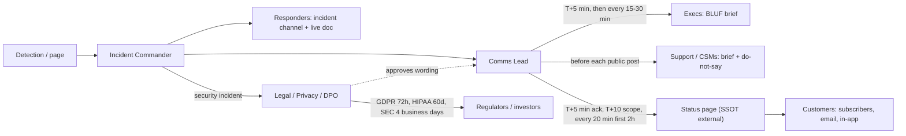
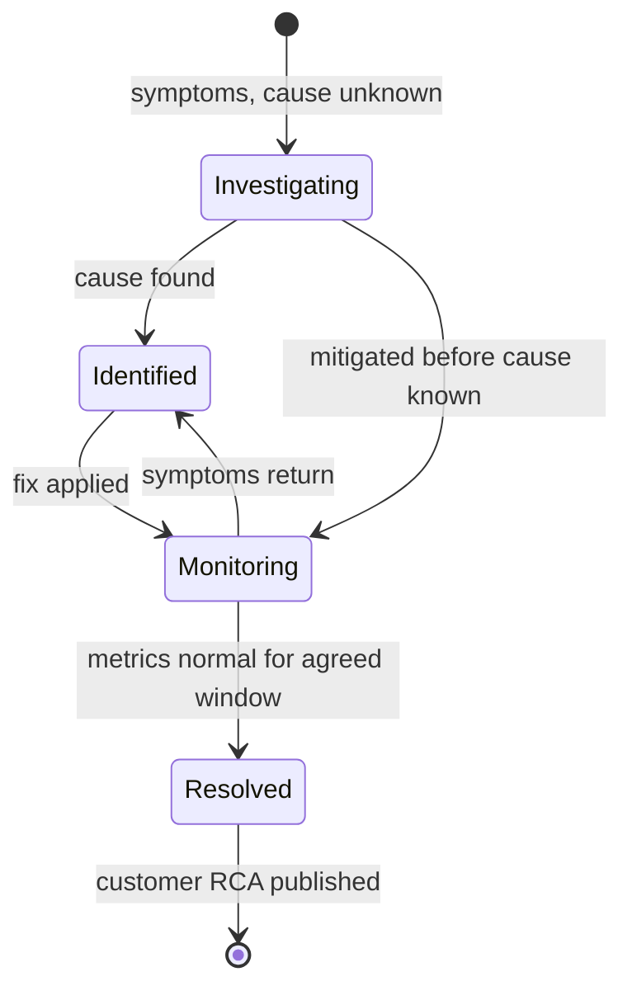

# R1 Incident Communication
> Last verified: 2026-10 · Audience: senior/staff DevOps, SRE, AI eng, NetEng, DevSecOps, architects

## TL;DR
- Incident comms is a **separate workstream with its own owner** (Comms Lead / Customer Liaison / Internal Liaison). The Incident Commander coordinates and does not write status updates. Process and roles are in [J4](../J-sre/J4-incident-response-postmortems.md); this file covers **what to say, to whom, and when**.
- Every update has four parts: **impact → current status → next steps → next update time**. The promised next-update time is the one thing you must always deliver, even if the update is "no change".
- Use **one source of truth**: one incident channel and one live incident doc internally, one status page externally. Every other channel (email, social, support macros) links back to it.
- **Tailor by audience**: responders need facts and assignments, execs need the bottom line first (BLUF), business impact and decisions, Support needs a customer-safe script, customers need impact, a workaround and the next update time, regulators need what the law requires on time.
- **Cadence beats completeness.** PagerDuty's external guidance: first message within about 5 minutes, scoping within 5 more, then at least every 20 minutes for the first 2 hours, then a longer interval. Silence reads as "they don't know" or "they're hiding it".
- **No speculation, no ETAs you cannot keep, no blame.** Own the impact ("we", not "our provider"), apologise for the effect, and be precise about what you know and what you do not.
- **Security incidents are a different track.** Legal and privacy approve the wording. The deadlines are **GDPR Art. 33: 72 h** to the supervisory authority, **HIPAA: no later than 60 days** to individuals, and **SEC 8-K Item 1.05: 4 business days after the materiality determination**.
- After the incident: the **customer-facing RCA is not the internal postmortem**. Keep it short and factual, write it in plain language, and only include commitments you will actually deliver and can show evidence for.

## R1.1 Principles of incident communication
- **How it works:**
  - **Clarity over completeness (and over brevity).** PagerDuty IC training: "clear is better than concise". Give a short, unambiguous statement of what you know now. Do not dump everything you have.
  - **Cadence.** Set the next-update time in every message and keep to it. "No new information, next update 14:30 UTC" is a valid update.
  - **Single source of truth (SSOT).** Internally that is the incident channel plus the **live incident state document**. The Google SRE book describes it as "messy, but must be functional", maintained by the IC or scribe, and later used as input to the postmortem. Externally it is the status page. Other channels point to the SSOT and never fork the story.
  - **No speculation.** Separate **confirmed**, **suspected** and **unknown**. Never publish a root-cause guess externally.
  - **Own the impact.** Customers bought your service, not your vendor's. Say "we" even when a dependency failed.
  - **Use absolute times with a timezone** (UTC plus the customer's main zone), e.g. "since 09:12 UTC". Never write "an hour ago".
  - **Avoid acronyms and role shorthand.** PagerDuty: say "Incident Commander", not "IC", because new joiners may not know the term.
- **Trade-offs / when to use:**
  - Speed vs accuracy: post an early, minimal, true acknowledgement ("investigating reports of…") rather than waiting for a full scope.
  - Over-communicating short blips causes alert fatigue and false alarms. PagerDuty warns against posting for short-lived issues, so set a threshold (e.g. sustained customer impact for more than 5 minutes, or SEV2 and above).
- **Interview angles:**
  - If asked "what makes good incident comms?" → name the four-part update, the cadence promise, SSOT, the separate comms owner, and audience tailoring.
  - Pitfall: the IC writing customer updates while also debugging. Both jobs get done badly. Delegate.

## R1.2 Audiences and what each needs
| Audience | Needs | Doesn't need | Channel | Typical cadence |
|---|---|---|---|---|
| **Responders / engineers** | Facts, hypotheses, who owns which task, decisions | Business spin | Incident channel, bridge, live doc | Continuous, plus an IC summary every 15–30 min |
| **Internal leadership / execs** | BLUF, customer and revenue impact, risk, ETA confidence, decisions needed from them | Stack traces, log snippets | Exec email or channel, short brief | Every 30–60 min for SEV1, or on change |
| **Customer Support / Success** | Customer-safe wording, symptoms, workaround, status page link, what **not** to say | Internal hypotheses | Support channel, macro or KB | On every external update, ideally a few minutes before it is published |
| **Sales / account managers (strategic accounts)** | Which named accounts are affected, talking points, SLA exposure | Internal blame | Account brief | On scope change |
| **End customers** | Am I affected? What should I do (workaround)? When will I hear more? | Internal architecture, vendor blame | Status page, in-app banner, email for targeted cases | ~20 min early, then on change or on a set schedule |
| **Regulators / legal / auditors** | The legally required content, on time, accurate | Speculation | Via Legal or the DPO | Statutory deadlines (R1.7) |

- **Interview angles:**
  - "Who do you notify first?" → **responders**, then **Support** (they are about to get tickets), then **customers** via the status page, then **execs**. For security incidents, **Legal/Privacy** is involved before any external word goes out.
  - Strategic or enterprise customers often have contractual notification clauses (e.g. notify within N hours). Account teams must know them before the incident, not during it.

## R1.3 Internal communications
### Incident channel etiquette
- **One channel per incident** (e.g. `#inc-2026-10-09-checkout-5xx`). Pin the live doc, the bridge link, current status and the role roster.
- **Channel for doing, not watching.** Spectators go to a separate `#inc-…-observers` or stakeholder channel. All "any update?" questions are redirected to the comms lead.
- **Direct, assigned asks** (PagerDuty): "Alice, please check replica lag on db-03, report in 10 minutes. Understood?" Never "can someone…" (bystander effect). For decisions, ask for **"any strong objections?"** instead of "does everyone agree?".
- **Acknowledge received information** explicitly so responders know they were heard.
- Use thread replies for side investigations. Top-level messages are for status, decisions and role changes. This also gives the scribe a clean timeline for the postmortem.
### Internal status update template
> **[SEV1] Checkout errors: Update #4, 10:05 UTC**
> **Impact:** ~18% of checkout attempts failing (HTTP 5xx) in EU since 09:12 UTC. US/APAC unaffected. Est. €40k/h GMV at risk.
> **Current status:** Mitigating. Suspected cause: config deploy 09:10 (confidence medium). Rollback started 09:58.
> **Next steps:** Confirm error rate returns to <0.5% (Bob). Prepare customer update (Comms). Hold all EU deploys (Release mgr).
> **Decisions needed:** None / [ask + deadline].
> **Next update:** 10:30 UTC or sooner on change. IC: Dana · Comms: Eli · Live doc: <link>
### Handoffs
- Google SRE: hand off **explicitly** ("You're now the incident commander, okay?") and wait for a **firm acknowledgement**. Announce the new IC and comms lead in the channel and in the live doc.
- The handoff brief covers current impact, active hypotheses, actions in flight with owners, external commitments made (promised next-update time, any ETA given), and stakeholders awaiting answers.
- Comms lead handoffs must pass on **what has been promised externally**. A missed promised update after a shift change is a classic failure.
### Comms lead role
- Google SRE "Communications": the **public face** of the response. Sends periodic updates to stakeholders and keeps the documentation accurate. PagerDuty splits this into a **Customer Liaison** (external) and an **Internal Liaison** (internal stakeholders), plus a **Scribe**.
- Owns the status page, the Support brief, exec updates and the update clock. Pulls facts from the IC. Does not pull engineers off the work.
- **Interview angles:** "When do you add a dedicated comms lead?" → at SEV2 and above, or whenever there is customer-visible impact, or when the IC is spending more than ~10% of their time answering stakeholders.

## R1.4 External communications and status pages
- **How it works: Statuspage incident lifecycle** (Atlassian):
  - **Investigating**: symptoms seen, root cause unknown.
  - **Identified**: root cause found, fix in progress.
  - **Monitoring**: fix applied, waiting for symptoms to subside.
  - **Resolved**: root cause eliminated, systems back to 100%.
  - Component status is set separately (operational / degraded performance / partial outage / major outage / under maintenance). Link affected components to the incident so component state and updates stay in sync. Subscriber notifications only fire when components are marked affected.
- **PagerDuty external sequence:** initial post within 5 minutes (acknowledge, minimal and reassuring). **Scoping** update within the next 5 minutes (impact, components, regions). Then updates at least every 20 minutes for the first 2 hours, each covering changes in impact, mitigation and next update time. Then switch to a **long-incident cadence** to avoid update fatigue. The **resolution** post confirms recovery and states any data loss or lingering effects, or explicitly says there are none.
- **Wording do's:**
  - Describe impact in user terms: "Some customers in Europe may be unable to complete payments."
  - Give a workaround if one exists.
  - Use absolute times with a timezone and say when the next update is due.
- **Wording don'ts:**
  - Internal names ("the `pg-orders-03` primary").
  - Minimising words ("just", "minor", "a small number" when it is 20%).
  - Speculative causes.
  - "We apologize for any inconvenience" boilerplate instead of a specific apology.
- **ETA discipline:** do not give a time to resolution unless mitigation is in progress with a known duration (e.g. "the restore is 60% complete and should finish around 11:00 UTC"). Otherwise promise the **next update time**, not a fix time. A missed ETA does more damage than having given none.
- **Apology without blame:** "We're sorry. We know you rely on X for Y." Apologise for the **effect** and take ownership. Do not admit legal liability or SLA breach in the moment, because credits are handled through the SLA process (check with Legal for contractual language).
- **When to name third parties:**
  - Default: **don't** during the incident. You own your customers' experience, and naming a vendor reads as deflection and may break vendor contracts.
  - Name the vendor when (a) the provider has publicly confirmed the incident (a public status or health event exists) **and** (b) naming it helps customers, e.g. they use the same provider, or there is a workaround such as changing region. Even then, own it: "Our payment processor is experiencing an outage, which means card payments on our platform are failing. We are working with them and evaluating failover."
  - In the RCA, explain how **your** architecture's dependency on that vendor made the outage reach customers, and what **you** are changing.
- **Trade-offs / when to use:**
  - Public status page vs private or targeted notices: a localised issue affecting 3 tenants should go to those tenants directly (email or in-app, or a private/audience-specific page), not to the public page.
  - Automate component status from health checks vs set it by a human: automation is faster but produces false alarms. A common middle ground is to auto-open an "Investigating" draft for a human to approve.
- **Interview angles:**
  - "How often do you update?" → "PagerDuty's guidance is first within about 5 minutes and then at least every 20 minutes for the first 2 hours. After that it's a stated, longer cadence. Every update includes the next update time."
  - Pitfall: a green status page during a real outage. Status pages hosted on the same infrastructure as the product, or automated off a broken health check, fail exactly when you need them. Host the status page on **independent infrastructure** (e.g. a SaaS status page, a separate cloud or CDN).

## R1.5 Executive summaries
- **How it works: BLUF (bottom line up front).** The first sentence answers "how bad is it, is it getting better, and do you need anything from me?"
- Structure: **status** (one line, e.g. RAG colour) → **business impact numbers** (users, revenue/GMV, SLA exposure, contractual or regulatory triggers) → **risk** (what could get worse, and its likelihood) → **ETA with confidence** → **decision needed** (option A/B, recommendation, deadline) → next update time.
- Template:
> **BLUF:** EU checkout degraded (18% failures) since 09:12 UTC. Rollback in progress, expect recovery by ~10:30 UTC (medium confidence). **Decision needed by 10:15:** approve failover to the US payment region if the rollback fails (adds ~200 ms latency, no data risk). Recommend: approve.
> **Impact:** ~2,300 failed orders so far, ~€40k/h GMV at risk. 3 enterprise accounts with 99.95% SLA affected (credit exposure ≈ €X).
> **Risk:** If the rollback does not fix it, the next option is failover (above).
> **Next update:** 10:30 UTC.
- **Interview angles:**
  - Execs want **numbers and decisions**, not mechanism. Convert error rate into users, money and contracts.
  - State **confidence** explicitly (high/medium/low) instead of hedging every sentence.
  - Do not let execs join the bridge to "help". Give them the exec channel and a guaranteed cadence. That is what keeps them off the bridge.

## R1.6 Post-incident communications
| | Customer-facing RCA / incident report | Internal postmortem ([J4](../J-sre/J4-incident-response-postmortems.md)) |
|---|---|---|
| Audience | Customers, procurement, auditors | Engineers, leadership |
| Length | 0.5–2 pages | As long as needed |
| Content | Summary, impact window (UTC), customer impact, plain-language cause, resolution, what we're changing (owned commitments), apology | Full timeline, contributing factors, detection and response analysis, action items with owners and tickets |
| Tone | Accountable, specific, no internal names, no blame | Blameless, candid |
| Timing | Preliminary within a few days, final ≈ 1–2 weeks | Draft within days, reviewed |
- **Benchmark:** Azure publishes **Post Incident Reviews (PIRs)** on its status history page "generally within 14 days" for broad issues. AWS publishes post-event summaries for major events. Cloudflare and GitHub publish detailed public write-ups. Mentioning these shows awareness of industry norms. (A Microsoft "preliminary PIR within ~3 days" practice is widely cited; **unverified** on current pages.)
- **Commitments you can keep:**
  - Promise **specific, verifiable** changes: "we have added a pre-deploy validation that rejects configs with X". Don't promise "this will never happen again".
  - Put dates only on items already scheduled.
  - Track external commitments as tickets with owners. Customers and auditors will ask later (see [P3 SOC2/ISO](../P-security-platforms-identity/P3-soc2-iso-compliance-operations.md)).
- **Tone:** take ownership, no defensiveness, no blaming individuals or vendors. Acknowledge the customer's cost.
- **Interview angles:** "Would you publish the internal postmortem?" → "No. I'd derive a customer RCA from it. The internal doc contains names, speculation, security-sensitive details and internal system names. The facts must still match it."

## R1.7 Security incident and breach communications
- **How it works:**
  - **Privileged, need-to-know track.** Use a separate private channel. Involve **Legal / Privacy (DPO) / Security** at the start, often with outside counsel to preserve privilege. All external wording is reviewed by Legal. Assume anything written may be disclosed in litigation.
  - **Don't tip off the attacker.** Coordinate the timing of credential resets and announcements. Law enforcement may request a delay. HIPAA §164.412 and the SEC rule (Attorney General national-security/public-safety delay) both allow for this.
  - **Phrasing discipline:** use "security incident" until Legal decides it legally qualifies as a "breach" (a legal term with consequences). Don't state the number of affected records before it is confirmed.
- **Notification timelines (verify the jurisdiction every time):**

| Regime | Who notifies whom | Deadline |
|---|---|---|
| **GDPR Art. 33** | Controller → supervisory authority | Without undue delay, **where feasible ≤72 h after becoming aware**. If later, give reasons for the delay. Information may be provided in phases. |
| GDPR Art. 33(2) | Processor → controller | **Without undue delay** after becoming aware (this is why SaaS DPAs often specify 24–72 h) |
| GDPR Art. 34 | Controller → data subjects | Without undue delay when there is a **high risk** to individuals |
| **HIPAA §164.404** | Covered entity → individuals | Without unreasonable delay, **no later than 60 calendar days after discovery**. Plain language. |
| HIPAA §164.408 | → HHS Secretary | **≥500 individuals:** at the same time as the individual notice. **<500:** log them and report **within 60 days after the end of the calendar year**. |
| HIPAA §164.406 | → prominent media | Breaches affecting **>500 residents of a state or jurisdiction** (60-day limit) |
| HIPAA §164.410 | Business associate → covered entity | No later than 60 days after discovery (contracts often shorter) |
| **SEC Form 8-K Item 1.05** (public cos.) | Registrant → investors | **4 business days after determining** the incident is **material** (not after discovery). Delay only if the US Attorney General notifies the SEC of a substantial national-security/public-safety risk. |
| SEC 10-K Item 106 | Annual | Cyber risk management, strategy, and board/management governance (FY ending on or after 15 Dec 2023) |

- **SEC nuance (May 2024 Corporation Finance statement):**
  - Use **Item 1.05 only for material incidents**.
  - Voluntary disclosure of immaterial incidents, or incidents not yet assessed for materiality, goes under **Item 8.01**.
  - If a matter first reported under Item 8.01 is later judged material, file under Item 1.05 within 4 business days of that determination.
  - Materiality is both **quantitative and qualitative**: reputation, customer relationships, litigation, regulatory action.
- Also relevant (not detailed here): US state breach laws, NIS2 (EU, early warning within 24 h, *unverified for your sector*), DORA for EU financial entities, and CIRCIA (US critical infrastructure, rules pending, *unverified*). Contractual DPAs often set the tightest real deadline.
- **Interview angles:**
  - "Clock starts when?" → GDPR: when the controller becomes **aware**. HIPAA: at **discovery** (including when the breach would have been known with reasonable diligence). SEC: at the **materiality determination**, which must be made "without unreasonable delay" after discovery.
  - Pitfall: engineers posting technical details of a breach in public channels or tickets. Keep the security track separate and minimal.
  - See [L3 Residency & compliance](../L-data-privacy-ai-security/L3-residency-compliance.md) and [Q2 HIPAA engineering](../Q-industry-domains/Q2-healthcare-cloud-hipaa-engineering.md).

## R1.8 Communicating during uncertainty
- Communicate **what you know, what you don't, and what you're doing to find out**. Uncertainty is not a reason to stay silent.
- Give **confidence levels** and **conditional plans**: "If the rollback doesn't restore service by 10:30, we will fail over to region B."
- **Bound the unknown:** "We have not yet confirmed whether data written between 09:12 and 09:40 was affected. We will confirm by 12:00 UTC." This beats both "no data loss" (unproven) and saying nothing.
- Never retract silently. If an earlier update was wrong, correct it explicitly: "Correction: the impact also includes API clients."
- For long incidents (more than 2 hours), move to a slower cadence (e.g. every 60 minutes, or at milestones) and **announce the change**.
- **Interview angle:** "The CEO asks for an ETA and you have none." → "Give the next checkpoint time and what has to happen before we can estimate. Present the decision tree, not a made-up number."

## R1.9 Translating technical causes into plain language
Pattern: **what users saw → why (one sentence, no jargon) → what we did → what we're changing.**

| Technical cause | Bad (jargon / blame / vague) | Good (plain language) |
|---|---|---|
| **DNS failure** (bad record / expired delegation / resolver outage) | "An NS delegation misconfig caused SERVFAIL at upstream resolvers." | "A configuration change made our website's address impossible for browsers to look up, so the site appeared offline even though our servers were running. We reverted the change. Because devices remember addresses for a while, some users recovered within minutes and others took up to an hour." |
| **DB failover** | "Primary RDS instance failed health checks. Multi-AZ promotion took 4 min, and connection pools held stale endpoints." | "Our main database server failed and the system switched automatically to its standby copy. That normally takes about a minute. This time some of our services kept trying to reach the old server, so saving changes failed for 12 minutes. No saved data was lost." |
| **Bad deploy** | "Release v4.12 introduced a regression in the auth middleware; an engineer pushed it without canary." | "An update we released at 14:02 UTC contained an error that signed some users out and stopped them signing back in. We reversed the update at 14:31 UTC. We're adding an automated check that would have caught this before it reached customers." |
| **Cloud provider outage** | "AWS us-east-1 broke, not our fault." | "A major outage at our cloud hosting provider affected the region where we run European services. Our services in that region could not process requests from 08:40 to 10:15 UTC. We're sorry. Running only in that region is our decision, so we are adding the ability to move traffic to a second region." |

- Use analogies sparingly ("address book" for DNS, "backup copy" for a replica). Don't oversimplify to the point of being wrong.
- **Interview angle:** expect to be asked to explain a technical incident to a non-technical stakeholder live. Use the four-part pattern, and quantify impact as time window, % of users and data impact.

## R1.10 Anti-patterns
- **Jargon and internal names** ("p99 on the edge LB is spiking"). Customers can't act on it, and execs tune out.
- **Blame**: on individuals (breaks blameless culture) or on vendors (reads as deflection, see R1.4).
- **Silence and missed update times.** Customers fill the gap with social media, and Support gets flooded.
- **Over-promising**: precise ETAs with no basis, "this will never happen again", "no data was affected" before it is verified.
- **Minimising**: "some users" for 40%, or "brief" for 3 hours. Customers can measure their own impact.
- **Forked truth**: Support, Sales and the status page each saying something different. Fix with SSOT and briefing Support before each public post.
- **Premature all-clear**: marking Resolved while queues are still draining. Use **Monitoring** first.
- **Status page on the same infrastructure** as the product, or automated off a single health check.
- **Boilerplate apology** with no specifics. **Legal-only wording** that reads evasive in non-security incidents.
- **Exec in the bridge** asking for updates. Give execs a dedicated update channel and cadence so they don't need to be there.

## R1.11 Templates and examples
### Status page posts
> **Investigating**: "We're investigating reports of errors when [action] in [region/product]. Some customers may be unable to [user task]. Next update by [HH:MM UTC]."

> **Identified**: "We've identified the cause of errors affecting [feature] since [HH:MM UTC] and are applying a fix. [Workaround, if any.] Next update by [HH:MM UTC]."

> **Monitoring**: "A fix was applied at [HH:MM UTC] and error rates are returning to normal. We're monitoring to confirm full recovery. [Any action customers need to take, e.g. retry failed jobs.] Next update by [HH:MM UTC]."

> **Resolved**: "This incident has been resolved. Between [start] and [end] UTC, [impact in user terms]. [Data impact: none / description.] We're sorry for the disruption. A summary of what happened and what we're changing will be published by [date]."

### Support brief (send before each public update)
| Field | Content |
|---|---|
| Customer-facing summary | Paste of the current status page text |
| Symptoms customers report | e.g. "Payment failed, error PAY-503" |
| Workaround | Steps, or "none yet" |
| Do NOT say | Cause speculation, vendor names, ETAs, "no data loss" until confirmed |
| Escalate if | Data loss claims, security concerns, strategic accounts → [contact] |
| Next brief | [HH:MM UTC] |

### Customer RCA skeleton
> **Summary:** On [date], from [start] to [end] UTC, [impact].
> **What happened:** [2–4 plain-language sentences].
> **How we fixed it:** [...].
> **What we're changing:** [1–3 specific, owned items with timing].
> **Our apology:** [specific acknowledgement of customer cost; SLA credit process if applicable].

### Hands-on: post a status update via the Statuspage API
Base URL `https://api.statuspage.io/v1/`, header `Authorization: OAuth <key>`, rate limit 1 req/s per token (60 s rolling window, 420/429 when exceeded).
```bash
curl -sS -X POST "https://api.statuspage.io/v1/pages/${PAGE_ID}/incidents" \
  -H "Authorization: OAuth ${STATUSPAGE_API_KEY}" \
  -H "Content-Type: application/json" \
  -d '{"incident":{"name":"Elevated checkout errors (EU)","status":"investigating",
       "body":"We are investigating errors when completing checkout in Europe. Next update by 10:30 UTC.",
       "component_ids":["'"${COMPONENT_ID}"'"],
       "components":{"'"${COMPONENT_ID}"'":"partial_outage"},
       "deliver_notifications":true}}'
```
(`deliver_notifications` field name is from memory: **unverified**. Check the API reference before use.)

## Diagrams




## Cloud mapping: AWS vs Azure
| Capability | AWS | Azure | Role it plays | Key differences | Alternatives |
|---|---|---|---|---|---|
| Public provider status | AWS Health Dashboard: Service health (health.aws.amazon.com/health/status, no login) | Azure status page (azure.status.microsoft) | Global, non-personalised outage view | Both show only broad, public events. Both providers recommend the personalised view instead. | Cloudflare / GitHub status pages (Statuspage-style) |
| Personalised provider health | AWS Health Dashboard (your account): public + **account-specific** events | **Azure Service Health** (services and regions you use) | "Is the provider's issue affecting *my* resources?" | AWS: event categories `issue`, `scheduledChange`, `accountNotification` with actionability and persona fields. Azure: Service issues, Planned maintenance, Health advisories, Security advisories, Billing updates, with **tenant vs subscription** scope. | — |
| Per-resource health | Affected entities in Health events, plus per-service status checks (e.g. EC2 status checks) | **Azure Resource Health** (per resource, e.g. one VM) | Separate "my resource is broken" from "the platform is broken" | Azure has a dedicated per-resource health service. AWS exposes affected resources on each event. | — |
| Programmatic and alerting | **AWS Health API** (needs Business Support+, Enterprise or Unified Operations, otherwise `SubscriptionRequiredException`). **EventBridge** events and **User Notifications** are free for all. | Service Health alerts via **Activity Log alerts → Action Groups** (email, SMS, webhook, Logic Apps). Service Health REST API, Azure Resource Graph. | Feed provider events into your incident tooling and status page | AWS: public events are **not** in managed User Notifications, so you need an EventBridge rule or user-configured notification. Azure: deploy alerts at scale with Azure Policy. | PagerDuty / Opsgenie / incident.io integrations |
| Multi-account view | Health **organizational view** (AWS Organizations management/delegated admin) | Tenant-level view (tenant admin roles), Azure Lighthouse for MSPs | One view across the estate | — | — |
| History / retention | Events visible **90 days** in dashboard/API | Health history **90 days** in the portal. API/Resource Graph to ~1 year. | Evidence for RCAs, SLA claims | Azure Resource Graph returns one row per subscription + tracking ID, so counts differ from the portal. | — |
| Provider post-incident report | Post-Event Summaries (major events) | **PIR** on status history, "generally within 14 days" | Cite in your customer RCA | Azure is more systematic about publishing PIRs for broad issues. | — |
| Your own status page | No first-party product | No first-party product | Your external SSOT | Neither cloud sells a customer-facing status page. | **Atlassian Statuspage**, **incident.io** (status pages + incident workflow), **Instatus**, Better Stack, self-hosted (e.g. Cachet/Upptime) |

- **Relaying a provider incident to your customers:**
  1. **Confirm the correlation.** Check the personalised event (AWS account-specific event / Azure Service Health tracking ID / Resource Health) against your own SLIs. The public page often lags or under-reports, and your telemetry is the primary signal ([J2](../J-sre/J2-monitoring-and-alerting.md)).
  2. **Post in your own words** about **your** impact. Optionally reference the provider once they have publicly acknowledged the issue (R1.4).
  3. **Record the provider's event ID / tracking ID** in the live doc for the RCA and for any provider SLA credit claim.
  4. **Decide on failover**: region evacuation or multi-region, see [C3 Reliability](../C-large-scale-architecture/C3-reliability.md).
- **Automation pattern:**
  - AWS: EventBridge rule (`source: aws.health`) → SNS/Lambda/Chatbot → incident channel, plus a draft status-page incident for human approval.
  - Azure: Service Health alert → Action Group webhook → the same pipeline.
- **Gotchas:**
  - AWS Health API is a global service with regional endpoints. Call the documented endpoint for your partition (*details unverified here*).
  - Azure Service Health alerts are subscription-scoped unless you use tenant-level alerts (preview).

## Sources
- https://response.pagerduty.com/during/external_communication_guidelines/
- https://response.pagerduty.com/training/incident_commander/
- https://sre.google/sre-book/managing-incidents/
- https://support.atlassian.com/statuspage/docs/what-is-an-incident/
- https://support.atlassian.com/statuspage/docs/create-an-incident/
- https://developer.statuspage.io/
- https://docs.aws.amazon.com/health/latest/ug/what-is-aws-health.html
- https://docs.aws.amazon.com/health/latest/ug/aws-health-concepts-and-terms.html
- https://learn.microsoft.com/en-us/azure/service-health/overview
- https://learn.microsoft.com/en-us/azure/service-health/service-health-portal-update
- https://azure.status.microsoft/en-us/status/history/
- https://www.sec.gov/newsroom/press-releases/2023-139
- https://www.sec.gov/newsroom/speeches-statements/gerding-cybersecurity-incidents-05212024
- https://gdpr-info.eu/art-33-gdpr/
- https://www.law.cornell.edu/cfr/text/45/164.404
- https://www.law.cornell.edu/cfr/text/45/164.408
