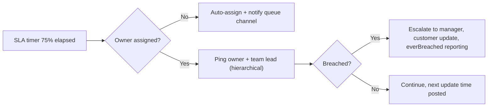

# R2 Ticket handling etiquette & Jira (support engineering)
> Last verified: 2026-10 · Audience: senior/staff DevOps, SRE, AI eng, NetEng, DevSecOps, architects

## TL;DR
- **Classify before you act**: incident (restore service) vs service request (standard, pre-approved ask) vs problem (find/fix root cause) vs change (controlled modification). Different workflows, SLAs and owners.
- **Priority = impact × urgency**, decided by a published matrix, not by how loud the requester is. Severity describes technical/business impact; priority describes order of work.
- **SLA (external contract) ≠ OLA (internal team-to-team) ≠ SLO (reliability target)**; measure **time to first response** and **time to resolution** separately, with pause conditions (e.g. "waiting for customer").
- **Escalate early and warmly**: functional escalation (to more skill) vs hierarchical escalation (to more authority); a warm handoff transfers context, not just the ticket.
- **A good ticket is a self-contained bug report**: impact, scope, repro, expected vs actual, environment, timestamps (with TZ), redacted logs, severity justification, acceptance criteria.
- **A good reply**: acknowledge fast, restate the problem, set an expectation (next update time), ask targeted questions in one batch, keep internal vs public comments separate, close with a summary and customer confirmation.
- **KCS**: every resolution should create or improve a knowledge article ("search early, search often"; reuse is the review).
- **Metrics get gamed** (MTTR via premature closure, FRT via auto-ack); pair each metric with a counter-metric (reopen rate, CSAT, backlog age).

## R2.1 ITIL basics for engineers
- **How it works:**
  - **Incident** = unplanned interruption or quality reduction of a service → goal is *restore* fast (workarounds are fine).
  - **Service request** = a user asking for something standard (access, quota, new env) → fulfil via a catalogue item, usually pre-approved.
  - **Problem** = the cause (known or unknown) of one or more incidents → goal is *root cause + permanent fix*; produces **known errors** (documented cause + workaround).
  - **Change** = add/modify/remove anything that could affect services. ITIL 4 types: **standard** (pre-authorised, low risk, e.g. a templated cert rotation), **normal** (assessed/authorised by a change authority), **emergency** (expedited authorisation to fix an incident).
  - ITIL 4 calls these "practices" (34 in total: incident management, problem management, change enablement, service request management, service desk, knowledge management, SLM…). **Change management was renamed "change enablement"** in ITIL 4.
  - **As of 2026, PeopleCert has released "ITIL (Version 5)"**, marketed as "AI-native", alongside ITIL 4 (still certifiable). Interview-safe answer: "ITIL 4 concepts; aware Version 5 is out." Exact v5 release date and practice count (unverified).
- **Priority matrix (typical):**

| Impact ↓ / Urgency → | High (no workaround, now) | Medium (degraded/workaround) | Low (can wait) |
|---|---|---|---|
| **High** (many users/revenue/security/data) | P1 | P2 | P3 |
| **Medium** (a team/one customer/one feature) | P2 | P3 | P4 |
| **Low** (one user, cosmetic) | P3 | P4 | P5 |

- **SLA vs OLA vs UC vs SLO:**

| Term | Between | Example |
|---|---|---|
| **SLA** | provider ↔ customer | "P1 first response ≤ 15 min, 24×7" |
| **OLA** | internal team ↔ internal team | "DBA team acknowledges L2 escalations ≤ 30 min" |
| **UC** (underpinning contract) | provider ↔ third-party vendor | AWS/Azure support plan, ISP contract |
| **SLO** | reliability target behind an SLA/SLI | "99.9% of requests < 300 ms over 28 days" (see [J1](../J-sre/J1-slis-slos-error-budgets.md)) |

- **Time metrics:** **first response time (FRT)** = time to first human (or meaningful) reply; **time to resolution (TTR)** = time until resolved, typically *excluding* paused states (waiting for customer, pending change window) and counted against a **business-hours calendar** unless 24×7.
- **Trade-offs / when to use:**
  - Full ITIL ceremony (CAB for every change) slows high-velocity teams → use **standard changes** + automated pipeline evidence (see [N5](../N-cicd-platform-engineering/N5-iac-pipelines-policy-as-code.md)) to satisfy SOC 2/ISO auditors ([P3](../P-security-platforms-identity/P3-soc2-iso-compliance-operations.md)).
  - OLAs must be strictly tighter than the SLA they support, or the SLA is unachievable by construction.
- **Interview angles:**
  - "Incident vs problem?" → incident = restore service now (workaround OK); problem = eliminate cause; one problem can link many incidents; a postmortem action item is often a problem record ([J4](../J-sre/J4-incident-response-postmortems.md)).
  - "Who sets priority?" → the support engineer using the matrix; requesters *propose*, triage *decides* — and you explain the decision.
  - Pitfall: treating a service request as an incident to jump the queue → re-classify politely and route to the catalogue.

## R2.2 Support tiers & escalation paths
- **How it works:**
  - **L0** self-service (portal, KB, chatbot/AI agent). **L1** service desk: triage, classify, known fixes from KB. **L2** technical support/platform team: deeper diagnosis, config changes, log analysis. **L3** engineering/SMEs/product owners: code fixes, architecture. **L4** (sometimes) vendors — cloud provider, ISV.
  - **Functional escalation** = move to a group with more expertise/permissions (L1→L2→L3, or to DB team). **Hierarchical escalation** = involve management for authority, resources, or customer-relationship risk (e.g. SLA about to breach, VIP, legal/security exposure). They are orthogonal; you can do both.
  - **Warm handoff**: the escalating engineer briefs the receiver (call/chat), confirms acceptance, tells the customer who owns it now and when they will hear next. **Cold handoff** = reassign and hope → context loss, customer re-asked same questions.
  - **Swarming** (KCS/Intelligent Swarming): instead of tiered passing, the right person joins the case; reduces handoffs for complex issues.
- **Trade-offs / when to use:**
  - Tiering protects expert time but adds handoff latency; swarming improves TTR for novel issues but needs a good skills directory and culture.
  - "Shift-left": push known fixes down to L1/L0 via KB articles and automation; measure the *L1 resolution rate*.
- **Interview angles:**
  - "When do you escalate?" → defined triggers: SLA at ~50-75% elapsed with no path, outside your access/skill, security/data-loss suspicion, multi-customer impact (→ declare an incident), customer explicitly requests management.
  - Escalation package = summary, impact, what's been tried (with evidence), current hypothesis, the specific ask, deadline.
  - Pitfall: "escalation as punishment" culture → engineers hold tickets too long. Escalation should be blameless and cheap.

## R2.3 Jira Service Management & Jira Software essentials
- **How it works:**
  - **Naming (2025+ Jira Cloud)**: Atlassian renamed **"issues" → "work items"** and **"issue types" → "work types"**; older docs/JQL still say issue. JQL keyword is still `issuetype`/`type`.
  - **JSM** (service desk): **request types** (customer-facing forms on the portal, each mapped to one work type, e.g. "Report a system problem" → Incident), **portal groups**, **queues** (JQL-filtered agent views), **SLAs**, **customers/organizations**, approvals, **public reply vs internal note** (internal notes are never shown on the portal/email).
  - ITSM template work types: **Service request, Service request with approvals, Incident, Problem, Change, Post-incident review** (plus custom).
  - **Jira Software** (engineering backlog): Epic/Story/Task/Bug/Sub-task, sprints/boards. Support (JSM) tickets get **linked** to engineering bugs rather than moved, so the customer-facing record and SLA clock stay in JSM.
  - **Workflows**: statuses + transitions + conditions/validators/post-functions. Typical support statuses: *Waiting for support → In progress → Waiting for customer → Resolved → Closed*, with *Escalated/Pending* as needed. Resolution field must be set on done statuses (otherwise JQL `resolution = Unresolved` breaks dashboards).
  - **Linking**: incidents ↔ problem ("is caused by"/"causes"), problem ↔ change ("is fixed by"), duplicates ("duplicates"/"is duplicated by"), JSM ticket ↔ Jira Software bug ("relates to"/"is blocked by"). **Components** = owned system areas (with default assignee); **labels** = free-form tags (sprawl risk — prefer components or custom select fields for reporting).
  - **SLAs**: each SLA has **start / pause / stop conditions** (e.g. start: work item created; pause: status = Waiting for customer; stop: comment by agent for FRT or resolution set for TTR), **goals** scoped by JQL (e.g. priority = P1 → 1h), and a **calendar** (business hours, holidays, timezone). Defaults: **Time to first response** and **Time to resolution**.
  - **Automation**: rules = **trigger** (work item created, transitioned, SLA threshold breached, scheduled, comment added) + **conditions** (JQL / field) + **actions** (assign, transition, comment, link, send Slack/email, create work item, edit fields) with **smart values** like `{{issue.key}}`, `{{reporter.displayName}}`. Monthly rule-execution limits depend on plan tier (exact quotas: check current Atlassian pricing; (unverified)).
- **Common automation rules (describe in interviews):**
  - Auto-triage: request type + keywords → set component/priority, assign via round-robin/load-balancing.
  - **SLA threshold**: 75% of TTR elapsed → comment on ticket, ping team channel, notify lead (hierarchical escalation by rule).
  - **Stale waiting-for-customer**: no reply 5 business days → reminder; 10 days → resolve with "closing, reply to reopen".
  - Customer comments on Resolved ticket → transition back to *Waiting for support* (feeds reopen-rate).
  - Engineering bug linked & transitions to Done → comment on JSM ticket "fix deployed, please confirm".
- **Trade-offs / when to use:**
  - JSM for anything with an external/internal *customer* and SLA; Jira Software for engineering work. Don't run customer support out of a dev backlog (no SLAs, no portal, customers see internal noise).
  - Heavy workflow customisation → brittle, slow migrations; keep few statuses, use automation instead of validators where possible.
- **Interview angles:**
  - "How would you set up triage for a platform team?" → request types per ask, components with owners, P1-P4 SLA goals with business-hours vs 24×7 calendars, queues: *Unassigned*, *SLA < 1h remaining*, *Breached*, *Waiting on us > 3d*; automation for stale and threshold alerts; dashboard via JQL.

### JQL cheat sheet (triage dashboards)
| Purpose | JQL |
|---|---|
| My open work | `assignee = currentUser() AND resolution = Unresolved ORDER BY priority DESC, created ASC` |
| Unassigned new tickets | `project = SUP AND assignee IS EMPTY AND statusCategory != Done ORDER BY created ASC` |
| FRT already breached | `project = SUP AND "Time to first response" = breached()` |
| TTR about to breach (<2h) | `project = SUP AND "Time to resolution" < remaining("2h") ORDER BY "Time to resolution" ASC` |
| Breached at any point (reporting) | `project = SUP AND "Time to resolution" = everBreached() AND resolved >= startOfMonth(-1)` |
| SLA paused (waiting on customer) | `project = SUP AND "Time to resolution" = paused()` |
| Stale: no update 7 days | `project = SUP AND statusCategory != Done AND updated <= -7d` |
| Backlog age > 30 days | `project = SUP AND resolution = Unresolved AND created <= -30d ORDER BY created ASC` |
| Reopened tickets | `project = SUP AND status CHANGED FROM Resolved TO "Waiting for support" AFTER startOfMonth()` |
| By request type | `project = SUP AND "Request Type" = "Report a system problem"` |
| One customer org | `project = SUP AND organization = "Acme Corp" AND resolution = Unresolved` |
| Pending my approval | `approval = pendingBy(currentUser())` |
| Incidents linked to a problem | `issue in linkedIssues("PRB-42", "is caused by")` |
| P1s in last 24h | `project = SUP AND priority = Highest AND created >= -24h` |
| Waiting for customer, long | `project = SUP AND status = "Waiting for customer" AND status CHANGED TO "Waiting for customer" BEFORE -5d` |

- JQL notes: `statusCategory` (To Do / In Progress / Done) is robust across differing workflows; `resolution = Unresolved` depends on resolution being set correctly; relative dates `-7d`, `startOfWeek()`, `endOfDay()`; SLA functions available: `breached()`, `completed()`, `elapsed()`, `everBreached()`, `paused()`, `remaining()`, `running()`, `withinCalendarHours()`.

## R2.4 Writing a good ticket
- **How it works (fields that matter):**
  - **Title**: `<component>: <symptom> <scope> since <time>` — e.g. "checkout-api: 5xx rate 12% for EU customers since 09:40 UTC". Not "URGENT!!! site broken".
  - **Impact**: who/how many/what business function, revenue/security/data risk, workaround available?
  - **Severity justification**: map to the matrix explicitly ("High impact (all EU checkout) × High urgency (no workaround) → P1").
  - **Repro steps**: numbered, minimal, deterministic; include frequency ("3/10 attempts").
  - **Expected vs actual**.
  - **Environment**: env/region/cluster/version/commit SHA/browser/client, feature flags, recent changes.
  - **Timeline**: first seen, timestamps **with timezone (prefer UTC)**, correlation IDs/trace IDs/request IDs.
  - **Evidence**: log excerpts (not 50 MB dumps), screenshots, dashboards links, `curl -v` output — **redact secrets/tokens/PII** (Authorization headers, cookies, API keys, emails, card numbers, PHI). See [L1](../L-data-privacy-ai-security/L1-data-classification-pii.md), [L6](../L-data-privacy-ai-security/L6-secrets-supply-chain.md).
  - **What's been tried** and results.
  - **Acceptance criteria / definition of done**: "5xx < 0.1% for 30 min, RCA linked".
- **Bad vs good:**

| Bad | Good |
|---|---|
| "VPN not working, pls fix ASAP" | "Client VPN: users in Singapore office can't connect (TLS handshake timeout) since 2026-10-08 02:10 UTC; ~40 users; London unaffected; workaround: none" |
| Pastes full log with bearer token | 20-line excerpt, `Authorization: Bearer <REDACTED>`, request ID `req-7f3a…` |
| "Severity: Critical" (no reason) | "P2: single office, business-hours impact, no data risk" |
| "Same as last time" | Link to previous ticket + KB article + what differs this time |

- **Interview angles:** "What makes a ticket actionable?" → the receiver can start work without asking a single question. Secrets in tickets = security incident: rotate the credential, purge/restrict the comment, don't just edit it (history/email notifications retain it).

## R2.5 Responding to a ticket
- **How it works (response loop):**
  1. **Acknowledge fast** (within FRT) — a human, specific ack, not just an auto-reply.
  2. **Restate the problem** in your words + impact → catches misunderstandings early.
  3. **Set expectations**: what you'll do next and **when the next update is** (P1: every 30–60 min; P2: every few hours; P3/P4: daily or on change).
  4. **Ask targeted questions, batched**, with *why* you need each and how to get it (exact command). Avoid drip-feeding one question per day.
  5. **Update cadence** even when there's no news ("still investigating, next update 15:00 UTC").
  6. **Internal vs public**: hypotheses, blame, other customers' data, raw logs → internal note. Public = facts, actions, next steps.
  7. **Closure**: summary (cause, fix, prevention), KB link, ask for confirmation; resolve with a grace period to reopen; don't close on silence without a warning.
- **Reply templates:**

> **Technical requester (first response)**
> Hi Priya — thanks, I've picked this up (SUP-1432).
> My understanding: since ~09:40 UTC, `POST /v2/orders` from `eu-west-1` returns 503 for ~12% of requests; retries succeed. Impact: checkout for EU tenants.
> Next: I'm checking ALB target health and the 09:35 deploy of `orders-svc` v4.18. Next update by 10:30 UTC.
> To speed this up, could you send: (1) 2–3 failing request IDs (`x-request-id` header), (2) whether you're hitting the regional or global endpoint. Please redact auth headers.

> **Non-technical requester (same issue)**
> Hi Mark — thanks for letting us know. Some customers in Europe are seeing errors when placing orders; most succeed if they try again. We're treating this as high priority and the engineering team is actively working on it. I'll update you by 10:30 UK time, or sooner if it's fixed. Nothing you need to do right now; if customers contact you, it's safe to tell them to retry in a few minutes.

> **Bad reply**
> "Works for me. Probably your network. Closing."

> **Closure (good)**
> Resolved: the 09:35 deploy shipped a connection-pool setting that was too low under EU peak load; we rolled back at 10:12 UTC and error rate returned to baseline (<0.05%). Prevention: config now load-tested in CI (ENG-889). KB: KB-311. Could you confirm orders look normal on your side? I'll keep this open for 3 business days, then close automatically — reply anytime to reopen.

- **Interview angles:** "How do you handle a ticket you can't solve quickly?" → ack, restate, set next-update time, escalate with a package, keep owning communication even after functional escalation.

## R2.6 Etiquette: technical vs non-technical requesters
- **How it works:**
  - **Plain-language rewrite**: impact → what they should do → when you'll update. Remove jargon (e.g. "DNS TTL" → "it may take up to an hour for every user to see the fix").
  - **Technical audience**: precise, evidence, commands, IDs; skip pleasantries beyond one line.
  - **No blame**: "the request was rejected because the token had expired" not "you used an expired token"; for internal teams, blameless language mirrors postmortem culture ([J4](../J-sre/J4-incident-response-postmortems.md)).
  - **Empathy that isn't fluff**: name the specific impact + a concrete action. "I understand payroll can't run until this is fixed, so I've escalated to the database on-call and will update you at 14:00" beats "We apologise for any inconvenience."
  - Avoid "just", "simply", "obviously", "as I said"; avoid ALL CAPS and walls of text; one ask per bullet.
- **Interview angles:** see [R3 Writing for audiences](./R3-writing-for-audiences.md) and [R1 Incident communication](./R1-incident-communication.md) for status-page/exec updates.

## R2.7 Handling difficult situations
| Situation | Do | Don't |
|---|---|---|
| **Angry customer** | Acknowledge impact, own next step, give a time, move to a call if text is escalating | Argue facts in writing, match tone, over-promise ETA |
| **VIP / exec escalation** | Re-triage with the matrix (VIP status may raise *urgency*, not invent *impact*); assign single owner; brief their account/lead; keep normal process visible | Silently skip the queue, letting VIP pressure starve P1s |
| **"It's not our bug"** | Show evidence (traces, packet capture, provider status), offer a workaround, help them engage the right party (warm handoff to vendor/other team) | Close with "not our problem"; customer experiences *your* service |
| **Duplicates** | Link with "duplicates", point to the master ticket, keep reporter subscribed; add their data (scope evidence) to master | Close without link; lose the extra signal |
| **Stale tickets** | Automated reminder, then resolve with reopen path; owner reviews backlog weekly | Leave open forever (inflates backlog age) or close silently |
| **Scope creep → feature request** | Resolve original issue, open a linked feature request/idea with the product owner, tell the requester where it's tracked | Keep one ticket open for months as a feature backlog |
| **Requester bypasses process (DMs/Slack)** | Help briefly, then "I've logged this as SUP-123 so it's tracked and others can help" | Do untracked work (invisible toil, no audit trail) |

- **Interview angles:** "Customer insists Sev 1, you think Sev 3" → explain criteria, agree on what evidence would raise it, set a fast re-check; document the disagreement; escalate hierarchically if unresolved — never just downgrade silently.

## R2.8 Knowledge-centered service (KCS)
- **How it works:**
  - KCS v6 by the **Consortium for Service Innovation** (now branded **"Knowledge-Centered Success"**, KCS® trademark).
  - **Solve Loop** (per ticket): **Capture** (in the requester's words, during the work), **Structure** (template: Issue/Environment/Resolution/Cause), **Reuse** (*search early, search often*; link article to ticket), **Improve** (fix/flag when reusing — "reuse is review").
  - **Evolve Loop** (org level): **Content Health**, **Process Integration**, **Performance Assessment**, **Leadership & Communication**.
  - Article states: **Work in progress → Not validated → Validated → Archived**; visibility (internal → external) increases with confidence and licensed author competence (KCS Candidate/Contributor/Publisher roles).
  - Article = the *resolution*, not a narrative of the ticket. Tie to errors as users see them (exact error string helps search).
- **Trade-offs:** article sprawl and stale content if no Evolve loop; "write it later" never happens → capture inside the workflow (JSM: create KB article from ticket with Confluence knowledge base).
- **Interview angles:** KCS feeds L0 self-service and AI support agents/RAG ("LLMs are only as good as the content they consume") — see [K3 RAG](../K-ai-infra-llm/K3-rag-pipelines.md). Metrics: link rate (tickets with linked article), reuse rate, self-service success, article-create vs article-reuse ratio.

## R2.9 Support metrics and how they get gamed
| Metric | Definition | Gaming | Counter-metric |
|---|---|---|---|
| **MTTA** | mean time to acknowledge (page/ticket) | auto-ack bots, generic "looking" replies | time to *meaningful* first response, CSAT |
| **MTTR** | mean time to resolve/restore (define which!) | close early, split tickets, pause SLA aggressively | **reopen rate**, % SLA time paused |
| **FRT / SLA attainment** | % within target | reclassify priority downward, stop clock on any comment | priority-change audits, everBreached() reporting |
| **Backlog size / age** | open count, age distribution (p50/p90) | bulk-close stale without contact | reopen rate, CSAT on auto-closed |
| **Reopen rate** | resolved → reopened within N days | discourage reopens, open new ticket instead | duplicate detection, per-customer ticket rate |
| **CSAT** | post-resolution survey (1–5) | survey only happy tickets, selection bias | response rate, CES/NPS, sample all |
| **Tickets closed/agent** | throughput | cherry-pick easy tickets | weighted by complexity, assignment by round-robin |

- Use **medians/percentiles** not means (long tail); segment by priority; **Goodhart's law**: "when a measure becomes a target, it ceases to be a good measure".
- MTTR ambiguity: repair vs recover vs resolve vs respond — always define. Incident MTTR is a weak reliability metric (heavy tails); SLO burn is better ([J1](../J-sre/J1-slis-slos-error-budgets.md), [J2](../J-sre/J2-monitoring-and-alerting.md)).

## R2.10 On-call, interrupt rotations & toil
- **How it works (Google SRE workbook):**
  - Target ≤ **2 incidents per 12-hour shift**; shifts **≤ 12 h**; rotation size **≥ 8 engineers single-site** or **≥ 6 per site** for two-site follow-the-sun (book suggests 5–6 + one spare).
  - ≥ **50% of SRE time on project work** (toil cap) — see [J6 Toil & release engineering](../J-sre/J6-toil-release-engineering.md).
  - Response tiers: ~5 min for revenue-impacting pages, ~30 min for non-customer-facing, **tickets (not pages)** for non-urgent — work hours only.
  - Structured **handoffs** between shifts; on-call **compensated** (time-off or cash, capped); track pages → root cause → bug to drive prioritisation.
- **Interrupt rotation ("ops/triage person of the week")**: one engineer owns the ticket queue so the rest of the team gets focus time; they triage, fix quick ones, route the rest, and write a handoff note. Separate from pager on-call when ticket volume is high.
- **Interview angles:** "Ticket queue is drowning the team" → measure ticket categories, automate/self-serve top 3 request types (service catalogue + automation), KB for repeats, fix noisy alerts that create tickets, interrupt rotation, push back on unowned asks; report toil % quarterly.

## R2.11 ServiceNow / Zendesk / Linear equivalents
| Concept | Jira Service Management | ServiceNow ITSM | Zendesk | Linear |
|---|---|---|---|---|
| Ticket | work item (request) | Incident / Request Item (RITM) / Problem / Change Request records | Ticket | Issue (in Triage / Customer Requests) |
| Request form | Request type + portal | Service Catalog item / Record producer | Ticket forms + Help Center | Linear Asks / intake forms |
| Agent view | Queues (JQL) | Lists/filters, Agent Workspace | Views | Triage inbox, views |
| SLA | SLA (start/pause/stop, calendars) | SLA definitions + schedules, Task SLA | SLA policies | SLAs on issues (priority-based) |
| Automation | Automation rules + smart values | Flow Designer / Business rules | Triggers, automations, macros | Workflows/automations, integrations |
| Knowledge | Confluence KB | Knowledge Management (KCS-verified historically) | Guide / Help Center | (link docs) |
| CMDB / assets | Assets (Insight) | CMDB (CI relationships) | — (apps) | — |
| Query language | JQL | Encoded queries / condition builder | Search syntax | Filters |

- ServiceNow is the enterprise ITSM default (CMDB, change approvals, HR/SecOps modules); Zendesk is customer-support-first (omnichannel, macros); Linear is dev-team issue tracking with a triage inbox — not a full ITSM. Incident paging typically via PagerDuty / Opsgenie / incident.io integrated with the ticket system (note: Atlassian announced **Opsgenie end-of-sale/retirement, migrating into JSM/Compass**; exact retirement date (unverified)).

## Diagrams

```mermaid
stateDiagram-v2
    [*] --> New: "Created via portal/email/alert"
    New --> Triage: "L1 classify + priority matrix"
    Triage --> ServiceRequest: "standard ask"
    Triage --> L1Work: "known fix in KB"
    ServiceRequest --> Resolved
    L1Work --> Resolved
    L1Work --> L2: "functional escalation (warm handoff)"
    L2 --> WaitingForCustomer: "targeted questions (SLA paused)"
    WaitingForCustomer --> L2: "customer replies"
    WaitingForCustomer --> Resolved: "no reply after reminders"
    L2 --> L3: "needs code/arch change; link Jira Software bug"
    L2 --> Vendor: "cloud provider case (UC)"
    Vendor --> L2
    L3 --> Resolved: "fix deployed"
    L2 --> Resolved
    L2 --> MajorIncident: "multi-customer impact, declare incident"
    MajorIncident --> Problem: "post-incident review, root cause"
    Problem --> Change: "permanent fix via change enablement"
    Change --> Resolved
    Resolved --> L2: "customer reopens (reopen rate)"
    Resolved --> KB: "KCS capture/improve article"
    KB --> Closed
    Resolved --> Closed: "confirmed or grace period expired"
    Closed --> [*]
```




## Cloud mapping: AWS vs Azure
| Capability | AWS | Azure | Role it plays | Key differences | Alternatives |
|---|---|---|---|---|---|
| Free tier support | **Basic** (billing/account, quota increases, docs, Health Dashboard) | **Basic** (billing, subscription management, quota) | No technical cases | Both allow quota/billing tickets free | Community forums, re:Post / Microsoft Q&A |
| Entry paid plan | **Business Support+** (from $29/mo/account; AI-assisted + 24×7 humans) — replaces **Developer** and **Business**, both discontinued **1 Jan 2027** | **Developer** (business-hours, Sev C only) / **Standard** (24×7 Sev A) | Technical cases for prod | AWS collapses dev/business tiers; Azure still splits | Partner-led support |
| Premium | **Enterprise Support** (TAM, <15 min critical, Security Incident Response included; min reduced to $5k) — **Enterprise On-Ramp discontinued 1 Jan 2027** (auto-upgraded during 2026) | **Professional Direct** (faster B/C, ProDirect delivery managers) | Proactive + fast response | AWS designated TAM; Azure ProDirect pooled | — |
| Top tier | **AWS Unified Operations** (<5 min from Incident Management Engineer, TAM + Domain Specialist Engineer, Countdown Premium) | **Unified (Enterprise)** + **Azure Rapid Response** (<15 min Sev A) | Mission-critical | Both contract-based | — |
| Case API | AWS Support API (`aws support …`, Business Support+ and above) | Support REST API / `az support` | Automate case creation from tooling | AWS needs paid plan for API | ITSM connectors (ServiceNow ↔ AWS/Azure) |
| Health signals | AWS Health Dashboard / Health API | Azure Service Health / Resource Health | "Is it them or us?" | Both support account-specific events | Cloudflare status, statuspage |

### Severity & first-response times
| AWS severity (API code) | Response (Business Support+ / Enterprise / Unified Ops) | Azure severity | Response (Standard / ProDirect & Unified / Rapid Response) |
|---|---|---|---|
| General guidance (`low`) | 24 h | Sev C (minimal impact, business hours) | 8 h / 4 h / 4 h (Developer: 8 h, Sev C only) |
| System impaired (`normal`) | 12 h | Sev B (moderate, degraded but working) | 4 h / 2 h / 2 h |
| Production system impaired (`high`) | 4 h | — | — |
| Production system down (`urgent`) | 1 h | Sev A (critical business impact, 24×7) | 1 h / 1 h / **15 min** |
| Business-critical system down (`critical`) | < 30 min / < 15 min / 5 min | Unified "Critical Sev 1" | 15 min (Azure) |

- **AWS**: severity can be changed after creation on Business Support+/Enterprise/Unified Ops (not on Basic); raising to *Production system down* or *Business-critical system down* requires engaging via **web/chat/phone** contact method and locks further changes for **60 min**. AWS guidance: use the highest severity only for cases with no workaround that directly affect production. Developer/Business/On-Ramp remain available in **GovCloud (US)**.
- **Azure**: you must hold **Owner, Contributor or Support Request Contributor** (or `Microsoft.Support/*`) on the subscription; the engineer can only access resources in the selected subscription (multi-subscription issues need access on each). **Sev A requires 24×7 customer availability** — if you aren't reachable, expect downgrade to business-hours handling. Opt in/out of **Advanced diagnostic information** collection; VM memory dumps can pause a VM up to **10 min**. One file (or one zip) attachable at creation. Choose the right service/problem type — wrong choice delays routing. Max severity depends on plan and country/region business hours.

### How to open a cloud case well (checklist)
- **Precise scope**: account ID / subscription ID, region/AZ (note AZ names are account-specific in AWS — give **AZ ID** like `use1-az4`), resource ARNs/resource IDs, request IDs (`x-amzn-RequestId`, `x-ms-request-id`/correlation ID).
- **Timeline in UTC**: start time, whether ongoing, recent changes you made.
- **Impact + severity justification** using *their* severity definitions; workaround status.
- **Evidence**: error messages verbatim, CloudTrail/Activity Log entries, metrics screenshots, `traceroute`/`mtr`, packet captures for network cases.
- **What you've ruled out** and the **specific ask** ("confirm whether host retirement on i-0abc… caused the reboot", "raise quota X to N").
- **Contact**: phone/chat for urgent; add your on-call alias as CC; keep the case number in your internal incident ticket (link as UC/vendor escalation).
- **Escalate**: raise severity when impact changes, use chat/phone for urgent, involve **TAM** (AWS Enterprise/Unified Ops) or **CSAM/ProDirect delivery manager** (Azure) for hierarchical escalation; check AWS Health / Azure Service Health first — a known event saves a case.
- Never paste secrets/keys; share logs via the case attachment, not public links.

## Hands-on (optional)
```bash
# AWS: open and update a support case from the CLI (Support API endpoint is us-east-1; needs Business Support+ or higher)
aws support describe-services --region us-east-1 --query "services[?contains(name,'Elastic Load')].[code,categories[0].code]"
aws support create-case --region us-east-1 \
  --subject "ALB eu-west-1: 503s on target group tg-orders since 09:40 UTC" \
  --service-code "elastic-load-balancing" --category-code "other" \
  --severity-code "urgent" --language "en" \
  --cc-email-addresses "oncall-platform@example.com" \
  --communication-body "Impact: ~12% of EU checkout requests fail. Account 111122223333, ALB arn:aws:elasticloadbalancing:eu-west-1:111122223333:loadbalancer/app/orders/abc. Started 2026-10-08T09:40Z, ongoing. Sample request IDs: ... Tried: target health OK, rollback of app v4.18 no effect. Ask: check ALB node health in euw1-az2."
aws support add-communication-to-case --region us-east-1 --case-id "case-111122223333-..." \
  --communication-body "Update 10:30Z: impact limited to euw1-az2 targets; shifted traffic away (zonal shift)."

# Azure: list problem classifications, then create a ticket (abbreviated; contact flags required)
az support services list --query "[?contains(displayName,'Virtual Machine')].name" -o tsv
az support in-subscription tickets create \
  --ticket-name "vm-reboot-20261008" --title "VM unexpected reboot prod-sql-01" \
  --severity "critical" --require-24-by-7-response true \
  --problem-classification "/providers/Microsoft.Support/services/<svcGuid>/problemClassifications/<pcGuid>" \
  --technical-resource "/subscriptions/<subId>/resourceGroups/prod-data/providers/Microsoft.Compute/virtualMachines/prod-sql-01" \
  --start-time "2026-10-08T03:12:00Z" \
  --description "VM prod-sql-01 rebooted 2026-10-08T03:12Z, no Service Health event, no guest-initiated shutdown in logs. Ask: host-level cause." \
  --contact-first-name "Alex" --contact-last-name "Ng" --contact-method "phone" \
  --contact-email "oncall@example.com" --contact-phone-number "+44..." \
  --contact-timezone "GMT Standard Time" --contact-country "GBR" --contact-language "en-gb" \
  --advanced-diagnostic-consent "Yes" --secondary-consent "[{type:VirtualMachineMemoryDump,user-consent:No}]"
az support in-subscription tickets list --filter "Status eq 'Open'" -o table

# Jira Cloud: run a triage JQL via REST (enhanced search endpoint)
curl -s -u "$JIRA_USER:$JIRA_API_TOKEN" -G "https://example.atlassian.net/rest/api/3/search/jql" \
  --data-urlencode 'jql=project = SUP AND "Time to resolution" < remaining("2h") ORDER BY priority DESC' \
  --data-urlencode 'fields=key,summary,priority,assignee' | jq -r '.issues[] | "\(.key)\t\(.fields.priority.name)\t\(.fields.summary)"'
```
- Azure `--severity` values: `minimal` (C), `moderate` (B), `critical` (A), `highestcriticalimpact` ("Emergency - Severe impact", premium/Unified only). Severity **can't be changed via API while an engineer is actively working the ticket** — add a communication asking instead. Ticket data retained 18 months. The Jira `/rest/api/3/search/jql` endpoint replaced the older `/search` (deprecated 2025) — (unverified exact removal date).

## Cross-links
- [R1 Incident communication](./R1-incident-communication.md) · [R3 Writing for audiences](./R3-writing-for-audiences.md)
- [J4 Incident response & postmortems](../J-sre/J4-incident-response-postmortems.md) · [J6 Toil & release engineering](../J-sre/J6-toil-release-engineering.md) · [J1 SLIs/SLOs](../J-sre/J1-slis-slos-error-budgets.md) · [J2 Monitoring & alerting](../J-sre/J2-monitoring-and-alerting.md)
- [N5 IaC pipelines & policy as code](../N-cicd-platform-engineering/N5-iac-pipelines-policy-as-code.md) · [N6 Internal developer platforms](../N-cicd-platform-engineering/N6-internal-developer-platforms.md) (self-service shifts tickets left)
- [P3 SOC 2 / ISO operations](../P-security-platforms-identity/P3-soc2-iso-compliance-operations.md) (change evidence) · [L1 Data classification & PII](../L-data-privacy-ai-security/L1-data-classification-pii.md) · [L6 Secrets](../L-data-privacy-ai-security/L6-secrets-supply-chain.md)
- [K3 RAG pipelines](../K-ai-infra-llm/K3-rag-pipelines.md) (KB as AI support-agent corpus)

## Sources
- https://docs.aws.amazon.com/awssupport/latest/user/case-management.html
- https://docs.aws.amazon.com/awssupport/latest/user/aws-support-plans.html
- https://aws.amazon.com/premiumsupport/plans/
- https://learn.microsoft.com/en-us/azure/azure-portal/supportability/how-to-create-azure-support-request
- https://azure.microsoft.com/en-us/support/plans/response/
- https://support.atlassian.com/jira-service-management-cloud/docs/create-service-level-agreements-slas/
- https://support.atlassian.com/jira-service-management-cloud/docs/use-advanced-search-with-jira-query-language-jql/
- https://support.atlassian.com/jira-service-management-cloud/docs/what-are-queues/
- https://learn.microsoft.com/en-us/cli/azure/support/in-subscription/tickets?view=azure-cli-latest
- https://www.serviceinnovation.org/kcs/
- https://sre.google/workbook/on-call/
- https://www.peoplecert.org/browse-certifications/it-governance-and-service-management/ITIL-1
