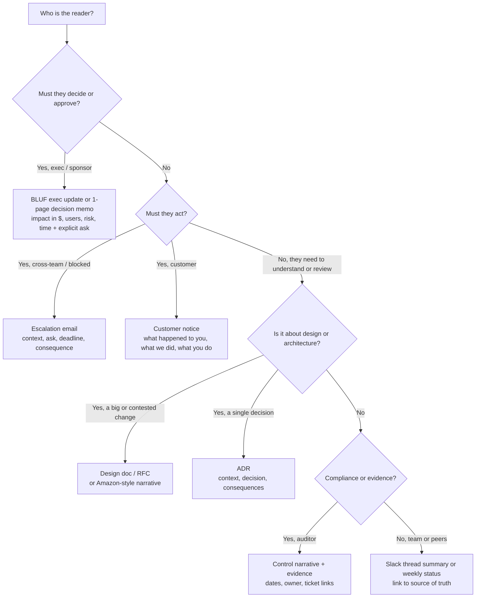

# R3 Writing for Audiences (technical and non-technical)
> Last verified: 2026-10 · Audience: senior/staff DevOps, SRE, AI eng, NetEng, DevSecOps, architects

## TL;DR
- **Audience first:** before writing, answer three questions: *who reads this, what do they already know, what must they decide or do after reading?* Google's tech-writing course frames it as **documentation = what the reader needs − what the reader already knows**.
- **BLUF:** put the conclusion, decision, or ask in the first 1–2 sentences. Supporting detail goes below, ordered by importance (**pyramid principle**). Executives often stop after the first paragraph, so write for that.
- **One fact, many renderings:** the same incident needs a different write-up for an exec (impact, risk, cost, ask), an engineer (mechanism, timeline, repro), a customer (what happened to *you*, what we did, what you need to do), and an auditor (control, evidence, dates, owner).
- **Staff-level design writing:** design docs, RFCs, and ADRs must show **alternatives considered, trade-offs, and consequences**, including the downsides you accept. A doc with only one option is a sales pitch, not a design.
- **Non-technical explanations:** use an analogy that still holds at the edges, drop jargon, and **quantify in business units**: users, revenue, risk, time.
- **Status, escalation, and pushback** each have a fixed shape: **RAG + trend + risks + asks**; **context → ask → deadline → consequence**; **"yes, if…" / "not now, because…" with options**.
- **Async norms:** keep one thread per topic, write low-context messages, link to a single source of truth, and record decisions in a **decision log/ADR**, not only in Slack.
- **Clarity checks:** active voice, present tense, verbs instead of nouns, short sentences, scannable headings and lists, define acronyms, and never let colour carry meaning on its own (RAG needs a text label too).



## R3.1 Audience analysis
- **How it works:**
  - Define the reader by **role** (SWE, TPM, exec, customer admin, auditor) and **proximity to the knowledge** (have they worked on this system? how recently? do they know the internals or only the interface?). This comes from Google Technical Writing One, "Audience".
  - **Curse of knowledge:** experts forget what novices don't know. Symptoms are unexplained acronyms, skipped steps, and "obviously…".
  - Ask four questions: **What do they know? What do they care about (cost, risk, users, schedule, compliance)? What must they do/decide? How much time will they give it (30 s, 5 min, 1 h)?**
  - **Mixed audiences:** layer the document. Put a BLUF summary for everyone at the top, and add sections or appendices for depth ("Details for on-call", "Appendix: query plans").
  - **Global readers:** avoid idioms and cultural references, because machine translation handles them poorly. Use simple, culturally neutral wording.
- **Trade-offs / when to use:**
  - Writing for the least-informed reader makes the text longer. Writing for the most-informed reader loses everyone else. Layering solves both.
  - Primary vs secondary audience: optimise for the person who acts. Forwarded readers are secondary, so make the message self-contained (low-context).
- **Interview angles:**
  - "How do you tailor a message?" → name the audience, the decision they own, the time budget, and the unit they think in (dollars, SLA, tickets, controls).
  - Pitfall: one email sent to execs and engineers at once. Instead, send two messages, or use a layered doc with a TL;DR.

## R3.2 BLUF and the pyramid principle
- **How it works:**
  - **BLUF (Bottom Line Up Front):** the first sentence holds the conclusion, the recommendation, or the ask, plus a deadline.
  - **Pyramid principle (Minto):** start with the governing thought, then 3±1 supporting arguments, then the data under each. Group arguments so they are **MECE** (mutually exclusive, collectively exhaustive).
  - **SCQA** opener: Situation → Complication → Question → Answer. Useful for a doc's intro paragraph.
  - Google tech writing: "state key points at the start of each document". Give each paragraph a lead sentence and one topic.
  - Subject lines carry the BLUF: `[DECISION NEEDED by Thu] Approve $40k for cross-region DR`.
- **Trade-offs / when to use:**
  - Always use it for exec, escalation, and status writing.
  - In narratives meant to persuade a sceptical audience, it can help to show the reasoning before the conclusion. Still state the question up front.
- **Interview angles:**
  - "Explain X in 30 seconds" → give the answer first, then one reason and one number, then offer detail.
  - Pitfall: **chronological storytelling** ("At 09:02 we noticed…") in an exec summary. The timeline belongs in the postmortem body ([J4](../J-sre/J4-incident-response-postmortems.md)).

## R3.3 Writing for executives vs engineers vs customers vs auditors
| Reader | Wants | Units | Length / format | Avoid |
|---|---|---|---|---|
| **Executive** | Decision, risk, cost, confidence | $, users, % revenue, days, risk level | 3–5 bullets, BLUF, explicit ask | Mechanism detail, acronyms, hedging without numbers |
| **Engineer / peer** | Mechanism, evidence, repro, trade-offs | p99 ms, QPS, error %, versions | Design doc, thread, runbook, diagrams | Vague claims ("it's slow"), missing links to dashboards or commits |
| **Customer** | Was I affected? Is it fixed? Do I need to act? Will it recur? | Their time window, their features, their data | Short, empathetic, plain language, no blame on vendors | Internal names, speculation, legal over-promises ("never again") |
| **Auditor / compliance** | Control exists, operated, evidenced | Dates, owners, tickets, sample IDs | Control narrative + evidence index | Opinions, "usually", undocumented exceptions |
| **Support / CSM** | What to tell customers, workaround, ETA | Ticket macros, status page links | FAQ + approved wording | Unapproved root-cause detail |
- **How it works:**
  - **Execs:** lead with impact and the ask. Give a **confidence level** ("80% confident we hit 15 Nov"). Offer 2–3 options with a recommendation, not one fait accompli.
  - **Engineers:** state the mechanism precisely. Link to dashboards, PRs, and queries. List the alternatives you rejected and why.
  - **Customers:** "On 3 Oct 14:05–16:10 UTC, some customers in EU could not log in. Your data was not affected. No action needed." Coordinate with legal/comms (see [R1](./R1-incident-communication.md)).
  - **Auditors (SOC 2 / ISO 27001 / HIPAA):** use precise, verifiable statements. Map each statement to a **control ID** and an **evidence artifact**. Say "must" and "is"; never write "should generally" (see [P3](../P-security-platforms-identity/P3-soc2-iso-compliance-operations.md)).
- **Interview angles:**
  - "Rewrite this incident for the CEO" → impact, duration, customers affected, revenue/SLA exposure, cause in one plain sentence, fix, prevention, ask.
  - Pitfall: telling customers more than you know. Separate **known facts** from **under investigation**.

## R3.4 Design docs, RFCs, and ADRs
- **How it works:**
  - **Design doc / RFC skeleton:** Title, author, reviewers, status, date → **Context & problem** → **Goals / Non-goals** → **Requirements (functional, SLOs, constraints)** → **Proposed design** (diagram, APIs, data model) → **Alternatives considered** (with why rejected) → **Trade-offs & risks** → **Security / privacy / cost / operability** → **Rollout & rollback / migration plan** → **Open questions** → **Decision record**.
  - **ADR (Architectural Decision Record):** captures *one* architecturally significant decision, with its rationale, trade-offs, and consequences. All the ADRs together form the project's **decision log** (adr.github.io).
    - **Nygard (2011):** Title, Status (proposed / accepted / deprecated / superseded by ADR-n), Context, Decision, Consequences.
    - **MADR:** adds Considered Options with pros and cons per option, decision drivers, and metadata (decision-makers, confirmation). Comes in full and minimal variants.
    - **Y-statement:** "In the context of `<use case>`, facing `<concern>`, we decided for `<option>` to achieve `<quality>`, accepting `<downside>`." The extended form adds "because `<rationale>`".
  - ADRs are **immutable once accepted**. To change a decision, write a new ADR that **supersedes** the old one. Store ADRs in the repo (`docs/adr/0007-use-postgres-logical-replication.md`) so they are reviewed like code.
  - **Decision roles:** Atlassian **DACI** = Driver (runs the process to a date), Approver (exactly one decides), Contributors (advise, no vote), Informed.
- **Trade-offs / when to use:**
  - **ADR:** use for every hard-to-reverse decision (datastore, protocol, tenancy model, cloud region strategy). Takes minutes to write, saves months of re-arguing.
  - **Design doc / RFC:** use for multi-team or multi-week changes, or new services. It is overkill for a reversible "two-way door" change.
  - **Narrative (Amazon 6-pager):** use when the decision needs deep, shared reading. See R3.5.
- **Interview angles (staff signal):**
  - "Walk me through a design doc you wrote" → problem, constraints, **2–3 real alternatives**, the trade-off that decided it (e.g. "chose async replication: RPO ≈ seconds, accepted for 3× lower write latency"), what you'd revisit, and how you got buy-in (reviewers, DACI approver).
  - Pitfalls: no non-goals (scope creep), no rollback plan, "alternatives" that are straw men, a decision buried in Slack with no ADR.
  - Cross-links: [D1 System design basics](../D-system-design/D1-system-design-basics.md), [D3 Modern applications](../D-system-design/D3-system-design-of-modern-applications.md).

## R3.5 Amazon narratives and PR/FAQ (working backwards)
- **How it works:**
  - **Six-page narrative:** a prose memo, not slides. The meeting opens with everyone **reading silently**, and the discussion starts afterwards. Senior attendees **speak last** so their view doesn't anchor others (aboutamazon.com).
  - **PR/FAQ:** a **press release under one page** ("a few paragraphs") describes the customer experience. The **FAQ is ≤5 pages** and gives the details plus "a clear-eyed and thorough assessment of how expensive and challenging it will be". There are "no awards for extra pages".
  - **Working backwards:** start from the customer outcome and reason back to the system. Most PR/FAQs never ship, and that is by design: it saves resources for high-impact bets.
  - The 2004 Bezos email moving S-team meetings from PowerPoint to narratives is widely reported (unverified against an official Amazon page).
- **Trade-offs / when to use:**
  - Prose forces complete reasoning, because bullets hide missing logic. The cost is a long writing effort.
  - The format works only if the culture enforces reading time.
- **Interview angles:**
  - Amazon interviews map this to the **Leadership Principles**: "Customer Obsession", "Dive Deep", "Have Backbone; Disagree and Commit". Have a STAR story in which a written doc changed a decision.

## R3.6 Explaining technical concepts to non-technical people
- **How it works:**
  - **Formula:** one-sentence plain meaning → **analogy** → what it means for *them* (business impact) → what we're doing → what we need.
  - **Analogy test:** the analogy must hold at the edge you care about. If it breaks exactly where the risk is, pick another one.
  - **Quantify:** "2 h outage = ~38,000 failed checkouts ≈ $1.1M GMV at risk; SLA credit exposure $60k". "Error budget 99.9% = 43 min/month; we used 120 min" (see [J1](../J-sre/J1-slis-slos-error-budgets.md)).
  - **De-jargon:** use a glossary swap. "Latency" → "wait time"; "replica lag" → "backup copy is a few seconds behind"; "RPO/RTO" → "how much data we could lose / how long until we're back".
- **Worked answers ("explain X to a non-technical stakeholder"):**
  - **Eventual consistency:** "Our data is kept in several copies around the world so the app stays fast and survives a data-centre failure. When you change something, the nearest copy updates instantly and the others catch up in about a second. It's like a shared calendar on several phones: for a moment one phone may show the old meeting time. For likes and profile photos that's fine. For payments we use a stricter mode that waits for agreement, which is slower but never shows a wrong balance." (Mechanism: [B8 Replication](../B-database-engineering/B8-database-replication.md).)
  - **A 2-hour outage:** "On Tuesday from 14:05 to 16:10 UTC, about 30% of customers could not check out. A configuration change we made removed capacity in one region faster than traffic could move away. We reversed it, and checkout recovered at 16:10. No data was lost. Estimated impact: about 38k failed orders, most of which customers retried. We're adding an automatic safety check on that change type by 30 Oct, and we'll confirm the final revenue impact on Friday."
  - **Why a migration is delayed:** "We're 3 weeks behind on moving to the new database. Testing found that 4 of our 60 reports return different numbers on the new system. Shipping now would mean wrong invoices for about 200 customers. Options: (A) slip 3 weeks and fix all 4, our recommendation; (B) launch on time without those 4 reports, which keeps the old system running an extra quarter at $25k; (C) add 2 contractors and slip 1 week, $40k. We need a decision by Friday to hold the date."
  - **Why spend on DR:** "Today, if our main cloud region fails, we'd be down 1–2 days and could lose up to 4 hours of orders. A regional outage like that has hit the industry several times in recent years. A warm standby costs about $18k/month and cuts that to 1 hour down and under 1 minute of lost data. One day of downtime costs us about $2.4M in revenue plus contractual penalties. That makes this insurance at under 1% of the exposure." (Patterns: [C3 Reliability](../C-large-scale-architecture/C3-reliability.md).)
- **Interview angles:**
  - The interviewer checks for: no jargon, a number, a decision or ask, honesty about uncertainty, and an analogy that doesn't mislead.
  - Pitfall: condescension ("basically it's simple…"). Another pitfall is the "fake precision" of an exact number given without its basis. Say "estimate, based on X".

## R3.7 Status reports and weekly updates
- **How it works:**
  - **Structure:** overall **RAG** (Red/Amber/Green) **+ trend** (↑ → ↓) in the first line → 3 bullets of progress against milestones → **risks/issues** (each with owner, mitigation, date) → **asks/decisions needed** → next milestones → links.
  - **RAG definitions** must be explicit. Green = on track for the committed date and scope. Amber = at risk, with a recovery plan and no help needed yet. Red = will miss without a decision, help, or scope change.
  - **Watermelon status** means green outside, red inside. Avoid it by reporting amber early. Surprise reds destroy trust faster than ambers do.
  - Keep the format the same every week so readers can diff the updates. Lead with what *changed* since last week.
- **Trade-offs / when to use:**
  - Weekly for active programs, monthly for steady state.
  - Too much detail gets the update skipped. Link to the tracker (Jira, see [R2](./R2-ticket-handling-jira.md)) instead of pasting it.
- **Interview angles:**
  - "How do you report a slipping project?" → amber early, quantify the slip, give options with costs, make an explicit ask, give a date of next update.
  - Accessibility: colour alone fails colour-blind readers (WCAG 1.4.1 "Use of Color"). Write the word: "🟡 AMBER", or `[AMBER]`.

## R3.8 Escalation emails
- **How it works:**
  - **Subject:** `[ESCALATION][Action by Wed 12:00 UTC] <specific ask> – <project>`.
  - **Body order:** **Ask** (one sentence, named person) → **Deadline + consequence** of missing it → **Context** (3 bullets max, facts only) → **What we've tried** → **Options** with recommendation → links.
  - Escalate to the **lowest level that can unblock**. Tell the counterpart before escalating over them ("I'm going to raise this with X so we can get a decision"). Keep it about the issue, not the people.
  - Make it **forwardable**: self-contained, no internal shorthand, neutral tone.
- **Trade-offs / when to use:**
  - Escalate when a dependency blocks a committed date or customer impact, and normal channels have had a fair, time-boxed attempt.
  - Too-early escalation burns goodwill. Too late turns amber into red.
- **Interview angles:**
  - "Tell me about escalating to another team" → STAR. Stress the **pre-escalation conversation**, the specific ask, and the **outcome plus relationship afterwards**.

## R3.9 Saying no / pushing back constructively
- **How it works:**
  - Frame it around **shared goals and constraints**, not refusal. Patterns:
    - **"Yes, if…"**: "Yes, if we drop feature Y or move the date to 15 Dec."
    - **"Not now, because…"**: name the priority it competes with and who set it.
    - **Trade-off menu:** scope / time / quality / cost. Let the requester choose.
    - **Data-backed no:** "This change would consume the remaining error budget (12 of 43 min left)."
  - Escalate *priorities*, not people: "Can you and <their manager> confirm which comes first?"
  - Once decided, **disagree and commit**, and write the dissent down (ADR "Consequences" or a decision log).
- **Interview angles:**
  - Behavioural: "Tell me about a time you disagreed with a senior stakeholder." Show the data, the alternatives offered, the outcome, and the commitment after the decision.
  - Pitfall: a flat "no" with no alternative, or a silent "yes" followed by missing the date.

## R3.10 Written async communication norms
- **How it works:**
  - **Low-context messages:** the reader can act without a meeting. Include the goal, current state, the ask, and the deadline in one message. Never send just "hi" and wait.
  - **Slack:** one **thread per topic**. Put the summary in the first message and edit it as status changes. Move durable outcomes to a **single source of truth** (issue, doc, ADR, handbook page), because chat is not a record. GitLab's handbook-first culture expects you to document in the handbook and then link to it.
  - **Decision log:** date, decision, owner/approver, context link, alternatives, revisit trigger. Close each thread with "**Decision:** … **Owner:** … **Next:** …".
  - **Response expectations:** state urgency explicitly (`FYI` / `needs input by Thu` / `blocking`). Use paging channels, not DMs, for production issues.
  - **Say why:** include the rationale so readers can disagree with the reasoning, not guess at it.
- **Trade-offs / when to use:**
  - Async scales across time zones and leaves an audit trail.
  - Switch to sync after about 3 rounds of back-and-forth, or for emotionally charged topics. Afterwards, write the outcome back to the thread.
- **Interview angles:**
  - "How do you run decisions in a distributed team?" → RFC/ADR in repo + DACI + time-boxed comment period + recorded decision.

## R3.11 Presenting incidents and trade-offs in interviews
- **How it works:**
  - **STAR:** Situation (1–2 sentences, with scale numbers) → Task (your responsibility) → **Action (60% of the time; say "I", not "we")** → Result (quantified, plus what you learned or changed). Senior and staff answers add **scope of influence** (cross-team, org-wide) and **mechanisms** (processes or tooling that outlive you).
  - **Incident story:** detection → triage → mitigation first (stop the bleeding) → root cause → comms (internal + customer) → blameless postmortem → systemic fixes ([J4](../J-sre/J4-incident-response-postmortems.md), [R1](./R1-incident-communication.md)).
  - **Trade-off story:** constraint → options → decision criteria → choice → downside accepted → how you monitored it → whether you'd choose it again.
  - Prepare 6–8 reusable stories: outage, disagreement, failure, ambiguity, influence without authority, mentoring, cost saving, security finding.
- **Interview angles:**
  - Follow-ups to expect: "What would you do differently?", "How did you measure it?", "What did the other team think?".
  - Pitfalls: a hero narrative, blaming people, no numbers, a story with no result.

## R3.12 Plain language, accessibility, and readability checks
- **How it works:**
  - **Plain language** (digital.gov guidance, formerly plainlanguage.gov; the Plain Writing Act of 2010 requires US federal public content to be written for its audience):
    - **Active voice:** "You must do it", not "It must be done".
    - **Present tense.**
    - **No hidden verbs:** cut nouns ending in -ment/-tion/-sion/-ance. "We analyze data", not "We conduct an analysis of".
    - Prefer short words, short sections, and "you". Use "must" for requirements, not "shall".
  - **Google tech writing:** keep one idea per sentence and one topic per paragraph. Use a **numbered list for sequences** and **bullets for unordered items**. Use terms consistently and expand acronyms on first use.
  - **Readability metrics:**
    - **Flesch Reading Ease** = 206.835 − 1.015·(words/sentence) − 84.6·(syllables/word). 60–70 is plain English.
    - **Flesch–Kincaid Grade** = 0.39·(words/sentence) + 11.8·(syllables/word) − 15.59.
    - Common targets: grade ≤8–9 for public and customer text, and an average sentence of about 15–20 words (common guidance, unverified on digital.gov).
    - Treat these metrics as a smoke test, not a goal.
  - **Accessibility:**
    - Use real heading hierarchy and descriptive link text (not "click here").
    - Give images and diagrams alt text, and add a text summary under each mermaid or diagram.
    - Never use colour as the only signal.
    - Avoid ALL-CAPS paragraphs and screenshots of text or code.
  - **Test for understanding:** ask someone from the target audience to read it and say back the ask. Digital.gov lists testing as a core step.
- **Interview angles:**
  - "How do you know your doc is clear?" → reader test, BLUF check (can someone state the ask after reading only the first paragraph?), readability smoke test, review by a non-expert.

## R3.13 Before/after rewrite examples
| # | Before | After | Fix applied |
|---|---|---|---|
| 1 Exec | "Following investigation of the elevated p99 latencies observed on the checkout service subsequent to the 4.2 deploy, it was determined that a connection pool misconfiguration was the contributing factor." | "Checkout was slow for 40 minutes on Tuesday after a release, and about 3% of orders failed. We rolled it back. A fix ships Thursday. No action needed from you." | BLUF, active voice, business units, no jargon |
| 2 Customer | "Due to an issue with an upstream provider's BGP announcements, some users may have experienced degraded connectivity." | "On 3 Oct, 14:05–14:50 UTC, some customers in Europe couldn't reach the dashboard. Your data was safe, and the service is working normally now. You don't need to do anything." | Their time window, reassurance, no vendor blame or jargon |
| 3 Escalation | "Hey, any update on the IAM thing? We're kinda blocked." | "@Dana: we need the cross-account IAM role for `prod-data` approved by Wed 12:00 UTC to keep the 15 Nov launch. If we miss it, the launch slips 1 week. The request is in SEC-1423, with the policy attached. Can you approve it or name a delegate?" | Named owner, ask, deadline, consequence, link |
| 4 Status | "Things are mostly on track, there are some concerns around the data migration but the team is working hard." | "**AMBER ↓.** The migration is 1 week behind: 4 reports mismatch. Mitigation: dual-run until 1 Nov (owner: Raj). **Ask:** approve $8k extra dual-run cost by Fri." | RAG + trend, quantified, owner, explicit ask |
| 5 Design doc | "We will use Kafka because it is the industry standard and scales well." | "We chose Kafka over SQS and Kinesis because we need 7-day replay and per-key ordering at about 50k msg/s. We accept the cost of running a 3-broker cluster (+1 SRE day/month). If replay drops out of scope, we revisit with SQS." | Alternatives, criteria, accepted downside, revisit trigger |
| 6 Plain language | "It is required that utilization of the VPN be effectuated by all personnel prior to accessing internal resources." | "You must connect to the VPN before you open internal tools." | Active voice, "you", "must", no hidden verbs |

## R3.14 Templates
### Exec update (weekly / incident)
```text
Subject: [<Project>] Weekly status – AMBER ↓ – decision needed by <date>

BLUF: <one sentence: state, biggest risk, the ask>.
Status: <GREEN|AMBER|RED> (<trend>) — was <last week's status>.
Impact: <users / $ / date / risk in business units>.
Progress: • <milestone> done • <milestone> 70% • <milestone> started
Risks: • <risk> — owner <name>, mitigation <x>, by <date>
Ask: <decision or resource>, from <name>, by <date>. Options: A (recommended) / B / C with cost.
Next update: <date>. Details: <link>
```
### Escalation email
```text
Subject: [ESCALATION][Action by <date time TZ>] <specific ask> – <project>

<Name>, I need <specific decision/action> by <deadline> to <protect outcome>.
If we miss it: <concrete consequence: date slip, customer impact, $>.
Context: • <fact> • <fact> • <what we tried, with dates>
Options: (1) <recommended> (2) <alternative> — trade-offs: <…>
I've discussed this with <counterpart> on <date>; they agree escalation is the next step.
Ticket: <link>
```
### ADR (Nygard + MADR hybrid)
```text
# ADR-0007: <decision title in imperative form>
Status: Proposed | Accepted | Superseded by ADR-00xx      Date: <yyyy-mm-dd>
Deciders: <approver>; Consulted: <contributors>; Informed: <teams>
Context: <forces, constraints, SLOs, why decide now>
Decision drivers: <latency, cost, ops load, compliance, …>
Considered options: 1) <A> 2) <B> 3) <C>
Decision: We chose <A> because <criteria>.
Y-statement: In the context of <…>, facing <…>, we decided for <A> to achieve <…>, accepting <downside>.
Consequences: + <good>  − <bad / accepted risk>  Revisit if <trigger>.
Links: <design doc, PRs, benchmarks>
```
### Non-technical incident summary
```text
What happened: On <date>, <start>–<end> <TZ>, <who> could not <do what>.
Impact: <~N users / orders / $ estimate>; data <was / was not> affected.
Why: <one plain sentence, no blame>.
What we did: <mitigation> at <time>; service fully restored at <time>.
What we're changing: <fix 1> by <date>; <fix 2> by <date>.
What you need to do: <nothing | action>. Questions: <contact>. Full postmortem: <link>.
```

## Cross-links
- [R1 Incident communication](./R1-incident-communication.md) covers status pages, cadence, and internal/external comms during incidents.
- [R2 Ticket handling (Jira)](./R2-ticket-handling-jira.md) covers ticket hygiene and linking status reports to trackers.
- [J4 Incident response & postmortems](../J-sre/J4-incident-response-postmortems.md) covers the blameless postmortem structure.
- [J1 SLIs, SLOs, error budgets](../J-sre/J1-slis-slos-error-budgets.md) gives the numbers for "data-backed no".
- [D1 System design basics](../D-system-design/D1-system-design-basics.md) · [D3 Modern applications](../D-system-design/D3-system-design-of-modern-applications.md) cover design-doc content.
- [P3 SOC 2 / ISO compliance operations](../P-security-platforms-identity/P3-soc2-iso-compliance-operations.md) covers writing for auditors.

## Sources
- https://developers.google.com/tech-writing/one
- https://developers.google.com/tech-writing/one/audience
- https://digital.gov/guides/plain-language (plainlanguage.gov/guidelines now redirects here)
- https://digital.gov/guides/plain-language/writing
- https://adr.github.io/
- https://adr.github.io/adr-templates/
- https://www.aboutamazon.com/news/workplace/an-insider-look-at-amazons-culture-and-processes
- https://www.atlassian.com/team-playbook/plays/daci
- https://handbook.gitlab.com/handbook/communication/
